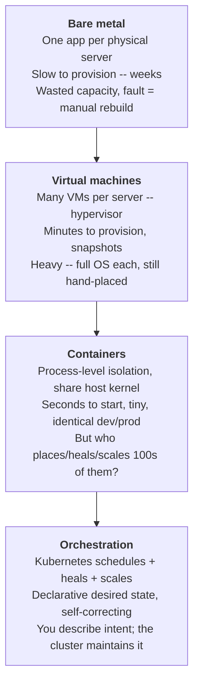
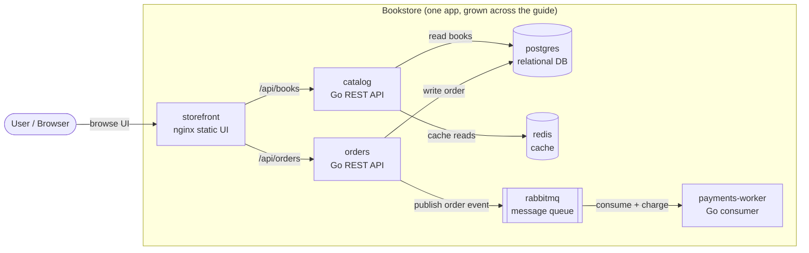

# 01 — Why Kubernetes

> The problems that pushed the industry from hand-managed servers to a
> self-healing, declarative cluster — and the problems Kubernetes deliberately
> leaves to you.

**Estimated time:** ~15 min read · (no hands-on)
**Prerequisites:** (none — foundational)
**You'll know after this:** • recognize the recurring operational problems Kubernetes solves · • articulate the control-loop "describe once, keep true" mental model · • name what Kubernetes deliberately leaves to you · • read the rest of the guide without "what is this" friction · • justify a Kubernetes adoption decision in plain words

<!-- tags: foundations, core-objects, why-kubernetes, mental-model -->

## Why this exists

Running one program on one server is easy. Running *dozens of services*,
*reliably*, *at changing scale*, *across many machines*, *while you keep
shipping changes* is not. Every team that grows past a single box re-discovers
the same hard problems:

- A machine dies at 03:00. Who restarts the processes that were on it, and
  *where*?
- Traffic triples for a sale. Who starts more copies, and how do callers find
  the new ones?
- You deploy a bad version. How do you roll back *without* downtime, and how do
  you know it was bad?
- Service A needs to talk to service B, but B's IP changed when it moved. How
  does A keep finding B?
- Ten services need 4 CPUs total and you have three 8-CPU machines. Who decides
  what runs where so nothing is starved and nothing is wasted?

Before Kubernetes these were solved with runbooks, cron jobs, bash, a load
balancer someone edited by hand, and a pager. That works until it doesn't —
usually at the worst time. **Kubernetes exists to turn those manual,
error-prone, 03:00 tasks into an automated control system you describe once and
the cluster keeps true.** It is, at its core, a machine that continuously makes
reality match a description you give it.

This chapter is the *why*. No `kubectl` yet — that starts in
[chapter 07](07-local-cluster-setup.md). Here we earn the concepts so the rest
of the guide is "of course" instead of "what is this".

## Mental model

Kubernetes is a **control loop over a pool of machines**. You hand it a
*desired state* ("I want 3 copies of the catalog API, reachable at a stable
name, version 1.4"). A set of controllers continuously **observe** what is
actually running, **compare** it to what you asked for, and **act** to close
the gap — starting containers, replacing dead ones, wiring up networking,
moving work off failed nodes. You stop *operating servers* and start
*declaring intent*; the cluster becomes the operator. Everything else in this
guide is a specific desired-state object and the controller that reconciles it.

## The road here: metal → VMs → containers → orchestration

Each step solved the previous step's biggest pain and exposed the next one.



- **Bare metal.** One workload per server so a crash or a noisy neighbor can't
  take down others. Provisioning meant a purchase order and a data-center
  visit. Utilization was terrible (a server averaging 10% CPU still drew full
  power and rent), and recovery from a hardware fault was a manual rebuild.
- **Virtual machines.** A hypervisor slices one physical host into many VMs,
  each with its *own full guest OS*. Provisioning dropped to minutes;
  snapshots and live migration appeared. But every VM carries an entire
  operating system (gigabytes, its own boot, its own patching), and *placement*
  of VMs onto hosts was still a human decision.
- **Containers.** A container is just **host processes that are isolated and
  resource-limited by the Linux kernel** (namespaces + cgroups — detailed in
  [chapter 02](02-containers-and-images.md)). No guest OS: containers share the
  host kernel, start in milliseconds, are megabytes not gigabytes, and ship the
  app *with its dependencies* so "works on my machine" becomes "works
  everywhere". This made it cheap to split a system into many small services —
  which created a new problem: now there are *hundreds* of short-lived things
  to place, connect, watch, restart, and scale, across many machines. Doing
  that by hand does not work.
- **Orchestration.** Kubernetes (open-sourced by Google in 2014, descended from
  its internal Borg system; now a CNCF project) is the layer that owns those
  hundreds of containers *for you*: it decides which machine each runs on,
  restarts the ones that die, scales them with load, gives them stable
  addresses, and rolls out new versions safely — all driven by a description
  you submit, not commands you run.

## The reconciliation loop (the one idea to keep)

Every Kubernetes feature is an instance of one pattern: a controller drives
**actual state** toward **desired state**, forever.

```
        you submit / change
   ┌───────────────────────────┐
   │   DESIRED STATE            │   "3 catalog Pods, v1.4, port 8080"
   │   (what you declared)      │   stored in the cluster, durable
   └─────────────┬─────────────┘
                 │ compare
                 ▼
        ┌──────────────────┐        observe        ┌───────────────────┐
        │   CONTROLLER     │ ───────────────────►   │   ACTUAL STATE    │
        │  observe→diff→act│ ◄───────────────────   │  (what's running) │
        └────────┬─────────┘        diff            └───────────────────┘
                 │ act (create / delete / update)
                 ▼
        e.g. only 2 Pods running, 1 crashed
        →  controller starts 1 replacement
        →  loop again ... (never stops)
```

This loop is **level-triggered**, not edge-triggered: it does not react to
*events* ("a Pod died") and then forget. It repeatedly looks at the *current
level* ("how many Pods exist right now vs. how many I want") and corrects any
gap, no matter how the gap appeared (crash, node failure, someone deleted one,
a network blip). That is why Kubernetes is *self-healing by construction*: heal
is not a special code path, it is the normal loop finding a difference. We
formalize this in [chapter 06](06-declarative-api-model.md).

## What Kubernetes solves

| Problem | Without orchestration | What Kubernetes gives you |
|---|---|---|
| **Scheduling / bin-packing** | You pick which server runs what | The scheduler places workloads onto nodes by available CPU/memory and constraints ([Part 04](../04-scheduling/01-scheduler-and-nodes.md)) |
| **Self-healing** | Pager + manual restart | Dead containers restarted; work off failed nodes rescheduled automatically |
| **Horizontal scaling** | Manually start/stop copies | Declare a replica count, or autoscale on metrics ([autoscaling](../06-production-readiness/04-autoscaling.md)) |
| **Service discovery & LB** | Hand-edited config / load balancer | Stable virtual IPs + cluster DNS; traffic spread across healthy copies ([Services](../02-networking/02-services.md)) |
| **Rollouts & rollback** | Risky scripted deploys | Controlled rolling updates with health gates and one-command rollback ([Deployments](../01-core-workloads/04-replicasets-and-deployments.md)) |
| **Configuration & secrets** | Baked into images / on disk | Externalized config and secrets injected at runtime ([Part 03](../03-config-and-storage/01-configmaps.md)) |
| **Storage** | Manual mounts tied to a host | Dynamic volume provisioning that follows the workload ([persistent storage](../03-config-and-storage/04-persistent-storage.md)) |
| **Declarative ops** | Imperative, drift-prone | One source of truth the cluster continuously enforces |

## What Kubernetes does *not* solve

Just as important — these are *yours*, Kubernetes will not do them for you:

- **It does not build or test your code.** No CI. You bring images; a pipeline
  builds them ([CI/CD](../07-delivery/03-cicd-pipeline.md)). Kubernetes runs
  containers; it does not produce them.
- **It is not a PaaS.** No `git push` to deploy, no built-in app marketplace,
  no opinionated language buildpacks. It gives primitives; you (or Helm/Argo
  CD in [Part 07](../07-delivery/01-packaging-helm.md)) compose the experience.
- **It does not make a bad architecture good.** A stateful, chatty monolith
  with no health checks is still that, now harder to debug. Kubernetes rewards
  designs that already follow [twelve-factor](https://12factor.net/)-style
  principles (stateless processes, config from environment, graceful shutdown —
  exactly what the Bookstore services do).
- **It does not run your database for you by default.** It can *host*
  stateful workloads ([StatefulSets](../01-core-workloads/05-statefulsets.md)),
  but backups, failover, and tuning of a production database remain real work
  (or a managed cloud service / an operator).
- **It is not application-level observability or security on its own.** It
  exposes signals and primitives; you must wire metrics, logs, tracing
  ([Part 06](../06-production-readiness/01-observability-metrics.md)) and
  identity/policy ([Part 05](../05-security/01-authn-authz-rbac.md)).
- **It does not eliminate operations.** It *changes* the job — from
  babysitting servers to operating a platform (upgrades, capacity, multi-tenancy
  — [Part 08](../08-day-2-operations/01-cluster-lifecycle.md)).

> **In production:** the cluster itself is now a critical system to operate.
> "We run Kubernetes" replaces a class of toil with a *new* class:
> control-plane upgrades, version skew, etcd backups, capacity planning, and
> blast-radius/multi-tenancy decisions. Managed control planes (EKS/GKE/AKS)
> remove some of this, not all. Budget for it.

## Two framings you will keep meeting

### Pets vs. cattle

A **pet** server is unique, named, hand-fed, and irreplaceable — if it gets
sick you nurse it back. **Cattle** are identical, numbered, and disposable — if
one is unhealthy you replace it without ceremony. Kubernetes is built for
cattle: workloads are interchangeable replicas the cluster freely kills,
reschedules, and recreates. This is *why* self-healing and rollouts are safe —
losing any single instance is a non-event. It also explains a hard rule you'll
see throughout: **don't store irreplaceable state inside a disposable
workload**; push it to managed storage so the workload stays cattle. (Even
"stateful" workloads in Kubernetes are designed to be replaceable units whose
*data* lives on attached volumes, not in the container.)

### Imperative vs. declarative

- **Imperative** = a sequence of commands describing *how*: "start a container;
  if it dies, start another; now start two more; update the load balancer".
  You own the steps and every failure path.
- **Declarative** = a description of the *desired end state*, the *what*: "there
  should be 3 of these, version 1.4, reachable here". You submit it; the
  cluster figures out the steps and *keeps* it true even after failures.

Kubernetes is fundamentally declarative — you will write YAML that *describes*,
not scripts that *do*. You *can* drive it imperatively (handy for learning and
debugging — used in [chapter 07](07-local-cluster-setup.md)), but production
uses declarative manifests under version control so the desired state is
reviewable, auditable, and reproducible. This is the heart of
[chapter 06](06-declarative-api-model.md) and of GitOps in
[Part 07](../07-delivery/04-gitops-argocd.md).

## When *not* to use Kubernetes

Kubernetes is not free; it is a system you must learn and operate. Prefer
something simpler when:

- **One or a few stateless services, modest scale.** A single VM with a process
  manager, or a PaaS/serverless platform (Cloud Run, App Runner, Fly,
  Render, Lambda), ships faster with far less to operate.
- **A purely static site.** Object storage + a CDN beats a cluster.
- **A small team with no platform capacity.** The control plane, upgrades, and
  failure modes are real ongoing cost; if no one can own that, a managed
  higher-level platform is the responsible choice.
- **Hard real-time / specialized hardware with no tolerance for the scheduler's
  abstractions.** Possible on Kubernetes, but the abstraction may fight you.

Reach for Kubernetes when you have **multiple services that must be scaled,
healed, networked, and released independently and continuously**, and you have
(or will build) the capacity to operate a platform. The Bookstore is
deliberately exactly that shape.

> **In production:** "Could a managed PaaS do this?" is a legitimate first
> question, not heresy. Choosing Kubernetes should be a deliberate trade
> (flexibility and portability *for* operational cost), not a default. This
> guide assumes you've made that trade and want to do it well.

## Hands-on with the Bookstore

No cluster yet — but the example app you'll grow for the rest of the guide is
worth meeting now, because every later chapter adds a Kubernetes concept *to
it*. The Bookstore is a small e-commerce system split into independent
services precisely so each Kubernetes primitive has a real reason to exist.

The seven services and *why each one earns its place in the curriculum*:

| Service | What it is | The Kubernetes concept it will motivate |
|---|---|---|
| `storefront` | Static web UI (nginx) | A stateless Deployment + how the edge exposes it (Ingress) |
| `catalog` | Go REST API, lists books | The first **Pod**, then Deployment, Service, **HPA** (scales on load) |
| `orders` | Go REST API, places orders | A second service → Service discovery, config, the async path |
| `payments-worker` | Go background consumer | A non-web workload: queue-driven, scaled differently (KEDA) |
| `postgres` | Relational database | **Stateful** workload: StatefulSet + persistent storage + a migration Job |
| `redis` | Cache | A simple in-cluster dependency / sidecar-adjacent concerns |
| `rabbitmq` | Message queue | Decoupling services; the producer/consumer (async) pattern |

How they relate (this is the system you'll be standing up, end to end):



Note the deliberate shapes you'll exploit later: `catalog` is a *read-heavy
stateless API* (a clean autoscaling story); `orders` *writes then publishes*
(introduces async decoupling); `payments-worker` *has no HTTP traffic at all*
(scales on queue depth, not requests); `postgres` is the one piece that *must
not* be treated as cattle (it owns the data). The source for every service is
real and the images build — see
[`examples/bookstore/app/`](../examples/bookstore/app/README.md). In
[chapter 02](02-containers-and-images.md) you'll containerize `catalog`; in
[chapter 06](06-declarative-api-model.md) you'll write its first manifest; in
[chapter 07](07-local-cluster-setup.md) you'll run it on a real cluster.

## How it works under the hood

Even at this altitude, three structural facts explain everything that follows:

1. **There is a single source of truth.** The cluster's desired *and* observed
   state lives in a consistent key-value store (etcd), reachable only through
   one gateway, the API server. You never edit machines directly; you change
   the desired state in that store, and controllers do the rest. (Internals:
   [chapter 04](04-control-plane-deep-dive.md).)
2. **The system is a set of independent controllers, not one big program.**
   Each controller watches the part of the desired state it owns and reconciles
   just that (one keeps Pod counts right, one programs Service load balancing,
   one provisions storage…). They don't call each other; they each watch the
   store and act. This decoupling is why Kubernetes is extensible and resilient
   — a controller crashing degrades *one* capability, not the cluster, and on
   restart it simply re-observes and resumes. (Internals:
   [chapter 04](04-control-plane-deep-dive.md).)
3. **Control plane vs. worker nodes.** A small **control plane** holds the
   truth and makes decisions (API server, store, scheduler, controllers).
   Many **worker nodes** actually run your containers; an agent on each node
   (the kubelet) pulls the slice of desired state assigned to it and makes its
   machine match. (Internals: [chapter 03](03-architecture-overview.md) for the
   map, [chapter 05](05-node-components.md) for the node agent.)

Hold those three and the rest of this part is just detail and naming.

## Production notes

> **In production:** the failure model inverts in a good way — *individual
> instance death is expected and handled*, so you design for "any Pod can
> vanish at any time" (graceful shutdown, no local irreplaceable state,
> readiness gating). The Bookstore services already do this (e.g. `catalog`
> handles `SIGTERM` and drains in-flight requests — see
> [chapter 02](02-containers-and-images.md)); apps that don't will fight the
> platform.

> **In production:** Kubernetes is *portable but not uniform*. The objects
> (Pods, Services…) are identical on EKS, GKE, AKS, on-prem, and your laptop's
> kind cluster — that's the point and the value. But the *plumbing underneath*
> differs: how a `Service` of type `LoadBalancer` gets a real IP, which storage
> class exists, how nodes are added, how the control plane is upgraded. This
> guide teaches the portable core locally; every chapter's `In production:`
> callouts flag where the cloud substrate diverges.

> **In production:** an anti-pattern to retire now — "lift and shift a pet into
> a Pod". Putting a hand-tuned, stateful, manually-recovered server into a
> single Pod and stopping there gives you all of Kubernetes' cost and none of
> its benefit. The win comes from workloads that are *replicas the cluster may
> freely replace*. Designing for that is a recurring theme of this guide.

## Quick Reference

This chapter is conceptual — no commands yet. The takeaways to carry forward:

- **Kubernetes = a reconciliation loop over a machine pool.** You declare
  desired state; controllers continuously make actual state match it.
- **It solves:** scheduling, self-healing, scaling, service discovery,
  rollouts/rollback, config/secrets, storage orchestration, declarative ops.
- **It does not solve:** building/testing code (CI), being a PaaS, fixing bad
  architecture, fully running your database, app-level observability/security,
  or eliminating operations.
- **Cattle, not pets.** Workloads are interchangeable, disposable replicas.
- **Declarative, not imperative.** Describe the *what*; the cluster owns the
  *how* and keeps it true.
- **Maybe don't:** few stateless services / static sites / no platform
  capacity → a simpler PaaS or single VM is the right call.

Readiness checklist before adopting Kubernetes for real:

- [ ] Multiple services that must scale/heal/release independently (not one app)
- [ ] Workloads are (or can be made) stateless/replaceable; state pushed out
- [ ] Apps handle `SIGTERM` and expose health endpoints
- [ ] Someone owns the platform: upgrades, capacity, backups, security
- [ ] A managed PaaS was considered and consciously ruled out
- [ ] CI exists (or is planned) to build/test images — Kubernetes won't

## Test your understanding

> Try each before opening the answer drawer. The act of trying is the exercise; the answer is the check.

1. **Why is "level-triggered" reconciliation the architectural choice that gives Kubernetes self-healing, and what would break if controllers were "edge-triggered" instead?**
   <details><summary>Show answer</summary>

   Level-triggered means controllers continuously compare current actual state to declared desired state and close the gap, regardless of how the gap appeared. An edge-triggered system reacts only to *events* — if a controller is down or a network blip drops the "Pod died" notification, that event is lost forever and reality stays wrong. With level-triggered, missed events don't matter because the next observation re-derives the truth (see §The reconciliation loop).

   </details>

2. **A teammate says "let's move our 3-node, single-region API service from a single VM to Kubernetes for the auto-restart and HA". You think the trade isn't worth it. What's the strongest argument against, given Kubernetes' "what it does not solve" list?**
   <details><summary>Show answer</summary>

   The cluster itself becomes a critical system to operate: control-plane upgrades, etcd backups, version skew, capacity planning, and worker patching are now your job. A small team running 3 stateless instances behind one load balancer can get the same auto-restart + HA from a PaaS (Cloud Run/App Runner) or a process manager + multi-AZ ASG with vastly less platform toil (see §What Kubernetes does not solve and §When *not* to use Kubernetes).

   </details>

3. **You're explaining to a developer why "lift and shift a pet server into a Pod" is an anti-pattern even though it technically works. What's the core argument?**
   <details><summary>Show answer</summary>

   Kubernetes assumes workloads are cattle — interchangeable replicas the cluster freely kills and reschedules. A pet (stateful, hand-tuned, manually-recovered) running as one Pod gets none of the cluster's heal/scale/rollout benefits and pays all of Kubernetes' operational cost. You bought the platform for behavior the workload can't take advantage of (see §Pets vs. cattle and §Production notes).

   </details>

4. **Hands-on extension: write a one-page architecture sketch for the Bookstore's `payments-worker` that explains *why* it earns its place in the curriculum. What does it test about Kubernetes that the HTTP services don't?**
   <details><summary>What you should see</summary>

   You should arrive at: `payments-worker` has no HTTP traffic and no readiness from a probe in the usual sense — it scales on *queue depth*, not on requests. That motivates a different autoscaler (KEDA), a different graceful-shutdown story (drain in-flight messages, not requests), and Jobs-style thinking. If your sketch only says "it's a background process", you've missed the point — Hint: re-read the Bookstore table in §Hands-on with the Bookstore.

   </details>

## Further reading

- **Poulton, _The Kubernetes Book_, ch.1** — "Kubernetes primer": the
  bare-metal → VM → container → orchestration story and what Kubernetes is for.
- **Lukša, _Kubernetes in Action_ 2e, ch.1** — "Introducing Kubernetes":
  motivation, the move to microservices/containers, and the declarative model.
- **Ibryam & Huß, _Kubernetes Patterns_ 2e, ch.1** — "Introduction": the
  cloud-native principles and reconciliation mindset this guide builds on.
- Official: <https://kubernetes.io/docs/concepts/overview/> — "Overview" and
  "What is Kubernetes" (the project's own framing of these problems).
