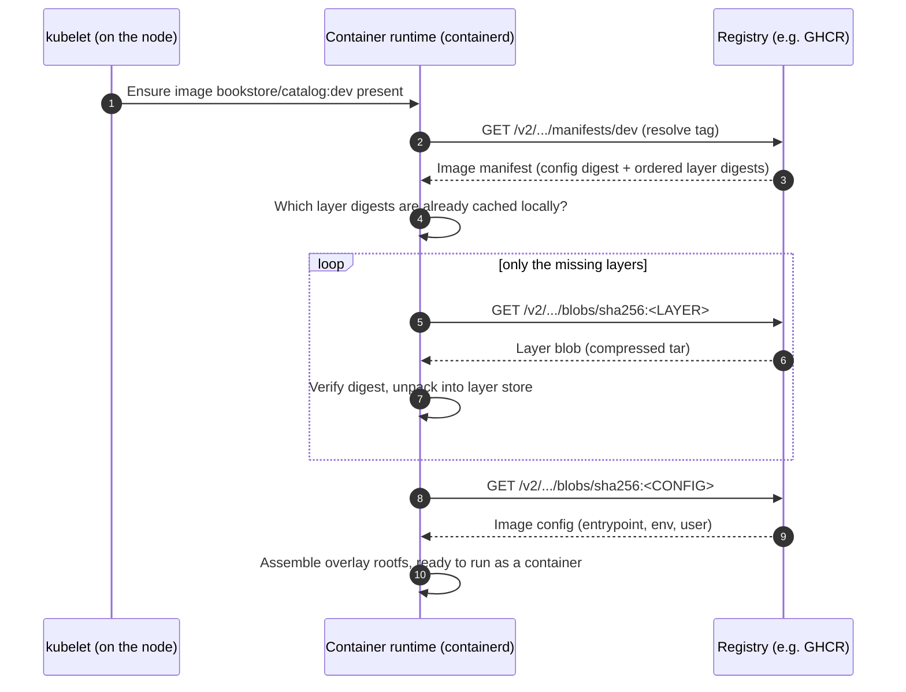

# 02 — Containers and images

> What a container actually is (Linux kernel features, not magic), how an
> image is built, addressed, and pulled — taught by building the real
> Bookstore `catalog` image.

**Estimated time:** ~15 min read · ~30 min hands-on
**Prerequisites:** [Part 00 ch.01](01-why-kubernetes.md) — why Kubernetes runs containers
**You'll know after this:** • explain what a Linux container actually is (namespaces + cgroups, not a VM) · • read and write a small multi-stage `Dockerfile` · • understand image references (registry/repo:tag@digest) and the image-pull flow · • build and push the Bookstore `catalog` image · • recognize the layers, OCI standard, and distroless/non-root patterns

<!-- tags: foundations, containers, images, dockerfile, oci -->

## Why this exists

Kubernetes runs **containers**. Every Pod is one or more containers; every
deploy ships **images**. If "container" and "image" are fuzzy, everything above
them (Pods, probes, registries, image pull policy, supply-chain security) is
fuzzy too. The errors you will hit most as a beginner — `ImagePullBackOff`,
`CrashLoopBackOff`, "works locally, fails in the cluster", a 900 MB image that
takes forever to pull, "why is it running as root?" — are *all* container/image
problems, not Kubernetes problems. This chapter makes the foundation concrete so
the rest of the guide stands on rock.

We do it the way the whole guide works: by building the **actual** image for
the Bookstore `catalog` service (a real Go API you'll deploy in
[chapter 06](06-declarative-api-model.md) and
[chapter 07](07-local-cluster-setup.md)) and explaining every line of its real
`Dockerfile`.

## Mental model

An **image** is a read-only, content-addressed *filesystem + metadata* — a
frozen template of "everything this program needs to run". A **container** is
*a normal Linux process* (or a few) started from that image, then **isolated**
(it sees its own filesystem, process tree, network, hostname) and
**constrained** (capped CPU/memory) by the Linux kernel. There is no
"lightweight VM" inside — same kernel as the host, just fenced off. Build once
→ an immutable image; run that image many times → many identical, disposable
containers. That immutability + identicality is exactly what makes the
"cattle" model and reproducible rollouts of
[chapter 01](01-why-kubernetes.md) possible.

## Containers vs. VMs

```
   VIRTUAL MACHINES                     CONTAINERS
   ┌───────────┐ ┌───────────┐          ┌───────────┐ ┌───────────┐
   │   App A   │ │   App B   │          │   App A   │ │   App B   │
   │  bins/libs│ │  bins/libs│          │  bins/libs│ │  bins/libs│
   │ Guest OS  │ │ Guest OS  │  <- full ├───────────┴─┴───────────┤
   │ (kernel)  │ │ (kernel)  │     OS   │   Container runtime     │
   ├───────────┴─┴───────────┤    each  ├─────────────────────────┤
   │       Hypervisor        │          │    Host OS (one kernel) │  <- shared
   ├─────────────────────────┤          ├─────────────────────────┤
   │       Host hardware     │          │      Host hardware      │
   └─────────────────────────┘          └─────────────────────────┘
   Isolation: strong (own kernel)       Isolation: process-level (shared kernel)
   Start: tens of seconds               Start: milliseconds
   Size: GBs (whole OS per VM)          Size: MBs (just app + libs)
```

A VM virtualizes *hardware* and runs a whole guest OS per instance — strong
isolation, heavy. A container virtualizes the *OS*: all containers on a host
share that host's single kernel and are merely isolated from each other by
kernel features. That's why a container starts in milliseconds and is
megabytes: there's no second OS to boot or carry. The trade is a weaker
isolation boundary (a shared kernel is a shared attack surface) — which is why
[Pod security](../05-security/02-pod-security.md) and not running as root
matter, and why some platforms add a thin VM around containers (gVisor, Kata)
when stronger isolation is required.

## How it works under the hood

### A container is namespaces + cgroups (+ a root filesystem)

There is no single "container" object in Linux. A container is the combination
of three kernel mechanisms applied to a process:

1. **Namespaces — what the process can *see* (isolation).** Each namespace type
   gives the process its own private view of one kind of global resource:

   | Namespace | Isolates | Effect inside the container |
   |---|---|---|
   | `pid` | Process IDs | Its own PID tree; the entrypoint is PID 1 |
   | `net` | Network stack | Own interfaces, IPs, routing, ports |
   | `mnt` | Mount points | Its own filesystem tree (the image's rootfs) |
   | `uts` | Hostname/domain | Its own hostname |
   | `ipc` | SysV IPC / shm | Isolated shared-memory & semaphores |
   | `user` | UID/GID mapping | Can map container-root → unprivileged host UID |
   | `cgroup` | cgroup root view | Hides the host's cgroup hierarchy |

   This is *why a container "feels like" its own machine* — it has its own
   process list, network, and filesystem — while actually being host processes.

2. **cgroups (control groups) — what the process can *use* (limits).** cgroups
   account for and cap CPU, memory, I/O, and PIDs for a group of processes.
   This is the kernel feature behind Kubernetes resource
   `requests`/`limits` ([resources & QoS](../01-core-workloads/03-resources-and-qos.md)):
   a memory limit is a cgroup limit; exceed it and the kernel OOM-kills the
   process — which surfaces as a restart in Kubernetes.

3. **A root filesystem** unpacked from the image and mounted (typically via an
   overlay filesystem — see layers below), so the process sees the image's
   `/usr`, `/bin`, app binary, etc., not the host's.

```
 HOST KERNEL (one, shared)
 ├── cgroup: catalog  (cpu.max=… , memory.max=512Mi)   ← limits (what it can USE)
 │   └── namespaces { pid, net, mnt, uts, ipc, user }  ← isolation (what it can SEE)
 │       └── PID 1: /catalog            (the Go process; its own /, own net)
 └── cgroup: redis
     └── namespaces { … }
         └── PID 1: redis-server
 (Same kernel underneath both. "Container" = process + its namespaces + its cgroup + its rootfs)
```

Kubernetes does not call these syscalls itself. The kubelet asks a **container
runtime** (containerd via the CRI) to do it; the runtime (through `runc`)
creates the namespaces and cgroups. That chain is
[chapter 05](05-node-components.md).

### Images: the OCI spec, layers, content addressing

An image is standardized by the **OCI Image Specification**. It is *not* a
single blob; it is:

- a **manifest** (JSON) listing the config + the ordered layers,
- a **config** (JSON: entrypoint, env, user, working dir, architecture),
- one or more **layer** tarballs (the filesystem, in diffs).

**Layers.** Each build instruction that changes the filesystem produces a
layer — a *diff* over the layer below. At run time the layers are stacked
read-only via an overlay filesystem, plus a thin writable layer on top for that
container instance (discarded when the container is removed — this is why
in-container writes are ephemeral and why state must go to
[volumes](../03-config-and-storage/03-volumes.md)).

**Content addressing.** Every layer and the config are referenced by the SHA-256
**digest** of their content (e.g. `sha256:9b2a…`). Identical content ⇒ identical
digest ⇒ stored and pulled **once** and shared across images and nodes. This is
why a small base layer shared by many services is cheap, and why image **digests
are immutable** (the name is the hash of the bytes; change a byte → different
digest).

**Tags vs. digests.**

- A **tag** (`bookstore/catalog:dev`, `nginx:1.27`) is a *mutable human label*
  that points at a digest *today*. It can be re-pointed tomorrow — `:latest`
  especially is a moving target.
- A **digest** (`bookstore/catalog@sha256:…`) names *exact* bytes, forever.

> **In production:** pin by **digest** (or an immutable, never-reused tag) so a
> rollout is byte-for-byte reproducible and a rollback returns to the *exact*
> prior image. Never deploy `:latest` to production — two nodes can pull two
> different images under the same name, and `imagePullPolicy` interacts badly
> with it. ([Supply chain](../05-security/03-supply-chain.md) goes deeper:
> signing and provenance.)

### Registries and the pull flow

A **registry** (Docker Hub, GHCR, ECR/GCR/ACR, Harbor) is content-addressed
storage for images, speaking the OCI Distribution API. When a node needs an
image it does **not** download one big file — it fetches the manifest, then
only the layers it doesn't already have cached:



Consequences you will rely on later: layer caching makes redeploys of a changed
top layer fast even if the base is huge; a private registry needs an
`imagePullSecret`; `imagePullPolicy` (`IfNotPresent` / `Always` / `Never`)
decides whether step 2 even contacts the registry — central to the local
`kind load` trick in [chapter 07](07-local-cluster-setup.md).

### Building minimal images: multi-stage and distroless

Two ideas make images small, fast to pull, and safe — and the `catalog`
Dockerfile uses both:

- **Multi-stage build.** Use a big toolchain image to *compile*, then `COPY`
  only the resulting artifact into a tiny final image. The compiler, source,
  and module cache never reach the shipped image.
- **Minimal / distroless base.** `gcr.io/distroless/static` contains *no shell,
  no package manager, no busybox* — essentially just CA certs and the
  files needed to run a static binary. Smaller (faster pulls, less storage),
  and a drastically smaller attack surface (no `sh` for an attacker to use, far
  fewer CVEs to patch). The `nonroot` variant additionally bakes in an
  unprivileged user.

## Hands-on with the Bookstore: build & run `catalog`

We now containerize the first real Bookstore service. The source lives at
[`examples/bookstore/app/catalog/`](../examples/bookstore/app/catalog/) and is
a tiny Go HTTP API: it serves `GET /books` (in-memory sample unless `DB_DSN` is
set), and exposes `GET /healthz`, `GET /readyz`, `GET /metrics`. It reads the
port from `PORT` (default `8080`) and shuts down gracefully on `SIGTERM`.

### The real Dockerfile, line by line

This is the **actual** file at
[`examples/bookstore/app/catalog/Dockerfile`](../examples/bookstore/app/catalog/Dockerfile)
(read it yourself — it is intentionally short):

```dockerfile
# syntax=docker/dockerfile:1
# Multi-stage build -> single static binary on distroless (nonroot).
# Built and referenced by chapters as: bookstore/catalog:dev

FROM golang:1.26-alpine AS build
WORKDIR /src

# Cache module downloads separately from source for faster rebuilds.
COPY go.mod go.sum* ./
RUN go mod download

COPY . .
# CGO disabled => fully static binary that runs on scratch/distroless-static.
RUN CGO_ENABLED=0 GOOS=linux go build -trimpath -ldflags="-s -w" -o /out/catalog .

FROM gcr.io/distroless/static:nonroot
WORKDIR /
COPY --from=build /out/catalog /catalog
# 65532 is the "nonroot" UID/GID in distroless images.
USER 65532:65532
EXPOSE 8080
ENTRYPOINT ["/catalog"]
```

What each line does and *why it is written this way*:

- **`# syntax=docker/dockerfile:1`** — selects the current BuildKit Dockerfile
  frontend (stable v1 line), enabling modern build features regardless of the
  local Docker version.
- **`FROM golang:1.26-alpine AS build`** — stage 1, named `build`. A full Go
  toolchain (on small Alpine) used *only to compile*. Nothing in this stage
  ships.
- **`WORKDIR /src`** — sets/creates the working directory for subsequent
  commands in this stage.
- **`COPY go.mod go.sum* ./` then `RUN go mod download`** — copy *only* the
  dependency manifests first and download modules. This is deliberate **layer
  cache** engineering: dependencies change rarely, so as long as `go.mod`/
  `go.sum` are unchanged, Docker reuses the cached "download" layer and skips
  re-fetching modules on every code edit. (`go.sum*` — the `*` tolerates the
  file being absent.)
- **`COPY . .`** — now copy the rest of the source. This layer invalidates on
  any code change, but the expensive module layer above it stays cached.
- **`RUN CGO_ENABLED=0 GOOS=linux go build -trimpath -ldflags="-s -w" -o /out/catalog .`**
  — compile. `CGO_ENABLED=0` produces a **fully static** binary (no libc
  dependency) so it can run on a base with *no* shared libraries.
  `GOOS=linux` targets the container OS. `-trimpath` strips local filesystem
  paths (reproducibility/privacy). `-ldflags="-s -w"` drops the symbol table
  and DWARF debug info (smaller binary). Output goes to `/out/catalog`.
- **`FROM gcr.io/distroless/static:nonroot`** — stage 2 starts a brand-new,
  tiny final image: distroless static (just CA certs + the minimum to run a
  static binary), `nonroot` variant (a built-in unprivileged user, UID 65532).
- **`WORKDIR /`** — final image working directory.
- **`COPY --from=build /out/catalog /catalog`** — copy *only* the compiled
  binary out of the `build` stage. The toolchain, source, and module cache are
  all left behind. The shipped image is essentially `{CA certs} + {one binary}`.
- **`USER 65532:65532`** — run as the non-root `nonroot` UID/GID. The
  container does not run as root even before Kubernetes adds its own
  [security context](../05-security/02-pod-security.md).
- **`EXPOSE 8080`** — documents the listening port (metadata; does not publish
  anything by itself). Matches the app's default `PORT`.
- **`ENTRYPOINT ["/catalog"]`** — exec form: PID 1 in the container *is* the Go
  binary directly (no shell wrapper), so it receives `SIGTERM` and runs its
  graceful-shutdown path — which is exactly what Kubernetes needs for clean
  rollouts and Pod termination ([health & lifecycle](../01-core-workloads/02-health-and-lifecycle.md)).

The result: a tiny, static, non-root, single-process image — textbook input
for Kubernetes.

### Build and run it locally

> Prerequisites: a running Docker-compatible daemon (Docker Engine, or
> Rancher Desktop/Podman/etc.). If `docker …` reports "Cannot connect to the
> Docker daemon", start your engine first. If your engine does not expose the
> default `/var/run/docker.sock`, point Docker at its socket via `DOCKER_HOST`
> (see your engine's docs for the socket path).

```sh
# from the repo root
cd full-guide/examples/bookstore/app

# Build the image (tag it exactly as later chapters expect)
docker build -t bookstore/catalog:dev ./catalog

# How small is it? (distroless + static binary → tens of MB)
docker image ls bookstore/catalog:dev

# Run it as a plain container, publish container :8080 to host :8080,
# pass the PORT env the app reads (default is already 8080; shown for clarity)
docker run --rm -p 8080:8080 -e PORT=8080 --name catalog bookstore/catalog:dev
```

In another terminal, exercise the same endpoints Kubernetes will later use as
health probes:

```sh
curl -s localhost:8080/healthz   ; echo   # {"status":"ok"}
curl -s localhost:8080/readyz    ; echo   # {"status":"ready"} (no DB/Redis configured)
curl -s localhost:8080/books     | head   # the in-memory sample catalog (JSON array)
```

Stop it. From the foreground terminal `Ctrl-C` sends **SIGINT**; from another
terminal `docker stop catalog` sends **SIGTERM** (then **SIGKILL** if the
process hasn't exited within the grace period). The key point: because
`ENTRYPOINT` is exec-form, the Go binary is **PID 1** and receives *either*
signal **directly** (no shell to swallow it), so it runs its handler and you'll
see it log `shutdown signal received` then `shutdown complete`. This matters
for Kubernetes specifically: on Pod termination the kubelet sends **SIGTERM**
to PID 1 (then SIGKILL after `terminationGracePeriodSeconds`), so exec-form
`ENTRYPOINT` is exactly what makes graceful shutdown — and clean rollouts —
work ([health & lifecycle](../01-core-workloads/02-health-and-lifecycle.md)).
Inspect the image's baked-in metadata to connect it back to the spec:

```sh
docker image inspect bookstore/catalog:dev \
  --format 'Entrypoint={{.Config.Entrypoint}} User={{.Config.User}} Exposed={{.Config.ExposedPorts}}'
# Entrypoint=[/catalog] User=65532:65532 Exposed=map[8080/tcp:{}]
```

You now have `bookstore/catalog:dev` — the exact image
[chapter 06](06-declarative-api-model.md) writes a Pod manifest for and
[chapter 07](07-local-cluster-setup.md) loads into a kind cluster.

## Production notes

> **In production:** keep images **minimal and non-root**. Multi-stage +
> distroless/scratch (as `catalog` does) means fewer CVEs, faster pulls, no
> shell for an attacker, and a smaller blast radius. A "fat" image with a full
> distro and a root user is an anti-pattern carried straight into the cluster.

> **In production:** **pin by digest** (`image@sha256:…`) or immutable,
> never-reused tags; forbid `:latest`. Reproducible rollouts and exact
> rollbacks depend on the image name meaning *one* set of bytes.

> **In production:** build images in **CI**, not on a laptop, and **scan** them
> (Trivy/Grype) and ideally **sign** them (Cosign) with provenance, so what
> runs is traceable to a commit. Kubernetes runs whatever image you give it; it
> will not vet it for you ([supply chain](../05-security/03-supply-chain.md),
> [CI/CD](../07-delivery/03-cicd-pipeline.md)).

> **In production:** match the image **architecture** to your nodes (e.g.
> `arm64` vs `amd64`) or publish a multi-arch manifest list — a frequent cause
> of `exec format error` `CrashLoopBackOff` when a laptop-built `arm64` image
> lands on `amd64` nodes.

> **In production:** the host kernel is **shared** across all containers on a
> node — container isolation is *not* a security boundary as strong as a VM's.
> Defense in depth (drop capabilities, non-root, read-only rootfs, seccomp;
> stronger sandboxes where needed) is covered in
> [Pod security](../05-security/02-pod-security.md).

## Quick Reference

Core image/container commands (Docker; `nerdctl`/`podman` are near-identical):

```sh
docker build -t name:tag ./context        # build an image from a Dockerfile
docker image ls                            # list local images (+ sizes)
docker image inspect name:tag              # entrypoint, user, env, layers, digest
docker history name:tag                    # see the layers and what created each
docker run --rm -p 8080:8080 name:tag      # run a container, publish a port
docker run --rm -e PORT=8080 name:tag      # pass an env var the app reads
docker ps                                  # running containers
docker stop <ID> / docker rm <ID>          # stop / remove (sends SIGTERM then SIGKILL)
docker pull / docker push name:tag         # registry round-trip
# After `docker push`, read the immutable digest the registry assigned:
docker inspect --format '{{index .RepoDigests 0}}' name:tag   # -> name@sha256:<DIGEST>
# You then reference that name@sha256:<DIGEST> form in manifests (NOT via
# `docker tag`, which can only create another *tag*, never a digest).
```

Minimal production-shaped Dockerfile skeleton (multi-stage, non-root, static):

```dockerfile
# syntax=docker/dockerfile:1
FROM <TOOLCHAIN-IMAGE> AS build
WORKDIR /src
COPY <DEPS-MANIFEST> ./          # copy dep manifests first → cache deps
RUN <FETCH-DEPS>
COPY . .
RUN <build -> /out/app>          # produce a single, ideally static, artifact

FROM gcr.io/distroless/static:nonroot   # tiny, no shell, built-in nonroot user
COPY --from=build /out/app /app          # ship ONLY the artifact
USER 65532:65532
EXPOSE 8080
ENTRYPOINT ["/app"]              # exec form → app is PID 1, receives SIGTERM
```

Image checklist before it goes near a cluster:

- [ ] Multi-stage: no compiler/source/secrets in the final image
- [ ] Minimal base (distroless/scratch) where feasible
- [ ] Runs as a non-root user; no unnecessary capabilities
- [ ] `ENTRYPOINT` in exec form (PID 1 gets signals → graceful shutdown)
- [ ] Tagged immutably / referenced by digest in deployment manifests
- [ ] Correct target architecture (or multi-arch manifest)
- [ ] Built in CI, scanned, and ideally signed

## Test your understanding

> Try each before opening the answer drawer. The act of trying is the exercise; the answer is the check.

1. **Why are containers said to have a *weaker* isolation boundary than VMs, and what concrete Kubernetes defaults exist to compensate?**
   <details><summary>Show answer</summary>

   Containers on a node share one host kernel — a kernel CVE is a cross-container escape vector, whereas each VM has its own kernel. To compensate, Kubernetes pushes non-root users, dropped capabilities, read-only rootfs, seccomp, and (for very sensitive workloads) sandboxed runtimes like gVisor/Kata via RuntimeClass (see §Containers vs. VMs and §Production notes).

   </details>

2. **A teammate's Pod uses `image: bookstore/catalog:latest` and deploys two replicas. They report that one replica behaves differently from the other. What's the likely cause, and what's the fix?**
   <details><summary>Show answer</summary>

   `:latest` is a *mutable* tag — the two nodes pulled the image at different times and got different bytes under the same name. Default `imagePullPolicy` for `:latest` is `Always`, so each pull may see the registry at a different revision. Fix: pin by digest (`image@sha256:…`) or an immutable, never-reused tag so a name maps to exactly one set of bytes (see §Tags vs. digests and §Production notes).

   </details>

3. **The `catalog` Dockerfile copies `go.mod`/`go.sum` and runs `go mod download` *before* `COPY . .`. Explain the layer-cache reasoning. What would change if these two lines were swapped?**
   <details><summary>Show answer</summary>

   Docker invalidates a layer when its input changes, and every layer below the invalidation rebuilds. By copying dependency manifests first and downloading modules in a dedicated layer, that expensive layer stays cached as long as `go.mod`/`go.sum` are unchanged. Swapping the lines would invalidate `go mod download` on *any* source edit — every code change re-downloads modules from scratch (see §Hands-on: line-by-line, the `COPY go.mod` step).

   </details>

4. **Hands-on extension: rebuild the `catalog` image with `ENTRYPOINT ["sh", "-c", "/catalog"]` instead of exec form, then `docker stop catalog` and watch the logs. What changes, and why does this matter for Kubernetes Pod termination?**
   <details><summary>What you should see</summary>

   `sh -c` becomes PID 1; the Go binary becomes a child process. When Docker sends SIGTERM, the shell receives it and does *not* forward to the child, so you'll see no `shutdown signal received` log and Docker will SIGKILL after the grace period. In Kubernetes the kubelet sends SIGTERM to PID 1, so a Pod with shell-wrapped entrypoint cannot drain gracefully — rollouts cut connections mid-flight (see §Hands-on: stop it, §ENTRYPOINT exec form discussion).

   </details>

## Further reading

- **Poulton, _The Kubernetes Book_, ch.3** — containers and images as the unit
  Kubernetes schedules; building and running them.
- **Lukša, _Kubernetes in Action_ 2e, ch.2** — "Understanding containers":
  Linux namespaces & cgroups, images and layers, the OCI model, from first
  principles.
- **Ibryam & Huß, _Kubernetes Patterns_ 2e, ch.30 — "Image Builder"** — image
  build strategies and in-cluster builds (the supply-chain side of images).
- Official: <https://kubernetes.io/docs/concepts/containers/images/> — images,
  tags, digests, and pull policy as Kubernetes consumes them. OCI specs:
  <https://github.com/opencontainers/image-spec>.
