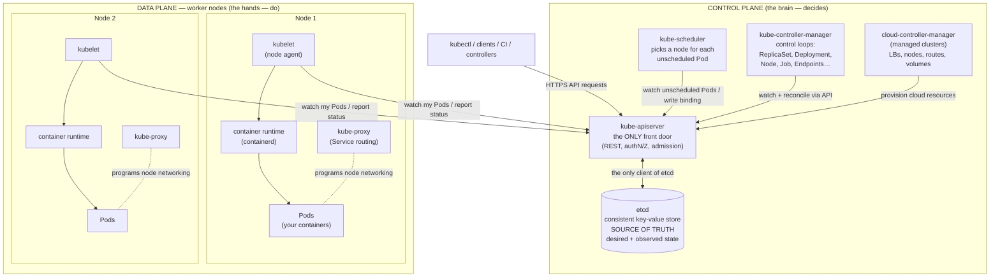
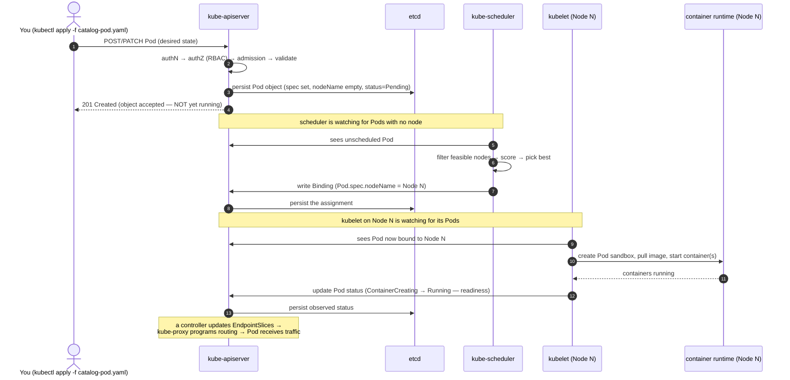

# 03 — Architecture overview

> The whole cluster on one page: control plane vs. data plane, every core
> component and what it owns, and the journey of a single `kubectl apply` from
> your terminal to a running container.

**Estimated time:** ~15 min read · (no hands-on)
**Prerequisites:** [Part 00 ch.01](01-why-kubernetes.md) — control-loop premise · [Part 00 ch.02](02-containers-and-images.md) — what a container is
**You'll know after this:** • name every control-plane and node-plane component and what it owns · • trace a `kubectl apply` from CLI through API server, etcd, scheduler, controller, kubelet, runtime · • distinguish control plane vs. data plane responsibilities · • explain the role of `etcd` as the single source of truth · • spot which component is at fault when something is broken

<!-- tags: foundations, architecture, control-plane, api-server, etcd -->

## Why this exists

You've seen *why* Kubernetes exists ([ch.01](01-why-kubernetes.md)) and *what*
it runs ([ch.02](02-containers-and-images.md)). Before going deep on any one
piece, you need the **map**: which components exist, which are the "brain" and
which are the "muscle", who is allowed to talk to whom, and what actually
happens between "I ran a command" and "a container is serving traffic". Without
this map, the later deep dives ([ch.04](04-control-plane-deep-dive.md),
[ch.05](05-node-components.md)) are a pile of names. With it, every later
chapter slots into a place you already understand. This chapter is *breadth*;
the next two are *depth*.

## Mental model

A Kubernetes cluster is **a brain plus a fleet of hands**, coordinated through
a single doorway and a single shared notebook.

- The **control plane** is the brain: it holds the desired and observed state
  (the notebook, etcd), exposes the *only* doorway in or out (the API server),
  and runs the deciders (scheduler, controllers) that figure out what should
  happen.
- The **worker nodes** are the hands: each runs an agent (kubelet) that reads
  the part of the notebook assigned to its machine and makes that machine
  match — pulling images, starting containers, wiring local networking.

You only ever talk to the doorway. You write *intent* into the notebook through
it; the brain's deciders turn intent into instructions; the hands carry them
out and write back what actually happened. This is the
[reconciliation loop](01-why-kubernetes.md#the-reconciliation-loop-the-one-idea-to-keep)
realized as concrete processes.

## The cluster, on one page



Two rules this picture encodes — internalize them now:

1. **Everything goes through the API server.** No component reads or writes
   etcd directly except the API server. The scheduler, controllers, kubelets,
   `kubectl`, and your own controllers all talk *only* to the API server. This
   single chokepoint is where authentication, authorization, validation, and
   admission happen — and it's why "secure the API server" is so central
   ([ch.04](04-control-plane-deep-dive.md),
   [Part 05](../05-security/01-authn-authz-rbac.md)).
2. **Components don't call each other; they watch shared state and react.** The
   scheduler doesn't phone the kubelet. It writes a decision to the API server;
   the kubelet, watching the API server, sees it and acts. This *level-triggered,
   shared-state* design ([ch.06](06-declarative-api-model.md)) is why the system
   is resilient and extensible: any component can crash and, on restart, simply
   re-reads current state and resumes — nothing is lost in transit.

## Control plane vs. data plane

| | Control plane | Data plane (worker nodes) |
|---|---|---|
| **Job** | Hold the truth; decide what should run where | Actually run the containers |
| **Components** | api-server, etcd, scheduler, controller-manager, (cloud-controller-manager) | kubelet, container runtime, kube-proxy, your Pods |
| **Talks to** | etcd (api-server only) + everything via api-server | api-server only |
| **If it's down** | No *changes* can be made; running Pods keep running | Pods on that node are affected; the node is rescheduled around |
| **Scale unit** | A few replicas for HA (odd # for etcd quorum) | Many nodes; add capacity by adding nodes |
| **Where it lives** | Dedicated/managed nodes; *managed by the cloud on EKS/GKE/AKS* | Your worker nodes (you run/patch these even on managed) |

A subtle but important consequence: **a control-plane outage does not stop
already-running workloads.** Existing Pods keep serving; kube-proxy keeps
routing; kubelets keep restarting crashed containers from their last known
spec. What you *lose* during a control-plane outage is the ability to make
*changes* (deploy, scale, schedule, self-heal onto other nodes). This separation
is why Kubernetes degrades gracefully rather than failing catastrophically.

## Component map (what each one owns)

Control plane:

- **kube-apiserver** — the front door and hub. A stateless REST server: every
  read/write of every object passes through it; it performs authentication,
  authorization (RBAC), admission control, validation, and is the *only*
  process that reads/writes etcd. Horizontally scalable (run several behind a
  load balancer). Deep dive: [ch.04](04-control-plane-deep-dive.md).
- **etcd** — a distributed, strongly-consistent key-value store (Raft
  consensus). It holds the entire cluster state: every object's spec *and*
  status. **Lose etcd without a backup → lose the cluster.** Deep dive:
  [ch.04](04-control-plane-deep-dive.md).
- **kube-scheduler** — watches for Pods with no node assigned and, for each,
  picks the best node (filters by feasibility: resources, taints, affinity;
  then scores). It only *writes the choice* (a binding) back via the API
  server — it does not start anything. Deep dive:
  [ch.04](04-control-plane-deep-dive.md);
  [Part 04](../04-scheduling/01-scheduler-and-nodes.md).
- **kube-controller-manager** — one process running *many* independent control
  loops: the Node controller (notices dead nodes), ReplicaSet controller
  (keeps replica counts), Deployment controller (drives rollouts), Job, EndpointSlice,
  ServiceAccount controllers, and more. Each is a reconciliation loop. Deep
  dive: [ch.04](04-control-plane-deep-dive.md).
- **cloud-controller-manager** — present on managed/cloud clusters; the loops
  that integrate with the cloud provider: provision a real load balancer for a
  `Service` type `LoadBalancer`, attach cloud disks, manage node lifecycle and
  routes. Absent (or a no-op) on a local kind cluster.

Data plane (per worker node):

- **kubelet** — the node agent. Watches the API server for Pods bound to *its*
  node, instructs the container runtime to make them real, runs liveness/
  readiness/startup probes, and continuously reports Pod and node status back.
  It is the bridge between the cluster's desired state and Linux. Deep dive:
  [ch.05](05-node-components.md).
- **container runtime** — containerd (or CRI-O), spoken to via the **CRI**.
  Pulls images and creates/starts/stops the actual containers (via `runc`,
  using the namespaces/cgroups from [ch.02](02-containers-and-images.md)). Deep
  dive: [ch.05](05-node-components.md).
- **kube-proxy** — programs each node's networking (iptables/IPVS, or replaced
  by a CNI's own dataplane like eBPF) so that a Service's stable virtual IP
  load-balances to the current healthy Pod IPs. Deep dive:
  [ch.05](05-node-components.md); [Part 02](../02-networking/02-services.md).
- **CNI plugin** — (Calico, Cilium, kindnet…) gives each Pod its own routable
  IP and connects Pod networks across nodes. The networking model is
  [Part 02](../02-networking/01-networking-model.md).

Add-ons that run *as Pods* on the cluster (not core binaries) but you'll meet
early: **CoreDNS** (cluster DNS for service discovery) and often a metrics
pipeline. They are workloads the control plane manages like any other.

## Lifecycle: from `kubectl apply` to a running Pod

This is the single most clarifying sequence in Kubernetes. Follow it once and
the whole architecture clicks. (Each numbered step is expanded in
[ch.04](04-control-plane-deep-dive.md)/[ch.05](05-node-components.md); here it's
the overview arc — the exact path your `catalog` Pod will take in
[ch.07](07-local-cluster-setup.md).)



The crucial takeaway: **`kubectl apply` does not run anything.** It records
*desired state* via the API server, and the request returns successfully the
instant that intent is *accepted and stored* — long before a container exists.
Independent watchers (scheduler, kubelet, controllers) then converge reality
toward that intent, each doing one small reconciliation step and writing the
result back. "I applied it but it's still `Pending`/`ContainerCreating`" is not
an error — it's you observing the loop in flight. This decoupling of *declare*
from *converge* is the entire architecture in one sentence.

## Hands-on with the Bookstore

No new manifests this chapter — it is conceptual scaffolding. But fix where the
Bookstore will live on this map, so later chapters land in a frame you already
hold:

- `catalog`, `orders`, `storefront`, `payments-worker` → ordinary **Pods on
  worker nodes**, managed by controllers (first a bare Pod in
  [ch.06](06-declarative-api-model.md)/[ch.07](07-local-cluster-setup.md), then
  Deployments in [Part 01](../01-core-workloads/04-replicasets-and-deployments.md)).
- `postgres` → a **stateful** workload on a worker node, its data on a volume
  the control plane's storage controllers provision
  ([Part 03](../03-config-and-storage/04-persistent-storage.md)).
- `redis`, `rabbitmq` → in-cluster dependency Pods on worker nodes.
- Service discovery between them (e.g. `orders` → `postgres`, browser →
  `storefront`) → **Services + CoreDNS + kube-proxy** on the data plane
  ([Part 02](../02-networking/02-services.md)).
- The desired state for *all* of it → objects in **etcd**, submitted only
  through the **API server**, reconciled by **controllers** and **kubelets**.

The first time you run `kubectl apply -f .../01-catalog-pod.yaml` in
[ch.07](07-local-cluster-setup.md), you will be triggering exactly the sequence
diagram above against a real (local) cluster.

## How it works under the hood

A few structural facts that the deep-dive chapters build on:

- **The API server is stateless; the state is in etcd.** You can run multiple
  API server replicas behind a load balancer because none of them holds state —
  they all read/write the same etcd. This is the basis of control-plane HA
  ([ch.04](04-control-plane-deep-dive.md)).
- **Controllers and kubelets use *watches*, not polling.** They open a
  long-lived "watch" against the API server and receive a stream of changes to
  the objects they care about, reconciling on each (with periodic full resyncs
  as a safety net). Efficient *and* self-correcting — the resync re-asserts
  desired state even if an event was somehow missed.
- **Spec vs. status is the universal shape.** Almost every object has a `spec`
  (desired, written by you/controllers) and a `status` (observed, written by
  the controller/kubelet that owns it). The whole system is spec→status
  reconciliation, repeated. Formalized in [ch.06](06-declarative-api-model.md).
- **The node agent owns the node.** The control plane decides *what* and
  *where*; the kubelet decides *how* to realize it on its specific machine via
  the CRI. The control plane never touches containers directly
  ([ch.05](05-node-components.md)).

## Production notes

> **In production:** the control plane is **replicated for HA** — typically 3
> (or 5) API server / controller-manager / scheduler instances and a 3+ node
> etcd cluster (odd number, for Raft quorum). One control-plane node failing
> must be a non-event. Topologies (stacked vs. external etcd) are detailed in
> [ch.04](04-control-plane-deep-dive.md).

> **In production (managed — EKS/GKE/AKS):** the cloud *operates the control
> plane for you* (etcd, API server HA, upgrades, backups). You typically only
> see and pay for it as an endpoint; you still own the **worker nodes**
> (patching, scaling, capacity) and everything you deploy. The
> **cloud-controller-manager** is what wires `Service` type `LoadBalancer` to a
> real cloud LB and `PersistentVolumeClaim`s to real cloud disks — exactly the
> parts that *don't* exist on your local kind cluster.

> **In production:** protect the two crown jewels. **etcd** must be backed up
> (and encrypted) — its loss is cluster loss; backup/DR is
> [Part 08 ch.02](../08-day-2-operations/02-backup-and-dr.md). The **API
> server** is the only door — locking down authn/authz/admission is the core of
> [Part 05](../05-security/01-authn-authz-rbac.md). Most "secure the cluster"
> work targets these two.

> **In production:** beware the anti-pattern of treating the control plane as
> "set and forget". Version skew between control plane and kubelets, etcd disk
> pressure, and unbacked-up etcd are classic outages — [Part 08
> ch.01](../08-day-2-operations/01-cluster-lifecycle.md) covers lifecycle and
> upgrades.

## Quick Reference

Commands to *see* this architecture on any cluster (used hands-on in
[ch.07](07-local-cluster-setup.md)):

```sh
kubectl cluster-info                       # API server (and core add-on) endpoints
kubectl get nodes -o wide                  # the data plane: worker (+CP) nodes
kubectl get componentstatuses              # deprecated since v1.19, unreliable on v1.30+
# reliable control-plane health instead → use these two:
kubectl get --raw='/readyz?verbose'        # API server self health checks
kubectl -n kube-system get pods -l tier=control-plane   # CP component Pods (kind)
kubectl api-resources                      # every object kind the API server serves
kubectl get events -A --sort-by=.lastTimestamp   # the reconciliation loop, narrated
kubectl explain pod.spec                   # the schema of an object's desired state
```

The architecture in one skeleton (memorize this shape):

```
CONTROL PLANE (decides)            DATA PLANE / worker nodes (do)
  kube-apiserver  ── only door       kubelet           ── node agent
  etcd            ── source of truth container runtime ── runs containers (CRI)
  kube-scheduler  ── places Pods     kube-proxy        ── Service routing
  controller-mgr  ── reconcile loops CNI plugin        ── Pod networking
  (cloud-ctrl-mgr)── cloud glue      [your Pods]       ── the workloads

Rule 1: only the API server talks to etcd; everyone talks only to the API server.
Rule 2: components don't call each other — they watch shared state and reconcile.
```

Architecture checklist:

- [ ] Control plane replicated (3+/5), etcd quorum is odd-sized
- [ ] etcd backed up *and* restore tested; etcd encrypted at rest
- [ ] API server access locked down (authn, RBAC, admission)
- [ ] Control-plane ↔ kubelet versions within the supported skew
- [ ] Worker capacity has headroom for node loss + rescheduling
- [ ] You know which parts are cloud-managed vs. yours (on EKS/GKE/AKS)

## Test your understanding

> Try each before opening the answer drawer. The act of trying is the exercise; the answer is the check.

1. **Why does Kubernetes route every read/write through the API server instead of letting controllers and `kubectl` talk to etcd directly? What would you lose if that rule were relaxed for performance?**
   <details><summary>Show answer</summary>

   The API server is the single place authN, authZ (RBAC), admission, validation, and storage versioning are enforced — bypassing it means bypassing every security and policy control. You'd also lose the watch-based reconciliation model, since direct etcd access has different semantics than the API server's typed/validated objects (see §Component map, kube-apiserver, and Rule 1 under §The cluster on one page).

   </details>

2. **Your control plane goes down for 45 minutes during an etcd disk replacement. Do already-running Pods keep serving traffic? Explain what stops working and what doesn't.**
   <details><summary>Show answer</summary>

   Running Pods keep serving — kube-proxy keeps routing from in-memory rules, kubelets keep restarting crashed containers from their last known PodSpec. What stops: any *change* (deploy, scale, schedule onto another node, self-heal a Pod onto a different node). The cluster degrades gracefully because the control plane decides *changes*, not the data plane (see §Control plane vs. data plane).

   </details>

3. **You apply a manifest and `kubectl apply` returns immediately with `pod/catalog created`, but `kubectl get pod` shows `Pending` for the next 30 seconds. Walk through what each component is doing during those 30 seconds and where you'd look to find a stuck stage.**
   <details><summary>Show answer</summary>

   `apply` only persisted desired state into etcd via the API server — nothing is running yet. The scheduler watches for unscheduled Pods, filters/scores nodes, and writes a Binding (Pending → scheduled). The kubelet on the chosen node sees the binding, mounts volumes, creates the sandbox, pulls the image, starts containers (ContainerCreating → Running). `kubectl describe pod` shows the Events section narrating each step; a stuck stage names itself there (see §Lifecycle: from kubectl apply to a running Pod).

   </details>

4. **Hands-on extension: on a kind cluster, `kubectl create deployment demo --image=registry.k8s.io/pause:3.9 --replicas=3`, then `kubectl delete pod -l app=demo --wait=false`. What happens and which controller is responsible? What if you deleted the Deployment instead?**
   <details><summary>What you should see</summary>

   The ReplicaSet controller immediately recreates Pods to restore count=3 — the deletion makes actual < desired and the level-triggered loop closes the gap. Deleting the Deployment removes the desired state object; `ownerReferences` then cause cascading deletion of its ReplicaSet and Pods, and nothing recreates them (see §Component map, kube-controller-manager).

   </details>

## Further reading

- **Poulton, _The Kubernetes Book_, ch.2** — "Kubernetes architecture": the
  control plane / node split and the role of each component.
- **Lukša, _Kubernetes in Action_ 2e, ch.3** — "Deploying your first
  application": the components and the apply→running-Pod flow end to end.
- **Rosso et al., _Production Kubernetes_, ch.1** — "A Path to Production":
  architecture in the context of building a real, operable cluster.
- Official: <https://kubernetes.io/docs/concepts/overview/components/> —
  "Kubernetes Components" (the canonical component map).
