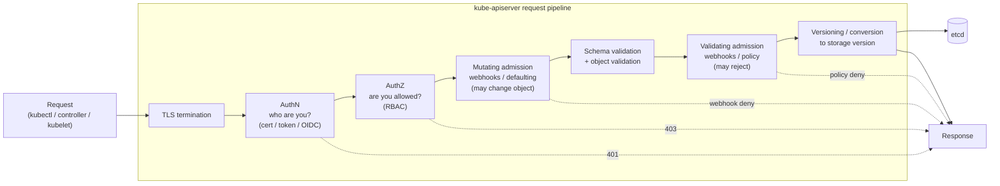
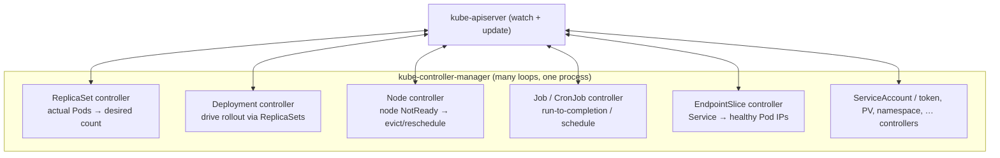
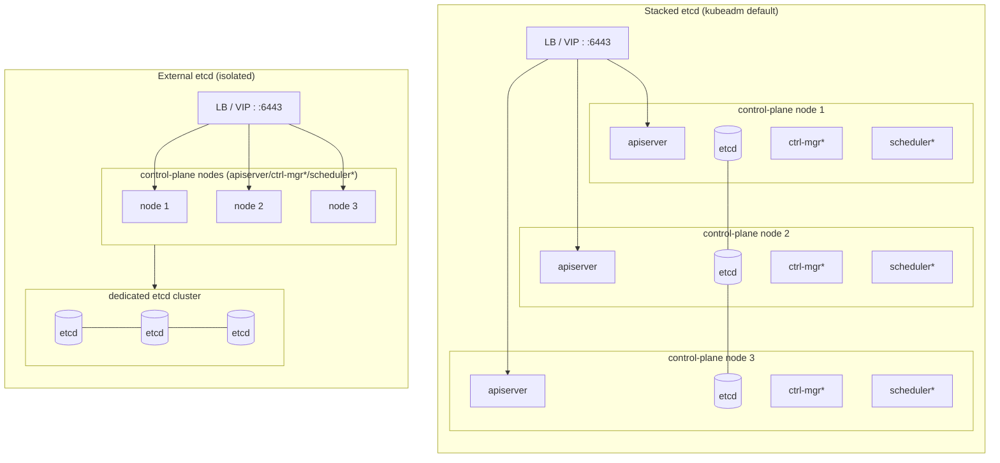

# 04 — Control plane deep dive

> Inside the brain: how the API server processes a request, why etcd is the
> single source of truth, what the scheduler and controllers actually decide,
> and how the control plane is made highly available.

**Estimated time:** ~15 min read · (no hands-on)
**Prerequisites:** [Part 00 ch.03](03-architecture-overview.md) — what the control plane is at a glance
**You'll know after this:** • describe the API server request pipeline (auth, admission, validation, storage) · • explain why etcd is the single source of truth and what its quorum requires · • articulate what the scheduler and controllers actually decide · • understand how the control plane is made highly available (replicated API servers, etcd quorum, leader election) · • predict failure modes when a control-plane component goes down

<!-- tags: foundations, control-plane, api-server, etcd, scheduler, ha -->

## Why this exists

[Chapter 03](03-architecture-overview.md) gave you the map. But "the API server
handles requests" and "controllers reconcile" are black boxes until you see
*inside* them. You need this depth because the control plane is where the
cluster's correctness, security, and availability are decided:

- Every security control (RBAC, admission, validation) is a **stage in the API
  server's request pipeline** — you can't reason about
  [Part 05](../05-security/01-authn-authz-rbac.md) without knowing that
  pipeline.
- Every "it didn't do what I declared" bug is a **controller's reconcile loop**
  doing exactly what it was told — debugging needs the loop's model.
- Every production cluster's resilience is its **control-plane HA topology** and
  **etcd quorum** — you can't operate one safely without this.

This chapter opens each control-plane component. Node-side internals are
[chapter 05](05-node-components.md).

## Mental model

The control plane is **one guarded doorway in front of one consistent
notebook, watched by a room of single-minded clerks.**

- The **doorway** (kube-apiserver) inspects every visitor (authenticate),
  checks they're allowed to do this (authorize), may amend or reject their
  request (admission), checks the form is well-formed (validation), and only
  then writes to the notebook.
- The **notebook** (etcd) is the *only* place state lives, kept perfectly
  consistent by a majority vote among its pages-keepers (Raft).
- The **clerks** (scheduler, controllers) never talk to each other or to the
  notebook directly. Each watches the doorway for the kind of entry it cares
  about and, when reality and the notebook disagree, takes one corrective
  action through the doorway.

Make those concrete and the control plane is no longer mysterious.

## kube-apiserver — the only door

The API server is a (horizontally scalable, otherwise **stateless**) REST
server. It is the single component that talks to etcd, and therefore the single
place every policy is enforced. Every `kubectl`, controller, kubelet, and
custom client request runs the same gauntlet:



Stage by stage:

1. **TLS termination.** All API traffic is TLS. Clients present credentials over
   an encrypted channel.
2. **Authentication (authN) — *who are you?*** The request is identified via
   one of several authenticators: client certificates, bearer/service-account
   tokens, or OIDC. Output: a username + groups (or `401`). Kubernetes has no
   user database — identity is *asserted by a trusted authenticator*.
3. **Authorization (authZ) — *are you allowed to do this?*** Given the
   identity and the verb+resource (e.g. `create pods in namespace bookstore`),
   authorizers (primarily **RBAC**) say allow/deny (`403` on deny). Detailed in
   [Part 05 ch.01](../05-security/01-authn-authz-rbac.md).
4. **Mutating admission.** Pluggable controllers and **mutating webhooks** may
   *modify* the object before it's stored — inject defaults, add a sidecar, set
   a default storage class, stamp labels. (Defaulting also happens here/around
   here.)
5. **Schema & object validation.** The object is decoded and validated against
   the resource's schema and built-in validation (required fields, value
   constraints). Malformed objects are rejected here — this is exactly the
   stage `kubectl apply --dry-run=server` exercises, and the *client*-side
   variant you'll run in [ch.07](07-local-cluster-setup.md).
6. **Validating admission.** **Validating webhooks** and policy engines
   (e.g. ValidatingAdmissionPolicy/CEL, Kyverno, Gatekeeper) get a final
   allow/deny — *no* further mutation, just enforcement (e.g. "deny privileged
   Pods", "image must come from our registry"). Backbone of
   [Pod security](../05-security/02-pod-security.md) and
   [supply chain](../05-security/03-supply-chain.md).
7. **Versioning/conversion & persist.** The object is converted to the
   canonical *storage version* and written to etcd. The response returns.

Two facts to carry: **the API server is the only etcd client** (so it is the
only place to enforce anything, and the only thing that needs etcd
credentials), and **mutate-before-validate** is the fixed order (a mutating
webhook can't sneak past validation; a validating webhook sees the final
object). The API server also serves **watches** — long-lived streams that push
object changes to controllers/kubelets; this is the transport that makes the
whole reconciliation architecture work without polling.

## etcd — the single source of truth

etcd is a distributed key-value store providing **strong consistency** via the
**Raft** consensus algorithm. It holds *every* Kubernetes object — both the
`spec` (desired) and `status` (observed) — under hierarchical keys. If the API
server is the door, etcd is the room everything is kept in.

**Why Raft / why an odd number of members.** etcd runs as a small cluster (3 or
5 members). One member is the elected **leader**; all writes go through it and
are committed only once a **majority (quorum)** has durably persisted them.
This guarantees a single, linearizable history (no split-brain) and survival of
minority failures:

| etcd members | Quorum (majority) | Failures tolerated |
|---|---|---|
| 1 | 1 | 0 (no HA — any loss = outage) |
| 3 | 2 | 1 |
| 5 | 3 | 2 |
| 4 | 3 | 1 (no better than 3 — *worse* odds, more cost) |

Even numbers gain nothing (quorum still needs a majority) while increasing the
chance that *some* member is down → **always use an odd number**, almost always
3 (5 for very large clusters). Beyond ~5, write latency from cross-member
replication outweighs the marginal availability.

Consequences you must operate around:

- **etcd is the cluster.** Lose every etcd member without a backup and the
  cluster's entire desired state is gone — Pods may keep running, but you can
  never reconstruct or change anything. **Back up etcd** (snapshots) and
  **test restore** — [Part 08 ch.02](../08-day-2-operations/02-backup-and-dr.md).
- **Encrypt sensitive data at rest.** By default `Secret` objects are stored in
  etcd base64-encoded, *not encrypted*. Enable
  [encryption at rest](../05-security/04-secrets-and-cluster-hardening.md);
  guard etcd access tightly (it bypasses RBAC entirely — raw access to etcd is
  raw access to *everything*).
- **etcd is latency-sensitive.** It wants fast, low-jitter disks (SSD) and a
  low-latency network between members. Slow etcd disks are a classic cause of a
  sluggish or flapping control plane.

## kube-scheduler — what it decides

The scheduler has exactly one job: for each Pod that has no node assigned
(`spec.nodeName` empty), choose the best node — and **only write that choice**.
It does **not** start containers (that's the kubelet); it makes a *placement
decision* and records it as a Binding.

Each Pod is scheduled in two phases:

1. **Filtering (feasibility).** Eliminate nodes that *cannot* run the Pod:
   insufficient allocatable CPU/memory for the Pod's **requests**, unsatisfied
   `nodeSelector`/affinity, `taints` not tolerated, unmet topology constraints,
   no matching volume zone, etc. Result: the set of feasible nodes.
2. **Scoring (preference).** Rank the feasible nodes with weighted plugins
   (spread across nodes/zones, pack vs. balance, image already present,
   affinity preferences, etc.). Highest score wins (ties broken randomly).

Then it issues a **Binding** (sets `pod.spec.nodeName`) via the API server. The
kubelet on that node, watching for its Pods, takes it from there. Note this
crucial design choice: scheduling decisions use the Pod's resource **requests**,
not actual usage — so requests are a *scheduling contract*, which is why
[resources & QoS](../01-core-workloads/03-resources-and-qos.md) matters so much.
The scheduler is also pluggable (the scheduling framework / multiple profiles);
the full mechanics, affinity, taints, priority and preemption are
[Part 04](../04-scheduling/01-scheduler-and-nodes.md).

## kube-controller-manager — the control loops

A single binary that runs **many independent controllers**, each an autonomous
[reconciliation loop](06-declarative-api-model.md) over one slice of state.
They never call each other; each watches the API server and acts through it.



Representative loops (each is "observe desired vs. actual → act → repeat"):

- **ReplicaSet controller** — sees a ReplicaSet wants N Pods, counts how many
  exist, creates/deletes to converge. (This is *literally* the self-healing of
  [ch.01](01-why-kubernetes.md).)
- **Deployment controller** — manages ReplicaSets to perform rolling updates
  and rollbacks ([Deployments](../01-core-workloads/04-replicasets-and-deployments.md)).
- **Node controller** — watches node heartbeats; on a node going `NotReady`,
  marks it and triggers eviction/rescheduling of its Pods after grace periods.
- **Job/CronJob controllers** — drive run-to-completion and scheduled workloads
  ([Jobs](../01-core-workloads/07-jobs-and-cronjobs.md)).
- **EndpointSlice controller** — keeps a Service's backend Pod-IP set current
  so kube-proxy can route ([Services](../02-networking/02-services.md)).
- Plus ServiceAccount/token, PersistentVolume binder, namespace, and others.

Two operational facts: controllers acquire a **leader lease** so that with
multiple controller-manager replicas, exactly one is active (others stand by) —
this is how the controller layer is HA without doing work twice. And because
loops are level-triggered with periodic resync, a controller that crashes loses
nothing: on restart it re-observes current state and resumes converging.

## cloud-controller-manager — the cloud glue

Cloud-specific controllers were split out so core Kubernetes stays
provider-agnostic. On a managed/cloud cluster the **cloud-controller-manager**
runs the loops that touch the provider's API:

- **Service controller** — provisions a real cloud load balancer for a
  `Service` of type `LoadBalancer` and keeps its targets in sync.
- **Node controller (cloud)** — labels nodes with region/zone/instance-type and
  removes Node objects when the underlying instance is deleted.
- **Route controller** — programs the VPC/network routes for Pod traffic where
  the network model needs it.
- Volume/attach integration via CSI for cloud disks.

On a **local kind/k3d cluster there is no cloud-controller-manager** (or it's a
stub) — which is exactly why `Service` type `LoadBalancer` stays `<pending>`
locally and you use port-forward/NodePort instead
([ch.07](07-local-cluster-setup.md),
[Part 02](../02-networking/02-services.md)).

## Control-plane HA topology

A single control-plane node is a single point of failure for *changes*. HA runs
the components redundantly. The decisive choice is **where etcd lives**:



`*` = controller-manager and scheduler run on every node but only the
**leader-elected** instance is active; the API server is **active/active**
behind a load balancer or virtual IP (it's stateless, so all replicas serve).

- **Stacked etcd** — etcd runs *on* the same nodes as the API server (kubeadm
  default). Fewer machines, simpler. Downside: a node loss removes *both* an
  API server *and* an etcd member; the failure domains are coupled. Good for
  most clusters; 3 control-plane nodes tolerate 1 loss.
- **External etcd** — etcd is its own dedicated cluster, separate from the API
  server nodes. More machines and operational surface, but etcd and the API
  server fail independently and etcd can be sized/tuned in isolation. Preferred
  for large or high-stakes clusters.

Sizing rule of thumb: **3 control-plane nodes** (tolerate 1 failure), **5** for
very large/critical clusters; etcd member count **odd** (3 or 5) for quorum;
API servers behind an LB/VIP; controller-manager & scheduler rely on leader
election so redundancy is safe.

## Hands-on with the Bookstore

This chapter is internals — there is no new Bookstore manifest (the first one
is written in [ch.06](06-declarative-api-model.md)). But you can *watch the
control plane think*. On any cluster (you'll have one in
[ch.07](07-local-cluster-setup.md)):

```sh
# The API server's own health gates (the pipeline's readiness)
kubectl get --raw='/readyz?verbose'

# Control-plane components (on kind they run as Pods in kube-system)
kubectl -n kube-system get pods -l tier=control-plane -o wide

# Who is the active (leader-elected) controller-manager / scheduler?
kubectl -n kube-system get lease

# Watch a controller reconcile: create a Deployment, watch the ReplicaSet
# controller converge actual Pods to desired (foreshadows Part 01).
# Use a tiny PUBLIC image so it actually pulls here — the Bookstore image isn't
# loaded into the cluster until ch.07 (a private/unloaded image would just
# ImagePullBackOff and obscure the lesson).
kubectl create deployment demo --image=registry.k8s.io/pause:3.9 --replicas=3
kubectl get pods -w           # ReplicaSet controller creating Pods to reach 3
kubectl delete pod -l app=demo --wait=false   # delete one...
kubectl get pods -w           # ...controller immediately recreates it (self-healing)
kubectl delete deployment demo

# Authorization stage, directly: ask the API server if an identity may act
kubectl auth can-i create pods --namespace bookstore
```

Mapping back to the Bookstore: when you later `kubectl apply` the `catalog`
Pod, it traverses **exactly the API request pipeline above** (authN→authZ→
admission→validation→etcd), the **scheduler** filters/scores your kind nodes to
place it, and a **controller** (once it's a Deployment) keeps it at the desired
replica count. The deep model here is what makes those later chapters
"obvious".

## How it works under the hood

- **The API server is the policy enforcement point precisely because it is the
  sole etcd client.** There is no "back door" to state; bypassing the pipeline
  means having raw etcd access, which is why etcd access ≈ cluster admin and is
  guarded as tightly as the API server itself.
- **`resourceVersion` + optimistic concurrency.** Every object carries a
  `resourceVersion` (sourced from etcd's revision). Updates are
  compare-and-swap on it: stale writes are rejected with a conflict, so
  concurrent controllers can't silently clobber each other. This is the
  mechanism behind safe concurrent reconciliation
  ([ch.06](06-declarative-api-model.md)).
- **Watches are an etcd capability surfaced by the API server.** Controllers
  don't poll; they watch from a `resourceVersion` and receive a change stream
  (with periodic resyncs as a correctness backstop). Efficient *and*
  self-healing against missed events.
- **Leader election is itself just objects.** Controller-manager/scheduler HA
  uses a `Lease` object renewed via the API server — the same declarative
  model, applied to the control plane's own coordination.

## Production notes

> **In production:** run **3 (or 5) control-plane nodes** with etcd quorum
> sized odd, API servers behind an LB/VIP, and leader election for
> controller-manager/scheduler. A single control-plane node is acceptable only
> for learning (kind is exactly that).

> **In production:** **etcd is the crown jewel.** Automate periodic
> `etcdctl snapshot`, store snapshots off-cluster, and *rehearse restore* —
> [Part 08 ch.02](../08-day-2-operations/02-backup-and-dr.md). Put etcd on
> fast, low-latency SSDs; slow etcd disks degrade the entire cluster.

> **In production:** enable **encryption at rest** for `Secret`s (etcd holds
> them only base64-encoded by default) and lock down etcd peer/client TLS —
> raw etcd access bypasses RBAC entirely
> ([cluster hardening](../05-security/04-secrets-and-cluster-hardening.md)).

> **In production (managed — EKS/GKE/AKS):** the provider runs and scales the
> API server + etcd, handles control-plane HA, upgrades, and etcd backups —
> you usually only get an endpoint and an SLA. You still own worker nodes,
> RBAC, admission policy, and your workloads. Know the boundary so you don't
> assume the provider covers what it doesn't.

> **In production:** treat **admission control** as a primary security
> surface. Validating policies (Pod Security Standards, image provenance,
> resource governance) are enforced *here*, before anything reaches etcd or a
> node — the cheapest, earliest place to say "no".

## Quick Reference

```sh
kubectl get --raw='/readyz?verbose'                 # API server health gates
kubectl get --raw='/livez?verbose'                  # API server liveness
kubectl -n kube-system get pods -l tier=control-plane   # CP components (kind)
kubectl -n kube-system get lease                    # leader election holders
kubectl get apiservices                             # served API groups / aggregation
kubectl auth can-i <VERB> <RESOURCE> [-n ns]        # exercise the authZ stage
kubectl api-versions                                # GroupVersions the apiserver serves
# etcd (where you have direct access; usually via the control-plane node):
ETCDCTL_API=3 etcdctl snapshot save snap.db         # back up etcd
ETCDCTL_API=3 etcdctl endpoint status --write-out=table   # member/leader health
```

Minimal HA control-plane shape (the thing to provision):

```
LB / VIP  ->  apiserver (active/active, 3x)        # stateless, all serve
              controller-manager (3x, 1 leader)    # leader-elected
              scheduler          (3x, 1 leader)    # leader-elected
              etcd (3 or 5 members, odd, Raft)     # stacked OR external
```

Control-plane checklist:

- [ ] 3+ control-plane nodes; API behind LB/VIP; ctrl-mgr & scheduler leader-elected
- [ ] etcd member count odd (3/5); on fast low-latency disks
- [ ] etcd snapshots automated, off-cluster, and restore-tested
- [ ] Secret encryption-at-rest enabled; etcd TLS + access locked down
- [ ] AuthN configured (certs/OIDC), RBAC least-privilege, admission policy enforced
- [ ] Control-plane ↔ kubelet version skew within support

## Test your understanding

> Try each before opening the answer drawer. The act of trying is the exercise; the answer is the check.

1. **The API server's admission pipeline runs *mutating* webhooks before *validating* webhooks. Why does this order matter, and what would go wrong if it were reversed?**
   <details><summary>Show answer</summary>

   Mutating webhooks can inject sidecars, set defaults, or stamp labels — they change the object. Validators must inspect the *final* object before it's persisted, so any mutation must happen first. If reversed, a mutating webhook could add a non-compliant field (e.g., a privileged sidecar) after validation already approved the object, defeating the policy (see §kube-apiserver — the only door, stages 4-6).

   </details>

2. **Your team proposes a 4-member etcd cluster "because more replicas means more availability". Why is this strictly worse than 3 members?**
   <details><summary>Show answer</summary>

   Raft quorum needs a majority, so 4 still needs 3 to commit a write — the *same* failure tolerance as 3 (tolerates 1 loss) but with one more machine that can fail. You've increased the probability of a member being down without buying any extra failure tolerance. Always use odd member counts; 3 for most clusters, 5 for very large/critical (see §etcd — single source of truth, quorum table).

   </details>

3. **You observe `kubectl edit deployment catalog` rejecting your write with "the object has been modified; please apply your changes to the latest version". What's happening at the API/storage layer and what's the right response?**
   <details><summary>Show answer</summary>

   Optimistic concurrency: the object's `resourceVersion` advanced between your read and write (some other client/controller wrote first), so the compare-and-swap failed with 409 Conflict. The right response is to re-read the current object and re-apply — this is the mechanism working, not a bug. Server-Side Apply with explicit field ownership avoids most of these (see §How it works under the hood, `resourceVersion`).

   </details>

4. **A Pod sits in `Pending` for ten minutes with no events about node binding. Walk through which control-plane component is most likely at fault and how you'd confirm.**
   <details><summary>Show answer</summary>

   The scheduler couldn't find a feasible node — likely because no node satisfies the Pod's resource requests, nodeSelector, or tolerated taints. Confirm with `kubectl describe pod` (events will show `FailedScheduling` with the per-node reason from the filtering phase). The scheduler logs the rejection per filter plugin (see §kube-scheduler — what it decides, filtering phase).

   </details>

5. **Hands-on extension: on any cluster, run `kubectl -n kube-system get lease` and identify the leader controller-manager/scheduler. Kill that Pod (`kubectl delete pod`). What should you observe in the lease?**
   <details><summary>What you should see</summary>

   The lease's `holderIdentity` flips to a standby replica within a few seconds (the lease duration / renewal window), and that replica resumes reconciliation. If you have only one controller-manager replica (single control-plane node like kind), the lease stays held by the new Pod the same Deployment recreates — no failover, just restart. This is leader election as plain Kubernetes objects (see §How it works under the hood, leader election).

   </details>

## Further reading

- **Lukša, _Kubernetes in Action_ 2e, ch.3** — the control-plane components and
  request flow; pair with the book's API-server / securing-the-API-server
  material for the authN/authZ/admission depth.
- **Rosso et al., _Production Kubernetes_, ch.1** — "A Path to Production":
  control-plane architecture and HA from an operability standpoint.
- Official: <https://kubernetes.io/docs/concepts/overview/components/#control-plane-components>,
  the API request flow
  <https://kubernetes.io/docs/reference/access-authn-authz/controlling-access/>,
  and etcd guidance
  <https://kubernetes.io/docs/tasks/administer-cluster/configure-upgrade-etcd/>.
