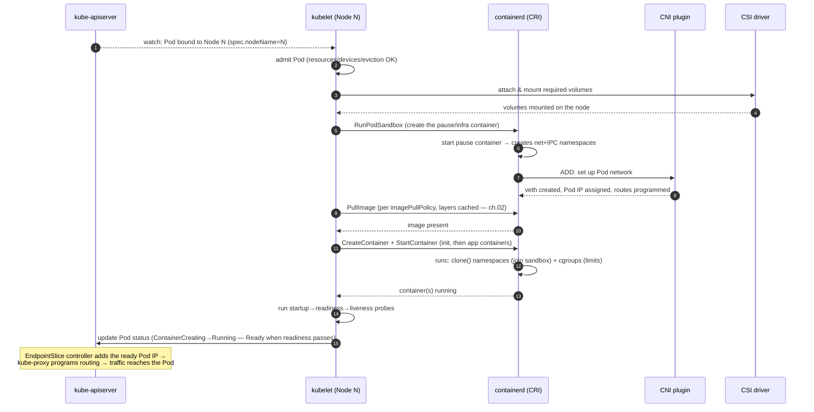

# 05 — Node components

> Inside the hands: how the kubelet turns a PodSpec into running containers via
> the CRI and containerd, what the pause/sandbox container is for, what
> kube-proxy does, and the full sequence of a Pod starting on a node.

**Estimated time:** ~15 min read · (no hands-on)
**Prerequisites:** [Part 00 ch.03](03-architecture-overview.md) — control plane vs. node plane · [Part 00 ch.04](04-control-plane-deep-dive.md) — what the control plane decided
**You'll know after this:** • explain what the kubelet does step-by-step when a Pod is bound to a node · • describe the CRI boundary and how containerd executes containers · • understand the role of the pause/sandbox container and shared namespaces · • describe what kube-proxy programs (iptables / IPVS / eBPF) · • read the full sequence of a Pod starting on a node and locate failures within it

<!-- tags: foundations, node-plane, kubelet, cri, containerd, kube-proxy -->

## Why this exists

[Chapter 04](04-control-plane-deep-dive.md) showed the brain *deciding*. But a
decision ("run this Pod on Node N") is inert until something on Node N *makes
it real*. That something is the **node components** — and they are where the
beginner-visible failures live: `ContainerCreating` that never finishes,
`CrashLoopBackOff`, a probe killing a healthy app, "the Pod is Running but I
can't reach it". Every one of those is a node-component behavior. To debug Pods
([Part 08 ch.03](../08-day-2-operations/03-troubleshooting-playbook.md)) and to
understand health/lifecycle ([Part 01
ch.02](../01-core-workloads/02-health-and-lifecycle.md)) you must know what the
kubelet, CRI runtime, and kube-proxy actually do. This chapter completes the
breadth→depth arc of Part 00 on the *data-plane* side.

## Mental model

A worker node runs **one foreman and its specialist crews**. The **kubelet** is
the foreman: it watches the control plane for the work assigned to *this*
machine, and for each Pod it drives the crews to realize it and reports back
what's actually true. It does not lay bricks itself — it directs:

- the **container runtime** (containerd) to pull images and run containers,
- the **CNI plugin** to give the Pod a network identity,
- and reads from the **CSI** plugins for storage —

while **kube-proxy** runs alongside as a separate crew that programs the node's
networking so Service virtual IPs reach the right Pods. The foreman owns the
node's reality; the brain only ever *asked*.

## The node, in boxes

```
┌─────────────────────────── WORKER NODE (Linux host) ───────────────────────────┐
│                                                                                 │
│  kubelet  ── node agent: watches apiserver for Pods bound here;                 │
│     │        reconciles PodSpec → containers; runs probes; reports status       │
│     │ (CRI: gRPC)                                                               │
│     ▼                                                                           │
│  container runtime (containerd)  ── pulls images; runs/stops containers via runc│
│     │                                                                           │
│     ├── pause/sandbox container  ── holds the Pod's net+IPC namespaces (the     │
│     │                                "infra" container the app shares)          │
│     ├── app container(s)         ── your image(s), joined to the sandbox        │
│     └── (CNI plugin invoked)     ── gives the Pod its IP, wires veth → node     │
│                                                                                 │
│  kube-proxy  ── programs iptables/IPVS (or eBPF via CNI) so Service VIPs        │
│                 load-balance to current healthy Pod IPs                         │
│                                                                                 │
│  cgroups + namespaces (Linux kernel)  ── the actual isolation & limits          │
│                                          (see ch.02)                            │
└─────────────────────────────────────────────────────────────────────────────────┘
        ▲ talks ONLY to the API server (never to etcd, never to the scheduler)
```

## kubelet — PodSpec → containers

The kubelet is the per-node agent and the *only* component that runs your
containers. Its loop:

1. **Watch** the API server for Pods whose `spec.nodeName` is *this* node
   (assigned by the scheduler in [ch.04](04-control-plane-deep-dive.md)).
2. **Admit** the Pod locally (node resources fit, required volumes/devices
   available; eviction thresholds not exceeded).
3. **Reconcile to spec**: ensure the Pod sandbox exists, the right images are
   pulled, each container in the PodSpec is running with the right config
   (env, mounts, resources → cgroups, security context). Restart containers
   per `restartPolicy` with exponential backoff (the backoff you see as
   `CrashLoopBackOff`).
4. **Mount volumes** (via CSI) before starting containers that need them.
5. **Run probes** continuously:
   - **startup** probe — gates the others until the app has booted (protects
     slow starters from being liveness-killed too early);
   - **readiness** probe — controls whether the Pod receives traffic (its IP is
     in/out of Service EndpointSlices);
   - **liveness** probe — if it fails, the kubelet **kills and restarts** the
     container.
   (Probe semantics and tuning: [Part 01
   ch.02](../01-core-workloads/02-health-and-lifecycle.md).)
6. **Report status** back to the API server continuously: container states,
   Pod phase, conditions (Ready), and the node's own heartbeat (Node `Lease`)
   so the Node controller knows this node is alive.

Two internals worth naming:

- **PLEG (Pod Lifecycle Event Generator).** The kubelet doesn't busy-poll every
  container. PLEG periodically relists containers from the runtime, diffs
  against its cache, and emits lifecycle events that drive reconciliation. A
  slow/overloaded runtime shows up as "**PLEG is not healthy**" in node events —
  a classic node-pressure symptom.
- **The kubelet reconciles, like everything else.** It is level-triggered: it
  drives actual container state toward the PodSpec, re-asserting on every sync —
  the same loop as the controllers, just realized in Linux instead of in etcd.

## CRI and containerd

The kubelet does **not** know how to talk to containerd (or CRI-O, or any
specific runtime) natively. It speaks the **CRI (Container Runtime Interface)**
— a stable gRPC API with two services:

- **RuntimeService** — sandboxes and containers: `RunPodSandbox`,
  `CreateContainer`, `StartContainer`, `StopContainer`, `ExecSync`, status…
- **ImageService** — images: `PullImage`, `ImageStatus`, `RemoveImage`…

This indirection is why Kubernetes is runtime-agnostic and why the Docker
shim was removed in v1.24: any runtime implementing CRI works. The common
stack today:

```
kubelet ──CRI(gRPC)──► containerd ──► containerd CRI plugin ──► runc ──► clone()/namespaces/cgroups
                                  └──► snapshotter (overlayfs)  ──► image layers (see ch.02)
```

containerd manages images (pull, unpack layers via a snapshotter into an
overlay rootfs — exactly the layer model of
[ch.02](02-containers-and-images.md)) and lifecycle, then delegates the actual
OS-level container creation to a low-level runtime, **runc**, which performs the
`clone()`/namespace/cgroup syscalls. (`gVisor`/`runsc` or Kata can substitute
for `runc` when stronger isolation is required —
[Pod security](../05-security/02-pod-security.md).)

## The pause (sandbox) container

A Pod is a *group of containers sharing one network and IPC namespace and a
common lifecycle*. Linux has no native "pod" — Kubernetes builds it with an
extra, invisible container per Pod: the **pause** (a.k.a. **sandbox** or
"infra") container.

- It is the **first** container created for a Pod. It does essentially nothing:
  it runs a tiny program that just sleeps and reaps zombies.
- Its purpose is to **own the Pod's shared namespaces** (network, IPC; the Pod
  gets one IP — the pause container's). App containers are then created to
  **join** the pause container's namespaces rather than create their own.
- Because the namespaces belong to the long-lived pause container, an app
  container can **crash and be restarted without the Pod losing its IP or
  network setup** — the sandbox persists across container restarts. This is
  precisely why a `CrashLoopBackOff` Pod keeps the same IP, and why CNI is
  invoked once per Pod (at sandbox creation), not once per container.

You'll see it as a `pause`/`sandbox` entry in `crictl pods` even though it never
appears in your manifest — it's infrastructure the kubelet manages for you.

## kube-proxy — making Service IPs work

Pods are mortal and their IPs change; a **Service** is a stable virtual IP (and
DNS name) in front of a changing set of Pod IPs ([Part 02
ch.02](../02-networking/02-services.md)). **kube-proxy** is the per-node
component that makes that virtual IP actually route:

- It watches the API server for **Services** and their **EndpointSlices** (the
  current set of *ready* backing Pod IPs, kept fresh by the EndpointSlice
  controller from [ch.04](04-control-plane-deep-dive.md)).
- It programs the node's packet path so traffic to a Service's ClusterIP:port
  is DNAT-load-balanced across those ready Pod IPs — via **iptables** (default)
  or **IPVS** (better at large scale), or it's *replaced entirely* by a CNI's
  own dataplane (e.g. Cilium's eBPF kube-proxy replacement).

kube-proxy does **not** sit in the data path as a proxy process for normal
ClusterIP traffic — it *configures the kernel* to do the forwarding. (DNS-based
discovery itself is **CoreDNS**, a separate add-on Pod; kube-proxy handles the
virtual-IP plumbing.) Full model in [Part 02](../02-networking/02-services.md).

## Sequence: a Pod starting on a node

This stitches the node components together — it is what happens *after* the
scheduler binds your Pod (the tail end of the
[ch.03 lifecycle](03-architecture-overview.md#lifecycle-from-kubectl-apply-to-a-running-pod)),
and exactly what your `catalog` Pod does in
[ch.07](07-local-cluster-setup.md):



Read it as: **sandbox first (gets the IP), network second (CNI), images,
then containers join the sandbox, then probes gate readiness, then status is
reported and routing is wired.** Almost every "stuck Pod" maps to a specific
arrow here — image pull failing, CNI not assigning an IP, a volume not
mounting, readiness never passing.

## Hands-on with the Bookstore

No new manifest (the first is [ch.06](06-declarative-api-model.md)). But once
you have the `catalog` Pod running on kind in
[ch.07](07-local-cluster-setup.md), these commands *show the node components at
work* on it:

```sh
# Which node did the scheduler put it on? (the kubelet there now owns it)
kubectl get pod catalog -o wide

# The kubelet's view, narrated: sandbox create, image pull, container start, probes
kubectl describe pod catalog            # see the Events section, bottom

# kind nodes ARE containers; exec onto the node to see the runtime directly
docker exec -it bookstore-control-plane bash      # kind node container
crictl pods                              # note the catalog Pod AND its pause sandbox
crictl ps                                # the running app container(s)
crictl images                            # layers containerd pulled (ch.02)

# The node's own health/heartbeat the Node controller relies on
kubectl get node -o wide
kubectl -n kube-system get lease | grep -i node   # node heartbeat lease

# kube-proxy + the routing it programs for a Service (once you add one later)
kubectl -n kube-system get pods -l k8s-app=kube-proxy
kubectl get endpointslices                # the ready Pod IPs kube-proxy targets
```

Mapping back: the `catalog` image is small and static *by design*
([ch.02](02-containers-and-images.md)) so the **PullImage** step is fast; its
exec-form `ENTRYPOINT` means the kubelet's `SIGTERM` on Pod deletion reaches
the Go process and triggers graceful shutdown; its `/healthz` and `/readyz`
endpoints are exactly what the kubelet's **liveness/readiness** probes will
call once you add them in [Part 01](../01-core-workloads/02-health-and-lifecycle.md).

## How it works under the hood

- **The kubelet is authoritative for the node, not the control plane.** The
  control plane records *intent*; the kubelet decides *how* to realize it on
  this specific kernel and reports back *fact*. The control plane never touches
  containers — it only ever reads/writes objects.
- **One sandbox per Pod, joined by all its containers.** This is the literal
  implementation of "containers in a Pod share a network namespace and
  localhost" — they share the pause container's namespaces. CNI runs **once
  per Pod** (at sandbox creation), which is why all containers in a Pod have
  the *same* IP and can reach each other on `localhost`.
- **CRI/CNI/CSI are deliberate seams.** Runtime (CRI), networking (CNI), and
  storage (CSI) are pluggable interfaces, not hardcoded — this is why the same
  PodSpec runs on kind, on EKS, or on bare metal with totally different
  plugins underneath. Portability is an architectural property of these seams.
- **kube-proxy programs the kernel; it is not a per-packet proxy** for
  ClusterIP traffic. The forwarding/NAT is done by iptables/IPVS/eBPF in the
  data path; kube-proxy just keeps those rules in sync with EndpointSlices.

## Production notes

> **In production:** size and protect the kubelet's node. The kubelet enforces
> **eviction thresholds** (memory/disk/PID pressure) and will evict Pods to
> save the node — set sane resource **requests/limits** so the right Pods are
> protected ([resources & QoS](../01-core-workloads/03-resources-and-qos.md)).
> "Node NotReady" / "PLEG is not healthy" almost always means disk or memory
> pressure or a sick runtime.

> **In production:** the **container runtime is yours to operate even on
> managed clusters** — it's containerd on the *worker* nodes (which you patch
> on EKS/GKE/AKS). Keep it and the node OS patched; runtime CVEs are a real
> escape vector ([supply chain](../05-security/03-supply-chain.md)).

> **In production:** choose the kube-proxy mode (or replacement) deliberately.
> **iptables** is fine for most; **IPVS** scales better with thousands of
> Services; an **eBPF** dataplane (Cilium) replaces kube-proxy for performance
> and richer policy. This is a cluster-build decision
> ([Part 02 ch.01](../02-networking/01-networking-model.md)).

> **In production:** the **pause container image** must be reachable (it has
> its own registry source, often the cluster's configured sandbox image). In
> air-gapped/private environments, failing to mirror the pause image breaks
> *every* Pod with `RunPodSandbox` errors — a classic, baffling-until-you-know
> outage.

> **In production:** for stronger workload isolation than a shared kernel
> gives, run sensitive Pods under a sandboxed runtime (gVisor/Kata) via
> **RuntimeClass** — the CRI seam makes this a per-Pod choice
> ([Pod security](../05-security/02-pod-security.md)).

## Quick Reference

```sh
kubectl get pod <P> -o wide              # which node (→ which kubelet owns it)
kubectl describe pod <P>                  # kubelet Events: sandbox/pull/start/probe
kubectl get node -o wide                  # node status, runtime version, addresses
kubectl describe node <N>                 # capacity/allocatable, conditions, evictions
kubectl -n kube-system get pods -l k8s-app=kube-proxy   # kube-proxy DaemonSet
kubectl get endpointslices                # ready Pod IPs kube-proxy routes to
kubectl logs <P> --previous               # previous container (debug CrashLoopBackOff)

# On the node itself (e.g. `docker exec` into a kind node container):
crictl pods                               # Pods incl. the pause/sandbox container
crictl ps                                 # running containers (CRI view)
crictl images                             # images/layers containerd holds
journalctl -u kubelet                     # kubelet logs (systemd-managed nodes)
```

The node, minimally:

```
kubelet (watches apiserver → reconciles PodSpec, runs probes, reports status)
  └─CRI→ containerd → runc      : pause sandbox first, then app containers join it
        └─CNI: Pod gets its IP (once per Pod, at sandbox creation)
        └─CSI: volumes mounted before dependent containers start
kube-proxy (watches Services/EndpointSlices → programs iptables/IPVS/eBPF)
```

Node checklist:

- [ ] Resource requests/limits set so kubelet eviction protects the right Pods
- [ ] Node OS + containerd patched (worker nodes are yours, even on managed)
- [ ] kube-proxy mode / CNI dataplane chosen for the cluster's scale
- [ ] Pause/sandbox image mirrored for air-gapped/private registries
- [ ] Probes defined (startup/readiness/liveness) so the kubelet gates correctly
- [ ] Sensitive workloads on a sandboxed RuntimeClass where required

## Test your understanding

> Try each before opening the answer drawer. The act of trying is the exercise; the answer is the check.

1. **Why does every Pod include a `pause`/`sandbox` container you never declared, and what would break if the kubelet skipped creating it?**
   <details><summary>Show answer</summary>

   The pause container owns the Pod's shared network and IPC namespaces — it gets the Pod IP and holds the namespaces so app containers can crash and restart without losing the IP or re-running CNI. Skipping it means each container would create its own network namespace, and the "Pod = group sharing localhost and one IP" abstraction would not exist (see §The pause container).

   </details>

2. **A node reports `PLEG is not healthy` and Pod statuses lag by minutes. What's PLEG, what's most likely wrong, and what's the first thing to check?**
   <details><summary>Show answer</summary>

   PLEG (Pod Lifecycle Event Generator) is the kubelet loop that relists containers from the runtime and emits lifecycle events. A slow or overloaded runtime — often caused by disk pressure, memory pressure, or a sick containerd — shows up as "PLEG is not healthy". First check: node disk and memory pressure (`kubectl describe node`), then containerd health (`journalctl -u containerd`, `crictl pods` latency) (see §kubelet — PodSpec → containers, PLEG callout).

   </details>

3. **You add a Service that selects `app=catalog` but traffic to its ClusterIP returns connection refused. The Pod itself is `Running 1/1`. Which node component is responsible for making the ClusterIP route, and what does it watch to know about new endpoints?**
   <details><summary>Show answer</summary>

   kube-proxy on each node programs iptables/IPVS/eBPF rules from the EndpointSlices that the EndpointSlice controller maintains for each Service. If the Pod isn't yet in an EndpointSlice for the Service, kube-proxy has nothing to route to. Check `kubectl get endpointslices -l kubernetes.io/service-name=<svc>` — if empty, the Service selector likely doesn't match the Pod's labels (see §kube-proxy — making Service IPs work).

   </details>

4. **A Pod is stuck `ContainerCreating` for several minutes with no obvious image-pull failure. Using only the node-side sequence diagram in this chapter, list three concrete arrows where it could be stuck and the symptom each produces.**
   <details><summary>Show answer</summary>

   (a) `CSI: attach & mount` — volume not attaching shows `FailedAttachVolume` / `FailedMount` events. (b) `CNI: ADD` — CNI couldn't assign an IP, events mention "failed to set up sandbox container" or "failed to allocate IP". (c) `PullImage` — registry reachability/auth, surfaces as `ErrImagePull` / `ImagePullBackOff`. `kubectl describe pod` events name the failing step (see §Sequence: a Pod starting on a node).

   </details>

5. **Hands-on extension: with a kind cluster running, `docker exec` into the node container and run `crictl pods` then `crictl ps`. Count the entries. Why are there more pods than running containers?**
   <details><summary>What you should see</summary>

   `crictl pods` lists every Pod sandbox (including the pause container per Pod); `crictl ps` lists only running app containers. Each app Pod contributes one sandbox + N app containers, so `pods` ≥ unique Pod count and `ps` ≥ sum of app containers per Pod. The discrepancy is exactly the invisible pause container per Pod (see §The pause container, §Hands-on with the Bookstore).

   </details>

## Further reading

- **Lukša, _Kubernetes in Action_ 2e, ch.2 & ch.3** — containers and the node
  agent: how the kubelet realizes Pods and the runtime/namespace mechanics.
- **Rosso et al., _Production Kubernetes_, ch.3 — "Container Runtime"** — CRI,
  containerd, and runtime concerns from an operator's perspective.
- Official:
  <https://kubernetes.io/docs/concepts/architecture/#node-components>
  (node components),
  <https://kubernetes.io/docs/concepts/architecture/cri/> (CRI), and
  <https://kubernetes.io/docs/reference/networking/virtual-ips/> (kube-proxy /
  Service virtual IPs).
