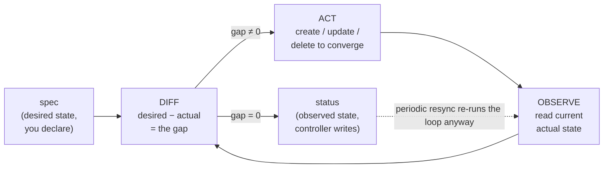

# 06 — The declarative API model

> The principle the entire system runs on: objects with `spec` (desired) and
> `status` (observed), reconciled forever; how `apply` merges intent; and
> labels/selectors as the glue — applied by writing the first Bookstore
> manifest.

**Estimated time:** ~15 min read · ~30 min hands-on
**Prerequisites:** [Part 00 ch.03](03-architecture-overview.md) — the components that reconcile · [Part 00 ch.04](04-control-plane-deep-dive.md) — how reconciliation actually runs
**You'll know after this:** • distinguish `spec` (desired) from `status` (observed) · • explain what `kubectl apply` does and how server-side apply merges fields · • use labels and selectors as the universal glue between objects · • write a minimal valid Kubernetes manifest by hand · • predict what a controller will do when you change a `spec`

<!-- tags: foundations, declarative, spec-status, apply, labels-selectors -->

## Why this exists

You now know the components ([ch.03](03-architecture-overview.md)) and their
internals ([ch.04](04-control-plane-deep-dive.md),
[ch.05](05-node-components.md)). This chapter is the **conceptual keystone**:
*every* later chapter is "here is another object, its `spec`, and the controller
that reconciles it". If the declarative model is solid, the other 40+ chapters
are variations on a theme. If it's fuzzy, you'll keep asking the wrong question
("what command makes it do X?") instead of the right one ("what desired state
do I declare, and what reconciles it?"). It's also the foundation of GitOps
([Part 07](../07-delivery/04-gitops-argocd.md)): if the cluster is "whatever's
in Git, continuously enforced", you must first understand *why* declaring state
even works.

## Mental model

You don't *operate* Kubernetes; you **describe what should be true and let it
keep it true.** Each thing in the cluster is an **object** with two halves:

- **`spec`** — *desired* state, written by you (or a controller). "What I want."
- **`status`** — *observed* state, written by the controller/kubelet that owns
  it. "What is actually true."

A controller's entire job is a loop: read `spec`, observe reality, compute the
difference, act to shrink it, write `status`, repeat — **forever**. You changed
a number in a file; the system continuously bends reality to match. That's it.
Pods, Deployments, Services, Secrets, your own CRDs — all the same shape.

## The reconciliation principle (level-triggered)



The defining property: Kubernetes controllers are **level-triggered**, not
edge-triggered.

- **Edge-triggered** = react to an *event* ("a Pod was deleted") and then
  forget. Miss the event (controller was down, network blip) → state is wrong
  forever.
- **Level-triggered** = repeatedly look at the *current level* ("I want 3, I
  see 2") and correct the gap, regardless of *how* it arose. Missed events
  don't matter — the next observation re-derives the truth. Periodic **resyncs**
  re-run the loop even when nothing changed, as a correctness backstop.

This single choice is *why* Kubernetes self-heals: "heal" is not a special path
— a crashed Pod simply makes `observed < desired`, and the next loop iteration
closes the gap exactly as it would for any other cause. It's also why declaring
state is safe: you assert the destination, not the route, so the system
recovers correctly from *any* deviation, not just the ones someone anticipated.
("Imperative vs. declarative" from [ch.01](01-why-kubernetes.md) is this,
mechanized.)

## Anatomy of an object: GVK, metadata, spec, status

Every Kubernetes object has the same top-level skeleton:

```
Object
├── apiVersion: <GROUP>/<VERSION>     ── e.g. apps/v1, v1 (core group = "")
├── kind:       <Kind>                ── e.g. Pod, Deployment, Service
│       (apiVersion + kind  ==  GVK: Group / Version / Kind — identifies the type)
├── metadata
│   ├── name            ── unique within (namespace, kind)
│   ├── namespace        ── tenancy/scope boundary (namespaced kinds only)
│   ├── labels           ── identifying key/values → SELECTED by other objects
│   ├── annotations      ── non-identifying metadata (tools, docs, config)
│   ├── uid              ── server-assigned unique id (survives name reuse)
│   ├── resourceVersion  ── changes on every write → optimistic concurrency
│   └── ownerReferences  ── parent object (drives cascading delete / GC)
├── spec                ── DESIRED state — you write this
└── status              ── OBSERVED state — the controller/kubelet writes this
```

- **GVK (Group/Version/Kind)** = `apiVersion` + `kind`. It names the *type* and
  routes the request to the controller and storage that own it. `Group`
  versions the API surface (`apps/v1`, `networking.k8s.io/v1`); the empty group
  is "core" (`apiVersion: v1` → Pod, Service, ConfigMap). The instance is then
  identified by `(group, kind, namespace, name)`.
- **`metadata`** carries identity and the cross-object glue. `labels` are how
  objects *find* each other (next section); `annotations` are free-form
  non-selecting data; `ownerReferences` make deletion cascade (delete a
  ReplicaSet → its Pods are garbage-collected).
- **`spec` vs `status`** is the universal divide and the contract of the whole
  system: humans/controllers write `spec`; the owning controller writes
  `status`. You will almost never write `status`.

`kubectl explain <KIND>[.spec.<FIELD>]` prints this schema for *any* kind,
straight from the API server — it is the authoritative, version-correct
reference and you should reach for it constantly.

## resourceVersion & optimistic concurrency

Many controllers (and you) may try to update the same object concurrently.
Kubernetes uses **optimistic concurrency**, not locks:

- Every object's `metadata.resourceVersion` reflects etcd's revision at its
  last write.
- An update must carry the `resourceVersion` it read. The API server commits
  it **only if** that version is still current (compare-and-swap). If someone
  else wrote in between, your write is rejected with a **`Conflict` (409)** and
  you must re-read and retry.

Effect: concurrent writers can't silently clobber each other; the loser simply
re-observes and re-reconciles (which, being level-triggered, is harmless and
expected). This is the low-level mechanism that makes many independent
controllers operating on shared state *correct*. You'll see it surface as the
occasional "the object has been modified; please apply your changes to the
latest version" — that's optimistic concurrency working, not a bug.

## `kubectl apply`: 3-way merge & server-side apply

There are three ways to change objects; the difference matters for production:

- **Imperative command** (`kubectl create`, `kubectl scale`, `kubectl edit`) —
  a one-off action. Fine for learning/debugging; no record of *intent*, so it
  drifts. Used deliberately in [ch.07](07-local-cluster-setup.md) to *learn*.
- **`kubectl apply` (declarative)** — you keep the desired state in files and
  re-apply them. `apply` doesn't blindly overwrite: it computes a merge so it
  only changes the fields *you* manage, leaving fields owned by controllers
  (e.g. a Deployment's replica count managed by an HPA) untouched.
- **Server-Side Apply (SSA)** — the modern mechanism: each field has a
  recorded **manager** (`metadata.managedFields`). The API server merges based
  on field ownership and reports a **conflict** if two managers fight over the
  same field. This is what makes "Git is the source of truth, but a controller
  also edits this object" safe, and it's foundational to GitOps tooling.

Classic client-side `apply` does a **3-way merge** between (1) your new
manifest, (2) the live object, and (3) the *last-applied configuration* it
stored as an annotation — so it can tell "the user removed this field" (delete
it) from "a controller added this field" (keep it). Mental picture:

```
   last-applied (what you declared before)
            \
             >── 3-way merge ──► patch that adds/updates your fields,
            /                    removes fields you dropped,
   live object (cluster now)      and leaves controller-owned fields alone
            \
   your new manifest (what you declare now)
```

> **In production:** keep all manifests in Git and `apply` them (ideally via a
> GitOps controller, [Part 07](../07-delivery/04-gitops-argocd.md)). Avoid
> mixing ad-hoc imperative edits with `apply` on the same objects — that's how
> "works on the cluster but not in Git" drift starts. Prefer SSA semantics so
> field ownership is explicit.

## etcd as the source of truth

Tie it together with [ch.04](04-control-plane-deep-dive.md): the `spec` you
declare and the `status` controllers observe **both live in etcd**, written
**only** through the API server. "Declaring desired state" concretely means
*persisting an object in etcd via the API server*; "reconciliation" means
*controllers watching etcd (through the API server) and acting until status
matches spec*. The cluster has exactly one authoritative copy of intent — which
is why backing up etcd is backing up the cluster, and why a single API server
pipeline can enforce all policy. The declarative model isn't a convention bolted
on; it's a direct consequence of "one consistent store + watchers".

## Labels, selectors, and annotations: the glue

Kubernetes objects are deliberately **loosely coupled**: they refer to each
other by **label selectors**, not by name or pointer. This is how the system is
composed.

- **Labels** — identifying key/value pairs in `metadata.labels`
  (`app=catalog`, `tier=backend`, `version=1.4`). Meant for selection and
  grouping.
- **Selectors** — queries over labels. A Service routes to "Pods where
  `app=catalog`"; a ReplicaSet owns "Pods where `app=catalog`"; an HPA scales
  "the Deployment with these labels". The selected objects don't know they were
  selected — coupling is by *matching*, late-bound and dynamic. (Add a Pod with
  `app=catalog` and a matching Service immediately starts sending it traffic.)
- **Annotations** — also key/value in `metadata.annotations`, but
  **non-identifying**: free-form metadata for tools and humans (build SHA,
  change-cause, ingress/controller config, checksums). You **cannot** select on
  annotations. Rule of thumb: *if something selects on it, it's a label;
  otherwise it's an annotation.*

This selector-based wiring is why you can swap, scale, and roll workloads
without re-pointing references — the references resolve by label match every
time. Almost every "why isn't my Service hitting my Pods?" bug is a
label/selector mismatch.

## Hands-on with the Bookstore: the first real manifest

Time to *declare* something. We write the **first Bookstore manifest**:
`catalog` as a single bare **Pod**. (A bare Pod is not how you'd run it in
production — it isn't self-healed by a controller; that's the whole point of
Deployments in [Part 01](../01-core-workloads/04-replicasets-and-deployments.md).
Here it's the minimal object that demonstrates the declarative model and gives
you something to run in [ch.07](07-local-cluster-setup.md).)

This file is created at
[`examples/bookstore/raw-manifests/01-catalog-pod.yaml`](../examples/bookstore/raw-manifests/01-catalog-pod.yaml):

```yaml
apiVersion: v1                 # core API group, version v1
kind: Pod                      # GVK = (core, v1, Pod)
metadata:
  name: catalog                # unique within (namespace, kind)
  labels:                      # identifying — what selectors will match later
    app: catalog               #   the canonical label other objects will select on
    component: backend
spec:                          # DESIRED state (you write this)
  containers:
    - name: catalog            # container name (unique within the Pod)
      image: bookstore/catalog:dev   # the image built in ch.02
      imagePullPolicy: IfNotPresent  # use the locally loaded image (ch.07 kind load)
      ports:
        - name: http
          containerPort: 8080  # the port the Go app listens on
      env:
        - name: PORT           # the app reads PORT (defaults to 8080)
          value: "8080"
# (no status: here — the kubelet/controllers write status, never you)
```

Every field, and *why it is exactly this*:

- **`apiVersion: v1` / `kind: Pod`** — the GVK. `Pod` is in the core group, so
  `apiVersion` is just `v1` (no group prefix). Together they tell the API
  server which schema to validate against and which controller/kubelet path
  owns it.
- **`metadata.name: catalog`** — the object's identity within its namespace.
  Re-`apply`ing this same file updates *this* object (it's matched by
  name+kind), it does not create a second one — the essence of declarative.
- **`metadata.labels`** — `app: catalog` is the label the future Service,
  ReplicaSet, NetworkPolicy, and HPA will **select** on. Setting it correctly
  now is what lets later chapters wire things to this Pod *without editing
  this Pod*. `component: backend` is an extra grouping dimension.
- **`spec`** — desired state, authored by you. There is no `status:` block:
  status is observed and written by the kubelet ([ch.05](05-node-components.md))
  — Pod phase, container states, the `Ready` condition. Trying to set it
  yourself is meaningless.
- **`spec.containers[0].name: catalog`** — names the container (used in logs,
  `kubectl exec -c`, probes). Unique within the Pod.
- **`image: bookstore/catalog:dev`** — the exact image built in
  [ch.02](02-containers-and-images.md). (`:dev` is a mutable tag — fine for
  local learning; production pins by digest, per
  [ch.02](02-containers-and-images.md) production notes.)
- **`imagePullPolicy: IfNotPresent`** — *critical for the local workflow*:
  pull only if the image isn't already on the node. In
  [ch.07](07-local-cluster-setup.md) you `kind load` the image onto the node,
  so the kubelet must **not** try to fetch `bookstore/catalog:dev` from a
  registry (it doesn't exist in one). With a `:latest` tag the default would be
  `Always` and the Pod would fail `ImagePullBackOff` — this is the single most
  common first-Pod mistake, pre-empted here.
- **`ports.containerPort: 8080`** — informational: documents that the container
  listens on 8080 (the app's default `PORT`). It does not "open" anything by
  itself, but it's good practice and named (`http`) so a Service/probe can
  reference it by name later.
- **`env.PORT="8080"`** — the `catalog` source reads `PORT`
  (defaulting to 8080). Set explicitly so the desired state is unambiguous and
  self-documenting — exactly the [Predictable
  Demands](../01-core-workloads/03-resources-and-qos.md) idea: declare what the
  workload needs rather than rely on implicit defaults.

This Pod is minimal **on purpose**: no replicas (a bare Pod has no controller
restoring it — covered in [Part
01](../01-core-workloads/04-replicasets-and-deployments.md)), no probes yet
([Part 01 ch.02](../01-core-workloads/02-health-and-lifecycle.md)), no resource
requests yet ([Part 01 ch.03](../01-core-workloads/03-resources-and-qos.md)).
Each later chapter *adds* a field to a Bookstore manifest and explains it; this
is the seed. You apply it to a real cluster in
[ch.07](07-local-cluster-setup.md).

Validate the manifest *now* (client-side — no cluster required), so the file is
known-good before [ch.07](07-local-cluster-setup.md):

```sh
# from the repo root (full-guide/)
kubectl apply --dry-run=client -f \
  examples/bookstore/raw-manifests/01-catalog-pod.yaml
# → pod/catalog created (dry run)
```

(`--dry-run=client` parses and locally validates the object without contacting
a cluster; `--dry-run=server` would additionally run the API server's
admission/validation pipeline from [ch.04](04-control-plane-deep-dive.md) — same
gauntlet, no persistence.)

## How it works under the hood

- **`spec`/`status` split is enforced, not just convention.** Many resources
  have a separate `/status` subresource with its own RBAC; controllers update
  status without being able to mutate spec, and vice-versa. The divide is real
  at the API level.
- **Watches + level-triggering = robustness.** Controllers watch from a
  `resourceVersion` and reconcile on each change *and* on a periodic resync. A
  controller can crash for an hour; on restart it lists current state and
  converges — nothing was "lost", because correctness derives from *current
  level*, not from a stream of events.
- **`managedFields` makes co-ownership safe.** Server-Side Apply records which
  manager owns each field. That's how an HPA can own `spec.replicas` while you
  own the rest of the Deployment via Git, with conflicts surfaced instead of
  silently lost — the technical basis of GitOps coexisting with controllers.
- **Selectors are evaluated continuously.** "Service → Pods with `app=catalog`"
  isn't resolved once; the EndpointSlice controller
  ([ch.04](04-control-plane-deep-dive.md)) re-evaluates the selector as Pods
  come and go. Loose coupling is *dynamic*, which is what makes scaling and
  rollouts transparent to callers.

## Production notes

> **In production:** manifests are **code** — in Git, reviewed, CI-validated
> (`--dry-run=server`, `kubeconform`, policy checks), and applied by a GitOps
> controller so the cluster *is* the repo, continuously reconciled
> ([Part 07](../07-delivery/04-gitops-argocd.md)). This is just the
> declarative model extended one level: Git is the declared state, Argo
> CD/Flux is the controller.

> **In production:** adopt **consistent labels** (the `app.kubernetes.io/*`
> recommended set: `name`, `instance`, `version`, `component`, `part-of`,
> `managed-by`). Selectors, dashboards, cost allocation, NetworkPolicies, and
> rollouts all hang off labels — inconsistent labels make the cluster
> unobservable and unsegmentable.

> **In production:** never hand-edit live objects that a controller or GitOps
> owns (`kubectl edit` on a managed Deployment). It creates drift and SSA
> conflicts and will be reverted; change the *source*, not the *instance*.

> **In production:** a **bare Pod is an anti-pattern** for real workloads — it
> is not rescheduled if its node dies and not replaced if it crashes
> permanently. Always front workloads with a controller (Deployment/StatefulSet/
> DaemonSet/Job). This chapter's bare Pod exists solely to teach the object
> model; it graduates to a Deployment in
> [Part 01](../01-core-workloads/04-replicasets-and-deployments.md).

## Quick Reference

```sh
kubectl explain <KIND>                     # schema of a kind (authoritative)
kubectl explain <KIND>.spec.<FIELD> --recursive   # drill into spec fields
kubectl apply --dry-run=client -f f.yaml   # local parse + validate (no cluster)
kubectl apply --dry-run=server -f f.yaml   # run apiserver admission/validation
kubectl apply -f f.yaml                     # declarative create/update (3-way merge)
kubectl apply --server-side -f f.yaml      # Server-Side Apply (field ownership)
kubectl get <KIND> <NAME> -o yaml          # see spec AND controller-written status
kubectl get pods -l app=catalog            # select by label (the glue in action)
kubectl get pods --show-labels             # inspect labels
kubectl diff -f f.yaml                       # what apply *would* change
```

Universal object skeleton (every kind you'll ever write fits this):

```yaml
apiVersion: <GROUP>/<VERSION>   # GVK (core group => just a version, e.g. v1)
kind: <Kind>
metadata:
  name: <NAME>                  # identity within (namespace, kind)
  labels: { app: <NAME> }       # identifying → what other objects select on
  annotations: { }              # non-identifying metadata (not selectable)
spec: { }                       # DESIRED state — you author this
# status is OBSERVED — written by the owning controller/kubelet, never by you
```

Declarative-model checklist:

- [ ] You write `spec` only; never set `status`
- [ ] Objects identified by GVK + name; re-applying updates, doesn't duplicate
- [ ] Consistent, intentional labels; cross-object wiring is by selector
- [ ] `imagePullPolicy` correct for how the image reaches the node
- [ ] Manifests in Git, validated in CI, applied declaratively (GitOps in prod)
- [ ] Real workloads run under a controller — bare Pods only for learning

## Test your understanding

> Try each before opening the answer drawer. The act of trying is the exercise; the answer is the check.

1. **Explain why writing `status:` in your manifest is meaningless. Where does status come from, and how does the API enforce the split?**
   <details><summary>Show answer</summary>

   `status` is written by the owning controller/kubelet to record observed reality, not declared by you. Most resources expose status as a separate `/status` subresource with distinct RBAC, so a controller may update status without mutating spec and vice-versa — the divide is enforced at the API level, not by convention (see §How it works under the hood, spec/status enforcement).

   </details>

2. **A teammate's Service has `selector: { app: catalog }` but no traffic reaches Pods labeled `app: Catalog` (note capitalization). Why does this silently fail, and what's the general lesson about late-bound coupling?**
   <details><summary>Show answer</summary>

   Labels are case-sensitive strings and selectors match by exact equality — `Catalog` ≠ `catalog`, so the selector finds zero Pods and the EndpointSlice is empty. There's no error because objects are loosely coupled by selector; the Service doesn't know the Pods exist. Almost every "Service hits no Pods" bug is a label/selector mismatch (see §Labels, selectors, and annotations: the glue).

   </details>

3. **An HPA owns `spec.replicas` of a Deployment while you keep the rest of the manifest in Git and re-apply it. Why doesn't your `apply` overwrite the HPA's replica count, and what would change if you switched to Server-Side Apply?**
   <details><summary>Show answer</summary>

   Classic `apply` does a 3-way merge with the last-applied annotation, so it only changes fields *you* manage; the replica field set by the HPA is left alone because it isn't in your last-applied. Server-Side Apply makes this explicit via `managedFields`: the HPA is the recorded manager of `spec.replicas`, and if your manifest tried to set it you'd get a Conflict instead of silent overwrite (see §`kubectl apply`: 3-way merge & server-side apply).

   </details>

4. **You apply a manifest, then someone runs `kubectl edit` and changes a field. You re-apply your unchanged manifest. What happens to their edit, and why?**
   <details><summary>Show answer</summary>

   If their edit changed a field that's in your last-applied (managed by you), `apply`'s 3-way merge will revert it back to your manifest's value — the edit looks like drift from your declared state. If they added a field not in your last-applied (and not removed by you), `apply` leaves it alone. This is why ad-hoc `kubectl edit` on GitOps-managed objects causes drift bugs (see §Production notes, "never hand-edit live objects").

   </details>

5. **Hands-on extension: take the `01-catalog-pod.yaml` from this chapter and run `kubectl apply --dry-run=server -f` against a kind cluster. Then change `imagePullPolicy` to `Always` and re-run. What does each invocation tell you that `--dry-run=client` would not?**
   <details><summary>What you should see</summary>

   `--dry-run=server` runs the full API server pipeline — authN, authZ, admission webhooks, schema and field validation — without persisting. You'll see policy rejects, defaulting (e.g., a `Never`/`Always` value getting normalized), and conflicts with admission webhooks if any. `--dry-run=client` only parses YAML locally and won't catch admission-time policy or schema rules added by webhooks (see §Hands-on with the Bookstore, dry-run discussion).

   </details>

## Further reading

- **Lukša, _Kubernetes in Action_ 2e, ch.4 — "Introducing Kubernetes API
  objects"** — GVK, metadata/spec/status, the declarative model, labels and
  selectors, and how `apply` works.
- **Ibryam & Huß, _Kubernetes Patterns_ 2e** — *Declarative Deployment*
  (ch.3) and *Predictable Demands* (ch.2): why declaring desired state and
  explicit requirements is the cloud-native way (the principle behind this
  chapter's manifest).
- Official: <https://kubernetes.io/docs/concepts/overview/working-with-objects/>
  (objects, spec/status, labels & selectors) and
  <https://kubernetes.io/docs/reference/using-api/server-side-apply/>
  (Server-Side Apply / field management).
