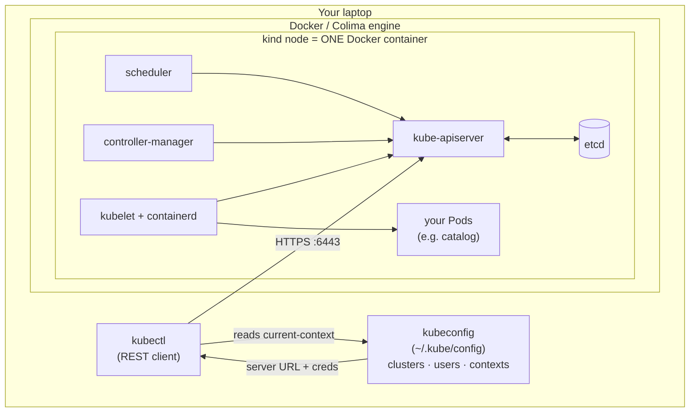

# 07 — Local cluster setup

> Install `kubectl`, stand up a real (local) cluster with kind, understand
> kubeconfig and contexts, learn the everyday `kubectl` verbs — and run the
> first Bookstore Pod from [ch.06](06-declarative-api-model.md) for real.

**Estimated time:** ~15 min read · ~60 min hands-on
**Prerequisites:** [Part 00 ch.02](02-containers-and-images.md) — container/image basics · [Part 00 ch.06](06-declarative-api-model.md) — the manifest you'll apply
**You'll know after this:** • install `kubectl` and bring up a local kind cluster · • understand `kubeconfig`, contexts, and namespaces · • use the everyday `kubectl` verbs (get, describe, logs, apply, exec, port-forward) · • apply the Bookstore Pod and watch reconciliation move it · • troubleshoot a Pod that fails to start on a real cluster

<!-- tags: foundations, kubectl, kind, kubeconfig, local-cluster -->

## Why this exists

Part 00 has been concepts and one validated-but-unrun manifest. Concepts only
stick once you've watched the reconciliation loop move *your* object on a *real*
cluster. You need a cluster that is **free, local, disposable, and identical in
API to production** so every later chapter's hands-on works the same on your
laptop as on EKS. This chapter gives you that environment and the small set of
`kubectl` verbs you'll use in literally every chapter after this — then closes
the Part 00 arc by deploying `bookstore/catalog:dev` and curling its
`/healthz`, exactly the lifecycle you traced in
[ch.03](03-architecture-overview.md) and [ch.05](05-node-components.md).

## Mental model

A local cluster tool **fakes the machines, not the API**. kind ("Kubernetes IN
Docker") runs each Kubernetes *node as a Docker container* and a real control
plane inside it. The objects, the API server pipeline
([ch.04](04-control-plane-deep-dive.md)), the kubelet/CRI flow
([ch.05](05-node-components.md)) are the genuine Kubernetes code — only the
"hardware" is containers. So everything you learn transfers; what differs is
purely the substrate (no cloud load balancers, local image loading, single
node) — flagged by `> **In production:**` callouts. `kubectl` is just a REST
client; **kubeconfig** is the file telling it *which* API server and *as whom*.

## Tooling diagram



A "node" here is a container; a multi-node kind cluster is just multiple
containers on the same Docker engine. That's the only illusion — the
Kubernetes inside is real.

## kind vs. k3d vs. minikube

All three give a conformant local cluster; pick one and move on (this guide
uses **kind** in examples; **k3d** is a first-class equivalent — every kind
command has a k3d twin shown where it matters).

| | **kind** | **k3d** | **minikube** |
|---|---|---|---|
| What it runs | Upstream Kubernetes, nodes = Docker containers | k3s (lightweight CNCF Kubernetes) in Docker | Kubernetes in a VM or container (multi-driver) |
| Start time | Fast | Fastest (k3s is lean) | Moderate |
| Multi-node | Yes (declared in config) | Yes | Yes (limited) |
| Closest to upstream | **Yes** (used by k8s' own CI) | k3s (a few defaults differ) | Yes |
| Load local image | `kind load docker-image` | `k3d image import` | `minikube image load` |
| Built-in addons | Minimal (you add what you need) | Minimal; bundled Traefik (can disable) | Many addons (`minikube addons`) |
| Best for | This guide; matching real clusters; CI | Very fast inner loop, many clusters | All-in-one local dev with batteries |

Why **kind** as the default: it is upstream Kubernetes (what runs in
production), nodes-as-containers makes the [ch.05](05-node-components.md)
internals directly inspectable (`docker exec` into a node), and it's what the
Kubernetes project itself tests with. **k3d** is excellent and faster for a
tight loop — its commands are noted alongside. **minikube** is great if you want
bundled addons; its driver model just adds a variable this guide doesn't need.

## Hands-on with the Bookstore

This is the payoff of Part 00: a running cluster and the first Bookstore Pod.

### 1. Install `kubectl`

```sh
# macOS (Homebrew)
brew install kubectl
# Linux (direct binary)
curl -LO "https://dl.k8s.io/release/$(curl -L -s https://dl.k8s.io/release/stable.txt)/bin/linux/amd64/kubectl"
sudo install -m 0755 kubectl /usr/local/bin/kubectl

kubectl version --client      # confirm it runs (server check comes after cluster up)
```

> Keep `kubectl` within one minor version of the cluster (the supported skew is
> ±1 minor). Mismatched skew is a common source of odd errors.

### 2. Install a cluster tool and create a cluster

```sh
# kind
brew install kind                                            # or `go install sigs.k8s.io/kind@latest`
kind create cluster --name bookstore                          # ~30s; nodes are Docker containers

# k3d equivalent (if you chose k3d)
# brew install k3d
# k3d cluster create bookstore
```

`kind create cluster` also **merges a context into your kubeconfig and switches
to it** — so `kubectl` immediately points at the new cluster.

> A Docker-compatible engine must be running (Docker Engine, or
> Rancher Desktop/Podman/etc.). If you see "Cannot connect to the Docker
> daemon", start your engine first, then re-run `kind create cluster`. If your
> engine does not expose the default `/var/run/docker.sock`, point Docker at
> its socket via `DOCKER_HOST` (see your engine's docs for the socket path).

### 3. Verify the control plane and nodes

You're now looking at the real architecture from
[ch.03](03-architecture-overview.md):

```sh
kubectl cluster-info                       # API server endpoint (the only door, ch.04)
kubectl get nodes -o wide                  # the node container(s); STATUS should be Ready
kubectl -n kube-system get pods            # control plane + CoreDNS + kube-proxy as Pods
kubectl get --raw='/readyz?verbose'        # API server health gates (ch.04 pipeline)
```

`kubectl get nodes` showing `Ready` means the kubelet ([ch.05](05-node-components.md))
in the node container has registered and is healthy.

### 4. kubeconfig & contexts

`kubectl` itself is stateless; **kubeconfig** (`~/.kube/config`, or
`$KUBECONFIG`) tells it where and as whom to connect. Three lists plus a
pointer:

```
kubeconfig (~/.kube/config)
├── clusters:   [ { name, server: https://…:6443, certificate-authority } , … ]
├── users:      [ { name, client-cert / token / exec-plugin (cloud auth) }  , … ]
├── contexts:   [ { name, cluster: <CLUSTERS.NAME>, user: <USERS.NAME>, namespace } , … ]
└── current-context: <CONTEXTS.NAME>     ← the (cluster + user + ns) kubectl uses NOW
```

A **context** binds a cluster + a user + a default namespace. Switching
clusters/identities is switching context — *no flags on every command*:

```sh
kubectl config get-contexts                       # all contexts; * marks current
kubectl config current-context                    # → kind-bookstore
kubectl config use-context kind-bookstore         # switch the active context
kubectl config set-context --current --namespace=default   # set default ns for this context
```

> **In production:** one kubeconfig typically holds *many* contexts
> (dev/staging/prod, multiple clusters/clouds). The single riskiest mistake
> is running a command against the wrong context — *always* confirm
> `kubectl config current-context` before mutating anything. Third-party tools
> like `kubectx`/`kubens` (<https://github.com/ahmetb/kubectx>) or a shell
> prompt that shows the context prevent "I applied that to **prod**".

### 5. `kubectl` basics (the everyday verbs)

These are ~90% of daily use; you'll repeat them in every later chapter:

```sh
kubectl get <KIND> [name] [-o wide|yaml|json]   # list/show (spec+status)
kubectl describe <KIND> <NAME>                  # human view + Events (debug start here)
kubectl logs <POD> [-c <CTR>] [-f] [--previous] # stdout/stderr (--previous = crashed ctr)
kubectl exec -it <POD> [-c <CTR>] -- sh         # shell into a container
kubectl apply -f <file|dir>                     # declarative create/update (ch.06)
kubectl delete -f <FILE>                        # delete what a manifest declared
kubectl port-forward <pod|svc> <LOCAL>:<REMOTE> # tunnel to a Pod/Service from your laptop
kubectl get events --sort-by=.lastTimestamp     # the reconciliation loop, narrated
kubectl explain <KIND>.spec                     # authoritative schema (ch.06)
```

`describe` + `logs` + `events` are the troubleshooting trident — internalize
them now ([Part 08 ch.03](../08-day-2-operations/03-troubleshooting-playbook.md)
goes deep).

### 6. Load the image and deploy the first Bookstore Pod

The Pod manifest was written and validated in
[ch.06](06-declarative-api-model.md):
[`raw-manifests/01-catalog-pod.yaml`](../examples/bookstore/raw-manifests/01-catalog-pod.yaml).
It uses `image: bookstore/catalog:dev` with `imagePullPolicy: IfNotPresent` —
that image lives only on your laptop ([ch.02](02-containers-and-images.md)), not
in any registry, so you must **load it into the kind node** or the kubelet will
`ImagePullBackOff`:

```sh
# Build the image if you haven't (ch.02). Start at the repo root, build, then
# return to the repo root so the kubectl paths below resolve.
cd full-guide/examples/bookstore/app
docker build -t bookstore/catalog:dev ./catalog
cd - >/dev/null            # back to where you were (the repo root)

# Make the image available INSIDE the kind node container.
kind load docker-image bookstore/catalog:dev --name bookstore
#   k3d:     k3d image import bookstore/catalog:dev -c bookstore
#   minikube: minikube image load bookstore/catalog:dev

# All paths below are relative to the repo root (full-guide/).
# (Optional) re-validate the manifest client-side before applying (ch.06)
kubectl apply --dry-run=client -f \
  examples/bookstore/raw-manifests/01-catalog-pod.yaml

# Declare the desired state for real → triggers the ch.03/ch.05 lifecycle
kubectl apply -f examples/bookstore/raw-manifests/01-catalog-pod.yaml

# Watch the reconciliation loop converge: Pending → ContainerCreating → Running
kubectl get pod catalog -w
```

When `STATUS` is `Running` and `READY` is `1/1`, reach the app the way you did
with plain `docker run` in [ch.02](02-containers-and-images.md) — but now it's a
real Pod scheduled by Kubernetes:

```sh
# Tunnel local :8080 → the Pod's container :8080
kubectl port-forward pod/catalog 8080:8080
# in another terminal:
curl -s localhost:8080/healthz ; echo     # {"status":"ok"}
curl -s localhost:8080/readyz  ; echo     # {"status":"ready"} (no DB/Redis yet)
curl -s localhost:8080/books   | head     # in-memory sample catalog
```

Now connect it to the internals you learned:

```sh
kubectl get pod catalog -o wide           # which node (kubelet, ch.05) runs it
kubectl describe pod catalog              # Events: scheduled → pulled → created → started
kubectl logs catalog                      # the Go app's JSON logs ("catalog listening")

# Peek at the data plane directly — kind nodes ARE containers (ch.05):
docker exec -it bookstore-control-plane crictl pods   # the catalog Pod + its pause sandbox
docker exec -it bookstore-control-plane crictl ps     # the running app container
```

You've now executed the *entire Part 00 arc against a real cluster*:
declarative `spec` ([ch.06](06-declarative-api-model.md)) → API server pipeline
→ etcd ([ch.04](04-control-plane-deep-dive.md)) → scheduler bind
([ch.04](04-control-plane-deep-dive.md)) → kubelet/CRI sandbox+container
([ch.05](05-node-components.md)) → status reported → traffic served. Everything
after this *adds* to this Pod.

### 7. Tear down (and reset any time)

A local cluster is disposable — deleting and recreating is the normal way to
get a clean slate:

```sh
kind delete cluster --name bookstore       # k3d: k3d cluster delete bookstore
```

(Deleting the cluster also removes its kubeconfig context.)

## How it works under the hood

- **`kind create cluster` = run node container(s) + bootstrap real Kubernetes
  in them.** kind uses a prebuilt node image containing kubelet, containerd,
  and the control-plane components, then runs `kubeadm` *inside* to bring up
  etcd, the API server, controller-manager, and scheduler — the genuine
  binaries from [ch.03](03-architecture-overview.md)/[ch.04](04-control-plane-deep-dive.md).
- **`kubectl` is a pure REST client.** It reads kubeconfig to find the API
  server URL and credentials, then makes the same HTTPS calls any controller
  makes (and gets the same authN→authZ→admission→validation pipeline,
  [ch.04](04-control-plane-deep-dive.md)). `kubectl apply` is client logic on
  top of that REST API ([ch.06](06-declarative-api-model.md)).
- **`kind load` exists because there's no shared registry.** Normally the
  kubelet pulls images from a registry ([ch.02](02-containers-and-images.md)
  pull flow). Locally, your image is only in your laptop's Docker engine, so
  `kind load` copies it *into the node container's containerd image store*;
  `imagePullPolicy: IfNotPresent` ([ch.06](06-declarative-api-model.md)) then
  makes the kubelet use that local copy instead of contacting a registry.
- **`port-forward` is a tunnel through the API server**, not a Service. The API
  server proxies a connection to the kubelet, which forwards to the Pod's
  port. It's a debugging convenience; real exposure uses Services/Ingress
  ([Part 02](../02-networking/02-services.md)) — which is why this works even
  with no cloud load balancer.

## Production notes

> **In production:** you do **not** run `kind`. The cluster is provisioned by a
> managed service (EKS/GKE/AKS) or a tool like kubeadm/Cluster API on real
> machines ([Part 08 ch.01](../08-day-2-operations/01-cluster-lifecycle.md)).
> kind/k3d are for *local dev and CI* (kind is excellent in CI — ephemeral
> clusters per pipeline run). The **API and objects are identical**; only
> provisioning and substrate differ.

> **In production:** kubeconfig credentials are typically **short-lived, via an
> auth exec plugin** (`aws eks get-token`, `gke-gcloud-auth-plugin`, OIDC), not
> a static cert in a file. Never commit kubeconfig or long-lived tokens; treat
> the file as a secret.

> **In production:** `Service` type `LoadBalancer` and dynamic `PersistentVolume`
> provisioning **don't work on bare kind** (no
> [cloud-controller-manager](04-control-plane-deep-dive.md), no cloud CSI). You
> use `port-forward`/NodePort and local-path storage locally; the cloud
> provides real LBs and disks. Every chapter's `In production:` callouts flag
> these substrate gaps — the manifests themselves stay the same.

> **In production:** the riskiest everyday operation is **acting on the wrong
> context**. Enforce a context indicator (prompt segment, `kubectx`), and
> prefer GitOps so changes go through a reviewed repo rather than ad-hoc
> `kubectl apply` against prod ([Part 07](../07-delivery/04-gitops-argocd.md)).

> **In production:** a bare Pod like this one is **not** what you deploy — it
> isn't rescheduled on node loss or recreated on permanent crash. It's a Part
> 00 teaching artifact; [Part
> 01](../01-core-workloads/04-replicasets-and-deployments.md) replaces it with
> a self-healing Deployment.

## Quick Reference

```sh
# cluster lifecycle (local)
kind create cluster --name bookstore        # k3d: k3d cluster create bookstore
kind delete cluster --name bookstore        # k3d: k3d cluster delete bookstore
kind load docker-image  --name bookstore   # k3d: k3d image import  -c bookstore

# context / kubeconfig
kubectl config get-contexts                  # list contexts (* = current)
kubectl config current-context               # which cluster/user am I on?
kubectl config use-context <NAME>            # switch context
kubectl config set-context --current --namespace=<NS>   # default namespace

# verify
kubectl cluster-info ; kubectl get nodes -o wide ; kubectl get --raw=/readyz

# everyday verbs
kubectl apply -f <F> ; kubectl get <K> ; kubectl describe <K> <N>
kubectl logs <POD> [-f|--previous] ; kubectl exec -it <POD> -- sh
kubectl port-forward pod/<P> 8080:8080 ; kubectl delete -f <F>
```

Smallest end-to-end loop (the thing to remember):

```
# run from the repo root (full-guide/)
docker build -t bookstore/catalog:dev examples/bookstore/app/catalog   # ch.02 image
kind create cluster --name bookstore                    # real local cluster
kind load docker-image bookstore/catalog:dev --name bookstore   # no registry locally
kubectl apply -f examples/bookstore/raw-manifests/01-catalog-pod.yaml   # declare (ch.06)
kubectl get pod catalog -w                               # watch the loop converge
kubectl port-forward pod/catalog 8080:8080 && curl localhost:8080/healthz
```

Setup checklist:

- [ ] `kubectl` installed, within ±1 minor of the cluster
- [ ] Docker/Colima engine running before `kind create cluster`
- [ ] Cluster up; all nodes `Ready`; kube-system Pods running
- [ ] You confirm `current-context` before any mutating command
- [ ] Local image `kind load`ed (matches `imagePullPolicy: IfNotPresent`)
- [ ] `catalog` Pod `Running 1/1`; `/healthz` returns `{"status":"ok"}`
- [ ] You can tear down and recreate from scratch (cluster is disposable)

## Test your understanding

> Try each before opening the answer drawer. The act of trying is the exercise; the answer is the check.

1. **Why does the `catalog` manifest use `imagePullPolicy: IfNotPresent` for local kind use, and what would go wrong with `Always`?**
   <details><summary>Show answer</summary>

   `bookstore/catalog:dev` only exists in your laptop's Docker engine and `kind load` copies it into the node container's containerd image store. With `Always`, the kubelet would contact a registry every time — but there is none for `bookstore/catalog:dev`, so it fails `ImagePullBackOff`. `IfNotPresent` makes the kubelet use the loaded local copy and skip the registry round-trip (see §Hands-on step 6, and §How it works under the hood, `kind load`).

   </details>

2. **A teammate runs `kubectl apply` and accidentally targets the production cluster instead of dev. What single shell-level habit could have prevented this, and what's the deeper architectural reason a stronger mechanism (GitOps) is preferable?**
   <details><summary>Show answer</summary>

   Always confirm `kubectl config current-context` before any mutating command, or use a shell prompt segment / kubectx to make context visible. The deeper fix is GitOps: changes go through a reviewed pull request, and an Argo CD/Flux controller running *in* the target cluster reconciles from Git — there is no human typing apply at prod (see §kubeconfig & contexts, §Production notes).

   </details>

3. **You run `kubectl port-forward pod/catalog 8080:8080` on a brand-new kind cluster with no `Service` and no cloud load balancer. Why does this work, and why is it explicitly not how you'd expose the Pod in production?**
   <details><summary>Show answer</summary>

   `port-forward` is a tunnel through the API server: kubectl opens an HTTPS connection to the API server, which proxies to the kubelet, which forwards to the Pod's container port. It needs no Service or LB. In production you don't want every user holding open an API-server tunnel — you use Services and Ingress so traffic flows through the data plane, not the control plane (see §How it works under the hood, port-forward).

   </details>

4. **You `kubectl apply` the catalog Pod, but `kubectl get pod` stays `Pending` with no events about scheduling. What's the most likely cause on a fresh kind cluster, and where do you look?**
   <details><summary>Show answer</summary>

   Most likely the image isn't loaded — but a `Pending` (not `ContainerCreating`) suggests the scheduler hasn't bound the Pod yet, which on a single-node kind cluster usually means the Pod is failing admission (e.g., a request exceeds node allocatable) or no Ready node exists. `kubectl describe pod` events name the rejection. `kubectl get nodes` should show `Ready`; if not, check `kubectl -n kube-system get pods` for control-plane health (see §Verify the control plane and nodes).

   </details>

5. **Hands-on extension: bring up the cluster, deploy the catalog Pod, then `kind delete cluster --name bookstore` and `kind create cluster --name bookstore` again. Re-`kubectl get pod`. What's gone, and what's the point of this exercise?**
   <details><summary>What you should see</summary>

   Nothing — `no resources found` — the cluster (etcd, everything) was disposable. The point: local clusters are cattle, not pets. Treating "reset to clean" as a one-command operation is a deliberate workflow that mirrors how production clusters should be reproducible from manifests in Git, not by accumulated hand-applied state (see §Tear down (and reset any time), §Production notes).

   </details>

## Further reading

- **Poulton, _The Kubernetes Book_, ch.3 (and its setup appendix)** — getting a
  local cluster and `kubectl` working, first deployment.
- **Lukša, _Kubernetes in Action_ 2e, ch.3 — "Deploying your first
  application"** — kubeconfig/contexts, the core `kubectl` verbs, and watching
  the first workload come up.
- Official: kind <https://kind.sigs.k8s.io/docs/user/quick-start/>, k3d
  <https://k3d.io/>, `kubectl` install
  <https://kubernetes.io/docs/tasks/tools/>, and the kubectl cheatsheet
  <https://kubernetes.io/docs/reference/kubectl/cheatsheet/>.
