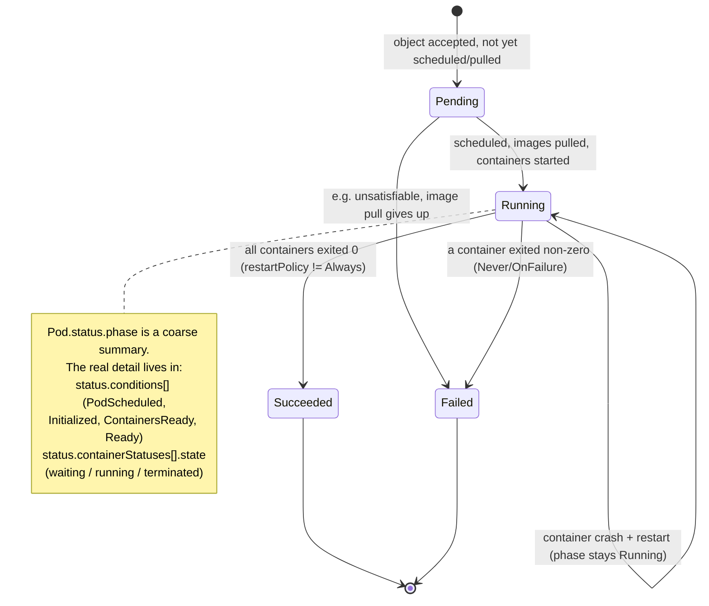

# 01 — Pods

> The Pod is Kubernetes' atom of scheduling and the unit of co-location: one or
> more containers that share a network, IPC, and UTS namespace plus volumes,
> always on one node. Phases, conditions, multi-container patterns, init and
> ephemeral containers — and why you almost never create a bare Pod yourself.

**Estimated time:** ~15 min read · ~30 min hands-on
**Prerequisites:** [Part 00 ch.06](../00-foundations/06-declarative-api-model.md) — the spec/status object model · [Part 00 ch.07](../00-foundations/07-local-cluster-setup.md) — a kind cluster to apply to
**You'll know after this:** • articulate why the Pod (not the container) is the unit of scheduling · • read a PodSpec and identify shared namespaces and volumes · • interpret Pod phases (Pending/Running/Succeeded/Failed/Unknown) and conditions · • choose between init, sidecar, and ephemeral containers for a real scenario · • explain why you almost never create a bare Pod in production

<!-- tags: core-objects, pods, multi-container, init-containers, ephemeral-containers -->

## Why this exists

[Part 00](../00-foundations/06-declarative-api-model.md) ended with one object:
`catalog` as a bare Pod, applied to a real cluster in
[ch.07](../00-foundations/07-local-cluster-setup.md). That worked, but it raised
questions the rest of Part 01 answers: *what exactly is a Pod, why is it a Pod
and not "a container", and why is running a bare one an anti-pattern?*

A container is one isolated process tree. Real workloads frequently need **two
processes that must share fate and locality**: an app plus a log shipper that
tails its files, an app plus a proxy that holds its outbound connections, a
data store plus a one-shot schema loader that must finish *before* the store
accepts traffic. Scheduling those independently (two containers that *might*
land on different machines, *might* start in any order, *can't* see each other's
filesystem or `localhost`) breaks them. Kubernetes' answer is the **Pod**: a
group of containers guaranteed to be co-scheduled on one node, sharing selected
Linux namespaces and storage, with a single lifecycle. The Pod — not the
container — is therefore the smallest thing Kubernetes schedules, addresses
(one IP), and reports status for. Every higher workload (Deployment,
StatefulSet, Job…) ultimately produces Pods; understanding the Pod is
understanding all of them.

## Mental model

A Pod is a **shared execution context**, modeled on a single (virtual) host:
the containers in it behave like processes on one machine. They share:

- **Network namespace** — one IP, one port space. Containers reach each other
  over `localhost`; two containers cannot both bind `:8080`.
- **IPC namespace** — they can use SysV IPC / POSIX shared memory between them.
- **UTS namespace** — they share a hostname.
- **Volumes** — any volume the Pod declares can be mounted into multiple
  containers, the basis of "sidecar writes a file, app reads it".

They do **not** share a PID namespace by default (each container sees only its
own processes unless `shareProcessNamespace: true`) and do **not** share mount
namespaces (each has its own root filesystem; only declared volumes are shared).
The Pod itself is "the box": Kubernetes schedules, networks, and reports on the
box; the containers are processes inside it. A Pod is normally **ephemeral and
cattle, not a pet** — it is never moved; if its node dies it is gone and a
controller must create a *new* one. That single fact is why bare Pods are a
teaching device, not a deployment unit.

## Diagrams

### Shared-namespace structure of a Pod (ASCII)

```
                       Pod  "catalog"   (one IP: 10.244.1.7)
 ┌───────────────────────────────────────────────────────────────────────┐
 │  shared:  NET namespace (1 IP, 1 port space) · IPC · UTS (hostname)    │
 │                                                                       │
 │   ┌───────────────────┐   localhost   ┌────────────────────────────┐  │
 │   │ container: catalog │◄────────────► │ container: log-sidecar     │  │
 │   │  app proc :8080    │               │  tails /var/log/app/*.log  │  │
 │   │  own rootfs (img)  │               │  own rootfs (img)          │  │
 │   └─────────┬──────────┘               └──────────────┬─────────────┘  │
 │             │      both mount the SAME emptyDir       │                │
 │             ▼                                          ▼                │
 │        ┌───────────────────────────────────────────────────┐          │
 │        │  volume: varlog (emptyDir)  →  /var/log/app         │          │
 │        └───────────────────────────────────────────────────┘          │
 │                                                                       │
 │   (pause/sandbox container holds the namespaces; not user-visible)    │
 └───────────────────────────────────────────────────────────────────────┘
   NOT shared by default: PID namespace, mount namespace (rootfs per ctr)
```

### Pod lifecycle state machine (Mermaid)



## Hands-on with the Bookstore

**Assumed working directory: the guide repo root (`full-guide/`).** All paths
are relative to it. Have a cluster from
[Part 00 ch.07](../00-foundations/07-local-cluster-setup.md)
(`kind create cluster --name bookstore`) and the catalog image loaded.

We continue the *exact* manifest from
[Part 00 ch.06](../00-foundations/06-declarative-api-model.md)
([`raw-manifests/01-catalog-pod.yaml`](../examples/bookstore/raw-manifests/01-catalog-pod.yaml))
and grow it by **one idea**: add a **logging sidecar**. The catalog app already
logs structured JSON to stdout (correct 12-factor behavior — `kubectl logs`
reads that directly), so we leave the app container *unmodified* and add a
second, long-lived container that *owns the shared log directory and would ship
it* — the canonical "co-located helper sharing a volume with the app" pattern.
Keeping the app container untouched also keeps the Pod runnable as-is (the
Bookstore image is distroless and has no shell).

### 1. Inspect the running bare Pod (recap)

```sh
kubectl get pod catalog -o wide
kubectl get pod catalog -o jsonpath='{.status.phase}{"\n"}'        # Running
kubectl get pod catalog \
  -o jsonpath='{range .status.conditions[*]}{.type}={.status}{"\n"}{end}'
#   PodScheduled=True / Initialized=True / ContainersReady=True / Ready=True
```

`phase` is the coarse summary from the state machine above; the **conditions**
are the truth the Service (next Part) and controllers actually gate on.

### 2. Add a logging sidecar — the modern way (native sidecar)

Create
[`examples/bookstore/raw-manifests/02-catalog-pod-sidecar.yaml`](../examples/bookstore/raw-manifests/02-catalog-pod-sidecar.yaml):

```yaml
apiVersion: v1
kind: Pod
metadata:
  name: catalog                 # same object identity as 01 — this is an evolution
  labels:
    app: catalog                # UNCHANGED: selectors in later chapters still match
    component: backend
spec:
  # initContainers with restartPolicy: Always == a "native sidecar" (GA in 1.29+).
  # It starts BEFORE the app, stays running ALONGSIDE it, and is guaranteed to
  # be shut down AFTER the app — exactly the sidecar lifecycle you want for a
  # log shipper, without the legacy pitfalls (see "under the hood").
  initContainers:
    - name: log-sidecar
      image: busybox:1.36       # public image: no `kind load` needed
      restartPolicy: Always     # <-- this is what makes it a NATIVE SIDECAR
      command: ["/bin/sh", "-c"]
      args:
        - |
          echo "log-sidecar: shipping from /var/log/app";
          while true; do
            echo "$(date -u +%FT%TZ) log-sidecar: tail/ship tick";
            sleep 30;
          done
      volumeMounts:
        - name: varlog
          mountPath: /var/log/app
  containers:
    - name: catalog
      image: bookstore/catalog:dev
      imagePullPolicy: IfNotPresent     # locally loaded image (ch.07)
      ports:
        - name: http
          containerPort: 8080
      env:
        - name: PORT
          value: "8080"
      # App container UNMODIFIED: it logs JSON to stdout (kubectl logs reads it).
      volumeMounts:
        - name: varlog
          mountPath: /var/log/app
  volumes:
    - name: varlog
      emptyDir: {}              # shared scratch dir, lives & dies with the Pod
```

> Why the sidecar only heartbeats here: a real log shipper (Fluent Bit, Vector)
> would `tail -F /var/log/app/*.log` and forward it. We keep the app container
> **unmodified** (distroless, no shell — it logs to stdout, which is correct)
> so the **shape** is what you learn: a long-lived helper container in the same
> Pod, sharing a volume, with native-sidecar start/stop ordering. Swapping the
> busybox loop for `fluent-bit` reading `/var/log/app` is the only change to
> make this production-shaped.

Apply and observe both containers in one Pod:

```sh
# from the repo root (full-guide/)
kubectl delete pod catalog --ignore-not-found      # replace the bare Pod
kubectl apply -f examples/bookstore/raw-manifests/02-catalog-pod-sidecar.yaml
kubectl get pod catalog -o jsonpath='{.spec.containers[*].name} | INIT(sidecar): {.spec.initContainers[*].name}{"\n"}'
kubectl get pod catalog                              # READY shows 2/2 once both up
kubectl logs catalog -c catalog --tail=3             # the Go app's JSON logs
kubectl logs catalog -c log-sidecar --tail=3         # the sidecar tailing the file
```

### 3. Demonstrate the shared namespaces

```sh
# Same network namespace: the sidecar reaches the app over localhost.
kubectl exec catalog -c log-sidecar -- wget -qO- http://localhost:8080/healthz ; echo
#   {"status":"ok"}  ← proves one shared network namespace / one IP

# Same volume, different containers: write from the sidecar; a debug container
# joined to the app verifies it sees the SAME emptyDir contents.
kubectl exec catalog -c log-sidecar -- sh -c 'echo hi > /var/log/app/x; ls -l /var/log/app'
kubectl debug -q catalog --image=busybox:1.36 --target=catalog -- ls -l /var/log/app
#   shows the same /var/log/app/x — one shared volume, two containers
# (the app container itself is distroless: `kubectl exec catalog -c catalog -- …`
#  fails because there is no shell — exactly why `kubectl debug` exists.)
```

### 4. Ephemeral (debug) container — debugging without rebuilding

The catalog image is distroless (no shell, no `curl`). You still need to debug
it. `kubectl debug` injects an **ephemeral container** that shares the target's
namespaces:

```sh
kubectl debug -it catalog --image=busybox:1.36 --target=catalog -- sh
#   inside: `wget -qO- localhost:8080/books` works — same netns as `catalog`.
#   `--target=catalog` also shares that container's process namespace so you
#   can see and strace the app process.
kubectl get pod catalog -o jsonpath='{.spec.ephemeralContainers[*].name}{"\n"}'
```

Ephemeral containers are never restarted, cannot have probes/ports/resources,
and vanish from intent when you stop them — they exist purely for live
debugging of an existing Pod.

### 5. Why you will not keep doing this

This is still a **bare Pod**: delete it and nothing brings it back; if its node
dies it is gone forever.

```sh
kubectl delete pod catalog
kubectl get pod catalog          # Error: not found — NOTHING recreated it
```

That is the cliff-edge motivating [ch.04](04-replicasets-and-deployments.md).
For now, re-apply it so later chapters in this Part have a Pod to evolve:

```sh
kubectl apply -f examples/bookstore/raw-manifests/02-catalog-pod-sidecar.yaml
```

> **Manifest lineage.** `01-catalog-pod.yaml` (bare Pod, Part 00) is the
> teaching seed and is **kept**. `02-catalog-pod-sidecar.yaml` is the same
> `catalog` object plus the sidecar concept. Subsequent chapters add probes
> (ch.02) and resources (ch.03) to the *Pod template*, then ch.04 lifts that
> template into a Deployment under the `bookstore` namespace introduced in
> ch.03. Each numbered file is a frozen snapshot of one increment; nothing is
> deleted, so you can always diff "before vs. after a concept".

## Multi-container patterns

A Pod with more than one container is justified only when the containers must
share **fate + locality + a namespace/volume**. Three named patterns (the
[Kubernetes Patterns](#further-reading) structural patterns) cover almost all
legitimate uses:

| Pattern | Helper container's job | Bookstore example |
|---|---|---|
| **Sidecar** | Augments the main container (logging, sync, proxy) for the *whole* lifetime | log shipper tailing `/var/log/app` (above); later, a metrics or mesh proxy |
| **Adapter** | Normalizes the main container's output to a standard the outside expects | exposing app metrics in Prometheus format if the app spoke a different one |
| **Ambassador** | Proxies the main container's *outbound* connections to the outside world | a local proxy so `catalog` connects to `localhost:6379` while the ambassador handles real Redis discovery/TLS |

### Sidecars: legacy vs. native (1.29+ GA)

Historically a sidecar was just an extra entry in `containers:`. That had two
real defects:

1. **Startup ordering.** Regular containers start in parallel; the app could
   begin serving before the proxy/log sidecar was ready.
2. **Shutdown ordering & Job completion.** On termination all containers get
   `SIGTERM` together, so a sidecar could die while the app still needed it; and
   in a Job a never-exiting sidecar kept the Job from ever completing.

The fix, **GA in Kubernetes 1.29+** (target here is **v1.30+**): declare the
sidecar as an **init container with `restartPolicy: Always`** — a *native
sidecar*. The kubelet then gives it sidecar lifecycle semantics:

- It **starts and becomes ready before** the regular `containers[]` start.
- It **runs concurrently** with them for the Pod's life (unlike a normal init
  container, which must exit before the next one).
- It is **terminated after** the regular containers on Pod shutdown.
- It **does not block Job completion** (Job finishes when the regular
  containers finish; native sidecars are then stopped).

This is why the Bookstore sidecar above is under `initContainers:` with
`restartPolicy: Always`, not under `containers:`. New designs should prefer
native sidecars; the legacy "extra `containers[]` entry" still works and you
will see it in older manifests.

### Init containers

`initContainers` (without `restartPolicy: Always`) run **to completion, in
order, before any app container starts**. Each must exit 0 before the next
runs; any failure restarts the init sequence (subject to `restartPolicy`). Uses:
wait for a dependency, run a schema migration, fetch a config/secret, set a
kernel param (privileged) — work that must finish *before* the app starts. The
Bookstore uses a real init pattern later (the DB-migration Job in
[ch.07](07-jobs-and-cronjobs.md) is the run-once-before form; an init container
that waits for Postgres is a common companion).

## How it works under the hood

- **The pause (sandbox) container holds the namespaces.** When the kubelet
  ([Part 00 ch.05](../00-foundations/05-node-components.md)) starts a Pod it
  first creates an almost-empty **sandbox** ("pause") container
  (`registry.k8s.io/pause`). That process does nothing but hold the Pod's
  network/IPC/UTS namespaces open. Every other container in the Pod is created
  by the CRI runtime to **join the sandbox's namespaces** (`--net=container:…`).
  That is *mechanically* how containers in a Pod get one IP and a shared
  `localhost`: they are all attached to the pause container's network
  namespace. The pause container also reaps zombies if PID sharing is on. It is
  why a Pod survives an app-container restart with the **same IP** — the
  sandbox (and its IP) outlives individual container restarts.
- **Pod IP comes from the CNI plugin, once, for the sandbox.** The kubelet asks
  the CNI plugin to wire the sandbox's netns and assign an IP; all containers
  inherit it. (Networking internals are [Part 02](../02-networking/01-networking-model.md).)
- **`phase` is derived; `conditions` are computed by the kubelet.** The kubelet
  reports each container's state (`waiting`/`running`/`terminated` with reason,
  e.g. `CrashLoopBackOff`, `OOMKilled`) and computes `PodScheduled`,
  `Initialized`, `ContainersReady`, `Ready`. `Ready` (gated by readiness
  probes, [ch.02](02-health-and-lifecycle.md)) is what the EndpointSlice
  controller uses to decide if a Pod receives Service traffic — the link
  between Pod internals and the rest of the system.
- **`restartPolicy` is Pod-wide** (`Always` default | `OnFailure` | `Never`)
  and applies to app containers. It is the field a Job flips to `OnFailure`/
  `Never` ([ch.07](07-jobs-and-cronjobs.md)). Native sidecars get their own
  `restartPolicy: Always` *per init container*, independent of the Pod's.
- **Restarts are exponential-backoff, in place.** A crashed container is
  restarted by the kubelet *on the same node, in the same Pod, same IP*, with
  backoff capped at 5 minutes (`CrashLoopBackOff`). Rescheduling to another node
  is **not** a Pod feature — that requires a controller making a *new* Pod.

## Production notes

> **In production:** never run a **bare Pod** for a real workload. It is not
> rescheduled if the node dies and not recreated if it is deleted or crashes
> unrecoverably. Always use a controller (Deployment/StatefulSet/DaemonSet/Job,
> [ch.04](04-replicasets-and-deployments.md)+). The only legitimate bare Pods
> are short-lived debug/one-shot Pods you create and delete by hand.

> **In production:** keep Pods **single-responsibility**. A second container is
> justified only by shared fate+locality (logging/proxy/adapter). Do not stuff
> an app and its database into one Pod to "keep them together" — they have
> different scaling, lifecycle, and failure domains. Co-location is a coupling,
> not a convenience.

> **In production:** adopt **native sidecars** (`initContainers` +
> `restartPolicy: Always`) on clusters ≥1.29 for log shippers, service-mesh
> proxies, and config reloaders — it fixes the start/stop ordering and the
> "sidecar keeps a Job alive forever" bug that plagued the legacy pattern. EKS/
> GKE/AKS all support it on supported (1.29+) control planes; verify the node
> kubelet version, not just the control plane.

> **In production:** ephemeral/debug containers require the
> `EphemeralContainers` feature (on by default in supported releases) and are
> often **restricted by Pod Security / admission policy**
> ([Part 05](../05-security/02-pod-security.md)) because they can target a
> running workload. Expect to need RBAC for `pods/ephemeralcontainers` and a
> policy exception; do not assume `kubectl debug` works unprivileged in a
> hardened cluster.

> **In production:** distroless/static images (like the Bookstore services)
> have **no shell** — `kubectl exec … -- sh` fails. Standardize on
> `kubectl debug --image=…` with a debug toolbox image; bake this into the
> troubleshooting runbook ([Part 08 ch.03](../08-day-2-operations/03-troubleshooting-playbook.md)).

## Quick Reference

```sh
kubectl get pod <P> -o wide                       # node, IP, READY count
kubectl get pod <P> -o jsonpath='{.status.phase}' # coarse phase
kubectl describe pod <P>                          # conditions + Events (start here)
kubectl logs <P> -c <CTR> [-f] [--previous]       # per-container logs
kubectl exec -it <P> -c <CTR> -- sh               # shell (if the image has one)
kubectl debug -it <P> --image=busybox --target=<CTR> -- sh   # ephemeral debug ctr
kubectl get pod <P> -o jsonpath='{.spec.initContainers[*].name}'   # incl. native sidecars
```

Minimal multi-container Pod skeleton (native sidecar + shared volume):

```yaml
apiVersion: v1
kind: Pod
metadata: { name: <APP>, labels: { app: <APP> } }
spec:
  initContainers:
    - name: <SIDECAR>
      image: <HELPER-IMAGE>
      restartPolicy: Always          # => native sidecar (1.29+)
      volumeMounts: [ { name: shared, mountPath: /shared } ]
  containers:
    - name: <APP>
      image: <APP-IMAGE>
      imagePullPolicy: IfNotPresent  # if image is kind-loaded, not in a registry
      ports: [ { name: http, containerPort: 8080 } ]
      volumeMounts: [ { name: shared, mountPath: /shared } ]
  volumes:
    - name: shared
      emptyDir: {}
```

Checklist:

- [ ] One concern per container; extra containers justified by shared fate
- [ ] Sidecars on 1.29+ use `initContainers` + `restartPolicy: Always`
- [ ] `initContainers` (no `Always`) for must-finish-first setup
- [ ] Shared data via a `volumes:` entry mounted into each container
- [ ] `imagePullPolicy` matches how the image reaches the node
- [ ] Real workload → behind a controller, never a bare Pod
- [ ] Distroless images debugged via `kubectl debug`, not `exec … sh`

## Test your understanding

> Try each before opening the answer drawer. The act of trying is the exercise; the answer is the check.

1. **Why is the Pod — not the container — the unit Kubernetes schedules and addresses? Give one concrete pattern that doesn't work if every container were independently scheduled.**
   <details><summary>Show answer</summary>

   Pods are the unit because two containers often need shared fate, locality, network namespace, and a volume — independent scheduling could land them on different nodes, start in arbitrary order, or fail to share `localhost`. A log sidecar that tails the app's `/var/log/app/*.log` via a shared `emptyDir` only works if both containers are co-scheduled on one node and share the volume mount — exactly what a Pod guarantees (see §Mental model and §Multi-container patterns).

   </details>

2. **What's the difference between adding a sidecar in `containers:` versus as an `initContainers` entry with `restartPolicy: Always`, and which two bugs does the native sidecar form fix?**
   <details><summary>Show answer</summary>

   Native sidecars (initContainer + `restartPolicy: Always`, GA 1.29) start *before* and shut down *after* the app, and don't block Job completion. The legacy form starts in parallel (app may serve before the proxy is ready) and gets SIGTERM together with the app (the sidecar can die mid-drain). In Jobs, a never-exiting legacy sidecar prevents the Job from ever completing (see §Sidecars: legacy vs. native).

   </details>

3. **You see a `catalog` Pod in `CrashLoopBackOff` and `kubectl get pod` shows the same IP across restarts. Why doesn't the IP change, and how does this connect to the pause container?**
   <details><summary>Show answer</summary>

   The pause container holds the Pod's network namespace and the CNI plugin runs only once per Pod, at sandbox creation. App containers join the sandbox's namespaces, so when an app container crashes and is restarted in place, the sandbox (and its IP) persists. The IP only changes when the *Pod itself* is recreated (different Pod, fresh sandbox) — see §How it works under the hood.

   </details>

4. **A teammate's distroless app Pod won't let them `kubectl exec -it … -- sh` to debug a misbehaving request. What's the right approach, and what RBAC/PSA caveat should they expect?**
   <details><summary>Show answer</summary>

   Use `kubectl debug -it <pod> --image=busybox --target=<container> -- sh` — this injects an ephemeral container sharing the target's namespaces. They'll likely need RBAC for `pods/ephemeralcontainers` and may hit Pod Security admission rules in a hardened cluster (ephemeral containers can target a running workload, so they're often restricted). See §Ephemeral containers and §Production notes.

   </details>

5. **Hands-on extension: apply `02-catalog-pod-sidecar.yaml`, then `kubectl exec catalog -c log-sidecar -- wget -qO- http://localhost:8080/healthz`. Why does this work without any Service, and what does it prove?**
   <details><summary>What you should see</summary>

   You should see `{"status":"ok"}`. The sidecar reaches the app over `localhost` because both containers share one network namespace held by the pause sandbox — same IP, same port space. This proves the Pod's network-namespace sharing model directly: no Service, no DNS, no kube-proxy involved, just two processes that happen to see the same network stack (see §Shared-namespace structure and §3. Demonstrate the shared namespaces).

   </details>

## Further reading

- **Lukša, _Kubernetes in Action_ 2e, ch.5 — "Running workloads in Pods"** —
  the Pod object, multi-container Pods, init containers, lifecycle and the
  shared-namespace model.
- **Ibryam & Huß, _Kubernetes Patterns_ 2e** — *Init Container* (ch.15),
  *Sidecar* (ch.16), *Adapter* (ch.17), *Ambassador* (ch.18): when and why each
  multi-container shape is the right tool.
- Official: <https://kubernetes.io/docs/concepts/workloads/pods/> and the
  native-sidecar guide
  <https://kubernetes.io/docs/concepts/workloads/pods/sidecar-containers/>.
