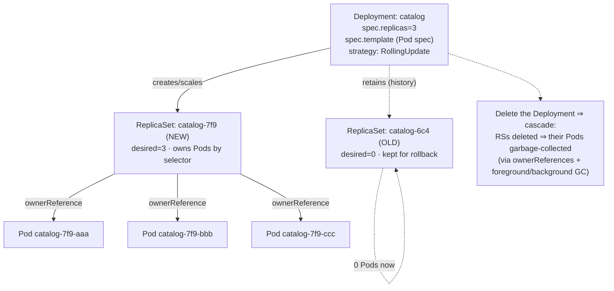
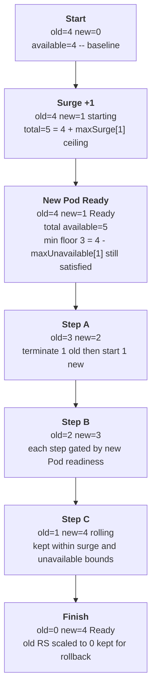

# 04 — ReplicaSets and Deployments

> ReplicaSets keep N identical Pods alive via a label selector; Deployments
> manage ReplicaSets to give you rolling updates, rollback, and revision
> history. The surge math, `recreate` vs `rollingUpdate`, ownerReferences and
> cascading delete — applied by graduating catalog and storefront from bare
> Pods to Deployments in the `bookstore` namespace.

**Estimated time:** ~15 min read · ~60 min hands-on
**Prerequisites:** [Part 01 ch.01](01-pods.md) — what's being replicated · [Part 00 ch.06](../00-foundations/06-declarative-api-model.md) — selectors and labels
**You'll know after this:** • understand how a ReplicaSet keeps N Pods alive via label selector · • use a Deployment to roll out a new image and roll it back · • compute `maxSurge` and `maxUnavailable` for a rolling update · • choose between `Recreate` and `RollingUpdate` strategies · • trace `ownerReferences` and predict cascading-delete behavior

<!-- tags: core-objects, deployments, replicasets, rolling-update, rollback -->

## Why this exists

[ch.01](01-pods.md) ended on the cliff-edge: a bare Pod is *not recreated* if
it dies and *not rescheduled* if its node fails — there is no controller
watching it. [Part 00 ch.06](../00-foundations/06-declarative-api-model.md)
taught the principle that fixes this: a controller that continuously reconciles
desired vs. actual. Apply that principle to "I want N copies of this Pod
running" and you get the **ReplicaSet**. Apply it again to "I want to *change*
the running version without downtime, and undo it if it's bad" and you get the
**Deployment**.

This is the chapter where the Bookstore becomes operable: self-healing
(crashed/lost Pods are replaced), scalable (change one number), and
**rollable** (ship a new image with zero-downtime, roll back in one command).
Almost every stateless workload you will ever run is a Deployment; this is the
[Declarative Deployment](#further-reading) pattern in its primary form.

## Mental model

Three nested controllers, each reconciling one level:

- **ReplicaSet** owns *Pods*. Its job: "the number of Pods matching my
  `selector` must equal `replicas`." Too few → create from the Pod template;
  too many → delete. It heals (a deleted Pod ⇒ observed<desired ⇒ make another)
  but **cannot change** running Pods — a template change just means future
  Pods differ from current ones.
- **Deployment** owns *ReplicaSets*. To change the app (new image, new env) it
  doesn't mutate Pods; it **creates a new ReplicaSet** for the new template and
  **shifts replicas** from the old RS to the new one according to a strategy,
  keeping the old RS (scaled to 0) around for **rollback**.
- You own the *Deployment*. You only ever edit the Deployment's `spec`; the two
  controllers below translate that into Pods.

So a rolling update is just: *Deployment scales new-RS up and old-RS down, a
few Pods at a time, gated by readiness*, until new-RS = desired and old-RS = 0.
"Rollback" is the same machinery aimed at a previous RS. Ownership is recorded
in `ownerReferences`, which is also what makes deletion cascade correctly.

## Diagrams

### Deployment → ReplicaSet → Pod ownership (Mermaid)



### Rolling update timeline, replicas=4, maxSurge=1, maxUnavailable=1 (Mermaid)



## Hands-on with the Bookstore

**Assumed working directory: the guide repo root (`full-guide/`).** Requires
the `bookstore` namespace from [ch.03](03-resources-and-qos.md)
(`kubectl apply -f examples/bookstore/raw-manifests/00-namespace.yaml`) and the
`bookstore/catalog:dev` + `bookstore/storefront:dev` images loaded into the
cluster (`kind load docker-image bookstore/catalog:dev --name bookstore`, and
the same for `storefront`).

We now **graduate** catalog from a bare Pod to a self-healing Deployment in the
`bookstore` namespace, carrying forward the probes (ch.02) and resources
(ch.03), and add the **storefront** Deployment so the app has its UI tier.

### 1. catalog as a Deployment

New file
[`examples/bookstore/raw-manifests/10-catalog-deploy.yaml`](../examples/bookstore/raw-manifests/10-catalog-deploy.yaml):

```yaml
apiVersion: apps/v1
kind: Deployment
metadata:
  name: catalog
  namespace: bookstore                 # the app now lives here (ch.03)
  labels:
    app: catalog
    app.kubernetes.io/part-of: bookstore
spec:
  replicas: 3                          # desired Pod count (self-healed to this)
  revisionHistoryLimit: 5              # keep 5 old ReplicaSets for rollback
  selector:
    matchLabels:
      app: catalog                     # MUST match template labels exactly
  strategy:
    type: RollingUpdate
    rollingUpdate:
      maxSurge: 1                      # at most replicas+1 during a rollout
      maxUnavailable: 0                # never drop below `replicas` Ready (safest)
  template:
    metadata:
      labels:
        app: catalog                   # selected by the RS above AND by the Service later
        component: backend
    spec:
      containers:
        - name: catalog
          image: bookstore/catalog:dev
          imagePullPolicy: IfNotPresent
          ports:
            - name: http
              containerPort: 8080
          env:
            - name: PORT
              value: "8080"
          startupProbe:
            httpGet: { path: /healthz, port: http }
            periodSeconds: 5
            failureThreshold: 30
          livenessProbe:
            httpGet: { path: /healthz, port: http }
            periodSeconds: 10
            timeoutSeconds: 2
            failureThreshold: 3
          readinessProbe:
            httpGet: { path: /readyz, port: http }
            periodSeconds: 5
            timeoutSeconds: 2
            failureThreshold: 3
          lifecycle:
            # Native sleep handler (beta & default-on at 1.30, GA 1.33); the
            # distroless/static image has no shell/coreutils, so an `exec`
            # /bin/sleep preStop would fail.
            preStop: { sleep: { seconds: 5 } }
          resources:
            requests: { cpu: 50m,  memory: 64Mi }
            limits:   { cpu: 250m, memory: 128Mi }
      terminationGracePeriodSeconds: 30
```

### 2. storefront as a Deployment

New file
[`examples/bookstore/raw-manifests/11-storefront-deploy.yaml`](../examples/bookstore/raw-manifests/11-storefront-deploy.yaml):

```yaml
apiVersion: apps/v1
kind: Deployment
metadata:
  name: storefront
  namespace: bookstore
  labels:
    app: storefront
    app.kubernetes.io/part-of: bookstore
spec:
  replicas: 2
  revisionHistoryLimit: 5
  selector:
    matchLabels:
      app: storefront
  strategy:
    type: RollingUpdate
    rollingUpdate: { maxSurge: 1, maxUnavailable: 0 }
  template:
    metadata:
      labels:
        app: storefront
        component: frontend
    spec:
      containers:
        - name: storefront
          image: bookstore/storefront:dev      # nginx serving static UI
          imagePullPolicy: IfNotPresent
          ports:
            - name: http
              containerPort: 8080
          # No startupProbe by design: nginx serving static files is ready in
          # <1s, so liveness (no initialDelay needed) already covers boot —
          # a startupProbe would add latency with no benefit. (catalog, which
          # can connect to a DB/cache, keeps one; storefront has no such boot.)
          readinessProbe:
            httpGet: { path: /healthz, port: http }
            periodSeconds: 5
          livenessProbe:
            httpGet: { path: /healthz, port: http }
            periodSeconds: 10
          resources:
            requests: { cpu: 25m, memory: 32Mi }
            limits:   { cpu: 100m, memory: 64Mi }
```

Apply and watch the controllers work:

```sh
# from the repo root (full-guide/)
# The canonical 10-catalog-deploy.yaml wires DB_DSN + envFrom db-credentials
# (the real shape; the DB/Secret mechanics are Part 03 ch.01/ch.02's topic).
# So bring up the prerequisite chain FIRST — harmless to apply now; each piece
# is explained in the chapter noted. catalog's /readyz pings Postgres, so it
# only goes Ready once the schema Job has completed; gate on that.
kubectl apply -f examples/bookstore/raw-manifests/00-namespace.yaml
kubectl apply -f examples/bookstore/raw-manifests/05-serviceaccounts-rbac.yaml
kubectl apply -f examples/bookstore/raw-manifests/15-catalog-config.yaml
kubectl apply -f examples/bookstore/raw-manifests/16-db-credentials.yaml
kubectl apply -f examples/bookstore/raw-manifests/35-priorityclasses.yaml
kubectl apply -f examples/bookstore/raw-manifests/20-postgres-statefulset.yaml
kubectl rollout status statefulset/postgres -n bookstore
kubectl apply -f examples/bookstore/raw-manifests/21-db-migrate-job.yaml   # schema
kubectl wait --for=condition=complete job/db-migrate -n bookstore --timeout=120s

kubectl apply -f examples/bookstore/raw-manifests/10-catalog-deploy.yaml
kubectl apply -f examples/bookstore/raw-manifests/11-storefront-deploy.yaml

kubectl get deploy,rs,pod -n bookstore -l app=catalog   # Deployment→RS→3 Pods
kubectl rollout status deployment/catalog -n bookstore  # waits until complete
```

### 3. Self-healing (the whole point of a controller)

```sh
kubectl delete pod -n bookstore -l app=catalog --wait=false   # kill the Pods
kubectl get pod -n bookstore -l app=catalog -w
#   the ReplicaSet immediately creates replacements: observed<desired ⇒ act.
#   Contrast ch.01: deleting the BARE Pod left nothing. THIS is why Deployments.
```

### 4. Scale, roll, and roll back

```sh
# Scale: just change the desired number (declaratively or imperatively).
kubectl scale deployment/catalog -n bookstore --replicas=5
kubectl get rs -n bookstore -l app=catalog          # same RS, now 5 Pods

# Roll out a change. We force a new ReplicaSet by changing the template
# (here: an annotation; in real life: a new image tag/digest).
kubectl set env deployment/catalog -n bookstore LOG_LEVEL=debug
kubectl rollout status deployment/catalog -n bookstore
kubectl get rs -n bookstore -l app=catalog          # NEW rs up, OLD rs scaled to 0
kubectl rollout history deployment/catalog -n bookstore

# Roll back to the previous revision (re-points to the old ReplicaSet).
kubectl rollout undo deployment/catalog -n bookstore
kubectl rollout status deployment/catalog -n bookstore

# Reset for later chapters.
kubectl scale deployment/catalog -n bookstore --replicas=3
```

> **Lineage note.** `01-catalog-pod.yaml` and `02-catalog-pod-sidecar.yaml`
> (bare Pods in `default`) remain as the teaching seeds and are **not** edited.
> `10-catalog-deploy.yaml` is their successor: the same container settings
> (probes from ch.02, resources from ch.03) now under a Deployment in
> `bookstore`. If you applied the old bare Pod, delete it
> (`kubectl delete -f examples/bookstore/raw-manifests/02-catalog-pod-sidecar.yaml`)
> so you don't run two catalogs. From here the Deployment is the catalog.

## How it works under the hood

- **The ReplicaSet selector is the contract — and a footgun.**
  `spec.selector` is **immutable** after creation and **must** match
  `spec.template.metadata.labels`. A RS *adopts* any Pod matching its selector
  that lacks a controller owner (and *orphans*/deletes accordingly). If two
  controllers' selectors overlap they fight over the same Pods. Almost every
  "my Deployment keeps making/deleting Pods weirdly" bug is a selector/label
  mismatch.
- **A Deployment rollout = managing two ReplicaSets.** On a template change the
  Deployment controller computes a hash of the Pod template
  (`pod-template-hash`, added to RS name and Pod labels) and creates a new RS
  with that hash. It then **scales new-RS up and old-RS down in steps**,
  honoring `maxSurge` (how many *extra* Pods over `replicas` may exist:
  ceil if %) and `maxUnavailable` (how many *below* `replicas` may be
  unavailable: floor if %). Each step waits for new Pods to become **Ready**
  (the readiness probe from [ch.02](02-health-and-lifecycle.md)) before
  proceeding — readiness is what makes the rollout safe. The surge math, with
  `replicas=R`: at any instant `total Pods ≤ R + maxSurge` and
  `available Pods ≥ R − maxUnavailable`; you cannot set *both* to 0.
- **`Recreate` strategy** = scale old-RS to 0 (all Pods terminate), *then*
  scale new-RS up. Causes downtime but guarantees no two versions run at once
  (needed when versions can't coexist, e.g. an incompatible schema migration).
- **`revisionHistoryLimit`** caps how many old (scaled-to-0) ReplicaSets are
  retained. Each retained RS *is* a rollback target;
  `kubectl rollout undo --to-revision=N` simply scales that RS back up and the
  current one down. History beyond the limit is garbage-collected.
- **`ownerReferences` + garbage collection.** Each Pod has an
  `ownerReference` → its RS; each RS → its Deployment. Deleting the Deployment
  triggers **cascading deletion**: by default *background* (object deleted,
  GC removes dependents async) or *foreground* (dependents removed first).
  `--cascade=orphan` deletes only the Deployment and leaves RS/Pods running
  (their `ownerReferences` are cleared). This GC graph is the same mechanism
  behind every "delete parent ⇒ children go away" in Kubernetes.
- **Rollout progress is tracked in `status`.** `progressDeadlineSeconds`
  bounds how long a rollout may make no progress before it is marked
  `ProgressDeadlineExceeded` (it does **not** auto-rollback by default —
  surfacing failure is the controller's job; reverting is a delivery-pipeline
  decision, [ch.08](08-deployment-strategies.md) /
  [Part 07](../07-delivery/05-progressive-delivery.md)).

## Production notes

> **In production:** set **`maxUnavailable: 0`** for user-facing services so a
> rollout never reduces capacity below desired (new Pods must be Ready before
> old ones go). Pair with a `maxSurge` you can afford (extra Pods cost
> resources/quota during the roll). For batch/internal tiers a small
> `maxUnavailable` is fine and rolls faster/cheaper.

> **In production:** rollout safety **is** readiness-probe quality
> ([ch.02](02-health-and-lifecycle.md)). If readiness lies (returns 200 before
> the app can serve), a rolling update happily replaces every good Pod with
> broken ones "successfully". The probe is the gate; treat it as
> release-critical.

> **In production:** pin images by **digest**, not a moving tag. A Deployment
> only rolls when the **template changes** — re-pushing `:dev`/`:latest` to the
> same tag does *not* trigger a rollout (the spec is byte-identical), and you
> can't reason about "which revision is which". Digests make rollouts and
> rollbacks deterministic ([Part 00 ch.02](../00-foundations/02-containers-and-images.md)).

> **In production:** never `kubectl edit`/`scale` a Deployment that GitOps owns
> — it drifts and gets reverted ([Part 00 ch.06](../00-foundations/06-declarative-api-model.md)).
> Scaling is legitimately owned by an **HPA**
> ([Part 06 ch.04](../06-production-readiness/04-autoscaling.md)); when an HPA
> manages `replicas`, omit `replicas` from the manifest so you don't fight it.

> **In production:** for graceful rollouts also need a **PodDisruptionBudget**
> so voluntary disruptions (node drains, autoscaler) don't take too many
> replicas at once ([Part 06 ch.05](../06-production-readiness/05-reliability-and-disruptions.md)).
> A Deployment alone protects against involuntary loss, not against an operator
> draining three nodes simultaneously.

## Quick Reference

```sh
kubectl get deploy,rs,pod -n <NS> -l app=<A>          # the ownership chain
kubectl rollout status   deployment/<D> -n <NS>       # wait for a rollout
kubectl rollout history  deployment/<D> -n <NS>       # revisions
kubectl rollout undo     deployment/<D> -n <NS> [--to-revision=N]
kubectl scale deployment/<D> -n <NS> --replicas=N
kubectl set image deployment/<D> -n <NS> <CTR>=@sha256:...   # triggers a roll
kubectl delete deployment/<D> -n <NS> [--cascade=orphan]
kubectl rollout restart deployment/<D> -n <NS>        # roll Pods with no spec change
```

Minimal Deployment skeleton:

```yaml
apiVersion: apps/v1
kind: Deployment
metadata: { name: <APP>, namespace: <NS>, labels: { app: <APP> } }
spec:
  replicas: 3
  revisionHistoryLimit: 5
  selector: { matchLabels: { app: <APP> } }     # immutable; == template labels
  strategy:
    type: RollingUpdate
    rollingUpdate: { maxSurge: 1, maxUnavailable: 0 }
  template:
    metadata: { labels: { app: <APP> } }
    spec:
      containers:
        - name: <APP>
          image: <REGISTRY>/<APP>@sha256:...     # digest in prod
          ports: [ { name: http, containerPort: 8080 } ]
          readinessProbe: { httpGet: { path: /readyz, port: http } }
          resources: { requests: { cpu: 50m, memory: 64Mi }, limits: { cpu: 250m, memory: 128Mi } }
```

Checklist:

- [ ] `selector.matchLabels` == `template.metadata.labels` (and immutable)
- [ ] Strategy chosen deliberately (RollingUpdate vs Recreate)
- [ ] `maxUnavailable`/`maxSurge` sized for the tier (0 unavailable for UX)
- [ ] Readiness probe trustworthy (it gates every rollout step)
- [ ] Image pinned by digest in production
- [ ] `revisionHistoryLimit` set so rollback targets exist (but bounded)
- [ ] `replicas` omitted if an HPA owns it; PDB added for disruptions

## Test your understanding

> Try each before opening the answer drawer. The act of trying is the exercise; the answer is the check.

1. **A teammate proposes editing the Pod template on a ReplicaSet directly to ship a new image, "since the RS already manages the Pods". Why is this wrong, and what does the Deployment add that the ReplicaSet alone doesn't?**
   <details><summary>Show answer</summary>

   A ReplicaSet's template change does *not* update running Pods — the RS only reconciles count, not template. Only by replacing the Pods (e.g., deleting them) do new templates take effect, and there's no rollout sequencing or rollback target. A Deployment creates a *new* RS for the new template, scales it up and the old down with surge/unavailable bounds, gated by readiness, and retains old RSs as rollback targets (see §Mental model and §How it works under the hood, rollout mechanics).

   </details>

2. **You roll out a new image. Pods become Ready and the rollout shows `successful`, but users report 500 errors. The readiness probe is `GET /healthz` returning 200 unconditionally. What went wrong, and what's the lesson?**
   <details><summary>Show answer</summary>

   The probe lies: it returns 200 even when the app can't actually serve. The Deployment's rolling update gates each step on readiness — if readiness says "Ready" before the app is functional, the rollout happily replaces every good Pod with broken ones "successfully". Readiness must accurately reflect "can I serve the next request" (see §Production notes, "rollout safety IS readiness-probe quality").

   </details>

3. **You set `maxSurge: 0` and `maxUnavailable: 0` and try to roll out. What does Kubernetes do, and why?**
   <details><summary>Show answer</summary>

   The API server rejects the manifest — you cannot set both to 0 simultaneously, because that means "you can't create new Pods until old ones are gone AND can't terminate old ones until new ones exist," which is a deadlock. At least one must be non-zero to bootstrap the rollout (see §How it works under the hood, surge math).

   </details>

4. **A Deployment is at 3 replicas, you set the image to `:dev` (same tag content as currently running), and `kubectl get rs` shows no new RS. Why doesn't `kubectl set image` to the same tag trigger a rollout, and what's the production fix?**
   <details><summary>Show answer</summary>

   A rollout only happens when the *Pod template* changes. Re-pushing the same tag doesn't change the template spec (the image *name* is identical), and the controller has no way to know the bytes behind that tag are different — it only sees the spec. Production fix: pin by **digest** (`image@sha256:...`); each build gets a different digest and any rebuild forces a new template hash, hence a new RS (see §Production notes, "pin images by digest").

   </details>

5. **Hands-on extension: in the `bookstore` namespace, `kubectl delete pod -n bookstore -l app=catalog --wait=false` then immediately `kubectl get pod -w`. What do you observe, and what would have happened if you'd deleted the *Deployment* instead?**
   <details><summary>What you should see</summary>

   The ReplicaSet creates replacement Pods within a couple of seconds — observed<desired ⇒ create. Deleting the Deployment cascades through `ownerReferences`: ReplicaSets are deleted, and (in background/foreground GC) their Pods follow. Nothing recreates them because the desired-state object is gone. Trying `--cascade=orphan` on the Deployment delete would leave the RS+Pods running, just orphaned (see §Self-healing and §How it works under the hood, ownerReferences).

   </details>

## Further reading

- **Lukša, _Kubernetes in Action_ 2e, ch.13 — "Replicating Pods with
  ReplicaSets"** and **ch.14 — "Managing Pods with Deployments"** — selectors,
  rolling update mechanics, rollback, ownership.
- **Ibryam & Huß, _Kubernetes Patterns_ 2e — *Declarative Deployment*
  (ch.3)** — rolling/recreate/blue-green/canary as declarative strategies and
  why the controller, not a script, should drive them.
- Official:
  <https://kubernetes.io/docs/concepts/workloads/controllers/deployment/> and
  <https://kubernetes.io/docs/concepts/workloads/controllers/replicaset/>.
