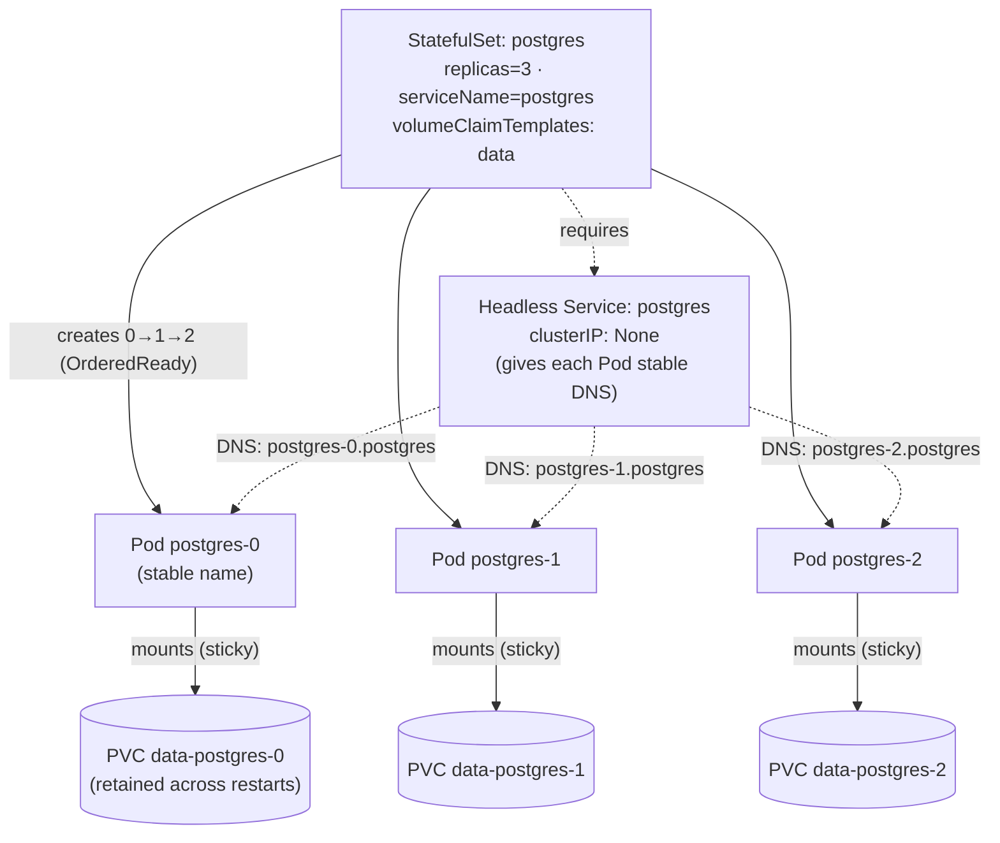

# 05 — StatefulSets

> When Pods need a **stable identity** (name, DNS, and their *own* persistent
> volume) and **ordered** lifecycle — the headless-Service requirement,
> `volumeClaimTemplates`, `podManagementPolicy`, partitioned updates, and the
> StatefulSet-vs-Deployment decision — applied by adding Postgres to the
> Bookstore.

**Estimated time:** ~15 min read · ~60 min hands-on
**Prerequisites:** [Part 01 ch.04](04-replicasets-and-deployments.md) — the contrast with stateless workloads · [Part 01 ch.01](01-pods.md) — Pod identity basics
**You'll know after this:** • explain why some Pods need stable identity (name, DNS, volume) · • configure the headless Service required by every StatefulSet · • use `volumeClaimTemplates` to give each replica its own PVC · • choose between `OrderedReady` and `Parallel` pod-management policies · • decide when a StatefulSet is the right answer vs. a Deployment

<!-- tags: core-objects, statefulsets, stateful, headless-service, volumeclaimtemplates -->

## Why this exists

A Deployment ([ch.04](04-replicasets-and-deployments.md)) treats its Pods as
**interchangeable, anonymous, disposable** — any replica is as good as any
other, names are random, all share (or have none of) the same storage. That is
exactly right for stateless services like catalog. It is exactly *wrong* for a
database, a message broker, or any clustered/quorum system, where each instance
is **not** interchangeable: `postgres-0` is the primary with *its own* data
volume; a replica must keep *its own* data across restarts; cluster members
must find each other by *stable* addresses, and often start/stop in a defined
**order** (initialize the primary before replicas join).

The Bookstore now needs durable storage for the catalog and orders data — a
real Postgres. Running it as a Deployment would be a data-loss bug: replicas
would share or lose volumes, identities would churn, and there'd be no ordered
bring-up. The **StatefulSet** is the controller for "Pods that are pets, not
cattle": stable identity + per-Pod storage + ordered operations. This is the
[Stateful Service](#further-reading) pattern.

## Mental model

A StatefulSet is "a ReplicaSet whose Pods are **named, ordered, and own their
disk**". For a StatefulSet named `postgres` with `replicas: 3`:

- Pods are `postgres-0`, `postgres-1`, `postgres-2` — **stable ordinal names**,
  not random hashes. A replaced `postgres-1` is *still* `postgres-1`.
- Each Pod gets a **stable DNS name** via a required **headless Service**:
  `postgres-0.postgres.<NS>.svc.cluster.local`. The address survives
  reschedule/restart — peers can hardcode it.
- Each Pod gets its **own PersistentVolumeClaim** from `volumeClaimTemplates`
  (`data-postgres-0`, `data-postgres-1`, …). The claim/volume is **not deleted**
  when the Pod is deleted and is **re-attached** to the same ordinal — that is
  how data persists across rescheduling.
- Operations are **ordered** by default (`OrderedReady`): scale-up creates
  `0`,`1`,`2` in sequence (each Ready before the next); scale-down removes them
  in reverse; rolling update goes highest-ordinal → lowest.

So identity, storage, and order are the three guarantees a Deployment cannot
give and a stateful system needs.

## Diagrams

### StatefulSet: ordinal identity + PVC-per-Pod (Mermaid)



### Stable DNS per ordinal (ASCII)

```
 Headless Service "postgres" (clusterIP: None)  in namespace "bookstore"
 ────────────────────────────────────────────────────────────────────────
   postgres-0.postgres.bookstore.svc.cluster.local  ─► Pod postgres-0 ─► PVC data-postgres-0
   postgres-1.postgres.bookstore.svc.cluster.local  ─► Pod postgres-1 ─► PVC data-postgres-1
   postgres-2.postgres.bookstore.svc.cluster.local  ─► Pod postgres-2 ─► PVC data-postgres-2
        (name is STABLE: kill postgres-1, its replacement is STILL
         postgres-1 with the SAME DNS and the SAME re-attached PVC)

 vs. a Deployment:  catalog-7f9-x8k2, catalog-7f9-q1zp  (random, anonymous,
                      no per-Pod stable disk, no ordering)
```

## Hands-on with the Bookstore

**Assumed working directory: the guide repo root (`full-guide/`).** Requires
the `bookstore` namespace ([ch.03](03-resources-and-qos.md)). Uses the
**official `postgres:16`** image (public — pulled from the registry, so **no
`kind load`** is needed, unlike the Bookstore-built images).

> **Forward reference — credentials.** A real Postgres needs a password. Secrets
> are [Part 03 ch.02](../03-config-and-storage/02-secrets.md); we are not there
> yet. So this chapter uses **inline env *stubs*** (plain values) purely so the
> manifest is runnable now, with a `# TODO(Phase 3)` marker. In
> [Part 03 ch.02](../03-config-and-storage/02-secrets.md) these become
> `secretKeyRef`s and the catalog/orders `DB_DSN` is wired to this StatefulSet.
> The stub values are throwaway local-only and **must not** be used anywhere
> real.

New file
[`examples/bookstore/raw-manifests/20-postgres-statefulset.yaml`](../examples/bookstore/raw-manifests/20-postgres-statefulset.yaml):

```yaml
apiVersion: v1
kind: Service                       # REQUIRED headless Service for stable DNS
metadata:
  name: postgres                    # MUST equal StatefulSet.spec.serviceName
  namespace: bookstore
  labels: { app: postgres }
spec:
  clusterIP: None                   # headless → DNS per Pod, no load-balanced VIP
  selector: { app: postgres }       # selects the StatefulSet's Pods
  ports:
    - name: postgres
      port: 5432
      targetPort: 5432
---
apiVersion: apps/v1
kind: StatefulSet
metadata:
  name: postgres
  namespace: bookstore
  labels: { app: postgres, app.kubernetes.io/part-of: bookstore }
spec:
  serviceName: postgres             # ties to the headless Service above (stable DNS)
  replicas: 1                       # single instance for the guide (HA is Part 03/08)
  podManagementPolicy: OrderedReady # 0→1→2 in order (Parallel = all at once)
  selector:
    matchLabels: { app: postgres }
  updateStrategy:
    type: RollingUpdate
    rollingUpdate:
      partition: 0                  # ordinals >= partition update; 0 = update all
  template:
    metadata:
      labels: { app: postgres }
    spec:
      terminationGracePeriodSeconds: 30
      containers:
        - name: postgres
          image: postgres:16        # official image, pulled from registry (no kind load)
          ports:
            - name: postgres
              containerPort: 5432
          env:
            # --- TODO(Phase 3): replace with Secret secretKeyRef ----------
            - name: POSTGRES_DB
              value: bookstore
            - name: POSTGRES_USER
              value: bookstore
            - name: POSTGRES_PASSWORD
              value: "devpassword"          # STUB ONLY — never a real secret
            - name: PGDATA
              value: /var/lib/postgresql/data/pgdata
          readinessProbe:
            exec: { command: ["pg_isready", "-U", "bookstore", "-d", "bookstore"] }
            initialDelaySeconds: 10
            periodSeconds: 5
          livenessProbe:
            exec: { command: ["pg_isready", "-U", "bookstore", "-d", "bookstore"] }
            initialDelaySeconds: 30
            periodSeconds: 10
          resources:
            requests: { cpu: 100m, memory: 256Mi }
            limits:   { cpu: 500m, memory: 512Mi }
          volumeMounts:
            - name: data                    # MATCHES the volumeClaimTemplate name
              mountPath: /var/lib/postgresql/data
  volumeClaimTemplates:                     # one PVC per Pod, created & retained
    - metadata:
        name: data
      spec:
        accessModes: ["ReadWriteOnce"]
        resources:
          requests:
            storage: 1Gi
        # storageClassName omitted → uses the cluster default (kind: local-path)
```

Apply and watch the differences from a Deployment:

```sh
# from the repo root (full-guide/)
kubectl apply -f examples/bookstore/raw-manifests/20-postgres-statefulset.yaml
kubectl get statefulset,pod,pvc -n bookstore -l app=postgres
#   Pod name is `postgres-0` (ordinal, NOT a random hash)
#   PVC `data-postgres-0` was auto-created from the volumeClaimTemplate

# Stable identity + DNS (resolve from another Pod in the namespace).
# ns bookstore is PSA `restricted`, so the ad-hoc pod MUST be restricted-shaped
# via --overrides (runAsNonRoot + drop ALL + seccomp RuntimeDefault) or PSA
# rejects it; the command goes IN the override (args after `--` are dropped
# once --overrides sets command):
kubectl run -n bookstore dnstest --image=busybox:1.36 --restart=Never -i --rm \
  --overrides='{"apiVersion":"v1","spec":{"securityContext":{"runAsNonRoot":true,"runAsUser":65532,"seccompProfile":{"type":"RuntimeDefault"}},"containers":[{"name":"dnstest","image":"busybox:1.36","securityContext":{"allowPrivilegeEscalation":false,"capabilities":{"drop":["ALL"]}},"command":["nslookup","postgres-0.postgres.bookstore.svc.cluster.local"]}]}}'

# Data survives Pod deletion: write, kill the Pod, read back.
kubectl exec -n bookstore postgres-0 -- \
  psql -U bookstore -d bookstore -c 'CREATE TABLE t(x int); INSERT INTO t VALUES (42);'
kubectl delete pod -n bookstore postgres-0           # StatefulSet recreates postgres-0
kubectl wait -n bookstore --for=condition=Ready pod/postgres-0 --timeout=120s
kubectl exec -n bookstore postgres-0 -- psql -U bookstore -d bookstore -c 'SELECT * FROM t;'
#   → 42 : the SAME PVC was re-attached to the SAME ordinal. Data persisted.
```

Contrast with ch.04: a Deployment Pod comes back with a **new** name and (with
`emptyDir`) **no** data. The StatefulSet keeps both.

> **Lineage / forward refs.** This adds the data tier. The DB **schema** is
> created by a migration **Job** in [ch.07](07-jobs-and-cronjobs.md)
> (`21-db-migrate-job.yaml`). The `POSTGRES_PASSWORD` stub becomes a real
> `Secret` and catalog/orders get `DB_DSN` pointing at
> `postgres.bookstore.svc.cluster.local:5432` in
> [Part 03 ch.02](../03-config-and-storage/02-secrets.md). Production HA Postgres
> (replication, an operator) is [Part 03 ch.05](../03-config-and-storage/05-stateful-data-patterns.md).

## How it works under the hood

- **Identity is the ordinal index, and it's sticky.** The StatefulSet
  controller names Pods `<NAME>-<ORDINAL>` (0-based, contiguous). A deleted
  `postgres-1` is recreated **with the same name, hostname, and DNS** — the
  controller never "renumbers". This is why peers can put
  `postgres-0.postgres` in config files: it's a permanent address.
- **Stable DNS needs the headless Service.** `spec.serviceName` must name a
  Service with `clusterIP: None`. A headless Service creates **per-Pod DNS A
  records** (`<POD>.<SVC>.<NS>.svc.cluster.local`) instead of one VIP. (DNS
  internals: [Part 02 ch.03](../02-networking/03-dns-and-discovery.md).) Omit
  or mismatch `serviceName` and you lose stable per-Pod addressing — a classic
  StatefulSet misconfiguration.
- **`volumeClaimTemplates` ≠ a volume; it's a PVC factory.** For each Pod the
  controller instantiates a PVC named `<TEMPLATE>-<NAME>-<ORDINAL>` (e.g.
  `data-postgres-0`), which the dynamic provisioner
  ([Part 03 ch.04](../03-config-and-storage/04-persistent-storage.md)) binds to
  a PV. Crucially these PVCs are **owned by the StatefulSet but not deleted with
  Pods**: deleting/rescheduling `postgres-0` re-binds it to the *same*
  `data-postgres-0`. (Deleting the StatefulSet itself does **not** delete the
  PVCs by default — deliberate data-safety; cleanup is manual, or via
  `persistentVolumeClaimRetentionPolicy`.)
- **`podManagementPolicy`.** `OrderedReady` (default): bring Pods up `0→1→2`,
  each **Ready** before the next, and tear down in reverse — needed when later
  members must register with earlier ones (typical for primaries/seeds).
  `Parallel`: act on all Pods at once — faster, valid when members are
  independent and order doesn't matter.
- **`updateStrategy` + `partition` = staged/canary rollout for stateful sets.**
  `RollingUpdate` updates Pods **highest ordinal → lowest**, one at a time,
  waiting for Ready. `partition: N` means **only ordinals ≥ N** are updated;
  ordinals `< N` stay on the old revision. Raising the partition and lowering
  it step-by-step is the built-in canary for databases (e.g. update only
  `postgres-2` first, validate, then lower the partition). `OnDelete` =
  controller updates a Pod only when *you* delete it (fully manual).
- **Why a Deployment can't do this.** A Deployment's ReplicaSet uses a
  `pod-template-hash` and random suffixes — names and storage are deliberately
  *not* stable, and there is no ordering. Those non-guarantees are a feature
  for stateless apps and a data-corruption hazard for stateful ones.

### StatefulSet vs. Deployment — the decision

| Need | Deployment | StatefulSet |
|---|---|---|
| Identical, interchangeable replicas (stateless API/UI) | ✅ use this | ✗ overkill |
| Stable per-Pod **name/DNS** | ✗ random | ✅ ordinal + headless Svc |
| Per-Pod **persistent** storage that survives reschedule | ✗ (shared/none) | ✅ `volumeClaimTemplates` |
| **Ordered** start/stop/upgrade | ✗ | ✅ `OrderedReady` |
| Quorum/clustered systems (DB, Kafka, etcd, ZooKeeper) | ✗ | ✅ |
| Fastest, densest, simplest scaling | ✅ | slower (ordered, sticky disks) |

Rule: **default to Deployment**; reach for StatefulSet only when you genuinely
need stable identity *and/or* per-Pod durable storage *and/or* ordering. "It
has a database" doesn't automatically mean StatefulSet — a stateless app
talking to an *external* managed DB is still a Deployment.

## Production notes

> **In production:** running your **own** database in-cluster is a serious
> commitment (backups, failover, PITR, version upgrades, replication). Prefer a
> **managed database** (RDS/Cloud SQL/Azure Database) for primary data when you
> can; if you must self-host, use a **mature operator**
> (CloudNativePG, Zalando, Crunchy, Strimzi for Kafka) rather than a raw
> StatefulSet — the operator encodes the failover/backup logic a bare
> StatefulSet does not ([Part 03 ch.05](../03-config-and-storage/05-stateful-data-patterns.md),
> [Part 08 ch.05](../08-day-2-operations/05-operators-and-crds.md)).

> **In production:** a StatefulSet gives stable identity and storage, **not
> high availability by itself**. One Postgres Pod is a single point of failure
> regardless of the StatefulSet. HA requires replication/quorum *inside* the
> workload (streaming replicas, Raft) — that logic is the app/operator's, not
> the StatefulSet's.

> **In production:** PVCs from `volumeClaimTemplates` **outlive the
> StatefulSet** by default. That is intentional (don't auto-destroy data) but
> means deleting/recreating a StatefulSet can leave orphaned volumes (cost) or
> unexpectedly **re-attach old data**. Manage lifecycle explicitly with
> `persistentVolumeClaimRetentionPolicy` and document the teardown runbook
> ([Part 08 ch.02](../08-day-2-operations/02-backup-and-dr.md)).

> **In production:** on EKS/GKE/AKS, `volumeClaimTemplates` bind to **cloud
> block storage** (EBS/PD/Azure Disk) — typically **zonal**. A Pod and its
> disk are then pinned to one AZ; on node loss the Pod can only reschedule in
> the same zone. Plan topology (zonal vs. regional disks, anti-affinity across
> zones) deliberately ([Part 04](../04-scheduling/02-affinity-taints-topology.md)).
> On bare `kind` the default `local-path` provisioner is node-local and **not**
> highly available — fine for learning, never for prod data.

> **In production:** use `OrderedReady` for systems where members must join in
> sequence; `Parallel` only when truly independent. Use `partition` to canary
> stateful upgrades (update the highest ordinal, validate, then lower the
> partition) — a botched all-at-once DB upgrade is very hard to undo.

## Quick Reference

```sh
kubectl get statefulset,pod,pvc -n <NS> -l app=<A>     # ordinals + per-Pod PVCs
kubectl get pod <NAME>-0 -n <NS> -o wide               # stable ordinal name
nslookup <NAME>-0.<SVC>.<NS>.svc.cluster.local         # stable per-Pod DNS
kubectl rollout status statefulset/<NAME> -n <NS>
kubectl rollout restart statefulset/<NAME> -n <NS>
kubectl scale statefulset/<NAME> -n <NS> --replicas=N  # ordered up/down
kubectl delete statefulset <NAME> -n <NS> --cascade=orphan   # keep Pods/PVCs
# patch partition for a staged update:
kubectl patch statefulset/<NAME> -n <NS> --type='json' \
  -p='[{"op":"replace","path":"/spec/updateStrategy/rollingUpdate/partition","value":1}]'
```

Minimal StatefulSet skeleton (headless Service is mandatory):

```yaml
apiVersion: v1
kind: Service
metadata: { name: <SVC>, namespace: <NS> }
spec: { clusterIP: None, selector: { app: <APP> }, ports: [ { port: <P> } ] }
---
apiVersion: apps/v1
kind: StatefulSet
metadata: { name: <APP>, namespace: <NS> }
spec:
  serviceName: <SVC>            # == headless Service name
  replicas: 3
  podManagementPolicy: OrderedReady
  selector: { matchLabels: { app: <APP> } }
  template:
    metadata: { labels: { app: <APP> } }
    spec:
      containers:
        - name: <APP>
          image: 
          volumeMounts: [ { name: data, mountPath: /data } ]
  volumeClaimTemplates:
    - metadata: { name: data }
      spec:
        accessModes: ["ReadWriteOnce"]
        resources: { requests: { storage: 1Gi } }
```

Checklist:

- [ ] Genuinely need identity/storage/order (else use a Deployment)
- [ ] Headless Service exists; `serviceName` matches it exactly
- [ ] `volumeClaimTemplates` name matches the container `volumeMounts` name
- [ ] `podManagementPolicy` chosen (OrderedReady vs Parallel) deliberately
- [ ] PVC retention/teardown understood (volumes outlive the StatefulSet)
- [ ] HA comes from the workload/operator, not the StatefulSet alone
- [ ] Secrets (not stub env) used for credentials in real deployments

## Test your understanding

> Try each before opening the answer drawer. The act of trying is the exercise; the answer is the check.

1. **Why does a StatefulSet require a headless Service (`clusterIP: None`) instead of a normal Service? What capability is lost without it?**
   <details><summary>Show answer</summary>

   A headless Service publishes per-Pod DNS A records (`postgres-0.postgres.bookstore.svc...`) instead of a single load-balanced VIP — exactly the stable per-Pod addressing peers need to reach a specific ordinal (e.g., a Postgres primary). Without it (or with a mismatched `serviceName`), Pods get random ephemeral IPs and no stable DNS, defeating the whole identity guarantee (see §How it works under the hood, "Stable DNS needs the headless Service").

   </details>

2. **A teammate proposes running a clustered Redis as a Deployment with replicas=3 and an `emptyDir` per Pod "to keep it simple". Walk through three things that go wrong.**
   <details><summary>Show answer</summary>

   (1) Random Pod names — Redis nodes can't be addressed individually for replication topology. (2) `emptyDir` dies with the Pod — restart loses all state, including cluster membership. (3) Pods are not ordered — replicas may start before the master is up; reschedules churn cluster membership. The right answer is a StatefulSet (stable identity + per-Pod PVC + ordered bring-up) or a Redis operator (see §StatefulSet vs. Deployment).

   </details>

3. **You scale the Postgres StatefulSet from `replicas: 3` to `replicas: 1`. What happens to the PVCs of the removed Pods, and what's the design intent?**
   <details><summary>Show answer</summary>

   By default the PVCs `data-postgres-1` and `data-postgres-2` are retained — the Pods are removed, but their data sits in storage. Intent is data safety: scale-down is recoverable by scaling back up (the same PVCs re-attach to the same ordinals). Cost-wise, you may want `persistentVolumeClaimRetentionPolicy: WhenScaled: Delete` for ephemeral state, but the default favors not losing data (see §How it works under the hood, "volumeClaimTemplates is a PVC factory" and §Production notes).

   </details>

4. **You want to do a canary upgrade of a 3-replica StatefulSet — test the new version on `postgres-2` first, then `1`, then `0`. Which field do you adjust and how?**
   <details><summary>Show answer</summary>

   Use `spec.updateStrategy.rollingUpdate.partition`. With `partition: 2`, the controller updates only ordinals ≥ 2 (just `postgres-2`); ordinals 0 and 1 stay on the old image. Validate, then set `partition: 1` (updates `postgres-1`), then `partition: 0` (updates everything). This is the built-in canary for stateful upgrades — far safer than all-at-once (see §How it works under the hood, "updateStrategy + partition").

   </details>

5. **Hands-on extension: bring up the Postgres StatefulSet, `INSERT` a row, `kubectl delete pod -n bookstore postgres-0`, wait for it to come back, then `SELECT`. Now `kubectl delete statefulset postgres -n bookstore --cascade=orphan` and re-create the StatefulSet. What do you observe in each case, and why?**
   <details><summary>What you should see</summary>

   After Pod deletion: the row is still there — `postgres-0` was recreated and re-attached to PVC `data-postgres-0`. After StatefulSet deletion with `--cascade=orphan`: the Pod and PVC remain orphaned; recreating the StatefulSet adopts the existing PVC (same ordinal name) and the row is *still* there. This is the data-safety design — volumes outlive the controller, so accidental teardown is recoverable (see §Production notes, "PVCs outlive the StatefulSet").

   </details>

## Further reading

- **Lukša, _Kubernetes in Action_ 2e, ch.15 — "Deploying stateful workloads
  with StatefulSets"** — ordinals, headless Services, `volumeClaimTemplates`,
  ordered operations, and update strategies.
- **Ibryam & Huß, _Kubernetes Patterns_ 2e — *Stateful Service* (ch.12)** —
  the requirements (stable identity, storage, networking, ordinality) that
  define when a StatefulSet is the right tool.
- Official:
  <https://kubernetes.io/docs/concepts/workloads/controllers/statefulset/> and
  <https://kubernetes.io/docs/tutorials/stateful-application/basic-stateful-set/>.
