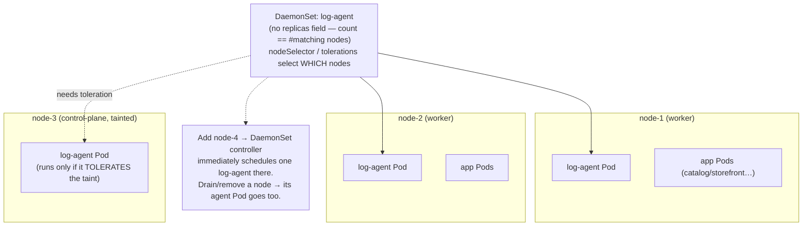

# 06 — DaemonSets

> One Pod per node (or per selected subset): the controller for **node-level
> agents** — log shippers, metrics exporters, CNI, storage and security
> agents. Node selection, tolerations for system Pods, update strategy, and
> why the Bookstore's logging agent will be a DaemonSet.

**Estimated time:** ~15 min read · ~30 min hands-on
**Prerequisites:** [Part 01 ch.04](04-replicasets-and-deployments.md) — the controller pattern contrast · [Part 01 ch.05](05-statefulsets.md) — workload-controller decision tree
**You'll know after this:** • recognize the workloads that belong in a DaemonSet (CNI, log shippers, metrics agents) · • use `nodeSelector` and `nodeAffinity` to target a node subset · • add tolerations so a DaemonSet runs on tainted system nodes · • choose between `RollingUpdate` and `OnDelete` update strategies · • deploy a Bookstore log-shipping DaemonSet

<!-- tags: core-objects, daemonsets, node-agents, tolerations -->

## Why this exists

Deployments ([ch.04](04-replicasets-and-deployments.md)) and StatefulSets
([ch.05](05-statefulsets.md)) answer "run **N** copies *somewhere*". A whole
class of software needs the opposite: "run **exactly one** copy **on every
node**, and automatically one more whenever a node joins". A log collector must
read every node's container logs; a metrics exporter must read every node's
kernel/cgroup stats; the CNI plugin and `kube-proxy` must run on every node to
make Pods on that node networkable. Expressing that with a Deployment is
impossible — replica count doesn't track node count, and you can't guarantee
"one per node, on *new* nodes too".

The **DaemonSet** is that controller: its desired state is "one Pod per
matching node", reconciled as nodes appear and disappear. The Bookstore itself
runs no DaemonSet *yet* — but the **logging agent** it needs in
[Part 06 ch.02](../06-production-readiness/02-logging.md) is the textbook case,
and so are the metrics node-exporter
([Part 06 ch.01](../06-production-readiness/01-observability-metrics.md)) and
anything node-scoped. This is the [Daemon Service](#further-reading) pattern.

## Mental model

A DaemonSet is "a controller whose replica count **is** the node count (subject
to a node selector)". You don't set `replicas`; the controller derives it:
**for each node matching the (optional) selectors/tolerations, ensure exactly
one Pod from the template runs there.** Add a node → it gets the Pod
automatically. Remove a node → its Pod goes with it. Constrain with
`nodeSelector`/`affinity` to target a subset (e.g. only GPU nodes, only
`role=ingress` nodes). Because system agents must often run even on nodes that
are tainted to repel normal workloads, DaemonSet Pods typically carry broad
**tolerations**.

Mentally: Deployment = "N anonymous copies, scheduler decides where";
StatefulSet = "N named copies with sticky disks"; DaemonSet = "the set of nodes
*is* the desired set; one agent each".

## Diagrams

### DaemonSet scheduling across nodes (Mermaid)



### Node → agent (ASCII)

```
                       DaemonSet "log-agent"  (one per matching node)
   ┌────────────── node-1 ──────────────┐  ┌────────────── node-2 ──────────────┐
   │  [log-agent] ── reads ──┐           │  │  [log-agent] ── reads ──┐           │
   │  catalog  orders  ...   │           │  │  storefront  ...        │           │
   │            hostPath: /var/log/...   │  │            hostPath: /var/log/...   │
   └──────────────┬──────────┘           │  └──────────────┬──────────┘           │
                  └─────────► log backend ◄────────────────┘
   exactly ONE agent per node · scales with the cluster, not with traffic
```

## Hands-on with the Bookstore

**Assumed working directory: the guide repo root (`full-guide/`).**

**No new Bookstore manifest in this chapter.** The Bookstore's own services are
stateless/stateful workloads (Deployments/StatefulSet), not per-node agents — so
adding a DaemonSet here would be contrived. The Bookstore's real DaemonSet is
its **logging agent**, introduced where it belongs in
[Part 06 ch.02](../06-production-readiness/02-logging.md) (a node-level log
shipper such as Fluent Bit reading every node's container logs and forwarding
them centrally) — the same shape as the ch.01 logging *sidecar*, but per-node
instead of per-Pod (the trade-off is discussed there).

To make the concept concrete now, inspect the DaemonSets your cluster **already
runs** — `kube-proxy` and the CNI are DaemonSets, on every node, by definition:

```sh
# from the repo root (full-guide/); any kind/k3d cluster from Part 00 ch.07
kubectl get daemonset -A
#   kube-system  kube-proxy  DESIRED=CURRENT=#nodes  ← one per node, automatically
#   kube-system  kindnet (CNI on kind)  also one per node

kubectl get pod -n kube-system -o wide -l k8s-app=kube-proxy
#   exactly one kube-proxy Pod per node; node count == DESIRED

kubectl describe daemonset kube-proxy -n kube-system | sed -n '/Node-Selectors/,/Events/p'
#   note the broad TOLERATIONS — system DaemonSets must run even on
#   control-plane / tainted nodes that repel ordinary Pods.
```

Demonstrate the "tracks node count" property on a multi-node kind cluster
(optional; uses only built-in components, no Bookstore images):

```sh
# A 1-control-plane + 1-worker kind cluster, then watch DESIRED change.
cat > /tmp/kind-2node.yaml <<'EOF'
kind: Cluster
apiVersion: kind.x-k8s.io/v1alpha4
nodes:
  - role: control-plane
  - role: worker
EOF
kind create cluster --name ds-demo --config /tmp/kind-2node.yaml
kubectl --context kind-ds-demo get nodes
kubectl --context kind-ds-demo get daemonset kube-proxy -n kube-system
#   DESIRED == 2 (one per node). Add/remove a node and it re-derives.
kind delete cluster --name ds-demo        # clean up the demo cluster
```

(Authoring a Bookstore log-shipper DaemonSet manifest is deferred to
[Part 06 ch.02](../06-production-readiness/02-logging.md), where logging is the
topic and the manifest is cumulative with the observability stack.)

## How it works under the hood

- **The DaemonSet controller derives desired Pods from the node list.** It
  watches Nodes; for every node satisfying the Pod template's
  `nodeSelector`/`affinity` and tolerations it ensures one Pod (named
  `<DS>-<HASH>` but pinned to that node). A new Node ⇒ a new Pod immediately;
  a removed Node ⇒ its Pod removed. There is no `replicas` field — the count
  is a *consequence* of the cluster.
- **Scheduling: default scheduler with node affinity.** Modern Kubernetes
  schedules DaemonSet Pods through the **normal kube-scheduler**, by injecting a
  `spec.nodeName`-equivalent node affinity for the target node (plus
  `node.kubernetes.io/unschedulable` toleration so it still lands on cordoned
  nodes). This means DaemonSet Pods respect taints/affinity like any Pod —
  hence the need for explicit **tolerations** to run on tainted nodes
  (control-plane, GPU, dedicated) ([Part 04](../04-scheduling/02-affinity-taints-topology.md)).
- **Tolerations are why system agents run everywhere.** Control-plane nodes
  carry a `NoSchedule` taint; CNI/kube-proxy/log/metrics agents must still run
  there, so their DaemonSets tolerate it (often
  `operator: Exists` broadly). Without the toleration the agent silently
  skips tainted nodes — a common "why are there no logs from the control
  plane?" gap.
- **`updateStrategy`.** `RollingUpdate` (default): the controller updates
  DaemonSet Pods **node by node**, honoring `maxUnavailable` (and optionally
  `maxSurge`) so you never lose the agent on too many nodes at once — important
  because the agent often *is* the thing observing/networking the node.
  `OnDelete`: a node's Pod is updated only when you delete it manually (used for
  very disruptive agents where you want hand control).
- **Host access is normal for DaemonSets.** Because they *are* node agents,
  DaemonSet Pods commonly use `hostPath` volumes (read `/var/log`,
  `/var/lib/...`), `hostNetwork`/`hostPID`, and elevated privileges. That is
  expected here but makes them **high-value, high-blast-radius** — they run on
  every node, so a compromised or buggy DaemonSet affects the whole cluster
  (security treatment in [Part 05 ch.02](../05-security/02-pod-security.md)).
- **Singleton/leader-election note.** A DaemonSet gives *one Pod per node*, not
  *one Pod per cluster*. For a true cluster-wide singleton (a single active
  controller) you don't use a DaemonSet — you run replicas that perform
  **leader election** so only one is active
  ([Part 08 ch.05](../08-day-2-operations/05-operators-and-crds.md)). Don't
  conflate "runs on every node" with "exactly one in the cluster".

## Production notes

> **In production:** DaemonSet Pods run on **every** node, so their
> requests/limits are multiplied by the node count and they compete with your
> workloads for node resources. Size them tightly and give them an appropriate
> **priorityClass** ([Part 04 ch.03](../04-scheduling/03-priority-and-preemption.md))
> so a critical node agent (CNI, logging) isn't evicted before app Pods — but
> isn't so greedy it starves them either.

> **In production:** get **tolerations right** or you get blind spots. A logging
> or security DaemonSet that doesn't tolerate the control-plane / dedicated-node
> taints will silently miss exactly the nodes you most need to observe or
> protect. Audit `kubectl get ds -A` coverage vs. node count.

> **In production:** use a conservative `updateStrategy` (`maxUnavailable: 1`
> or a small %). Rolling a broken CNI/log/metrics DaemonSet to all nodes at
> once can take down cluster networking or observability fleet-wide. The agent
> is often load-bearing infrastructure — treat its rollout like a control-plane
> change.

> **In production:** managed clusters (EKS/GKE/AKS) **already run several
> DaemonSets you don't author** (CNI, kube-proxy or its replacement, CSI node
> plugins, cloud logging/monitoring agents). Know what's there before adding
> more — duplicate log agents double cost and can fight over the same files;
> some managed add-ons are upgraded by the provider on their own schedule.

> **In production:** DaemonSets are a prime **supply-chain and privilege**
> concern — node-wide reach, often privileged, often `hostPath`. Pin their
> images by digest, scan them, and constrain them with Pod Security/admission
> just like (more than) app workloads ([Part 05](../05-security/03-supply-chain.md)).

## Quick Reference

```sh
kubectl get daemonset -A                                  # all DaemonSets
kubectl get ds <DS> -n <NS> -o wide                       # DESIRED==#matching nodes
kubectl get pod -n <NS> -l <SELECTOR> -o wide             # one per node, see NODE col
kubectl describe ds <DS> -n <NS>                          # selectors, tolerations, Events
kubectl rollout status    daemonset/<DS> -n <NS>
kubectl rollout restart   daemonset/<DS> -n <NS>
kubectl rollout history   daemonset/<DS> -n <NS>
```

Minimal DaemonSet skeleton (node agent reading host logs):

```yaml
apiVersion: apps/v1
kind: DaemonSet
metadata: { name: <AGENT>, namespace: <NS>, labels: { app: <AGENT> } }
spec:
  selector: { matchLabels: { app: <AGENT> } }   # == template labels
  updateStrategy:
    type: RollingUpdate
    rollingUpdate: { maxUnavailable: 1 }
  template:
    metadata: { labels: { app: <AGENT> } }
    spec:
      tolerations:                               # run even on tainted nodes
        - operator: Exists
      # nodeSelector: { role: ingress }          # (optional) subset of nodes
      containers:
        - name: <AGENT>
          image: <AGENT-IMAGE>@sha256:...
          resources: { requests: { cpu: 25m, memory: 64Mi }, limits: { cpu: 100m, memory: 128Mi } }
          volumeMounts: [ { name: varlog, mountPath: /var/log, readOnly: true } ]
      volumes:
        - name: varlog
          hostPath: { path: /var/log }
```

Checklist:

- [ ] Workload is genuinely **per-node** (else Deployment/StatefulSet)
- [ ] No `replicas` (count is derived from nodes)
- [ ] Tolerations cover every node you must reach (control-plane, tainted)
- [ ] `nodeSelector`/affinity if only a subset of nodes should run it
- [ ] Conservative `updateStrategy` (small `maxUnavailable`)
- [ ] Tight resources + sensible priorityClass (runs ×#nodes)
- [ ] hostPath/privilege scoped minimally; image pinned & scanned
- [ ] Not used where a leader-elected cluster singleton is what's needed

## Test your understanding

> Try each before opening the answer drawer. The act of trying is the exercise; the answer is the check.

1. **Why does a DaemonSet have no `replicas` field, and what would go wrong if you used a Deployment with `replicas: <number of nodes>` for a log-shipping agent?**
   <details><summary>Show answer</summary>

   A DaemonSet's count is derived from the node list — adding a node automatically schedules a Pod there, removing a node removes its Pod. A Deployment with `replicas=N` doesn't track node count; the scheduler may stack multiple Pods on one node (or none on another), missing log coverage. Worse, when the cluster autoscales, the Deployment doesn't react; the DaemonSet does (see §Mental model and §How it works under the hood).

   </details>

2. **You deploy a security agent as a DaemonSet but its `kubectl get ds` shows DESIRED=2 while the cluster has 3 nodes. Where do you look, and what's the typical fix?**
   <details><summary>Show answer</summary>

   One node likely has a taint the DaemonSet's tolerations don't cover (control-plane nodes carry a `NoSchedule` taint by default, GPU nodes often do too). `kubectl describe node <missing-node>` shows the taints; either add the matching toleration to the DaemonSet (`operator: Exists` for system-wide reach is common) or `tolerations: - { key: node-role.kubernetes.io/control-plane, operator: Exists }` for that specific taint (see §Tolerations are why system agents run everywhere).

   </details>

3. **A teammate proposes a `RollingUpdate` with `maxUnavailable: 100%` "so updates finish fast". Why is this dangerous for a CNI or logging DaemonSet, and what's a safer default?**
   <details><summary>Show answer</summary>

   DaemonSets often run load-bearing node infrastructure — CNI provides Pod networking, the logging agent is your observability. Rolling all nodes' agents at once can take down cluster networking or blind observability fleet-wide if the new version is broken. Safer: `maxUnavailable: 1` or a small percentage so any breakage stops at one node; you find out before the whole fleet is down (see §Production notes, "conservative updateStrategy").

   </details>

4. **What's the difference between "run on every node" (DaemonSet) and "exactly one in the cluster" (leader-elected controller)? When would each be wrong for the other's job?**
   <details><summary>Show answer</summary>

   DaemonSet = one Pod per node, so N copies running in parallel — wrong for a cluster singleton because N controllers all reconciling the same state will fight. Leader-elected Deployment = N replicas but only the leader is active — wrong for a node agent because you need agency on *every* node (e.g., a log shipper running on the leader does nothing for the other nodes' logs) (see §How it works under the hood, "Singleton/leader-election note").

   </details>

5. **Hands-on extension: on a multi-node kind cluster, `kubectl get daemonset -A` and pick `kube-proxy`. Now `kubectl cordon` one node, then `kubectl drain` it. What happens to that node's `kube-proxy` Pod, and what does this tell you about the DaemonSet's relationship with node lifecycle?**
   <details><summary>What you should see</summary>

   Cordon alone doesn't remove the DaemonSet Pod — it tolerates `node.kubernetes.io/unschedulable` (Kubernetes injects this toleration). `drain` evicts other Pods but `--ignore-daemonsets` is the default, leaving the DaemonSet Pod running. Only deleting the Node object itself removes the agent. This is deliberate: node agents are infrastructure, not workload, so they don't get drained off (see §How it works under the hood, scheduling).

   </details>

## Further reading

- **Lukša, _Kubernetes in Action_ 2e, ch.16 — "Deploying node agents and
  daemons with DaemonSets"** — the one-per-node model, node selection,
  tolerations, and update strategy.
- **Ibryam & Huß, _Kubernetes Patterns_ 2e — *Daemon Service* (ch.9)** (with
  *Singleton Service*, ch.10, for the "one-per-cluster vs one-per-node"
  distinction) — when node-scoped agents are the right pattern.
- Official:
  <https://kubernetes.io/docs/concepts/workloads/controllers/daemonset/>.
