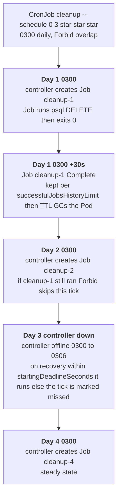

# 07 — Jobs and CronJobs

> Run-to-**completion** workloads: `Job` (completions, parallelism,
> backoffLimit, activeDeadlineSeconds, indexed Jobs, TTL cleanup) and
> `CronJob` (schedule, concurrencyPolicy, startingDeadlineSeconds, history
> limits, time zone). Applied with the Bookstore's DB-migration Job and a
> nightly cleanup CronJob.

**Estimated time:** ~15 min read · ~30 min hands-on
**Prerequisites:** [Part 01 ch.01](01-pods.md) — the Pod that a Job creates · [Part 01 ch.03](03-resources-and-qos.md) — bounding a batch workload's resources
**You'll know after this:** • configure `completions`, `parallelism`, and `backoffLimit` for a Job · • use indexed Jobs for parallel work-sharded batch · • set `activeDeadlineSeconds` and `ttlSecondsAfterFinished` for hygiene · • write a CronJob with the right `concurrencyPolicy` and time zone · • implement a DB-migration Job and a nightly cleanup CronJob

<!-- tags: core-objects, jobs, cronjobs, batch, run-to-completion -->

## Why this exists

Every controller so far assumes a Pod that should run **forever** — a crash or
clean exit is a problem to be reconciled away. But a lot of real work is
**finite and must run exactly to completion, then stop**: apply a database
schema migration before the app starts; back up a volume; re-index a search
corpus; send a nightly digest; prune old rows. Modeling that as a Deployment is
wrong on both ends — a Deployment would *restart* a process that successfully
finished (it must have crashed, says the controller), and it has no notion of
"this is done, stop, and tell me if it failed".

The Bookstore concretely needs this **right now**: the Postgres StatefulSet
from [ch.05](05-statefulsets.md) is an empty database — the `books`/`orders`
tables don't exist until something *runs the schema once*. That "run once to
completion, must succeed before the app uses the DB" is exactly a **Job**.
"Prune old order rows every night" is exactly a **CronJob**. These are the
[Batch Job](#further-reading) and [Periodic Job](#further-reading) patterns.

## Mental model

A **Job** runs Pods until a target number **succeed** (exit 0), then it is
*Complete* and stops. Failure is first-class: a failed Pod is retried up to
`backoffLimit`, after which the Job is *Failed* and surfaces that — it does not
silently loop forever. You tune **how many** must succeed (`completions`) and
**how many at once** (`parallelism`), giving three shapes: one-shot, fixed-count
batch, and work-queue.

A **CronJob** is a tiny controller that, on a cron `schedule`, **creates a Job**
from a template. It is "cron that produces Jobs": all the run-to-completion
semantics come from the Job it spawns; the CronJob adds *when* and *what to do
about overlaps and missed ticks*.

Key contrast with long-running controllers: `restartPolicy` for Job Pods is
**`OnFailure` or `Never`** (never `Always` — `Always` means "this should run
forever", which contradicts "run to completion"). "Healthy" for a Job is *it
completed*; "healthy" for a CronJob is *its Jobs keep completing on schedule*.

## Diagrams

### Job parallelism modes (Mermaid)

```mermaid
flowchart TB
    subgraph A["Non-parallel (default)<br/>completions=1, parallelism=1"]
        a1["Pod #1 → exit 0"] --> aC["Job Complete"]
    end
    subgraph B["Fixed completion count<br/>completions=5, parallelism=2"]
        b1["2 Pods run<br/>at a time"] --> b2["…until 5 successes total"] --> bC["Job Complete"]
    end
    subgraph C["Indexed (completions=5,<br/>completionMode: Indexed)"]
        c1["Pod idx 0"] --- c2["1"] --- c3["2"] --- c4["3"] --- c5["4"]
        c5 --> cC["each index must succeed once<br/>(JOB_COMPLETION_INDEX)"]
    end
    subgraph D["Work queue<br/>parallelism=N, completions unset"]
        d1["N Pods pull from a queue<br/>any Pod exiting 0 ⇒ done"] --> dC["Complete when work drained"]
    end
```



### CronJob trigger timeline (Mermaid)



## Hands-on with the Bookstore

**Assumed working directory: the guide repo root (`full-guide/`).** Requires
the `bookstore` namespace ([ch.03](03-resources-and-qos.md)) and the Postgres
StatefulSet ([ch.05](05-statefulsets.md)) running
(`kubectl get statefulset postgres -n bookstore`). Uses the **official
`postgres:16`** image (the `psql` client ships in it; public, no `kind load`).

### 1. DB-migration Job — create the schema once

The Postgres from ch.05 has no tables. Per the app's documented schema (from
its README), the `books` and `orders` tables must exist before catalog/orders
can use a real DB. We run that exactly once as a Job.

New file
[`examples/bookstore/raw-manifests/21-db-migrate-job.yaml`](../examples/bookstore/raw-manifests/21-db-migrate-job.yaml):

```yaml
apiVersion: batch/v1
kind: Job
metadata:
  name: db-migrate
  namespace: bookstore
  labels: { app: db-migrate, app.kubernetes.io/part-of: bookstore }
spec:
  backoffLimit: 4                 # retry the Pod up to 4× before marking Failed
  activeDeadlineSeconds: 120      # hard wall-clock cap for the whole Job
  ttlSecondsAfterFinished: 600    # auto-delete Job+Pods 10 min after it finishes
  template:
    metadata:
      labels: { app: db-migrate }
    spec:
      restartPolicy: Never        # Job Pods: Never or OnFailure (never Always)
      containers:
        - name: migrate
          image: postgres:16      # has `psql`; official image, no kind load
          env:
            # TODO(Phase 3): source these from the Postgres Secret (Part 03 ch.02)
            - name: PGHOST
              value: postgres.bookstore.svc.cluster.local   # the headless Svc (ch.05)
            - name: PGUSER
              value: bookstore
            - name: PGPASSWORD
              value: "devpassword"        # STUB ONLY — Secret in Part 03
            - name: PGDATABASE
              value: bookstore
          command: ["/bin/sh", "-c"]
          args:
            - |
              set -e
              echo "waiting for postgres..."
              until pg_isready -q; do sleep 2; done
              echo "applying schema (idempotent)..."
              psql -v ON_ERROR_STOP=1 <<'SQL'
              CREATE TABLE IF NOT EXISTS books  (id SERIAL PRIMARY KEY, title TEXT, author TEXT, price NUMERIC);
              CREATE TABLE IF NOT EXISTS orders (id SERIAL PRIMARY KEY, book_id INT, qty INT, created_at TIMESTAMPTZ);
              SQL
              echo "migration complete"
          resources:
            requests: { cpu: 50m, memory: 64Mi }
            limits:   { cpu: 200m, memory: 128Mi }
```

```sh
# from the repo root (full-guide/)
kubectl apply -f examples/bookstore/raw-manifests/21-db-migrate-job.yaml
kubectl get job db-migrate -n bookstore -w        # COMPLETIONS 0/1 → 1/1
kubectl logs -n bookstore job/db-migrate          # the migration output
kubectl get pod -n bookstore -l app=db-migrate    # Completed (then GC'd after TTL)
# Verify the schema landed:
kubectl exec -n bookstore postgres-0 -- psql -U bookstore -d bookstore -c '\dt'
#   → books, orders
```

Re-running is safe (`CREATE TABLE IF NOT EXISTS` is idempotent) — but note a
Job's `name` is unique: to *re-run* you delete and re-apply, or (better) let
your delivery pipeline template a unique name / use a Helm hook
([Part 07](../07-delivery/01-packaging-helm.md)). The **migration-as-a-Job
before the app uses the DB** is the production-correct pattern (vs. an init
container, which would re-run on every Pod start).

### 2. Nightly cleanup CronJob

New file
[`examples/bookstore/raw-manifests/22-cleanup-cronjob.yaml`](../examples/bookstore/raw-manifests/22-cleanup-cronjob.yaml):

```yaml
apiVersion: batch/v1
kind: CronJob
metadata:
  name: cleanup
  namespace: bookstore
  labels: { app: cleanup, app.kubernetes.io/part-of: bookstore }
spec:
  schedule: "0 3 * * *"             # 03:00 every day (cron syntax)
  timeZone: "Etc/UTC"               # interpret schedule in this TZ (k8s 1.27+ GA)
  concurrencyPolicy: Forbid         # skip a run if the previous one is still going
  startingDeadlineSeconds: 300      # if a tick was missed, only start within 5 min
  successfulJobsHistoryLimit: 3     # keep last 3 successful Jobs
  failedJobsHistoryLimit: 1         # keep last 1 failed Job (for debugging)
  jobTemplate:
    spec:
      backoffLimit: 2
      activeDeadlineSeconds: 300
      ttlSecondsAfterFinished: 600
      template:
        metadata:
          labels: { app: cleanup }
        spec:
          restartPolicy: Never
          containers:
            - name: cleanup
              image: postgres:16
              env:
                - name: PGHOST
                  value: postgres.bookstore.svc.cluster.local
                - name: PGUSER
                  value: bookstore
                - name: PGPASSWORD
                  value: "devpassword"     # STUB — Secret in Part 03 ch.02
                - name: PGDATABASE
                  value: bookstore
              command: ["/bin/sh", "-c"]
              args:
                - |
                  set -e
                  echo "pruning orders older than 90 days..."
                  psql -v ON_ERROR_STOP=1 -c \
                    "DELETE FROM orders WHERE created_at < now() - interval '90 days';"
                  echo "cleanup complete"
              resources:
                requests: { cpu: 25m, memory: 32Mi }
                limits:   { cpu: 100m, memory: 64Mi }
```

```sh
kubectl apply -f examples/bookstore/raw-manifests/22-cleanup-cronjob.yaml
kubectl get cronjob cleanup -n bookstore           # SCHEDULE, LAST SCHEDULE, SUSPEND
# Don't wait until 03:00 — trigger a Job from the CronJob NOW to test it:
kubectl create job -n bookstore cleanup-manual --from=cronjob/cleanup
kubectl get job -n bookstore -l app=cleanup -w
kubectl logs -n bookstore job/cleanup-manual       # "cleanup complete"
```

> **Lineage / forward refs.** `21-db-migrate-job.yaml` is the schema step the
> ch.05 Postgres needed; once it has run, the catalog/orders services (wired to
> `DB_DSN` in [Part 03 ch.02](../03-config-and-storage/02-secrets.md)) read a
> populated schema. The `PGPASSWORD` stubs become `secretKeyRef`s there too. In
> [Part 07](../07-delivery/01-packaging-helm.md) the migration becomes a Helm
> pre-install/pre-upgrade **hook** so it runs automatically as part of every
> release, not by hand.

## Job and CronJob fields that matter

**Job:**

| Field | Effect |
|---|---|
| `completions` | how many Pods must **succeed** for the Job to be Complete (default 1) |
| `parallelism` | max Pods running **at once** (default 1) |
| `completionMode` | `NonIndexed` (default) or **`Indexed`** — each Pod gets `JOB_COMPLETION_INDEX` (0..completions-1), for partitioned/parallel work |
| `backoffLimit` | retries of failed Pods before the Job is **Failed** (default 6); exponential backoff |
| `activeDeadlineSeconds` | hard wall-clock cap for the *whole* Job; exceeded ⇒ Job (and Pods) terminated, Failed |
| `ttlSecondsAfterFinished` | auto-delete the Job (and its Pods) this many seconds after it finishes — **the standard cleanup mechanism** |
| `podFailurePolicy` | **GA 1.31** — act on a Pod failure by exit code / Pod condition (e.g. fail fast on a non-retriable error, or ignore an infra-evicted Pod) |
| `backoffLimitPerIndex` | **GA 1.33** (Alpha 1.29, Beta 1.30) — a per-index retry budget for **Indexed** Jobs, so one bad index doesn't fail the whole Job |
| `restartPolicy` | `OnFailure` (restart the container in place) or `Never` (a failed Pod stays Failed, Job makes a new Pod) — **never `Always`** |

The three shapes: **one-shot** (`completions=1`, `parallelism=1` — the
migration), **fixed batch** (`completions=N`, some `parallelism`), **work
queue** (`parallelism=N`, `completions` unset — Pods pull from an external
queue; Job done when a Pod exits 0 with the queue drained). **Indexed** Jobs add
a stable per-Pod index for static work partitioning.

**CronJob:**

| Field | Effect |
|---|---|
| `schedule` | standard cron (`m h dom mon dow`); also macros like `@hourly` |
| `timeZone` | IANA TZ the schedule is evaluated in (GA 1.27+); default = controller's TZ (historically UTC) |
| `concurrencyPolicy` | `Allow` (overlap), **`Forbid`** (skip if previous still running), `Replace` (kill old, start new) |
| `startingDeadlineSeconds` | if a scheduled time was missed (controller down, prior run overran), only start if within this many seconds — else count it *missed* |
| `successfulJobsHistoryLimit` / `failedJobsHistoryLimit` | how many finished Jobs to retain (debuggability vs. clutter) |
| `suspend` | `true` pauses scheduling without deleting the CronJob |

## How it works under the hood

- **The Job controller tracks success/failure, not "running".** It creates
  Pods up to `parallelism`, counts **succeeded** Pods toward `completions`, and
  counts **failed** Pods toward `backoffLimit` (with exponential backoff
  between retries, capped). It sets the Job's `Complete` or `Failed` condition
  in `status` — that condition *is* the result you alert on. Unlike a
  Deployment, a successfully exited Pod is the **goal**, not a fault to undo.
- **`ttlSecondsAfterFinished` is GC, by a dedicated controller.** Finished Jobs
  (and their Pods) linger by default so you can read logs/exit codes; the
  TTL-after-finished controller deletes them once the timer elapses. Without a
  TTL (or history limits on CronJobs) finished Jobs/Pods **accumulate forever**
  and clutter the namespace — a very common operational smell.
- **Indexed completion.** With `completionMode: Indexed`, each Pod gets a unique
  `JOB_COMPLETION_INDEX` env/annotation; the Job is Complete only when *every*
  index 0..N-1 has had a successful Pod. This is how you statically shard batch
  work without an external queue.
- **A CronJob just creates Jobs.** On each schedule tick the CronJob controller
  instantiates a Job from `jobTemplate`. All run-to-completion behavior is the
  spawned **Job's**. `concurrencyPolicy` governs what happens if the previous
  Job is still running at the next tick. `startingDeadlineSeconds` handles
  **missed schedules** (controller downtime, an overrunning prior run): too-old
  missed ticks are skipped rather than stampeding all at once on recovery.
  Cron evaluation uses `timeZone` (don't rely on the old "UTC unless told"
  default — set it explicitly to avoid DST/locale surprises).
- **It is not a precise scheduler.** The CronJob controller polls; a Job is
  created *shortly after* the scheduled instant, not exactly on it, and a long
  controller outage past `startingDeadlineSeconds` means ticks are simply
  missed. CronJobs are for "roughly at 03:00 daily", not hard real-time timing.

## Production notes

> **In production:** **always** set `ttlSecondsAfterFinished` on Jobs and
> `successful/failedJobsHistoryLimit` on CronJobs. Unbounded finished
> Jobs/Pods leak namespace objects and etcd, slow `kubectl`, and eventually
> hit quotas. Keep *enough* failed history to debug, not infinite.

> **In production:** make batch work **idempotent and retry-safe**. With
> `backoffLimit` and at-least-once delivery, a Job step can run more than once
> (Pod failed *after* doing the work but *before* reporting success). The
> Bookstore migration uses `CREATE TABLE IF NOT EXISTS` for exactly this
> reason; design every Job step to tolerate re-execution.

> **In production:** schema **migrations belong in a Job (or delivery hook)
> ordered before the app rollout**, not in an app init container (re-runs on
> every Pod/restart, racing N replicas) and not in app startup code. Gate the
> Deployment rollout on migration success in the pipeline
> ([Part 07 ch.03](../07-delivery/03-cicd-pipeline.md)); a backward-compatible
> (expand/contract) migration strategy lets the rolling update coexist with
> both schema versions.

> **In production:** set `concurrencyPolicy: Forbid` (or `Replace`) for
> CronJobs whose runs must not overlap (most data jobs), and set
> `startingDeadlineSeconds` so a maintenance window or controller restart
> doesn't unleash a backlog of catch-up runs simultaneously. Always set
> `timeZone` explicitly — implicit-UTC vs. local-time confusion is a classic
> "the nightly job ran at the wrong hour after DST" incident.

> **In production:** give Jobs/CronJobs the **least-privilege ServiceAccount**
> and tight resources ([Part 05 ch.01](../05-security/01-authn-authz-rbac.md));
> a CronJob is a recurring code-execution path and a favorite persistence
> mechanism for attackers — audit who can create CronJobs and what image they
> run.

## Quick Reference

```sh
kubectl get job,cronjob -n <NS>
kubectl get job <J> -n <NS> -o jsonpath='{.status.conditions}'   # Complete/Failed
kubectl logs -n <NS> job/<J>                                     # Job Pod logs
kubectl create job <NAME> -n <NS> --from=cronjob/<CJ>            # run a CronJob now
kubectl get cronjob <CJ> -n <NS> -o wide                         # schedule/last/active
kubectl patch cronjob <CJ> -n <NS> -p '{"spec":{"suspend":true}}'  # pause
kubectl delete job <J> -n <NS>                                   # (or rely on TTL)
```

Minimal skeletons:

```yaml
# Run-once Job
apiVersion: batch/v1
kind: Job
metadata: { name: <JOB>, namespace: <NS> }
spec:
  backoffLimit: 4
  activeDeadlineSeconds: 120
  ttlSecondsAfterFinished: 600
  template:
    spec:
      restartPolicy: Never              # Never | OnFailure (never Always)
      containers:
        - { name: <JOB>, image: , command: ["..."] }
---
# CronJob
apiVersion: batch/v1
kind: CronJob
metadata: { name: <CJ>, namespace: <NS> }
spec:
  schedule: "0 3 * * *"
  timeZone: "Etc/UTC"
  concurrencyPolicy: Forbid
  startingDeadlineSeconds: 300
  successfulJobsHistoryLimit: 3
  failedJobsHistoryLimit: 1
  jobTemplate:
    spec:
      ttlSecondsAfterFinished: 600
      template:
        spec:
          restartPolicy: Never
          containers:
            - { name: <CJ>, image: , command: ["..."] }
```

Checklist:

- [ ] `restartPolicy` is `Never`/`OnFailure` (never `Always`)
- [ ] `backoffLimit` + `activeDeadlineSeconds` bound failure and runtime
- [ ] `ttlSecondsAfterFinished` set (and CronJob history limits) for cleanup
- [ ] Job steps are idempotent / safe to re-run
- [ ] Migrations are a Job/hook ordered before app rollout, not an init ctr
- [ ] CronJob `concurrencyPolicy`, `startingDeadlineSeconds`, `timeZone` set
- [ ] Least-privilege ServiceAccount + resources on batch workloads

## Test your understanding

> Try each before opening the answer drawer. The act of trying is the exercise; the answer is the check.

1. **Why is `restartPolicy: Always` invalid for a Job, and what's the practical difference between `OnFailure` and `Never`?**
   <details><summary>Show answer</summary>

   `Always` means "this should run forever" — contradicting the Job's "run to completion" semantics. With `OnFailure`, the kubelet restarts the same container in place on failure (preserves Pod identity, useful for fast retries); with `Never`, a failed Pod stays Failed and the Job controller creates a *new* Pod. Both honor `backoffLimit`; choice is about whether you want in-place restart or fresh Pod context (see §Mental model and §Job fields that matter).

   </details>

2. **A teammate puts a DB schema migration into an `initContainer` on the catalog Deployment "so it runs before the app starts". Why is this wrong, and what's the right pattern?**
   <details><summary>Show answer</summary>

   The init container runs on *every* Pod start, on *every* replica, on *every* restart — N replicas race the same migration, and rollouts re-run it. The right answer is a **Job** ordered before the app rollout (or a Helm pre-install/pre-upgrade hook): it runs exactly once, the pipeline gates the app on its success, and rolling updates between schema versions need expand/contract migrations to be safe (see §Production notes, "migrations belong in a Job").

   </details>

3. **You have a CronJob with `schedule: "*/5 * * * *"` and `concurrencyPolicy: Forbid`. A run starts at 12:00 and takes 8 minutes. What happens at 12:05 and 12:10?**
   <details><summary>Show answer</summary>

   At 12:05 the previous Job is still running; `Forbid` skips the tick — no new Job created. At 12:08 the running Job completes. At 12:10 (next tick) a new Job starts. The skipped 12:05 is *not* retroactively run (use `Allow` if you want overlap, `Replace` if you want the new run to kill the old). This is why long-running jobs and tight cron schedules need careful concurrency choice (see §CronJob fields).

   </details>

4. **A CronJob runs nightly cleanup but a quota incident keeps the controller down from 02:00 to 04:00. The schedule is `0 3 * * *` and `startingDeadlineSeconds: 300`. What happens when the controller recovers, and why is this design correct?**
   <details><summary>Show answer</summary>

   The 03:00 tick was missed; at 04:00 the controller checks if it's still within 300s of the scheduled time — it isn't (60 min elapsed), so the tick is recorded as missed and **not** retroactively run. The next regular run is the following 03:00. The design prevents stampedes: without `startingDeadlineSeconds`, a long outage would queue up many ticks to fire on recovery, potentially overwhelming downstream systems (see §How it works under the hood, "missed schedules").

   </details>

5. **Hands-on extension: apply the `db-migrate` Job to a fresh `bookstore` namespace, wait for completion, then `kubectl apply -f` the same file again. What happens, and what does this teach about Job re-runs?**
   <details><summary>What you should see</summary>

   The second `apply` is a no-op — the Job's `name` is unique and Kubernetes treats it as an update to the existing (Complete) Job, not a re-run. To re-run, you must `kubectl delete job db-migrate` and re-apply (or template a unique name in CI). This is why Helm pre-install/pre-upgrade hooks use unique names per release. The idempotent SQL (`CREATE TABLE IF NOT EXISTS`) is what makes the re-run safe when one *does* happen (see §1. DB-migration Job, "to re-run you delete and re-apply").

   </details>

## Further reading

- **Lukša, _Kubernetes in Action_ 2e, ch.17 — "Running finite workloads with
  Jobs and CronJobs"** — completions/parallelism, backoff, indexed Jobs,
  CronJob scheduling and concurrency.
- **Ibryam & Huß, _Kubernetes Patterns_ 2e — *Batch Job* (ch.7)** and
  ***Periodic Job* (ch.8)** — when run-to-completion and scheduled work are the
  right model and how to make them reliable.
- Official:
  <https://kubernetes.io/docs/concepts/workloads/controllers/job/> and
  <https://kubernetes.io/docs/concepts/workloads/controllers/cron-jobs/>.
