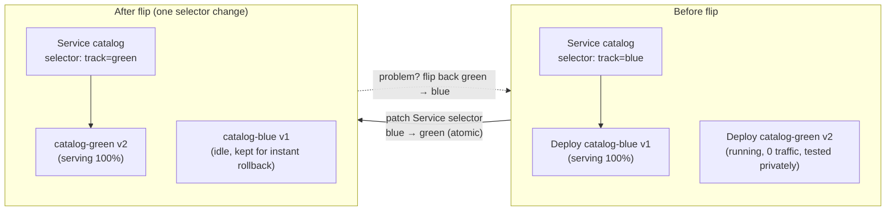
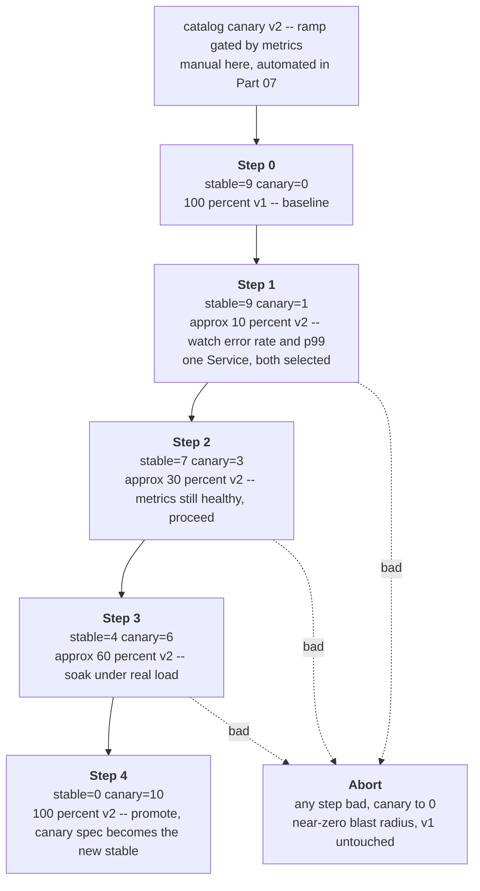

# 08 — Deployment strategies

> How you move from version N to N+1 with controlled risk: recreate vs. rolling
> (deep dive), blue-green, and canary — the concepts, the trade-offs, and a
> *manual* canary of catalog using two Deployments behind one Service selector.
> Progressive delivery (automated) is teased and forward-referenced.

**Estimated time:** ~15 min read · ~60 min hands-on
**Prerequisites:** [Part 01 ch.04](04-replicasets-and-deployments.md) — the rolling-update mechanism · [Part 01 ch.02](02-health-and-lifecycle.md) — readiness gates a rollout depends on
**You'll know after this:** • compare recreate, rolling, blue-green, and canary strategies and their failure modes · • run a manual canary using two Deployments and one Service selector · • reason about traffic-splitting limitations of Service-selector canaries · • choose a deployment strategy for a given risk profile · • recognize when automated progressive delivery (Argo Rollouts/Flagger) becomes worth the cost

<!-- tags: core-objects, deployments, canary, blue-green, rolling-update, progressive-delivery -->

## Why this exists

[ch.04](04-replicasets-and-deployments.md) gave you the *mechanism* of a
rolling update — surge math, readiness gating, rollback. But "how the bytes get
swapped" is not the same as "how you **release** safely". A rolling update
exposes **every** user to the new version as it rolls; if the new version is
subtly broken (a bad query, a memory leak that shows under real traffic, a bug
only some requests hit), you've already degraded everyone before the rollout
even finishes, and rollback is a *reaction* to damage already done.

Real release engineering asks: *can I expose the new version to a tiny slice
first, watch real signals, and abort with near-zero blast radius?* That is the
domain of **deployment strategies** — recreate, rolling, blue-green, canary —
each trading speed, cost, risk, and operational complexity differently. This
chapter is the conceptual map plus a hands-on **manual canary** of the
Bookstore catalog. It is the release-strategy face of the [Declarative
Deployment](#further-reading) pattern; the *automated* version (Argo
Rollouts/Flagger, metric-gated promotion) is [Part 07
ch.05](../07-delivery/05-progressive-delivery.md).

## Mental model

Every strategy is a different answer to two questions: **how many versions run
at once**, and **how is traffic split between them**.

- **Recreate** — stop all old, then start all new. One version at a time;
  100% cut. Simple, but a **downtime window**. Use only when versions *cannot*
  coexist (incompatible schema/protocol).
- **Rolling** ([ch.04](04-replicasets-and-deployments.md)) — gradually replace
  old Pods with new, both versions briefly serving, traffic split ≈ by replica
  ratio. No downtime, no extra full environment, but **no control over which
  users hit new** and the new version reaches everyone by the end.
- **Blue-green** — run the *full* new version ("green") **alongside** the old
  ("blue"), test green privately, then **flip 100% of traffic at once** (swap a
  Service selector / LB target). Instant cutover, instant rollback (flip back),
  but **2× resources** during the overlap and still a big-bang exposure.
- **Canary** — run a **small** amount of new ("canary") next to old
  ("stable"), send it a **small fraction** of real traffic, watch
  error/latency/business metrics, then **ramp up** (or abort). Smallest blast
  radius, real-traffic validation — but needs traffic-splitting and good
  signals.

Manual canary by replica ratio: if one Service selects both a 9-replica stable
Deployment and a 1-replica canary Deployment, ≈10% of requests hit canary
(load-balanced across endpoints). Crude but real, and the exact mechanism we
use below before introducing the precise (mesh/Gateway-weighted) form later.

## Diagrams

### Blue-green traffic switch (Mermaid)



### Canary weight ramp (Mermaid)



## Hands-on with the Bookstore

**Assumed working directory: the guide repo root (`full-guide/`).** Requires
the `bookstore` namespace ([ch.03](03-resources-and-qos.md)) and the
`bookstore/catalog:dev` image loaded. This chapter introduces a **Service**
ahead of [Part 02](../02-networking/02-services.md) (kept minimal — full
treatment there) purely so the canary split is observable.

### Manual canary of catalog (two Deployments, one Service)

The key idea: a **Service selects on `app: catalog` only**. Two Deployments —
`catalog-stable` and `catalog-canary` — both label their Pods `app: catalog`
(so the Service load-balances across *both*) **plus** a distinguishing
`track: stable|canary` label (so we can scale/observe each independently). The
traffic split is the **replica ratio**.

New file
[`examples/bookstore/raw-manifests/30-catalog-canary.yaml`](../examples/bookstore/raw-manifests/30-catalog-canary.yaml):

```yaml
apiVersion: v1
kind: Service
metadata:
  name: catalog
  namespace: bookstore
  labels: { app: catalog }
spec:
  selector:
    app: catalog            # NOTE: selects BOTH stable & canary (no `track` here)
  ports:
    - name: http
      port: 80
      targetPort: http      # the container's named port (8080)
---
apiVersion: apps/v1
kind: Deployment
metadata:
  name: catalog-stable
  namespace: bookstore
  labels: { app: catalog, track: stable }
spec:
  replicas: 9               # ~90% of traffic (9 of 10 endpoints)
  selector:
    matchLabels: { app: catalog, track: stable }   # owns only its own Pods
  template:
    metadata:
      labels:
        app: catalog        # selected by the Service (shared)
        track: stable       # distinguishes this Deployment's Pods
        component: backend
    spec:
      containers:
        - name: catalog
          image: bookstore/catalog:dev      # current "stable" image
          imagePullPolicy: IfNotPresent
          ports: [ { name: http, containerPort: 8080 } ]
          env: [ { name: PORT, value: "8080" } ]
          readinessProbe: { httpGet: { path: /readyz, port: http }, periodSeconds: 5 }
          livenessProbe:  { httpGet: { path: /healthz, port: http }, periodSeconds: 10 }
          resources:
            requests: { cpu: 50m, memory: 64Mi }
            limits:   { cpu: 250m, memory: 128Mi }
---
apiVersion: apps/v1
kind: Deployment
metadata:
  name: catalog-canary
  namespace: bookstore
  labels: { app: catalog, track: canary }
spec:
  replicas: 1               # ~10% of traffic (1 of 10 endpoints)
  selector:
    matchLabels: { app: catalog, track: canary }
  template:
    metadata:
      labels:
        app: catalog        # ALSO selected by the SAME Service
        track: canary       # but distinguishable for scaling/metrics
        component: backend
    spec:
      containers:
        - name: catalog
          image: bookstore/catalog:dev      # in real life: the NEW candidate image
          imagePullPolicy: IfNotPresent
          ports: [ { name: http, containerPort: 8080 } ]
          env:
            - { name: PORT, value: "8080" }
            - { name: LOG_LEVEL, value: "debug" }   # stand-in for "this is v2"
          readinessProbe: { httpGet: { path: /readyz, port: http }, periodSeconds: 5 }
          livenessProbe:  { httpGet: { path: /healthz, port: http }, periodSeconds: 10 }
          resources:
            requests: { cpu: 50m, memory: 64Mi }
            limits:   { cpu: 250m, memory: 128Mi }
```

> **Don't run both catalog stacks at once.** This `30-catalog-canary.yaml` is
> a *teaching variant* — it creates Pods labelled `app: catalog`, the **same
> label** as the canonical ch.04 `10-catalog-deploy.yaml` Deployment (3
> replicas). If the ch.04 Deployment is still up, the shared Service would
> select **13** endpoints (3 + 9 + 1) and the 90/10 split observation below
> would be wrong. So remove it **first** (it is superseded here; the canonical
> catalog returns in later parts via progressive delivery, not by hand-running
> two Deployments — see the lineage note after this section).

Prerequisite — retire the ch.04 catalog Deployment so only the two canary-demo
tracks define `app: catalog` Pods:

```sh
# from the repo root (full-guide/)
# Remove the canonical ch.04 catalog Deployment so its 3 Pods don't pollute
# the shared Service's endpoint set (skip silently if it was never applied).
kubectl delete deployment/catalog -n bookstore --ignore-not-found
```

Now apply the canary demo and verify one Service is fronting **both** tracks:

```sh
# from the repo root (full-guide/)
kubectl apply -f examples/bookstore/raw-manifests/30-catalog-canary.yaml
kubectl get deploy -n bookstore -l app=catalog        # catalog-stable(9), catalog-canary(1)
kubectl get endpointslices -n bookstore -l kubernetes.io/service-name=catalog -o wide
#   ~10 endpoint IPs: ~9 from stable Pods, ~1 from the canary Pod — ONE Service.
kubectl get pods -n bookstore -l app=catalog -L track  # TRACK column shows the split
```

Drive traffic and watch it spread across both tracks (replica-ratio split):

```sh
# ns bookstore is PSA `restricted` — shape the ad-hoc pod via --overrides
# (runAsNonRoot + drop ALL + seccomp RuntimeDefault) or PSA rejects it:
kubectl run -n bookstore curlbox --image=busybox:1.36 --restart=Never -i --rm \
  --overrides='{"apiVersion":"v1","spec":{"securityContext":{"runAsNonRoot":true,"runAsUser":65532,"seccompProfile":{"type":"RuntimeDefault"}},"containers":[{"name":"curlbox","image":"busybox:1.36","securityContext":{"allowPrivilegeEscalation":false,"capabilities":{"drop":["ALL"]}},"command":["sh","-c","for i in $(seq 1 20); do wget -qO- http://catalog.bookstore.svc.cluster.local/healthz; echo; done"]}]}}'
#   all 200s; ~1 in 10 requests was served by the canary Pod (check its logs):
kubectl logs -n bookstore -l track=canary --tail=20    # canary saw ~10% of calls
```

Ramp / abort the canary by changing **only replica counts** (no traffic config):

```sh
# Promote-by-ramp: shift the ratio toward canary as metrics stay healthy.
kubectl scale deploy/catalog-canary -n bookstore --replicas=3   # ~30%
kubectl scale deploy/catalog-stable -n bookstore --replicas=7
# ...watch error rate / p99 (Part 06 ch.01) at each step...
# Abort instantly (near-zero blast radius): canary → 0, stable back to full.
kubectl scale deploy/catalog-canary -n bookstore --replicas=0
kubectl scale deploy/catalog-stable -n bookstore --replicas=9
# Promote: set the canary image as catalog-stable's image, scale canary to 0.
```

> **Why this is "manual".** Traffic share == replica ratio, the split is
> coarse, and **you** watch the metrics and run the `scale` commands. There is
> no automatic metric-gated promotion/abort and no precise weight (you can't
> easily do 5%). Those are exactly what **progressive delivery** tooling adds
> ([Part 07 ch.05](../07-delivery/05-progressive-delivery.md): Argo
> Rollouts/Flagger drive the ramp from metrics; a service mesh / Gateway API
> does *weighted* routing instead of replica-ratio). The shape — two tracks,
> one Service, observe, ramp/abort — is identical; the automation and precision
> change.

> **Lineage note.** This is a *teaching variant* of the catalog
> (`30-...` separate from the ch.04 `10-catalog-deploy.yaml`), showing the
> two-track canary pattern explicitly. In the real Bookstore the single
> `catalog` Deployment from ch.04 plus a progressive-delivery controller
> ([Part 07](../07-delivery/05-progressive-delivery.md)) supersedes hand-running
> two Deployments. `10-catalog-deploy.yaml` remains the canonical catalog;
> `30-catalog-canary.yaml` is the strategy demo (which is why the hands-on
> retired the ch.04 Deployment before applying it — they must not run
> simultaneously; both define `app: catalog` Pods in the same namespace).
> To return to the canonical catalog afterward:
> `kubectl delete -f examples/bookstore/raw-manifests/30-catalog-canary.yaml`
> then re-apply `10-catalog-deploy.yaml`.

## Strategy comparison

| Strategy | Versions live | Traffic cut | Extra cost | Rollback | Use when |
|---|---|---|---|---|---|
| **Recreate** | 1 | 0→100% (downtime) | none | redeploy old | versions can't coexist; downtime acceptable |
| **Rolling** | 2 (briefly) | gradual by replica | ~maxSurge | `rollout undo` | default for stateless; backward-compatible changes |
| **Blue-green** | 2 (full) | 100% flip | **2×** during overlap | flip selector back (instant) | need instant cutover/rollback; can pay 2× |
| **Canary** | 2 (small canary) | small → ramped | ~canary size | scale canary to 0 (tiny blast) | risky change; have metrics + traffic split |

Decision shortcut: **rolling** by default; **blue-green** when you need an
instant, atomic cut with instant rollback and can afford double; **canary**
when the change is risky enough that you want real-traffic validation at <100%
before committing; **recreate** only when two versions truly cannot run
together (then pair with an expand/contract migration,
[ch.07](07-jobs-and-cronjobs.md), to *avoid* needing recreate at all).

## How it works under the hood

- **All of these are just label/selector + replica arithmetic on top of
  ch.04.** Kubernetes core has **no** "canary" or "blue-green" object. A
  rolling update is the Deployment controller managing two ReplicaSets
  ([ch.04](04-replicasets-and-deployments.md)). Blue-green is *two
  Deployments* and a **Service whose `selector` you patch** to repoint
  endpoints atomically. Canary is *two Deployments selected by one Service*,
  with the split emerging from how many Ready endpoints each contributes.
- **The Service/EndpointSlice layer is what makes traffic move.** A Service
  selects Pods by label; the EndpointSlice controller ([Part 00
  ch.04](../00-foundations/04-control-plane-deep-dive.md)) keeps the endpoint
  set in sync with matching **Ready** Pods; kube-proxy load-balances across
  them roughly evenly. So "10% to canary" is really "canary contributes ~10%
  of the Ready endpoints", and "blue-green flip" is "change the selector ⇒
  endpoint set is recomputed ⇒ traffic follows" (full mechanics: [Part 02
  ch.02](../02-networking/02-services.md)). Readiness probes
  ([ch.02](02-health-and-lifecycle.md)) gate every one of these — an unready
  canary gets no traffic.
- **Replica-ratio canary is statistical and coarse.** Splitting by Pod count
  means the minimum step is `1/(stable+canary)`, the split is only
  *approximately* even (connection reuse/keep-alive skews it), and it's
  *random* which users hit canary (no sticky/by-header routing). Precise,
  weighted, or sticky canaries require an L7 router that does **weighted
  traffic splitting** (service mesh, Gateway API, ingress with canary
  annotations) — that is the leap to [Part 07
  ch.05](../07-delivery/05-progressive-delivery.md).
- **Promotion/abort is a control loop you (or a controller) close.** Nothing
  built-in watches canary metrics and decides. Manually: read dashboards, run
  `kubectl scale`. With **Argo Rollouts/Flagger**: a controller runs the ramp
  as steps, queries Prometheus/SLOs as **analysis**, and auto-promotes or
  auto-aborts — the canary control loop, automated and declarative
  ([Part 07 ch.05](../07-delivery/05-progressive-delivery.md)). Same idea,
  removed toil and removed human latency.

## Production notes

> **In production:** even with canary/blue-green, **schema and API changes must
> be backward-compatible** (expand/contract). During *any* of these strategies
> two code versions hit the *same* database; a destructive migration breaks the
> version that didn't expect it. Decouple schema changes from code releases
> ([ch.07](07-jobs-and-cronjobs.md), [Part 07
> ch.03](../07-delivery/03-cicd-pipeline.md)).

> **In production:** blue-green's instant rollback is only real if **stateful
> side-effects are handled**. Sessions, in-flight jobs, cache warmth, and
> especially DB writes don't "flip back". Keep the old stack warm, drain
> connections on cutover ([ch.02](02-health-and-lifecycle.md) preStop/grace),
> and ensure writes from green are readable by blue if you might revert.

> **In production:** a canary is worthless without **good signals and an SLO**.
> Define the metrics that gate promotion (error rate, p99 latency, saturation,
> a key business metric) *before* you canary, and compare canary **against the
> stable baseline at the same time**, not against history. No analysis ⇒ you've
> just done a slower rolling update with extra steps.

> **In production:** prefer **automated progressive delivery** (Argo
> Rollouts/Flagger + a mesh/Gateway for weighted routing) over hand-running
> `kubectl scale`. Humans are slow and inconsistent at watching graphs at 3am;
> automation gives precise weights, metric-gated auto-promote, and **automatic
> abort** on SLO breach ([Part 07
> ch.05](../07-delivery/05-progressive-delivery.md)). Manual canary is the
> concept; automation is the production form.

> **In production:** account for **cost and quota** of overlap. Blue-green
> needs ~2× capacity during the window; canary needs canary headroom plus
> enough stable to not under-provision while you split. On EKS/GKE/AKS this
> transiently increases node count/spend ([Part 06
> ch.06](../06-production-readiness/06-capacity-and-cost.md)); size
> `ResourceQuota` ([ch.03](03-resources-and-qos.md)) to allow the overlap or
> the rollout stalls at admission.

## Quick Reference

```sh
# manual canary by replica ratio (one Service selecting app=catalog)
kubectl scale deploy/catalog-canary -n <NS> --replicas=<N>   # ramp up
kubectl scale deploy/catalog-stable -n <NS> --replicas=<N>   # down
kubectl scale deploy/catalog-canary -n <NS> --replicas=0     # ABORT (tiny blast)
kubectl get endpointslices -n <NS> -l kubernetes.io/service-name=<SVC> -o wide
kubectl get pods -n <NS> -l app=<SVC> -L track               # see the split

# blue-green: flip a Service selector atomically
kubectl patch svc <SVC> -n <NS> -p '{"spec":{"selector":{"track":"green"}}}'
kubectl patch svc <SVC> -n <NS> -p '{"spec":{"selector":{"track":"blue"}}}'   # rollback

# rolling / recreate (ch.04)
kubectl set image deploy/<D> -n <NS> <CTR>=@sha256:...   # rolling
kubectl rollout undo deploy/<D> -n <NS>
# strategy: { type: Recreate }  in the Deployment spec for recreate
```

Manual-canary skeleton (one Service, two tracks):

```yaml
apiVersion: v1
kind: Service
metadata: { name: <APP>, namespace: <NS> }
spec:
  selector: { app: <APP> }            # selects BOTH tracks (no `track` key)
  ports: [ { port: 80, targetPort: http } ]
---
# Deployment <APP>-stable : labels {app: <APP>, track: stable}, replicas: 9
# Deployment <APP>-canary : labels {app: <APP>, track: canary}, replicas: 1
#   both template labels include app:<APP> (Service-selected) + track:<X>
#   selector.matchLabels = {app:<APP>, track:<X>}  (each owns only its Pods)
```

Checklist:

- [ ] Strategy matches the change's risk (rolling default; canary for risky)
- [ ] Service selector is the **shared** label; per-track label only for scaling
- [ ] Each Deployment's `selector` includes the track label (owns only its Pods)
- [ ] Schema/API changes backward-compatible (two versions coexist safely)
- [ ] Canary gated on defined metrics vs. the live stable baseline
- [ ] Rollback path proven (scale canary→0 / flip selector) incl. side-effects
- [ ] Quota/cost allows the overlap; automate via progressive delivery in prod

## Test your understanding

> Try each before opening the answer drawer. The act of trying is the exercise; the answer is the check.

1. **Why is "rolling update" still considered risky for a high-impact change, even though it's the default and has no downtime? What does canary add that rolling doesn't?**
   <details><summary>Show answer</summary>

   A rolling update exposes 100% of users to the new version by the end of the rollout — if the new version has a subtle bug only some requests hit, you've already degraded everyone before you can detect and roll back. Canary keeps a small slice of traffic on the new version, you watch real signals, and abort with near-zero blast radius before promotion. Rolling validates "the binary starts and probes pass"; canary validates "real traffic looks healthy" (see §Why this exists and §Mental model).

   </details>

2. **In the manual-canary recipe, the Service selects only `app: catalog` and not `track: stable|canary`. Why? What would change if the Service selector included `track: stable`?**
   <details><summary>Show answer</summary>

   With `app: catalog` only, both Deployments' Pods end up in the same Service's EndpointSlice — the replica ratio determines the traffic split. If `track: stable` were added to the selector, the Service would only route to stable Pods and the canary would get zero traffic — defeating the whole point. The trick is that the Service selector is the *shared* label, while each Deployment's `selector.matchLabels` includes track to own its own Pods exclusively (see §1. Manual canary).

   </details>

3. **A teammate proposes blue-green for a release that includes a destructive schema migration. Why is this dangerous, and what's the architectural fix?**
   <details><summary>Show answer</summary>

   During blue-green's overlap window, both blue and green hit the *same* database. A destructive (drop-column or alter-type) migration breaks whichever side doesn't expect it. Worse, rolling back blue-green's *selector* doesn't roll back the schema — blue may not survive the post-migration shape. Fix: decouple schema from code via expand/contract migrations — first ship a backward-compatible schema change (expand), then the code, then optionally contract the now-unused old schema bits (see §Production notes).

   </details>

4. **A 9-stable-1-canary split should give ~10% to canary, but the canary Pod is observing 18% of requests in its logs. List two plausible causes.**
   <details><summary>Show answer</summary>

   (1) Connection reuse/keep-alive: clients that opened a connection to the canary keep sending requests there for the connection's life — replica-ratio split is "per *connection*" not "per *request*" on persistent connections. (2) An unhealthy stable Pod was de-endpointed (failing readiness), so the effective ratio is actually 8-to-1, not 9-to-1. Check `kubectl get endpointslices` for the current Ready endpoint count per track. This is why precise weights need L7 weighted routing (see §How it works under the hood, "replica-ratio canary is statistical and coarse").

   </details>

5. **Hands-on extension: apply `30-catalog-canary.yaml`, scale canary to 3, then `kubectl scale deploy/catalog-stable --replicas=0`. What changes in the Service endpoints, and what does this teach about blue-green vs. canary?**
   <details><summary>What you should see</summary>

   With stable=0 and canary=3, the EndpointSlice has only canary Pods — 100% of traffic now hits the canary version. You've effectively performed a "canary ramp to 100%" which equals a promotion. This is the same mechanism as blue-green's selector flip but expressed by replica counts — both are just label/selector + endpoint arithmetic. The conceptual difference between strategies is the *ramp* and the *amount of overlap*; the mechanism is identical (see §How it works under the hood, "Service/EndpointSlice layer is what makes traffic move").

   </details>

## Further reading

- **Ibryam & Huß, _Kubernetes Patterns_ 2e — *Declarative Deployment*
  (ch.3)** — rolling, fixed (recreate), blue-green, and canary expressed
  declaratively, with their trade-offs.
- **Rosso et al., _Production Kubernetes_, ch.14 — "Application
  Considerations"** (release/rollout strategy and safe delivery in production);
  see also **Lukša 2e, ch.14** for the rolling-update foundation.
- Official:
  <https://kubernetes.io/docs/concepts/workloads/controllers/deployment/#strategy>
  and the canary discussion in
  <https://kubernetes.io/docs/concepts/cluster-administration/manage-deployment/#canary-deployments>.
