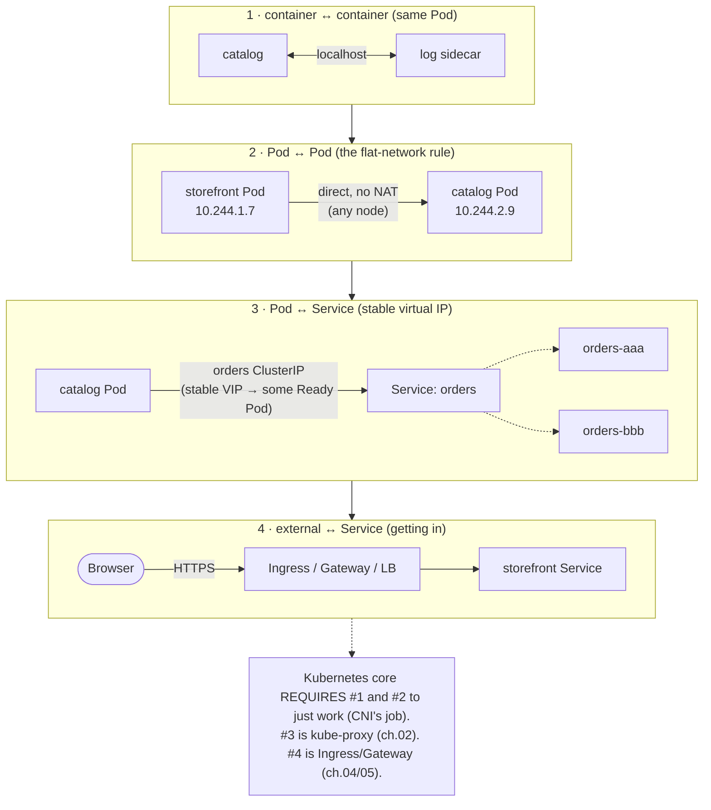
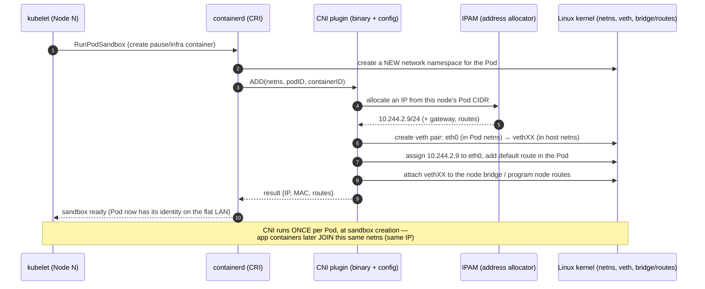

# 01 — The networking model

> The four networking problems Kubernetes must solve, the one rule that makes
> them tractable (**IP-per-Pod on a flat network, no NAT pod-to-pod**), and how
> the CNI plugin actually wires a Pod's network namespace via a veth pair and a
> bridge when the kubelet creates the sandbox.

**Estimated time:** ~15 min read · (no hands-on)
**Prerequisites:** [Part 00 ch.05](../00-foundations/05-node-components.md) — kubelet/CRI sandbox creation · [Part 01 ch.01](../01-core-workloads/01-pods.md) — Pods sharing a network namespace
**You'll know after this:** • name the four networking problems Kubernetes must solve · • state the one rule (IP-per-Pod, no NAT pod-to-pod) that makes the model tractable · • explain what a CNI plugin actually does to a Pod's network namespace · • trace a veth pair from a Pod through the host bridge · • predict what breaks when the CNI plugin fails

<!-- tags: networking, cni, pod-network, veth, ip-per-pod -->

## Why this exists

So far the Bookstore is a pile of Pods: `catalog`, `storefront`, `orders`,
`postgres` ([Part 01](../01-core-workloads/04-replicasets-and-deployments.md)).
Each is alive — but **isolated**. `storefront` cannot reach `catalog`;
`catalog` cannot reach `postgres`; nothing outside the cluster can reach the
UI. A microservices app is *defined* by the calls between its parts, and none
of them work yet.

Before Services, Ingress, DNS, or NetworkPolicy can mean anything, you need the
**substrate** they all stand on: how does a packet get from one container to
another at all? Kubernetes deliberately does *not* invent a network — it
defines a small set of **requirements** and delegates the implementation to a
pluggable **CNI** plugin (the seam introduced in
[Part 00 ch.05](../00-foundations/05-node-components.md)). Every later
networking chapter (Services in [ch.02](02-services.md), DNS in
[ch.03](03-dns-and-discovery.md), policy in [ch.06](06-network-policies.md)) is
a layer *on top of* the model in this chapter. Get the model wrong and every
layer above it is mysterious.

## Mental model

Kubernetes networking is **"every Pod is a host on one big flat LAN"**.

Picture a single, flat virtual switch the size of the whole cluster. Every Pod
plugs into it and gets **its own IP address** — not the node's IP, its *own*.
Any Pod can open a connection to any other Pod's IP **directly**, on **any
port**, **without NAT**, whether they are on the same node or different nodes.
A Pod sees the *same* IP for itself that everyone else uses to reach it (no
"behind a NAT" surprise). It is as if every container were a small VM on one
giant subnet.

That model is a **promise Kubernetes makes but does not implement**. The thing
that *makes the flat LAN real* — handing each Pod an IP, creating its virtual
network cable, and getting packets between nodes — is the **CNI plugin**
(Calico, Cilium, Flannel, kindnet…). Different plugins keep the same promise
with very different machinery (an overlay tunnel, plain routing, or eBPF).
Everything above (Services, DNS, policy) is built assuming this promise holds.

## Diagrams

### The four networking problems (Mermaid)



The whole of Part 02 is these four problems, in order: this chapter owns #1 and
#2 (the substrate); [ch.02](02-services.md) owns #3; [ch.04](04-ingress.md) /
[ch.05](05-gateway-api.md) own #4; [ch.03](03-dns-and-discovery.md) is the
*naming* layer over #3/#4; [ch.06](06-network-policies.md) *restricts* #2/#3.

### kubelet → CNI ADD at sandbox creation (Mermaid)



This is the precise expansion of the "CNI ADD" arrow from the
[Part 00 ch.05 node-startup sequence](../00-foundations/05-node-components.md#sequence-a-pod-starting-on-a-node).
It is why a `CrashLoopBackOff` Pod keeps its IP (the sandbox/netns persists
across app-container restarts) and why all containers in a Pod share one IP.

### Pod netns / veth / bridge nesting (ASCII)

```
        WORKER NODE (host network namespace)
 ┌───────────────────────────────────────────────────────────────────┐
 │                                                                     │
 │   ┌─ Pod A netns ──────────┐      ┌─ Pod B netns ──────────┐        │
 │   │ eth0  10.244.2.9/24    │      │ eth0  10.244.2.10/24   │        │
 │   │  (loopback: lo)        │      │  (loopback: lo)        │        │
 │   └─────────┬──────────────┘      └─────────┬──────────────┘        │
 │             │ veth pair                     │ veth pair             │
 │        vethA1│ (host end)              vethB1│ (host end)            │
 │             └──────────────┬────────────────┘                       │
 │                            ▼                                        │
 │                  cni0  (Linux bridge, 10.244.2.1)  ← Pod default GW  │
 │                            │                                        │
 │                     eth0 (node NIC, e.g. 192.168.0.5)               │
 │                            │  inter-node Pod traffic leaves here:   │
 │                            │  VXLAN-encapsulated (overlay) OR        │
 │                            │  plain-routed (BGP/route table)         │
 └────────────────────────────┼───────────────────────────────────────┘
                               ▼  to other nodes' Pod CIDRs
   Same-node Pod↔Pod  : A.eth0 → vethA1 → cni0 → vethB1 → B.eth0  (L2, no NAT)
   Cross-node Pod↔Pod : A.eth0 → vethA1 → cni0 → node NIC → (overlay|route)
                        → remote node → its bridge → target veth → Pod
```

## Hands-on with the Bookstore

**Assumed working directory: the guide repo root (`full-guide/`).** Requires
the `bookstore` namespace and the catalog/storefront Deployments from
[Part 01 ch.04](../01-core-workloads/04-replicasets-and-deployments.md)
(`kubectl apply -f examples/bookstore/raw-manifests/00-namespace.yaml`, then
`10-catalog-deploy.yaml` and `11-storefront-deploy.yaml`, with the
`bookstore/*:dev` images loaded — `kind load docker-image ...`).

This chapter adds **no new manifest** — it is the substrate the next chapters
build manifests on. Instead, *observe the model on the running Bookstore*.

### 1. Every Pod has its own IP (the flat LAN)

```sh
# from the repo root (full-guide/)
kubectl get pods -n bookstore -o wide
#   each catalog/storefront Pod shows a DISTINCT IP in the Pod CIDR
#   (e.g. 10.244.x.y) and the NODE it runs on. The IP is the Pod's own —
#   NOT the node IP. That is "IP-per-Pod".
kubectl get pods -n bookstore -o custom-columns=POD:.metadata.name,IP:.status.podIP,NODE:.spec.nodeName
```

### 2. Pod → Pod directly, no NAT, no Service yet

Use a throwaway debug Pod with a **public** image that has a shell and curl
(the `catalog` image is `gcr.io/distroless/static:nonroot` — **no shell, no
curl** — so you must *not* exec into it for this; spin up a separate debug Pod
instead, per the
[distroless rule](../00-foundations/05-node-components.md)):

```sh
# Grab one catalog Pod's IP:
CAT_IP=$(kubectl get pod -n bookstore -l app=catalog \
  -o jsonpath='{.items[0].status.podIP}')
echo "$CAT_IP"

# Hit that Pod IP DIRECTLY from an ephemeral curl Pod — no Service involved.
# ns bookstore is PSA `restricted`, so the ad-hoc pod MUST be restricted-shaped
# via --overrides or PSA rejects it. $CAT_IP is passed in as an env var (the
# shell expands it where the single-quote is broken: '"$CAT_IP"'):
kubectl run -n bookstore tmp-curl --rm -i --restart=Never \
  --image=curlimages/curl:8.9.1 \
  --overrides='{"apiVersion":"v1","spec":{"securityContext":{"runAsNonRoot":true,"runAsUser":65532,"seccompProfile":{"type":"RuntimeDefault"}},"containers":[{"name":"tmp-curl","image":"curlimages/curl:8.9.1","env":[{"name":"CAT_IP","value":"'"$CAT_IP"'"}],"securityContext":{"allowPrivilegeEscalation":false,"capabilities":{"drop":["ALL"]},"readOnlyRootFilesystem":true},"command":["sh","-c","curl -s http://$CAT_IP:8080/healthz"]}]}}'
#   → {"status":"ok"} : a raw Pod-to-Pod connection across the flat network.
#   The source Pod sees the SAME $CAT_IP everyone uses (no NAT). This is the
#   promise; Services (ch.02) add a STABLE name in front of these churny IPs.
```

### 3. See the CNI's handiwork on the node

`kind` nodes are containers, so you can look at the node's network directly
(this inspects the *node*, not the distroless app container):

```sh
# Which CNI is this cluster running? (kind's default is kindnet)
kubectl get pods -n kube-system -o wide | grep -Ei 'kindnet|calico|cilium|flannel'

# The veth host-ends and bridge the CNI created live in the node's netns:
docker exec -it bookstore-control-plane sh -c 'ip -br addr | grep -E "veth|cni|flannel|cali" ; ip route'
#   you will see vethXXXX interfaces (one host-end per local Pod) and the
#   Pod-CIDR routes the CNI programmed — exactly the ASCII diagram above.
```

> **Lineage note.** Nothing here is saved as a manifest because the networking
> *model* is not an object you apply — it is a property the CNI guarantees so
> that the Services you add in [ch.02](02-services.md)
> (`40-services.yaml`), the Ingress in [ch.04](04-ingress.md)
> (`50-ingress.yaml`), and the NetworkPolicies in
> [ch.06](06-network-policies.md) (`60-networkpolicy.yaml`) have a flat,
> routable Pod network to operate over. The Bookstore manifests resume in
> [ch.02](02-services.md).

## How it works under the hood

### The Kubernetes network model — the four rules

The model is small and is the *contract* every CNI must satisfy:

1. **Every Pod gets its own unique cluster-wide IP.** Not the node's IP; its
   own, from a per-node slice of the cluster **Pod CIDR**.
2. **Pods communicate Pod-IP → Pod-IP directly, without NAT**, regardless of
   which nodes they're on. (Source address is preserved end to end.)
3. **An agent on the node (kubelet/CNI) communicates with all Pods on that
   node** without NAT.
4. **A Pod's view of its own IP == others' view of it.** No "I think I'm
   `127.0.0.1`, but the world sees me as `10.x`" — one identity.

Containers *in the same Pod* share one network namespace (the pause
container's, [Part 00 ch.05](../00-foundations/05-node-components.md)) so they
reach each other on **`localhost`** and **must not** use the same port — that
is networking problem #1, solved structurally by the Pod itself.

### CNI: the spec and how the kubelet invokes it

**CNI (Container Network Interface)** is a deliberately tiny spec: a CNI plugin
is an **executable** plus a JSON config in `/etc/cni/net.d/`. The contract is
just a few verbs — chiefly **`ADD`** (wire this sandbox up, return an IP) and
**`DEL`** (tear it down) — invoked with the target **network namespace** and
container ID, parameters passed via env + stdin JSON, result returned as JSON.

The kubelet does **not** call CNI directly. The chain (from
[Part 00 ch.05](../00-foundations/05-node-components.md)) is: kubelet → (CRI)
→ containerd → on `RunPodSandbox`, the runtime creates the Pod's **netns** and
invokes the configured **CNI plugin `ADD`**. The plugin allocates an IP (via an
**IPAM** plugin), creates a **veth pair** (one end `eth0` *inside* the Pod
netns, the other end on the host), assigns the IP and a default route inside
the Pod, and connects the host end to the node's dataplane (a **bridge**,
or direct **routes**, or an **eBPF** path). It runs **once per Pod, at sandbox
creation** — which is exactly why all containers in a Pod share one IP and why
the IP survives app-container restarts.

### Plugin landscape: overlay vs. routed vs. eBPF

All keep the four-rule promise; they differ in *how cross-node Pod traffic
moves* and *what extra features they add* (NetworkPolicy enforcement is the big
one — [ch.06](06-network-policies.md)):

| Approach | How cross-node packets move | Examples | Trade-off |
|---|---|---|---|
| **Overlay (encapsulation)** | Pod packets wrapped in **VXLAN** (or Geneve/IPIP) UDP between node IPs; an L2 overlay on top of the real network | Flannel (VXLAN), Calico (VXLAN/IPIP mode), kind's **kindnet** | Works on *any* underlying network (no fabric changes); small MTU/encap overhead |
| **Routed (no encapsulation)** | Each node advertises its Pod CIDR via **BGP** (or the cloud's route table); packets are plain-routed, unwrapped | Calico (BGP mode), Cilium (native routing), cloud VPC-CNI | Near-native performance, real Pod IPs on the wire; needs an L3 fabric/route control |
| **eBPF dataplane** | Programs the kernel via **eBPF** for forwarding/policy; can **replace kube-proxy** entirely | **Cilium**, Calico eBPF mode | Best performance & richest policy/observability; newer, kernel-version sensitive |

`kind`'s default **kindnet** is a minimal overlay-style CNI suitable for
learning; crucially it does **not enforce NetworkPolicy**
([ch.06](06-network-policies.md) calls this out and installs Calico to get
real enforcement). The choice of CNI is a **cluster-build decision**
([Part 00 ch.05 production note](../00-foundations/05-node-components.md)): it
determines performance, whether `NetworkPolicy` is enforced, IPv6/dual-stack,
and whether kube-proxy is even present.

### Pod netns + veth + bridge, concretely

A network namespace is a kernel-isolated copy of the network stack
([Part 00 ch.02](../00-foundations/02-containers-and-images.md)): its own
interfaces, routes, ARP/neighbor table, iptables. A **veth pair** is a virtual
"patch cable": two linked interfaces where bytes in one end come out the other.
The CNI puts `eth0` in the Pod's netns and the partner (`vethXXXX`) in the
host netns, then plugs the host end into the node's forwarding mechanism:

- **same-node Pod↔Pod:** Pod A `eth0` → `vethA` → node **bridge** (`cni0`) →
  `vethB` → Pod B `eth0`. Pure L2 on the node; no NAT.
- **cross-node Pod↔Pod:** up to the node, then either **encapsulated**
  (overlay: wrapped in VXLAN to the peer node IP, unwrapped, delivered to the
  target Pod's veth) or **routed** (the node knows a route to the remote Pod
  CIDR via BGP/cloud routes and forwards natively).

Either way rule #2 holds: the *Pod* only ever sees a flat IP network.

## Production notes

> **In production:** the **CNI is a foundational, hard-to-change decision**.
> Migrating CNIs on a live cluster is disruptive (Pod IP churn, policy gaps).
> Choose deliberately up front for: NetworkPolicy enforcement
> ([ch.06](06-network-policies.md) — kindnet/Flannel-VXLAN historically don't),
> performance (eBPF/routed > overlay), IPv6/dual-stack, scale (BGP/route-table
> limits), and observability (Cilium/Hubble). "We'll add policy later" fails if
> the CNI you picked can't enforce it.

> **In production (EKS/GKE/AKS):** the cloud picks a default CNI and it changes
> the model. **EKS VPC-CNI** gives Pods **real VPC IPs** (no overlay; Pods are
> first-class in the VPC, but Pod density is bounded by ENI/IP limits per
> instance). **GKE** uses an alias-IP/VPC-native model (or **Dataplane V2** =
> Cilium/eBPF with built-in policy). **AKS** offers kubenet vs. **Azure CNI**.
> Whether `NetworkPolicy` is enforced and how Pod IPs appear on the wire all
> depend on this choice — confirm it before designing
> [ch.06](06-network-policies.md) policies.

> **In production:** mind the **MTU**. Overlays (VXLAN ≈ 50 bytes of headers)
> reduce the usable payload; if Pod MTU isn't lowered to match, you get
> intermittent failures on large packets (TLS handshakes, big responses) that
> "ping works but curl hangs" — a classic, baffling overlay misconfiguration.

> **In production:** **Pod IPs are ephemeral and recycled.** Never hardcode a
> Pod IP or put one in config/allowlists — it will be reused by an unrelated
> Pod. Address Pods via **Services + DNS** ([ch.02](02-services.md)/
> [ch.03](03-dns-and-discovery.md)); restrict by **label-based
> NetworkPolicy**, not IP ([ch.06](06-network-policies.md)).

> **In production:** `kube-proxy`'s mode (or its **eBPF replacement**) is part
> of this decision — it's how Service VIPs work over this Pod network
> ([ch.02](02-services.md), [Part 00 ch.05](../00-foundations/05-node-components.md)).

## Quick Reference

```sh
kubectl get pods -A -o wide                 # Pod IPs + nodes (the flat LAN)
kubectl get pod <P> -n <NS> \
  -o jsonpath='{.status.podIP}{"\n"}'       # one Pod's own IP
kubectl get pods -n kube-system | \
  grep -Ei 'kindnet|calico|cilium|flannel'  # which CNI is installed
kubectl get nodes -o jsonpath \
  ='{range .items[*]}{.metadata.name}{" podCIDR="}{.spec.podCIDR}{"\n"}{end}'
# debug connectivity with an EPHEMERAL public-image Pod (never exec distroless):
kubectl run tmp --rm -it --restart=Never --image=nicolaka/netshoot -- bash
kubectl run tmp --rm -it --restart=Never --image=curlimages/curl:8.9.1 -- \
  curl -s http://<podIP>:<PORT>/<PATH>
# on a kind node container (inspect the node, not the app Pod):
docker exec -it <CLUSTER>-control-plane sh -c 'ip -br addr; ip route'
```

The model in one skeleton (memorize this shape):

```
Kubernetes network contract (CNI must satisfy ALL four):
  1. every Pod has its OWN cluster-unique IP (not the node's)
  2. Pod ↔ Pod direct, NO NAT, any node          ← the "flat network" rule
  3. node agent ↔ all local Pods, no NAT
  4. Pod's self-IP == the IP others use for it

kubelet ─CRI→ containerd ──(RunPodSandbox)──► create Pod netns
                                └──► CNI ADD: IPAM ip + veth pair + (bridge|route|eBPF)
   (runs ONCE per Pod; app containers join the same netns ⇒ shared IP)

Implementations keep the promise differently:
  overlay (VXLAN)  | routed (BGP / route table) | eBPF (Cilium; replaces kube-proxy)
```

Networking-model checklist:

- [ ] CNI chosen for: policy enforcement, performance, IPv6, scale, observability
- [ ] NetworkPolicy is *enforced* by the chosen CNI (kindnet/Flannel often not)
- [ ] Pod MTU correct for the dataplane (overlay encap overhead accounted for)
- [ ] No Pod IPs hardcoded anywhere (Services + DNS + label policy instead)
- [ ] On managed: you know the cloud CNI's model (VPC-IP vs overlay) and limits
- [ ] kube-proxy mode / eBPF-replacement decided (it rides on this Pod network)

## Test your understanding

> Try each before opening the answer drawer. The act of trying is the exercise; the answer is the check.

1. **State Kubernetes' four networking-model rules in one sentence each. Why does rule 2 (Pod-to-Pod, no NAT) make the rest of the abstractions (Services, DNS, NetworkPolicy) tractable?**
   <details><summary>Show answer</summary>

   (1) Every Pod has its own cluster-unique IP. (2) Pods talk Pod-IP to Pod-IP directly without NAT. (3) Node agents reach local Pods without NAT. (4) A Pod's self-IP equals the IP others see. Rule 2 is the keystone: if every Pod is reachable on a flat LAN, Services can be "a stable VIP that load-balances to a set of Pod IPs", DNS can resolve names to those IPs, and policy can be expressed by label without IP gymnastics. Break rule 2 (e.g., port-mapped containers) and every layer above becomes special-cased (see §Mental model and §The four rules).

   </details>

2. **A teammate proposes a new cluster using `kindnet` for the CNI "because it works fine". You plan NetworkPolicy enforcement later. Why is this combination a trap?**
   <details><summary>Show answer</summary>

   kindnet does not *enforce* NetworkPolicy objects — you can apply them and they appear in the API but no enforcement happens, leading to a dangerous false sense of security. NetworkPolicy enforcement is a CNI capability; Cilium/Calico do, kindnet/Flannel often don't. The CNI is foundational and hard to swap on a live cluster, so policy enforceability must be a choice made up front (see §Plugin landscape and §Production notes).

   </details>

3. **You see a Pod's `CrashLoopBackOff` keep the same IP across multiple restarts, but the IP changes when the Pod is deleted and recreated by its Deployment. What's the structural reason?**
   <details><summary>Show answer</summary>

   CNI runs *once per Pod* at sandbox (pause container) creation — the IP belongs to the sandbox's network namespace. App containers restart in place and rejoin the same netns; the sandbox (and IP) outlive container restarts. When the Pod itself is recreated, a *new* sandbox gets a *new* CNI ADD and a *new* IP from IPAM. This is why Pod IPs must never be hardcoded — they're ephemeral and recycled (see §Pod netns / veth / bridge diagram and §Production notes).

   </details>

4. **On EKS, a teammate notices Pods get "real VPC IPs" rather than 10.244.x.y, but Pod density per node is capped. What CNI is this, and what's the trade-off being made?**
   <details><summary>Show answer</summary>

   AWS VPC-CNI: Pods get IPs from the VPC subnet (first-class VPC members, security groups apply directly, no overlay encapsulation). Trade-off: each Pod IP costs an ENI secondary IP, and an EC2 instance has a hard max IP count per ENI and ENI count per instance type — so Pod density is bounded by instance shape, not just CPU/memory. EKS docs publish the max-Pods-per-instance table for this reason (see §Production notes, EKS/GKE/AKS).

   </details>

5. **Hands-on extension: on a kind cluster, `kubectl run tmp --rm -it --image=curlimages/curl:8.9.1 -- curl -s http://<some-pod-IP>:8080/healthz` directly to a Pod IP. Then on the kind node, `docker exec -it <cluster>-control-plane ip -br addr | grep veth`. What does the count of veth interfaces match, and what does this reveal?**
   <details><summary>What you should see</summary>

   The number of `vethXXXX` interfaces on the host roughly equals the number of Pods scheduled on that node (each Pod contributes one veth pair, the host end visible from the host netns). The direct-IP curl works because of the flat-network rule — no Service needed — proving the CNI has wired both Pods into the same routable Pod CIDR via veth pairs and the bridge/route plane. This is the ASCII diagram made concrete (see §3. See the CNI's handiwork on the node).

   </details>

## Further reading

- **Rosso et al., _Production Kubernetes_, ch.5 — "Pod Networking"** — the
  network model, CNI, overlay vs. routed dataplanes from an operator's view.
- **Lukša, _Kubernetes in Action_ 2e, ch.11 — "Exposing Pods with Services"**
  — opens with the Pod network model the Service abstraction sits on.
- Official: <https://kubernetes.io/docs/concepts/cluster-administration/networking/>
  ("Cluster Networking" — the model and its requirements) and
  <https://kubernetes.io/docs/concepts/extend-kubernetes/compute-storage-net/network-plugins/>
  (CNI / network plugins).
