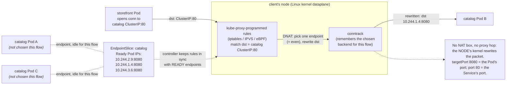

# 02 — Services

> A Service is a **stable name + virtual IP** in front of a churning set of Pod
> IPs. The four types (ClusterIP/NodePort/LoadBalancer/ExternalName),
> Endpoints vs. EndpointSlices, how kube-proxy turns a ClusterIP into a real
> DNAT (iptables vs. IPVS vs. eBPF), headless Services, session affinity, and
> `externalTrafficPolicy` — applied by wiring every Bookstore tier with
> ClusterIP Services.

**Estimated time:** ~15 min read · ~30 min hands-on
**Prerequisites:** [Part 02 ch.01](01-networking-model.md) — the IP-per-Pod fabric · [Part 01 ch.04](../01-core-workloads/04-replicasets-and-deployments.md) — the Pods Services front
**You'll know after this:** • choose between ClusterIP, NodePort, LoadBalancer, and ExternalName · • read EndpointSlices and explain how kube-proxy programs DNAT (iptables / IPVS / eBPF) · • configure a headless Service for direct Pod IPs · • use `sessionAffinity` and `externalTrafficPolicy` correctly · • wire every Bookstore tier behind a stable ClusterIP

<!-- tags: networking, services, clusterip, endpointslices, kube-proxy -->

## Why this exists

[ch.01](01-networking-model.md) gave every Pod a routable IP on a flat
network. But Pod IPs are **ephemeral**: a rollout
([Part 01 ch.04](../01-core-workloads/04-replicasets-and-deployments.md))
replaces every `catalog` Pod with new ones on new IPs; the HPA
([Part 06 ch.04](../06-production-readiness/04-autoscaling.md)) adds and removes
them; a crash reschedules one elsewhere. If `storefront` hardcoded a `catalog`
Pod IP it would break on the next deploy — and there are *several* catalog
Pods; which one?

A **Service** is the answer to both problems at once: a **stable virtual IP and
DNS name** that **load-balances** across the *current set of Ready Pods*
selected by label. The set changes constantly; the Service's identity does not.
This is the [Service Discovery](#further-reading) pattern, and it is the layer
that finally makes the Bookstore a connected system: `storefront → catalog`,
`storefront → orders`, `catalog → postgres`, `orders → rabbitmq` all become
*stable names*, not moving targets.

## Mental model

A Service is **a stable front door with an always-current address book**.

- The **front door** is a `ClusterIP` — a virtual IP that never changes for the
  Service's lifetime, plus a DNS name ([ch.03](03-dns-and-discovery.md)).
  Clients only ever know the door.
- The **address book** is the set of **endpoints**: the IP:port of every Pod
  that (a) matches the Service's label `selector` and (b) is **Ready** (passes
  its readiness probe, [Part 01 ch.02](../01-core-workloads/02-health-and-lifecycle.md)).
  A controller keeps it continuously in sync as Pods come and go.
- **kube-proxy** ([Part 00 ch.05](../00-foundations/05-node-components.md)) is
  the doorman on every node: it programs the kernel so a packet *to the front
  door* is rewritten (**DNAT**) to *one of the current address-book entries*.
  It is **not** a proxy process in the data path for ClusterIP — it configures
  iptables/IPVS/eBPF and the kernel does the forwarding.

So: you talk to a name that never moves; Kubernetes keeps the name pointing at
exactly the healthy Pods, and rewrites your packets to land on one. The Service
**is the decoupling** between "who I call" and "which Pod answers".

## Diagrams

### client → Service → kube-proxy DNAT → Pod (Mermaid)



### Service types ladder (ASCII)

```
 reachability ladder — each type ADDS exposure on top of the previous
 ───────────────────────────────────────────────────────────────────────
 ExternalName  : DNS CNAME → external host   (NO proxy, NO selector)
                 e.g. db.bookstore.svc → my-rds.amazonaws.com

 ClusterIP     : stable virtual IP, IN-CLUSTER only            ◄ default
   └─ catalog / storefront / orders / redis / rabbitmq (Bookstore)

 NodePort      : ClusterIP  +  <NodeIP>:3xxxx on EVERY node
   └─ external reachable via any node IP (basic/manual exposure)

 LoadBalancer  : NodePort   +  a real external LB (cloud provisions it)
   └─ ClusterIP ⊂ NodePort ⊂ LoadBalancer  (superset adds, never replaces)

 headless (clusterIP: None): NO VIP at all → DNS returns the Pod IPs
   └─ used by the postgres StatefulSet (per-Pod stable DNS, ch.01 ch.03)
```

## Hands-on with the Bookstore

**Assumed working directory: the guide repo root (`full-guide/`).** Requires
the `bookstore` namespace and the catalog + storefront Deployments
([Part 01 ch.04](../01-core-workloads/04-replicasets-and-deployments.md)). This
chapter also adds the **orders** Deployment and minimal **redis** / **rabbitmq**
so every addressable tier has a real backend to put a Service in front of.

> **Scaffolding decision — redis & rabbitmq.** They are referenced in the
> Bookstore narrative but were not yet manifested. Part 02 needs them as
> concrete **Service/DNS/policy targets**, so this chapter adds deliberately
> minimal Deployments — `12-redis.yaml` (official `redis:7`) and
> `13-rabbitmq.yaml` (`rabbitmq:3.13-management`), no persistence/auth. They
> are **networking scaffolding only**; durable storage/config is
> [Part 03](../03-config-and-storage/01-configmaps.md), HA is
> [Part 03 ch.05](../03-config-and-storage/05-stateful-data-patterns.md). The
> Go services degrade gracefully with `REDIS_ADDR`/`AMQP_URL` unset (see
> [`app/catalog/main.go`](../examples/bookstore/app/catalog/main.go)), so this
> is wiring, not a hard dependency yet.

### 1. The backends these Services will select

New files (minimal, official images — pulled from the registry, **no
`kind load`**):
[`12-redis.yaml`](../examples/bookstore/raw-manifests/12-redis.yaml),
[`13-rabbitmq.yaml`](../examples/bookstore/raw-manifests/13-rabbitmq.yaml),
and the orders API
[`14-orders-deploy.yaml`](../examples/bookstore/raw-manifests/14-orders-deploy.yaml)
(same shape as `10-catalog-deploy.yaml`: probes from
[ch.02](../01-core-workloads/02-health-and-lifecycle.md), resources from
[ch.03](../01-core-workloads/03-resources-and-qos.md), native `preStop` sleep
because the image is distroless — no shell).

```sh
# from the repo root (full-guide/)
kubectl apply -f examples/bookstore/raw-manifests/12-redis.yaml
kubectl apply -f examples/bookstore/raw-manifests/13-rabbitmq.yaml
# orders (like catalog) carries DB_DSN, so it needs Postgres + the schema Job.
# These were brought up in ch.04's prerequisite chain; re-applying is harmless
# (idempotent) and keeps this chapter runnable on its own. orders' /readyz only
# goes Ready once the schema exists — gate on the migrate Job completing.
kubectl apply -f examples/bookstore/raw-manifests/16-db-credentials.yaml
kubectl apply -f examples/bookstore/raw-manifests/20-postgres-statefulset.yaml
kubectl rollout status statefulset/postgres -n bookstore
kubectl apply -f examples/bookstore/raw-manifests/21-db-migrate-job.yaml   # schema
kubectl wait --for=condition=complete job/db-migrate -n bookstore --timeout=120s
kubectl apply -f examples/bookstore/raw-manifests/14-orders-deploy.yaml   # needs bookstore/orders:dev loaded
kubectl get deploy -n bookstore
```

### 2. A ClusterIP Service per tier

New file
[`40-services.yaml`](../examples/bookstore/raw-manifests/40-services.yaml) —
five ClusterIP Services. Each `selector` is a **subset of the target
Deployment's pod-template labels** (`app: catalog` matches the
`10-catalog-deploy.yaml` pods, etc.). The inline catalog Service:

```yaml
apiVersion: v1
kind: Service
metadata:
  name: catalog
  namespace: bookstore
  labels: { app: catalog, app.kubernetes.io/part-of: bookstore }
spec:
  type: ClusterIP            # default; in-cluster virtual IP only
  selector:
    app: catalog             # subset of 10-catalog-deploy pod labels
  ports:
    - name: http
      port: 80               # the STABLE Service port (catalog.bookstore:80)
      targetPort: http       # → the container's NAMED port (8080)
```

(`storefront`, `orders`, `redis`, `rabbitmq` follow the same pattern in the
file; `rabbitmq` additionally exposes `15672` for its management UI.)

> **Coexistence with the canary Service.** [Part 01
> ch.08](../01-core-workloads/08-deployment-strategies.md)'s
> `30-catalog-canary.yaml` *also* defines a Service named `catalog` in
> `bookstore` (the manual-canary teaching variant). This `40-services.yaml`
> defines the **canonical** `catalog` Service for the canonical
> `10-catalog-deploy.yaml`. They share the same name+namespace and **both
> select `app: catalog`**, so they are *compatible* (a whole-directory apply is
> last-write-wins on an identical object; the selector is the same either way).
> They pair with **mutually exclusive backends**: run *either* the canonical
> catalog (`10-` + `40-`) *or* the canary stack (`30-`), never both — exactly
> the lineage rule from ch.08. A whole-dir dry-run is valid in both cases.

```sh
# from the repo root (full-guide/)
kubectl apply -f examples/bookstore/raw-manifests/40-services.yaml
kubectl get svc -n bookstore
#   each gets a CLUSTER-IP (stable VIP) and (no type:) is ClusterIP.

# The "address book": endpoints are the READY Pods the selector matched.
kubectl get endpointslices -n bookstore -l kubernetes.io/service-name=catalog -o wide
#   ≈3 endpoint IP:8080 (one per Ready catalog Pod). Scale catalog and re-run:
kubectl scale deploy/catalog -n bookstore --replicas=4
kubectl get endpointslices -n bookstore -l kubernetes.io/service-name=catalog -o wide
#   the slice now lists ~4 — the controller tracks Ready Pods automatically.
kubectl scale deploy/catalog -n bookstore --replicas=3   # reset
```

### 3. The Service is a stable front door (prove the decoupling)

`catalog` is distroless (no shell) — use an **ephemeral public-image** Pod, not
`kubectl exec` into catalog:

```sh
# Resolve + call the Service by name (DNS is ch.03; it already works).
# ns bookstore is PSA `restricted` — the ad-hoc pod MUST carry a restricted
# securityContext via --overrides (command goes in the override) or PSA rejects:
kubectl run -n bookstore tmp-curl --rm -i --restart=Never \
  --image=curlimages/curl:8.9.1 \
  --overrides='{"apiVersion":"v1","spec":{"securityContext":{"runAsNonRoot":true,"runAsUser":65532,"seccompProfile":{"type":"RuntimeDefault"}},"containers":[{"name":"tmp-curl","image":"curlimages/curl:8.9.1","securityContext":{"allowPrivilegeEscalation":false,"capabilities":{"drop":["ALL"]},"readOnlyRootFilesystem":true},"command":["sh","-c","for i in $(seq 1 6); do curl -s http://catalog.bookstore.svc.cluster.local/books | head -c 60; echo; done"]}]}}'
#   every call succeeds; requests spread across the catalog Pods (≈ evenly).

# Now roll catalog — Pod IPs all change — and call again. SAME Service IP/name.
kubectl rollout restart deploy/catalog -n bookstore
kubectl rollout status  deploy/catalog -n bookstore
kubectl run -n bookstore tmp-curl --rm -i --restart=Never \
  --image=curlimages/curl:8.9.1 \
  --overrides='{"apiVersion":"v1","spec":{"securityContext":{"runAsNonRoot":true,"runAsUser":65532,"seccompProfile":{"type":"RuntimeDefault"}},"containers":[{"name":"tmp-curl","image":"curlimages/curl:8.9.1","securityContext":{"allowPrivilegeEscalation":false,"capabilities":{"drop":["ALL"]},"readOnlyRootFilesystem":true},"command":["curl","-s","http://catalog.bookstore.svc.cluster.local/healthz"]}]}}'
#   still {"status":"ok"} — the endpoint set was rebuilt under the SAME front
#   door. THIS is why nothing in the app hardcodes Pod IPs.
```

### 4. Headless is different — recall postgres

The postgres StatefulSet's Service
([`20-postgres-statefulset.yaml`](../examples/bookstore/raw-manifests/20-postgres-statefulset.yaml))
is `clusterIP: None` (**headless**): no VIP, DNS returns the Pod IP(s) directly,
giving the per-ordinal names `postgres-0.postgres.bookstore.svc.cluster.local`
([Part 01 ch.05](../01-core-workloads/05-statefulsets.md)). catalog/storefront
want **one VIP that load-balances** (ClusterIP); postgres wants **stable
per-Pod identity** (headless). Same API object, opposite goals.

> **Lineage note.** `40-services.yaml` is the canonical Services layer for the
> Bookstore from here on. [ch.03](03-dns-and-discovery.md) shows how these
> names *resolve*; [ch.04](04-ingress.md) (`50-ingress.yaml`) /
> [ch.05](05-gateway-api.md) (`51-gateway.yaml`) put an **external** entrypoint
> in front of the `storefront`/`catalog`/`orders` Services;
> [ch.06](06-network-policies.md) (`60-networkpolicy.yaml`) restricts which Pod
> may reach which Service. The `postgres` headless Service stays as defined in
> ch.05 (not duplicated here).

## How it works under the hood

### Endpoints vs. EndpointSlices (why slices)

When you create a Service with a `selector`, the **EndpointSlice controller**
([Part 00 ch.04](../00-foundations/04-control-plane-deep-dive.md)) watches Pods
matching it and maintains the backing address list. Historically this was a
single **Endpoints** object per Service — one object listing *every* endpoint.
At scale that object is huge and **every Pod change rewrites and re-pushes the
whole thing to every node's kube-proxy** — an O(N) churn storm.

**EndpointSlices** (default and the norm on **v1.30+**) shard that list into
small slices (≤100 endpoints each by default). A Pod change rewrites only its
*slice*, dramatically less churn and watch traffic; slices also carry richer
per-endpoint info (topology zone, per-endpoint conditions
`ready`/`serving`/`terminating`) enabling **topology-aware routing**. The
legacy `Endpoints` object still exists for compatibility but EndpointSlices are
the real mechanism — `kubectl get endpointslices -n <NS> -l kubernetes.io/service-name=<SVC>` is the truth.

### kube-proxy modes: iptables vs. IPVS vs. eBPF

kube-proxy ([Part 00 ch.05](../00-foundations/05-node-components.md)) watches
Services + EndpointSlices and programs the node so the ClusterIP works. It is
**not in the data path** for ClusterIP — it writes kernel rules; the kernel
forwards:

- **iptables (default).** Per Service, a chain that **DNATs** the ClusterIP:port
  to a randomly chosen endpoint, with a probability rule per endpoint for
  rough even spread. **conntrack** then pins that flow to the chosen backend
  (so every packet of one connection goes to the same Pod). Simple, ubiquitous;
  rule evaluation is ~linear, so very large Services (tens of thousands of
  endpoints) get slower to *program* and match.
- **IPVS.** Uses the kernel's L4 load balancer (hash tables, O(1) lookup) with
  real algorithms (round-robin, least-conn, etc.). Scales to many thousands of
  Services far better; still conntrack-backed.
- **eBPF (CNI replacement).** Cilium (or Calico eBPF) **replaces kube-proxy
  entirely**: an eBPF program does the Service load-balancing/DNAT in the
  kernel fast path — best performance and integrates with policy/observability.

The data path in all cases: client → dst=ClusterIP:port → kernel matches the
kube-proxy-programmed rule → **DNAT** to `endpointIP:targetPort` → conntrack
records the choice → reply is un-DNATed transparently. No extra hop.

### port vs. targetPort vs. nodePort

- **`port`** — the port the **Service** listens on (what clients use:
  `catalog.bookstore:80`).
- **`targetPort`** — the **Pod/container** port traffic is DNAT'd *to*. Best
  practice (used throughout the Bookstore): a **named** port (`targetPort: http`)
  so the container can change its number without editing the Service.
- **`nodePort`** — only for `type: NodePort`/`LoadBalancer`: a port in
  `30000–32767` opened on **every node** that forwards into the Service.

### Service types — what each adds

- **ClusterIP** (default) — virtual IP reachable **only inside** the cluster.
  All five Bookstore app Services. External access is the job of
  [ch.04](04-ingress.md)/[ch.05](05-gateway-api.md), *not* by switching type.
- **NodePort** — ClusterIP **plus** `<NodeIP>:<nodePort>` on every node.
  External, but raw (you manage node IPs/ports). The substrate Ingress sits on.
- **LoadBalancer** — NodePort **plus** the cloud provisions a **real external
  LB** (via the cloud-controller-manager,
  [Part 00 ch.03](../00-foundations/03-architecture-overview.md)) targeting the
  NodePort. On bare `kind` there is no cloud LB so it stays `<pending>` (use
  `port-forward`/NodePort, or MetalLB) — a key local-vs-cloud difference.
- **ExternalName** — **no selector, no proxy, no VIP**: DNS returns a **CNAME**
  to an external host. Used to give an out-of-cluster dependency (e.g. a
  managed RDS) a stable in-cluster name.

### Headless, sessionAffinity, externalTrafficPolicy

- **Headless (`clusterIP: None`)** — no VIP allocated; DNS for the Service
  returns the **Pod IPs** directly (and, with a StatefulSet, per-Pod names).
  For client-side LB / discovery / StatefulSets
  ([Part 01 ch.05](../01-core-workloads/05-statefulsets.md)).
- **`sessionAffinity: ClientIP`** — sticky by source IP (a `timeoutSeconds`
  bounds it) instead of per-connection spread. Coarse stickiness (clients
  behind one NAT pin together); real session affinity is usually L7
  ([ch.04](04-ingress.md)).
- **`externalTrafficPolicy`** (NodePort/LoadBalancer) — `Cluster` (default):
  external traffic may be **SNAT'd and hop** node→node to any endpoint
  (even spread, but **client source IP lost**). `Local`: only deliver to
  endpoints **on the receiving node** (no extra hop, **preserves client IP**,
  enables real LB health-checking) — but skews load if Pods aren't evenly
  spread. `internalTrafficPolicy` is the in-cluster analogue.

### What a Service is *not*

A Service is **not a service mesh**: no retries, mTLS, circuit-breaking,
per-request weighting, or L7 routing. It is L3/L4 stable-VIP load-balancing.
L7 concerns are Ingress/Gateway ([ch.04](04-ingress.md)/[ch.05](05-gateway-api.md))
or a mesh (explicitly out of scope for this guide — introduced conceptually
only here and in [Part 07 ch.05](../07-delivery/05-progressive-delivery.md)).

## Production notes

> **In production:** prefer **named `targetPort`s** (the Bookstore convention)
> so containers can change ports without editing every Service. Keep `port`
> stable — clients depend on it.

> **In production:** trustworthy **readiness probes are load-balancing
> correctness**, not just rollout safety
> ([Part 01 ch.02](../01-core-workloads/02-health-and-lifecycle.md)). An
> endpoint is in the Service set **iff Ready**. A lying readiness probe sends
> traffic to a Pod that can't serve; a missing one routes to Pods during
> startup. The probe *is* the in/out switch.

> **In production:** choose the kube-proxy mode for scale. **iptables** is fine
> for most clusters; at **thousands of Services/endpoints** move to **IPVS**
> or an **eBPF** dataplane (Cilium) — iptables rule programming/matching
> becomes a measurable latency and control-plane cost
> ([Part 00 ch.05](../00-foundations/05-node-components.md)).

> **In production:** `externalTrafficPolicy: Local` when you **need the real
> client IP** (audit, geo, rate-limit, WAF) or want the cloud LB to health-check
> only nodes with endpoints — but pair it with **even Pod spread**
> ([Part 04 ch.02](../04-scheduling/02-affinity-taints-topology.md)) or some
> nodes get all the traffic. `Cluster` spreads evenly but **SNATs away the
> client IP**.

> **In production (EKS/GKE/AKS):** `type: LoadBalancer` provisions (and
> **bills for**) one cloud LB **per Service** — don't expose many that way.
> Put one LB in front of an **Ingress/Gateway** controller and route many
> Services through it at L7 ([ch.04](04-ingress.md)/[ch.05](05-gateway-api.md)).
> Annotations select NLB vs ALB / internal vs internet-facing / health checks —
> provider-specific. Bare `kind` has **no** cloud LB (stays `<pending>`).

> **In production:** for in-cluster traffic, **topology-aware routing**
> (EndpointSlice hints, v1.30+) and `internalTrafficPolicy: Local` keep traffic
> **in-zone** to cut cross-AZ latency and **cross-AZ data-transfer cost** — but
> validate it doesn't create hot spots when a zone is light on replicas.

## Quick Reference

```sh
kubectl get svc -n <NS>                                  # types + ClusterIPs
kubectl get endpointslices -n <NS> \
  -l kubernetes.io/service-name=<SVC> -o wide            # the real backends
kubectl describe svc <SVC> -n <NS>                       # selector, ports, endpoints
kubectl get svc <SVC> -n <NS> \
  -o jsonpath='{.spec.clusterIP}{"\n"}'                  # the stable VIP
# expose for a quick local test WITHOUT changing Service type (ch.04 alt):
kubectl port-forward -n <NS> svc/<SVC> 8080:80
# debug from an EPHEMERAL public image (NEVER exec a distroless app Pod):
kubectl run tmp --rm -it --restart=Never --image=curlimages/curl:8.9.1 -- \
  curl -s http://<SVC>.<NS>.svc.cluster.local:<PORT>/<PATH>
kubectl -n kube-system get ds kube-proxy                 # kube-proxy (mode in its cm)
```

Minimal ClusterIP Service skeleton:

```yaml
apiVersion: v1
kind: Service
metadata: { name: <APP>, namespace: <NS>, labels: { app: <APP> } }
spec:
  type: ClusterIP                  # default; omittable
  selector: { app: <APP> }         # subset of the target Pods' labels
  ports:
    - name: http
      port: 80                     # stable Service port (clients use this)
      targetPort: http             # container's named port (e.g. 8080)
# headless variant: spec.clusterIP: None  (DNS → Pod IPs; StatefulSets)
```

Checklist:

- [ ] `selector` is a subset of the target workload's **pod-template** labels
- [ ] `targetPort` uses the container's **named** port (number can change)
- [ ] Readiness probe trustworthy (it gates endpoint membership)
- [ ] Type chosen deliberately (ClusterIP default; LB only via Ingress at edge)
- [ ] Headless **iff** you need per-Pod DNS / client-side LB (StatefulSets)
- [ ] `externalTrafficPolicy: Local` only with even Pod spread; know the IP/SNAT trade-off
- [ ] kube-proxy mode (iptables/IPVS/eBPF) fits the cluster's Service scale

## Test your understanding

> Try each before opening the answer drawer. The act of trying is the exercise; the answer is the check.

1. **A teammate believes kube-proxy is "the load balancer" in the data path for ClusterIP traffic. Why is this wrong, and what's actually doing the forwarding?**
   <details><summary>Show answer</summary>

   kube-proxy is a *controller* that programs iptables/IPVS/eBPF rules on each node based on Services and EndpointSlices; the **kernel** does the per-packet DNAT and forwarding. For a ClusterIP, no userspace proxy sits in the data path — a packet to `ClusterIP:port` hits the kernel rule, gets DNAT'd to a chosen endpoint IP:port, and conntrack pins the flow. This is why ClusterIP has near-zero per-hop overhead (see §Mental model and §kube-proxy modes).

   </details>

2. **You scale `catalog` from 3 to 10 replicas. Within ~1 second, traffic spreads across all 10. Walk through which controllers and components made this happen.**
   <details><summary>Show answer</summary>

   (1) Deployment controller creates 7 new Pods. (2) kubelet starts them; readiness probe passes (they're Ready). (3) EndpointSlice controller, watching Pods matching the Service's selector, adds the 7 new Pod IPs to the EndpointSlice(s). (4) Every node's kube-proxy is watching EndpointSlices, sees the updated set, and rewrites the iptables/IPVS/eBPF rules. (5) The kernel's DNAT now includes the new endpoints, so load balances across all 10. The Service VIP never changed; the address book did (see §Mental model and §How it works under the hood, EndpointSlices).

   </details>

3. **A Service of type `LoadBalancer` stays `<pending>` on a kind cluster. On EKS, the same manifest provisions an LB but you find your team has 30 of them and a surprise cloud bill. Explain both observations.**
   <details><summary>Show answer</summary>

   `kind` has no cloud-controller-manager, so nothing watches Service type=LoadBalancer to allocate an LB — it stays `<pending>` forever. On EKS, the cloud-controller-manager provisions a real cloud LB (NLB/ALB) per Service of type LoadBalancer. Each LB has a fixed monthly charge — 30 Services = 30 LBs. The pattern is one cloud LB for the cluster, fronting an Ingress/Gateway controller that L7-routes to many Services (see §Service types and §Production notes, EKS/GKE/AKS).

   </details>

4. **You set `externalTrafficPolicy: Local` on a NodePort Service to preserve client IPs, but your monitoring shows uneven traffic — some nodes get 5x more requests than others. What's happening and what's the fix?**
   <details><summary>Show answer</summary>

   `Local` only delivers traffic to endpoints *on the receiving node*, with no SNAT/hop. If Pods are unevenly spread across nodes (e.g., one node has 3 catalog Pods, another has 1), the cloud LB still distributes evenly across nodes, but the node with more Pods absorbs proportionally more traffic. Fix: pair `Local` with `topologySpreadConstraints` to spread Pods evenly across nodes (see §Headless, sessionAffinity, externalTrafficPolicy and §Production notes).

   </details>

5. **Hands-on extension: apply `40-services.yaml`, then `kubectl rollout restart deploy/catalog -n bookstore`. From an ephemeral debug Pod, `curl http://catalog.bookstore.svc.cluster.local/healthz` repeatedly during the rollout. What do you observe, and what does it prove?**
   <details><summary>What you should see</summary>

   Every call succeeds, even though every catalog Pod IP changes during the rollout. The Service VIP and DNS name are stable; the EndpointSlice controller continuously removes terminating Pods (failing readiness) and adds new Ready ones. kube-proxy keeps node rules in sync. This proves the decoupling: clients never need to know Pod IPs, and rollouts cause zero observable interruption *iff* readiness probes are honest about when a Pod can serve (see §3. The Service is a stable front door).

   </details>

## Further reading

- **Lukša, _Kubernetes in Action_ 2e, ch.11 — "Exposing Pods with Services"**
  — Service types, endpoints, kube-proxy, headless, sessionAffinity.
- **Rosso et al., _Production Kubernetes_, ch.6 — "Service Routing"** —
  kube-proxy dataplanes and routing at production scale; **Ibryam & Huß,
  _Kubernetes Patterns_ 2e, ch.13 — _Service Discovery_** — the pattern.
- Official: <https://kubernetes.io/docs/concepts/services-networking/service/>
  ("Service") and
  <https://kubernetes.io/docs/concepts/services-networking/endpoint-slices/>
  ("EndpointSlices").
