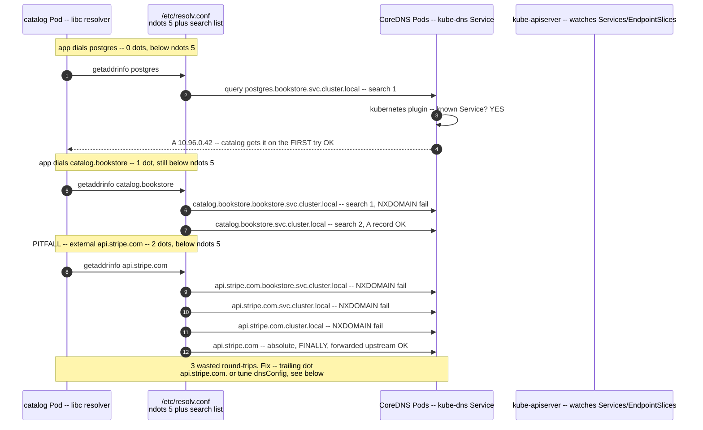

# 03 — DNS and service discovery

> How a name like `postgres.bookstore.svc.cluster.local` becomes an IP:
> CoreDNS and its Corefile, the A/AAAA/SRV records for Services and headless
> Pods, the `pod-ip.ns.pod` form, DNSPolicy, and the `ndots:5` +
> search-domain latency pitfall (and the FQDN / `dnsConfig` fixes) — applied by
> wiring the Bookstore tiers to each other by DNS name.

**Estimated time:** ~15 min read · ~30 min hands-on
**Prerequisites:** [Part 02 ch.02](02-services.md) — Services that DNS names point at
**You'll know after this:** • trace how `service.ns.svc.cluster.local` resolves through CoreDNS · • read a Corefile and the records served for Services and headless Pods · • set `dnsPolicy` (`ClusterFirst`, `ClusterFirstWithHostNet`, `None`) appropriately · • diagnose and fix the `ndots:5` + search-domain DNS-latency pitfall · • configure `dnsConfig` for FQDN lookups and custom resolvers

<!-- tags: networking, dns, coredns, service-discovery, dnspolicy -->

## Why this exists

[ch.02](02-services.md) gave the Bookstore stable virtual IPs. But nothing
should hardcode a `ClusterIP` either — it's assigned at Service creation and
differs per cluster/namespace. What `catalog` actually needs in its config is
**`postgres.bookstore.svc.cluster.local`**, resolved at runtime to whatever the
current ClusterIP is. That resolution — turning **names into IPs inside the
cluster** — is **cluster DNS**, and it is the final piece that makes service
discovery *usable* (not just *possible*).

It is also where a notorious, silent performance problem lives: the
`ndots:5`-plus-search-domain behavior that turns one DNS lookup into **five
failed lookups** before the right one — invisible until it's your p99. This
chapter completes the [Service Discovery](#further-reading) pattern: ch.02 was
the *mechanism* (VIP+endpoints), this is the *naming* over it.

## Mental model

Cluster DNS is **an in-cluster phone book that updates itself**.

- Every Service automatically gets a **name → ClusterIP** entry the moment it
  exists. No registration code; the DNS server *watches the API* and keeps the
  records current as Services come and go.
- The phone book is **CoreDNS** — itself just Pods + a Service
  (`kube-dns` in `kube-system`). The kubelet injects its address into **every**
  Pod's `/etc/resolv.conf`, so every container resolves cluster names with zero
  app config.
- Names are **hierarchical**: short within a namespace (`postgres`), fully
  qualified across (`postgres.bookstore.svc.cluster.local`). A **search list**
  in `resolv.conf` auto-expands short names — convenient, but the source of the
  `ndots` latency trap below.

So "service discovery" in Kubernetes is mostly: **name your Service, then use
its DNS name**. The system does the registration and keeps it live; your only
real decision is *short vs. fully-qualified name* (and that decision has a
performance edge).

## Diagrams

### Pod → CoreDNS resolution path, with search-domain expansion (Mermaid)



### Record naming scheme (ASCII)

```
 FORM                                                    RESOLVES TO
 ───────────────────────────────────────────────────────────────────────────
 <SVC>.<NS>.svc.cluster.local            A/AAAA          Service ClusterIP
   catalog.bookstore.svc.cluster.local           → 10.96.x.x (load-balanced)

 <SVC>.<NS>.svc.cluster.local            SRV             port+target per named port
   _http._tcp.catalog.bookstore.svc.cluster.local

 headless <SVC>.<NS>.svc.cluster.local   A (multi)       ALL Ready Pod IPs (no VIP)
   postgres.bookstore.svc.cluster.local          → 10.244.* , 10.244.* , ...

 <POD>.<SVC>.<NS>.svc.cluster.local      A   (StatefulSet stable per-Pod name)
   postgres-0.postgres.bookstore.svc.cluster.local → that ordinal's Pod IP

 <POD-IPV4-DASHES>.<NS>.pod.cluster.local A  (any Pod, by IP, rarely used)
   10-244-2-9.bookstore.pod.cluster.local        → 10.244.2.9

 SHORT names (resolv.conf `search` auto-appends, SAME namespace):
   postgres            → postgres.bookstore.svc.cluster.local
   catalog.bookstore   → catalog.bookstore.svc.cluster.local   (cross-ns: add the ns)
```

## Hands-on with the Bookstore

**Assumed working directory: the guide repo root (`full-guide/`).** Requires
the `bookstore` namespace, the catalog/storefront/orders Deployments, the
redis/rabbitmq scaffolding, the Services from
[ch.02](02-services.md) (`40-services.yaml`), and the postgres StatefulSet
([Part 01 ch.05](../01-core-workloads/05-statefulsets.md),
`20-postgres-statefulset.yaml`). **No new manifest** — DNS records are created
*automatically* for the Services you already applied; this chapter shows the
names the Bookstore will be configured with (the actual `DB_DSN`/`REDIS_ADDR`
wiring lands as Secret-backed env in
[Part 03 ch.02](../03-config-and-storage/02-secrets.md)).

### 1. Every Service already has a record

The catalog Service implies catalog's DB target is the **headless postgres**
name and storefront's API target is the **catalog** name — no code, no
registration. Resolve them from a throwaway Pod with a **public** image that
has DNS tools (`catalog`/`orders` are distroless — no `nslookup` —
so **do not** exec into them; use `nicolaka/netshoot`):

```sh
# from the repo root (full-guide/)
# ns bookstore is PSA `restricted` — the ad-hoc pod MUST carry a restricted
# securityContext via --overrides (script goes in the override's command) or
# PSA rejects it:
kubectl run -n bookstore tmp-dns --rm -i --restart=Never \
  --image=nicolaka/netshoot \
  --overrides='{"apiVersion":"v1","spec":{"securityContext":{"runAsNonRoot":true,"runAsUser":65532,"seccompProfile":{"type":"RuntimeDefault"}},"containers":[{"name":"tmp-dns","image":"nicolaka/netshoot","securityContext":{"allowPrivilegeEscalation":false,"capabilities":{"drop":["ALL"]}},"command":["bash","-c","echo \"--- catalog Service (ClusterIP A) ---\"; nslookup catalog.bookstore.svc.cluster.local; echo \"--- orders Service ---\"; nslookup orders.bookstore.svc.cluster.local; echo \"--- headless postgres (ALL Pod IPs) ---\"; nslookup postgres.bookstore.svc.cluster.local; echo \"--- StatefulSet per-Pod name ---\"; nslookup postgres-0.postgres.bookstore.svc.cluster.local; echo \"--- SRV for catalog named port http ---\"; nslookup -type=SRV _http._tcp.catalog.bookstore.svc.cluster.local"]}]}}'
#   catalog/orders → a single ClusterIP. headless postgres → the Pod IP(s)
#   directly (no VIP). postgres-0.postgres → that exact ordinal's Pod.
```

### 2. Short names, the search list, and cross-namespace

```sh
# PSA `restricted` ns — restricted-shaped via --overrides (script in command):
kubectl run -n bookstore tmp-dns --rm -i --restart=Never \
  --image=nicolaka/netshoot \
  --overrides='{"apiVersion":"v1","spec":{"securityContext":{"runAsNonRoot":true,"runAsUser":65532,"seccompProfile":{"type":"RuntimeDefault"}},"containers":[{"name":"tmp-dns","image":"nicolaka/netshoot","securityContext":{"allowPrivilegeEscalation":false,"capabilities":{"drop":["ALL"]}},"command":["bash","-c","echo \"=== resolv.conf (note: search list + options ndots:5) ===\"; cat /etc/resolv.conf; echo \"=== short name works IN-namespace (search expands it) ===\"; getent hosts catalog; echo \"=== cross-namespace needs the ns segment ===\"; getent hosts kube-dns.kube-system"]}]}}'
#   In bookstore, `catalog` ≡ `catalog.bookstore.svc.cluster.local` because the
#   search list appends `bookstore.svc.cluster.local`. From ANOTHER namespace,
#   `catalog` would NOT resolve — you must use `catalog.bookstore` (or the FQDN).
```

This is exactly why the Bookstore configs use **fully-qualified** names
(`postgres.bookstore.svc.cluster.local`): unambiguous regardless of the
caller's namespace, and (with a trailing dot in latency-sensitive clients) it
sidesteps the `ndots` expansion below. The migration Job already uses the FQDN
(`PGHOST: postgres.bookstore.svc.cluster.local` in
[`21-db-migrate-job.yaml`](../examples/bookstore/raw-manifests/21-db-migrate-job.yaml)).

### 3. See (and avoid) the ndots pitfall

```sh
# PSA `restricted` ns — restricted-shaped via --overrides (script in command):
kubectl run -n bookstore tmp-dns --rm -i --restart=Never \
  --image=nicolaka/netshoot \
  --overrides='{"apiVersion":"v1","spec":{"securityContext":{"runAsNonRoot":true,"runAsUser":65532,"seccompProfile":{"type":"RuntimeDefault"}},"containers":[{"name":"tmp-dns","image":"nicolaka/netshoot","securityContext":{"allowPrivilegeEscalation":false,"capabilities":{"drop":["ALL"]}},"command":["bash","-c","echo \"--- BAD: 3-dot external name -> search list tried FIRST (NXDOMAINs) ---\"; timeout 5 dig +search +noall +answer +stats api.github.com | tail -3; echo \"--- GOOD: trailing dot = absolute, ONE query, no search expansion ---\"; timeout 5 dig +noall +answer +stats api.github.com. | tail -3"]}]}}'
#   Without the trailing dot the resolver appends each search domain first
#   (3 failed lookups) before the absolute query. The trailing dot (or a
#   tuned dnsConfig ndots:1) skips straight to the right answer.
```

> **Lineage note.** No manifest is added: cluster DNS records are an emergent
> property of the Services from [ch.02](02-services.md), so the Bookstore's
> service discovery is *already wired* by name. The concrete env that *uses*
> these names (`DB_DSN=postgres://…@postgres.bookstore.svc.cluster.local:5432/…`,
> `REDIS_ADDR=redis.bookstore.svc.cluster.local:6379`,
> `AMQP_URL=amqp://…@rabbitmq.bookstore.svc.cluster.local:5672/`) is injected as
> **Secret/ConfigMap** values in
> [Part 03 ch.02](../03-config-and-storage/02-secrets.md) — this chapter
> establishes the *names*; that chapter plugs them in.

## How it works under the hood

### CoreDNS and the Corefile

Cluster DNS is **CoreDNS**: a Deployment of CoreDNS Pods fronted by the
`kube-system` Service **`kube-dns`** (the name is historical). It is a normal
workload the control plane manages — not a core binary
([Part 00 ch.03](../00-foundations/03-architecture-overview.md)).

CoreDNS is configured by a **Corefile** (a ConfigMap, `coredns` in
`kube-system`) — an ordered plugin chain. A typical cluster zone:

```
.:53 {
    errors
    health
    ready
    kubernetes cluster.local in-addr.arpa ip6.arpa {   # the cluster plugin
        pods insecure
        fallthrough in-addr.arpa ip6.arpa
    }
    prometheus :9153            # CoreDNS metrics (Part 06 ch.01)
    forward . /etc/resolv.conf  # non-cluster names → upstream resolvers
    cache 30                    # cache answers (incl. negative) 30s
    loop
    reload
    loadbalance
}
```

The **`kubernetes` plugin** is the heart: it **watches the API** for Services
and EndpointSlices and answers `*.cluster.local` from live cluster state
(no zone files, no registration). `forward` sends everything else (e.g.
`api.github.com`) to upstream DNS. `cache` (including **negative** caching) is
why a typo or a not-yet-created Service can keep failing for up to the TTL.

### The records CoreDNS serves

- **Service A/AAAA:** `my-svc.my-ns.svc.cluster.local` → the Service
  **ClusterIP**.
- **Service SRV:** `_<PORT-NAME>._<PROTO>.my-svc.my-ns.svc.cluster.local` →
  port + target (per **named** port — another reason the Bookstore names its
  ports).
- **Headless Service A:** `clusterIP: None` → **multiple A records**, one per
  **Ready** backing Pod IP (no VIP). The client picks/round-robins; this is the
  StatefulSet discovery mechanism
  ([Part 01 ch.05](../01-core-workloads/05-statefulsets.md)).
- **StatefulSet per-Pod:** with a headless governing Service,
  `<POD>.<SVC>.<NS>.svc.cluster.local` → that **ordinal's** Pod
  (`postgres-0.postgres.bookstore…`). Stable across reschedule.
- **Pod by IP:** `<IPV4-WITH-DASHES>.<NS>.pod.cluster.local` →
  `10-244-2-9.bookstore.pod.cluster.local` = `10.244.2.9`. Rarely needed
  directly; used by some controllers/headless flows.

### resolv.conf, search domains, and the `ndots:5` trap

The kubelet writes each Pod's `/etc/resolv.conf` (per **DNSPolicy** below).
For a Pod in `bookstore` it is roughly:

```
nameserver 10.96.0.10                                   # the kube-dns ClusterIP
search bookstore.svc.cluster.local svc.cluster.local cluster.local
options ndots:5
```

`ndots:5` means: **if the queried name has fewer than 5 dots, try the `search`
domains *first*** (treat it as relative) before trying it as absolute. Short
in-cluster names (`catalog`, 0 dots) therefore resolve on the **first** search
entry — great. But an external name like `api.github.com` (2 dots, still
`< 5`) gets the search list appended **first**:
`api.github.com.bookstore.svc.cluster.local` (NXDOMAIN) →
`api.github.com.svc.cluster.local` (NXDOMAIN) →
`api.github.com.cluster.local` (NXDOMAIN) → `api.github.com` (finally). That's
**3 wasted round-trips per lookup** (×2 for A and AAAA), a real and *silent*
latency/QPS tax on any Pod making external calls.

Fixes (in order of preference):

1. **Trailing dot** — `api.github.com.` is **absolute**: the resolver skips the
   search list entirely. One query. (Use FQDNs-with-dot for external endpoints
   in latency-sensitive code.)
2. **Per-Pod `dnsConfig`** — override options for that workload:
   ```yaml
   spec:
     dnsConfig:
       options:
         - { name: ndots, value: "1" }   # only ≥1-dot names use search
   ```
   Lowers wasted lookups for Pods that mostly call external/long names.
3. **Use FQDNs internally too** (the Bookstore convention) — fewer surprises
   and namespace-independent.

### DNSPolicy

`spec.dnsPolicy` controls what resolver config a Pod gets:

- **`ClusterFirst`** (default) — cluster DNS first; non-cluster names forwarded
  upstream by CoreDNS. What every Bookstore Pod uses.
- **`ClusterFirstWithHostNet`** — `ClusterFirst` semantics for
  `hostNetwork: true` Pods (which would otherwise inherit the node's resolver
  and lose cluster DNS).
- **`Default`** — inherit the **node's** `/etc/resolv.conf` (no cluster DNS).
- **`None`** — use **only** what you specify in `dnsConfig` (full control).

### Cross-namespace and FQDN

A short name only resolves within the **caller's** namespace (the search list
is the caller's). Cross-namespace **must** qualify: `catalog.bookstore` (search
appends `svc.cluster.local`) or the full
`catalog.bookstore.svc.cluster.local`. There is **no implicit cross-namespace
short name** — this is also a security boundary
([ch.06](06-network-policies.md): DNS resolving a name ≠ being allowed to
*connect* to it).

## Production notes

> **In production:** **CoreDNS is critical-path for nearly every request.**
> Give it **HA** (≥2 replicas, anti-affinity across nodes/zones,
> [Part 04 ch.02](../04-scheduling/02-affinity-taints-topology.md)), a PDB
> ([Part 06 ch.05](../06-production-readiness/05-reliability-and-disruptions.md)),
> and resource headroom. When CoreDNS is degraded, *everything* looks "slow or
> flaky" with no obvious culprit — DNS is the first thing to check in a
> cluster-wide brownout.

> **In production:** the **`ndots:5` tax is real at scale.** Services doing
> many external calls (payment gateways, S3, third-party APIs) multiply every
> request by failed search-list lookups. Mitigate with **FQDN-with-trailing-dot**
> for external hosts, per-workload **`dnsConfig` `ndots:1`**, and consider
> **NodeLocal DNSCache** (a per-node DNS cache that slashes CoreDNS load and
> tail latency and avoids conntrack races on UDP DNS).

> **In production:** **negative caching bites.** Reference a Service before it
> exists (ordering bug, typo) and the NXDOMAIN is cached for the TTL — the
> client keeps failing *after* you fix it until the cache expires. Apply
> dependencies in order ([Part 01 ch.05](../01-core-workloads/05-statefulsets.md)),
> and don't over-lengthen `cache` TTLs.

> **In production:** prefer **FQDNs (and the headless name, not Pod IPs)** in
> all config. Short names break when a workload moves namespace; Pod IPs are
> ephemeral ([ch.01](01-networking-model.md)). The Bookstore standard —
> `<SVC>.<NS>.svc.cluster.local` — is namespace-explicit and portable across
> overlays/Kustomize ([Part 07 ch.02](../07-delivery/02-packaging-kustomize.md)).

> **In production:** scope DNS for **multi-tenancy**. Resolving a name across
> namespaces is allowed even when *connecting* is not — enforce reachability
> with **NetworkPolicy** ([ch.06](06-network-policies.md)), and remember that a
> default-deny egress policy **must explicitly allow DNS** or every name lookup
> in the namespace fails (taught hands-on in ch.06).

## Quick Reference

```sh
kubectl -n kube-system get deploy,svc,cm -l k8s-app=kube-dns   # CoreDNS + Corefile cm
kubectl -n kube-system get configmap coredns -o yaml           # the Corefile
kubectl -n kube-system logs -l k8s-app=kube-dns                # resolution errors
# resolve from an EPHEMERAL public-image Pod (NEVER exec a distroless app Pod):
kubectl run tmp --rm -it --restart=Never --image=nicolaka/netshoot -- \
  bash -c 'cat /etc/resolv.conf; nslookup <SVC>.<NS>.svc.cluster.local'
kubectl run tmp --rm -it --restart=Never --image=nicolaka/netshoot -- \
  nslookup -type=SRV _http._tcp.<SVC>.<NS>.svc.cluster.local
kubectl run tmp --rm -it --restart=Never --image=nicolaka/netshoot -- \
  dig +search +stats <NAME>          # watch the search-list expansion
```

DNS naming + tuning skeleton:

```
Service     :  <SVC>.<NS>.svc.cluster.local            (A → ClusterIP)
Headless    :  <SVC>.<NS>.svc.cluster.local            (A → each Ready Pod IP)
StatefulSet :  <POD>.<SVC>.<NS>.svc.cluster.local      (A → that ordinal)
Cross-ns    :  always qualify (≥ <SVC>.<NS>); no implicit short name
External    :  use a TRAILING DOT "host.example.com."  (skip search list)
```
```yaml
spec:
  dnsPolicy: ClusterFirst          # default; ClusterFirstWithHostNet if hostNetwork
  dnsConfig:
    options: [ { name: ndots, value: "1" } ]   # cut search-list waste
```

Checklist:

- [ ] Config uses **FQDN** Service names, not ClusterIPs or Pod IPs
- [ ] CoreDNS HA: ≥2 replicas, anti-affinity, PDB, resource headroom
- [ ] External hostnames use a trailing dot (or `dnsConfig ndots:1`)
- [ ] NodeLocal DNSCache considered for scale / tail-latency / UDP conntrack
- [ ] Cross-namespace calls fully qualified (short names are caller-ns only)
- [ ] Negative-cache aware (create dependencies before referrers; sane TTLs)
- [ ] default-deny egress (ch.06) explicitly allows DNS (UDP/TCP 53)

## Test your understanding

> Try each before opening the answer drawer. The act of trying is the exercise; the answer is the check.

1. **Walk through why `ndots:5` in `resolv.conf` turns a lookup of `api.stripe.com` into four queries. What's the cheapest fix in application code?**
   <details><summary>Show answer</summary>

   `api.stripe.com` has 2 dots — fewer than 5 — so the resolver tries it as *relative* first, appending each search domain: `.bookstore.svc.cluster.local`, `.svc.cluster.local`, `.cluster.local` (all NXDOMAIN), then finally as absolute `api.stripe.com`. That's 4 queries (8 with AAAA). Cheapest fix: write the hostname with a trailing dot (`api.stripe.com.`) — that signals "absolute", skipping the search list entirely (see §Diagrams, ndots PITFALL).

   </details>

2. **A teammate sees their `Service`-named lookup intermittently returning NXDOMAIN immediately after creating the Service. Why does this happen and what's the right pattern?**
   <details><summary>Show answer</summary>

   CoreDNS's `cache` plugin does **negative caching**: a name that didn't exist when first queried is cached as NXDOMAIN for the TTL (typically 30s). If something queried `redis.bookstore.svc...` before the Service was applied, that NXDOMAIN sticks until the cache expires. Pattern: apply dependencies in order (Services *before* the workloads that resolve them), and keep cache TTLs short enough that order-of-apply bugs heal quickly (see §Production notes, "negative caching bites").

   </details>

3. **In the `bookstore` namespace, you call `nslookup catalog` from a Pod in the `default` namespace and get NXDOMAIN. From a Pod in `bookstore`, it resolves. Why is short-name resolution asymmetric?**
   <details><summary>Show answer</summary>

   Each Pod's `resolv.conf` `search` list starts with *its own* namespace's `svc.cluster.local`. In `bookstore`, `catalog` → `catalog.bookstore.svc...` (match). In `default`, `catalog` → `catalog.default.svc...` (NXDOMAIN); the search list doesn't try `bookstore`. Cross-namespace must qualify: `catalog.bookstore` or the full FQDN. This is also a security boundary — DNS resolving doesn't equal connectivity allowed (see §Cross-namespace and FQDN).

   </details>

4. **You apply a default-deny egress NetworkPolicy in `bookstore` and immediately every Pod's DNS breaks. Why, and what's the missing rule?**
   <details><summary>Show answer</summary>

   Default-deny egress blocks UDP/53 (and TCP/53) to CoreDNS in `kube-system`, so every name lookup fails. The policy must explicitly allow DNS egress: `to: namespaceSelector: { kubernetes.io/metadata.name: kube-system }`, `ports: [{ protocol: UDP, port: 53 }, { protocol: TCP, port: 53 }]`. This is the single most common gotcha when introducing default-deny — DNS is invisible until it isn't (see §Production notes, "default-deny egress explicitly allows DNS").

   </details>

5. **Hands-on extension: from an `nicolaka/netshoot` Pod in `bookstore`, run `dig +search +stats catalog` then `dig +stats catalog.bookstore.svc.cluster.local.`. Compare query counts and latency. What does this prove about FQDN-with-dot in latency-sensitive code?**
   <details><summary>What you should see</summary>

   `catalog` (0 dots) resolves on the first search entry — one query. `catalog.bookstore.svc.cluster.local.` (absolute, trailing dot) also resolves in one query but skips any search-list logic entirely. Now try `api.github.com` vs `api.github.com.` — the bare form runs 3 NXDOMAIN lookups before the success, the dot form is one. For external endpoints hit at high QPS, the dot saves real round-trips per request (see §3. See and avoid the ndots pitfall).

   </details>

## Further reading

- **Lukša, _Kubernetes in Action_ 2e, ch.11 — "Exposing Pods with Services"**
  — the DNS records for Services/headless Services and how discovery works.
- **Ibryam & Huß, _Kubernetes Patterns_ 2e, ch.13 — _Service Discovery_** —
  DNS- vs. API-based discovery and when each applies.
- Official: <https://kubernetes.io/docs/concepts/services-networking/dns-pod-service/>
  ("DNS for Services and Pods") and the CoreDNS docs
  <https://coredns.io/plugins/kubernetes/> (the `kubernetes` plugin).
