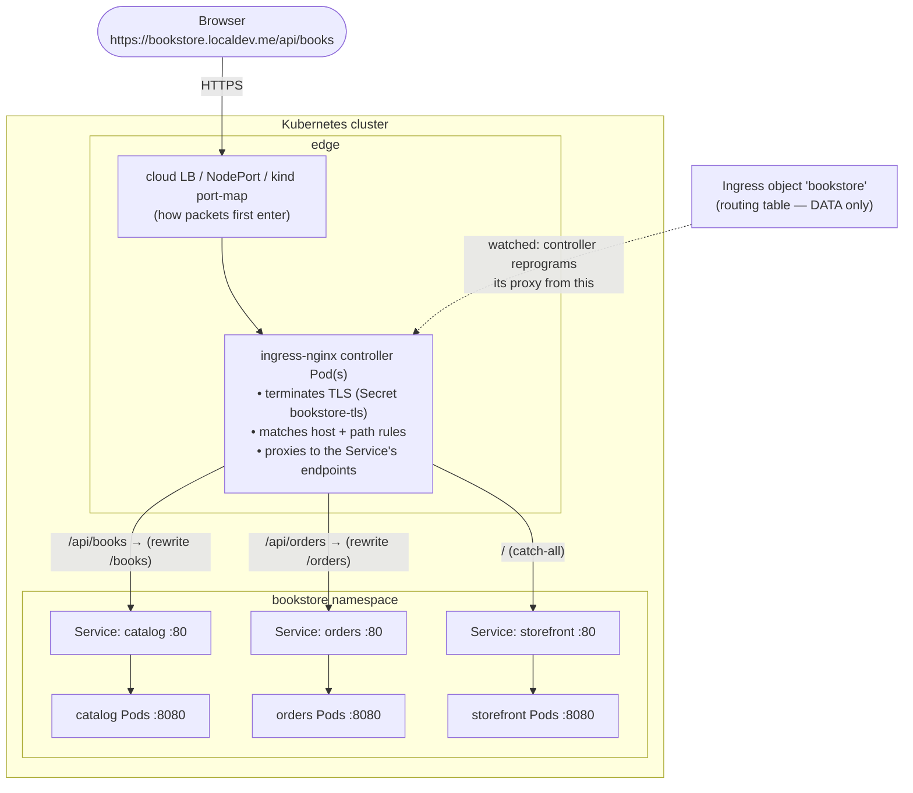

# 04 — Ingress

> One external entrypoint, L7. The **Ingress** resource and **IngressClass**,
> what an **ingress controller** (ingress-nginx) actually does (turn Ingress
> objects into reverse-proxy config), host/path rules and `pathType`, TLS
> termination via a Secret, the default backend — applied by exposing the
> Bookstore UI and APIs through one TLS endpoint.

**Estimated time:** ~15 min read · ~60 min hands-on
**Prerequisites:** [Part 02 ch.02](02-services.md) — the Services Ingress fronts · [Part 02 ch.03](03-dns-and-discovery.md) — name resolution outside the cluster
**You'll know after this:** • distinguish the Ingress resource from the Ingress controller · • configure host/path rules and `pathType` (Exact, Prefix, ImplementationSpecific) · • set up TLS termination using a Secret · • understand what `IngressClass` does and how it routes to controllers · • expose Bookstore through ingress-nginx with one TLS endpoint

<!-- tags: networking, ingress, ingress-nginx, tls, l7 -->

## Why this exists

The Bookstore now talks to itself ([ch.02](02-services.md)/[ch.03](03-dns-and-discovery.md)),
but a `ClusterIP` is **in-cluster only** — a browser cannot reach
`storefront.bookstore.svc.cluster.local`. You could set `type: LoadBalancer` on
every Service, but that's one cloud LB (and bill) **per Service**, no shared
TLS, no path routing, no single hostname. What a real app wants is **one
external address** that does TLS once and **routes by host/path** to many
in-cluster Services: `/` → UI, `/api/books` → catalog, `/api/orders` → orders.

That is **Ingress**: an L7 (HTTP/HTTPS) router into the cluster. It is the
fourth networking problem ([ch.01](01-networking-model.md)) — external →
Service — solved with **HTTP awareness** (hostnames, paths, TLS, redirects)
that an L4 Service cannot express. It is the [Service Routing](#further-reading)
edge layer for the Bookstore.

## Mental model

Ingress is **two things that are easy to confuse**:

1. The **Ingress object** — a *declarative routing table*: "host
   `bookstore.localdev.me`, path `/api/books` → Service `catalog:80`; TLS via
   Secret `bookstore-tls`". It is **pure desired state. It does nothing by
   itself.**
2. The **ingress controller** — a *Pod actually running a reverse proxy*
   (nginx, Envoy, HAProxy…). It **watches Ingress objects** and continuously
   **reprograms its proxy config** to match: vhosts, locations, upstreams
   (the Service endpoints), TLS certs. *This* is what terminates TLS and
   forwards requests.

So Ingress is the **reconciliation loop applied to a reverse proxy**: you
write the routing intent as an object; a controller makes a real proxy match
it. An Ingress with **no controller installed is inert** — the single most
common "my Ingress does nothing" cause. **IngressClass** is the link that says
*which* controller owns a given Ingress (clusters can run several).

## Diagrams

### external request → controller → Service → Pod (Mermaid)



### Host/path routing table (ASCII)

```
 Ingress "bookstore"  (ingressClassName: nginx, TLS host bookstore.localdev.me)
 ─────────────────────────────────────────────────────────────────────────────
   HOST                    PATH            pathType                BACKEND
   bookstore.localdev.me   /api/books...   ImplementationSpecific  catalog:80   (→ /books)
   bookstore.localdev.me   /api/orders...  ImplementationSpecific  orders:80    (→ /orders)
   bookstore.localdev.me   /               Prefix                  storefront:80

   first match wins by controller rules; MOST SPECIFIC path should precede '/'
   no rule matches  ───────────────────────────────────────►  default backend
   TLS: SNI host bookstore.localdev.me → cert+key from Secret 'bookstore-tls'
```

## Hands-on with the Bookstore

**Assumed working directory: the guide repo root (`full-guide/`).** Requires
the `bookstore` namespace, the Services from [ch.02](02-services.md)
(`40-services.yaml`) and their backing Deployments
(`10-catalog-deploy.yaml`, `11-storefront-deploy.yaml`,
`14-orders-deploy.yaml`).

### 1. Install an ingress controller (an Ingress object alone does nothing)

ingress-nginx ships official public manifests. On **kind**, the controller
needs a way for outside traffic to reach it; the project provides a
kind-specific manifest, and a kind cluster created with `extraPortMappings`
(80/443) makes `localhost` reach it. If your kind cluster has no port mappings,
use the `kubectl port-forward` alternative shown below instead.

```sh
# Public ingress-nginx manifest tuned for kind (pinned tag; check the project
# for the current release). This installs the controller into ns ingress-nginx.
kubectl apply -f \
  https://raw.githubusercontent.com/kubernetes/ingress-nginx/controller-v1.11.2/deploy/static/provider/kind/deploy.yaml

kubectl -n ingress-nginx rollout status deploy/ingress-nginx-controller --timeout=180s
kubectl get ingressclass        # an IngressClass named "nginx" now exists
```

### 2. A TLS Secret (terminate HTTPS at the edge)

Self-signed cert for the local hostname (`*.localdev.me` resolves to
`127.0.0.1`, ideal for kind). In production this is cert-manager/ACME, not
`openssl` (production note below):

```sh
# generated in a temp dir; nothing machine-specific is committed
openssl req -x509 -nodes -days 365 -newkey rsa:2048 \
  -keyout /tmp/tls.key -out /tmp/tls.crt \
  -subj "/CN=bookstore.localdev.me" \
  -addext "subjectAltName=DNS:bookstore.localdev.me"

kubectl create secret tls bookstore-tls -n bookstore \
  --cert=/tmp/tls.crt --key=/tmp/tls.key
```

### 3. The Ingress object

New file
[`50-ingress.yaml`](../examples/bookstore/raw-manifests/50-ingress.yaml).
`/api/books` and `/api/orders` are **rewritten** to the routes the apps
actually serve (catalog serves `/books`, not `/api/books` — see
[`app/catalog/main.go`](../examples/bookstore/app/catalog/main.go)); `/` is the
catch-all to the UI. Core of the file:

```yaml
apiVersion: networking.k8s.io/v1
kind: Ingress
metadata:
  name: bookstore
  namespace: bookstore
  annotations:
    # ingress-nginx-specific rewrite: strip /api/<SVC> so the backend sees
    # its own route. Annotation-based config is per-controller — NOT portable
    # (the limitation ch.05 / Gateway API addresses with typed filters).
    nginx.ingress.kubernetes.io/rewrite-target: /$2
spec:
  ingressClassName: nginx                 # which controller owns this Ingress
  tls:
    - hosts: [ bookstore.localdev.me ]
      secretName: bookstore-tls           # cert+key terminates TLS here
  rules:
    - host: bookstore.localdev.me
      http:
        paths:
          - path: /api/books(/|$)(.*)
            pathType: ImplementationSpecific   # regex capture (ingress-nginx)
            backend: { service: { name: catalog,    port: { number: 80 } } }
          - path: /api/orders(/|$)(.*)
            pathType: ImplementationSpecific
            backend: { service: { name: orders,     port: { number: 80 } } }
          - path: /
            pathType: Prefix                   # everything else → the UI
            backend: { service: { name: storefront, port: { number: 80 } } }
```

Apply and route real traffic through the single endpoint:

```sh
# from the repo root (full-guide/)
kubectl apply -f examples/bookstore/raw-manifests/50-ingress.yaml
kubectl get ingress -n bookstore        # shows host, class, and ADDRESS once programmed
kubectl describe ingress bookstore -n bookstore   # rules + which controller adopted it

# kind WITH extraPortMappings(80,443): localhost is the edge.
curl -k https://bookstore.localdev.me/healthz          # storefront via "/" rule
curl -k https://bookstore.localdev.me/api/books        # → catalog /books (rewritten)
curl -k -X POST https://bookstore.localdev.me/api/orders \
  -H 'Content-Type: application/json' -d '{"book_id":1,"qty":2}'   # → orders /orders
```

### 4. kind without port mappings — the port-forward alternative

If `localhost` doesn't reach the controller (no `extraPortMappings`), tunnel to
the controller Service and send the hostname via `Host:`/`--resolve` (no
machine-specific values; works anywhere):

```sh
kubectl -n ingress-nginx port-forward svc/ingress-nginx-controller 8443:443 &
curl -k --resolve bookstore.localdev.me:8443:127.0.0.1 \
  https://bookstore.localdev.me:8443/api/books
# stop the tunnel when done:  kill %1
```

> **Lineage note.** `50-ingress.yaml` is the Bookstore's external edge from
> here. It exposes the **existing** `storefront`/`catalog`/`orders` Services
> from [ch.02](02-services.md) — no app change, no Service-type change.
> [ch.05](05-gateway-api.md) re-expresses this exact routing as **Gateway
> API** in `51-gateway.yaml`, a **mutually exclusive alternative** (apply
> `50-` *or* `51-`, never both — explained there).
> [ch.06](06-network-policies.md) (`60-networkpolicy.yaml`) then restricts the
> controller→storefront/catalog/orders edges.

## How it works under the hood

### The Ingress object is data; the controller is the engine

`kubectl apply` of an Ingress just stores a routing table in the API. An
**ingress controller** (a Deployment of proxy Pods) **watches** Ingress,
Service, EndpointSlice, and Secret objects and on every change **regenerates
its reverse-proxy configuration** and hot-reloads it. For **ingress-nginx**:
the controller renders an `nginx.conf` (server blocks per host, `location`
blocks per path, `upstream` = the Service's **endpoint Pod IPs**, `ssl_*` from
the referenced Secret) and reloads nginx. The data path at request time is
**browser → controller proxy → Pod** — the proxy *is* in the path (unlike a
ClusterIP, where kube-proxy only programs the kernel,
[ch.02](02-services.md)). Many controllers (incl. ingress-nginx) proxy to the
**Pod endpoints directly**, not via the Service VIP — so they implement their
own L7 load-balancing/affinity/retries over the EndpointSlice set.

### IngressClass — which controller owns it

A cluster can run several controllers. **IngressClass** (a cluster-scoped
object created by the controller install) names a controller; an Ingress
selects one via `spec.ingressClassName: nginx`. An Ingress with **no class**
is handled only if a controller is marked the **default**
(`ingressclass.kubernetes.io/is-default-class: "true"`), else it's **ignored**
— another classic "Ingress does nothing". (The deprecated
`kubernetes.io/ingress.class` annotation predates IngressClass; on **v1.30+**
use `ingressClassName`.)

### host/path rules and `pathType`

Rules match on **`host`** (virtual host; SNI for TLS) then **`path`**.
`pathType` is required and defines path-matching semantics:

- **`Prefix`** — match by URL path *segments*: `/api` matches `/api` and
  `/api/x`, **not** `/apifoo`. The portable default for prefix routing
  (Bookstore uses it for `/`).
- **`Exact`** — exact string, case-sensitive (e.g. a single `/healthz`).
- **`ImplementationSpecific`** — semantics are the controller's. ingress-nginx
  treats the path as an **nginx regex**, enabling capture groups for
  `rewrite-target` (how the Bookstore strips `/api/<SVC>`). **Powerful but
  controller-specific → not portable.** Precedence among overlapping paths is
  controller-defined; put **most specific paths before `/`** (the Bookstore
  orders the rules that way).

### TLS termination

`spec.tls[]` maps **host(s) → a `kubernetes.io/tls` Secret** (`tls.crt` +
`tls.key`). The controller loads the cert and **terminates HTTPS at the edge**;
the controller→Pod hop is plain HTTP inside the cluster by default (re-encrypt
/ mTLS to the backend is a controller-specific or mesh concern). Wrong/missing
SAN for the host ⇒ the controller serves its **default self-signed "fake"
cert** and clients get cert errors — a frequent first-time stumble.

### Default backend

Requests matching **no** rule (unknown host/path) go to the **default
backend** — a controller-level fallback (often a 404 service) or a per-Ingress
`spec.defaultBackend`. Useful for a branded 404 or a catch-all redirect; absent
one, the controller returns its built-in 404.

### Why a successor exists (segue to ch.05)

Anything beyond host/path (rewrites, canary weights, timeouts, auth, CORS,
header manipulation) is done via **controller-specific annotations** — every
controller spells them differently, so Ingress configs are **not portable** and
the annotation surface is unvalidated string soup. Ingress is also a single
role (no infra/app separation) and HTTP-centric. **Gateway API**
([ch.05](05-gateway-api.md)) is the typed, role-oriented, portable successor —
which is why the Bookstore carries both: `50-ingress.yaml` (this) and the
equivalent `51-gateway.yaml`.

## Production notes

> **In production:** **don't issue certs with `openssl` by hand.** Run
> **cert-manager** with an ACME issuer (Let's Encrypt) or your private CA: it
> provisions and **auto-renews** the TLS Secret the Ingress references. Expired
> certs are a top outage cause; manual certs guarantee one eventually.

> **In production (EKS/GKE/AKS):** the controller is fronted by a **real cloud
> LB**. ingress-nginx → an **NLB/L4** LB to the controller (it does L7);
> alternatively a cloud-native Ingress (**AWS ALB Ingress / GKE Ingress /
> AGIC**) programs the cloud's *own* L7 LB directly from Ingress objects
> (no in-cluster proxy). Each has different annotations, TLS (ACM/Google-managed
> certs), and health-check semantics. Bare **kind has no cloud LB** — use
> `extraPortMappings` or `port-forward` (shown above).

> **In production:** the ingress controller is a **shared, critical chokepoint**
> — *all* north-south traffic. Run it **HA** (multiple replicas, anti-affinity
> across nodes/zones, a PDB,
> [Part 06 ch.05](../06-production-readiness/05-reliability-and-disruptions.md)),
> size it, and watch its latency/error rate/reload time
> ([Part 06 ch.01](../06-production-readiness/01-observability-metrics.md)). It
> is also the natural home for **WAF, rate-limiting, and TLS policy**.

> **In production:** `ImplementationSpecific`/annotation features are
> **controller lock-in**. A rewrite/canary/auth annotation that works on
> ingress-nginx won't on another controller. Prefer **`Prefix`/`Exact`** for
> portable rules; treat heavy annotation use as a signal to evaluate **Gateway
> API** ([ch.05](05-gateway-api.md)). Pin the controller version and test
> upgrades (nginx config-template changes have broken rules between releases).

> **In production:** **terminate-at-edge means cleartext inside** unless you
> re-encrypt. For regulated/zero-trust environments, enable backend TLS/mTLS
> (controller-specific) or a service mesh, and pair the edge with
> **NetworkPolicy** ([ch.06](06-network-policies.md)) so only the controller
> can reach the app Services.

## Quick Reference

```sh
kubectl get ingressclass                                  # installed controllers
kubectl get ingress -n <NS>                               # hosts, class, ADDRESS
kubectl describe ingress <ING> -n <NS>                    # rules + adopting controller + events
kubectl -n <NS-OF-CONTROLLER> get pods,svc                # the controller itself
kubectl -n ingress-nginx logs deploy/ingress-nginx-controller   # routing/TLS errors
kubectl create secret tls <NAME> -n <NS> --cert=tls.crt --key=tls.key
# local test without cloud LB:
kubectl -n ingress-nginx port-forward svc/ingress-nginx-controller 8443:443
curl -k --resolve <HOST>:8443:127.0.0.1 https://<HOST>:8443/<PATH>
```

Minimal Ingress skeleton:

```yaml
apiVersion: networking.k8s.io/v1
kind: Ingress
metadata: { name: <APP>, namespace: <NS> }
spec:
  ingressClassName: nginx                  # MUST match an installed controller
  tls:
    - hosts: [ <HOST> ]
      secretName: <TLS-SECRET>             # kubernetes.io/tls (cert-manager in prod)
  rules:
    - host: <HOST>
      http:
        paths:
          - path: /api                     # most specific FIRST
            pathType: Prefix               # Prefix/Exact = portable
            backend: { service: { name: <SVC>, port: { number: 80 } } }
          - path: /
            pathType: Prefix
            backend: { service: { name: <UI-SVC>, port: { number: 80 } } }
```

Checklist:

- [ ] An ingress **controller is installed** and its **IngressClass** referenced
- [ ] TLS Secret exists with a **SAN matching the host** (cert-manager in prod)
- [ ] Paths use portable **`Prefix`/`Exact`** unless a rewrite truly needs more
- [ ] Most specific paths ordered **before** `/`; default backend considered
- [ ] Controller is **HA** (replicas, anti-affinity, PDB) and monitored
- [ ] Annotation/`ImplementationSpecific` lock-in acknowledged (vs. Gateway API)
- [ ] Only the controller can reach the app Services (NetworkPolicy, ch.06)

## Test your understanding

> Try each before opening the answer drawer. The act of trying is the exercise; the answer is the check.

1. **A teammate applies an Ingress object on a freshly created cluster and is surprised that `curl` to the host returns connection refused. What's the missing piece, and what's the conceptual lesson?**
   <details><summary>Show answer</summary>

   The Ingress *object* is just data — a routing table stored in the API server. Nothing forwards traffic until an **ingress controller** (a Deployment of proxy Pods) is installed; the controller watches Ingress objects and reprograms its reverse-proxy config. Lesson: in Kubernetes, declarative objects describe intent; you need both the object *and* the controller that reconciles it. An Ingress without a controller is inert (see §Mental model).

   </details>

2. **You have two Ingress objects — one with `ingressClassName: nginx` and one without it — in a cluster with both ingress-nginx and traefik installed. What happens to each, and what's the fix to make routing deterministic?**
   <details><summary>Show answer</summary>

   The one with `ingressClassName: nginx` is adopted by ingress-nginx. The one without is adopted by whichever IngressClass is marked default (annotation `ingressclass.kubernetes.io/is-default-class: "true"`) — and if none is, it's silently ignored. Fix: always set `ingressClassName` explicitly on every Ingress in multi-controller clusters; don't rely on the default class (see §IngressClass).

   </details>

3. **Your `pathType: ImplementationSpecific` rule using nginx regex captures works on ingress-nginx but breaks when a teammate evaluates migrating to AWS ALB Ingress. Why, and what's the architectural lesson?**
   <details><summary>Show answer</summary>

   `ImplementationSpecific` means "controller decides what this means" — ingress-nginx treats the path as a regex with capture groups, but ALB Ingress, traefik, or any other controller may not. Annotation-based features (rewrite-target, canary weights, auth) are also per-controller. Lesson: heavy use of ImplementationSpecific/annotations is lock-in. Prefer Prefix/Exact for portable rules; treat annotation sprawl as a signal to evaluate Gateway API (see §`pathType` and §Production notes).

   </details>

4. **Your TLS-enabled Ingress serves a cert error in the browser even though the Secret exists and is referenced. List two common causes.**
   <details><summary>Show answer</summary>

   (1) The Secret's certificate has no SAN matching the Ingress's `host` (`subjectAltName=DNS:bookstore.localdev.me` missing) — the controller falls back to its default self-signed "fake" cert. (2) The Secret is in the wrong namespace; `spec.tls.secretName` resolves in the **Ingress's** namespace only, so a TLS Secret in `default` is invisible to an Ingress in `bookstore`. Check controller logs and `kubectl describe ingress` events (see §TLS termination).

   </details>

5. **Hands-on extension: apply the `50-ingress.yaml`, then `kubectl scale deploy/ingress-nginx-controller -n ingress-nginx --replicas=0`. What happens to in-cluster ClusterIP traffic between `storefront` and `catalog`, and what does this reveal about Ingress's scope?**
   <details><summary>What you should see</summary>

   In-cluster Service-to-Service traffic is unaffected — `storefront` calling `catalog.bookstore.svc...` continues working because that's L4 ClusterIP via kube-proxy, not Ingress. External (browser) requests to `https://bookstore.localdev.me` start failing because the controller proxy is gone. This proves Ingress is specifically the **external→Service** edge (problem #4 from ch.01), not in the cluster data path (see §Mental model and §How it works under the hood).

   </details>

## Further reading

- **Lukša, _Kubernetes in Action_ 2e, ch.12 — "Exposing Services with
  Ingress"** — the Ingress resource, controllers, host/path rules, TLS.
- **Rosso et al., _Production Kubernetes_, ch.6 — "Service Routing"** — ingress
  controllers and edge routing in production (HA, cloud LB integration).
- Official: <https://kubernetes.io/docs/concepts/services-networking/ingress/>
  ("Ingress") and
  <https://kubernetes.io/docs/concepts/services-networking/ingress-controllers/>
  ("Ingress Controllers"); ingress-nginx: <https://kubernetes.github.io/ingress-nginx/>.
