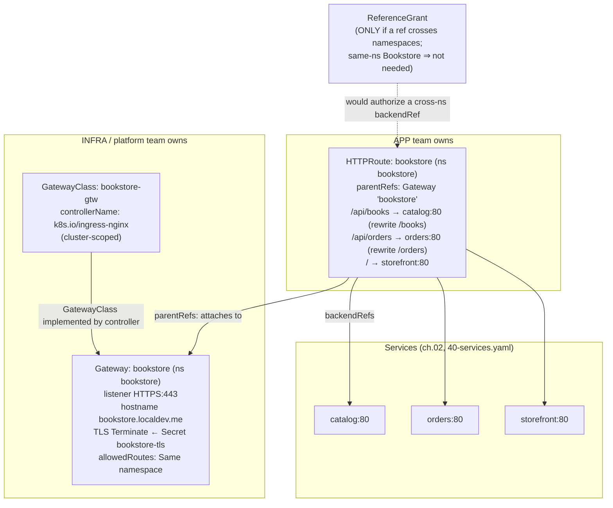

# 05 — Gateway API

> The role-oriented, typed successor to Ingress:
> **GatewayClass → Gateway → HTTPRoute** (+ **ReferenceGrant**), why it
> supersedes Ingress (expressiveness, portability, typed routing,
> multi-protocol, infra/app separation), status conditions, and the
> Ingress→Gateway migration — applied by re-expressing the ch.04 Bookstore
> routing as a Gateway + HTTPRoute alternative.

**Estimated time:** ~15 min read · ~60 min hands-on
**Prerequisites:** [Part 02 ch.04](04-ingress.md) — Ingress, the predecessor it replaces · [Part 02 ch.02](02-services.md) — the backend Services HTTPRoutes target
**You'll know after this:** • differentiate GatewayClass, Gateway, HTTPRoute, and ReferenceGrant roles · • explain why Gateway API supersedes Ingress (typed, multi-protocol, infra/app split) · • read Gateway and HTTPRoute status conditions to diagnose problems · • use `ReferenceGrant` to permit cross-namespace routing · • migrate an Ingress-based setup to Gateway + HTTPRoute

<!-- tags: networking, gateway-api, httproute, referencegrant, l7 -->

## Why this exists

[ch.04](04-ingress.md) exposed the Bookstore, but exposed Ingress's ceilings:
**everything beyond host/path is controller-specific annotation string-soup**
(the Bookstore's `rewrite-target` only works on ingress-nginx), there is **one
role** (no separation between the team that owns the cluster's edge/TLS and the
team that owns *their* service's routes), it is **HTTP-only**, and the
annotation surface is **unvalidated** (typos fail silently at the controller).

**Gateway API** is the project's answer: a set of **typed, portable CRDs** that
expresses routing as first-class spec fields (not annotations), splits the
**infrastructure** concern from the **application** concern, supports
HTTP/TLS/TCP/UDP/gRPC, and reports machine-readable **status conditions**. For
the Bookstore it means the *same* edge routing as `50-ingress.yaml` — but
portable across implementations and split along team lines. This is the
forward-looking [Service Routing](#further-reading) model; **Gateway API v1
(GA)** covers `GatewayClass`, `Gateway`, and `HTTPRoute`.

## Mental model

Gateway API is **Ingress, refactored into three objects owned by two roles**.

- **GatewayClass** (cluster-scoped, *infra*) — "this kind of Gateway is
  implemented by *that* controller". Analogous to a StorageClass / IngressClass.
- **Gateway** (*infra/platform team*) — the actual **entrypoint**: listeners
  (port, protocol, hostname), **TLS termination**, and *which routes may
  attach*. This is the cluster's front door; the platform team owns it.
- **HTTPRoute** (*application team*) — "for host X, path `/api/books` →
  Service `catalog:80`, rewrite to `/books`". It **attaches** to a Gateway via
  `parentRefs`. The app team owns *their* routes without touching the shared
  entrypoint or TLS.
- **ReferenceGrant** (*resource owner*) — explicit, auditable permission for a
  cross-namespace reference (e.g. an HTTPRoute in ns A targeting a Service in
  ns B). Cross-namespace is **deny-by-default**; the grant is opt-in.

So the leap from Ingress is: **one annotated object, one role → typed objects
split by responsibility**, with the routing options (rewrite, weighting,
header matching, timeouts) as **validated spec fields** instead of
stringly-typed annotations. It is CRD-installed — **not built into
Kubernetes** — so the CRDs + a controller must be present first.

## Diagrams

### Object relationships (Mermaid)



### Persona separation (ASCII)

```
                 GATEWAY API ROLE SPLIT (the core idea)
 ─────────────────────────────────────────────────────────────────────────────
  INFRASTRUCTURE PROVIDER  ─ owns ─►  GatewayClass   (which controller)
  PLATFORM / CLUSTER OPS   ─ owns ─►  Gateway        (listeners, TLS, who may attach)
  APPLICATION DEVELOPER    ─ owns ─►  HTTPRoute      (my paths → my Services)
  RESOURCE OWNER           ─ owns ─►  ReferenceGrant (allow a cross-ns reference)

  Ingress (ch.04):  ONE object, ONE role, controller-specific ANNOTATIONS.
  Gateway API:      typed objects, split by responsibility, PORTABLE fields.
  RBAC can now grant app teams HTTPRoute WITHOUT granting edge/TLS control.
```

## Hands-on with the Bookstore

**Assumed working directory: the guide repo root (`full-guide/`).** Requires
the `bookstore` namespace, the Services from [ch.02](02-services.md)
(`40-services.yaml`) and their Deployments, plus a TLS Secret `bookstore-tls`
in `bookstore` (created in [ch.04](04-ingress.md) step 2 — reused as-is).

> **Alternative, not addition — apply 51- OR 50-, never both.**
> [`51-gateway.yaml`](../examples/bookstore/raw-manifests/51-gateway.yaml)
> expresses the **same** external routing as
> [`50-ingress.yaml`](../examples/bookstore/raw-manifests/50-ingress.yaml) via
> a different data plane. Running both binds the same hostname/paths twice.
> Choose one stack: **Ingress** = `40-` + `50-`; **Gateway API** = `40-` +
> `51-`. Both are dry-run valid in isolation and in a whole-directory dry-run
> — a *client* dry-run does **not** detect the runtime hostname overlap, and
> Gateway kinds only map once the CRDs are installed (intrinsic to Gateway API
> being CRD-based). To switch from the ch.04 stack:
> `kubectl delete -f examples/bookstore/raw-manifests/50-ingress.yaml` first.

### 1. Install the Gateway API CRDs + a controller

Gateway API is **not** in core Kubernetes — install the **v1 (GA) CRDs**
(pin a release; check the project for the current tag), then a controller that
implements them (ingress-nginx ships a Gateway implementation; Envoy Gateway,
Cilium, Istio are alternatives — match `controllerName` in `51-gateway.yaml` to
whatever you install):

```sh
# Gateway API v1.1.0 standard channel CRDs
kubectl apply -f \
  https://github.com/kubernetes-sigs/gateway-api/releases/download/v1.1.0/standard-install.yaml

kubectl get crd | grep gateway.networking.k8s.io
#   registers (standard channel, v1.1.0):
#     gatewayclasses, gateways, httproutes, grpcroutes, referencegrants
#   (TLSRoute/TCPRoute/UDPRoute are NOT here — they're the experimental channel)
# + install a Gateway controller per its docs (e.g. ingress-nginx's Gateway
#   implementation, or Envoy Gateway). The controllerName in 51-gateway.yaml's
#   GatewayClass must equal the one your chosen controller advertises.
```

### 2. The Gateway + HTTPRoute (same routing as ch.04, typed)

Core of
[`51-gateway.yaml`](../examples/bookstore/raw-manifests/51-gateway.yaml) — note
the rewrite is a **typed core filter** (`URLRewrite`/`ReplacePrefixMatch`), not
a controller annotation:

```yaml
apiVersion: gateway.networking.k8s.io/v1
kind: GatewayClass                         # INFRA: which controller implements Gateways
metadata: { name: bookstore-gtw }
spec: { controllerName: k8s.io/ingress-nginx }   # match YOUR installed controller
---
apiVersion: gateway.networking.k8s.io/v1
kind: Gateway                              # PLATFORM: the entrypoint + TLS
metadata: { name: bookstore, namespace: bookstore }
spec:
  gatewayClassName: bookstore-gtw
  listeners:
    - name: https
      protocol: HTTPS
      port: 443
      hostname: bookstore.localdev.me
      tls:
        mode: Terminate
        certificateRefs: [ { kind: Secret, name: bookstore-tls } ]   # same Secret as ch.04
      allowedRoutes: { namespaces: { from: Same } }   # only same-ns routes may attach
---
apiVersion: gateway.networking.k8s.io/v1
kind: HTTPRoute                            # APP: my paths → my Services
metadata: { name: bookstore, namespace: bookstore }
spec:
  parentRefs: [ { name: bookstore } ]                 # attach to the Gateway
  hostnames: [ bookstore.localdev.me ]
  rules:
    - matches: [ { path: { type: PathPrefix, value: /api/books } } ]
      filters:
        - type: URLRewrite
          urlRewrite: { path: { type: ReplacePrefixMatch, replacePrefixMatch: /books } }
      backendRefs: [ { name: catalog, port: 80 } ]
    - matches: [ { path: { type: PathPrefix, value: /api/orders } } ]
      filters:
        - type: URLRewrite
          urlRewrite: { path: { type: ReplacePrefixMatch, replacePrefixMatch: /orders } }
      backendRefs: [ { name: orders, port: 80 } ]
    - matches: [ { path: { type: PathPrefix, value: / } } ]
      backendRefs: [ { name: storefront, port: 80 } ]
```

Apply the **Gateway-API stack only** and verify via **status conditions** (a
Gateway-API improvement over Ingress — the object tells you if it's healthy):

```sh
# from the repo root (full-guide/) — ensure 50-ingress.yaml is NOT applied
kubectl apply -f examples/bookstore/raw-manifests/51-gateway.yaml
kubectl get gateway,httproute -n bookstore
kubectl get gateway bookstore -n bookstore \
  -o jsonpath='{.status.conditions[*].type}={.status.conditions[*].status}{"\n"}'
#   expect Accepted=True and Programmed=True once the controller reconciles it
kubectl get httproute bookstore -n bookstore \
  -o jsonpath='{.status.parents[*].conditions[*].type}{"\n"}'   # Accepted/ResolvedRefs

# Same external test as ch.04 (kind: localhost if 443 is port-mapped, else
# port-forward the controller's Service):
curl -k https://bookstore.localdev.me/api/books
```

### 3. Cross-namespace? Then a ReferenceGrant

The Bookstore Gateway, HTTPRoute, and Services are **all in `bookstore`**, so
**no `ReferenceGrant` is needed**. If, say, a shared Gateway lived in an
`edge` namespace and the Bookstore HTTPRoute (in `bookstore`) attached to it,
the **`edge` namespace** would need a `ReferenceGrant` permitting HTTPRoutes
from `bookstore` — cross-namespace is **deny-by-default and explicit** (a
security improvement over Ingress's implicit reach):

```yaml
# illustrative only — not applied for the Bookstore (everything is same-ns)
apiVersion: gateway.networking.k8s.io/v1beta1
kind: ReferenceGrant
metadata: { name: allow-bookstore-routes, namespace: edge }
spec:
  from: [ { group: gateway.networking.k8s.io, kind: HTTPRoute, namespace: bookstore } ]
  to:   [ { group: gateway.networking.k8s.io, kind: Gateway } ]
```

> **Lineage note.** `51-gateway.yaml` is the **Gateway-API alternative** to
> `50-ingress.yaml`; the Bookstore ships both so the guide can teach the
> migration, but a running cluster uses exactly one. [ch.06](06-network-policies.md)
> (`60-networkpolicy.yaml`) restricts the controller→app edges and its rule
> targets the controller's namespace — works the same whether the edge is
> Ingress or Gateway (both run the controller in its own namespace).

## How it works under the hood

### The resource model and attachment

A **controller** advertises a `controllerName`. A **GatewayClass** points at
that name; a **Gateway** references the GatewayClass and declares **listeners**
(protocol/port/hostname/TLS). A **route** (HTTPRoute/TLSRoute/TCPRoute/…)
**attaches** to a Gateway through **`parentRefs`** (optionally a specific
listener via `sectionName`). The controller watches all of these plus the
target Services/EndpointSlices and programs its proxy — same reconciliation
idea as an ingress controller ([ch.04](04-ingress.md)), but the *inputs* are
typed objects split by role. **Route attachment is bidirectionally gated:** the
Gateway's `allowedRoutes` says which routes (by namespace/kind/label) may
attach, and a route must explicitly `parentRef` the Gateway — neither side can
unilaterally bind.

### Why it supersedes Ingress

- **Expressiveness as typed fields:** header/method/query matching, **traffic
  splitting by weight** (native canary — no annotations,
  [Part 07 ch.05](../07-delivery/05-progressive-delivery.md)), request/response
  header modification, **URL rewrite/redirect**, timeouts, mirroring — all
  **schema-validated `spec`**, rejected at apply if malformed (vs. Ingress
  annotations failing silently at the controller).
- **Portability:** the Bookstore's rewrite is the **core `URLRewrite` filter**,
  identical across conformant implementations — unlike
  `nginx.ingress.kubernetes.io/rewrite-target`. Conformance is tested by the
  project, so behavior is consistent.
- **Role-oriented & RBAC-friendly:** infra owns GatewayClass/Gateway; apps own
  routes. RBAC can grant a team **HTTPRoute** in their namespace **without**
  giving them control of the shared edge/TLS — impossible with single-object
  Ingress.
- **Multi-protocol:** **HTTPRoute** and **GRPCRoute** (both GA/standard
  channel), plus **TLSRoute** (passthrough), **TCPRoute**, **UDPRoute**
  (experimental channel) — one model for L4 *and* L7. Ingress is HTTP-only.
- **Observable status:** `Accepted`, `Programmed`, `ResolvedRefs` **conditions**
  on Gateway and per-`parentRef` on routes — you can *query* whether routing is
  healthy instead of reading controller logs.

### Status conditions

Gateway API leans on the standard **`status.conditions`** pattern
([Part 00 ch.06](../00-foundations/06-declarative-api-model.md)). On a Gateway:
**`Accepted`** (config valid/admitted), **`Programmed`** (data plane actually
configured); per listener: **`ResolvedRefs`** (e.g. the TLS Secret resolved).
On an HTTPRoute, per attached parent: **`Accepted`** and **`ResolvedRefs`**
(backends/filters resolved). `ResolvedRefs=False` on a route is the typical
"my backend Service name/port is wrong or cross-ns and ungranted" signal —
self-diagnosing in a way Ingress is not.

### Ingress → Gateway migration

1. Install Gateway API **CRDs + a controller** (CRDs are *not* built in —
   omitting them is the #1 "kinds not found" error, exactly what a client
   dry-run shows without them).
2. **Infra**: create `GatewayClass` + `Gateway` (listeners + TLS — reuse the
   existing TLS Secret, as the Bookstore does).
3. **App**: translate each Ingress rule into **HTTPRoute** rules; replace
   annotation behaviors with **typed filters** (the Bookstore's
   `rewrite-target` → `URLRewrite`/`ReplacePrefixMatch`).
4. Run **in parallel on a test hostname**, verify via **status conditions** +
   real requests, then cut traffic over and **remove the Ingress** (the
   Bookstore keeps both files only as teaching artifacts; never both live).
   Community tooling (e.g. `ingress2gateway`) automates step 3.

## Production notes

> **In production:** Gateway API is **CRD-installed and
> controller-specific-in-practice.** Pin CRD **and** controller versions,
> track the supported channel (**standard** = GA — `v1`
> Gateway/HTTPRoute/GRPCRoute/ReferenceGrant, as installed here from
> `standard-install.yaml`; **experimental** = TLSRoute/TCPRoute/UDPRoute and
> mesh/GAMMA), and test CRD upgrades — a missing or too-old CRD makes every
> `Gateway`/`HTTPRoute` apply fail with `no matches for kind "..."`, so the
> resources can't be registered or reconciled cluster-wide.

> **In production (EKS/GKE/AKS):** managed Gateway implementations exist —
> **GKE Gateway** (Google Cloud Load Balancing), **AWS Gateway API
> controller** (VPC Lattice), Istio/Cilium/Envoy Gateway. The Gateway/HTTPRoute
> **objects are portable**; the **GatewayClass/`controllerName`** and some
> infra-policy extensions are implementation-specific. This portability of the
> *app-facing* objects is the core multi-cloud argument over annotation-bound
> Ingress.

> **In production:** use the **role split as a real security boundary.** RBAC:
> platform team = GatewayClass/Gateway (+TLS Secrets); app teams = HTTPRoute in
> their namespace only. Gate cross-namespace attachment with the Gateway's
> **`allowedRoutes`** *and* **`ReferenceGrant`** so no team can hijack the
> shared edge or reach another namespace's backend unapproved
> ([Part 05 ch.01](../05-security/01-authn-authz-rbac.md)).

> **In production:** **gate on status conditions in automation.** CI/CD and
> GitOps ([Part 07 ch.04](../07-delivery/04-gitops-argocd.md)) should block
> promotion until `Programmed=True` / `ResolvedRefs=True` — a Gateway-API
> capability Ingress lacks; don't waste it by treating apply as success.

> **In production:** Gateway API is the **native home of weighted traffic
> splitting** — progressive delivery without controller-specific canary
> annotations ([Part 07 ch.05](../07-delivery/05-progressive-delivery.md)). If
> you do canaries, this is a strong reason to standardize on Gateway API over
> Ingress.

## Quick Reference

```sh
kubectl get crd | grep gateway.networking.k8s.io          # CRDs installed? (must be)
kubectl get gatewayclass                                   # classes + their controllers
kubectl get gateway,httproute -n <NS>
kubectl describe gateway <GW> -n <NS>                       # listeners + conditions + events
kubectl get gateway <GW> -n <NS> \
  -o jsonpath='{range .status.conditions[*]}{.type}={.status}{"\n"}{end}'
kubectl get httproute <R> -n <NS> \
  -o jsonpath='{.status.parents[*].conditions[*].type}{"\n"}'   # Accepted/ResolvedRefs
# client dry-run REQUIRES the CRDs registered first (Gateway API is not built-in):
kubectl apply --dry-run=client -f <GATEWAY-MANIFEST>.yaml
```

Minimal Gateway API skeleton (3 objects, 2 roles):

```yaml
apiVersion: gateway.networking.k8s.io/v1
kind: GatewayClass                         # infra
metadata: { name: <CLASS> }
spec: { controllerName: <YOUR-CONTROLLER> }
---
apiVersion: gateway.networking.k8s.io/v1
kind: Gateway                              # platform
metadata: { name: <GW>, namespace: <NS> }
spec:
  gatewayClassName: <CLASS>
  listeners:
    - { name: https, protocol: HTTPS, port: 443, hostname: <HOST>,
        tls: { mode: Terminate, certificateRefs: [ { kind: Secret, name: <TLS> } ] },
        allowedRoutes: { namespaces: { from: Same } } }
---
apiVersion: gateway.networking.k8s.io/v1
kind: HTTPRoute                            # app
metadata: { name: <R>, namespace: <NS> }
spec:
  parentRefs: [ { name: <GW> } ]
  hostnames: [ <HOST> ]
  rules:
    - matches: [ { path: { type: PathPrefix, value: /api } } ]
      filters: [ { type: URLRewrite, urlRewrite: { path: { type: ReplacePrefixMatch, replacePrefixMatch: / } } } ]
      backendRefs: [ { name: <SVC>, port: 80 } ]
```

Checklist:

- [ ] Gateway API **CRDs installed** (standard channel, `v1`) **and a controller**
- [ ] `GatewayClass.controllerName` matches the installed controller exactly
- [ ] Gateway `allowedRoutes` + (if cross-ns) **ReferenceGrant** scoped tightly
- [ ] Routing uses **typed filters** (not annotations) → portable
- [ ] Automation gates on `Accepted`/`Programmed`/`ResolvedRefs` conditions
- [ ] RBAC enforces the infra (Gateway) vs. app (HTTPRoute) role split
- [ ] **Not** applied alongside the Ingress stack (mutually exclusive edge)

## Test your understanding

> Try each before opening the answer drawer. The act of trying is the exercise; the answer is the check.

1. **Explain the role split between `Gateway` and `HTTPRoute` and why it's a security improvement over a single-object Ingress with RBAC.**
   <details><summary>Show answer</summary>

   `Gateway` (platform-owned) defines listeners, TLS, and *who may attach routes* — concentrated edge concerns. `HTTPRoute` (app-team-owned) declares per-team paths/filters/backends. RBAC can grant app teams HTTPRoute in their namespace *without* granting Gateway or TLS Secret access — impossible with Ingress where one object mixes both concerns. Cross-namespace is opt-in via `ReferenceGrant`, not implicit (see §Mental model and §Persona separation diagram).

   </details>

2. **A teammate applies an HTTPRoute and sees `status.parents[].conditions[]: Accepted=True` but `ResolvedRefs=False`. What does this tell them, and what's the typical fix?**
   <details><summary>Show answer</summary>

   The Gateway accepted the route attachment, but at least one `backendRefs` couldn't be resolved — typically a wrong Service name/port, the backend is in a different namespace without a `ReferenceGrant`, or the kind isn't supported. Fix: `kubectl describe httproute` to see the specific message; double-check Service exists in the same namespace (or add ReferenceGrant for cross-ns) and the port number matches the Service's `spec.ports[].port` (see §Status conditions).

   </details>

3. **Your `nginx.ingress.kubernetes.io/rewrite-target: /$2` annotation works perfectly on ingress-nginx. You're evaluating Cilium's Gateway implementation. Why is the Gateway API form (`URLRewrite` + `ReplacePrefixMatch`) a meaningful improvement here?**
   <details><summary>Show answer</summary>

   The annotation is *string soup* — unvalidated, controller-specific, fails silently if misspelled, and unportable. `URLRewrite` is a schema-validated typed filter in the spec — `kubectl apply --dry-run=server` rejects malformed configs, the semantics are conformance-tested across implementations, and migrating to Cilium/Envoy Gateway/GKE Gateway keeps the same `HTTPRoute` yaml working. The forward-compatibility is real: this is the difference between a portable spec and per-vendor sugar (see §Why it supersedes Ingress).

   </details>

4. **The Bookstore's Gateway and HTTPRoute are both in `bookstore`. If you moved the Gateway to a shared `edge` namespace, what would break, and what object resolves it?**
   <details><summary>Show answer</summary>

   The HTTPRoute's `parentRefs` would point cross-namespace. Cross-namespace attachment is *deny-by-default* — the Gateway in `edge` won't accept the route from `bookstore` until the `edge` namespace owner creates a `ReferenceGrant` permitting HTTPRoutes from `bookstore` to attach to its Gateways. This makes shared-edge ownership auditable: a route can't silently hijack a shared Gateway (see §3. Cross-namespace? Then a ReferenceGrant).

   </details>

5. **Hands-on extension: install the Gateway API standard CRDs, apply `51-gateway.yaml` to a cluster *without* a Gateway controller installed. Run `kubectl get gateway -o jsonpath='{.status.conditions}'`. What do you observe, and what does it teach about CRDs-vs-controllers?**
   <details><summary>What you should see</summary>

   The Gateway object is created and accepted by the API server (the CRD validates it), but `status.conditions` either stays empty or shows `Accepted=False` / `Programmed` is missing — no controller is reconciling it. This is the Gateway API equivalent of "Ingress without a controller is inert": CRDs install the *schema*, but you need a controller implementing the GatewayClass's `controllerName` for anything to happen. Always confirm both pieces (see §1. Install the Gateway API CRDs + a controller).

   </details>

## Further reading

- Official (primary): <https://gateway-api.sigs.k8s.io/> — the Gateway API
  spec, the resource model, GA/`v1` status, and the conformance/channels model;
  see also <https://kubernetes.io/docs/concepts/services-networking/gateway/>.
- **Rosso et al., _Production Kubernetes_, ch.6 — "Service Routing"** — edge
  routing concerns (the chapter predates Gateway API GA; pair with the spec for
  the current model).
- Migration: <https://gateway-api.sigs.k8s.io/guides/migrating-from-ingress/>
  ("Migrating from Ingress", incl. `ingress2gateway`).
