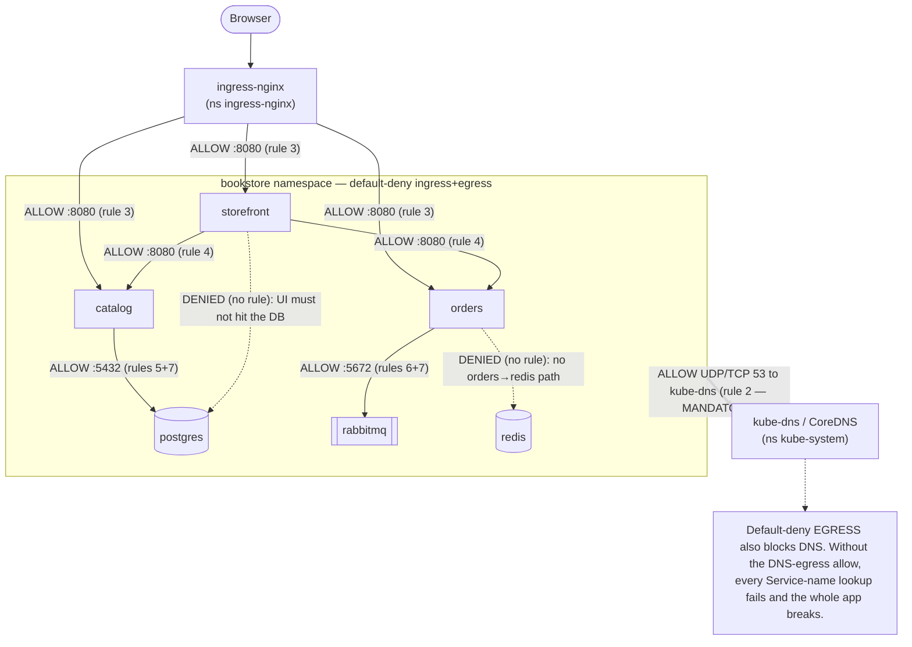

# 06 — Network policies

> The cluster is **default-allow** — any Pod can reach any Pod. NetworkPolicy
> flips that to **default-deny** then **whitelists** only needed flows:
> ingress/egress, `podSelector`/`namespaceSelector`/`ipBlock`, the
> additive/whitelist model, the DNS-egress gotcha, and the **CNI-must-enforce**
> caveat — applied by locking the Bookstore namespace down to exactly its
> required edges.

**Estimated time:** ~15 min read · ~60 min hands-on
**Prerequisites:** [Part 02 ch.01](01-networking-model.md) — the default-allow fabric being locked down · [Part 02 ch.02](02-services.md) — the flows you must whitelist
**You'll know after this:** • explain default-allow and how NetworkPolicy flips it to default-deny · • write rules using `podSelector`, `namespaceSelector`, and `ipBlock` · • configure egress rules that include DNS without breaking name resolution · • know that NetworkPolicy is enforced only if the CNI supports it · • lock the Bookstore namespace down to its exact required edges

<!-- tags: networking, security, network-policies, default-deny, egress -->

## Why this exists

Every Bookstore tier now talks to the others by Service name
([ch.02](02-services.md)/[ch.03](03-dns-and-discovery.md)) and is reachable
from outside ([ch.04](04-ingress.md)/[ch.05](05-gateway-api.md)). But the
networking model ([ch.01](01-networking-model.md)) is a **flat, open LAN**: by
default `storefront` can talk straight to `postgres`, a compromised
`payments-worker` can reach *anything*, and a pod in another namespace can hit
your database. Nothing in the app *needs* most of these paths — they are pure
**blast radius**.

**NetworkPolicy** is the Kubernetes-native firewall: select Pods by label and
declare *exactly* who may connect to them (ingress) and where they may connect
*to* (egress). Applied well it turns the open LAN into **least-privilege
segmentation** — a containment boundary so one popped Pod can't pivot through
the cluster. This is the [Network Segmentation](#further-reading) pattern, and
it is the security capstone of Part 02.

## Mental model

NetworkPolicy is **a whitelist that switches on the moment you write one**.

- With **no** policy selecting a Pod: that Pod is **wide open** (allow-all, both
  directions) — the Kubernetes default.
- The instant **any** policy selects a Pod **for a direction** (Ingress or
  Egress), that Pod becomes **default-deny for that direction**, and **only**
  the `from`/`to` rules across **all** policies selecting it are allowed.
  Policies are **purely additive** — there is no "deny" rule, only the union of
  allows; you restrict by *adding allows to a deny baseline*, never by writing
  denies.
- It is **stateful** (reply traffic for an allowed connection is automatically
  allowed — you don't allow the return path) but **direction-scoped**: allowing
  A→B *ingress on B* is **not** enough if A also has a **default-deny egress** —
  then A's egress to B must be allowed **too** (both ends).

And the load-bearing caveat: **NetworkPolicy is enforced by the CNI, not by
Kubernetes.** The API server happily stores the object; if the CNI doesn't
implement policy (kind's default **kindnet** does **not**), it is a **silent
no-op** — the rules exist and enforce nothing.

## Diagrams

### Allowed vs. denied after default-deny + targeted allows (Mermaid)



### Policy matrix — who → who (ASCII)

```
 SOURCE \ DEST   storefront  catalog  orders  postgres  rabbitmq  redis  kube-dns  ext-LB
 ─────────────────────────────────────────────────────────────────────────────────────
 ingress-nginx       ✔(8080)  ✔(8080)  ✔(8080)    ·         ·       ·       ·        —
 storefront            —      ✔(8080)  ✔(8080)    ✗         ✗       ✗     ✔(53)      ✗
 catalog               ✗        —        ✗     ✔(5432)      ✗       ✗     ✔(53)      ✗
 orders                ✗        ✗        —        ✗      ✔(5672)    ✗     ✔(53)      ✗
 (every bookstore Pod) ·        ·        ·        ·         ·       ·     ✔(53)      ✗
 ─────────────────────────────────────────────────────────────────────────────────────
   ✔ = explicitly allowed (rule #)   ✗ = denied by default-deny (no allow)
   · = not applicable / not part of the app's required edges
   redis has NO inbound allow yet (catalog runs with REDIS_ADDR unset, ch.02);
   add an allow-catalog-to-redis rule when redis is wired in Part 03.
```

## Hands-on with the Bookstore

**Assumed working directory: the guide repo root (`full-guide/`).** Requires
the `bookstore` namespace and the workloads it segments:
`10-catalog-deploy.yaml`, `11-storefront-deploy.yaml`, `14-orders-deploy.yaml`,
`13-rabbitmq.yaml`, and the postgres StatefulSet `20-postgres-statefulset.yaml`
([Part 01 ch.05](../01-core-workloads/05-statefulsets.md)). Either edge stack
from [ch.04](04-ingress.md)/[ch.05](05-gateway-api.md) may be present (the
policy targets the controller's *namespace*, same either way).

### 0. First: a CNI that actually enforces policy

kind's default **kindnet does NOT enforce NetworkPolicy** — the objects below
would apply and do **nothing**. To *see* enforcement, recreate the kind cluster
with its default CNI disabled and install **Calico** (a policy-enforcing CNI):

```sh
# Recreate kind WITHOUT the default CNI (Calico will provide networking+policy):
cat <<'EOF' >/tmp/kind-calico.yaml
kind: Cluster
apiVersion: kind.x-k8s.io/v1alpha4
networking:
  disableDefaultCNI: true
  podSubnet: "192.168.0.0/16"
EOF
kind delete cluster --name bookstore
kind create cluster --name bookstore --config /tmp/kind-calico.yaml
kubectl apply -f https://raw.githubusercontent.com/projectcalico/calico/v3.28.0/manifests/calico.yaml
kubectl -n kube-system rollout status ds/calico-node --timeout=180s
# (reload the bookstore/*:dev images and re-apply 00-,10-,11-,13-,14-,20-,40-.)
```

> Cilium is the other common choice (and replaces kube-proxy,
> [ch.02](02-services.md)). The point: **policy enforcement is a CNI
> capability** — pick one in the cluster-build ([ch.01](01-networking-model.md)).

### 1. Default-deny + the mandatory DNS allow + targeted allows

New file
[`60-networkpolicy.yaml`](../examples/bookstore/raw-manifests/60-networkpolicy.yaml).
It is **one baseline deny** plus **seven allows**. The two that people forget —
the baseline and DNS:

```yaml
apiVersion: networking.k8s.io/v1
kind: NetworkPolicy
metadata: { name: default-deny-all, namespace: bookstore }
spec:
  podSelector: {}                       # {} = EVERY Pod in the namespace
  policyTypes: ["Ingress", "Egress"]    # no rules below ⇒ deny BOTH directions
---
apiVersion: networking.k8s.io/v1
kind: NetworkPolicy
metadata: { name: allow-dns-egress, namespace: bookstore }
spec:
  podSelector: {}                       # every Pod needs to resolve names
  policyTypes: ["Egress"]
  egress:
    - to:
        - namespaceSelector: { matchLabels: { kubernetes.io/metadata.name: kube-system } }
          podSelector:        { matchLabels: { k8s-app: kube-dns } }
      ports:
        - { protocol: UDP, port: 53 }
        - { protocol: TCP, port: 53 }
```

…and the one people *also* forget — the **source-side egress** for
storefront→catalog/orders (without it, the destination ingress rule alone
is not enough; the demo in step 2 would time out):

```yaml
apiVersion: networking.k8s.io/v1
kind: NetworkPolicy
metadata: { name: allow-storefront-egress, namespace: bookstore }
spec:
  podSelector: { matchLabels: { app: storefront } }
  policyTypes: ["Egress"]
  egress:
    - to: [ { podSelector: { matchLabels: { app: catalog } } } ]
      ports: [ { protocol: TCP, port: 8080 } ]
    - to: [ { podSelector: { matchLabels: { app: orders } } } ]
      ports: [ { protocol: TCP, port: 8080 } ]
```

All **seven allows**, in full (the three above plus rules 3–7). Because
egress is **also** default-denied, every Pod→Pod edge needs an allow on
**both ends** — an Ingress rule on the destination *and* an Egress rule on the
source:

- **rule 2** `allow-dns-egress` — every Pod → kube-dns UDP/TCP `:53`
  (mandatory prerequisite; names must resolve before any connection opens)
- **rule 3** `allow-ingress-to-http-tiers` — ingress-nginx →
  storefront/catalog/orders `:8080` (ingress on the three HTTP tiers)
- **rule 4** `allow-storefront-to-apis` — storefront → catalog/orders `:8080`
  (ingress on catalog/orders)
- **rule 5** `allow-catalog-to-postgres` — catalog → postgres `:5432`
  (ingress on postgres)
- **rule 6** `allow-orders-to-rabbitmq` — orders → rabbitmq `:5672`
  (ingress on rabbitmq)
- **rule 7** `allow-backend-egress` — the **source egress** completing
  catalog→postgres and orders→rabbitmq (rules 5/6 are only the destination
  ingress; without this egress side they still fail)
- **rule 8** `allow-storefront-egress` — the **source egress** completing
  storefront→catalog/orders `:8080` (rule 4 is only the destination ingress;
  this is the matching egress, same both-ends pattern as rule 7)

So `storefront → catalog` needs **rule 4 (ingress on catalog) + rule 8
(egress on storefront) + rule 2 (DNS)** — drop any one and it fails. This
both-ends-plus-DNS requirement is exactly what the step-2 probe verifies.

```sh
# from the repo root (full-guide/)
kubectl apply -f examples/bookstore/raw-manifests/60-networkpolicy.yaml
kubectl get networkpolicy -n bookstore
kubectl describe networkpolicy default-deny-all -n bookstore
```

### 2. Prove it: allowed paths still work, denied paths now fail

Use an **ephemeral public-image** debug Pod — never exec into the distroless
`catalog`/`orders` Pods (no shell). Label it so a policy can (or cannot) select
it:

```sh
# A debug Pod labelled app=storefront IS allowed to reach catalog:8080.
# ns bookstore is PSA `restricted`, so the probe pod also carries a restricted
# securityContext via --overrides (the app=storefront label still drives the
# NetworkPolicy match; the command goes in the override):
kubectl run probe-allowed -n bookstore --image=curlimages/curl:8.9.1 \
  --labels='app=storefront' --restart=Never -i --rm \
  --overrides='{"apiVersion":"v1","spec":{"securityContext":{"runAsNonRoot":true,"runAsUser":65532,"seccompProfile":{"type":"RuntimeDefault"}},"containers":[{"name":"probe-allowed","image":"curlimages/curl:8.9.1","securityContext":{"allowPrivilegeEscalation":false,"capabilities":{"drop":["ALL"]},"readOnlyRootFilesystem":true},"command":["curl","-s","--max-time","5","http://catalog.bookstore.svc.cluster.local/healthz"]}]}}'
#   → {"status":"ok"} — this needs BOTH ends to be allowed:
#     • rule 4  = INGRESS on catalog allowing from app=storefront, AND
#     • rule 8  = EGRESS on app=storefront allowing to catalog:8080,
#     • rule 2  = DNS egress so the Service name resolves first.
#   Drop rule 8 and this TIMES OUT even though rule 4 exists (both-ends).

# A debug Pod with NO matching label trying to reach postgres is DENIED.
# Use nc (netshoot) — a raw TCP probe distinguishes refuse/drop, unlike curl
# against a non-HTTP port (which always reports 000):
kubectl run probe-denied -n bookstore --image=nicolaka/netshoot \
  --labels='app=intruder' --restart=Never -i --rm \
  --overrides='{"apiVersion":"v1","spec":{"securityContext":{"runAsNonRoot":true,"runAsUser":65532,"seccompProfile":{"type":"RuntimeDefault"}},"containers":[{"name":"probe-denied","image":"nicolaka/netshoot","securityContext":{"allowPrivilegeEscalation":false,"capabilities":{"drop":["ALL"]}},"command":["nc","-vz","-w3","postgres.bookstore.svc.cluster.local","5432"]}]}}'
#   → "Connection timed out" : no allow rule selects 'intruder'→postgres
#     (no ingress on postgres for app=intruder, no egress for app=intruder).
#   (On kindnet this would WRONGLY succeed — that is the no-op caveat.)
```

### 3. The DNS gotcha, demonstrated

Temporarily remove the DNS allow and watch the **whole app break** on name
resolution, then restore it:

```sh
kubectl delete networkpolicy allow-dns-egress -n bookstore
kubectl run probe-nodns -n bookstore --image=curlimages/curl:8.9.1 \
  --labels='app=storefront' --restart=Never -i --rm \
  --overrides='{"apiVersion":"v1","spec":{"securityContext":{"runAsNonRoot":true,"runAsUser":65532,"seccompProfile":{"type":"RuntimeDefault"}},"containers":[{"name":"probe-nodns","image":"curlimages/curl:8.9.1","securityContext":{"allowPrivilegeEscalation":false,"capabilities":{"drop":["ALL"]},"readOnlyRootFilesystem":true},"command":["curl","-s","--max-time","5","http://catalog.bookstore.svc.cluster.local/healthz"]}]}}'
#   → resolution failure: default-deny egress now blocks UDP/TCP 53 to CoreDNS.
#   This is the single most common NetworkPolicy outage. Restore it:
kubectl apply -f examples/bookstore/raw-manifests/60-networkpolicy.yaml
```

> **Lineage note.** `60-networkpolicy.yaml` is the Bookstore's segmentation
> layer; its selectors are a **subset of the real pod labels** from
> `10-`/`11-`/`13-`/`14-`/`20-` (`app: catalog|storefront|orders|rabbitmq|postgres`).
> redis has **no inbound allow yet** — catalog runs with `REDIS_ADDR` unset
> ([ch.02](02-services.md)); an `allow-catalog-to-redis` rule is added when
> redis is wired with config in
> [Part 03](../03-config-and-storage/01-configmaps.md). Tighter identity
> (per-ServiceAccount), Pod Security, and admission-enforced policy are
> [Part 05](../05-security/02-pod-security.md).

## How it works under the hood

### The default-allow problem and the switch

Kubernetes ships **default-allow**: with zero policies, all Pod↔Pod (and
Pod↔external) traffic is permitted ([ch.01](01-networking-model.md)). A
NetworkPolicy is **namespaced** and selects Pods via **`spec.podSelector`**
(`{}` = all Pods in the namespace). **`spec.policyTypes`** declares which
directions this policy governs (`Ingress`, `Egress`, or both). The rule that
makes it all work:

> A Pod is unrestricted in a direction **until some policy selects it for that
> direction**. Then traffic in that direction is **denied unless explicitly
> allowed** by the union of all policies selecting that Pod.

So **`podSelector: {}` + `policyTypes:[Ingress,Egress]` with no rules** = the
**default-deny baseline** for the whole namespace. Every other policy then
*adds* allowed flows on top. There is **no deny rule type** — the model is
strictly "deny by selection, allow by addition" (a whitelist).

### Selectors: pod / namespace / ipBlock

`ingress[].from` and `egress[].to` are lists of **peers**, each one of:

- **`podSelector`** — Pods **in the same namespace** matching labels (e.g.
  `app: storefront`). Same-namespace only unless combined with a
  namespaceSelector.
- **`namespaceSelector`** — all Pods in namespaces matching labels (e.g.
  `kubernetes.io/metadata.name: ingress-nginx` — that label is auto-set on
  every namespace and immutable, ideal for targeting `kube-system`/
  `ingress-nginx`).
- **`namespaceSelector` + `podSelector` in the *same* peer entry** — the
  **intersection**: those Pods *in* those namespaces (how the Bookstore allows
  *the kube-dns Pods in kube-system*, not all of kube-system).
- **`ipBlock`** — a CIDR (with optional `except`) for off-cluster
  endpoints/egress (cloud metadata, an external DB, the internet). The only
  IP-based peer; intra-cluster should be label-based (Pod IPs churn,
  [ch.01](01-networking-model.md)).

> **Subtle trap:** within **one** `from`/`to` element, `namespaceSelector` and
> `podSelector` are **ANDed** (intersection). As **separate list elements**
> they are **ORed** (union). `from: [{namespaceSelector: X}, {podSelector: Y}]`
> ≠ `from: [{namespaceSelector: X, podSelector: Y}]` — a very common
> over-permissive bug.

### `ports` and protocols

Each rule may restrict `ports` (`protocol` + `port`, named or numeric; optional
`endPort` for ranges). Omitting `ports` allows **all ports** for that peer.
The Bookstore pins each edge to its real port (`8080`/`5432`/`5672`) — least
privilege. Note ports are the **target container port** (e.g. `8080`), not the
Service `port` ([ch.02](02-services.md)) — policy enforces on the **Pod**, the
Service VIP is unwrapped before the packet reaches it.

### Why a default-deny EGRESS breaks DNS (and the fix)

The most common self-inflicted outage: add a default-deny that includes
**Egress**, and **DNS stops working** — because resolving any Service name is
an egress packet to **CoreDNS (`kube-dns`) on UDP/TCP 53**, now denied. *Every*
name lookup in the namespace fails; the app looks totally broken with confusing
"name resolution" errors. **You must explicitly allow egress to kube-dns**
(the Bookstore's `allow-dns-egress`, applied to `podSelector: {}` so it covers
*every* Pod). Allow **both UDP and TCP** 53 (large/truncated answers and
some resolvers use TCP). This is mandatory whenever egress is default-denied —
taught here by deleting and restoring it.

### Additive, stateful, direction-scoped

- **Additive:** the effective allow-set for a Pod is the **union** of all
  policies selecting it; you cannot subtract. To "remove" access, remove the
  allow.
- **Stateful:** an allowed connection's **reply traffic is automatically
  permitted** (conntrack) — you do **not** add a return-path rule.
- **Direction-scoped (both-ends):** A→B needs **ingress allowed on B** *and*,
  if A is under a default-deny egress, **egress allowed on A** (the Bookstore's
  rule 7 supplies the egress side for catalog→postgres and orders→rabbitmq;
  rule 8 supplies it for storefront→catalog/orders — each paired with its
  destination ingress rule 5/6/4). Forgetting the egress side is a top
  "I allowed it but it still fails" bug.

### Enforcement is the CNI's job

The API server only **stores** NetworkPolicy. Enforcement is the **CNI's**
dataplane (iptables/eBPF). **Calico, Cilium, Weave** enforce it; **kindnet
(kind's default) and plain Flannel do not** — policies are then a **silent
no-op** (objects present, zero effect). Always confirm the cluster's CNI
enforces policy (the hands-on installs Calico for exactly this); on managed
clusters, enable the policy plugin (production note).

## Production notes

> **In production:** **default-deny per namespace, then whitelist** — the
> Bookstore pattern. Most clusters run wide open because there are no policies;
> a single compromised Pod then has the whole network. Make `default-deny-all`
> + `allow-dns-egress` the **first** objects in every app namespace, add
> allows as services integrate, and treat a new allow like a firewall change
> (reviewed) — [Network Segmentation](#further-reading).

> **In production:** **verify the CNI enforces policy — silent no-ops are
> dangerous.** A cluster that *looks* segmented but isn't is worse than a known
> open one. EKS: the **VPC-CNI needs the policy agent enabled** (or run
> Calico/Cilium). GKE: enable **Dataplane V2** (Cilium) or Network Policy.
> AKS: choose **Azure/Calico/Cilium** policy at cluster creation. Add a CI
> conformance test that an unauthorized connection is actually refused.

> **In production:** **always allow DNS egress**, and scope egress beyond it.
> Pin DNS to the `kube-dns` Pods (not all of `kube-system`); for external
> dependencies use tight **`ipBlock`** (or, with Cilium, DNS/FQDN-aware
> policies) — broad `0.0.0.0/0` egress defeats the point and is a prime
> **exfiltration** path. Don't forget the **`namespaceSelector`+`podSelector`
> AND-vs-OR** trap turns "DNS only" into "all of kube-system".

> **In production:** **policies are label-driven — label discipline is
> security.** A Pod missing `app:` (or carrying a stale label) silently
> bypasses or wrongly matches a policy. Enforce required labels via admission
> ([Part 05 ch.02](../05-security/02-pod-security.md)), keep
> selector/template labels in lockstep
> ([Part 01 ch.04](../01-core-workloads/04-replicasets-and-deployments.md)),
> and remember NetworkPolicy is **L3/L4 only** — identity-aware/L7 authz needs
> a mesh or `CiliumNetworkPolicy` (out of scope here; mesh is conceptual only).

> **In production:** policy and **DNS-name reachability are different layers.**
> CoreDNS will resolve `postgres.bookstore.svc` from any namespace
> ([ch.03](03-dns-and-discovery.md)); only NetworkPolicy stops the
> *connection*. Cross-namespace `namespaceSelector` rules are the real
> tenant boundary ([Part 08 ch.04](../08-day-2-operations/04-multi-tenancy-and-namespaces.md)).

## Quick Reference

```sh
kubectl get networkpolicy -n <NS>
kubectl describe networkpolicy <NP> -n <NS>               # parsed rules + selected Pods
kubectl get pods -n kube-system | \
  grep -Ei 'calico|cilium|weave|kindnet'                  # does the CNI ENFORCE policy?
# verify with EPHEMERAL labelled public-image Pods (never exec distroless apps):
kubectl run probe -n <NS> --image=curlimages/curl:8.9.1 --labels='app=<X>' \
  --restart=Never -i --rm -- curl -s --max-time 5 http://<SVC>.<NS>.svc.cluster.local/<PATH>
kubectl run probe -n <NS> --image=nicolaka/netshoot --restart=Never -i --rm -- \
  nc -vz -w3 <SVC>.<NS>.svc.cluster.local <PORT>          # allowed vs. timeout
```

Default-deny + DNS skeleton (the mandatory baseline for any namespace):

```yaml
apiVersion: networking.k8s.io/v1
kind: NetworkPolicy
metadata: { name: default-deny-all, namespace: <NS> }
spec:
  podSelector: {}                       # all Pods
  policyTypes: ["Ingress", "Egress"]    # no rules ⇒ deny both
---
apiVersion: networking.k8s.io/v1
kind: NetworkPolicy
metadata: { name: allow-dns-egress, namespace: <NS> }   # MANDATORY with deny-egress
spec:
  podSelector: {}
  policyTypes: ["Egress"]
  egress:
    - to:
        - namespaceSelector: { matchLabels: { kubernetes.io/metadata.name: kube-system } }
          podSelector:        { matchLabels: { k8s-app: kube-dns } }
      ports: [ { protocol: UDP, port: 53 }, { protocol: TCP, port: 53 } ]
# then ADD one targeted allow per real edge (ingress on dest; egress on source
# too if egress is default-denied — both ends).
```

Checklist:

- [ ] CNI **actually enforces** NetworkPolicy (kindnet/plain-Flannel do not)
- [ ] `default-deny-all` (ingress+egress) is the baseline for the namespace
- [ ] **DNS egress (UDP+TCP 53 to kube-dns) explicitly allowed** — or all breaks
- [ ] Each allow scoped to least privilege (specific peer **and** port)
- [ ] Both ends covered: ingress on dest **and** egress on source (deny-egress)
- [ ] `namespaceSelector`+`podSelector` AND-vs-OR understood (no over-allow)
- [ ] Selectors are a subset of real pod labels; label discipline enforced
- [ ] External egress via tight `ipBlock`, never blanket `0.0.0.0/0`

## Test your understanding

> Try each before opening the answer drawer. The act of trying is the exercise; the answer is the check.

1. **Why is a `NetworkPolicy` with `podSelector: {}` and `policyTypes: [Ingress, Egress]` (no rules) considered a "default-deny baseline" rather than a no-op?**
   <details><summary>Show answer</summary>

   The selection itself flips the affected Pods from default-allow to default-deny in the listed directions — a Pod is unrestricted in a direction until *some* policy selects it for that direction, then traffic is denied unless a separately added allow rule permits it. Empty rules = no allows = effective deny of everything in that direction. Other policies are then additive whitelist allows on top (see §Mental model and §How it works under the hood).

   </details>

2. **A teammate adds default-deny egress and the entire app stops working. Nothing is "denied" in logs — calls just hang. What single rule is missing and why is this *the* classic gotcha?**
   <details><summary>Show answer</summary>

   `allow-dns-egress` — every Service-name lookup is an egress packet to CoreDNS (`kube-dns` in `kube-system`) on UDP/TCP 53, now blocked. Without name resolution, no connections even start. The classic gotcha because DNS is invisible to most application code — you see HTTP timeouts, not "DNS denied". Always pair default-deny egress with an explicit allow to kube-dns Pods on UDP+TCP 53 (see §3. The DNS gotcha, demonstrated).

   </details>

3. **You write `from: [{namespaceSelector: {matchLabels: {kubernetes.io/metadata.name: kube-system}}, podSelector: {matchLabels: {k8s-app: kube-dns}}}]`. A teammate splits these into two list elements. What changes semantically?**
   <details><summary>Show answer</summary>

   Within **one** peer entry, selectors are AND'd (intersection): "kube-dns Pods *in* kube-system". As **two separate list entries** they're OR'd (union): "any Pod in kube-system OR any kube-dns Pod anywhere". The split version is far more permissive — and a classic over-permissive policy bug. The Bookstore deliberately uses the AND form (see §How it works under the hood, "Subtle trap").

   </details>

4. **You apply `60-networkpolicy.yaml` to a kind cluster with the default kindnet CNI. `kubectl get networkpolicy` shows them all. A probe Pod with `app=intruder` still reaches Postgres. What's happening?**
   <details><summary>Show answer</summary>

   kindnet does **not** enforce NetworkPolicy — the API server stores the objects, but no CNI dataplane implements them. The cluster looks segmented but isn't, which is *worse* than knowing it's open. Fix: rebuild the cluster with a policy-enforcing CNI (Calico, Cilium). On managed clusters: enable the cloud provider's NetworkPolicy add-on. Add a CI test that an unauthorized connection actually fails (see §0. First: a CNI that actually enforces policy and §Production notes).

   </details>

5. **Hands-on extension: with Calico installed and `60-networkpolicy.yaml` applied, run a probe Pod labeled `app=storefront` and curl `catalog`. Now manually delete only `allow-storefront-egress`. What changes, and what does this prove about both-ends rules?**
   <details><summary>What you should see</summary>

   With the egress allow present, the call succeeds; once removed, it times out — even though `allow-storefront-to-apis` (the *ingress* rule on catalog) is still in place. This proves the both-ends rule: under default-deny egress, the *source* needs an explicit egress allow *and* the destination needs an ingress allow. Drop either side and the connection fails (see §How it works under the hood, "Direction-scoped (both-ends)").

   </details>

## Further reading

- **Ibryam & Huß, _Kubernetes Patterns_ 2e, ch.24 — _Network Segmentation_**
  — the default-deny/whitelist pattern and why segmentation is a core control.
- **Rosso et al., _Production Kubernetes_, ch.5 — "Pod Networking"** (policy
  enforcement by the CNI) and **Lukša, _Kubernetes in Action_ 2e, ch.11**
  (securing the Pod network).
- Official: <https://kubernetes.io/docs/concepts/services-networking/network-policies/>
  ("Network Policies") and
  <https://kubernetes.io/docs/tasks/administer-cluster/declare-network-policy/>
  (declaring policy; note the CNI-must-support caveat).
