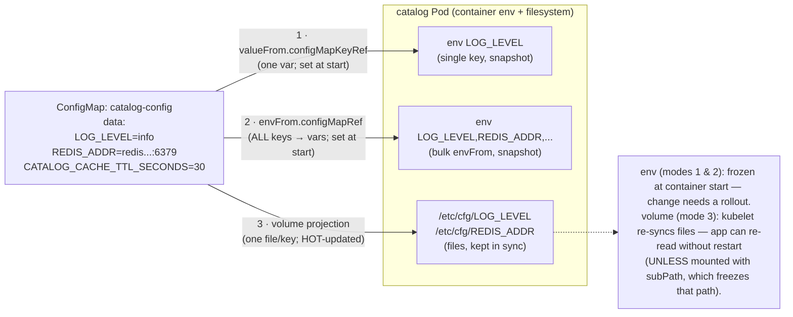

# 01 — ConfigMaps

> Externalize **non-secret** configuration so the same image runs in dev /
> staging / prod by changing data, not code: the three consumption modes
> (`configMapKeyRef`, bulk `envFrom`, projected files in a volume), the
> `subPath` no-auto-update trap, immutable ConfigMaps, why mounted keys
> hot-update but env vars never do, the ~1 MiB etcd limit, and `binaryData` —
> applied by lifting catalog's config out of its Deployment.

**Estimated time:** ~15 min read · ~30 min hands-on
**Prerequisites:** [Part 01 ch.04](../01-core-workloads/04-replicasets-and-deployments.md) — the Deployment whose config you're lifting · [Part 01 ch.01](../01-core-workloads/01-pods.md) — env vars and volume mounts
**You'll know after this:** • externalize config so one image works in dev/staging/prod · • choose between `configMapKeyRef`, `envFrom`, and projected volumes · • know the `subPath` trap that disables auto-update · • use immutable ConfigMaps and recognize the ~1 MiB etcd ceiling · • predict which mount types hot-update and which do not

<!-- tags: core-objects, configmaps, configuration, env-vars, projected-volumes -->

## Why this exists

The catalog Deployment ([Part 01 ch.04](../01-core-workloads/04-replicasets-and-deployments.md))
hardcodes its configuration in the pod template: `PORT` is an inline env, the
log level is whatever the binary defaults to, the Redis address is unset. That
means **changing a setting means editing (and re-applying, and conceptually
rebuilding) the workload** — and the *same* image cannot move from dev to prod
without a manifest fork. That violates the twelve-factor rule "store config in
the environment": an artifact should be **built once** and **configured per
environment**.

A **ConfigMap** is the Kubernetes object for exactly that: a namespaced bag of
key/value (and small binary) data, decoupled from any Pod, that you inject into
containers as **environment variables** or **files**. Config now has its own
lifecycle — reviewed, diffed, and rolled independently of the image. This is
the [Configuration Resource](#further-reading) pattern, and it is the first
half of "twelve-factor config" in this guide; **secrets** (the half that must
be encrypted and access-controlled) are [ch.02](02-secrets.md). The dividing
line is strict: a ConfigMap is **plaintext, world-readable to anyone with
`get configmap` in the namespace** — never put a credential in one.

## Mental model

A ConfigMap is **a detachable config file/env block that lives in the API, not
the image**. Think of it as "the part of the environment that differs between
deployments, named and versioned as an object".

- It holds `data` (UTF-8 string key/value) and optionally `binaryData`
  (base64-encoded bytes). Total size is bounded by **etcd's ~1 MiB
  per-object** limit — a ConfigMap is for *configuration*, not a file server.
- A Pod **consumes** it three ways: one key → one env var
  (`valueFrom.configMapKeyRef`); every key → env vars in bulk (`envFrom`); or
  the whole map **projected as files** in a volume (one file per key).
- The injection happens at **container start** for env vars (a snapshot, frozen
  for the container's life) but is **continuously synced** for the volume
  projection (the kubelet refreshes mounted keys) — a distinction that decides
  whether a config change needs a restart.

So: configuration becomes data you can change without touching the workload —
*provided* you understand which consumption mode updates live and which is a
build-time-style snapshot.

## Diagrams

### ConfigMap → Pod: the three injection modes (Mermaid)



### The three modes side by side (ASCII)

```
 ConfigMap catalog-config = { LOG_LEVEL, REDIS_ADDR, CATALOG_CACHE_TTL_SECONDS }

 (1) configMapKeyRef            (2) envFrom (bulk)           (3) volume (projected)
 ─────────────────────         ────────────────────         ──────────────────────
 env:                          envFrom:                     volumeMounts:
  - name: LOG_LEVEL             - configMapRef:               - name: cfg
    valueFrom:                     name: catalog-config         mountPath: /etc/cfg
      configMapKeyRef:          ⇒ LOG_LEVEL, REDIS_ADDR,     volumes:
        name: catalog-config       CATALOG_CACHE_TTL_...      - name: cfg
        key:  LOG_LEVEL            all become env vars           configMap:
 ⇒ ONE explicit var            ⇒ every key, one shot            name: catalog-config
                                                             ⇒ /etc/cfg/LOG_LEVEL ...
 update: needs Pod restart     update: needs Pod restart    update: files re-sync
 (snapshot at start)           (snapshot at start)          live  (NO restart*)
                               key name == env var name     *except subPath mounts
```

## Hands-on with the Bookstore

**Assumed working directory: the guide repo root (`full-guide/`).** Requires
the `bookstore` namespace ([Part 01 ch.03](../01-core-workloads/03-resources-and-qos.md))
and the catalog Deployment ([Part 01 ch.04](../01-core-workloads/04-replicasets-and-deployments.md)).
It also needs `redis` ([Part 02 ch.02](../02-networking/02-services.md)) for
catalog's cache once `REDIS_ADDR` is set.

### 1. Externalize catalog's non-secret config

The catalog binary ([`app/catalog/main.go`](../examples/bookstore/app/catalog/main.go))
reads `LOG_LEVEL` and `REDIS_ADDR` from the environment (and `PORT`, `DB_DSN`
— the latter is a *secret* concern, [ch.02](02-secrets.md)). New file
[`examples/bookstore/raw-manifests/15-catalog-config.yaml`](../examples/bookstore/raw-manifests/15-catalog-config.yaml):

```yaml
apiVersion: v1
kind: ConfigMap
metadata:
  name: catalog-config
  namespace: bookstore
  labels: { app: catalog, app.kubernetes.io/part-of: bookstore }
data:
  # consumed by the app (app/catalog/main.go):
  LOG_LEVEL: "info"
  REDIS_ADDR: "redis.bookstore.svc.cluster.local:6379"
  # illustrative, NOT read by the tiny demo binary — present only to make the
  # bulk envFrom realistic (documented so the manifest never lies):
  CATALOG_FEATURE_RECOMMENDATIONS: "false"
  CATALOG_CACHE_TTL_SECONDS: "30"
```

> **Honesty note.** Only `LOG_LEVEL` and `REDIS_ADDR` are actually consumed by
> the demo binary. `CATALOG_FEATURE_RECOMMENDATIONS` / `CATALOG_CACHE_TTL_SECONDS`
> are realistic-looking *illustrative* keys so the bulk-`envFrom` demo isn't a
> single-key toy — flagged in the manifest comments. The guide never claims the
> app reads config it doesn't.

### 2. Wire the Deployment to consume it (two modes at once)

Edit [`10-catalog-deploy.yaml`](../examples/bookstore/raw-manifests/10-catalog-deploy.yaml)
so the catalog container pulls config from the ConfigMap. We use **bulk
`envFrom`** for the whole map *and* an explicit **`configMapKeyRef`** for
`LOG_LEVEL` (to show both modes; an explicit `env[]` entry **always** wins over
an `envFrom[]` value for the same key — this is a fixed precedence rule, *not*
list order / last-wins — so the `configMapKeyRef` is authoritative; identical
value here, on purpose):

```yaml
        - name: catalog
          image: bookstore/catalog:dev
          envFrom:
            - configMapRef:
                name: catalog-config        # bulk: every key → an env var
          env:
            - name: PORT
              value: "8080"
            - name: LOG_LEVEL               # explicit single-key (mode 1)
              valueFrom:
                configMapKeyRef:
                  name: catalog-config
                  key: LOG_LEVEL
            # ... ch.02 adds DB_DSN here from a Secret ...
```

(The full file also carries the [ch.02](02-secrets.md) `DB_DSN` and
[ch.03](03-volumes.md) volumes — it is one cumulative manifest; this chapter's
increment is the ConfigMap wiring, explained here.)

Apply config **before** the Deployment that references it, then roll:

```sh
# from the repo root (full-guide/)
kubectl apply -f examples/bookstore/raw-manifests/15-catalog-config.yaml
# The canonical 10-catalog-deploy.yaml carries DB_DSN + envFrom db-credentials,
# so it needs Postgres + the schema Job before it can go Ready (its /readyz
# pings Postgres). Bring those up first; idempotent if already applied.
kubectl apply -f examples/bookstore/raw-manifests/16-db-credentials.yaml
kubectl apply -f examples/bookstore/raw-manifests/20-postgres-statefulset.yaml
kubectl rollout status statefulset/postgres -n bookstore
kubectl apply -f examples/bookstore/raw-manifests/21-db-migrate-job.yaml   # schema
kubectl wait --for=condition=complete job/db-migrate -n bookstore --timeout=120s
kubectl apply -f examples/bookstore/raw-manifests/10-catalog-deploy.yaml
kubectl rollout status deployment/catalog -n bookstore

# Prove the env was injected. catalog is distroless (no shell) — do NOT
# `kubectl exec` it. The rendered Pod spec is authoritative; inspect it:
kubectl get pod -n bookstore -l app=catalog -o \
  jsonpath='{.items[0].spec.containers[0].envFrom[0].configMapRef.name}{"\n"}'
#   → catalog-config   (the bulk envFrom source is attached)
kubectl set env deployment/catalog -n bookstore --list | grep -i log_level
#   → shows the EXPLICIT env[] entry (the configMapKeyRef LOG_LEVEL). Note
#     `set env --list` only renders explicit `env[]`; envFrom-sourced keys do
#     NOT appear there — confirm those via the jsonpath above (or describe pod).
```

### 3. Mode 3: project the ConfigMap as files (and watch it hot-update)

Env vars are a **start-time snapshot**. To *see* live updates you need the
**volume** projection. Use an **ephemeral public-image** Pod (never exec the
distroless catalog) that mounts the same ConfigMap as files:

```sh
# A debug Pod that projects catalog-config as files under /etc/cfg:
kubectl run cfg-peek -n bookstore --image=busybox:1.36 --restart=Never -i --rm \
  --overrides='
{
  "apiVersion": "v1",
  "spec": {
    "securityContext": {"runAsNonRoot": true, "runAsUser": 65532, "seccompProfile": {"type": "RuntimeDefault"}},
    "containers": [{
      "name": "cfg-peek", "image": "busybox:1.36",
      "command": ["sh","-c","ls -l /etc/cfg && echo --- && cat /etc/cfg/LOG_LEVEL"],
      "securityContext": {"allowPrivilegeEscalation": false, "capabilities": {"drop": ["ALL"]}},
      "volumeMounts": [{"name":"cfg","mountPath":"/etc/cfg"}]
    }],
    "volumes": [{"name":"cfg","configMap":{"name":"catalog-config"}}]
  }
}'
#   (the container command is in --overrides; `kubectl run` args after `--`
#    would be silently discarded when --overrides sets command, so none here)
#   → one file per key; /etc/cfg/LOG_LEVEL contains "info".

# Hot-update demo: change the ConfigMap, then a LONG-LIVED Pod mounting it as a
# volume sees the file change WITHOUT a restart (env-var consumers would NOT):
kubectl patch configmap catalog-config -n bookstore \
  --type merge -p '{"data":{"LOG_LEVEL":"debug"}}'
#   In a Pod that mounts it as a volume, /etc/cfg/LOG_LEVEL becomes "debug"
#   within ~a minute (kubelet sync period) — no Pod restart.
#   In catalog (which consumes LOG_LEVEL as an ENV VAR) nothing changes until
#   the next rollout: env is frozen at container start. This is THE caveat.
kubectl patch configmap catalog-config -n bookstore \
  --type merge -p '{"data":{"LOG_LEVEL":"info"}}'    # restore

# To actually apply a changed ConfigMap to env-var consumers, roll the workload:
kubectl rollout restart deployment/catalog -n bookstore
```

> **Lineage / forward refs.** `15-catalog-config.yaml` is the Bookstore's
> non-secret config layer. The catalog Deployment now also wires `DB_DSN` from
> a **Secret** ([ch.02](02-secrets.md)) and gains scratch/`downwardAPI`
> volumes ([ch.03](03-volumes.md)). NetworkPolicy
> ([Part 02 ch.06](../02-networking/06-network-policies.md)) is **unaffected**:
> a ConfigMap is read by the **kubelet from the API server**, not over the Pod
> network — no egress rule is needed for config injection (only for the actual
> Redis *connection* once `REDIS_ADDR` is live, which is a future allow noted
> in that chapter).

## How it works under the hood

- **Storage & projection.** A ConfigMap is a normal API object persisted in
  **etcd** ([Part 00 ch.04](../00-foundations/04-control-plane-deep-dive.md)).
  When a Pod references one, the **kubelet** fetches it and renders the
  requested form: env vars are written into the container's process
  environment at exec; a volume projection is materialized as a **directory on
  the node filesystem** (the kubelet's per-Pod directory) that the kubelet
  keeps reconciled. (A *ConfigMap* volume is **not** tmpfs/RAM-backed — that is
  specific to **Secret** volumes, [ch.02](02-secrets.md), which are tmpfs so
  credentials never hit node disk. The ch.02 comparison table reflects this
  distinction.)
- **Env vars are a one-shot snapshot.** The container environment is set
  **once, at process start**, from the ConfigMap's value at that instant.
  Mutating the ConfigMap afterward has **zero effect** on a running container —
  the process already has its copy. Only a new container (rollout/restart)
  picks up the new value. This is not a bug; env is a process-creation concept.
- **Volume keys are kept in sync (with lag).** For a `configMap` volume the
  kubelet periodically (sync loop, on the order of a minute, plus its cache
  TTL) updates the projected files **atomically** via a symlink swap of a
  `..data` directory — readers never see a half-written file. An app that
  *re-reads* the file (or watches it) gets new config **without a restart**.
- **`subPath` opts OUT of updates.** Mounting a single key with
  `volumeMounts.subPath` (e.g. to drop one file into an existing directory
  without shadowing it) **breaks the auto-update**: a `subPath` mount is
  resolved **once at container start** and is *not* part of the synced
  projection. Changing the ConfigMap will **not** update a `subPath`-mounted
  file until the Pod restarts — a classic "I updated the ConfigMap and nothing
  happened" trap. Use a full-directory mount (and have the app reference
  `mountPath/key`) when you want live updates.
- **Immutable ConfigMaps.** Setting `immutable: true` makes the object's
  `data`/`binaryData` **unchangeable** (you must delete & recreate, i.e. roll a
  new name). Two reasons: **safety** (an accidental edit can't silently break
  every consumer at once) and **performance** — the kubelet/API server can
  **stop watching** immutable ConfigMaps, removing a large source of watch
  traffic in big clusters (thousands of Pods each watching their ConfigMaps is
  real control-plane load). The trade-off: you adopt a **new ConfigMap name per
  change** and roll the Deployment to it (which is also a cleaner, auditable
  rollout model).
- **Size limit.** Because it lives in etcd, a ConfigMap (like any object) is
  bounded by the **~1 MiB** etcd value limit (the API server enforces it). It
  is for configuration and small assets, not bulk data — large files belong in
  a volume/object store, not a ConfigMap.
- **`binaryData`.** Non-UTF-8 content (a TLS chain, a small keystore, a binary
  blob) goes in `binaryData` as **base64** (decoded back to bytes on volume
  projection). `data` is for UTF-8 strings; `binaryData` for everything else.
  (Base64 here is an *encoding* for transport, not security — same caveat as
  Secrets, [ch.02](02-secrets.md).)
- **Optional / missing references.** A `configMapKeyRef`/`configMapRef` is
  **required by default**: if the ConfigMap or key is absent the **Pod won't
  start** (stuck in `CreateContainerConfigError`). Mark a reference
  `optional: true` to tolerate absence (the var/file is simply not set) — useful
  for genuinely optional tunables, dangerous for required ones (fail loud).

## Production notes

> **In production:** treat config as **versioned, reviewed artifacts**, not
> hand-`kubectl edit`s. Manage ConfigMaps via the same GitOps pipeline as code
> ([Part 07 ch.04](../07-delivery/04-gitops-argocd.md)); a config change is a
> deploy and should be diffable and revertable. An out-of-band `kubectl edit`
> that drifts from Git is a top incident cause.

> **In production:** prefer **`immutable: true`** ConfigMaps with a
> **content-hashed name** (e.g. `catalog-config-7a3f`) and roll the Deployment
> to the new name. This makes every config change an explicit, auditable
> rollout (and rollback target), and removes the kubelet watch load of mutable
> ConfigMaps at scale. Helm/Kustomize ([Part 07](../07-delivery/01-packaging-helm.md))
> can generate the hash suffix automatically (Kustomize `configMapGenerator`).

> **In production:** know your **update semantics** before relying on them.
> Env-var config **never** updates without a rollout — that is usually what you
> want (atomic, with rollout safety). "Live reload from a mounted ConfigMap"
> works **only** for full-directory volume mounts **and** an app that re-reads,
> and **never** through `subPath`. Don't design a "change ConfigMap → app
> reacts" flow on an env-var consumer; it silently won't.

> **In production:** keep ConfigMaps **small and single-purpose**. The ~1 MiB
> etcd ceiling is a hard wall, and a giant ConfigMap watched by many Pods is
> control-plane churn. Split per concern; never use a ConfigMap as a file
> distribution mechanism (that's a volume/object-store job,
> [ch.03](03-volumes.md)/[ch.04](04-persistent-storage.md)).

> **In production:** **never put secrets in a ConfigMap.** It is plaintext and
> readable by anyone with namespace `get configmap` (and visible in plain etcd).
> The DB password lives in a **Secret** with separate RBAC and
> encryption-at-rest ([ch.02](02-secrets.md)) — the split is a security
> boundary, not a stylistic one.

## Quick Reference

```sh
kubectl create configmap <NAME> -n <NS> \
  --from-literal=KEY=val --from-file=path/  --dry-run=client -o yaml   # author
kubectl get configmap <NAME> -n <NS> -o yaml                          # inspect
kubectl describe configmap <NAME> -n <NS>
kubectl patch configmap <NAME> -n <NS> --type merge -p '{"data":{"K":"v"}}'
kubectl rollout restart deployment/<D> -n <NS>     # apply env-var config change
# inspect a projected ConfigMap from an EPHEMERAL public image (NOT a distroless
# app Pod): run busybox with a configMap volume mounted and `cat` the files.
```

Minimal ConfigMap + the three consumption modes:

```yaml
apiVersion: v1
kind: ConfigMap
metadata: { name: app-config, namespace: <NS> }
immutable: false                 # set true in prod + roll a hashed name
data: { LOG_LEVEL: "info", FEATURE_X: "false" }
binaryData: {}                   # base64 for non-UTF-8 (encoding, not secrecy)
---
# in a container:
envFrom: [ { configMapRef: { name: app-config } } ]          # (2) bulk
env:
  - name: LOG_LEVEL                                            # (1) one key
    valueFrom: { configMapKeyRef: { name: app-config, key: LOG_LEVEL } }
volumeMounts: [ { name: cfg, mountPath: /etc/cfg } ]           # (3) files
volumes:      [ { name: cfg, configMap: { name: app-config } } ]
```

Checklist:

- [ ] No secrets in the ConfigMap (plaintext; use a Secret — [ch.02](02-secrets.md))
- [ ] Consumption mode chosen deliberately (env = snapshot; volume = live)
- [ ] `subPath` mounts understood to **not** auto-update (restart needed)
- [ ] `immutable: true` + hashed name for prod (perf + safe rollouts)
- [ ] ConfigMap small (≪ ~1 MiB etcd limit); split per concern
- [ ] Required refs not marked `optional` (fail loud if config is missing)
- [ ] Config changes flow through GitOps, not ad-hoc `kubectl edit`

## Test your understanding

> Try each before opening the answer drawer. The act of trying is the exercise; the answer is the check.

1. **A teammate updates `LOG_LEVEL` in a ConfigMap consumed via `valueFrom.configMapKeyRef`. They wait, but the app still logs at `info`. What's happening, and why is the absence of update the *correct* default behavior?**
   <details><summary>Show answer</summary>

   Env vars are a one-shot snapshot taken at container start. The process has already received its copy of the env; mutating the ConfigMap afterward has zero effect on the running container. To pick up the change, `kubectl rollout restart deployment` — which is desirable because env-var changes become atomic, auditable, rollout-safe deploys instead of silent live mutations (see §How it works under the hood, "Env vars are a one-shot snapshot").

   </details>

2. **You mount a single ConfigMap key with `subPath` to drop one file into `/etc/app/config.yaml`. You patch the ConfigMap and the file doesn't change. Why, and what's the fix?**
   <details><summary>Show answer</summary>

   `subPath` mounts are resolved *once* at container start and are *not* part of the kubelet's synced projection — they opt out of auto-update. Fix: mount the full directory (no `subPath`) so the kubelet keeps it in sync, and have the app reference `<mountPath>/<key>`; or accept that subPath needs a rollout to pick up the new value. This is the classic "I changed the ConfigMap and nothing happened" trap (see §How it works under the hood, "subPath opts OUT").

   </details>

3. **Why is `immutable: true` on a ConfigMap a *performance* improvement at scale, and what changes about the rollout workflow when you use it?**
   <details><summary>Show answer</summary>

   Mutable ConfigMaps are watched by every Pod that consumes them — at scale, thousands of watches create real control-plane load. Immutable ConfigMaps tell the kubelet/API server they can never change, so the watch can be skipped. Workflow: every change becomes a new ConfigMap with a hashed name (e.g., `catalog-config-7a3f`), referenced by a new Deployment spec, rolled out as a normal release — auditable and rollback-friendly (see §How it works under the hood, "Immutable ConfigMaps").

   </details>

4. **You try to put a 2.5 MB JSON file into a ConfigMap and apply it. What happens and what's the right home for that data?**
   <details><summary>Show answer</summary>

   The API server rejects it — ConfigMaps live in etcd, which has a hard ~1 MiB per-object limit. The API server enforces this at admission. ConfigMaps are for configuration, not bulk data; the right home for a large file is a Volume backed by a real storage class (PVC, emptyDir for ephemeral) or an object store (S3) referenced from config. Splitting a giant ConfigMap into pieces is a code smell — design it out (see §How it works under the hood, "Size limit").

   </details>

5. **Hands-on extension: apply `15-catalog-config.yaml`, then run a debug Pod that mounts the ConfigMap as a volume and writes `cat /etc/cfg/LOG_LEVEL` every 5 seconds in a loop. In another terminal `kubectl patch configmap catalog-config --type merge -p '{"data":{"LOG_LEVEL":"debug"}}'`. What do you observe, and what does this prove?**
   <details><summary>What you should see</summary>

   Within ~1 minute (kubelet sync interval), the file content flips from `info` to `debug` *without any Pod restart*. This proves the volume projection is continuously synced — the kubelet atomically swaps a `..data` symlink so readers never see a half-written file. The same patch applied to an env-var-consuming Pod would not change anything until the next rollout. The mode you choose decides update semantics (see §Volume keys are kept in sync and §3. Mode 3: project the ConfigMap as files).

   </details>

## Further reading

- **Lukša, _Kubernetes in Action_ 2e, ch.9 — "Configuration via ConfigMaps,
  Secrets, and the Downward API"** — the consumption modes, volume projection,
  immutability, and update behavior.
- **Ibryam & Huß, _Kubernetes Patterns_ 2e — *Configuration Resource* (ch.20)**
  and ***EnvVar Configuration* (ch.19)** — when to use a config object vs.
  plain env, and the trade-offs of each injection style.
- Official:
  <https://kubernetes.io/docs/concepts/configuration/configmap/> and
  <https://kubernetes.io/docs/tasks/configure-pod-container/configure-pod-configmap/>.
