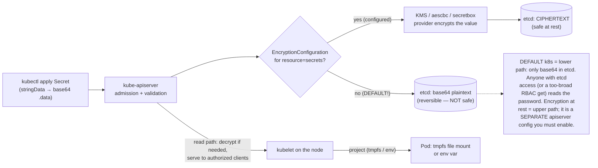

# 02 — Secrets

> The object for **sensitive** config: Secret types (Opaque,
> `dockerconfigjson`, `tls`, `basic-auth`, SA token), why **base64 ≠
> encryption** (decoded live to prove it), encryption-at-rest
> (`EncryptionConfiguration` + KMS, the plaintext-etcd threat), least-privilege
> RBAC, file-mount vs `envFrom` for rotation, env-exposure risk, external
> secret stores (ESO/Vault) and `imagePullSecrets` — applied by **resolving the
> Phase-2 Postgres password stub into a real Secret** and wiring catalog/orders
> `DB_DSN` from it.

**Estimated time:** ~30 min read · ~60 min hands-on
**Prerequisites:** [Part 03 ch.01](01-configmaps.md) — ConfigMap consumption patterns mirror Secret consumption · [Part 01 ch.04](../01-core-workloads/04-replicasets-and-deployments.md) — the Deployment that consumes the DB_DSN
**You'll know after this:** • recognize that base64 is encoding, not encryption, and protect Secrets accordingly · • configure encryption-at-rest with `EncryptionConfiguration` and a KMS provider · • choose between file-mount and `envFrom` for rotation behavior · • write least-privilege RBAC scoped to specific Secret names · • integrate an external secret store (ESO/Vault) for the Bookstore DB credentials

<!-- tags: security, secrets, encryption-at-rest, kms, eso, rbac -->

## Why this exists

[ch.01](01-configmaps.md) externalized catalog's *non-secret* config. But the
Bookstore has a credential problem it has deliberately deferred since
[Part 01 ch.05](../01-core-workloads/05-statefulsets.md): the Postgres
StatefulSet's password is an **inline plaintext env stub** with a
`# TODO(Phase 3)` marker, and catalog/orders don't talk to the database at all
because `DB_DSN` (which embeds that password) was never set. A password in a
pod template — visible in `kubectl get statefulset -o yaml`, in every Git diff,
in the ReplicaSet/StatefulSet history — is exactly what must not ship.

A **Secret** is the Kubernetes object for sensitive key/value data. Mechanically
it is *almost* a ConfigMap, but it is treated differently: a **separate RBAC
surface** (you can grant config without granting credentials), the option of
**encryption at rest** in etcd, kubelet **tmpfs**-backed mounts (never written
to node disk), and typed variants the platform understands
(`kubernetes.io/tls`, `kubernetes.io/dockerconfigjson`, …). This is the
[Secure Configuration](#further-reading) pattern. **Critical caveat up front:**
a Secret's default at-rest protection is **base64 encoding, which is not
encryption** — base64 is trivially reversible. Real protection is *encryption
at rest* + *tight RBAC* + *not committing plaintext*, all covered here.

## Mental model

A Secret is **a ConfigMap that the platform agrees to treat as sensitive** —
same shapes (env / file), but with three differences that matter:

- **It is base64-*encoded*, not encrypted, by default.** `kubectl get secret -o yaml` shows base64; `base64 -d` reverses it instantly. In plain etcd the
  bytes are effectively cleartext. Encoding ≠ secrecy — internalize this.
- **It has its own access-control and protection knobs.** RBAC can allow
  `get configmaps` while denying `get secrets`; the apiserver can
  **encrypt Secrets at rest** (KMS) without encrypting everything; kubelet
  mounts Secrets on **tmpfs** (RAM), not the node filesystem.
- **It has typed variants** so controllers/kubelet can act on them:
  `kubernetes.io/tls` (an Ingress/Gateway cert), `kubernetes.io/dockerconfigjson`
  (an `imagePullSecret`), `kubernetes.io/basic-auth`,
  `kubernetes.io/service-account-token`, and the catch-all `Opaque`.

So a Secret is the *right place* for the DB password — but "right place" only
becomes "actually secure" once you add encryption-at-rest, least-privilege
RBAC, and an external store for real environments. The object is necessary, not
sufficient.

## Diagrams

### Secret write path: apiserver → (encryption provider) → etcd (Mermaid)



### Secret vs. ConfigMap (ASCII)

```
                         ConfigMap                 Secret
 ─────────────────────────────────────────────────────────────────────────
 intent                  non-secret config         sensitive data
 at rest in etcd         plaintext                  base64 (NOT encrypted)*
 *unless                 —                          EncryptionConfiguration+KMS
 RBAC verb to read       get configmaps             get secrets  (separate!)
 kubelet file mount      regular                    tmpfs (RAM, not node disk)
 typed variants          no                         tls / dockercfg / basic-auth / SA
 env vs file             both                       both (file mount preferred —
                                                    rotates; env is frozen+leaky)
 size                    ~1 MiB (etcd)              ~1 MiB (etcd)
 RULE: base64 is ENCODING, not ENCRYPTION. `base64 -d` reverses it instantly.
```

## Hands-on with the Bookstore

**Assumed working directory: the guide repo root (`full-guide/`).** Requires
the `bookstore` namespace, the Postgres StatefulSet
([Part 01 ch.05](../01-core-workloads/05-statefulsets.md)), and the catalog
([Part 01 ch.04](../01-core-workloads/04-replicasets-and-deployments.md)) /
orders ([Part 02 ch.02](../02-networking/02-services.md)) Deployments.

### 1. Create the DB-credentials Secret (resolves the Phase-2 stub)

New file
[`examples/bookstore/raw-manifests/16-db-credentials.yaml`](../examples/bookstore/raw-manifests/16-db-credentials.yaml).
`stringData` lets us write the value in clear; the **apiserver base64-encodes
it into `.data` on write** (identical result to pre-encoding by hand, just
readable):

```yaml
apiVersion: v1
kind: Secret
metadata:
  name: db-credentials
  namespace: bookstore
  labels: { app: postgres, app.kubernetes.io/part-of: bookstore }
type: Opaque
stringData:
  POSTGRES_USER: bookstore
  POSTGRES_PASSWORD: "devpassword"      # DEMO-ONLY — never a real/committed secret
  POSTGRES_DB: bookstore
```

> **This value is demo-only and intentionally throwaway.** It exists in a
> committed file **only** because this guide is a disposable local lab. In any
> real repository you **never** commit a plaintext Secret: you use **Sealed
> Secrets** (encrypted in Git, decrypted in-cluster), the **External Secrets
> Operator**, or **Vault** (covered conceptually below), and you enable
> **encryption at rest**. The same `devpassword` was the Phase-2 inline stub;
> we are now moving it to its proper home and removing it from the workload.

### 2. Migrate Postgres: stub → Secret (the actual rewire)

Previously [`20-postgres-statefulset.yaml`](../examples/bookstore/raw-manifests/20-postgres-statefulset.yaml)
had:

```yaml
          env:
            # --- TODO(Phase 3): replace these with Secret secretKeyRef -----
            - name: POSTGRES_DB
              value: bookstore
            - name: POSTGRES_USER
              value: bookstore
            - name: POSTGRES_PASSWORD
              value: "devpassword"        # STUB ONLY — never a real secret
            - name: PGDATA
              value: /var/lib/postgresql/data/pgdata
```

It is now (stub **fully removed**; the official `postgres` image reads exactly
`POSTGRES_USER`/`POSTGRES_PASSWORD`/`POSTGRES_DB`, so `envFrom: secretRef`
injects precisely those, and only the non-secret `PGDATA` stays inline):

```yaml
          envFrom:
            - secretRef:
                name: db-credentials      # 16-db-credentials.yaml (single source of truth)
          env:
            - name: PGDATA                # not a secret → stays inline
              value: /var/lib/postgresql/data/pgdata
```

That is the migration: **one** Secret is now the source of truth for the DB
identity; the StatefulSet consumes it and the manifest no longer contains a
password. The StatefulSet stays a valid, internally-consistent object
(`pg_isready -U bookstore -d bookstore` probes still match because
`POSTGRES_USER`/`POSTGRES_DB` resolve to `bookstore` from the Secret).

### 3. Wire catalog & orders `DB_DSN` from the same Secret

catalog/orders ([`app/catalog/main.go`](../examples/bookstore/app/catalog/main.go),
[`app/orders/main.go`](../examples/bookstore/app/orders/main.go)) open Postgres
with `pgxpool.New(ctx, os.Getenv("DB_DSN"))`. `pgx` accepts the **libpq
keyword/value DSN**, so we *assemble* `DB_DSN` from the Secret keys using
**`$(VAR)` interpolation** — which requires the referenced vars to be defined
**earlier in the same container's `env` list** (the kubelet substitutes in
order). Both [`10-catalog-deploy.yaml`](../examples/bookstore/raw-manifests/10-catalog-deploy.yaml)
and [`14-orders-deploy.yaml`](../examples/bookstore/raw-manifests/14-orders-deploy.yaml)
gain:

```yaml
          env:
            - name: PORT
              value: "8080"
            # pull the Secret keys FIRST (so $(VAR) below can see them)…
            - name: POSTGRES_USER
              valueFrom:
                secretKeyRef: { name: db-credentials, key: POSTGRES_USER }
            - name: POSTGRES_PASSWORD
              valueFrom:
                secretKeyRef: { name: db-credentials, key: POSTGRES_PASSWORD }
            - name: POSTGRES_DB
              valueFrom:
                secretKeyRef: { name: db-credentials, key: POSTGRES_DB }
            # …then compose the DSN the app reads. Host is the headless Service
            # (Part 01 ch.05); sslmode=disable for the in-cluster local lab.
            - name: DB_DSN
              value: "host=postgres.bookstore.svc.cluster.local port=5432 user=$(POSTGRES_USER) password=$(POSTGRES_PASSWORD) dbname=$(POSTGRES_DB) sslmode=disable"
```

Now catalog reads the `books` table and orders writes the `orders` table
(schema applied by the migration Job,
[Part 01 ch.07](../01-core-workloads/07-jobs-and-cronjobs.md)). The DSN host is
the **same** `postgres.bookstore.svc.cluster.local` the existing NetworkPolicy
already permits (rule 5 catalog→postgres + rule 7 egress) — no policy change is
needed.

Apply Secret **first**, then the consumers:

```sh
# from the repo root (full-guide/)
kubectl apply -f examples/bookstore/raw-manifests/16-db-credentials.yaml
kubectl apply -f examples/bookstore/raw-manifests/20-postgres-statefulset.yaml
kubectl rollout status statefulset/postgres -n bookstore
kubectl apply -f examples/bookstore/raw-manifests/21-db-migrate-job.yaml   # schema
# Wait for the schema BEFORE deploying catalog/orders: catalog's /readyz only
# pings Postgres connectivity (not table existence), so it can go Ready before
# the `books` table exists and then 500 on /books. Gate on the Job completing:
kubectl wait --for=condition=complete job/db-migrate -n bookstore --timeout=120s
kubectl apply -f examples/bookstore/raw-manifests/10-catalog-deploy.yaml
kubectl apply -f examples/bookstore/raw-manifests/14-orders-deploy.yaml
kubectl rollout status deployment/catalog -n bookstore
```

### 4. Prove base64 is NOT encryption (decode it live)

```sh
kubectl get secret db-credentials -n bookstore -o yaml | grep -A3 '^data:'
#   POSTGRES_PASSWORD: ZGV2cGFzc3dvcmQ=    ← looks opaque…
kubectl get secret db-credentials -n bookstore \
  -o jsonpath='{.data.POSTGRES_PASSWORD}' | base64 -d; echo
#   → devpassword     ← …reversed in one command. base64 is ENCODING.
#   Anyone with `get secret` here, or raw etcd access, reads this. That is why
#   encryption-at-rest + tight RBAC + not committing it are MANDATORY for real.

# Inspect the Secret as a FILE mount from an EPHEMERAL public-image Pod
# (catalog is distroless — never exec it). tmpfs-backed, never on node disk:
kubectl run sec-peek -n bookstore --image=busybox:1.36 --restart=Never -i --rm \
  --overrides='
{
  "apiVersion": "v1",
  "spec": {
    "securityContext": {"runAsNonRoot": true, "runAsUser": 65532, "seccompProfile": {"type": "RuntimeDefault"}},
    "containers": [{
      "name":"sec-peek","image":"busybox:1.36",
      "command":["sh","-c","mount | grep /etc/sec; ls -l /etc/sec; cat /etc/sec/POSTGRES_DB"],
      "securityContext": {"allowPrivilegeEscalation": false, "capabilities": {"drop": ["ALL"]}},
      "volumeMounts":[{"name":"sec","mountPath":"/etc/sec","readOnly":true}]
    }],
    "volumes":[{"name":"sec","secret":{"secretName":"db-credentials"}}]
  }
}'
#   (command is in --overrides; `kubectl run` args after `--` would be
#    silently discarded when --overrides sets command, so none are given)
#   → mount shows tmpfs (RAM); one file per key; POSTGRES_DB = "bookstore".
```

> **Lineage / forward refs.** `16-db-credentials.yaml` resolves the Phase-2
> stub for **all** consumers; the matching `# TODO(Phase 3)` in
> `21-db-migrate-job.yaml` is the next to source `PG*` from this Secret (it
> still uses a local stub today and is harmonized in Part 07's Helm hook).
> **Encryption at rest, RBAC hardening, sealed-secrets/ESO/Vault in depth, and
> CIS hardening are [Part 05 ch.04](../05-security/04-secrets-and-cluster-hardening.md)** —
> this chapter establishes the object and the threat; that chapter operationalizes
> the protection.

## How it works under the hood

- **Encoding vs. encryption (the core fact).** A Secret's `data` is **base64**
  purely so arbitrary bytes survive JSON/YAML transport. By default the
  apiserver writes that base64 **straight into etcd** — functionally
  **plaintext at rest**. Anyone who can read etcd (a backup, a compromised
  control-plane node, an over-broad `get secrets` RBAC) reads every secret.
  Base64 provides **zero** confidentiality.
- **Encryption at rest is a separate apiserver feature.** You enable it with an
  **`EncryptionConfiguration`** passed to the kube-apiserver
  (`--encryption-provider-config`), listing providers for `resources: [secrets]`:
  `aescbc`/`aesgcm`/`secretbox` (a local key — better, but the key sits on the
  control plane) or, properly, **`kms`** (a v2 KMS provider — envelope
  encryption with an external KMS/HSM; the data-encryption key is itself
  wrapped by a key the apiserver never stores in clear). Only **after**
  enabling it (and rewriting existing Secrets) is etcd ciphertext. This is
  off by default and is the single most important Secret hardening step —
  detailed in [Part 05 ch.04](../05-security/04-secrets-and-cluster-hardening.md).
- **Secret types.** The platform behaves differently per `type`:
  - **`Opaque`** — arbitrary key/value (the DB credentials).
  - **`kubernetes.io/tls`** — `tls.crt` + `tls.key`; consumed by Ingress
    ([Part 02 ch.04](../02-networking/04-ingress.md)) / Gateway for TLS
    termination.
  - **`kubernetes.io/dockerconfigjson`** — a registry auth blob referenced via
    a Pod's **`imagePullSecrets`** so the kubelet can pull from a private
    registry (supply chain: [Part 05 ch.03](../05-security/03-supply-chain.md)).
  - **`kubernetes.io/basic-auth`** / **`ssh-auth`** — structured cred shapes.
  - **`kubernetes.io/service-account-token`** — a token for a ServiceAccount.
    Modern Kubernetes auto-injects **short-lived, audience-bound projected**
    SA tokens (not a static Secret) via the TokenRequest API; the legacy
    long-lived token Secret is discouraged
    ([Part 05 ch.01](../05-security/01-authn-authz-rbac.md)).
- **kubelet mounts Secrets on tmpfs.** A Secret volume is backed by **tmpfs
  (RAM)**, never written to the node's disk, and removed when the Pod is
  deleted — reducing on-disk exposure. Updates to a Secret propagate to a
  **volume** mount (same atomic `..data` symlink swap and lag as ConfigMaps,
  [ch.01](01-configmaps.md)); **`subPath` again disables that auto-update**.
- **File mount vs. `envFrom`/`env` — file wins for secrets.** An env var is a
  **frozen start-time snapshot** (no rotation without a rollout) **and leaks
  more**: it appears in `/proc/<PID>/environ`, child processes inherit it,
  crash dumps and many logging/error frameworks print the environment, and
  `kubectl describe pod` / debugging surfaces it. A **file mount** rotates
  live (volume sync) and is far less likely to be accidentally logged. Prefer
  **file-mounted Secrets** for credentials; use env only when an app can't read
  a file and accept the rotation/exposure cost. (The Bookstore uses env for
  `DB_DSN` for teaching clarity and because pgx wants a DSN string — in
  production this is a prime candidate for a mounted credential or a sidecar
  that injects it.)
- **RBAC least privilege.** Because reading a Secret returns the cleartext to
  the caller, `get`/`list`/`watch` on `secrets` is a **credential-disclosure
  permission**. Scope it tightly: a workload's ServiceAccount should be able to
  read **only its own** Secrets (ideally none directly — let the kubelet
  project them), and humans should not have blanket `get secrets` in
  production namespaces. `kubectl auth can-i get secrets -n <NS> --as=system:serviceaccount:<NS>:<SA>` audits this
  ([Part 05 ch.01](../05-security/01-authn-authz-rbac.md)). **Tight `get secrets` RBAC is necessary but not sufficient:** `pods/exec` is an equally
  direct disclosure path — anyone who can `kubectl exec` into a running Pod
  reads every env var (incl. an env-mounted Secret like `DB_DSN`) and every
  mounted Secret file straight off that container, with no `get secrets`
  permission at all. `create pods/exec` (and `pods/attach`, `pods/portforward`,
  and broad `pods` `create`/`update` that can mount any Secret) must be locked
  down **together with** `secrets` verbs — restricting one while leaving the
  other open is a common false sense of security
  ([Part 05 ch.01](../05-security/01-authn-authz-rbac.md)).
- **External secret stores (why & what).** Committing Secret YAML — even
  base64 — puts plaintext in Git history forever. Two standard answers:
  **Sealed Secrets** (a controller; you commit an *encrypted* `SealedSecret`
  that only the in-cluster controller can decrypt into a real Secret) and the
  **External Secrets Operator** / **Vault** (the source of truth is an external
  manager — AWS/GCP/Azure Secrets Manager, HashiCorp Vault — and an operator
  *syncs* it into a Kubernetes Secret, or a CSI driver mounts it directly).
  These keep cleartext out of Git and centralize rotation/audit; conceptual
  here, operational in [Part 05 ch.04](../05-security/04-secrets-and-cluster-hardening.md).
- **NetworkPolicy is irrelevant to Secret injection.** A Secret (like a
  ConfigMap) is delivered by the **kubelet from the apiserver**, not over the
  Pod network. The Bookstore's default-deny NetworkPolicy
  ([Part 02 ch.06](../02-networking/06-network-policies.md)) does **not** need a
  rule for `secretKeyRef`/`envFrom` — only the actual *Postgres TCP connection*
  needs an egress allow, which already exists (catalog/orders → postgres:5432).

## Production notes

> **In production:** **enable encryption at rest for Secrets** (KMS v2 provider)
> and rotate the KMS key — and remember you must **re-encrypt existing Secrets**
> after enabling it (`kubectl get secrets -A -o yaml | kubectl replace -f -`).
> Without this, etcd (and every etcd backup) holds your credentials in
> reversible base64 ([Part 05 ch.04](../05-security/04-secrets-and-cluster-hardening.md)).
> On EKS use KMS envelope encryption; GKE Application-layer Secrets Encryption
> (Cloud KMS); AKS KMS etcd encryption — all opt-in, none default.

> **In production:** **never commit plaintext Secret manifests.** Use **Sealed
> Secrets** or the **External Secrets Operator / Vault / cloud Secrets
> Manager** so Git holds only ciphertext or a reference. The single committed
> `db-credentials` here is a documented local-lab exception; treat a real one
> as a leaked credential the moment it lands in history.

> **In production:** **prefer file-mounted Secrets over env vars** for
> credentials — they rotate with the volume sync and don't leak via
> `/proc/<PID>/environ`, child processes, crash dumps, or framework log lines
> that dump the environment. Reserve env-var secrets for apps that genuinely
> can't read a file, and never log the environment.

> **In production:** **tight RBAC on `secrets`.** `get secrets` is
> credential disclosure. No human or workload should have cluster-wide
> `get/list secrets`; scope ServiceAccounts to their own Secrets (or none),
> and audit with `kubectl auth can-i`. Combine with admission policy to block
> over-broad Secret RBAC ([Part 05 ch.01](../05-security/01-authn-authz-rbac.md)).

> **In production:** **rotate** credentials and design for it. A rotation is
> only safe if consumers pick up the new value: file mounts re-sync (good); env
> consumers need a rollout (plan it). Use short-lived, dynamically-issued
> credentials (Vault dynamic DB creds, IRSA/Workload Identity for cloud
> access) where possible so a leaked secret has a short blast-radius window.

> **In production:** scope **`imagePullSecrets`** and TLS Secrets too — a
> `dockerconfigjson` is registry credentials; a `kubernetes.io/tls` Secret is
> your private key. Same RBAC/encryption discipline as any other Secret.

## Quick Reference

```sh
kubectl create secret generic <NAME> -n <NS> \
  --from-literal=PASSWORD=… --dry-run=client -o yaml          # author (Opaque)
kubectl create secret tls <NAME> --cert=c.pem --key=k.pem -n <NS>
kubectl create secret docker-registry <NAME> \
  --docker-server=… --docker-username=… --docker-password=… -n <NS>
kubectl get secret <NAME> -n <NS> -o jsonpath='{.data.KEY}' | base64 -d  # PROVE: reversible
kubectl auth can-i get secrets -n <NS> \
  --as=system:serviceaccount:<NS>:<SA>                        # RBAC audit
# inspect a Secret as files from an EPHEMERAL public image (NEVER exec a
# distroless app Pod): busybox + a secret volume, `mount`+`cat` (tmpfs).
```

Minimal Secret + safest consumption (file mount):

```yaml
apiVersion: v1
kind: Secret
metadata: { name: app-creds, namespace: <NS> }
type: Opaque
stringData: { PASSWORD: "…" }     # apiserver base64s into .data (encoding, NOT crypto)
---
# in a container — file mount (rotates, low-leak) preferred over env:
volumeMounts: [ { name: creds, mountPath: /etc/creds, readOnly: true } ]
volumes:      [ { name: creds, secret: { secretName: app-creds } } ]
# (env form, only if unavoidable):
# env: [ { name: PASSWORD, valueFrom: { secretKeyRef: { name: app-creds, key: PASSWORD } } } ]
```

Checklist:

- [ ] Sensitive data in a **Secret**, never a ConfigMap
- [ ] Understood: base64 = encoding; **encryption at rest is separate** (enable it)
- [ ] No plaintext Secret committed (Sealed Secrets / ESO / Vault for real)
- [ ] **File mount** preferred over env for credentials (rotation + leak)
- [ ] RBAC on `secrets` least-privilege (it discloses cleartext)
- [ ] `subPath` Secret mounts understood to **not** auto-rotate
- [ ] Rotation path defined (file = live; env = needs rollout)
- [ ] `imagePullSecrets` / TLS Secrets scoped with the same discipline

## Test your understanding

> Try each before opening the answer drawer. The act of trying is the exercise; the answer is the check.

1. **A teammate stores a database password in a Secret and asserts "it's encoded, so it's safe in Git". Why are they wrong, and what's the minimum production hardening?**
   <details><summary>Show answer</summary>

   `data` in a Secret is **base64-encoded, not encrypted**. `kubectl get secret ... -o jsonpath='{.data.X}' | base64 -d` reverses it in one command, and unencrypted etcd holds the same reversible bytes. Minimum production hardening: (a) enable apiserver encryption-at-rest with a KMS v2 provider (b) never commit plaintext — use Sealed Secrets, ESO/Vault, or cloud Secrets Manager (c) tight RBAC on `get secrets` (see §Mental model, §Encoding vs. encryption).

   </details>

2. **You apply tight RBAC denying everyone `get secrets` in `prod` and consider yourself secure. A colleague points out a critical gap. What's still wide open?**
   <details><summary>Show answer</summary>

   `pods/exec` (and `pods/attach`, `pods/portforward`) — anyone who can `exec` into a running Pod reads every env var and mounted Secret file from inside, no `get secrets` permission needed. Equally `pods` create/update can mount any Secret into a new Pod. RBAC on Secrets is necessary but **not sufficient**; lock down exec/attach/port-forward and pod-creation in production namespaces together (see §How it works under the hood, "Tight `get secrets` RBAC is necessary but not sufficient").

   </details>

3. **The Bookstore catalog reads `DB_DSN` from env. You enable file-mounted Secrets and want rotation. What does the env-form *not* give you, and what changes with a mounted credential?**
   <details><summary>Show answer</summary>

   Env vars are a frozen start-time snapshot — rotating the Secret has no effect on the running process until a rollout, and env vars leak via `/proc/<PID>/environ`, child processes, crash dumps, framework log lines. A mounted Secret volume is tmpfs-backed (RAM, never on node disk), keys re-sync on Secret updates (atomic `..data` symlink swap), and the app re-reads the file to pick up the new value without rollout. The trade-off is the app must read a file (see §File mount vs. envFrom/env).

   </details>

4. **A teammate sets `subPath` on a Secret mount to drop one file at `/etc/tls/cert.pem`. After enabling encryption-at-rest and rotating the Secret via ESO sync, the file isn't updating. What's wrong?**
   <details><summary>Show answer</summary>

   Same as ConfigMap: `subPath` mounts are resolved once at container start and are *not* part of the synced projection — they opt out of auto-update. The Secret in etcd updates and gets decrypted on read, but the projected file on this Pod doesn't refresh. Use a full-directory mount (no `subPath`) and reference `/etc/tls/cert.pem` from the directory, or accept that rotation needs a Pod rollout (see §How it works under the hood, "kubelet mounts Secrets on tmpfs").

   </details>

5. **Hands-on extension: apply `16-db-credentials.yaml`, then `kubectl get secret db-credentials -n bookstore -o jsonpath='{.data.POSTGRES_PASSWORD}' | base64 -d`. What appears, and what's the takeaway about default Kubernetes Secret protection?**
   <details><summary>What you should see</summary>

   `devpassword` — the original plaintext. This is the live demonstration that base64 is encoding for transport, not security: anyone with `get secrets` in this namespace (or anyone reading an etcd snapshot) sees the password in one command. The takeaway is concrete: real protection requires encryption-at-rest *and* tight RBAC *and* not committing plaintext — pick all three (see §4. Prove base64 is NOT encryption).

   </details>

## Further reading

- **Lukša, _Kubernetes in Action_ 2e, ch.9 — "Configuration via ConfigMaps,
  Secrets, and the Downward API"** — Secret types, consumption, and the
  encoding-vs-encryption distinction.
- **Rosso et al., _Production Kubernetes_, ch.7 — "Secret Management"** —
  encryption at rest, external secret managers, and rotation in production;
  **Ibryam & Huß, _Kubernetes Patterns_ 2e, ch.25 — _Secure Configuration_**
  — the pattern and its trade-offs.
- Official:
  <https://kubernetes.io/docs/concepts/configuration/secret/> and
  <https://kubernetes.io/docs/tasks/administer-cluster/encrypt-data/>
  (encryption at rest).
