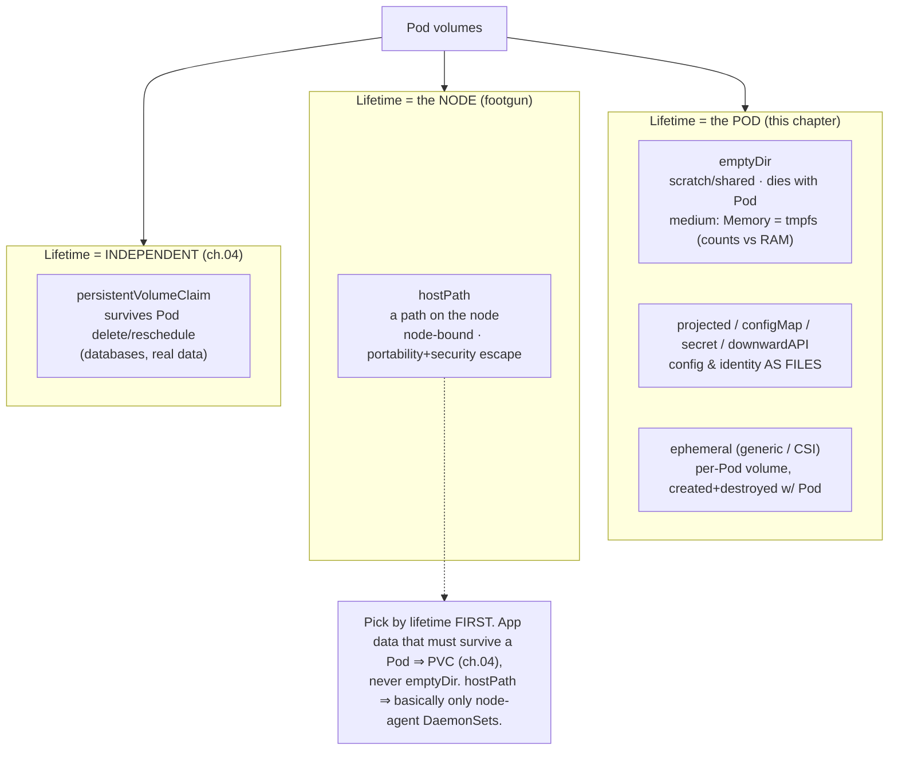

# 03 — Volumes

> A **volume** is storage attached to a Pod that outlives individual container
> restarts but (mostly) **not** the Pod — distinct from *persistent* volumes
> ([ch.04](04-persistent-storage.md)): `emptyDir` (incl. `medium: Memory`,
> `sizeLimit`), the `hostPath` footgun, `projected` (combine
> secret+configMap+downwardAPI+SA token), `downwardAPI` (pod metadata as
> files/env), ephemeral volumes (generic & CSI), and mount mechanics /
> propagation — applied by giving catalog a scratch dir and a self-awareness
> volume.

**Estimated time:** ~15 min read · ~30 min hands-on
**Prerequisites:** [Part 01 ch.01](../01-core-workloads/01-pods.md) — Pods and volume mounts · [Part 03 ch.01](01-configmaps.md) — projecting config into the filesystem
**You'll know after this:** • distinguish Pod-lifetime volumes from persistent storage · • use `emptyDir` (including `medium: Memory` and `sizeLimit`) appropriately · • recognize the `hostPath` security/portability footgun · • compose a `projected` volume from Secret + ConfigMap + DownwardAPI + SA token · • inject Pod metadata into a container via the DownwardAPI

<!-- tags: storage, volumes, emptydir, hostpath, projected-volumes, downwardapi -->

## Why this exists

A container's filesystem is **ephemeral and private**: when a container
restarts (liveness failure, crash,
[Part 01 ch.02](../01-core-workloads/02-health-and-lifecycle.md)), everything
it wrote is gone, and a sidecar in the same Pod
([Part 01 ch.01](../01-core-workloads/01-pods.md)) can't see another
container's filesystem at all. Lots of legitimate needs don't fit that: a
scratch/cache directory that should survive a container restart within the same
Pod; a path **shared between containers** in a Pod (init writes, main reads); a
way to hand a container its **own identity** (pod name, namespace, the labels a
NetworkPolicy uses) as files; mounting a ConfigMap/Secret
([ch.01](01-configmaps.md)/[ch.02](02-secrets.md)) as files.

A **volume** is the Pod-level abstraction for all of this: a directory,
declared on the Pod, mounted into one or more containers, whose **lifetime is
tied to the Pod** (not the container). This chapter is the **non-persistent**
volume types — scratch, in-memory, metadata, projected. The moment you need
data to **outlive the Pod itself** (a database's files), that is a
*PersistentVolume*, a different lifecycle entirely — [ch.04](04-persistent-storage.md).
Getting this distinction right is the whole point: most "I lost my data" bugs
are an `emptyDir` used where a PVC was needed.

## Mental model

A volume is **a directory the Pod owns and lends to its containers**. The Pod
declares `spec.volumes[]`; each container `volumeMounts[]` a subset at chosen
paths. The key axis is **lifetime**:

- **Tied to the Pod (this chapter):** `emptyDir` (created empty when the Pod is
  scheduled, deleted when the Pod is removed — survives *container* restarts,
  not *Pod* deletion), `configMap`/`secret`/`downwardAPI`/`projected` (config &
  identity materialized as files), generic/CSI **ephemeral** (a per-Pod volume
  provisioned and destroyed with the Pod).
- **Independent of the Pod ([ch.04](04-persistent-storage.md)):** a
  `persistentVolumeClaim` — storage that exists before and after any Pod and is
  re-attached across rescheduling. (Postgres uses this; an `emptyDir` there
  would be data loss.)

And one footgun to name now: **`hostPath`** mounts a path from the **node's**
filesystem into the Pod — node-bound, non-portable, and a serious security
escape (a Pod can read/modify the host). Almost never the right tool for app
data; reserved for node-agent DaemonSets
([Part 01 ch.06](../01-core-workloads/06-daemonsets.md)).

## Diagrams

### Volume taxonomy by lifetime & purpose (Mermaid)



### Pod ↔ volume mount lifecycle (ASCII)

```
 Pod scheduled ──► kubelet creates volumes ──► containers mount them
 ───────────────────────────────────────────────────────────────────────
   spec.volumes:                     │  per container:
     - name: scratch  emptyDir{}     │   volumeMounts:
     - name: podinfo  downwardAPI{}  │     - name: scratch  /tmp/cache
                                     │     - name: podinfo  /etc/podinfo (ro)
   ┌───────────── Pod lifetime ──────────────────────────────┐
   │ container crash/restart: volume CONTENTS SURVIVE          │
   │   (emptyDir keeps data across restartCount++)             │
   │ Pod deleted/rescheduled: emptyDir & projected GONE        │
   │   (new Pod = new empty volumes; THIS is why DBs need PVC) │
   └──────────────────────────────────────────────────────────┘
   subPath mount = resolved ONCE at start → no ConfigMap/Secret live-update
   mountPropagation: None (default) | HostToContainer | Bidirectional(rare)
```

## Hands-on with the Bookstore

**Assumed working directory: the guide repo root (`full-guide/`).** Requires
the `bookstore` namespace and the catalog Deployment
([Part 01 ch.04](../01-core-workloads/04-replicasets-and-deployments.md)), now
also carrying its ConfigMap ([ch.01](01-configmaps.md)) and Secret-built
`DB_DSN` ([ch.02](02-secrets.md)).

### 1. Add an `emptyDir` scratch + a `downwardAPI` self-awareness volume

Edit [`10-catalog-deploy.yaml`](../examples/bookstore/raw-manifests/10-catalog-deploy.yaml)
— the catalog container gets a capped scratch dir and a read-only
`downwardAPI` volume exposing the Pod's own identity (name, namespace, labels,
CPU limit):

```yaml
        - name: catalog
          image: bookstore/catalog:dev
          # ... env (ch.01/ch.02), probes (Part 01 ch.02), resources (ch.03) ...
          volumeMounts:
            - name: scratch               # ephemeral per-Pod scratch
              mountPath: /tmp/cache        # dies with the Pod (NOT persistence)
            - name: podinfo               # the Pod's own identity, as files
              mountPath: /etc/podinfo
              readOnly: true
      volumes:
        - name: scratch
          emptyDir:
            sizeLimit: 64Mi               # cap it; medium:Memory would count vs RAM
        - name: podinfo
          downwardAPI:
            items:
              - path: pod_name
                fieldRef: { fieldPath: metadata.name }
              - path: pod_namespace
                fieldRef: { fieldPath: metadata.namespace }
              - path: pod_labels
                fieldRef: { fieldPath: metadata.labels }
              - path: cpu_limit
                resourceFieldRef:
                  containerName: catalog
                  resource: limits.cpu
```

(One cumulative file — this chapter's increment is the two volumes; `env` is
from [ch.01](01-configmaps.md)/[ch.02](02-secrets.md).)

```sh
# from the repo root (full-guide/)
# catalog carries DB_DSN, so it needs Postgres + the schema Job to go Ready
# (its /readyz pings Postgres). These were brought up in ch.02 (Secrets);
# re-applying is idempotent and keeps this chapter runnable on its own.
kubectl apply -f examples/bookstore/raw-manifests/16-db-credentials.yaml
kubectl apply -f examples/bookstore/raw-manifests/20-postgres-statefulset.yaml
kubectl rollout status statefulset/postgres -n bookstore
kubectl apply -f examples/bookstore/raw-manifests/21-db-migrate-job.yaml   # schema
kubectl wait --for=condition=complete job/db-migrate -n bookstore --timeout=120s
kubectl apply -f examples/bookstore/raw-manifests/10-catalog-deploy.yaml
kubectl rollout status deployment/catalog -n bookstore
```

### 2. Read the downwardAPI files — from an EPHEMERAL public-image Pod

catalog is **distroless** (`gcr.io/distroless/static:nonroot` — see
[`examples/bookstore/app/`](../examples/bookstore/app/README.md)):
**no shell, no `cat`, no `ls`** — `kubectl exec catalog -- cat /etc/podinfo/...`
**cannot work** (there is no `/bin/sh` to exec, no coreutils). This is a
recurring rule in this guide: **to inspect a mounted volume on a distroless
workload, run a separate ephemeral Pod on a *public* image that mounts an
equivalent volume**, never exec the app Pod. Here the *content* (this Pod's
own metadata) is what we demonstrate, with a debug Pod that has its **own**
downwardAPI volume:

```sh
# Ephemeral busybox Pod with the SAME downwardAPI volume shape — it exposes
# ITS OWN identity (that is what downwardAPI does: each Pod sees itself):
kubectl run dapi-peek -n bookstore --image=busybox:1.36 --restart=Never -i --rm \
  --overrides='
{
  "apiVersion": "v1",
  "spec": {
    "securityContext": {"runAsNonRoot": true, "runAsUser": 65532, "seccompProfile": {"type": "RuntimeDefault"}},
    "containers": [{
      "name":"dapi-peek","image":"busybox:1.36",
      "command":["sh","-c","echo NAME=$(cat /etc/podinfo/pod_name); echo NS=$(cat /etc/podinfo/pod_namespace); echo --- labels ---; cat /etc/podinfo/pod_labels; echo; echo CPU_LIMIT=$(cat /etc/podinfo/cpu_limit)"],
      "securityContext": {"allowPrivilegeEscalation": false, "capabilities": {"drop": ["ALL"]}},
      "resources":{"limits":{"cpu":"250m"}},
      "volumeMounts":[{"name":"podinfo","mountPath":"/etc/podinfo","readOnly":true}]
    }],
    "volumes":[{"name":"podinfo","downwardAPI":{"items":[
      {"path":"pod_name","fieldRef":{"fieldPath":"metadata.name"}},
      {"path":"pod_namespace","fieldRef":{"fieldPath":"metadata.namespace"}},
      {"path":"pod_labels","fieldRef":{"fieldPath":"metadata.labels"}},
      {"path":"cpu_limit","resourceFieldRef":{"containerName":"dapi-peek","resource":"limits.cpu"}}
    ]}}]
  }
}'
#   (command is in --overrides; args after `--` are silently discarded once
#    --overrides sets command, so none are passed)
#   → NAME=dapi-peek  NS=bookstore  labels: run="dapi-peek"  CPU_LIMIT=1
#   (cpu_limit is rounded UP to whole cores: 250m → 1. This is exactly how a
#   JVM/Go app can self-tune GOMAXPROCS / heap from its OWN limits.)

# Verify catalog's volumes are wired (authoritative: the rendered Pod spec —
# do NOT exec the distroless app):
kubectl get pod -n bookstore -l app=catalog -o \
  jsonpath='{range .items[0].spec.volumes[*]}{.name}{"\n"}{end}'
#   → scratch  podinfo  (+ the ch.01 configMap / ch.02 secret-derived envs)
```

> **Why downwardAPI exists (the *Self Awareness* pattern).** An app often needs
> to know "who am I?" — its Pod name (to register itself, tag logs/metrics,
> shard work), its namespace, its labels, its resource limits (to size thread
> pools/heap to the cgroup, not the node). Hardcoding is wrong (it's
> per-replica and dynamic). `downwardAPI` injects that **from the Pod's own
> spec/status** as files or env. This is the
> [Self Awareness](#further-reading) pattern; the Bookstore uses it so a
> container can right-size itself to *its* limits and identify *itself*.

### 3. emptyDir survives a container restart, not a Pod delete

```sh
# Write to the scratch dir from an ephemeral Pod that shares an emptyDir
# between two containers (init writes, main reads) — the canonical emptyDir use:
kubectl run ed-demo -n bookstore --image=busybox:1.36 --restart=Never -i --rm \
  --overrides='
{
  "apiVersion": "v1",
  "spec": {
    "securityContext": {"runAsNonRoot": true, "runAsUser": 65532, "seccompProfile": {"type": "RuntimeDefault"}},
    "initContainers":[{"name":"seed","image":"busybox:1.36",
      "command":["sh","-c","echo hello-from-init > /work/note"],
      "securityContext": {"allowPrivilegeEscalation": false, "capabilities": {"drop": ["ALL"]}},
      "volumeMounts":[{"name":"scratch","mountPath":"/work"}]}],
    "containers":[{"name":"main","image":"busybox:1.36",
      "command":["sh","-c","cat /work/note"],
      "securityContext": {"allowPrivilegeEscalation": false, "capabilities": {"drop": ["ALL"]}},
      "volumeMounts":[{"name":"scratch","mountPath":"/work"}]}],
    "volumes":[{"name":"scratch","emptyDir":{"sizeLimit":"16Mi"}}]
  }
}'
#   (command is in --overrides; args after `--` are silently discarded once
#    --overrides sets command, so none are passed)
#   → hello-from-init  : the init container's write is visible to main via the
#     shared emptyDir. Delete the Pod and that data is GONE (Pod-scoped). For
#     data that must outlive the Pod ⇒ a PVC (ch.04), never emptyDir.
```

> **Lineage / forward refs.** These volumes are catalog's scratch + identity;
> they are **Pod-scoped** by design. Durable data (Postgres) is a
> **PersistentVolume** via the StatefulSet's `volumeClaimTemplates`
> ([ch.04](04-persistent-storage.md)). NetworkPolicy
> ([Part 02 ch.06](../02-networking/06-network-policies.md)) is unaffected —
> volumes are local to the Pod/node, not network traffic.

## How it works under the hood

- **`emptyDir`.** Created as an **empty directory when the Pod is assigned to a
  node**, on the node's disk by default (under the kubelet's directory),
  removed when the Pod is deleted. It **survives container restarts** (the
  container's `restartCount` increments but the Pod, hence the volume,
  persists) — that's its purpose: a crash-safe scratch/cache *within a Pod*,
  and the standard way two containers in one Pod share files.
  **`medium: Memory`** backs it with **tmpfs (RAM)** — fast, wiped on Pod
  removal, and (modern Kubernetes) **counts against the container's memory
  limit/`sizeLimit`** (so an unbounded in-memory `emptyDir` can OOM the Pod,
  [Part 01 ch.03](../01-core-workloads/03-resources-and-qos.md)). Always set
  **`sizeLimit`**; a runaway `emptyDir` can otherwise fill the node's disk and
  trigger eviction.
- **`hostPath` — why it's a footgun.** It mounts an **arbitrary path from the
  node's filesystem** into the Pod. Problems: (1) **node-bound** — the data is
  on *that* node; reschedule elsewhere and it's gone or different (no
  portability, no HA); (2) **security escape** — a writable `hostPath` (e.g.
  `/`, `/var/run/docker.sock`, `/etc`) lets a Pod read/modify the host and
  often **escalate to node root**; Pod Security Standards
  ([Part 05 ch.02](../05-security/02-pod-security.md)) restrict it for exactly
  this reason. Legitimate use is essentially **node-agent DaemonSets**
  (reading `/var/log`, node metrics) — never application data. Reach for a PVC
  ([ch.04](04-persistent-storage.md)) or `emptyDir`, not `hostPath`.
- **`downwardAPI`.** Exposes fields of the **Pod's own** spec/status to the
  container, as files (a volume) or env vars (`valueFrom.fieldRef` /
  `resourceFieldRef`). Available: `metadata.name/namespace/uid/labels/annotations`,
  `spec.nodeName/serviceAccountName`, `status.podIP/hostIP`, and
  **container resource fields** (`limits.cpu/memory`, `requests.*`). Resource
  values are normalized (CPU rounded **up** to whole cores; memory to bytes).
  Volume-form labels/annotations **update** if they change (same sync as
  ConfigMap volumes, [ch.01](01-configmaps.md)); env-form is a start snapshot.
  This is the mechanism behind the [Self Awareness](#further-reading) pattern.
- **`projected`.** Combines **multiple** sources — `configMap`, `secret`,
  `downwardAPI`, and **`serviceAccountToken`** — into **one** directory. The
  `serviceAccountToken` projection is how modern Kubernetes delivers a
  **short-lived, audience-scoped, auto-rotated** SA token (via the TokenRequest
  API) instead of a static token Secret — the default `kube-api-access-*`
  volume auto-added to every Pod is exactly a projected volume (token + CA +
  namespace). You also use `projected` to assemble, say, a TLS Secret + a
  config file + the pod name under a single mount.
- **Ephemeral volumes.** For a per-Pod volume that should be **provisioned and
  destroyed with the Pod** but use a real storage driver: **generic ephemeral
  volumes** (`ephemeral.volumeClaimTemplate` inline in the Pod — a full PVC's
  worth of storage, dynamically provisioned, deleted with the Pod) and **CSI
  ephemeral volumes** (a CSI driver provides the volume inline, e.g. secrets
  via the Secrets Store CSI driver). They bridge "Pod-scoped lifetime" with
  "real storage backend" — unlike `emptyDir` (node scratch) and unlike a PVC
  (independent lifetime, [ch.04](04-persistent-storage.md)).
- **Mount mechanics & `subPath`.** The kubelet sets up volumes **before**
  starting containers; each `volumeMounts` entry bind-mounts the volume (or a
  **`subPath`** of it) at `mountPath`. `subPath` mounts a single
  file/sub-directory (e.g. drop one config file into `/etc` without hiding the
  rest) **but is resolved once at start** — so a `subPath`-mounted
  ConfigMap/Secret key does **not** live-update
  ([ch.01](01-configmaps.md)/[ch.02](02-secrets.md)). `readOnly: true` (used
  for `podinfo`) prevents the container writing the mount.
- **Mount propagation.** `mountPropagation` controls whether mounts created
  *inside* the volume are visible across the container/host boundary: **`None`**
  (default — isolated), **`HostToContainer`** (the container sees host
  submounts under the path), **`Bidirectional`** (container-created mounts
  propagate to the host — powerful and dangerous, requires privileged; used by
  storage/CSI node plugins, not apps). Apps should stay on the default.

## Production notes

> **In production:** **`emptyDir` is not durability.** It dies with the Pod —
> a rescheduled Pod (node drain, eviction, rollout) starts with an empty one.
> Use it for caches/scratch/inter-container handoff only; anything that must
> survive a Pod restart-as-a-new-Pod needs a **PVC**
> ([ch.04](04-persistent-storage.md)). Always set **`sizeLimit`** (and know
> `medium: Memory` counts against the memory limit and can OOM you).

> **In production:** **treat `hostPath` as a red flag.** It breaks scheduling
> portability and is a primary container-escape vector; Pod Security
> "restricted" forbids it. The only routine use is node-agent DaemonSets
> reading host paths read-only ([Part 01 ch.06](../01-core-workloads/06-daemonsets.md)).
> For app data use a CSI-backed PVC; for inline per-Pod storage use **generic
> ephemeral volumes**, not `hostPath`.

> **In production:** use **`downwardAPI`/`projected`** to make workloads
> self-aware instead of hardcoding identity. Inject `metadata.name`/`podIP`
> for self-registration and log/metric tagging, and **`limits.cpu`/`memory`**
> so the runtime sizes itself to its cgroup (Go `GOMAXPROCS`, JVM heap) rather
> than the node — a common cause of throttling/OOM when an app reads the
> *node's* CPU count ([Part 01 ch.03](../01-core-workloads/03-resources-and-qos.md)).

> **In production:** prefer **projected `serviceAccountToken`** (short-lived,
> audience-bound, auto-rotated) over legacy long-lived SA token Secrets, and
> mount only the token audiences a workload needs
> ([Part 05 ch.01](../05-security/01-authn-authz-rbac.md)). Disable
> auto-mount of the default token where a Pod doesn't call the API.

> **In production:** for sensitive files prefer **CSI ephemeral / Secrets
> Store CSI** or projected Secrets over copying secrets into an `emptyDir` —
> keep credentials on tmpfs with a managed lifecycle, never on a node-disk
> scratch volume ([ch.02](02-secrets.md)).

## Quick Reference

```sh
kubectl get pod <P> -n <NS> -o jsonpath='{.spec.volumes}'      # declared volumes
kubectl describe pod <P> -n <NS> | sed -n '/Volumes:/,/QoS/p'  # mounts + types
# inspect a mounted volume from an EPHEMERAL PUBLIC image (NEVER exec a
# distroless app Pod): run busybox with the same volume(s) and cat the files.
kubectl explain pod.spec.volumes.downwardAPI.items               # field schema
kubectl explain pod.spec.volumes.emptyDir                        # medium/sizeLimit
```

Minimal volumes skeleton (scratch + identity):

```yaml
spec:
  containers:
    - name: app
      volumeMounts:
        - { name: scratch, mountPath: /tmp/scratch }
        - { name: podinfo, mountPath: /etc/podinfo, readOnly: true }
  volumes:
    - name: scratch
      emptyDir: { sizeLimit: 64Mi }          # medium: Memory ⇒ tmpfs (counts vs RAM)
    - name: podinfo
      downwardAPI:
        items:
          - { path: name,   fieldRef: { fieldPath: metadata.name } }
          - { path: labels, fieldRef: { fieldPath: metadata.labels } }
          - { path: cpu,    resourceFieldRef: { containerName: app, resource: limits.cpu } }
# projected (combine sources, incl. a short-lived SA token):
#   projected: { sources: [ {configMap:{name:c}}, {secret:{name:s}},
#                {downwardAPI:{...}}, {serviceAccountToken:{path:token,expirationSeconds:3600}} ] }
```

Checklist:

- [ ] Volume **lifetime** matches the need (Pod-scoped here vs. PVC in [ch.04](04-persistent-storage.md))
- [ ] `emptyDir` has `sizeLimit`; `medium: Memory` known to count vs RAM/OOM
- [ ] No `hostPath` for app data (escape + non-portable; DaemonSet-only)
- [ ] `downwardAPI`/`projected` used for identity & limit-aware sizing
- [ ] `subPath` mounts understood to **not** live-update ([ch.01](01-configmaps.md)/[ch.02](02-secrets.md))
- [ ] Distroless apps inspected via an **ephemeral public-image** Pod, not `exec`
- [ ] `mountPropagation` left default unless a node/CSI plugin truly needs it

## Test your understanding

> Try each before opening the answer drawer. The act of trying is the exercise; the answer is the check.

1. **Why does `emptyDir` survive a container restart but not a Pod restart-as-a-new-Pod? What's the architectural distinction this enforces?**
   <details><summary>Show answer</summary>

   `emptyDir` lifetime is *the Pod*. A container crash and restart keeps the same Pod and same volume; the Pod being deleted (and a new Pod created on possibly a different node) deletes the volume and creates a new empty one. Architecturally this enforces "Pods are disposable cattle" — anything that must survive a Pod's life must live in a PV (independent lifetime), not an emptyDir. Most "I lost my data" bugs are emptyDir where a PVC was needed (see §Mental model).

   </details>

2. **A teammate proposes `hostPath: /var/log/app` to share logs between Pods on the same node. List three reasons this is the wrong tool, and what should they use instead.**
   <details><summary>Show answer</summary>

   (1) Node-bound: reschedule a Pod elsewhere and the logs are gone. (2) Security escape: a writable hostPath lets a Pod read/modify the host filesystem — restricted PSA blocks it for this reason. (3) Not portable across clouds/clusters. The right tool is a node-agent **DaemonSet** that reads `/var/log` and forwards logs (per-Pod hostPath is an anti-pattern); for inter-Pod data sharing within the same Pod use a shared volume; across Pods use a real backing store (see §`hostPath` footgun and §Production notes).

   </details>

3. **You set `emptyDir: { medium: Memory, sizeLimit: 100Mi }` on a Pod with `resources.limits.memory: 128Mi`. Walk through what happens when the app writes 80Mi of data into the volume and then allocates 80Mi more in its heap.**
   <details><summary>Show answer</summary>

   `medium: Memory` is tmpfs backed by RAM and **counts against the container's memory limit**. 80Mi tmpfs + 80Mi heap = 160Mi, exceeding the 128Mi limit, so the kernel OOM-kills the container with `OOMKilled`. Always `sizeLimit` your in-memory emptyDir and account for it in the memory limit — runaway tmpfs is a classic OOM cause (see §How it works under the hood, "`emptyDir` `medium: Memory`").

   </details>

4. **A Go service uses `runtime.NumCPU()` to set worker pool size and is OOM-killed in production despite low average CPU. The downwardAPI's `limits.cpu` would have helped — how, exactly?**
   <details><summary>Show answer</summary>

   `runtime.NumCPU()` reads the *node's* CPU count, not the cgroup limit. On a 64-core node with a 500m CPU limit, the app spins up 64 workers and creates massive scheduler contention plus excess heap pressure. Project `resourceFieldRef: { containerName: <name>, resource: limits.cpu }` as an env or file; the app reads it (rounded up to whole cores) and sizes pools to its actual cgroup. This is the Self Awareness pattern (see §Why downwardAPI exists).

   </details>

5. **Hands-on extension: deploy the catalog Deployment with the `scratch` emptyDir. Run `kubectl exec` on a *debug* Pod that mounts an equivalent emptyDir, write a file, then `kubectl delete pod`. Recreate the Pod. What do you see, and what does this prove about the lifetime distinction?**
   <details><summary>What you should see</summary>

   The new Pod's `/tmp/cache` is empty — the previous Pod's volume was deleted with that Pod. Now mount a PVC instead (looking ahead to ch.04) and the file persists. This is the lifetime distinction in one experiment: emptyDir is "Pod-scoped scratch", PVC is "independent durable storage". Most "data loss in rollouts" stories are this exact mistake — picked wrong storage for the requirement (see §3. emptyDir survives a container restart, not a Pod delete).

   </details>

## Further reading

- **Lukša, _Kubernetes in Action_ 2e, ch.7 — "Attaching storage volumes to
  Pods"** — `emptyDir`, `hostPath`, the Downward API, projected volumes, and
  mount mechanics.
- **Ibryam & Huß, _Kubernetes Patterns_ 2e — *Configuration Resource* (ch.20)**
  (config-as-files) and the **_Self Awareness_ (ch.14)** pattern — why a Pod
  consuming its own metadata via the Downward API is a first-class pattern.
- Official:
  <https://kubernetes.io/docs/concepts/storage/volumes/> and
  <https://kubernetes.io/docs/tasks/inject-data-application/downward-api-volume-expose-pod-information/>.
