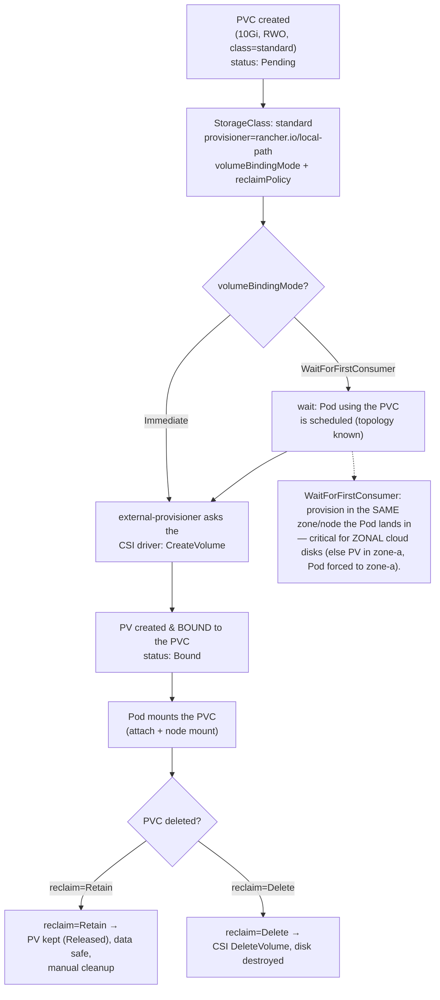
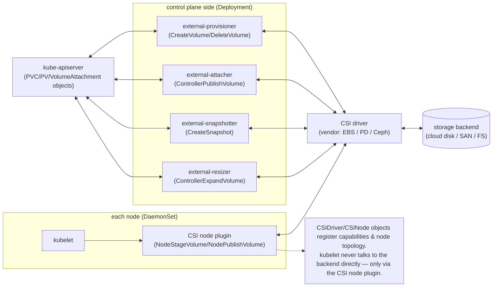

# 04 — Persistent storage

> Storage with a lifetime **independent of any Pod**: the PV/PVC bind
> lifecycle, StorageClass + dynamic provisioning,
> `volumeBindingMode: WaitForFirstConsumer` (topology), access modes (RWO/ROX/RWX/RWOP), reclaim
> policy (Retain/Delete), PVC expansion, CSI architecture
> (external-provisioner/attacher/node plugin, `CSIDriver`/`CSINode`),
> StatefulSet `volumeClaimTemplates` + `persistentVolumeClaimRetentionPolicy`,
> and VolumeSnapshots — applied by deep-diving the Bookstore's Postgres
> storage.

**Estimated time:** ~30 min read · ~60 min hands-on
**Prerequisites:** [Part 03 ch.03](03-volumes.md) — Pod-lifetime volume basics · [Part 01 ch.05](../01-core-workloads/05-statefulsets.md) — StatefulSets use `volumeClaimTemplates`
**You'll know after this:** • trace the PV/PVC bind lifecycle and explain `WaitForFirstConsumer` · • choose access modes (RWO/ROX/RWX/RWOP) and a reclaim policy correctly · • configure dynamic provisioning via a StorageClass · • read CSI architecture (external-provisioner/attacher/node plugin, `CSIDriver`, `CSINode`) · • expand a PVC and take a VolumeSnapshot

<!-- tags: storage, persistent-storage, pv-pvc, storageclass, csi, volumesnapshot -->

## Why this exists

[ch.03](03-volumes.md) gave the Pod scratch and identity volumes — all of which
**die with the Pod**. Postgres ([Part 01 ch.05](../01-core-workloads/05-statefulsets.md))
cannot tolerate that: its data files must survive a Pod restart-as-a-new-Pod, a
node drain, a rollout, a reschedule to another node. Storage whose lifecycle is
**decoupled from any Pod** is a fundamentally different object than a volume.

Kubernetes models this with two objects that **separate the concern of "I need
storage" from "here is a concrete disk"**: a **PersistentVolumeClaim (PVC)** is
the workload's *request* ("10Gi, ReadWriteOnce"); a **PersistentVolume (PV)**
is the *actual* storage (an EBS volume, a Ceph RBD image, a local-path
directory). A **StorageClass** ties them together by **dynamically
provisioning** a PV to satisfy a PVC on demand via a **CSI driver** (or a
legacy external provisioner, as with kind's `rancher.io/local-path` — see the
CSI note below). The Pod references the PVC and is now decoupled from the
storage's identity and
lifetime — exactly the abstraction the Postgres StatefulSet relies on. This is
the storage half of running stateful workloads; the *should you* question is
[ch.05](05-stateful-data-patterns.md).

## Mental model

PVC/PV is **the same "request vs. reality" split as a Pod and a Node**, applied
to storage, plus a factory:

- **PVC** = the claim. "I want this much storage, with these access modes,
  (optionally) from this StorageClass." The workload only ever names the PVC.
- **PV** = the fulfilled storage — a real volume on a real backend, with its
  own lifecycle. It is **bound 1:1** to a PVC.
- **StorageClass** = the **provisioner + parameters** ("which CSI driver, what
  disk type, what binding/reclaim/expansion policy"). With dynamic
  provisioning, creating a PVC referencing a class makes the class's provisioner
  **create a PV automatically** and bind it. No class / no provisioner ⇒ you
  must pre-create PVs (static provisioning) or the PVC stays `Pending`.
- **Binding is sticky and exclusive.** Once a PVC↔PV bind, that PV is that
  PVC's for life; deleting the PVC triggers the PV's **reclaim policy**
  (`Delete` destroys the backing disk; `Retain` keeps it for manual recovery).

So a workload says "I need storage" (PVC); the platform turns that into "here
is a disk" (PV via StorageClass/CSI); the disk **outlives the Pod**. The
StatefulSet's `volumeClaimTemplates` is just **a PVC factory: one PVC per
ordinal**, re-attached to the same ordinal forever.

## Diagrams

### PVC → StorageClass dynamic provision → PV bind lifecycle (Mermaid)



### CSI component interactions (Mermaid)



> **`rancher.io/local-path` is a *legacy external provisioner*, not a CSI
> driver.** It only does dynamic `CreateVolume`/`DeleteVolume` (a host path per
> PVC) — it implements **none** of the CSI node-plugin RPCs
> (`NodeStageVolume`/`NodePublishVolume`) or `CreateSnapshot`, which is exactly
> why kind has no `VolumeAttachment`/snapshot machinery and snapshots don't
> work there ([ch.05](05-stateful-data-patterns.md)). It is used in this guide
> only because it is the one provisioner that runs locally with zero setup.
> The **modern standard is CSI** (EBS / PD / Azure Disk / Ceph); everything in
> the diagram above (attacher, snapshotter, resizer, `CSIDriver`/`CSINode`)
> applies to **CSI** drivers, not to the legacy local-path provisioner.

### Access-mode matrix (ASCII)

```
 mode  short  meaning                                  typical backend
 ───────────────────────────────────────────────────────────────────────────
 RWO   ReadWriteOnce      one NODE may mount r/w        block: EBS/PD/AzDisk
                          (many Pods on THAT node ok)   (Postgres uses this)
 ROX   ReadOnlyMany       many nodes mount READ-ONLY    pre-populated images
 RWX   ReadWriteMany      many nodes mount r/w          file: NFS/EFS/CephFS
                          (needs a SHARED-FS backend)   (NOT plain block!)
 RWOP  ReadWriteOncePod   exactly ONE POD r/w (1.29+)   strict single-writer
 ───────────────────────────────────────────────────────────────────────────
  Requesting RWX on a block-only backend ⇒ PVC stays Pending / fails.
  The backend must SUPPORT the mode; the PVC only REQUESTS it.
```

## Hands-on with the Bookstore

**Assumed working directory: the guide repo root (`full-guide/`).** Requires
the `bookstore` namespace and the Postgres StatefulSet
([Part 01 ch.05](../01-core-workloads/05-statefulsets.md)) now Secret-backed
([ch.02](02-secrets.md)). On `kind`/`k3d` the `rancher.io/local-path`
provisioner and a default StorageClass (`standard` on kind, `local-path` on
k3d) already exist.

### 1. Inspect what the StatefulSet already provisioned

The StatefulSet's `volumeClaimTemplates` (already in
[`20-postgres-statefulset.yaml`](../examples/bookstore/raw-manifests/20-postgres-statefulset.yaml))
is a **PVC factory**: one PVC per ordinal, `data-postgres-0`,
re-bound to the same ordinal forever:

```yaml
  volumeClaimTemplates:                   # one PVC per Pod; retained across restarts
    - metadata:
        name: data
      spec:
        accessModes: ["ReadWriteOnce"]
        resources:
          requests:
            storage: 1Gi
        # storageClassName omitted → default class (kind: "standard", k3d: "local-path")
```

```sh
# from the repo root (full-guide/)
kubectl get storageclass
#   NAME       PROVISIONER             RECLAIMPOLICY  VOLUMEBINDINGMODE
#   standard   rancher.io/local-path   Delete         WaitForFirstConsumer  (kind)
kubectl get pvc,pv -n bookstore
#   PVC data-postgres-0  Bound  pvc-…  1Gi  RWO  standard
#   PV  pvc-…            Bound  bookstore/data-postgres-0   (dynamically created)
kubectl describe pvc data-postgres-0 -n bookstore | sed -n '1,20p'
```

### 2. Add an explicit StorageClass (see the knobs)

New file
[`examples/bookstore/raw-manifests/17-storageclass.yaml`](../examples/bookstore/raw-manifests/17-storageclass.yaml)
— an explicitly-configured class so the provisioner / binding mode / reclaim /
expansion are visible (it is **opt-in** scaffolding; the StatefulSet still
works on the default class without it):

```yaml
apiVersion: storage.k8s.io/v1
kind: StorageClass
metadata:
  name: bookstore-local
  labels: { app.kubernetes.io/part-of: bookstore }
provisioner: rancher.io/local-path        # kind/k3d built-in
volumeBindingMode: WaitForFirstConsumer   # bind on Pod schedule (topology-aware)
reclaimPolicy: Delete                     # delete the PV with its PVC (Retain = keep)
allowVolumeExpansion: true                # PVCs may be grown later (backend permitting)
```

```sh
kubectl apply -f examples/bookstore/raw-manifests/17-storageclass.yaml
kubectl get storageclass bookstore-local -o yaml | \
  grep -E 'provisioner|volumeBindingMode|reclaimPolicy|allowVolumeExpansion'
#   To USE it: set `storageClassName: bookstore-local` on the volumeClaimTemplate.
```

### 3. Prove data persists across a Pod delete (the whole point)

```sh
# Write a row, delete the Pod, StatefulSet recreates postgres-0 → SAME PVC/PV
# re-attached → data is still there. postgres uses the OFFICIAL image (it HAS a
# shell), so `kubectl exec` is fine here (unlike the distroless app Pods):
kubectl exec -n bookstore postgres-0 -- \
  psql -U bookstore -d bookstore -c \
  'CREATE TABLE IF NOT EXISTS persist_demo(x int); INSERT INTO persist_demo VALUES (42);'

kubectl delete pod postgres-0 -n bookstore        # StatefulSet recreates it
kubectl wait -n bookstore --for=condition=Ready pod/postgres-0 --timeout=120s
kubectl get pvc data-postgres-0 -n bookstore      # STILL Bound to the SAME PV

kubectl exec -n bookstore postgres-0 -- \
  psql -U bookstore -d bookstore -c 'SELECT * FROM persist_demo;'
#   →  x = 42 : the PV outlived the Pod and was re-attached to the same
#     ordinal. THIS is persistent storage vs. ch.03's emptyDir (which would be
#     empty here). Same demo as Part 01 ch.05 — now you know the PV/CSI machinery
#     underneath it.

# PVCs OUTLIVE the StatefulSet by default (data-safety):
kubectl delete statefulset postgres -n bookstore --cascade=orphan
kubectl get pvc -n bookstore        # data-postgres-0 STILL THERE (not deleted!)
kubectl apply -f examples/bookstore/raw-manifests/20-postgres-statefulset.yaml
#   postgres-0 comes back and RE-ATTACHES the surviving PVC → data intact.
```

> **Lineage / forward refs.** `17-storageclass.yaml` is opt-in teaching
> scaffolding; the Postgres StatefulSet's `volumeClaimTemplates`
> ([Part 01 ch.05](../01-core-workloads/05-statefulsets.md)) is the canonical
> persistent storage. **Backup/restore via VolumeSnapshot and the "run a DB on
> Kubernetes?" decision are [ch.05](05-stateful-data-patterns.md)**;
> etcd/Velero cluster backup is
> [Part 08 ch.02](../08-day-2-operations/02-backup-and-dr.md). NetworkPolicy is
> unaffected — storage attach/mount is node/CSI, not Pod network.

## How it works under the hood

- **PVC ↔ PV binding.** The control plane's **PV controller** matches a
  `Pending` PVC to a suitable PV (size ≥ request, compatible access modes,
  matching `storageClassName`). **Dynamic provisioning**: if the class has a
  provisioner, a PV is **created on demand** to satisfy the PVC (no manual PV).
  Binding is **1:1 and exclusive** — that PV serves only that PVC until the PVC
  is deleted. Static provisioning (admin pre-creates PVs) still exists for
  pre-existing/again-special storage.
- **StorageClass = provisioner + parameters + policies.** `provisioner` names
  the CSI driver; `parameters` are vendor-specific (disk type, IOPS,
  filesystem, encryption); plus `volumeBindingMode`, `reclaimPolicy`,
  `allowVolumeExpansion`. A class marked default
  (`storageclass.kubernetes.io/is-default-class`) is used by PVCs that omit
  `storageClassName` (how the Postgres template binds with no class set).
- **`volumeBindingMode`.** **`Immediate`**: provision/bind the PV as soon as
  the PVC is created — but the scheduler must then place the Pod where that PV
  already is. **`WaitForFirstConsumer`**: delay provisioning/binding until a
  Pod using the PVC is **scheduled**, so the volume is created in the **same
  topology (zone/node)** the Pod landed in. This is essential for **zonal cloud
  disks** (EBS/PD/Azure Disk are single-AZ): `Immediate` can strand a PV in
  zone-a and force every future Pod into zone-a (or deadlock if that zone is
  full). kind's `standard` uses `WaitForFirstConsumer`.
- **Access modes.** `ReadWriteOnce` (one **node** r/w — multiple Pods on that
  node can share it; the norm for block storage and for Postgres),
  `ReadOnlyMany` (many nodes, read-only), `ReadWriteMany` (many nodes r/w —
  **only** with a shared-filesystem backend: NFS/EFS/CephFS, **not** plain
  block), `ReadWriteOncePod` (exactly **one Pod**, v1.29+ — strict single
  writer). The PVC *requests* a mode; the **backend must support it** or the
  PVC won't bind.
- **Reclaim policy.** When a **bound PVC is deleted**: `Delete` (the CSI driver
  **destroys** the backing volume — data gone; the common dynamic default) or
  `Retain` (the PV moves to `Released`, the **data is preserved** for manual
  recovery/rebinding). Use `Retain` for anything whose accidental deletion
  would be catastrophic (databases).
- **PVC expansion.** If the StorageClass has `allowVolumeExpansion: true` and
  the CSI driver supports it, you **grow** a PVC by editing
  `spec.resources.requests.storage` upward (never shrink). The
  **external-resizer** calls `ControllerExpandVolume`, then the filesystem is
  grown. **Most modern CSI drivers do *online* expansion** (the volume and
  filesystem grow with the Pod running, no restart) when they advertise the
  `ONLINE` node-expansion capability — which is the common case on
  EBS/PD/Azure-Disk CSI. Only **offline-expansion** drivers require the Pod to
  be restarted (or briefly detached) for the filesystem resize to take effect.
  Plan capacity so you can expand, not migrate.
- **CSI architecture.** Storage is out-of-tree via the **Container Storage
  Interface**. A typical driver ships: a **controller** Deployment with
  sidecars — **external-provisioner** (`CreateVolume`/`DeleteVolume`),
  **external-attacher** (`ControllerPublishVolume` → `VolumeAttachment`
  objects), **external-snapshotter** (`CreateSnapshot`,
  [ch.05](05-stateful-data-patterns.md)), **external-resizer** — and a
  per-node **DaemonSet** **node plugin** (`NodeStageVolume`/`NodePublishVolume`
  — format and mount on the node). **`CSIDriver`** advertises driver
  capabilities; **`CSINode`** records per-node driver/topology info the
  scheduler uses. The **kubelet** never touches the backend directly — only via
  the node plugin.
- **StatefulSet `volumeClaimTemplates` + retention.** The StatefulSet
  controller instantiates **one PVC per ordinal** from the template
  (`data-postgres-0`, …), each **owned by the StatefulSet but not deleted with
  the Pod** — deleting/rescheduling `postgres-0` re-binds the **same** PVC
  (sticky storage = the StatefulSet's core promise,
  [Part 01 ch.05](../01-core-workloads/05-statefulsets.md)). By default these
  PVCs **outlive the StatefulSet** (deliberate data safety — `--cascade=orphan`
  in the hands-on shows it). **`persistentVolumeClaimRetentionPolicy`** tunes
  this: `whenDeleted`/`whenScaled` ∈ `Retain` (default) | `Delete` — set
  `Delete` only when you genuinely want the data destroyed on
  scale-down/delete.
- **VolumeSnapshot (overview).** A CSI driver that supports snapshots exposes
  **`VolumeSnapshot`** (a point-in-time copy of a PVC) governed by a
  **`VolumeSnapshotClass`** (which driver, deletion policy). You can then
  provision a **new PVC `dataSource: <SNAPSHOT>`** (restore/clone). These are
  **CRDs** from the external-snapshotter, not built-in API — depth + the
  Bookstore Postgres snapshot/restore drill is [ch.05](05-stateful-data-patterns.md).

## Production notes

> **In production:** **`reclaimPolicy: Retain` for stateful data.** A dynamic
> default of `Delete` means deleting a PVC (a fat-fingered `kubectl delete`, an
> over-eager GitOps prune) **destroys the disk**. Use `Retain` for
> database/PVC-of-record storage and make deletion a deliberate, runbooked
> operation ([Part 08 ch.02](../08-day-2-operations/02-backup-and-dr.md)). A
> reclaim policy is not a backup — you still need snapshots/`pg_dump`
> ([ch.05](05-stateful-data-patterns.md)).

> **In production (EKS/GKE/AKS):** block PVs (EBS/PD/Azure Disk) are **zonal**
> and `ReadWriteOnce`. Always use **`WaitForFirstConsumer`** so the disk is
> created in the Pod's zone, and plan AZ topology + anti-affinity
> ([Part 04 ch.02](../04-scheduling/02-affinity-taints-topology.md)) — a zonal
> disk pins its Pod to one AZ, so node loss in that AZ blocks reschedule until
> the AZ recovers. **`ReadWriteMany`** needs a file backend (EFS/Filestore/
> Azure Files) — it is **not** available on plain block disks. On bare `kind`
> the `local-path` provisioner is **node-local and not HA** — fine for
> learning, never for prod data.

> **In production:** size for **expansion, not migration.** Ensure
> `allowVolumeExpansion: true` on the class and the CSI driver supports online
> resize; growing a PVC is easy, moving data between volumes is an outage.
> Monitor PV usage and alert before full (a full DB volume is downtime).

> **In production:** pick the **CSI driver and its parameters** deliberately —
> disk type/IOPS/throughput and **encryption at rest on the volume** are
> StorageClass `parameters`; pair with **encrypted Secrets**
> ([ch.02](02-secrets.md)). Run the cloud's managed CSI driver (or a mature
> one like Ceph/Rook) — storage is the least forgiving thing to get wrong.

> **In production:** set **`persistentVolumeClaimRetentionPolicy` explicitly**
> on StatefulSets. The default keeps PVCs after delete/scale-down (orphaned
> cost, or surprising re-attach of stale data); choose `Retain` vs `Delete`
> per workload and document the teardown
> ([Part 01 ch.05](../01-core-workloads/05-statefulsets.md),
> [Part 08 ch.02](../08-day-2-operations/02-backup-and-dr.md)).

## Quick Reference

```sh
kubectl get storageclass                                       # provisioner/binding/reclaim
kubectl get pvc,pv -n <NS> -o wide                             # bind status + backend
kubectl describe pvc <PVC> -n <NS>                             # events (why Pending?)
kubectl get pvc <PVC> -n <NS> \
  -o jsonpath='{.spec.storageClassName} {.status.phase}{"\n"}'
# grow a PVC (class must allowVolumeExpansion; never shrink):
kubectl patch pvc <PVC> -n <NS> -p '{"spec":{"resources":{"requests":{"storage":"5Gi"}}}}'
kubectl get volumeattachment                                    # CSI attach state
kubectl get csidrivers ; kubectl get csinodes                    # driver capabilities/topology
```

Minimal StorageClass + PVC + StatefulSet template:

```yaml
apiVersion: storage.k8s.io/v1
kind: StorageClass
metadata: { name: fast }
provisioner: <CSI-DRIVER>            # e.g. ebs.csi.aws.com / rancher.io/local-path
volumeBindingMode: WaitForFirstConsumer
reclaimPolicy: Retain                # Retain for data-of-record
allowVolumeExpansion: true
---
apiVersion: v1
kind: PersistentVolumeClaim
metadata: { name: data, namespace: <NS> }
spec:
  accessModes: ["ReadWriteOnce"]     # RWX needs a shared-FS backend
  storageClassName: fast
  resources: { requests: { storage: 10Gi } }
---
# StatefulSet (per-ordinal PVC factory + explicit retention):
spec:
  persistentVolumeClaimRetentionPolicy: { whenDeleted: Retain, whenScaled: Retain }
  volumeClaimTemplates:
    - metadata: { name: data }
      spec:
        accessModes: ["ReadWriteOnce"]
        storageClassName: fast
        resources: { requests: { storage: 10Gi } }
```

Checklist:

- [ ] Need is Pod-independent durability (else a [ch.03](03-volumes.md) volume)
- [ ] `reclaimPolicy: Retain` for data whose loss is catastrophic
- [ ] `volumeBindingMode: WaitForFirstConsumer` (zonal-disk topology safety)
- [ ] Access mode supported by the backend (RWX ⇒ shared FS, not block)
- [ ] `allowVolumeExpansion: true` + driver supports resize (grow, don't migrate)
- [ ] StatefulSet `persistentVolumeClaimRetentionPolicy` set deliberately
- [ ] PVCs/PVs monitored for capacity; teardown runbooked (PVCs outlive the set)
- [ ] CSI driver + parameters (type/IOPS/encryption) chosen deliberately

## Test your understanding

> Try each before opening the answer drawer. The act of trying is the exercise; the answer is the check.

1. **Why is `volumeBindingMode: WaitForFirstConsumer` essential when using zonal cloud disks (EBS/PD/Azure Disk), and what specific failure does `Immediate` produce?**
   <details><summary>Show answer</summary>

   Zonal disks are tied to a single AZ. With `Immediate`, the PV is provisioned at PVC creation time in *some* zone — and the scheduler is then forced to place the Pod in *that* zone (or fail if it's full). With `WaitForFirstConsumer`, provisioning is deferred until a Pod is actually scheduled, so the disk is created in the Pod's zone, restoring topology freedom. The classic `Immediate` failure: PVCs stranded in one AZ, Pods unschedulable in another (see §`volumeBindingMode`).

   </details>

2. **A teammate sets `reclaimPolicy: Delete` on the StorageClass for the production database. Why is this dangerous, and what's the right default?**
   <details><summary>Show answer</summary>

   `Delete` means a fat-fingered `kubectl delete pvc` (or an over-eager GitOps prune) calls `DeleteVolume` on the CSI driver and destroys the backing disk — data gone, no recovery. Use `Retain` for data of record: PVC deletion moves the PV to `Released`, the backing disk stays intact for manual recovery. Reclaim policy is *not* a backup; you still need snapshots (see §Reclaim policy and §Production notes).

   </details>

3. **You request `accessModes: [ReadWriteMany]` on a PVC backed by AWS EBS via the EBS CSI driver. The PVC stays `Pending`. Why?**
   <details><summary>Show answer</summary>

   EBS is a block device — block storage is fundamentally single-attach, so it supports RWO and ROX-with-restrictions but not RWX (no clustered filesystem layer). RWX needs a shared-filesystem backend like NFS/EFS/CephFS/Azure Files. The PVC requests a mode; the *backend* must support it or binding fails. Switch to the EFS CSI driver (or accept RWO and design around it) (see §Access-mode matrix).

   </details>

4. **You scale a StatefulSet from 3 to 1 replicas. What happens to the PVCs of ordinals 1 and 2, and what's the design rationale?**
   <details><summary>Show answer</summary>

   By default the PVCs `data-postgres-1` and `data-postgres-2` are retained — the Pods are gone but the volumes (and their data) sit there. Scaling back up to 3 re-attaches them to the same ordinals. Rationale: data safety. If you want them destroyed, set `persistentVolumeClaimRetentionPolicy: { whenScaled: Delete }` explicitly. The default favors not losing data over saving storage cost (see §How it works under the hood, StatefulSet retention).

   </details>

5. **Hands-on extension: with the Bookstore Postgres running, `INSERT` a row, `kubectl delete pvc data-postgres-0 --force` (you'd have to delete the Pod first), then watch what happens. What does this teach about the reclaim policy in effect?**
   <details><summary>What you should see</summary>

   On kind with `local-path` and `reclaimPolicy: Delete` (the default), the PV is destroyed, the local directory removed, and a freshly-created Pod gets a new empty PVC. On a cluster with `reclaimPolicy: Retain`, the PV would move to `Released` with data intact — recoverable by manual `claimRef` clearing and re-binding. Same delete operation, very different outcomes depending on the class's reclaim policy. This is why prod databases use Retain (see §3. Prove data persists across a Pod delete).

   </details>

## Further reading

- **Lukša, _Kubernetes in Action_ 2e, ch.8 — "Persisting data in
  PersistentVolumes"** — PV/PVC, StorageClasses, dynamic provisioning, access
  modes, reclaim policy, and StatefulSet storage.
- **Rosso et al., _Production Kubernetes_, ch.4 — "Container Storage"** — CSI
  architecture, provisioning at scale, and storage operational concerns in
  production.
- Official:
  <https://kubernetes.io/docs/concepts/storage/persistent-volumes/> and
  <https://kubernetes.io/docs/concepts/storage/storage-classes/> (and the CSI
  developer docs at <https://kubernetes-csi.github.io/docs/>).
