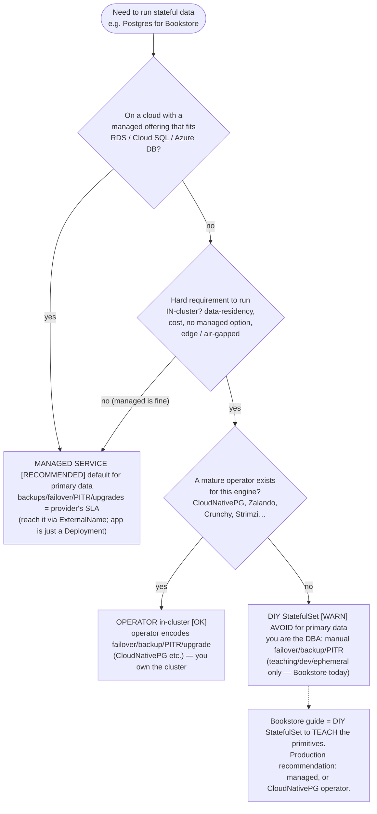

# 05 — Stateful data patterns

> The harder questions persistent storage forces: VolumeSnapshot
> backup/restore & clones; **should you run a database on Kubernetes at all?**
> (managed RDS/Cloud SQL vs. an operator vs. a DIY StatefulSet — failure
> domains, backups, failover, PITR); the **operator pattern** as the real
> answer for stateful; data gravity & migration; quorum/replicas — applied with
> a Bookstore Postgres snapshot + restore drill and an explicit production
> recommendation.

**Estimated time:** ~15 min read · ~60 min hands-on
**Prerequisites:** [Part 03 ch.04](04-persistent-storage.md) — the PV/PVC mechanics being applied · [Part 01 ch.05](../01-core-workloads/05-statefulsets.md) — the StatefulSet running the data tier
**You'll know after this:** • take and restore a VolumeSnapshot for a Bookstore Postgres clone · • compare managed DB (RDS/Cloud SQL), an operator, and a DIY StatefulSet on failure domains, backup, failover, PITR · • articulate the operator pattern as the real answer for stateful · • reason about data gravity and migration cost · • make and justify a production stateful-on-Kubernetes recommendation

<!-- tags: storage, stateful, operators, cnpg, backups, snapshot-restore -->

## Why this exists

[ch.04](04-persistent-storage.md) made Postgres's data **durable across Pod
restarts**. Durable is necessary but nowhere near sufficient for a database in
production. A bound PV survives a reschedule; it does **not** give you: a
**backup** (a deleted/corrupted table is gone on every replica and every
snapshot-of-the-corruption), **failover** (one Postgres Pod is still a single
point of failure regardless of the StatefulSet,
[Part 01 ch.05](../01-core-workloads/05-statefulsets.md)), **point-in-time
recovery**, safe **version upgrades**, or **replication topology**. A
StatefulSet gives identity + storage + ordering — the *plumbing* — not the
*operational behavior of a database*.

This chapter is the honest conclusion of Part 03: persistent storage lets you
run stateful workloads, and the **right question is whether you should**, and
if so **how**. The answers are a small decision space — **managed database**,
**operator**, or **DIY StatefulSet** — plus the **operator pattern** as the
mechanism that encodes database operations as software. This is the
[Stateful Service](#further-reading) pattern taken to its production
conclusion; the operator mechanism itself is
[Part 08 ch.05](../08-day-2-operations/05-operators-and-crds.md).

## Mental model

Running stateful data on Kubernetes is **a build-vs-buy decision about
operational burden**, not a YAML problem:

- **Storage durability ≠ data safety.** A PV/snapshot faithfully preserves
  whatever you have — *including corruption and a `DROP TABLE`*. **Backups are
  a separate, logical concern** (snapshots are crash-consistent point copies;
  `pg_dump`/WAL archiving are logical/PITR) and **untested backups don't
  exist**.
- **A StatefulSet is plumbing, not a DBA.** Identity/storage/ordering — yes;
  failover, replication, PITR, safe upgrades — **no**. That logic has to come
  from *somewhere*: a human runbook (fragile), an **operator** (software that
  encodes it), or a **managed service** (someone else's operator + SLA).
- **The decision space is three options:** **Managed** (RDS/Cloud SQL/Azure
  Database — least operational burden, a cloud bill, less control);
  **Operator** in-cluster (CloudNativePG, Zalando, Crunchy, Strimzi for Kafka —
  the operator runs the DBA logic; you own the cluster); **DIY StatefulSet**
  (you are the DBA — almost never the right answer for primary data).
- **Data gravity is real.** State is the hardest thing to move; the storage
  decision constrains your cluster, cloud, and DR for years. Decide it
  deliberately, early.

So: the Bookstore's teaching Postgres StatefulSet is correct *for learning the
primitives* and explicitly **not** what you'd run in production for real
customer data — and this chapter says exactly what you would.

## Diagrams

### Decision: managed DB vs. operator vs. DIY StatefulSet (Mermaid)



### Snapshot / restore drill timeline (ASCII)

```
 t0  steady state            postgres-0  ──mounts──►  PVC data-postgres-0  ─► PV
 ───────────────────────────────────────────────────────────────────────────────
 t1  take snapshot           VolumeSnapshot postgres-snap-0  ◄─ source: PVC
                             (CSI CreateSnapshot; status.readyToUse=true)
 t2  disaster                bad migration / DROP TABLE / volume corruption
 t3  provision from snap     new PVC  data-postgres-restore
                                 spec.dataSource: VolumeSnapshot postgres-snap-0
 t4  bring DB up on restore  point a fresh postgres at data-postgres-restore,
                             verify rows, then cut traffic over
 ───────────────────────────────────────────────────────────────────────────────
  Snapshot = crash-consistent POINT copy (not PITR; not logical). It restores
  state AS OF t1 — including anything wrong that already existed at t1.
  Logical/PITR (pg_dump + WAL archiving / an operator) covers t1→t2 gap.
```

## Hands-on with the Bookstore

**Assumed working directory: the guide repo root (`full-guide/`).** Requires
the Postgres StatefulSet ([ch.04](04-persistent-storage.md), Secret-backed
[ch.02](02-secrets.md)) so PVC `data-postgres-0` exists.

### 1. A VolumeSnapshot of the Postgres PVC (+ restore drill)

New file
[`examples/bookstore/raw-manifests/18-postgres-snapshot.yaml`](../examples/bookstore/raw-manifests/18-postgres-snapshot.yaml):

```yaml
apiVersion: snapshot.storage.k8s.io/v1
kind: VolumeSnapshotClass
metadata: { name: bookstore-csi-snapclass }
driver: hostpath.csi.k8s.io        # MUST equal the PVC's CSI driver (placeholder)
deletionPolicy: Delete
---
apiVersion: snapshot.storage.k8s.io/v1
kind: VolumeSnapshot
metadata:
  name: postgres-snap-0
  namespace: bookstore
  labels: { app: postgres, app.kubernetes.io/part-of: bookstore }
spec:
  volumeSnapshotClassName: bookstore-csi-snapclass
  source:
    persistentVolumeClaimName: data-postgres-0   # ch.04's volumeClaimTemplate PVC
```

> **CRD-backed — intrinsic dry-run/apply behavior (exactly like the Gateway
> API objects in `51-gateway.yaml`).** `VolumeSnapshot` /
> `VolumeSnapshotClass` are **not built-in kinds** — they are CRDs from the
> external-snapshotter project (`snapshot.storage.k8s.io`), installed with the
> snapshot-controller and a snapshot-capable CSI driver. So
> `kubectl apply --dry-run=client -f` (or a whole-dir client dry-run) on a
> cluster **without those CRDs** prints
> `no matches for kind "VolumeSnapshot" in version "snapshot.storage.k8s.io/v1"` — that is **expected**, not a manifest defect;
> schema correctness is verified by reading + the official API reference.
> kind's default `local-path` provisioner **does not support snapshots**: to
> actually run this use a snapshot-capable CSI driver (e.g. the local
> `csi-hostpath-driver`, or EBS/PD/Azure-Disk CSI in cloud) and install the
> snapshot CRDs + controller
> (<https://github.com/kubernetes-csi/external-snapshotter>).

On a snapshot-capable cluster, the drill is:

```sh
# from the repo root (full-guide/) — snapshot-capable cluster only.
# 1) seed a row, then snapshot the PVC:
kubectl exec -n bookstore postgres-0 -- psql -U bookstore -d bookstore -c \
  'CREATE TABLE IF NOT EXISTS snap_demo(x int); INSERT INTO snap_demo VALUES (7);'
kubectl apply -f examples/bookstore/raw-manifests/18-postgres-snapshot.yaml
kubectl get volumesnapshot postgres-snap-0 -n bookstore \
  -o jsonpath='{.status.readyToUse}{"\n"}'        # → true when complete

# 2) "disaster", then restore: provision a NEW PVC FROM the snapshot.
cat <<'EOF' | kubectl apply -f -
apiVersion: v1
kind: PersistentVolumeClaim
metadata: { name: data-postgres-restore, namespace: bookstore }
spec:
  accessModes: ["ReadWriteOnce"]
  resources: { requests: { storage: 1Gi } }
  dataSource:
    name: postgres-snap-0
    kind: VolumeSnapshot
    apiGroup: snapshot.storage.k8s.io
EOF
#   3) start a throwaway postgres bound to data-postgres-restore and verify
#      `SELECT * FROM snap_demo;` → 7  (state restored AS OF the snapshot).
#   Then cut traffic over / promote. Document this as the restore runbook
#   (Part 08 ch.02). A snapshot is crash-consistent, NOT PITR — it restores
#   exactly what existed at snapshot time (including pre-existing corruption).
```

### 2. The honest production recommendation

> **In production: do not run the Bookstore's teaching Postgres StatefulSet for
> real data.** It is correct for *learning the primitives* (identity, PVC,
> ordering, snapshots) and explicitly wrong for production: one replica = a SPOF,
> no automated failover, no PITR, manual upgrades, `local-path` is node-local
> and not HA. For real customer data choose either a **managed Postgres**
> (RDS / Cloud SQL / Azure Database — backups, HA, PITR, patching are the
> provider's SLA; the app becomes a plain Deployment talking to it, optionally
> via an `ExternalName` Service,
> [Part 02 ch.02](../02-networking/02-services.md)) **or**, if you must run
> in-cluster, the **CloudNativePG operator** (or Zalando/Crunchy) which encodes
> streaming replication, automated failover, WAL archiving/PITR, and
> rolling minor upgrades as software. The operator mechanism (CRDs +
> controller) is [Part 08 ch.05](../08-day-2-operations/05-operators-and-crds.md);
> the capstone ([Part 09](../09-end-to-end-bookstore/01-bookstore-end-to-end.md)) notes this
> swap explicitly.

## How it works under the hood

- **Snapshots are crash-consistent point copies, not backups or PITR.** A
  `VolumeSnapshot` triggers the CSI driver's `CreateSnapshot` — a block-level
  point-in-time copy of the **PVC as it is at that instant** (like pulling the
  power and copying the disk: the filesystem/DB recovers via its journal/WAL on
  restore). It faithfully preserves **whatever was there — including a
  half-finished bad migration or a `DROP TABLE` that already ran**. It is **not**
  a logical export (`pg_dump`) and **not** point-in-time recovery. Real DB
  backup strategy = periodic logical/base backups **plus** continuous WAL/redo
  archiving for PITR — which is precisely the operational logic an **operator**
  or **managed service** provides and a bare StatefulSet does not.
- **Restore = provision a new PVC `dataSource` the snapshot.** You don't
  "restore in place"; you create a **new PVC** with
  `spec.dataSource: {kind: VolumeSnapshot, ...}` (or clone directly from
  another PVC with `dataSource: {kind: PersistentVolumeClaim}` if the driver
  supports cloning), then bring a database up on it and cut over. This is why
  the **restore drill must be rehearsed**: an unrehearsed restore path is a
  latent outage; "we have snapshots" is not "we can recover".
- **Why a StatefulSet alone is not a database.** It guarantees stable
  identity/DNS, per-ordinal sticky PVCs, and ordered lifecycle
  ([Part 01 ch.05](../01-core-workloads/05-statefulsets.md)). It has **no**
  concept of primary/replica, replication lag, automated failover/promotion,
  quorum, backup scheduling, PITR, or version-aware rolling upgrades. Encoding
  *that* by hand (init containers, sidecars, scripts, runbooks) is exactly the
  fragile, error-prone work the **Operator pattern** exists to replace.
- **The operator pattern (the real answer for stateful).** An **operator** is a
  **custom controller + CRDs** that encodes a specific system's operational
  knowledge. `kind: Cluster` (CloudNativePG) declares "3-node HA Postgres,
  continuous backup to object storage, PITR window 7d"; the operator's
  reconcile loop runs the failover, base backups, WAL archiving, replica
  bootstrap, and minor-version rolling upgrade — the human DBA runbook as
  software, reconciled continuously. This is the
  [Stateful Service](#further-reading) pattern's production form; full
  mechanism (CRD + controller-runtime + reconciliation) is
  [Part 08 ch.05](../08-day-2-operations/05-operators-and-crds.md).
- **Failure domains & quorum.** HA stateful systems need **replicas across
  failure domains** (nodes, and **zones** on cloud) and, for consensus systems
  (etcd, ZooKeeper, Patroni-managed Postgres), an **odd-sized quorum** (3/5) so
  a minority partition can't split-brain. Zonal block PVs
  ([ch.04](04-persistent-storage.md)) pin each replica's data to one AZ — so
  topology spread/anti-affinity
  ([Part 04 ch.02](../04-scheduling/02-affinity-taints-topology.md)) is part of
  the data-safety design, not an afterthought. One Pod + one PVC (the teaching
  setup) has **no** failure domain tolerance by construction.
- **Data gravity & migration.** Stateless tiers move freely; **state does
  not**. The volume's backend ties you to a cloud/cluster; moving terabytes
  between StorageClasses/regions/providers is a planned migration (snapshot +
  restore, logical dump/load, or replication cutover), not a reschedule. The
  storage/engine decision has multi-year lock-in — which is the strongest
  argument for choosing **managed or operator-managed** deliberately up front
  rather than discovering the burden in an incident.

## Production notes

> **In production:** **prefer a managed database for primary data.** RDS /
> Cloud SQL / Azure Database make backups, HA failover, PITR, and patching the
> provider's responsibility. The app stays a stateless Deployment pointed at it
> (an `ExternalName` Service gives it a stable in-cluster name,
> [Part 02 ch.02](../02-networking/02-services.md)). This is the lowest-risk
> default for stateful — choose in-cluster only with a concrete reason.

> **In production:** **if in-cluster, use a mature operator, never a bare
> StatefulSet.** CloudNativePG/Zalando/Crunchy (Postgres), Strimzi (Kafka),
> etc. encode failover, replication, backup/PITR, and safe upgrades. A raw
> StatefulSet for a production database is an outage waiting for a node failure
> ([Part 08 ch.05](../08-day-2-operations/05-operators-and-crds.md)).

> **In production:** **back up logically and test restores on a schedule.**
> CSI snapshots are fast crash-consistent copies but **not** PITR and **not**
> immune to logical corruption (they'd snapshot the corruption). Combine base
> backups + WAL/redo archiving (operator/managed does this), store backups
> **off-cluster** (different blast radius), and **rehearse the restore** —
> untested backups are not backups ([Part 08 ch.02](../08-day-2-operations/02-backup-and-dr.md)).

> **In production:** **spread stateful replicas across failure domains** and
> size quorum correctly (odd numbers for consensus). Zonal PVs pin data to an
> AZ; without cross-zone topology spread a single AZ outage is data
> unavailability. This is design-time, not a tuning knob
> ([Part 04 ch.02](../04-scheduling/02-affinity-taints-topology.md)).

> **In production:** **respect data gravity.** Decide engine + managed-vs-
> operator + storage backend **before** you have terabytes; migrating state
> across providers/classes is a project with downtime risk, not a redeploy.
> The capstone ([Part 09](../09-end-to-end-bookstore/01-bookstore-end-to-end.md)) treats
> the managed-vs-operated Postgres choice as an explicit DR decision.

## Quick Reference

```sh
# snapshot lifecycle (needs snapshot CRDs + a snapshot-capable CSI driver):
kubectl get volumesnapshotclass
kubectl get volumesnapshot -n <NS>
kubectl get volumesnapshot <S> -n <NS> -o jsonpath='{.status.readyToUse}{"\n"}'
# restore = NEW PVC from the snapshot:
#   spec.dataSource: { kind: VolumeSnapshot, name: <S>,
#                       apiGroup: snapshot.storage.k8s.io }
# clone = NEW PVC from an existing PVC (driver permitting):
#   spec.dataSource: { kind: PersistentVolumeClaim, name: <PVC> }
kubectl get pods -n <NS> -l app.kubernetes.io/managed-by  # operator-managed DB?
```

Restore-from-snapshot PVC skeleton + the decision rule:

```yaml
apiVersion: v1
kind: PersistentVolumeClaim
metadata: { name: restored, namespace: <NS> }
spec:
  accessModes: ["ReadWriteOnce"]
  resources: { requests: { storage: "10Gi" } }   # must be >= source snapshot/PVC size
  dataSource:                          # restore (snapshot) OR clone (PVC)
    name: <VOLUMESNAPSHOT-NAME>
    kind: VolumeSnapshot
    apiGroup: snapshot.storage.k8s.io
# DECISION: managed DB  ▸ default for primary data
#           operator    ▸ if must run in-cluster (CloudNativePG/Zalando/…)
#           DIY SS       ▸ teaching/dev/ephemeral ONLY (Bookstore today)
```

Checklist:

- [ ] Decision made deliberately: **managed** ▸ **operator** ▸ DIY (last resort)
- [ ] Backups are **logical + PITR**, off-cluster, and **restore-tested**
- [ ] Snapshot understood as crash-consistent point copy, **not** PITR/backup
- [ ] Restore/clone path rehearsed and runbooked ([Part 08 ch.02](../08-day-2-operations/02-backup-and-dr.md))
- [ ] Stateful replicas spread across failure domains; quorum sized (odd)
- [ ] Production DB = managed or operator, **not** a bare StatefulSet
- [ ] Data-gravity / engine / backend lock-in accepted with eyes open

## Test your understanding

> Try each before opening the answer drawer. The act of trying is the exercise; the answer is the check.

1. **Why is a VolumeSnapshot *not* equivalent to a backup, and what specific failure mode does this distinction protect against?**
   <details><summary>Show answer</summary>

   A snapshot is a crash-consistent point copy — it faithfully preserves whatever was there at snapshot time, **including corruption and a `DROP TABLE` that already ran**. If a bad migration ran at t1 and you snapshot at t2, the snapshot has the bad state. Backups require *logical* exports (`pg_dump`) and *PITR* (continuous WAL archiving) to recover to a moment *before* the corruption. Snapshots speed up DR; they don't replace logical backups (see §How it works under the hood and §Snapshot/restore drill timeline).

   </details>

2. **Your team runs a Postgres StatefulSet in production. It survived a Pod delete and a node crash, so they conclude it's HA. What three production-DB capabilities does a bare StatefulSet not provide?**
   <details><summary>Show answer</summary>

   (1) **Automated failover** — promoting a replica when the primary dies. (2) **Replication topology and PITR** — streaming replicas, WAL archiving, recovery to any point in time. (3) **Safe rolling minor-version upgrades** that don't require manual coordination. A StatefulSet provides identity + storage + ordering — the plumbing. The DBA logic must come from an operator (CloudNativePG/Zalando/Crunchy) or a managed service. One Pod surviving a restart is not HA (see §Why a StatefulSet alone is not a database).

   </details>

3. **A teammate argues for in-cluster Postgres via the operator pattern instead of RDS. What's their strongest argument, and what's the strongest counter?**
   <details><summary>Show answer</summary>

   **For**: data residency, cost, no managed offering in the target region, edge/air-gapped deployments, deeper integration with cluster identity/network. **Against**: the operator is software too — you own its upgrades, etcd backups, cluster lifecycle, and operator bugs become *your* outages. The provider's SLA is real expertise at scale. Decision criteria: managed by default; operator only if you have concrete reasons + capacity to operate it (see §Mental model and §Decision diagram).

   </details>

4. **Explain "data gravity" in one sentence, then describe a concrete decision that becomes effectively irreversible once you accumulate state.**
   <details><summary>Show answer</summary>

   Data gravity = the cost of moving state grows with its size, making "swap providers later" practically a multi-quarter migration project rather than a redeploy. Concrete irreversible decision: the storage backend / cloud you put a multi-TB Postgres on. Migrating across StorageClasses or providers requires snapshot+restore or logical dump/load with planned downtime — not a `kubectl apply`. Choose deliberately up front (see §How it works under the hood, "Data gravity & migration").

   </details>

5. **Hands-on extension: with the Bookstore Postgres running on kind's `local-path` provisioner, try to apply `18-postgres-snapshot.yaml`. What happens and what does the failure teach about CSI capabilities?**
   <details><summary>What you should see</summary>

   The apply may fail with "no matches for kind VolumeSnapshot" (CRDs not installed) or, if you've installed them, the snapshot stays not-ready because `rancher.io/local-path` doesn't implement CSI's snapshot RPCs — it's a legacy external provisioner, not a real CSI driver. This teaches: snapshot/clone/expand capabilities are *CSI driver features*, not Kubernetes features. To use them you need a snapshot-capable driver (EBS/PD/Azure-Disk CSI, csi-hostpath-driver) + the snapshot-controller (see §1. A VolumeSnapshot of the Postgres PVC, CRD-backed note).

   </details>

## Further reading

- **Ibryam & Huß, _Kubernetes Patterns_ 2e, ch.12 — _Stateful Service_** — the
  full set of stateful requirements and why operators, not bare StatefulSets,
  meet them in production.
- **Rosso et al., _Production Kubernetes_, ch.4 — "Container Storage"** (data
  protection, snapshots) and **ch.16 — "Platform Abstractions"** (offering
  databases as a platform capability / operators) — the production framing of
  "should this run on Kubernetes, and how".
- Official:
  <https://kubernetes.io/docs/concepts/storage/volume-snapshots/> and
  <https://kubernetes.io/docs/concepts/extend-kubernetes/operator/> (the
  operator pattern — the production answer for stateful workloads).
