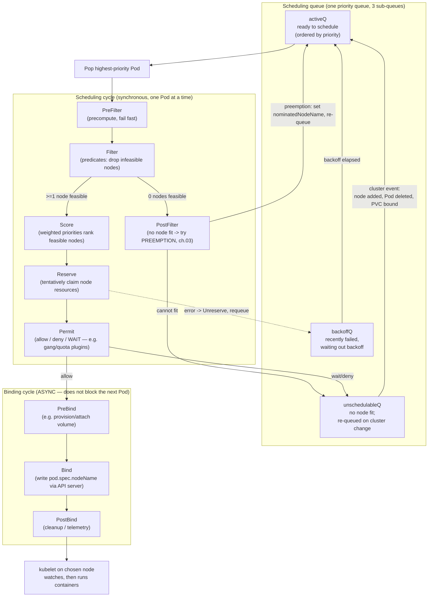

# 01 — The scheduler and nodes

> The scheduling cycle in depth: the scheduling queue (active/backoff/
> unschedulable), the scheduling cycle vs. the binding cycle, Filter → Score →
> Reserve → Permit → Bind, the scheduling framework (plugins & extension
> points), `nodeName` vs `nodeSelector`, node **capacity vs. allocatable**
> (system/kube reserved), why a Pod is `Pending` (the Events that tell you), and
> `schedulingGates` / scheduling readiness — diagnosed on a real Bookstore Pod.

**Estimated time:** ~30 min read · ~30 min hands-on
**Prerequisites:** [Part 00 ch.04](../00-foundations/04-control-plane-deep-dive.md) — where the scheduler sits · [Part 01 ch.03](../01-core-workloads/03-resources-and-qos.md) — requests drive scheduling decisions
**You'll know after this:** • trace the scheduling queue (active / backoff / unschedulable) · • distinguish the scheduling cycle from the binding cycle (Filter → Score → Reserve → Permit → Bind) · • read scheduler-framework plugin extension points · • differentiate node capacity from allocatable and account for system/kube-reserved · • diagnose a `Pending` Pod from its Events on a real cluster

<!-- tags: scheduling, scheduler, allocatable, scheduling-gates, troubleshooting -->

## Why this exists

[Part 00 ch.04](../00-foundations/04-control-plane-deep-dive.md) said the
scheduler "filters then scores, then writes a Binding". That two-line summary is
enough to *understand* the architecture; it is not enough to *operate* it. The
moment you run more than one node, or set resource
[requests](../01-core-workloads/03-resources-and-qos.md), or use storage with
`WaitForFirstConsumer`, you start seeing Pods stuck in `Pending` — and the only
way to fix that is to know **exactly** what the scheduler does, in what order,
and where it records *why* it could not place a Pod.

This chapter opens the scheduler. Every later scheduling control —
[affinity, taints, topology spread](02-affinity-taints-topology.md),
[priority and preemption](03-priority-and-preemption.md) — is a *plugin at a
specific extension point* in the pipeline described here, so this is the
foundation those two chapters build on. It is also the single most useful
debugging skill in Kubernetes: "why is this Pod Pending?" is answered entirely
by the mechanics below.

## Mental model

The scheduler is a **loop over one queue that, per Pod, runs an
assembly line of pass/fail gates then a scoring round, reserves the winner,
and only then — separately — writes the booking.**

- **One Pod at a time.** The scheduler pops *one* unscheduled Pod from a
  priority queue and finds it a home before moving on. It is not a global
  bin-packing solver; it is a fast, greedy, per-Pod decision (this is why
  scheduling order and [priority](03-priority-and-preemption.md) matter).
- **Filter is binary, Score is a beauty contest.** First, throw away every node
  that *cannot* run the Pod (hard constraints). Then, among the survivors, give
  each a number and pick the best (soft preferences). No survivors ⇒ the Pod
  stays `Pending` with an Event explaining which gate failed.
- **Deciding and committing are two phases.** The *scheduling cycle* (pick a
  node) is synchronous and one-at-a-time. The *binding cycle* (write
  `nodeName`, wait for volumes to attach) is slower and runs **asynchronously**
  so a slow bind doesn't stall scheduling of other Pods.
- **It only writes one field.** The scheduler's entire output is
  `pod.spec.nodeName`. It never starts a container — the
  [kubelet](../00-foundations/05-node-components.md) on the chosen node does
  that, watching for Pods bound to it.

Hold that and `Pending` stops being mysterious: a Pod is `Pending` because
either the queue hasn't gotten to it, or **every node failed a filter**, or the
**binding cycle is blocked** (typically an unbound volume).

## Diagrams

### The scheduling pipeline — queue → cycle → bind (Mermaid)



> Note the preemption edge: when `PostFilter` decides preemption can help, it
> sets the Pod's `status.nominatedNodeName`, marks the victims for graceful
> deletion, and the Pod is **re-queued to `activeQ`** — it does **not** flow
> straight into `Score` in the same cycle. It then runs a *fresh* scheduling
> cycle and, once the victims have terminated, normally wins the nominated node
> on that next pass (the scheduler re-evaluates; it is not contractually pinned
> there). This matches [ch.03](03-priority-and-preemption.md)'s preemption flow.

### Filter → Score funnel, and capacity vs. allocatable (ASCII)

```
ALL NODES ─┐
           ▼
   ┌──────────────── FILTER (predicates — binary pass/fail) ───────────────┐
   │ NodeResourcesFit · NodeAffinity · NodeName · TaintToleration ·         │
   │ VolumeBinding · VolumeZone · NodeVolumeLimits · PodTopologySpread ...  │
   └──────────────────────────────┬────────────────────────────────────────┘
                feasible nodes ────┤  (zero feasible ⇒ Pending; PostFilter may preempt)
                                   ▼
   ┌──────────── SCORE (priorities — 0..100, then weighted, summed) ────────┐
   │ NodeResourcesFit(LeastAllocated|MostAllocated) · ImageLocality ·       │
   │ InterPodAffinity · TaintToleration · PodTopologySpread · NodeAffinity  │
   └──────────────────────────────┬────────────────────────────────────────┘
                                   ▼  highest total wins (ties: random)
                            chosen node → Reserve → (async) Bind

  Why a request can fail to "fit" even on an idle-looking node:

   Node CAPACITY        = the machine's real CPU/mem (e.g. 4 CPU, 8Gi)
     − kube-reserved    = reserved for kubelet/runtime
     − system-reserved  = reserved for the OS / sshd
     − eviction-threshold
     = ALLOCATABLE       = the only budget the scheduler may pack into
                           Σ(Pod requests on node) + new request ≤ ALLOCATABLE
   `kubectl top node` shows USAGE; the scheduler ignores usage and sums REQUESTS.
```

## Hands-on with the Bookstore

**Assumed working directory: the guide repo root (`full-guide/`).** A cluster
exists from [Part 00 ch.07](../00-foundations/07-local-cluster-setup.md)
(`kind create cluster --name bookstore`). This chapter is diagnostic — no
manifest changes here; the scheduling *fields* are added to the Bookstore in
[ch.02](02-affinity-taints-topology.md) and
[ch.03](03-priority-and-preemption.md). Here you will deliberately make a Pod
unschedulable and read the system telling you exactly why.

### 1. See node capacity vs. allocatable

```sh
# The number the scheduler actually packs into is Allocatable, not Capacity.
kubectl get nodes -o custom-columns=\
'NODE:.metadata.name,CPU_CAP:.status.capacity.cpu,CPU_ALLOC:.status.allocatable.cpu,MEM_ALLOC:.status.allocatable.memory'

# Where current requests vs. allocatable stand on a node:
kubectl describe node | sed -n '/Allocated resources/,/Events/p'
```

`Allocatable` is `Capacity` minus `kube-reserved` + `system-reserved` +
eviction threshold. On a default single-node kind cluster the allocatable CPU
is roughly the host's core count — note that number; the next step over-requests
past it on purpose.

### 2. Make a Bookstore Pod `Pending` by over-requesting CPU

The cleanest, fully reversible way to produce an *unschedulable* Pod is to ask
for more CPU than any node's **allocatable**. We use a throwaway overlay of
`catalog` so nothing in the saved manifests changes, and a request like `100`
cores that no kind node can satisfy:

```sh
# A one-off Deployment that cannot possibly be scheduled (100 CPU requested).
# registry.k8s.io/pause is a tiny PUBLIC image so the lesson is "Pending due to
# scheduling", never "ImagePull" — note this is NOT the distroless catalog
# image (that one isn't loaded yet here, and a pull failure would mask the
# scheduling lesson). Same shape, isolated name so it touches no saved file.
kubectl -n bookstore create deployment sched-demo \
  --image=registry.k8s.io/pause:3.9
kubectl -n bookstore set resources deployment/sched-demo \
  --requests=cpu=100,memory=64Mi

kubectl -n bookstore get pods -l app=sched-demo -o wide   # STATUS: Pending
```

### 3. Read *why* — Events are the answer

```sh
POD=$(kubectl -n bookstore get pod -l app=sched-demo \
  -o jsonpath='{.items[0].metadata.name}')

# The scheduler writes its verdict into the Pod's Events:
kubectl -n bookstore describe pod "$POD" | sed -n '/Events:/,$p'
#   Warning  FailedScheduling  ... 0/N nodes are available:
#       N Insufficient cpu. preemption: 0/N nodes are available:
#       N No preemption victims found for incoming pod.

# Cluster-wide, newest events last — the habitual first command for "stuck Pod":
kubectl -n bookstore get events --sort-by=.metadata.creationTimestamp | tail -n 15
```

Read that message literally: **`Insufficient cpu`** means the
`NodeResourcesFit` *filter* rejected every node because `Σ requests + 100 CPU > allocatable`.
**`No preemption victims`** means `PostFilter` (preemption,
[ch.03](03-priority-and-preemption.md)) also couldn't help — there is no
lower-priority Pod whose eviction would free 100 CPU (nothing can). The Pod sits
in the **unschedulableQ** and will be retried only when a relevant cluster event
occurs (a node is added, requests change). Now fix it and watch it drain:

```sh
kubectl -n bookstore set resources deployment/sched-demo \
  --requests=cpu=50m,memory=64Mi      # now fits allocatable
kubectl -n bookstore get pods -l app=sched-demo -o wide   # → Running
kubectl -n bookstore delete deployment sched-demo          # clean up the demo
```

### 4. The other common `Pending`: an unbound PVC

You have already seen this without naming it. The Bookstore Postgres
([ch.05](../01-core-workloads/05-statefulsets.md) /
[Part 03 ch.04](../03-config-and-storage/04-persistent-storage.md)) uses a
`StorageClass` whose `volumeBindingMode` is `WaitForFirstConsumer`. That mode
deliberately **delays PV provisioning until a Pod is scheduled**, which means
the Pod's binding cycle waits on the volume:

```sh
# (Only if Postgres is applied.) A freshly created postgres-0 before its PV
# binds shows the binding-side Pending, not a filter failure:
kubectl -n bookstore describe pod postgres-0 2>/dev/null | sed -n '/Events:/,$p'
#   ... waiting for first consumer to be created before binding   (normal here)
#   ... or: had volume node affinity conflict                     (a real bug)
kubectl -n bookstore get pvc                 # STATUS Pending until bound
```

This is the key distinction this chapter teaches: **`Insufficient cpu/memory` /
`didn't match node selector` / `had taint` = a Filter (scheduling-cycle)
failure**; **`waiting for first consumer` / `unbound PersistentVolumeClaim` /
`node affinity conflict` = a binding-cycle (volume) failure**. Same `Pending`
phase, different half of the pipeline — and `describe pod` Events tell you
which every time.

### 5. `nodeName` bypasses the scheduler entirely (and why not to)

```sh
# Pick any Ready node name:
NODE=$(kubectl get nodes -o jsonpath='{.items[0].metadata.name}')

# Setting spec.nodeName directly = "skip the scheduler, kubelet just runs it
# here". No Filter, no Score, no resource check, no taint check.
kubectl -n bookstore run pin-demo --image=registry.k8s.io/pause:3.9 \
  --overrides="{\"spec\":{\"nodeName\":\"$NODE\"}}"
kubectl -n bookstore get pod pin-demo -o wide   # already on $NODE, never Pending
kubectl -n bookstore delete pod pin-demo
```

`nodeName` is a blunt instrument: it ignores capacity (you can overcommit a
node into eviction), taints, and affinity. Real workloads steer placement with
`nodeSelector` / affinity ([ch.02](02-affinity-taints-topology.md)) so the
scheduler still does its feasibility and scoring job. `nodeName` is for the rare
static-Pod / bootstrap case, not for application manifests.

## How it works under the hood

- **The scheduling queue has three sub-queues.** `activeQ` (a priority heap,
  ordered by Pod priority then arrival) holds Pods ready to try. A Pod whose
  scheduling attempt errors goes to `backoffQ` (exponential backoff so a
  perpetually-failing Pod doesn't hot-loop). A Pod that simply doesn't fit any
  node goes to `unschedulableQ` and is **not** retried on a timer alone — it is
  moved back to `activeQ` by **cluster events** that could plausibly change the
  outcome (a Node added/updated, a Pod deleted, a PVC bound, a scheduler
  plugin's "this changed" hint). This event-driven requeue is why a Pending Pod
  can suddenly schedule the instant you delete another Pod or add a node.
- **Scheduling cycle vs. binding cycle.** The scheduling cycle (PreFilter →
  Filter → PostFilter → PreScore → Score → Reserve → Permit) is **synchronous
  and serialized** — one Pod fully decided before the next is popped, so the
  resource accounting stays consistent. The binding cycle (PreBind → Bind →
  PostBind) is dispatched to a **goroutine** and runs concurrently: a slow
  PreBind (e.g. a cloud volume attach) for one Pod must not stall placement of
  unrelated Pods. `Reserve` exists precisely so the picked node's resources are
  *tentatively* counted during the async bind, preventing two Pods from racing
  onto the same last slice of a node. A failure after Reserve triggers
  `Unreserve` (give the tentative resources back) and a requeue.
- **The scheduling framework: plugins at extension points.** kube-scheduler is a
  thin engine; the actual logic is **plugins** registered at named extension
  points — `QueueSort`, `PreFilter`, `Filter`, `PostFilter`, `PreScore`,
  `Score`, `Reserve`, `Permit`, `PreBind`, `Bind`, `PostBind`. Default Filter
  plugins include **NodeResourcesFit** (requests ≤ allocatable),
  **NodeAffinity**, **NodeName**, **NodeUnschedulable**, **TaintToleration**,
  **PodTopologySpread**, **VolumeBinding**, **VolumeZone**,
  **NodeVolumeLimits**, **NodePorts**, **InterPodAffinity**. Default Score
  plugins include **NodeResourcesFit** — whose **default scoring strategy is
  `LeastAllocated`** (prefer the node with the *most* remaining capacity, which
  **spreads** load across nodes); the alternatives `MostAllocated` (bin-pack
  onto the fullest node, e.g. to scale down / save cost) and
  `RequestedToCapacityRatio` are opt-in via the plugin's config —
  **ImageLocality** (prefer nodes that already have the image — fewer pulls),
  **InterPodAffinity**,
  **TaintToleration**, **PodTopologySpread**, **NodeAffinity**. Score plugins
  return 0..100 per node; the framework multiplies by each plugin's **weight**
  and sums; highest total wins, ties broken at random for a basic spreading
  effect.
- **Scheduler profiles & multiple schedulers.** One kube-scheduler process can
  run several **profiles** (each a named plugin set with its own weights). A Pod
  selects one via `spec.schedulerName` (default profile name: `default-scheduler`).
  You can also run an *entirely separate* scheduler binary and
  point Pods at it by name — they coexist because each only acts on Pods naming
  it (and unscheduled, `nodeName`-empty). This is how specialized schedulers
  (batch/gang, GPU-aware) live alongside the default.
- **`schedulingGates` / scheduling readiness.** A Pod may be created with
  `spec.schedulingGates: [{name: ...}]`. While **any** gate is present the
  scheduler treats the Pod as **not ready to be scheduled** — it never enters
  the active queue. The Pod is still in the **`Pending` phase**, but its
  `PodScheduled` condition has `reason: SchedulingGated` (and `kubectl` shows a
  `SchedulingGated` status), so there is no `FailedScheduling` event — it is
  not "tried and failed", it is "not yet eligible to try". A controller removes
  gates (the list is mutable only by *removing* entries) when an external
  precondition is met — quota approved, data prefetched, a paired resource
  ready. Only when the gate list is empty does normal scheduling begin. This is
  "don't even try to place me yet", distinct from "tried and couldn't"
  (unschedulableQ). Pod scheduling readiness **graduated to GA in v1.30**
  (the guide's target) and is enabled by default.
- **`nodeName` is the scheduler bypass.** A Pod created with `spec.nodeName`
  already set is, by definition, "already scheduled" — the scheduler skips it
  entirely; the kubelet on that node just runs it. No Filter (so no resource,
  taint, or affinity check) applies. Static Pods (kubelet-managed, e.g.
  control-plane components on kubeadm) work this way.

## Production notes

> **In production:** **`kubectl describe pod` Events are the first and usually
> only tool** for a Pending Pod. The message is precise:
> `Insufficient cpu/memory` (NodeResourcesFit — scale down requests or add capacity),
> `didn't match Pod's node affinity/selector` (labels/affinity, ch.02),
> `had untolerated taint {…}` (taints, ch.02),
> `unbound immediate PersistentVolumeClaim` / `waiting for first consumer` (storage,
> [Part 03 ch.04](../03-config-and-storage/04-persistent-storage.md)),
> `node(s) didn't have free ports`. Read the literal predicate name; it tells
> you which knob to turn.

> **In production:** sloppy `requests` are the #1 cause of "won't schedule" and
> of wasted spend. The scheduler packs by **requests**, never usage — under-set
> and you overcommit nodes into eviction; over-set and Pods go Pending while
> nodes sit half-idle, and on EKS/GKE/AKS the **cluster-autoscaler scales by
> unschedulable Pods' requests**, so over-requesting directly inflates the bill.
> Right-size from real data ([Part 06 ch.04](../06-production-readiness/04-autoscaling.md),
> [ch.06](../06-production-readiness/06-capacity-and-cost.md)).

> **In production (managed — EKS/GKE/AKS):** you do not run or tune
> kube-scheduler — the provider does. What you *do* own is the inputs:
> requests/limits, affinity/taints, topology spread, PriorityClasses. Node
> **capacity vs. allocatable** differs by instance type and by the provider's
> `kube/system-reserved` defaults (often larger than kind's), so a Pod that
> fit locally can be Pending in the cloud — always compare against
> `status.allocatable`, never the instance's advertised vCPU/RAM.

> **In production:** prefer a **separate scheduler profile or a dedicated
> scheduler** over `spec.nodeName`. `nodeName` defeats capacity, taint, and
> affinity checks and is a frequent cause of overcommitted, OOM-prone nodes.
> Reserve it for static/bootstrap Pods only — never application manifests.

> **In production:** use **`schedulingGates`** when a Pod must not be placed
> until an external precondition holds (quota granted, dependency provisioned,
> data staged). It is cleaner than letting the Pod thrash in the
> unschedulable queue or hand-holding with an init container that burns a node
> slot while it waits.

## Quick Reference

```sh
# Capacity vs. allocatable (the scheduler packs into ALLOCATABLE)
kubectl get nodes -o custom-columns=\
'N:.metadata.name,CAP_CPU:.status.capacity.cpu,ALLOC_CPU:.status.allocatable.cpu,ALLOC_MEM:.status.allocatable.memory'
kubectl describe node <NODE> | sed -n '/Allocated resources/,/Events/p'

# WHY is this Pod Pending? (read the predicate name in Events)
kubectl describe pod <POD> -n <NS> | sed -n '/Events:/,$p'
kubectl get events -n <NS> --sort-by=.metadata.creationTimestamp | tail -n 20

# Scheduling-gated (created with schedulingGates) shows here, not as Pending:
kubectl get pod <POD> -n <NS> -o jsonpath='{.status.conditions[?(@.type=="PodScheduled")].reason}{"\n"}'

# Which scheduler / profile is in play
kubectl get pod <POD> -n <NS> -o jsonpath='{.spec.schedulerName}{"\n"}'
kubectl -n kube-system get lease | grep -i scheduler   # leader-elected holder
```

Minimal skeletons (placement-relevant fields only):

```yaml
# 1) Steer with a label selector (the scheduler still filters/scores):
spec:
  nodeSelector: { disktype: ssd }

# 2) Bypass the scheduler entirely (static/bootstrap ONLY — avoid for apps):
spec:
  nodeName: node-1            # no Filter/Score/resource/taint check at all

# 3) "Don't schedule me until a controller clears this":
spec:
  schedulingGates:
    - name: example.com/quota-approved   # status: SchedulingGated until removed
```

Checklist:

- [ ] Every container has `requests` (the scheduler packs by requests, not usage)
- [ ] For a Pending Pod, the **Events predicate name** has been read literally
- [ ] Distinguished Filter-failure (`Insufficient …`) vs. binding-failure (`unbound PVC`)
- [ ] No application manifest uses `spec.nodeName` (use `nodeSelector`/affinity)
- [ ] Requests compared against node **allocatable**, not raw capacity
- [ ] `schedulingGates` used (not init-container hacks) for external preconditions

## Test your understanding

> Try each before opening the answer drawer. The act of trying is the exercise; the answer is the check.

1. **Walk through the difference between the scheduling cycle and the binding cycle. Why does Kubernetes deliberately separate them, and what would go wrong if they were merged into one synchronous step?**
   <details><summary>Show answer</summary>

   Scheduling cycle (PreFilter→…→Reserve→Permit) is synchronous, one Pod at a time — so resource accounting is consistent (no two Pods racing onto the same last slot). Binding cycle (PreBind→Bind→PostBind) is async because PreBind can be slow (cloud volume attach, image pre-pull). Merging them would mean a single 30-second volume attach stalls scheduling of every other Pod cluster-wide. `Reserve` exists precisely to hold the seat during the async bind (see §Mental model and §How it works, scheduling vs. binding cycle).

   </details>

2. **A Pod is `Pending` with the event "0/3 nodes are available: 3 Insufficient cpu". The cluster has nodes showing 60% idle CPU in `kubectl top`. Explain the apparent contradiction and the fix.**
   <details><summary>Show answer</summary>

   The scheduler sums `requests` (the booking system), not `kubectl top`'s actual usage (the runtime reality). A node packed with Pods that each request 500m but actually use 50m looks 90% idle in `top` while having near-zero unbooked request budget. Fix: lower the new Pod's CPU request to fit available *allocatable* budget, or right-size the existing Pods' over-requests. Requests are a contract; usage is anecdote (see §Filter → Score funnel, capacity vs. allocatable).

   </details>

3. **A teammate sets `spec.nodeName: node-1` on an application Pod to "make sure it runs there". List two things this bypasses, and what they should use instead.**
   <details><summary>Show answer</summary>

   `nodeName` skips the entire scheduler — no Filter and no Score. So it bypasses: (1) `NodeResourcesFit` (no capacity check; you can overcommit a node into eviction). (2) `TaintToleration` (taints are ignored; you can land on dedicated/control-plane nodes meant to repel workloads). Also affinity, ports, volume zone. They should use `nodeSelector` or `nodeAffinity` — declarative steering that the scheduler still validates (see §5. `nodeName` bypasses the scheduler).

   </details>

4. **You want to defer scheduling of a Pod until an external "quota approved" controller signals OK. What field supports this without the kludge of an init container that sleeps?**
   <details><summary>Show answer</summary>

   `spec.schedulingGates` (GA in 1.30). The Pod is created with `schedulingGates: [{name: example.com/quota-approved}]`; it stays in `Pending` with `PodScheduled` condition reason `SchedulingGated` — never enters the active queue. The controller removes the gate when quota is granted; the scheduler then picks it up normally. Cleaner than an init container that holds a slot, doesn't waste compute, and integrates with policy (see §schedulingGates / scheduling readiness).

   </details>

5. **Hands-on extension: create a Deployment requesting `cpu: 100` on a single-node kind cluster. Run `kubectl describe pod` and read the exact predicate name in Events. Now lower requests to fit allocatable. What does the requeue mechanism do, and what cluster event triggered the rescheduling?**
   <details><summary>What you should see</summary>

   The Pod is rejected by `NodeResourcesFit` filter with `Insufficient cpu`, parked in `unschedulableQ` — *not* retried on a timer. Lowering requests via `kubectl set resources` updates the Pod spec; that update is the cluster event that signals "this could plausibly change the outcome", so the scheduler moves the Pod back to `activeQ` and tries again. Now it fits, and binding proceeds. This is event-driven requeue in action (see §How it works under the hood, queue sub-queues).

   </details>

## Further reading

- **Ibryam & Huß, _Kubernetes Patterns_ 2e — *Automated Placement* (ch.6)** —
  the placement model: how the scheduler turns declared demands and constraints
  into node assignments, and why requests are the scheduling currency.
- **Lukša, _Kubernetes in Action_ 2e — advanced scheduling material** — the
  scheduling cycle, predicates/priorities, and reading scheduling failures
  (pair with the official scheduler reference for the framework details).
- Official:
  <https://kubernetes.io/docs/concepts/scheduling-eviction/kube-scheduler/>,
  the scheduling framework
  <https://kubernetes.io/docs/concepts/scheduling-eviction/scheduling-framework/>,
  and Pod scheduling readiness
  <https://kubernetes.io/docs/concepts/scheduling-eviction/pod-scheduling-readiness/>.
