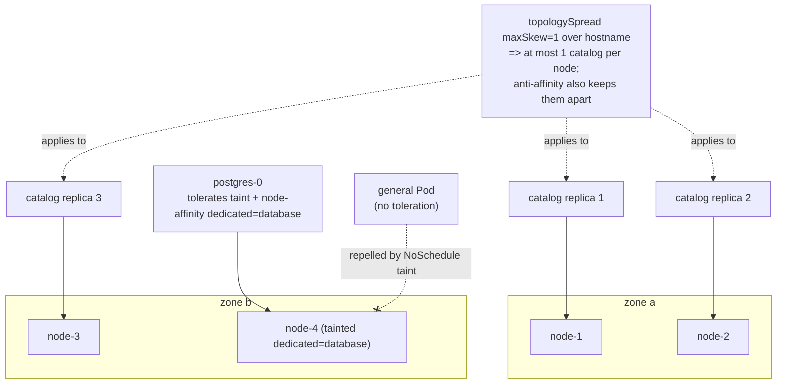

# 02 — Affinity, taints, and topology

> Steering placement: node affinity (`requiredDuringSchedulingIgnoredDuringExecution`
> vs `preferred…`, what *IgnoredDuringExecution* really means,
> `nodeAffinity` vs. the older `nodeSelector`); inter-pod affinity &
> anti-affinity (`topologyKey`, the scale/cost caveat, hard anti-affinity for
> HA); taints & tolerations (`NoSchedule`/`PreferNoSchedule`/`NoExecute`,
> `tolerationSeconds`, built-in taints); `topologySpreadConstraints`
> (`maxSkew`, `whenUnsatisfiable`, `minDomains` GA 1.30,
> `nodeAffinityPolicy`/`nodeTaintsPolicy`, `matchLabelKeys`) — applied by
> spreading the Bookstore for HA and pinning Postgres to a dedicated node.

**Estimated time:** ~30 min read · ~60 min hands-on
**Prerequisites:** [Part 04 ch.01](01-scheduler-and-nodes.md) — the scheduling pipeline you're influencing · [Part 01 ch.04](../01-core-workloads/04-replicasets-and-deployments.md) — replicas you're spreading
**You'll know after this:** • configure required vs. preferred node affinity and know what *IgnoredDuringExecution* really means · • use inter-pod (anti-)affinity with `topologyKey` for HA without exploding scheduling cost · • apply taints and tolerations (NoSchedule / PreferNoSchedule / NoExecute) for dedicated nodes · • design `topologySpreadConstraints` with the right `maxSkew` and `whenUnsatisfiable` · • spread Bookstore replicas across zones and pin Postgres to a dedicated node

<!-- tags: scheduling, affinity, taints-tolerations, topology-spread, ha -->

## Why this exists

[ch.01](01-scheduler-and-nodes.md) showed *how* the scheduler picks a node. By
default it picks well, but it cannot read your intent. It does not know that:

- the three `catalog` replicas must land on **different nodes/zones**, so one
  machine or one zone failing does not take the whole catalog tier down;
- `postgres` should run on a **dedicated, isolated node** with fast disks and no
  noisy neighbours — and that *nothing else* should drift onto that node;
- a node reserved for the data tier must **repel** general workloads unless they
  explicitly opt in.

Those are placement *policies*, and Kubernetes expresses them with four
cooperating mechanisms: **node affinity** ("I want nodes *like this*"),
**inter-pod (anti-)affinity** ("near / away from *these other Pods*"), **taints
& tolerations** ("this node repels Pods unless they tolerate it"), and
**topology spread constraints** ("spread my replicas *evenly* across these
domains"). This is the heart of the [Automated Placement](#further-reading)
pattern, and it is what makes the Bookstore *highly available* instead of merely
*running*. We apply all four to real Bookstore manifests in this chapter.

## Mental model

Two of these mechanisms **attract**, two **repel** — and they combine:

- **Node affinity / `nodeSelector`** — *Pod → node label* matching. "Schedule
  me only on (or preferably on) nodes carrying these labels." Pure attraction
  toward node properties. `nodeSelector` is the old, simple, AND-only form;
  `nodeAffinity` is its superset (operators, `preferred` with weights, OR-ish
  expressions).
- **Inter-pod affinity / anti-affinity** — *Pod → other Pods*, evaluated within
  a **`topologyKey`** domain (a node label like `kubernetes.io/hostname` or
  `topology.kubernetes.io/zone`). Affinity = "co-locate with Pods like X in the
  same domain"; **anti**-affinity = "keep me out of any domain that already has
  Pods like X" — the HA spreading primitive.
- **Taints & tolerations** — the **node's** side. A *taint* on a node repels all
  Pods; only a Pod with a matching *toleration* may (still must be otherwise
  attracted to) land there. Taint = repel-by-default; toleration = "I'm allowed
  past this particular fence". A toleration grants *permission*, never
  *attraction* — pair it with affinity to actually pull the Pod in.
- **Topology spread constraints** — declare the **maximum imbalance**
  (`maxSkew`) of *my* Pods across a set of domains (`topologyKey`), and whether
  violating it is a hard error (`DoNotSchedule`) or just disfavoured
  (`ScheduleAnyway`). It is the precise, modern way to say "spread evenly",
  superseding the blunt hard-anti-affinity trick for most cases.

Rule of thumb the Bookstore uses: **spread the stateless tiers** (catalog,
storefront) across nodes/zones for HA; **isolate the stateful tier** (postgres)
onto a dedicated, tainted node it is attracted to.

## Diagrams

### Anti-affinity / spread placing replicas across nodes & zones (Mermaid)



### Taint / toleration match table & effects (ASCII)

```
A toleration matches a taint when key (+ value if operator=Equal) AND effect agree.

  Node taint                          Pod toleration                    Result
  ----------------------------------  --------------------------------  ----------------
  dedicated=database:NoSchedule       (none)                            NOT placed here
  dedicated=database:NoSchedule       key=dedicated Equal database      MAY be placed
                                        effect=NoSchedule                (if also attracted)
  dedicated=database:NoSchedule       operator=Exists key=dedicated     MAY be placed
  node.kubernetes.io/not-ready:       operator=Exists                   tolerates not-ready
    NoExecute                           effect=NoExecute                 forever
  node.kubernetes.io/not-ready:       (auto-added by default,           evicted after 300s
    NoExecute                           tolerationSeconds: 300)          if node stays bad

Effects (what the taint does):
  NoSchedule        new Pods without a matching toleration are NOT scheduled here
  PreferNoSchedule  scheduler AVOIDS this node, but will use it if nothing else fits
  NoExecute         as NoSchedule, AND already-running Pods lacking the toleration
                    are EVICTED (after tolerationSeconds, if set; immediately if not)
```

## Hands-on with the Bookstore

**Assumed working directory: the guide repo root (`full-guide/`).** This
chapter makes the Bookstore highly available and isolates its data tier. The
scheduling fields are **added to existing manifests** — `10-catalog-deploy.yaml`,
`11-storefront-deploy.yaml`, `20-postgres-statefulset.yaml` — as a clearly
marked *Part 04 scheduling layer*. **Every prior field
(ConfigMap/Secret/DSN/volumes/probes/preStop/labels/namespace) is preserved
unchanged; only placement fields are added.**

### 1. A multi-node kind cluster (so spreading has somewhere to spread)

A default `kind create cluster` is **single-node** — `topologySpread` with
`whenUnsatisfiable: DoNotSchedule` cannot place a 2nd/3rd replica there (there
is only one `kubernetes.io/hostname` domain). For this chapter, recreate the
cluster from a multi-node config. Save this as `kind-multinode.yaml` (anywhere;
it is infra, not a Bookstore manifest):

```yaml
# kind-multinode.yaml — 1 control-plane + 3 workers; worker-3 is the dedicated
# DB node: an extra node label plus a NoSchedule taint registered at join time
# via kubeadmConfigPatches -> JoinConfiguration.nodeRegistration.taints (kind's
# supported way to taint a node from the cluster config). Synthetic zone labels
# let us demo zone spreading locally (real clusters get
# topology.kubernetes.io/zone from the cloud provider).
kind: Cluster
apiVersion: kind.x-k8s.io/v1alpha4
nodes:
  - role: control-plane
  - role: worker
    labels:
      topology.kubernetes.io/zone: zone-a
  - role: worker
    labels:
      topology.kubernetes.io/zone: zone-b
  - role: worker
    labels:
      topology.kubernetes.io/zone: zone-b
      dedicated: database          # the label postgres' nodeAffinity prefers
    kubeadmConfigPatches:
      - |
        kind: JoinConfiguration
        nodeRegistration:
          taints:
            - key: dedicated
              value: database
              effect: NoSchedule    # repels everything lacking the toleration
```

```sh
# Recreate the cluster with topology.
kind delete cluster --name bookstore
kind create cluster --name bookstore --config kind-multinode.yaml
kubectl get nodes -L topology.kubernetes.io/zone,dedicated
```

**A recreated cluster is empty** — the namespace, config, secrets, and the
PriorityClasses from earlier chapters are gone. Re-establish the prerequisites
**in this order** before applying any workload (this is just the cumulative
manifest set, re-applied):

```sh
# from the repo root (full-guide/)
# 1) namespace + quota/limits (Part 01 ch.03)
kubectl apply -f examples/bookstore/raw-manifests/00-namespace.yaml
# 2) config + DB credentials the workloads consume (Part 03 ch.01/ch.02)
kubectl apply -f examples/bookstore/raw-manifests/15-catalog-config.yaml
kubectl apply -f examples/bookstore/raw-manifests/16-db-credentials.yaml
# 3) PriorityClasses — cluster-scoped; defined & explained in ch.03. Apply now
#    so the cumulative manifests (which reference priorityClassName) validate
#    and pods are not rejected by the Priority admission plugin (forward-ref).
kubectl apply -f examples/bookstore/raw-manifests/35-priorityclasses.yaml
# 4) re-load the Bookstore images into the fresh cluster (per the README).
#    catalog/storefront/orders are kind-loaded, not pulled:
kind load docker-image bookstore/catalog:dev    --name bookstore
kind load docker-image bookstore/storefront:dev --name bookstore
kind load docker-image bookstore/orders:dev     --name bookstore
# (postgres uses the public postgres:16 image — pulled, no load needed.)
```

Now the workload manifests below will apply cleanly.

The dedicated DB node now carries label `dedicated=database` **and** taint
`dedicated=database:NoSchedule`. If you stay on a single-node cluster instead,
the `preferred`/soft rules below still work; only the **hard**
`topologySpread`/anti-affinity needs the extra nodes (or scale those Deployments
to 1).

> If the `kubeadmConfigPatches` taint does not take on your kind/Kubernetes
> build (older kind, or you prefer to keep the config minimal), drop the
> `kubeadmConfigPatches:` block and taint + label the node **after creation**
> instead — same result:
> `kubectl taint nodes <WORKER-3> dedicated=database:NoSchedule` and
> `kubectl label nodes <WORKER-3> dedicated=database`
> (find the node name with `kubectl get nodes`).

### 2. Spread `catalog` & `storefront` across nodes (HA)

The scheduling layer added to
[`10-catalog-deploy.yaml`](../examples/bookstore/raw-manifests/10-catalog-deploy.yaml)
— inside `spec.template.spec`, alongside (not replacing) the existing
containers/volumes/probes:

```yaml
    spec:
      priorityClassName: bookstore-critical   # ch.03 (35-): user-facing tier
      topologySpreadConstraints:
        - maxSkew: 1                           # node replica counts differ by ≤1
          topologyKey: kubernetes.io/hostname  # one domain per node
          whenUnsatisfiable: DoNotSchedule     # HARD: don't pile onto one node
          labelSelector:
            matchLabels: { app: catalog }      # count only catalog Pods
      affinity:
        podAntiAffinity:
          preferredDuringSchedulingIgnoredDuringExecution:   # SOFT
            - weight: 100
              podAffinityTerm:
                topologyKey: kubernetes.io/hostname
                labelSelector:
                  matchLabels: { app: catalog }
      # ... existing containers / volumes / probes / preStop UNCHANGED ...
```

`storefront`
([`11-storefront-deploy.yaml`](../examples/bookstore/raw-manifests/11-storefront-deploy.yaml))
gets the same shape with `app: storefront`. Why **both** spread *and*
anti-affinity? `topologySpreadConstraints` enforces *even* distribution
(`maxSkew`); the `preferred` anti-affinity adds a soft "really, prefer separate
nodes" nudge while staying schedulable on a single-node cluster. The
spread constraint is the hard guarantee; anti-affinity is the belt-and-braces.

```sh
# from the repo root (full-guide/)
# PriorityClass is cluster-scoped and is explained in ch.03; apply it FIRST so
# these manifests (which now set priorityClassName) validate and the Priority
# admission plugin does not reject the pods. (Forward-ref to ch.03; harmless to
# re-apply if you already ran the prerequisite block above.)
kubectl apply -f examples/bookstore/raw-manifests/35-priorityclasses.yaml

# catalog carries DB_DSN, so it needs Postgres + the schema Job to go Ready
# (its /readyz pings Postgres). Bring those up and gate on the Job before the
# rollout wait; idempotent if already applied. (Postgres on its dedicated DB
# node is the topic of a later section — this is just the readiness gate.)
kubectl apply -f examples/bookstore/raw-manifests/20-postgres-statefulset.yaml
kubectl rollout status statefulset/postgres -n bookstore
kubectl apply -f examples/bookstore/raw-manifests/21-db-migrate-job.yaml   # schema
kubectl wait --for=condition=complete job/db-migrate -n bookstore --timeout=120s
kubectl apply -f examples/bookstore/raw-manifests/10-catalog-deploy.yaml
kubectl apply -f examples/bookstore/raw-manifests/11-storefront-deploy.yaml
kubectl rollout status deployment/catalog -n bookstore

# Replicas spread across the available (untainted) nodes — NODE column varies.
kubectl get pods -n bookstore -l app=catalog -o wide
kubectl get pods -n bookstore -l app=catalog \
  -o custom-columns='POD:.metadata.name,NODE:.spec.nodeName'
```

On the 3-worker config above, **worker-3 is tainted
`dedicated=database:NoSchedule`** and `catalog` has no matching toleration, so
`catalog` only fits **worker-1 and worker-2** — 3 replicas spread **2 + 1**
across those two nodes (at most 2 per node, never on the tainted DB node).
A *true* 3-way one-per-node spread would need **3 general (untainted) nodes**;
this is the taint isolation and the spread constraint working together exactly
as intended, not a failure.

> On a single-node cluster the **hard** `DoNotSchedule` will leave replicas 2–3
> `Pending` with a `node(s) didn't match pod topology spread constraints`
> Event — that is the constraint working as designed. Either use the multi-node
> config above, or `kubectl scale deployment/catalog -n bookstore --replicas=1`
> for the single-node case. (This is exactly the Pending-diagnosis skill from
> [ch.01](01-scheduler-and-nodes.md).)

### 3. Pin `postgres` to the dedicated DB node (taint + toleration + affinity)

The scheduling layer added to
[`20-postgres-statefulset.yaml`](../examples/bookstore/raw-manifests/20-postgres-statefulset.yaml)
(inside `spec.template.spec`, with the existing envFrom-Secret / probes /
volumeClaimTemplates untouched):

```yaml
    spec:
      priorityClassName: bookstore-data        # ch.03 (35-): highest tier
      tolerations:                             # PERMISSION to enter the tainted node
        - key: dedicated
          operator: Equal
          value: database
          effect: NoSchedule                   # must match the taint exactly
      affinity:
        nodeAffinity:                          # ATTRACTION to that node
          preferredDuringSchedulingIgnoredDuringExecution:
            - weight: 100
              preference:
                matchExpressions:
                  - key: dedicated
                    operator: In
                    values: ["database"]
      # ... existing terminationGracePeriodSeconds / containers UNCHANGED ...
```

This is the canonical "dedicated node" recipe and shows why **two** mechanisms
are needed: the **toleration** lets postgres *past the taint* (without it the
scheduler refuses the node); the **node affinity** *pulls* postgres *toward*
that node (without it, postgres could schedule anywhere — a toleration only
removes a barrier, it does not create a preference). General Bookstore Pods
(catalog/orders/storefront) have **no** toleration, so the `NoSchedule` taint
keeps them off the DB node automatically — exactly the isolation we wanted.

```sh
kubectl apply -f examples/bookstore/raw-manifests/20-postgres-statefulset.yaml
kubectl rollout status statefulset/postgres -n bookstore

# postgres-0 lands on the dedicated node; catalog/storefront never do:
kubectl get pod -n bookstore \
  -l 'app in (postgres,catalog,storefront)' \
  -o custom-columns='POD:.metadata.name,NODE:.spec.nodeName'
kubectl describe node <DEDICATED-WORKER> | sed -n '/Taints:/,/Unschedulable/p'
```

Affinity is `preferred` (not `required`) **on purpose**: with `required`
node affinity, a single-node or differently-labelled cluster would leave
postgres permanently `Pending`. `preferred` keeps the guide runnable
everywhere while still demonstrating the attraction. The
[Production notes](#production-notes) explain when to harden it to `required`.

### 4. Watch `IgnoredDuringExecution` actually mean what it says

```sh
# Label/unlabel a node AFTER catalog Pods are running. Pods do NOT move:
# *IgnoredDuringExecution* = the rule gates SCHEDULING only, never eviction.
kubectl label node <SOME-WORKER> tier=experiment
kubectl get pods -n bookstore -l app=catalog -o wide   # unchanged placement
kubectl label node <SOME-WORKER> tier-                  # undo
```

Nothing reschedules. That is the entire meaning of the verbose name: node/pod
**affinity** is enforced **only at schedule time**; once a Pod is bound, later
label changes are ignored for that Pod. (The only placement rule that *does* act
on running Pods is a **`NoExecute` taint** — covered next — which is why
`NoExecute` exists as a separate effect.)

## How it works under the hood

- **`nodeSelector` vs. `nodeAffinity` — what *IgnoredDuringExecution* means.**
  `nodeSelector` is a flat `map[string]string`: all key=value pairs must match
  (AND), exact equality only. It is **not deprecated** but is the minimal form.
  `nodeAffinity` is the expressive superset:
  `requiredDuringSchedulingIgnoredDuringExecution` (a hard filter — node *must*
  match `matchExpressions` with operators `In`/`NotIn`/`Exists`/`DoesNotExist`/
  `Gt`/`Lt`; multiple `nodeSelectorTerms` are OR'd) and
  `preferredDuringSchedulingIgnoredDuringExecution` (a weighted Score
  contribution, 1–100). The clumsy suffix decodes literally: **`…DuringScheduling`** = applied when the scheduler places the Pod;
  **`IgnoredDuringExecution`** = once running, changing node labels does **not**
  evict or move the Pod. (A hypothetical `RequiredDuringExecution` would evict
  on label change; it does not exist for affinity — only `NoExecute` taints have
  that running-Pod power.)
- **Inter-pod (anti-)affinity and the `topologyKey`.** The term is evaluated as:
  "consider the set of nodes sharing the same value of `topologyKey` as a
  candidate node; do/don't any of them run a Pod matching `labelSelector` (in
  the given `namespaces`/`namespaceSelector`)?"
  `topologyKey: kubernetes.io/hostname` ⇒ per-node; `topology.kubernetes.io/zone` ⇒ per-zone.
  **The scale caveat:** evaluating pod affinity/anti-affinity is roughly
  *O(Pods × nodes)* per scheduling attempt — the scheduler must, for the
  candidate Pod, check matching Pods across topology domains. **Required**
  (hard) pod *affinity* especially is expensive and is explicitly discouraged on
  large clusters in the docs; hard **anti**-affinity for spreading is the
  classic use but `topologySpreadConstraints` is the cheaper, more precise modern
  replacement for "spread evenly". Use pod anti-affinity for true HA *hard*
  separation ("never two replicas of this critical singleton-ish service on one
  node"), spread constraints for "balance across domains".
- **Taints & tolerations mechanics.** A taint is `key[=value]:effect` on
  `node.spec.taints`. A toleration matches if `key` matches **and** `effect`
  matches **and** (for `operator: Equal`) `value` matches — with two wildcards:
  `operator: Exists` matches **any value** for that key (and an *empty-key*
  `Exists` toleration tolerates **all** taints — a dangerous catch-all), and an
  **empty `effect`** in the toleration matches **all effects** for that key
  (`NoSchedule`+`PreferNoSchedule`+`NoExecute` at once) rather than one — also
  broader than usually intended. **`NoSchedule`** blocks scheduling of
  non-tolerating Pods (running Pods stay). **`PreferNoSchedule`** is a soft
  Score penalty, not a filter. **`NoExecute`** additionally **evicts**
  already-running non-tolerating Pods: immediately if the toleration is absent,
  or after `tolerationSeconds` if the Pod tolerates it with a finite duration.
  Kubernetes auto-adds built-in taints — `node.kubernetes.io/not-ready` and
  `node.kubernetes.io/unreachable` (`NoExecute`, by the node controller when a
  node goes bad), `node.kubernetes.io/unschedulable` (on `cordon`),
  `node.kubernetes.io/memory-pressure`/`disk-pressure`/`pid-pressure` (by the
  kubelet), and `node-role.kubernetes.io/control-plane:NoSchedule` (keeps
  general workloads off control-plane nodes). The default admission also injects
  a 300s `tolerationSeconds` for the not-ready/unreachable taints, which is why
  a Pod on a node that briefly goes NotReady is **not** evicted instantly — it
  has ~5 minutes for the node to recover.
- **`topologySpreadConstraints` semantics.** For each constraint the scheduler
  groups feasible nodes into **domains** by `topologyKey`, counts matching Pods
  (selected by `labelSelector`, optionally narrowed/widened by `matchLabelKeys`)
  per domain, and ensures `max(count) − min(count) ≤ maxSkew` *after* placing
  the new Pod. `whenUnsatisfiable: DoNotSchedule` makes the constraint a Filter
  (Pending if no domain keeps skew ≤ maxSkew); `ScheduleAnyway` makes it a Score
  signal only. Refinements: **`minDomains`** (GA in 1.30) forces the scheduler to
  treat the topology as having *at least* N domains — so 3 replicas don't all
  pack into the only 1 domain currently present; **`nodeAffinityPolicy`** /
  **`nodeTaintsPolicy`** (`Honor`|`Ignore`) decide whether nodes filtered out by
  the Pod's own nodeAffinity / by taints are excluded from the domain
  denominator (default `Honor` for affinity, `Ignore` for taints in current
  versions — be explicit if it matters); **`matchLabelKeys`** (Beta) adds pod-
  template-hash-like keys to the implicit selector so a *rolling update's* new
  and old ReplicaSet Pods are spread independently rather than fighting each
  other's counts. Kubernetes also applies **cluster-level default constraints**
  (a `maxSkew: 3` spread over hostname and zone, `ScheduleAnyway`) to Pods that
  declare none, via the scheduler's `PodTopologySpread` plugin defaults — a
  gentle built-in spreading even when you specify nothing.
- **How they combine, in pipeline terms.** All of these are scheduler
  *plugins* from [ch.01](01-scheduler-and-nodes.md): `NodeAffinity`,
  `TaintToleration`, `InterPodAffinity`, `PodTopologySpread` each run at
  **Filter** (the hard/`required`/`NoSchedule`/`DoNotSchedule` parts) **and** at
  **Score** (the `preferred`/`PreferNoSchedule`/`ScheduleAnyway` parts). Hard
  constraints intersect (a node must pass *all* required predicates); soft ones
  are weighted and summed. So postgres' placement is: Filter keeps only nodes
  whose taints it tolerates → Score boosts the `dedicated=database` node via the
  preferred nodeAffinity → it lands there; catalog's is: Filter drops nodes that
  would break `maxSkew` → among the rest, anti-affinity Score prefers
  emptier-of-catalog nodes.

## Production notes

> **In production:** spread every replicated stateless service across **failure
> domains**, not just nodes. Use `topologySpreadConstraints` with
> `topologyKey: topology.kubernetes.io/zone` (cloud nodes get this label
> automatically; our kind config fakes it) so a whole-AZ outage cannot take a
> tier down. Pair `maxSkew: 1` with `minDomains` to stop all replicas packing
> into one zone when the cluster is small or scaling up.

> **In production:** prefer **`topologySpreadConstraints` over hard pod
> anti-affinity** for "spread evenly". Required pod affinity/anti-affinity is
> *O(Pods × nodes)* at schedule time and degrades scheduler throughput on large
> clusters; reserve hard anti-affinity for genuine "these two must never share a
> node" cases (e.g. a quorum's members). Keep anti-affinity `preferred` unless
> the separation is a correctness requirement.

> **In production:** the choice between `preferred` and `required` node affinity
> is a **reliability trade-off**. `required` guarantees placement on the right
> hardware (GPU, local NVMe, licensed node) but turns "no such node right now"
> into an outage (Pending). For the Bookstore's Postgres on a dedicated node,
> `required` node affinity + the toleration is the *production* choice when that
> node pool is guaranteed to exist (and cluster-autoscaler can grow it); the
> guide uses `preferred` only so it runs on any local cluster.

> **In production:** use **dedicated node pools + taints** for stateful or
> special-hardware workloads (databases, GPU jobs). Taint the pool
> `NoSchedule`, add the matching toleration **and** node affinity to only the
> intended workloads. On EKS/GKE/AKS, node pools/groups can be created
> pre-tainted/labelled and the **cluster-autoscaler** scales each pool
> independently — the dedicated DB pool grows without bloating the general pool.

> **In production:** understand the **built-in `NoExecute` taints**. The node
> controller applies **`node.kubernetes.io/not-ready:NoExecute`** when a node's
> status goes `NotReady` (the kubelet reports unhealthy), and
> **`node.kubernetes.io/unreachable:NoExecute`** when the node stops sending
> heartbeats entirely (the controller cannot reach it). For *both*, Pods are
> evicted after their `tolerationSeconds` (default 300s, auto-injected by
> admission). Tuning that value lower speeds failover but risks evicting Pods
> during brief blips; the control-plane taint
> `node-role.kubernetes.io/control-plane:NoSchedule` is why your app Pods never
> land on control-plane nodes — don't blanket-tolerate it.

## Quick Reference

```sh
# Inspect node labels & taints (the inputs to all four mechanisms)
kubectl get nodes -L topology.kubernetes.io/zone,dedicated
kubectl describe node <NODE> | sed -n '/Taints:/,/Unschedulable/p'

# Add/remove a taint and a label
kubectl taint nodes <NODE> dedicated=database:NoSchedule       # add
kubectl taint nodes <NODE> dedicated=database:NoSchedule-      # remove (trailing -)
kubectl label nodes <NODE> dedicated=database                  # add label

# Verify spreading worked. A Pod has its NODE in spec.nodeName, but NOT its
# zone — zone is a NODE label. Get the Pod→node mapping, then the node→zone
# mapping, and read them together (or use `-o wide` for the NODE column):
kubectl get pods -n <NS> -l <SEL> -o wide          # NODE column should vary
kubectl get pods -n <NS> -l <SEL> \
  -o custom-columns='POD:.metadata.name,NODE:.spec.nodeName'
kubectl get nodes -L topology.kubernetes.io/zone   # NODE → ZONE (node label)
```

Minimal skeletons:

```yaml
spec:
  # required node affinity (hard) + preferred (soft, weighted)
  affinity:
    nodeAffinity:
      requiredDuringSchedulingIgnoredDuringExecution:
        nodeSelectorTerms:
          - matchExpressions:
              - { key: disktype, operator: In, values: ["ssd"] }
      preferredDuringSchedulingIgnoredDuringExecution:
        - weight: 50
          preference:
            matchExpressions:
              - { key: topology.kubernetes.io/zone, operator: In, values: ["zone-a"] }
    podAntiAffinity:                       # HA: never 2 replicas per host
      # WARNING: with REQUIRED anti-affinity, if replicas > available
      # <topologyKey> domains (here: nodes), the surplus Pods stay Pending
      # forever. Use preferredDuringScheduling... for a SOFT spread that still
      # schedules when domains run out.
      requiredDuringSchedulingIgnoredDuringExecution:
        - topologyKey: kubernetes.io/hostname
          labelSelector: { matchLabels: { app: myapp } }
  tolerations:
    - { key: dedicated, operator: Equal, value: database, effect: NoSchedule }
  topologySpreadConstraints:
    - maxSkew: 1
      minDomains: 3                         # GA 1.30: assume ≥3 domains
      topologyKey: topology.kubernetes.io/zone
      whenUnsatisfiable: DoNotSchedule      # or ScheduleAnyway (soft)
      labelSelector: { matchLabels: { app: myapp } }
```

Checklist:

- [ ] Stateless replicated tiers have `topologySpreadConstraints` over zone (and/or host)
- [ ] Hard pod anti-affinity used only for true "must not co-locate" cases
- [ ] Dedicated/special nodes are **tainted** *and* the intended Pods have a matching toleration
- [ ] A toleration is always paired with affinity (permission ≠ attraction)
- [ ] `preferred` vs `required` chosen as a deliberate reliability trade-off
- [ ] Relied on `IgnoredDuringExecution`: affinity gates scheduling, not eviction
- [ ] Did not blanket-tolerate built-in taints (`not-ready`, control-plane)

## Test your understanding

> Try each before opening the answer drawer. The act of trying is the exercise; the answer is the check.

1. **A teammate adds a toleration to a Pod for the `dedicated=database:NoSchedule` taint but the Pod is still scheduled on a random node — not the dedicated one. Why, and what's missing?**
   <details><summary>Show answer</summary>

   Tolerations grant **permission** to enter a tainted node, not **attraction** to it. Without `nodeAffinity` (or `nodeSelector`) pulling the Pod toward `dedicated=database`, the scheduler treats the dedicated node as just one of many feasible nodes and may pick any. The canonical "dedicated node" recipe is **taint + toleration + node affinity** — all three (see §3. Pin postgres to the dedicated DB node).

   </details>

2. **You set `requiredDuringSchedulingIgnoredDuringExecution` node affinity on a Deployment, then later remove the matching label from the node. The running Pods stay there. Walk through the suffix's literal meaning.**
   <details><summary>Show answer</summary>

   `…DuringScheduling` = the rule is applied when the scheduler places the Pod. `IgnoredDuringExecution` = once running, label changes are ignored for that Pod — it is not evicted. The only mechanism that *does* evict running Pods on a node-side change is a `NoExecute` taint, which is why that effect exists separately. There is no `RequiredDuringExecution` for affinity (see §4. Watch IgnoredDuringExecution actually mean what it says).

   </details>

3. **You configure `topologySpreadConstraints` with `maxSkew: 1`, `topologyKey: topology.kubernetes.io/zone`, `whenUnsatisfiable: DoNotSchedule` for a 3-replica Deployment. The cluster has only 1 zone. What happens, and what field added in 1.30 helps?**
   <details><summary>Show answer</summary>

   All 3 replicas land in the 1 zone with skew=0 (only one domain, no spread possible) — the constraint is satisfied trivially. To force the scheduler to *assume* at least N domains (so spreading kicks in even before all zones have nodes), use `minDomains: 3` (GA in 1.30). With `minDomains` set and only one current zone, replica 2 and 3 stay `Pending` until two more zones exist (see §How it works under the hood, `topologySpreadConstraints` semantics).

   </details>

4. **A node briefly becomes `NotReady` because of a 30-second network blip. Why don't all the Pods on it get evicted immediately, and what controls the timing?**
   <details><summary>Show answer</summary>

   The node controller adds `node.kubernetes.io/not-ready:NoExecute` when status flips, but admission has auto-injected a 300s `tolerationSeconds` for that taint on every Pod by default. So Pods are evicted only after 5 minutes — long enough for a blip to resolve without thrashing workloads. You can tune `tolerationSeconds` lower for faster failover, but at the cost of evicting on brief flaps (see §How it works under the hood, built-in taints).

   </details>

5. **Hands-on extension: on a 3-worker kind cluster with one node tainted `dedicated=database:NoSchedule`, set `replicas: 5` on the catalog Deployment with `topologySpreadConstraints` `maxSkew: 1` `topologyKey: kubernetes.io/hostname`. What do you observe, and why?**
   <details><summary>What you should see</summary>

   With 2 untainted nodes and `maxSkew: 1`, the constraint allows at most a 3-2 split, totaling 5 Pods — so all 5 schedule (3 on one node, 2 on the other). If you set `replicas: 6`, replica 6 stays `Pending` with event "node(s) didn't match pod topology spread constraints" — the only nodes that can fit catalog are full of catalog. The tainted DB node never receives a catalog Pod because catalog has no matching toleration (see §2. Spread catalog and storefront across nodes).

   </details>

## Further reading

- **Ibryam & Huß, _Kubernetes Patterns_ 2e — *Automated Placement* (ch.6)** —
  node/pod affinity, taints/tolerations, and topology-aware spreading as the
  declarative placement toolkit, with the trade-offs of hard vs. soft rules.
- **Lukša, _Kubernetes in Action_ 2e — advanced scheduling material** —
  affinity/anti-affinity and taints worked through on examples.
- Official:
  <https://kubernetes.io/docs/concepts/scheduling-eviction/assign-pod-node/>,
  taints & tolerations
  <https://kubernetes.io/docs/concepts/scheduling-eviction/taint-and-toleration/>,
  and topology spread constraints
  <https://kubernetes.io/docs/concepts/scheduling-eviction/topology-spread-constraints/>.
