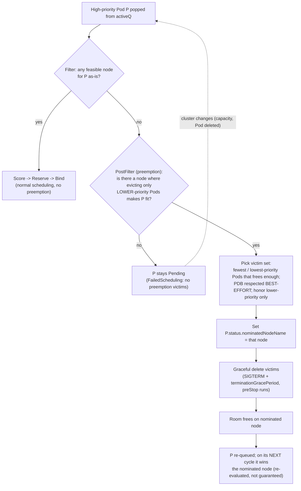

# 03 — Priority and preemption

> Ranking workloads under contention: `PriorityClass` (`value`,
> `globalDefault`, `preemptionPolicy`, the `system-*-critical` built-ins); the
> preemption flow (victim selection, graceful deletion, `PodDisruptionBudget`
> best-effort, the nominated node); preemption vs. node-pressure eviction vs.
> API-initiated eviction vs. `kubectl drain`; `cordon`/`drain`/`uncordon`
> mechanics; and the descheduler add-on — applied by giving the Bookstore a
> priority ladder so the data tier outranks the APIs, which outrank batch.

**Estimated time:** ~30 min read · ~60 min hands-on
**Prerequisites:** [Part 04 ch.01](01-scheduler-and-nodes.md) — the scheduling cycle that runs preemption · [Part 04 ch.02](02-affinity-taints-topology.md) — placement constraints that interact with preemption
**You'll know after this:** • design a PriorityClass ladder and understand `preemptionPolicy` · • trace the preemption flow (victim selection, graceful deletion, nominated node) · • distinguish preemption from node-pressure eviction, API-initiated eviction, and `kubectl drain` · • use `cordon` / `drain` / `uncordon` correctly during node maintenance · • give the Bookstore a priority ladder so the data tier outranks APIs which outrank batch

<!-- tags: scheduling, priority-classes, preemption, eviction, drain, pdb -->

## Why this exists

[ch.01](01-scheduler-and-nodes.md) and
[ch.02](02-affinity-taints-topology.md) decide *where* a Pod goes when there is
room. This chapter answers the harder question: **what happens when there
isn't.** A node fills up, the migration `Job` and `postgres` both want to
schedule, and the cluster must decide who waits and who wins — and, if it
matters enough, who gets *kicked off* to make room.

Without an explicit policy, that decision is essentially arbitrary (FIFO-ish by
arrival). For the Bookstore that is unacceptable: if capacity is tight, the
nightly `cleanup` CronJob must **never** push `postgres` or `catalog` out of the
way; if anything is sacrificed under pressure, it must be the deferrable batch
work, not the user-facing path or the database. `PriorityClass` makes that
ranking explicit and gives the scheduler permission to **preempt** (evict
lower-priority Pods to schedule a higher-priority one). This chapter also draws
the precise line between the four things people conflate —
**preemption**, **node-pressure eviction**, **API-initiated eviction**, and
**`kubectl drain`** — because confusing them is a classic production
mis-diagnosis.

## Mental model

Priority is a **single integer per Pod that orders the queue and licenses
eviction-for-room**:

- **Queue order.** In the scheduling queue ([ch.01](01-scheduler-and-nodes.md)),
  Pods are popped **highest priority first**. A high-priority Pod jumps ahead of
  a backlog of low-priority ones.
- **Preemption is the escalation.** If a Pod cannot schedule *anywhere* (Filter
  finds zero feasible nodes), `PostFilter` asks: *is there a node where evicting
  some lower-priority Pods would make this one fit?* If yes, the scheduler marks
  those lower-priority Pods for **graceful deletion** (preemption) and the
  incoming Pod gets a **nominated node** to land on once they are gone.
- **It only ever evicts strictly lower priority.** Preemption never touches Pods
  of equal or higher priority. A Pod with `preemptionPolicy: Never` keeps its
  high queue position but **will not evict anyone** to get scheduled.
- **Preemption ≠ eviction ≠ drain.** Preemption is the *scheduler* making room
  for a pending higher-priority Pod. **Node-pressure eviction** is the *kubelet*
  killing Pods because the *node* is out of memory/disk (ordered by
  [QoS](../01-core-workloads/03-resources-and-qos.md), not PriorityClass).
  **API-initiated eviction** is a client calling the eviction API (respects
  PodDisruptionBudgets *strictly*). **`kubectl drain`** is you, using
  API-initiated eviction to empty a node for maintenance. Different actor,
  different trigger, different rules — same visible symptom ("my Pod
  disappeared"), so you must know which one happened.

Bookstore ladder: `bookstore-data` (postgres) **>** `bookstore-critical`
(catalog/orders/storefront) **>** `bookstore-batch` (migration/cleanup) — far
below the cluster's `system-*-critical`.

## Diagrams

### Preemption decision & flow (Mermaid)



### The priority ladder & the four "Pod vanished" causes (ASCII)

```
PRIORITY LADDER (higher value = scheduled first, preempted last)

  2000001000  system-node-critical      (kube-proxy, CNI, node-critical add-ons)
  2000000000  system-cluster-critical   (CoreDNS, metrics-server, etc.)
  ─────────── built-in ceiling; Bookstore stays well below ───────────
     1000000  bookstore-data            postgres            (preempts lower if needed)
      100000  bookstore-critical        catalog/orders/storefront
        1000  bookstore-batch           db-migrate / cleanup (preemptionPolicy: Never)
           0  (no PriorityClass)        ad-hoc / default

FOUR DIFFERENT THINGS THAT REMOVE A RUNNING/PENDING POD
  Mechanism                 Actor       Trigger                 Ordering / rule
  ------------------------  ----------  ----------------------  --------------------------
  Preemption                scheduler   a higher-prio Pod is    strictly lower PRIORITY;
                                          Pending, needs room    PDB best-effort
  Node-pressure eviction    kubelet     node mem/disk/pid       QoS: BestEffort → Burstable
                                          threshold crossed       (over-request) → Guaranteed
  API-initiated eviction    any client  Eviction subresource    PDB STRICTLY enforced
  kubectl drain             you         node maintenance        = API eviction + cordon
```

## Hands-on with the Bookstore

**Assumed working directory: the guide repo root (`full-guide/`).** This
chapter adds a **new** manifest of PriorityClasses and wires the Bookstore
workloads to it. PriorityClass is **cluster-scoped** (no namespace) — apply it
before, or independently of, the workloads.

### 1. Apply the priority ladder

New file
[`examples/bookstore/raw-manifests/35-priorityclasses.yaml`](../examples/bookstore/raw-manifests/35-priorityclasses.yaml)
— three `PriorityClass` objects, **none `globalDefault: true`** (justification
in the file: a cluster-wide default would silently re-prioritise *every*
namespace's Pods — not ours to set; Pods without a class keep priority 0, which
is correctly below every Bookstore tier):

```yaml
apiVersion: scheduling.k8s.io/v1
kind: PriorityClass
metadata: { name: bookstore-data }
value: 1000000          # highest Bookstore tier: the stateful data (postgres)
globalDefault: false
description: "Bookstore stateful data tier. Scheduled first, preempted last."
---
apiVersion: scheduling.k8s.io/v1
kind: PriorityClass
metadata: { name: bookstore-critical }
value: 100000           # user-facing services (catalog/orders/storefront)
globalDefault: false
---
apiVersion: scheduling.k8s.io/v1
kind: PriorityClass
metadata: { name: bookstore-batch }
value: 1000             # deferrable batch (db-migrate Job / cleanup CronJob)
globalDefault: false
preemptionPolicy: Never # batch waits for room; it NEVER evicts others
```

```sh
# from the repo root (full-guide/) — cluster-scoped: no -n needed
kubectl apply -f examples/bookstore/raw-manifests/35-priorityclasses.yaml
kubectl get priorityclass | grep -E 'bookstore|system-'
#   bookstore-data      1000000   false
#   bookstore-critical  100000    false
#   bookstore-batch     1000      false   (and the built-in system-*-critical)
```

The wide value gaps only need to *order* the tiers; the space lets future
classes slot between them without renumbering. All three sit far below the
built-in `system-cluster-critical` (2000000000) / `system-node-critical`
(2000001000) so Bookstore can never out-prioritise CoreDNS, the CNI, or
kube-proxy — deliberate.

### 2. Wire the workloads (already layered into the manifests)

Each Bookstore workload now names its tier via `spec.template.spec.priorityClassName` — added as the *Part 04 ch.03 scheduling layer*, with **all
prior fields preserved**:

| Manifest | `priorityClassName` |
|---|---|
| [`20-postgres-statefulset.yaml`](../examples/bookstore/raw-manifests/20-postgres-statefulset.yaml) | `bookstore-data` |
| [`10-catalog-deploy.yaml`](../examples/bookstore/raw-manifests/10-catalog-deploy.yaml) | `bookstore-critical` |
| [`11-storefront-deploy.yaml`](../examples/bookstore/raw-manifests/11-storefront-deploy.yaml) | `bookstore-critical` |
| [`14-orders-deploy.yaml`](../examples/bookstore/raw-manifests/14-orders-deploy.yaml) | `bookstore-critical` |
| [`21-db-migrate-job.yaml`](../examples/bookstore/raw-manifests/21-db-migrate-job.yaml) | `bookstore-batch` |
| [`22-cleanup-cronjob.yaml`](../examples/bookstore/raw-manifests/22-cleanup-cronjob.yaml) | `bookstore-batch` |

```sh
# Re-apply ALL six wired workloads (PriorityClass must exist first — step 1).
# These are the exact six rows of the table above:
kubectl apply -f examples/bookstore/raw-manifests/20-postgres-statefulset.yaml
kubectl apply -f examples/bookstore/raw-manifests/10-catalog-deploy.yaml
kubectl apply -f examples/bookstore/raw-manifests/11-storefront-deploy.yaml
kubectl apply -f examples/bookstore/raw-manifests/14-orders-deploy.yaml
kubectl apply -f examples/bookstore/raw-manifests/21-db-migrate-job.yaml
kubectl apply -f examples/bookstore/raw-manifests/22-cleanup-cronjob.yaml

# The admission controller stamps the integer priority onto each Pod from its
# class — confirm the ladder took (db-migrate/cleanup pods appear once a Job
# tick has created them; the Deployments/StatefulSet show immediately):
kubectl get pods -n bookstore \
  -o custom-columns='POD:.metadata.name,PRIO:.spec.priority,CLASS:.spec.priorityClassName' \
  | sort -k2 -n
```

> A `PriorityClass` referenced by a Pod **must already exist** — the
> `Priority` admission plugin rejects a Pod whose `priorityClassName` is
> unknown. That is why `35-` is applied first, and why these names must match
> exactly between `35-` and every workload manifest. (This is also why the
> guide does not set `globalDefault: true`: it would change priority for Pods
> that never opted in, cluster-wide.)

### 3. Watch preemption actually happen

Create a low-priority "filler" that hogs a node, then schedule a high-priority
Pod that can only fit by evicting the filler. Uses public images and a throwaway
namespace-local name so no saved manifest changes:

```sh
ALLOC=$(kubectl get nodes -o jsonpath='{.items[0].status.allocatable.cpu}')
echo "node allocatable CPU = $ALLOC"   # size the requests near this

# (a) Low-priority filler: bookstore-batch, requests most of a node.
kubectl -n bookstore create deployment filler --image=registry.k8s.io/pause:3.9
kubectl -n bookstore patch deployment filler --type=json -p \
  '[{"op":"add","path":"/spec/template/spec/priorityClassName","value":"bookstore-batch"}]'
kubectl -n bookstore set resources deployment/filler --requests=cpu=900m
kubectl -n bookstore scale deployment/filler --replicas=4   # pack the node(s)
kubectl -n bookstore get pods -l app=filler -o wide

# (b) High-priority Pod that needs room the filler is occupying:
kubectl -n bookstore create deployment vip --image=registry.k8s.io/pause:3.9
kubectl -n bookstore patch deployment vip --type=json -p \
  '[{"op":"add","path":"/spec/template/spec/priorityClassName","value":"bookstore-data"}]'
kubectl -n bookstore set resources deployment/vip --requests=cpu=900m

# Watch: the scheduler PREEMPTS filler Pods (lower priority) to fit vip.
kubectl -n bookstore get events --sort-by=.metadata.creationTimestamp | tail -n 15
#   ... Preempted by bookstore/<VIP-POD> on node <NODE>
kubectl -n bookstore get pods -o wide   # some filler Pods terminated/Pending; vip Running
kubectl -n bookstore get pod -l app=vip \
  -o jsonpath='{.items[0].status.nominatedNodeName}{"\n"}'   # set during preemption

# Reverse: bookstore-batch has preemptionPolicy:Never — it never does this TO others.
kubectl -n bookstore delete deployment filler vip            # clean up
```

You just saw the full flow: `vip` (priority 1000000) was Pending → `PostFilter`
found that evicting `filler` (priority 1000) frees enough CPU → `filler` Pods
got a **graceful** SIGTERM (their `terminationGracePeriodSeconds` + any preStop
ran) → `vip.status.nominatedNodeName` was set → `vip` scheduled. Crucially,
`filler` could preempt **nothing** itself: `bookstore-batch` is
`preemptionPolicy: Never`.

### 4. `cordon` / `drain` / `uncordon` (the operator's tool)

```sh
NODE=$(kubectl get nodes -o jsonpath='{.items[0].metadata.name}')

kubectl cordon "$NODE"          # mark unschedulable (adds the unschedulable
                                # taint); existing Pods keep running
kubectl get node "$NODE"        # STATUS shows SchedulingDisabled

# Drain = cordon + API-initiated eviction of the node's Pods. DaemonSet Pods
# are not "drainable" (they target every node) and emptyDir data would be lost,
# so both must be acknowledged explicitly:
kubectl drain "$NODE" --ignore-daemonsets --delete-emptydir-data \
  --grace-period=30 --timeout=120s
#   evicts Pods one by one, RESPECTING PodDisruptionBudgets (blocks if a PDB
#   would be violated — unlike preemption, which only best-effort respects PDBs)

kubectl uncordon "$NODE"        # re-enable scheduling when maintenance is done
```

This is the production node-maintenance sequence (kernel patch, instance
replacement). Note the contrast the chapter is built around: **`drain` uses
API-initiated eviction and is *strictly* blocked by a PodDisruptionBudget**;
**preemption only respects PDBs best-effort** (it tries to avoid violating them,
but a high-priority pending Pod will still preempt if that is the only way). PDBs
are covered in depth in
[Part 06 ch.05](../06-production-readiness/05-reliability-and-disruptions.md);
here, just know which mechanism honors them strictly.

## How it works under the hood

- **`PriorityClass` → an integer stamped at admission.** `PriorityClass` is a
  cluster-scoped object mapping a name to a 32-bit `value`. When a Pod is
  created, the **`Priority` admission plugin** resolves
  `spec.priorityClassName` to that integer and writes it into the immutable
  `pod.spec.priority`. No class named ⇒ the value of the `globalDefault` class
  if one exists, else `0`. An **unknown** class name ⇒ the Pod is **rejected at
  admission** (hence the name must exist first, and must match between `35-` and
  the workloads). User-created classes are capped below
  `1000000000`; the two built-ins `system-cluster-critical` (2000000000) and
  `system-node-critical` (2000001000) are above that ceiling so platform Pods
  always outrank application Pods.
- **`globalDefault` and `preemptionPolicy`.** Exactly one PriorityClass may set
  `globalDefault: true`; it then supplies the priority for **every** Pod
  cluster-wide that omits `priorityClassName` — a blunt, cluster-scoped lever
  (the Bookstore deliberately sets none). `preemptionPolicy` defaults to
  `PreemptLowerPriority` (this Pod *may* preempt). `Never` means the Pod still
  gets its high **queue position** (it is scheduled ahead of lower-priority
  Pods when capacity exists) but its `PostFilter` will **not** evict anyone — it
  simply waits. `bookstore-batch` uses `Never`: batch should never disrupt
  serving or data to run sooner.
- **The preemption algorithm.** On `PostFilter` for a Pod `P` that failed
  Filter on all nodes, the scheduler, **per candidate node**, simulates removing
  the node's Pods **with priority strictly lower than `P`** and re-runs the
  Filter. Among nodes where that makes `P` fit, it picks one minimizing
  disruption: it tries to evict **the fewest, lowest-priority** Pods, prefers a
  victim set that **does not violate PodDisruptionBudgets** (best-effort — if no
  PDB-respecting set works, it will still preempt), and prefers victims whose
  removal is "cheapest". Chosen victims get **graceful deletion** (normal
  termination: `terminationGracePeriodSeconds`, `preStop` hook, `SIGTERM` then
  `SIGKILL`) — preemption is *not* a hard kill. `P` gets
  `status.nominatedNodeName` set so other scheduling sees the slot is spoken
  for; `P` is then re-queued and **re-evaluated** — it usually lands on the
  nominated node but is not contractually guaranteed to (the scheduler
  re-checks; conditions may have changed).
- **Preemption vs. node-pressure eviction — different ordering.** Preemption
  orders by **`pod.spec.priority`** (PriorityClass). **Node-pressure eviction**
  (the kubelet, when a node crosses a memory/disk/PID **eviction signal
  threshold** such as `memory.available<100Mi`) orders by **QoS then usage-over-
  requests**, *not* by PriorityClass: it reclaims by killing **BestEffort**
  first, then **Burstable** Pods most over their requests, then **Guaranteed**
  last — exactly the order from
  [Part 01 ch.03](../01-core-workloads/03-resources-and-qos.md). (Modern
  kubelets do consider priority as a secondary factor among same-QoS Pods, but
  QoS dominates.) So a high-`PriorityClass`, BestEffort Pod can still be
  node-pressure-evicted before a low-priority Guaranteed one — priority protects
  against the *scheduler preempting you*, QoS+requests protect against the
  *kubelet reclaiming you*. They are orthogonal; you need both set correctly.
- **API-initiated eviction & `drain`.** The **Eviction** subresource
  (`POST .../pods/<P>/eviction`) is a *policy-aware delete*: the API server
  permits it **only if it would not violate a `PodDisruptionBudget`** (otherwise
  `429 TooManyRequests`). `kubectl drain` = add the unschedulable taint
  (`cordon`) **then** API-evict each Pod, **strictly** honoring PDBs, retrying
  until the budget allows — which is why a too-strict PDB can make a drain hang
  (a real day-2 incident). `--ignore-daemonsets` is required because DaemonSet
  Pods are intentionally on every node and would just be recreated;
  `--delete-emptydir-data` acknowledges that `emptyDir` contents on that node
  are destroyed; `--force` additionally evicts "bare" (unmanaged) Pods that
  nothing would recreate. `cordon` alone only stops *new* placement;
  `uncordon` removes the unschedulable taint.
- **The descheduler (add-on, not core).** The scheduler decides placement
  *once*, at schedule time, and `IgnoredDuringExecution` means it never revisits
  it ([ch.02](02-affinity-taints-topology.md)). Over time the cluster drifts:
  nodes added after a Pod scheduled stay empty, anti-affinity that couldn't be
  satisfied earlier now could, a node is lopsidedly packed. The
  **`descheduler`** is an optional component (run as a Deployment/CronJob,
  *not* part of kube-scheduler) that periodically finds Pods violating
  configured strategies (`RemoveDuplicates`,
  `LowNodeUtilization`, `RemovePodsViolatingInterPodAntiAffinity`,
  `RemovePodsViolatingTopologySpreadConstraint`, …) and **evicts** them (via the
  eviction API, so PDBs apply) so the scheduler can place them afresh. It does
  not reschedule — it only evicts; the scheduler does the rest. It respects
  priority and PDBs and is the standard answer to "scheduling was fine but the
  cluster is now unbalanced".

## Production notes

> **In production:** define a small, explicit **priority ladder** (3–4 classes:
> data/critical/normal/batch) and set `priorityClassName` on every workload.
> Without it, the scheduler's tie-break is effectively arbitrary and a batch Job
> can delay a customer-facing rollout. Keep all app classes **well below**
> `system-cluster-critical`/`system-node-critical` so workloads can never
> starve CoreDNS/CNI/kube-proxy — an inverted ladder there is a cluster-wide
> outage.

> **In production:** be deliberate with `globalDefault: true`. It silently
> applies to **every** Pod cluster-wide that omits a class, across all
> namespaces — easy to make everything "high" and so nothing high. Prefer no
> global default (Pods default to 0) and explicit `priorityClassName`, or set
> the global default to a clearly *low/normal* value, never a high one.

> **In production:** give deferrable/batch work `preemptionPolicy: Never`. It
> still schedules ahead of *even lower* priority when capacity exists, but never
> evicts serving or data Pods to run sooner — the Bookstore's
> `bookstore-batch` does exactly this. Reserve preemption (the default policy)
> for things that genuinely must run *now*.

> **In production:** **priority and QoS are orthogonal — set both.**
> PriorityClass governs scheduler **preemption**; QoS + requests govern kubelet
> **node-pressure eviction**. A critical Pod that is `BestEffort` will still be
> the first thing the kubelet kills under node memory pressure regardless of its
> high priority. Make must-not-die Pods *both* high-priority *and* Guaranteed
> (request==limit), as the Bookstore does for Postgres.

> **In production:** PDBs are honored **strictly by `drain`/eviction** but only
> **best-effort by preemption**. Size PDBs so maintenance can proceed (not
> `minAvailable: 100%` for a multi-replica service), and remember a
> high-priority pending Pod can still preempt across a PDB. Automate
> `cordon`→`drain`→patch→`uncordon`; a hung drain is almost always an
> over-strict PDB or unignored DaemonSet
> ([Part 06 ch.05](../06-production-readiness/05-reliability-and-disruptions.md),
> [Part 08 ch.01](../08-day-2-operations/01-cluster-lifecycle.md)).

> **In production:** consider the **descheduler** once the cluster is large
> enough to drift (autoscaled node pools, frequent rollouts). It rebalances by
> evicting (PDB-respecting) Pods so the scheduler re-places them — pair it with
> sane PriorityClasses/PDBs so it cannot evict something critical at the wrong
> moment. It is an add-on you opt into, not default behavior.

## Quick Reference

```sh
kubectl get priorityclass                                  # all classes + values
kubectl get pod <P> -n <NS> \
  -o custom-columns='P:.metadata.name,PRIO:.spec.priority,CLASS:.spec.priorityClassName'
kubectl get pod <P> -n <NS> -o jsonpath='{.status.nominatedNodeName}'  # preemption target
kubectl get events -n <NS> --field-selector reason=Preempted           # who preempted whom
kubectl get pod <P> -n <NS> -o jsonpath='{.status.qosClass}'           # eviction (kubelet) order

# Node maintenance
kubectl cordon   <NODE>                                    # stop new scheduling
kubectl drain    <NODE> --ignore-daemonsets --delete-emptydir-data --timeout=120s
kubectl uncordon <NODE>                                    # resume scheduling
```

Minimal skeletons:

```yaml
apiVersion: scheduling.k8s.io/v1
kind: PriorityClass
metadata: { name: bookstore-critical }   # cluster-scoped: NO namespace
value: 100000
globalDefault: false                     # avoid true unless deliberately cluster-wide
preemptionPolicy: PreemptLowerPriority    # or Never (high queue spot, no evicting)
description: "User-facing services."
---
apiVersion: apps/v1
kind: Deployment
spec:
  template:
    spec:
      priorityClassName: bookstore-critical   # name MUST exist (admission rejects unknown)
```

Checklist:

- [ ] An explicit 3–4 tier PriorityClass ladder exists; every workload sets `priorityClassName`
- [ ] All app classes are below `system-cluster-critical`/`system-node-critical`
- [ ] No unintended `globalDefault: true` (or it is a low/normal value)
- [ ] Batch/deferrable work uses `preemptionPolicy: Never`
- [ ] Must-not-die Pods are **both** high-priority **and** Guaranteed QoS
- [ ] PDBs sized so `drain` can proceed; drain script uses `--ignore-daemonsets`
- [ ] Know which removed your Pod: preemption (priority) vs. node-pressure (QoS) vs. drain (PDB)

## Test your understanding

> Try each before opening the answer drawer. The act of trying is the exercise; the answer is the check.

1. **Explain the difference between scheduler preemption and kubelet node-pressure eviction. Both make a Pod disappear under "out of capacity" — how do you tell which one happened?**
   <details><summary>Show answer</summary>

   Preemption is the scheduler proactively evicting strictly *lower-priority* Pods to make room for a Pending higher-priority Pod — ordered by `pod.spec.priority`. Node-pressure eviction is the kubelet killing Pods because the node crossed a memory/disk/PID threshold — ordered by QoS (BestEffort first, then Burstable most-over-requests, Guaranteed last). Tell them apart: `kubectl get events --field-selector reason=Preempted` for the scheduler; `kubectl describe node` Events show `Evicted` with `MemoryPressure` for the kubelet (see §Mental model and §How it works, "Preemption vs. node-pressure eviction").

   </details>

2. **A teammate sets `globalDefault: true` on a PriorityClass with value `100000`. What's the cluster-wide effect, and why is this almost always the wrong move?**
   <details><summary>Show answer</summary>

   Every Pod across every namespace that doesn't specify `priorityClassName` now gets priority 100000 — including ad-hoc debug Pods, dev workloads, test runs. The ladder is now "everything is high", so nothing is high relative to anything else, and preemption becomes random among tied priorities. Worse, scaling system add-ons or platform tooling without setting an explicit lower class accidentally promotes them. Prefer no `globalDefault` (Pods default to 0) and explicit class names (see §Production notes).

   </details>

3. **The Bookstore's `db-migrate` Job has `priorityClassName: bookstore-batch` with `preemptionPolicy: Never`. What does this achieve, and how does it differ from a class with the default preemption policy?**
   <details><summary>Show answer</summary>

   With `Never`, the Job still gets its low queue position (scheduled ahead of unclassed Pods when capacity exists), but its `PostFilter` will *not* evict any other Pod to make room for it — batch waits for natural capacity. The default `PreemptLowerPriority` would let batch evict anything below its priority. `Never` is the right choice for deferrable work: schedule when there's room, never disrupt serving or data tiers to run sooner (see §1. Apply the priority ladder and §How it works, preemptionPolicy).

   </details>

4. **You run `kubectl drain node-1`, and it hangs forever even though there's only one Deployment with 3 replicas. List two PDB-related explanations and the fix.**
   <details><summary>Show answer</summary>

   (1) PDB `minAvailable: 3` for a 3-replica Deployment: any eviction would violate the budget, so the API-eviction returns 429 forever. (2) PDB `maxUnavailable: 0`: same effect from the other side. Drain *strictly* honors PDBs (unlike preemption, which respects them best-effort). Fix: relax the PDB to `minAvailable: 2` (or `maxUnavailable: 1`), so 2 of 3 must remain — drain can take one Pod at a time per node (see §4. cordon/drain/uncordon and §Production notes, "PDBs honored strictly by drain").

   </details>

5. **Hands-on extension: apply the Bookstore PriorityClasses, deploy a "filler" Deployment with `priorityClassName: bookstore-batch` that requests most of a node's CPU, then deploy a `bookstore-data` Pod that needs that CPU. What do you observe in `kubectl get events`, and what would change if you reversed the priority classes?**
   <details><summary>What you should see</summary>

   You see `Preempted` events for filler Pods — the scheduler evicts them (graceful SIGTERM + terminationGracePeriod) to make room for the data Pod, which then schedules on the freed node (its `status.nominatedNodeName` set during the gap). Reversing priorities makes filler the higher tier: now `bookstore-data` would have no lower-priority Pods to preempt and would simply stay `Pending` until natural capacity appears (see §3. Watch preemption actually happen).

   </details>

## Further reading

- **Ibryam & Huß, _Kubernetes Patterns_ 2e — *Automated Placement* (ch.6)** —
  Pod priority and preemption as part of the placement model, and how it
  interacts with resource demands and QoS.
- **Rosso et al., _Production Kubernetes_, ch.14 — "Application Considerations"**
  — priority, disruption budgets, and graceful handling of eviction/drain in
  production application design.
- Official:
  <https://kubernetes.io/docs/concepts/scheduling-eviction/pod-priority-preemption/>,
  node-pressure eviction
  <https://kubernetes.io/docs/concepts/scheduling-eviction/node-pressure-eviction/>,
  and safely draining a node
  <https://kubernetes.io/docs/tasks/administer-cluster/safely-drain-node/>.
