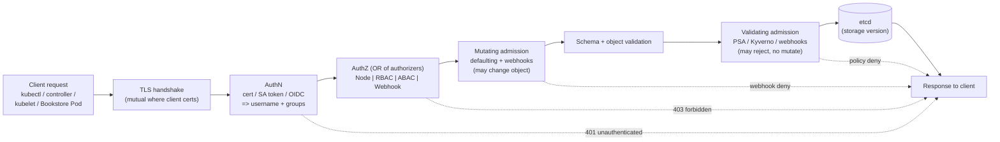

# 01 — Authentication, authorization, RBAC

> The full API request gauntlet: TLS → **authentication** (who are you?) →
> **authorization** (may you?) → **admission** (mutate then validate) → etcd;
> why there are no User objects; ServiceAccounts and bound/projected tokens;
> RBAC end to end (Role vs ClusterRole, bindings, verbs/resources/resourceNames,
> aggregation, the default ClusterRoles, `auth can-i` + impersonation) — applied
> by giving every Bookstore service its own least-privilege identity.

**Estimated time:** ~30 min read · ~60 min hands-on
**Prerequisites:** [Part 00 ch.04](../00-foundations/04-control-plane-deep-dive.md) — the API request pipeline (authn → authz → admission) · [Part 00 ch.06](../00-foundations/06-declarative-api-model.md) — apiVersion/Kind and resource verbs · [Part 03 ch.02](../03-config-and-storage/02-secrets.md) — ServiceAccount tokens land as projected volumes
**You'll know after this:** • distinguish authentication, authorization and admission as separate stages · • create ServiceAccounts and bind them to least-privilege Roles/ClusterRoles · • read RBAC verbs, resources and resourceNames to predict whether a request is allowed · • use `kubectl auth can-i` and impersonation to debug access denials · • replace the default ServiceAccount with per-workload identities across the Bookstore

<!-- tags: security, rbac, foundations, core-objects, day-2 -->

## Why this exists

[Part 00 ch.04](../00-foundations/04-control-plane-deep-dive.md) established
that the API server is the *only* door to the cluster and that every request
runs a fixed pipeline. That chapter named the stages; this one **operates**
them, because every access-control bug and every "why can this pod do that?"
question is answered inside this pipeline.

The Bookstore has shipped happily so far on an unstated assumption: every
workload runs as the namespace's **`default` ServiceAccount**, which on a fresh
cluster can do almost nothing — *by luck, not design*. That is exactly the
anti-pattern: a shared, ambient identity whose permissions nobody reviewed. A
catalog Pod that is compromised should not be able to read the database Secret,
list every Pod, or — worst — modify RBAC. To make "least privilege" real you
must know precisely **who a request is, how that is decided, and how
permissions are granted and scoped**. This is the [Access
Control](#further-reading) pattern.

## Mental model

Think of the API server as a **secure building with three checkpoints in a
fixed order**, and you never reach the next one until you clear the current:

1. **Authentication — the ID check at the door.** "Prove who you are."
   Kubernetes itself has **no user database**: identity is *asserted by a
   trusted authenticator* (a client certificate signed by the cluster CA, a
   ServiceAccount bearer token, an OIDC token from your IdP). Output: a
   username + groups, or `401`. A *human* "user" is just a string the
   authenticator vouches for; there is no `User` object you can `kubectl get`.
2. **Authorization — the access list.** "You are `alice` / this Pod's SA — are
   you allowed to *create pods in namespace bookstore*?" One or more
   authorizers (Node, **RBAC**, ABAC, Webhook) vote; they are **OR'd** — the
   first to say *allow* wins; if none allow, `403`.
3. **Admission — the inspector.** Already-authorized requests are first
   *mutated* (defaulting, webhooks, sidecar injection) **then** *validated*
   (schema, then validating webhooks/policy — PSA, Kyverno). Only a request
   that survives all three is converted to storage form and written to etcd.

Two invariants to keep: **mutate-before-validate is fixed** (a validating
policy always sees the final object), and **the API server is the sole etcd
client** (so this gauntlet is the *only* place anything is enforced — raw etcd
access bypasses all of it, which is why etcd access ≈ cluster-admin).

## Diagrams

### The request pipeline: TLS → authN → authZ → admission → etcd (Mermaid)



### RBAC object matrix: scope × binding (ASCII)

```
                 │ grants permissions for ...        │ ... where it applies
 ────────────────┼───────────────────────────────────┼────────────────────────
 Role            │ namespaced resources in ONE ns     │ that one namespace
 ClusterRole     │ cluster-scoped resources, OR       │ cluster-wide, OR
                 │ namespaced resources as a template │ (per binding below)
 ────────────────┼───────────────────────────────────┼────────────────────────
 RoleBinding     │ binds a Role  OR a ClusterRole ... │ ... within ONE namespace
 ClusterRole-    │ binds a ClusterRole only ......... │ ... cluster-wide
   Binding       │                                    │   (every namespace)
 ────────────────┴───────────────────────────────────┴────────────────────────
 Key combinations:
   Role           + RoleBinding         -> perms in one ns (Bookstore uses this)
   ClusterRole    + RoleBinding         -> reusable perm set, applied to ONE ns
   ClusterRole    + ClusterRoleBinding  -> cluster-wide (e.g. cluster-admin)
   Role           + ClusterRoleBinding  -> INVALID (a Role can't go cluster-wide)
 RBAC is PURELY ADDITIVE: no deny rules. Absence of an allow = denied.
 A subject's permissions = union of every binding that names it.
```

## Hands-on with the Bookstore

**Assumed working directory: the guide repo root (`full-guide/`).** Requires
the `bookstore` namespace ([Part 01 ch.03](../01-core-workloads/03-resources-and-qos.md)).
This chapter adds **`05-serviceaccounts-rbac.yaml`** (numbered `05-` so a
whole-dir apply creates the identities right after the namespace and *before*
any workload that references them) and wires `serviceAccountName` +
`automountServiceAccountToken: false` into the workloads — purely additive
edits; every prior field (config, Secret-built `DB_DSN`, probes, `preStop`
sleep, volumes, labels, the Part 04 scheduling layer) is unchanged.

### 1. Inspect the pipeline you already depend on

```sh
# AuthN: who does the API server think YOU are (from your kubeconfig)?
kubectl auth whoami
# AuthZ stage, directly — the SubjectAccessReview API behind `can-i`:
kubectl auth can-i create pods -n bookstore
kubectl auth can-i 'delete' clusterroles            # almost certainly: no
# What can the *default* SA in bookstore do? (the ambient identity so far)
kubectl auth can-i --list \
  --as=system:serviceaccount:bookstore:default -n bookstore
#   → essentially nothing useful: that it "works" today is luck, not design.
```

### 2. Create a dedicated, least-privilege identity per service

New file
[`examples/bookstore/raw-manifests/05-serviceaccounts-rbac.yaml`](../examples/bookstore/raw-manifests/05-serviceaccounts-rbac.yaml).
It defines one ServiceAccount per workload and *one* tiny Role. The design
decision: **the Go services and the stock images never call kube-apiserver**
(verified in [`app/catalog/main.go`](../examples/bookstore/app/catalog/main.go)
— it talks to Postgres/Redis, never the Kubernetes API). So the correct least
privilege is **no API permissions and no mounted token at all**:

```yaml
apiVersion: v1
kind: ServiceAccount
metadata: { name: catalog-sa, namespace: bookstore }
automountServiceAccountToken: false      # no projected token mounted
---
apiVersion: rbac.authorization.k8s.io/v1
kind: Role                               # namespaced
metadata: { name: catalog-config-reader, namespace: bookstore }
rules:
  - apiGroups: [""]                      # "" = core group (configmaps)
    resources: ["configmaps"]
    resourceNames: ["catalog-config"]    # ONLY this object, by name
    verbs: ["get"]                       # not list/watch (they ignore names)
---
apiVersion: rbac.authorization.k8s.io/v1
kind: RoleBinding
metadata: { name: catalog-config-reader-binding, namespace: bookstore }
subjects: [ { kind: ServiceAccount, name: catalog-sa, namespace: bookstore } ]
roleRef: { kind: Role, name: catalog-config-reader, apiGroup: rbac.authorization.k8s.io }
```

`storefront-sa`, `orders-sa`, `postgres-sa`, `redis-sa`, `rabbitmq-sa` and the
batch `migrate-sa` (shared by the `db-migrate` Job and `cleanup` CronJob) get
**no** binding — with no RoleBinding/ClusterRoleBinding naming them, RBAC
denies them everything, which is exactly right for a workload that never calls
the API. There is **one SA per workload and no Bookstore Pod uses the
namespace `default` SA** (the production-note rule, applied to itself). The
`catalog` Role is a deliberately minimal **teaching** example of resource-name
scoping
(`get` on exactly one named ConfigMap; `list`/`watch` are *not* granted
because they ignore `resourceNames` and would leak every ConfigMap's
existence). It grants **nothing** on `secrets`: a `get secrets` returns
cleartext, so that verb is credential disclosure
([Part 03 ch.02](../03-config-and-storage/02-secrets.md)).

```sh
# from the repo root (full-guide/)
kubectl apply -f examples/bookstore/raw-manifests/00-namespace.yaml
kubectl apply -f examples/bookstore/raw-manifests/05-serviceaccounts-rbac.yaml
kubectl get sa,role,rolebinding -n bookstore
```

### 3. Wire the identities into the workloads (additive)

[`10-catalog-deploy.yaml`](../examples/bookstore/raw-manifests/10-catalog-deploy.yaml),
[`11-storefront-deploy.yaml`](../examples/bookstore/raw-manifests/11-storefront-deploy.yaml),
[`14-orders-deploy.yaml`](../examples/bookstore/raw-manifests/14-orders-deploy.yaml)
and [`20-postgres-statefulset.yaml`](../examples/bookstore/raw-manifests/20-postgres-statefulset.yaml)
each gain two fields in `template.spec` (nothing else changes):

```yaml
    spec:
      serviceAccountName: catalog-sa          # the workload's own identity
      automountServiceAccountToken: false     # belt-and-braces: no token mounted
      # ...all prior fields (scheduling layer, containers, volumes) unchanged...
```

The **same two fields are added to every other Bookstore workload** in the
namespace as well — `12-redis.yaml` (`redis-sa`), `13-rabbitmq.yaml`
(`rabbitmq-sa`), the manual-canary `30-catalog-canary.yaml` (`catalog-sa`,
both stable+canary templates), and the `postgres:16` DB batch jobs
`21-db-migrate-job.yaml` / `22-cleanup-cronjob.yaml` (the shared `migrate-sa`).
No Bookstore Pod is left on the `default` ServiceAccount. The four manifests
above are shown as the worked example; the edits are mechanically identical
everywhere.

(The per-workload `securityContext` *fields* are added to these manifests in
[ch.02](02-pod-security.md); this chapter's manifest edits are identity only.
Note this is distinct from the namespace's PSA `restricted` *labels*, which
are already present in the shared `00-namespace.yaml` you applied above —
ch.02 explains them, but they are enforcing from the first apply, hence the
restricted-shaped debug pod earlier.) Apply the prerequisites then the
workload:

```sh
# from the repo root (full-guide/) — prerequisite chain, in order
kubectl apply -f examples/bookstore/raw-manifests/00-namespace.yaml
kubectl apply -f examples/bookstore/raw-manifests/05-serviceaccounts-rbac.yaml
kubectl apply -f examples/bookstore/raw-manifests/15-catalog-config.yaml
kubectl apply -f examples/bookstore/raw-manifests/16-db-credentials.yaml
# cluster-scoped scheduling dep + local image (Part 04 / repo README):
kubectl apply -f examples/bookstore/raw-manifests/35-priorityclasses.yaml
kind load docker-image bookstore/catalog:dev --name bookstore   # if using kind
# catalog carries DB_DSN, so it needs Postgres + the schema Job to go Ready
# (its /readyz pings Postgres). Bring those up and gate on the Job first.
kubectl apply -f examples/bookstore/raw-manifests/20-postgres-statefulset.yaml
kubectl rollout status statefulset/postgres -n bookstore
kubectl apply -f examples/bookstore/raw-manifests/21-db-migrate-job.yaml   # schema
kubectl wait --for=condition=complete job/db-migrate -n bookstore --timeout=120s
kubectl apply -f examples/bookstore/raw-manifests/10-catalog-deploy.yaml
kubectl rollout status deployment/catalog -n bookstore
```

### 4. Prove the least privilege — and prove the token is gone

```sh
# catalog-sa can GET its one ConfigMap by name, and NOTHING else:
kubectl auth can-i get configmap/catalog-config \
  -n bookstore --as=system:serviceaccount:bookstore:catalog-sa     # yes
kubectl auth can-i list configmaps \
  -n bookstore --as=system:serviceaccount:bookstore:catalog-sa     # no
kubectl auth can-i get secret/db-credentials \
  -n bookstore --as=system:serviceaccount:bookstore:catalog-sa     # no
kubectl auth can-i --list \
  -n bookstore --as=system:serviceaccount:bookstore:orders-sa      # ~nothing

# The token is genuinely not projected. catalog is distroless (no shell) —
# inspect from an EPHEMERAL public-image Pod using the SAME ServiceAccount.
# IMPORTANT: `bookstore` already enforces PSA `restricted` (it is baked into
# the single canonical 00-namespace.yaml from the start — the labels and the
# full reasoning are ch.02's topic, but the file carries them now, so this
# applies HERE too). Therefore EVERY ad-hoc debug Pod you run in `bookstore`
# must itself be restricted-compliant or PSA rejects it before it starts —
# busybox/curl/netshoot all run fine under this securityContext, so set it:
kubectl run sa-peek -n bookstore --image=busybox:1.36 --restart=Never -i --rm \
  --overrides='{"spec":{"serviceAccountName":"catalog-sa",
    "automountServiceAccountToken":false,
    "securityContext":{"runAsNonRoot":true,"runAsUser":65532,
      "seccompProfile":{"type":"RuntimeDefault"}},
    "containers":[{"name":"sa-peek","image":"busybox:1.36",
      "securityContext":{"allowPrivilegeEscalation":false,
        "capabilities":{"drop":["ALL"]}},
      "command":["sh","-c","ls /var/run/secrets/kubernetes.io/serviceaccount 2>&1 || echo NO-TOKEN-MOUNTED"]}]}}'
#   → NO-TOKEN-MOUNTED : the SA exists, but no API credential is in the Pod.
#   (`--as` is impersonation: it needs RBAC to impersonate; cluster-admin
#    kubeconfigs have it. It's the canonical way to audit another identity.)
```

> **Why these `--overrides` (a teaching point, not a workaround).** This guide
> uses **one canonical `00-namespace.yaml`**, and it carries the
> `pod-security.kubernetes.io/enforce: restricted` labels from the very first
> apply (the mechanics and rationale are [ch.02](02-pod-security.md)'s subject;
> the file is shared, not duplicated per chapter). A practical consequence
> lands *here*, in ch.01: the moment you `kubectl apply 00-namespace.yaml`,
> **any** Pod in `bookstore` — including a throwaway `kubectl run` debug Pod —
> must satisfy `restricted` or admission rejects it. So every ephemeral pod in
> the Part 05 hands-on includes the restricted `securityContext` shown above
> (`runAsNonRoot`, `runAsUser`, `seccompProfile: RuntimeDefault`,
> `allowPrivilegeEscalation: false`, `drop: ["ALL"]`). Internalize this now:
> hardening a namespace hardens *everything* you run in it, debugging
> included.

> **Lineage / forward refs.** This chapter establishes *identity* and *RBAC*.
> [ch.02](02-pod-security.md) **owns and explains** the `restricted` PSA
> labels and the workloads' `securityContext` — those labels live in the
> single shared `00-namespace.yaml` and are already in force the moment you
> apply it (which is why the debug pod above is restricted-shaped); ch.02 is
> where the *why* and *how* are taught, not where they are first switched on.
> [ch.03](03-supply-chain.md) adds an admission **policy** (Kyverno) at the
> validating-admission stage you saw above; [ch.04](04-secrets-and-cluster-hardening.md)
> deepens Secret encryption + **audit logging** (which records every
> authN/authZ decision made here). RBAC on `secrets` was introduced in
> [Part 03 ch.02](../03-config-and-storage/02-secrets.md) — this chapter is the
> general model behind it.

## How it works under the hood

### Authentication — every credential is "asserted identity"

The API server runs configured authenticators **in order**; the first to
positively identify the request wins, producing a `user.Info` (a username
string + a set of group strings). Kubernetes stores **no** user records — it
*trusts the authenticator*. The common ones:

- **X.509 client certificates.** The client presents a TLS cert signed by the
  cluster CA; `CN` → username, `O` (organization) → groups. This is how admin
  kubeconfigs and kubelets authenticate. Revocation is awkward (no CRL by
  default) — short-lived certs or another method is preferred for humans.
- **ServiceAccount tokens (the workload identity).** A signed JWT whose subject
  is `system:serviceaccount:<NS>:<NAME>` with groups
  `system:serviceaccounts` and `system:serviceaccounts:<NS>`. Modern clusters
  issue **bound, projected** tokens via the **TokenRequest** API: the kubelet
  mounts a short-lived token that is *audience-scoped*, *time-limited*, **and
  bound to the Pod object** (it is invalidated when the Pod is deleted) and
  auto-rotated before expiry. The legacy model — a permanent token in a
  `Secret` auto-created per SA — is **deprecated and off by default** (no
  auto-created token Secret in current Kubernetes); a never-expiring token is a
  standing liability. `automountServiceAccountToken: false` (set on both the SA
  and the podSpec in the Bookstore) stops even the projected token from being
  mounted when the workload never calls the API.
- **OIDC.** For *humans*: the API server validates an ID token from your
  identity provider (`--oidc-issuer-url` etc.); claims map to username/groups.
  This is how real clusters do SSO — there is still no User object, just a
  trusted issuer.
- **Webhook / authenticating proxy.** The API server delegates token review to
  an external service (used by managed providers, e.g. EKS's IAM
  authenticator).

`kubectl auth whoami` shows the result of this stage for *your* kubeconfig.

### Authorization — OR of authorizers, RBAC the workhorse

After identity, the configured authorizers (`--authorization-mode`) are
consulted **in order and OR'd** — any *allow* permits the request; an explicit
*no opinion* falls through to the next; only if none allow is it `403`. The
typical chain is `Node,RBAC` (kubelets are authorized by the **Node**
authorizer; everything else by **RBAC**). Other modes: **ABAC** (static
attribute file — legacy), **Webhook** (external decision — how cloud IAM is
bolted on). **RBAC** is the one you author:

- A **Role** (namespaced) / **ClusterRole** (cluster-scoped or a reusable
  template) holds `rules`, each = `apiGroups` × `resources` (optionally
  `subresources` like `pods/exec`, `pods/log`, and/or `resourceNames` to scope
  to specific objects) × `verbs` (`get list watch create update patch delete
  deletecollection`, plus non-resource verbs and special ones like
  `impersonate`, `bind`, `escalate`). `apiGroups: [""]` is the **core** group
  (pods, services, configmaps, secrets). `resourceNames` constrains to named
  objects **but is ignored by `list`/`watch`/`create`** (you cannot
  name-scope a collection list) — which is exactly why the Bookstore Role
  grants only `get`.
- A **RoleBinding** grants a Role *or* a ClusterRole **within one namespace**;
  a **ClusterRoleBinding** grants a ClusterRole **cluster-wide**. (A
  ClusterRole bound by a RoleBinding applies only in that binding's namespace —
  the standard way to reuse a permission template per-namespace.)
- RBAC is **purely additive — there are no deny rules.** A subject's effective
  permission is the **union** of every binding that names it (directly or via a
  group). "Restricting" something means *not granting it* (and ensuring no
  other binding grants it) — there is no override. This is why over-broad
  default bindings are dangerous: you can't subtract them, only avoid/remove.
- **The `system:masters` super-group bypasses RBAC entirely.** Any request
  whose authenticated groups include `system:masters` is granted
  *unconditional* cluster-admin by a hard-coded authorizer that runs *before*
  RBAC — **no RoleBinding is involved and none can revoke it** (RBAC has no
  deny rules, so you cannot "restrict" `system:masters`). The kubeadm-generated
  admin client certificate is exactly `O=system:masters` (that's why it is
  all-powerful). The *only* mitigation is **not issuing** certs/tokens that
  carry that group: treat the `system:masters` kubeconfig as a break-glass
  credential, keep it offline, and give humans/automation narrowly-bound
  identities instead.
- **Aggregation.** A ClusterRole with `aggregationRule.clusterRoleSelectors`
  auto-unions in the rules of any ClusterRole matching the label selector. The
  built-in `admin`/`edit`/`view` roles are aggregated, which is how installing
  a CRD's `*-aggregate-to-edit` ClusterRole instantly extends `edit` to that
  CRD with no edit to the base role.
- **Default ClusterRoles** ship on every cluster: `cluster-admin` (everything,
  via `*`), `admin` (full namespace control incl. RBAC within the ns, via a
  RoleBinding), `edit` (read/write most objects but **not** RBAC and **not**
  read Secrets in newer versions), `view` (read-only, **excludes Secrets**).
  Bind these by reference; don't recreate them. `system:*` ClusterRoles wire
  up the control plane itself.

`kubectl auth can-i <VERB> <RESOURCE> [--as=<USER_OR_SA>] [-n ns]` runs a
**SubjectAccessReview** — it asks the *real* authorizer, so it's the
authoritative audit tool (and `--list` enumerates everything an identity can
do). `--as` / `--as-group` is **impersonation**, itself an RBAC-gated power
(`impersonate` verb): cluster-admins can act as any subject to test policy
without that subject's credentials.

### Admission — the last word (covered next, anchored here)

Authorized requests are then **mutated** (built-in plugins like
`ServiceAccount`, `LimitRanger`, `DefaultStorageClass`, plus mutating webhooks)
and only afterwards **validated** (schema, then `ResourceQuota`, **Pod Security
Admission**, validating webhooks / Kyverno / ValidatingAdmissionPolicy). This
is the seam [ch.02](02-pod-security.md) and [ch.03](03-supply-chain.md) plug
into; the ordering guarantee (mutate→validate) is why a validating policy can
trust it sees the final object.

## Production notes

> **In production:** **never run workloads as the `default` ServiceAccount.**
> Give every workload its own SA, grant it the minimum, and set
> `automountServiceAccountToken: false` for the (common) case where the app
> never calls the API. A leaked token from an over-permissioned shared SA is a
> lateral-movement highway.

> **In production:** treat **`get/list/watch secrets`**, **`pods/exec`**,
> **`pods/attach`**, **`impersonate`**, **`escalate`/`bind`**, and **`create`
> on RBAC objects** as crown-jewel verbs. They are all paths to credentials or
> privilege escalation; audit them with `kubectl auth can-i --list --as=…`,
> alarm on RBAC changes (you wire this audit rule in
> [ch.04](04-secrets-and-cluster-hardening.md)), and prefer admission policy
> that blocks over-broad grants.

> **In production:** scope tightly with **Role + RoleBinding per namespace**;
> reserve `ClusterRoleBinding` for genuinely cluster-wide needs. Reuse the
> aggregated `view`/`edit`/`admin` ClusterRoles rather than hand-rolling broad
> custom roles, and remember `edit`/`view` deliberately exclude Secrets in
> current versions — don't undo that.

> **In production (managed — EKS/GKE/AKS):** cluster identity is bridged to
> cloud IAM. **EKS** maps IAM principals to Kubernetes users/groups (the
> aws-auth/Access Entries → then RBAC) and **IRSA** lets a Pod's
> ServiceAccount assume an IAM role via a projected OIDC token. **GKE
> Workload Identity** binds a KSA to a Google service account the same way;
> **AKS** uses Microsoft Entra Workload ID. The pattern is identical: the
> *projected, audience-bound SA token* is exchanged for a cloud credential —
> so the bound-token mechanics above are not academic, they are how Pods get
> cloud access without static keys.

> **In production:** prefer **OIDC SSO for humans** (short-lived tokens, central
> revocation, MFA) over long-lived client certs (no built-in revocation). Bind
> *groups* from the IdP to RBAC, not individuals, so access follows directory
> membership.

## Quick Reference

```sh
kubectl auth whoami                                   # your identity (authN result)
kubectl auth can-i <VERB> <RES> [-n ns]               # your authZ (SubjectAccessReview)
kubectl auth can-i --list -n <NS>                     # everything you can do there
kubectl auth can-i <VERB> <RES> \
  --as=system:serviceaccount:<NS>:<SA> [-n ns]        # audit a workload identity
kubectl auth can-i get secret/<N> --as=<USER> -n <NS> # check a name-scoped grant
kubectl get sa,role,rolebinding,clusterrole,clusterrolebinding [-n ns]
kubectl describe clusterrole view                     # inspect a default role
kubectl create role r --verb=get --resource=configmaps \
  --resource-name=catalog-config -n <NS> --dry-run=client -o yaml   # author
```

Minimal least-privilege identity skeleton:

```yaml
apiVersion: v1
kind: ServiceAccount
metadata: { name: app-sa, namespace: <NS> }
automountServiceAccountToken: false       # if the app never calls the API
---
apiVersion: rbac.authorization.k8s.io/v1
kind: Role
metadata: { name: app-role, namespace: <NS> }
rules:
  - apiGroups: [""]
    resources: ["configmaps"]
    resourceNames: ["app-config"]          # scope to named object (get only)
    verbs: ["get"]
---
apiVersion: rbac.authorization.k8s.io/v1
kind: RoleBinding
metadata: { name: app-rb, namespace: <NS> }
subjects: [ { kind: ServiceAccount, name: app-sa, namespace: <NS> } ]
roleRef:  { kind: Role, name: app-role, apiGroup: rbac.authorization.k8s.io }
# in the workload: spec.serviceAccountName: app-sa
#                  spec.automountServiceAccountToken: false
```

Checklist:

- [ ] Every workload has a **dedicated** ServiceAccount (never `default`)
- [ ] `automountServiceAccountToken: false` where the app doesn't call the API
- [ ] Roles grant the **minimum** verbs; `resourceNames` + `get` over blanket `list`
- [ ] **No** `get/list/watch secrets` granted unless strictly required
- [ ] `Role`+`RoleBinding` per namespace; `ClusterRoleBinding` only when cluster-wide
- [ ] Reuse aggregated `view`/`edit`/`admin`; don't recreate broad roles
- [ ] `kubectl auth can-i --list --as=…` run for each SA (verified least privilege)
- [ ] RBAC-change / `exec` / `impersonate` auditing in place (ch.04)

## Test your understanding

> Try each before opening the answer drawer. The act of trying is the exercise; the answer is the check.

1. **There is no `User` object in Kubernetes — so where does the username come from when `alice` runs `kubectl get pods`, and how does the cluster decide which RBAC bindings apply?**
   <details><summary>Show answer</summary>

   The authenticator (client cert signed by the cluster CA, an OIDC token from the IdP, a bearer token, etc.) **asserts** a username + groups; Kubernetes itself stores no user database. RBAC then matches those strings against `subjects:` in `RoleBinding`/`ClusterRoleBinding` — see §Mental model. That is why binding to *groups* (`oidc:platform-team`) is preferred over individuals: identity follows your IdP, not in-cluster YAML.

   </details>

2. **A new engineer reports `kubectl get pods -n bookstore` returns `Forbidden`, but they swear they're in the `platform-team` group. How do you debug this in under 90 seconds, without granting them any new permissions?**
   <details><summary>Show answer</summary>

   `kubectl auth whoami` (or look at the JWT) to confirm the authenticator emitted `platform-team` as a group; `kubectl auth can-i list pods -n bookstore --as=alice --as-group=platform-team` to test the binding from your admin context; `kubectl get rolebinding,clusterrolebinding -A -o yaml | grep -B5 platform-team` to find what's actually bound. The most common cause is the group string in RBAC not matching what the IdP actually emits (case, prefix `oidc:`).

   </details>

3. **A teammate suggests giving the `payments-worker` SA `verbs: ["get","list"]` on `secrets` "so it can read its DB password". Why is this a code smell, and what's the right shape?**
   <details><summary>Show answer</summary>

   `list secrets` reads *every* Secret in the namespace, not just one — a compromised payments-worker now exfiltrates every credential. The right shape is `verbs: ["get"]` with `resourceNames: ["payments-db-credentials"]` (a single named Secret), or — far better — mount the Secret as a file/env and set `automountServiceAccountToken: false` so the SA needs no `secrets` permission at all. Better still: use IRSA/Workload Identity to skip Kubernetes Secrets entirely.

   </details>

4. **Hands-on extension — break impersonation cleanly. Create a ServiceAccount `app-sa` with a Role that allows only `get configmaps`. Then try `kubectl auth can-i list configmaps --as=system:serviceaccount:default:app-sa`. Now grant yourself `impersonate` on `users`/`groups` and try `--as=system:admin`. What does the audit log show?**
   <details><summary>What you should see</summary>

   `can-i list` returns `no` (only `get` is granted). The impersonation attempt as `system:admin` works only if you hold `impersonate` on `users` — and the audit log records *two* identities: `user: <YOU>`, `impersonatedUser: system:admin`. That dual-record is why impersonation is auditable and the right tool for "act as a workload to test its permissions" instead of stealing its token.

   </details>

5. **You discover a `ClusterRoleBinding` that binds `cluster-admin` to `system:authenticated`. Explain in one sentence why this is catastrophic, and what the cluster effectively becomes.**
   <details><summary>Show answer</summary>

   `system:authenticated` is *any* successfully-authenticated principal — every ServiceAccount, every human, every webhook with a valid token — so the binding silently makes the cluster a single-tenant cluster-admin free-for-all where any compromised Pod becomes cluster-admin. RBAC misconfiguration is the most common path to "from container breakout to full cluster compromise"; this is precisely why audit logs ([ch.04](04-secrets-and-cluster-hardening.md)) must alert on RBAC changes.

   </details>

## Further reading

- **Ibryam & Huß, _Kubernetes Patterns_ 2e, ch.26 — _Access Control_** — the
  authentication/authorization/admission model and least-privilege RBAC as a
  pattern.
- **Rosso et al., _Production Kubernetes_, ch.10 — "Identity"** — workload and
  human identity, token mechanics, and cloud-IAM bridging in production; pair
  with **Lukša, _Kubernetes in Action_ 2e** securing-the-API-server material.
- Official:
  <https://kubernetes.io/docs/reference/access-authn-authz/authentication/>,
  <https://kubernetes.io/docs/reference/access-authn-authz/rbac/>, and the
  request-flow overview
  <https://kubernetes.io/docs/reference/access-authn-authz/controlling-access/>.
