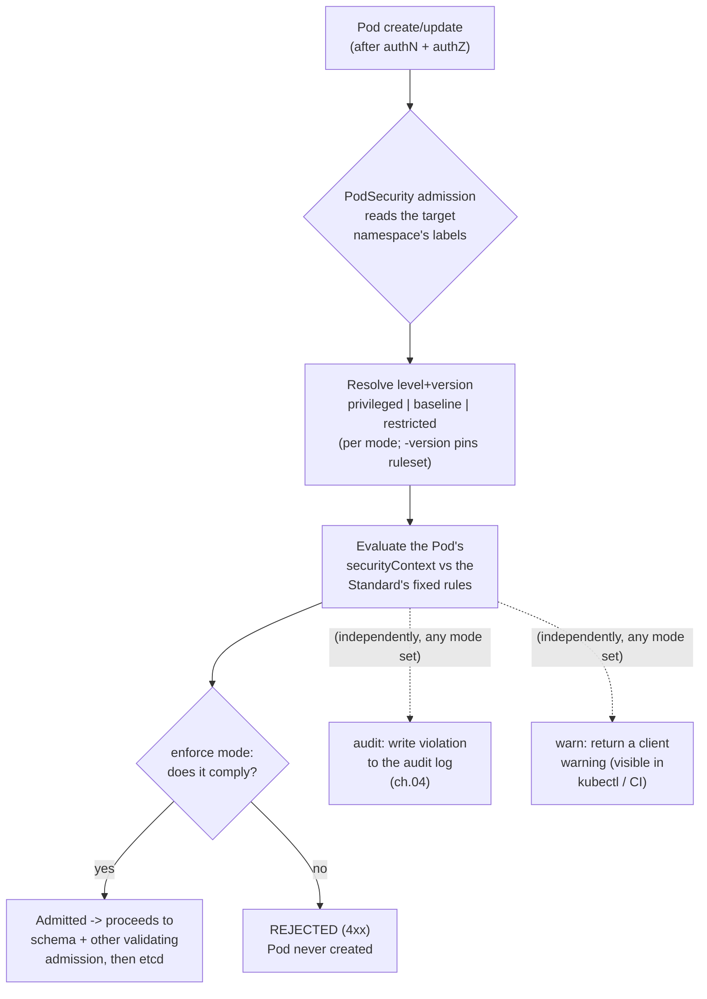

# 02 — Pod security

> `securityContext` (pod vs container), Linux capabilities, `privileged` /
> `allowPrivilegeEscalation` / `readOnlyRootFilesystem`, seccomp, AppArmor (the
> GA field) & SELinux, and **Pod Security Admission** with the three Pod
> Security Standards (why PodSecurityPolicy is gone) — applied by hardening
> every Bookstore workload to `restricted` and enforcing it on the namespace.

**Estimated time:** ~30 min read · ~60 min hands-on
**Prerequisites:** [Part 05 ch.01](01-authn-authz-rbac.md) — RBAC controls who can ask the API; PSA controls what runs · [Part 01 ch.01](../01-core-workloads/01-pods.md) — Pod spec and containers as namespaced processes · [Part 00 ch.02](../00-foundations/02-containers-and-images.md) — capabilities, namespaces, cgroups
**You'll know after this:** • configure pod and container `securityContext` for non-root, read-only rootfs and dropped capabilities · • choose between privileged, baseline and restricted Pod Security Standards · • enable PSA labels on a namespace at the enforce/audit/warn levels · • explain why PodSecurityPolicy was deprecated and what replaced it · • harden every Bookstore workload to `restricted` and verify with admission warnings

<!-- tags: security, psa-restricted, core-objects, day-2 -->

## Why this exists

[ch.01](01-authn-authz-rbac.md) controlled *who can ask the API server for
what*. But once a Pod is admitted and running, the next question is: **what can
the process inside the container do to the node and kernel?** A container is
just a process with namespaces and cgroups; by default it can run as **root
(UID 0)**, can gain new privileges, has a non-trivial set of Linux
**capabilities**, an unrestricted **syscall** surface, and a writable root
filesystem. A compromised catalog process with those defaults is a container
breakout waiting to happen — and nothing in RBAC stops it, because RBAC is
about the *API*, not the *kernel*.

`securityContext` is how a workload **drops** those privileges, and **Pod
Security Admission (PSA)** is the built-in admission controller that **refuses
to admit** Pods that don't. This is the [Process Containment](#further-reading)
pattern: assume the process will be compromised and make that as boring as
possible. (PodSecurityPolicy, the old mechanism, was **removed in v1.25** —
this chapter is the modern replacement, and being precise about it matters
because the internet is full of dead-PSP advice.)

## Mental model

Two complementary halves:

- **`securityContext` — the privileges a Pod voluntarily gives up.** Per-pod
  (`spec.securityContext`: `runAsNonRoot`, `runAsUser/Group`, `fsGroup`,
  `seccompProfile`, …) and per-container (`spec.containers[].securityContext`:
  `allowPrivilegeEscalation`, `capabilities`, `readOnlyRootFilesystem`,
  `privileged`, …). Container-level overrides pod-level for the same field. The
  hardened ideal: **run as non-root, drop ALL capabilities, forbid privilege
  escalation, apply the runtime's default seccomp filter, read-only root FS**.
- **Pod Security Admission — the floor the cluster enforces.** PSA is a
  built-in *validating admission* plugin (the stage from
  [ch.01](01-authn-authz-rbac.md)). You label a **namespace** with one of three
  **Pod Security Standards** — `privileged` (no restrictions), `baseline`
  (block known privilege escalations), `restricted` (the hardened best-practice
  set) — in up to three **modes**: `enforce` (reject violators), `audit`
  (allow + record), `warn` (allow + return a client warning). The standard is a
  *fixed, versioned policy*; you don't write rules, you pick a level.

The two must agree: if you label a namespace `enforce: restricted`, every Pod
in it **must** carry a `restricted`-satisfying `securityContext` or it is
rejected at admission. The whole point of this chapter's hands-on is making the
Bookstore satisfy the floor it sets for itself.

## Diagrams

### PSA admission decision: namespace labels → enforce/audit/warn (Mermaid)



### The `restricted` hardening checklist (ASCII)

```
 PSA `restricted` REQUIRES (pod or container securityContext) ──────────────
  [x] runAsNonRoot: true                  (pod or container)
  [x] allowPrivilegeEscalation: false     (container)
  [x] capabilities.drop: ["ALL"]          (container; may re-add only
                                            NET_BIND_SERVICE)
  [x] seccompProfile.type: RuntimeDefault (or Localhost; NOT Unconfined)
  [x] privileged: false / unset, no hostPID/hostIPC/hostNetwork,
      no hostPath volumes, no hostPorts, restricted /proc + sysctls,
      SELinux type unset/allowed
  [x] volumes only: configMap, csi, downwardAPI, emptyDir, ephemeral,
      persistentVolumeClaim, projected, secret
 NOT required by `restricted` (but best practice — add where the image allows):
  [ ] readOnlyRootFilesystem: true   + an emptyDir for any writable path
  [ ] runAsUser / runAsGroup pinned to a specific non-zero UID/GID
 `baseline` = the host*/privileged/hostPath/sysctl bans WITHOUT the
 non-root / drop-ALL / seccomp / no-priv-esc requirements.
```

## Hands-on with the Bookstore

**Assumed working directory: the guide repo root (`full-guide/`).** Builds on
[ch.01](01-authn-authz-rbac.md) (the SAs are already wired). This chapter makes
**additive `securityContext` edits** to every workload and adds the PSA labels
to [`00-namespace.yaml`](../examples/bookstore/raw-manifests/00-namespace.yaml).
Nothing prior (config, Secret-built `DB_DSN`, probes, `preStop` sleep, volumes,
labels, scheduling layer, the ch.01 ServiceAccount fields) is removed — only
security fields are **added**.

### 1. Harden the Go services (full `restricted` + read-only root FS)

catalog and orders are static Go binaries on
`gcr.io/distroless/static:nonroot` (UID **65532**, no shell, single binary —
verified in [`app/catalog/Dockerfile`](../examples/bookstore/app/catalog/Dockerfile)).
(`payments-worker` shares the same distroless base in
[`app/`](../examples/bookstore/app/README.md) but has **no manifest yet** — it
is introduced as a workload in a later chapter and will take the identical
hardening then; it is not one of the six manifested workloads here.)
They satisfy the **strictest** form, including a read-only root filesystem,
because the only path they write is scratch space we already provide as an
`emptyDir`. The block added to
[`10-catalog-deploy.yaml`](../examples/bookstore/raw-manifests/10-catalog-deploy.yaml)
(and equivalently `14-orders-deploy.yaml`):

```yaml
    spec:
      # ... ch.01 serviceAccountName/automount + the Part 04 scheduling layer ...
      securityContext:                    # pod-level (applies to all containers)
        runAsNonRoot: true
        runAsUser: 65532                  # the distroless "nonroot" UID/GID
        runAsGroup: 65532
        seccompProfile:
          type: RuntimeDefault
      containers:
        - name: catalog
          # ... image / probes / env / resources unchanged ...
          securityContext:                # container-level
            allowPrivilegeEscalation: false
            readOnlyRootFilesystem: true  # only `scratch` (emptyDir) is writable
            capabilities:
              drop: ["ALL"]
```

catalog already had a `scratch` `emptyDir` at `/tmp/cache`; orders gains an
equivalent `tmp` emptyDir so its read-only root FS still has a writable
`/tmp`. No capability is re-added — the binaries bind `:8080` (>1024), so they
don't even need `NET_BIND_SERVICE`.

### 2. Harden storefront (stock-looking nginx, but purpose-built unprivileged)

`bookstore/storefront:dev` is `nginx:1.27-alpine`, but the image was built to
run **unprivileged**: `USER 101` and every runtime path under `/tmp`
(`pid /tmp/nginx.pid`, all `*_temp_path /tmp/*` — see
[`app/storefront/nginx.conf`](../examples/bookstore/app/storefront/nginx.conf)),
listening on `8080`. *Stock* upstream nginx (listens `:80` as root, writes
`/var/cache/nginx`, `/var/run/nginx.pid`) would **fail** `restricted` — this
one passes only because it was designed to. The added blocks:

```yaml
    spec:
      securityContext: { runAsNonRoot: true, runAsUser: 101, runAsGroup: 101,
                         seccompProfile: { type: RuntimeDefault } }
      containers:
        - name: storefront
          securityContext:
            allowPrivilegeEscalation: false
            readOnlyRootFilesystem: true
            capabilities: { drop: ["ALL"] }
          volumeMounts: [ { name: tmp, mountPath: /tmp } ]
      volumes: [ { name: tmp, emptyDir: { sizeLimit: 64Mi } } ]
```

The `/tmp` emptyDir masks the Dockerfile-precreated temp dirs, but nginx's
master (running as 101) recreates each configured `*_temp_path` on startup
since `/tmp` itself is writable — the canonical unprivileged-nginx +
read-only-rootfs pattern. Listening on `8080` means **no `NET_BIND_SERVICE`**
is needed (ports <1024 would have required adding it back).

### 3. Harden the stock data images (the honest, accurate part)

postgres / redis / rabbitmq use **official upstream images** whose entrypoints
normally start as root and `gosu`/`setpriv` to UID 999. PSA `restricted` does
**not** require a read-only root FS or a specific UID — only `runAsNonRoot` +
`drop ALL` + `allowPrivilegeEscalation:false` + `seccompProfile:RuntimeDefault`
+ allowed volume types. So we make each **both** `restricted`-valid **and**
actually bootable by running directly as the non-root UID 999 and giving the
kubelet an `fsGroup` so the data volume is group-writable (skipping the
image's root-only chown step):

```yaml
# postgres (20-postgres-statefulset.yaml) — runs the DB process as 999;
# fsGroup chowns the PVC so initdb (now as 999) can create PGDATA. NO
# readOnlyRootFilesystem (postgres writes sockets/locks outside PGDATA —
# and `restricted` does not demand a read-only FS).
    spec:
      securityContext:
        runAsNonRoot: true
        runAsUser: 999
        runAsGroup: 999
        fsGroup: 999
        fsGroupChangePolicy: OnRootMismatch     # don't re-chown a big PGDATA
        seccompProfile: { type: RuntimeDefault }
      containers:
        - name: postgres
          securityContext:
            allowPrivilegeEscalation: false
            capabilities: { drop: ["ALL"] }     # postgres needs no caps
```

`redis` (12-) is in-memory only (`--save "" --appendonly no` → writes nothing),
so it additionally takes `readOnlyRootFilesystem: true` with a tiny `data`
emptyDir for its working dir. `rabbitmq` (13-) is the most demanding (Mnesia DB
+ Erlang cookie under `/var/lib/rabbitmq`, generated config under
`/etc/rabbitmq`): it gets the same `runAsNonRoot:999 + fsGroup:999` and a
`/var/lib/rabbitmq` emptyDir, but **no** read-only root FS (it writes outside
that volume). Each manifest's header documents exactly why.

> **The accurate verdict, per image.** `restricted` is a check on the
> *manifest's securityContext + volume types*, not on whether the app boots.
> **Every Pod that can land in the `bookstore` namespace** is made
> `restricted`-**valid** — the six long-running workloads (catalog,
> storefront, orders, postgres, redis, rabbitmq) **plus** the manual-canary
> catalog variant (`30-`, the mutually-exclusive teaching stack) **and** the
> two `postgres:16` DB batch jobs (the `db-migrate` Job `21-` and the
> `cleanup` CronJob `22-`). All of them, because PSA `enforce: restricted`
> gates *every* Pod in the namespace — leaving any one unhardened means its
> Pods are rejected, the exact anti-pattern this chapter warns against. The
> *runtime* nuance (which the headers state honestly): the **distroless Go
> services + the purpose-built unprivileged nginx** are cleanly hardened
> including a read-only root FS; the **stock postgres/redis/rabbitmq and the
> postgres:16 batch jobs** are `restricted`-valid **only because** we add
> `runAsNonRoot` + a non-root UID + `fsGroup` (+ an `emptyDir` for the stock
> server images) so they still start as non-root — without that, those stock
> images expect root and would either fail PSA (if you only set the labels) or
> fail to boot (if you set non-root without the fsGroup/volume). Never label a
> namespace `restricted` and then apply stock images unchanged.

### 4. Enforce `restricted` on the namespace — and prove self-consistency

[`00-namespace.yaml`](../examples/bookstore/raw-manifests/00-namespace.yaml)
gains the PSA labels (enforce + audit + warn at `restricted`, version `latest`):

```yaml
metadata:
  name: bookstore
  labels:
    app.kubernetes.io/part-of: bookstore
    pod-security.kubernetes.io/enforce: restricted
    pod-security.kubernetes.io/enforce-version: latest
    pod-security.kubernetes.io/audit: restricted
    pod-security.kubernetes.io/audit-version: latest
    pod-security.kubernetes.io/warn: restricted
    pod-security.kubernetes.io/warn-version: latest
```

Apply and **verify the floor matches the workloads** (this is the critical
check — a guide that labels the ns `restricted` then ships rejected Pods is
broken):

```sh
# from the repo root (full-guide/) — prereqs first (self-bootstrapping)
kubectl apply -f examples/bookstore/raw-manifests/00-namespace.yaml
kubectl apply -f examples/bookstore/raw-manifests/05-serviceaccounts-rbac.yaml
kubectl apply -f examples/bookstore/raw-manifests/15-catalog-config.yaml
kubectl apply -f examples/bookstore/raw-manifests/16-db-credentials.yaml
kubectl apply -f examples/bookstore/raw-manifests/35-priorityclasses.yaml

# Dry-run EVERY workload that can land in `bookstore` SERVER-side: PSA runs
# in admission, so a server dry-run reports any `restricted` violation
# WITHOUT creating anything. This list MUST be exhaustive — it includes the
# manual-canary variant (30-, a Service + 2 Deployments) and BOTH postgres:16
# DB batch jobs (21-, 22-), not just the six long-running workloads, because
# enforce:restricted gates every Pod in the namespace (see the verdict above).
for f in 10-catalog-deploy 11-storefront-deploy 14-orders-deploy \
         12-redis 13-rabbitmq 20-postgres-statefulset \
         21-db-migrate-job 22-cleanup-cronjob 30-catalog-canary; do
  echo "== $f =="
  kubectl apply --dry-run=server \
    -f examples/bookstore/raw-manifests/$f.yaml
done
#   Expect: each "<KIND>/<NAME> created (server dry run)" with NO
#   'would violate PodSecurity "restricted:latest"' warning (30- emits three
#   lines: one Service + catalog-stable + catalog-canary — all clean). That
#   is the proof the namespace label and every securityContext agree.

# Negative control — see PSA actually bite (privileged pod, public image):
kubectl run psa-bad -n bookstore --image=busybox:1.36 --restart=Never \
  --overrides='{"spec":{"containers":[{"name":"psa-bad","image":"busybox:1.36",
    "securityContext":{"privileged":true}}]}}'
#   expected: error; no cleanup needed — PSA rejects before the Pod is
#   persisted (it never exists). Output:
#   → Error ... violates PodSecurity "restricted:latest": privileged ...
#   (rejected at admission; nothing created — proof enforce is live.)
```

> **Dry-run with `--warn`.** Even before labelling `enforce`, you can preview
> impact: a namespace labelled only `warn: restricted` makes `kubectl apply`
> print the exact violations as warnings (great in CI). The Bookstore sets all
> three modes, so `warn` keeps surfacing regressions even though `enforce`
> already blocks them.

## How it works under the hood

- **`securityContext` becomes kernel/runtime settings.** `runAsUser/Group` set
  the process UID/GID; `runAsNonRoot:true` makes the **kubelet refuse to start
  the container if the image's effective user is UID 0** (defense even if the
  image lies). `fsGroup` makes the kubelet (or CSI driver) `chown`/setgid the
  volume's files to that GID and adds it as a supplemental group, so a non-root
  process can write a volume it doesn't own — `fsGroupChangePolicy:
  OnRootMismatch` skips the (potentially huge, slow) recursive chown when the
  top-level dir already has the right owner. `supplementalGroups` adds extra
  GIDs.
- **Capabilities.** The kernel splits root's power into ~40 **capabilities**
  (e.g. `NET_BIND_SERVICE`, `SYS_ADMIN`, `NET_RAW`, `CHOWN`). Containers start
  with a runtime-default subset; `capabilities.drop: ["ALL"]` removes them all,
  `add: [...]` re-grants specific ones. Most apps need **none** — the Bookstore
  drops ALL and adds back nothing (it would only need `NET_BIND_SERVICE` if
  binding a port <1024, which it avoids by using 8080).
- **`allowPrivilegeEscalation: false`** sets the process's `no_new_privs` bit,
  so a child can never gain more privilege than its parent (it neutralises
  setuid binaries and file capabilities). **`privileged: true`** is the
  opposite extreme — nearly all capabilities + device access ≈ root on the
  node; `restricted`/`baseline` forbid it.
- **`readOnlyRootFilesystem: true`** mounts the container's root FS read-only;
  the process can only write into explicitly mounted writable volumes (an
  `emptyDir` for `/tmp`/cache). It blocks a whole class of "drop a binary /
  modify the app" attacks. It is **not** a PSA `restricted` requirement (PSA
  doesn't check it), which is why the guide adds it where the image tolerates
  it and *correctly omits it* for postgres/rabbitmq, which write outside their
  data volume.
- **seccomp** filters the **syscalls** the process may make. **The default
  when `seccompProfile` is unset is `Unconfined`** (no syscall filtering at
  all) — so a Pod that says nothing gets *no* seccomp, which is exactly why
  the `restricted` standard **requires** `seccompProfile.type` to be set to
  **`RuntimeDefault`** (or `Localhost`) and rejects `Unconfined`.
  `RuntimeDefault` applies the container runtime's curated profile (blocks
  dangerous/obsolete syscalls like `ptrace`-abuse, `kexec`, raw `mount`) —
  broadly compatible and the `restricted` requirement. `Localhost` uses a
  custom profile file on the node (`localhostProfile`); `Unconfined` disables
  filtering (forbidden by `restricted`). It's enforced by the kernel via BPF,
  set by the kubelet on container start. (The kubelet's
  `--seccomp-default=RuntimeDefault` flag can flip the cluster-wide default to
  `RuntimeDefault`, but you must not *assume* it — set the field explicitly,
  which the Bookstore does at the pod level on every workload.)
- **AppArmor** confines a process to a Linux Security Module profile (file/
  capability/network rules). It is now a first-class field —
  `securityContext.appArmorProfile.type: RuntimeDefault|Localhost|Unconfined`
  (**GA in v1.30**) — preferred over the **legacy annotation**
  `container.apparmor.security.beta.kubernetes.io/<CONTAINER>: runtime/default`
  (still honoured for back-compat; the field wins where both are set). On a
  cluster/distro without AppArmor it's a no-op. **SELinux** is the analogous
  LSM on RHEL-family hosts: `securityContext.seLinuxOptions`
  (user/role/type/level) labels the process; `restricted` allows only the
  default/permitted types.
- **PSA is built-in validating admission with a *fixed* policy.** Unlike
  Kyverno/Gatekeeper ([ch.03](03-supply-chain.md)) you don't author rules — you
  select `privileged|baseline|restricted` via the **namespace labels**
  `pod-security.kubernetes.io/<enforce|audit|warn>[ -version]`. `enforce`
  blocks at admission (Pods only — not the controller; a Deployment with a bad
  template is *accepted*, but its Pods are *rejected*, so always test the
  Pod). `audit` annotates the audit log ([ch.04](04-secrets-and-cluster-hardening.md));
  `warn` returns a `Warning:` header (what you see in `kubectl`). The
  **`-version`** label pins the ruleset to a Kubernetes minor (`latest` =
  newest, the usual choice; pin to e.g. `v1.30` to freeze behaviour across
  upgrades). Cluster-wide **exemptions** (by username, RuntimeClass, or
  namespace) are configured in the API server's `AdmissionConfiguration`, not
  per-namespace — used sparingly for system namespaces.
- **Why PodSecurityPolicy is gone.** PSP (removed in **v1.25**) was a cluster
  object bound via RBAC whose *mutating* behaviour and ordering were confusing
  and error-prone (which PSP applied to a Pod depended on RBAC + alphabetical
  tie-breaks). PSA replaces it with a *non-mutating*, namespace-labelled, three
  fixed-levels model; for needs beyond the three levels you use a real policy
  engine (Kyverno/Gatekeeper/ValidatingAdmissionPolicy — [ch.03](03-supply-chain.md)).
  Any guide or tutorial still telling you to write a `PodSecurityPolicy` is
  describing a removed API.

## Production notes

> **In production:** label **every** application namespace
> `pod-security.kubernetes.io/enforce: restricted` (with `audit`+`warn` at the
> same level so regressions are visible), and make sure your workloads actually
> comply *before* flipping `enforce` — roll it out as `warn`→`audit`→`enforce`.
> A namespace at `privileged` is an unlocked door; `baseline` is a minimum, not
> a goal.

> **In production:** pin the **`-version`** label (e.g. `v1.30`) on regulated
> clusters so a Kubernetes upgrade can't silently change what `restricted`
> means under you; bump it deliberately. `latest` is fine for fast-moving
> environments that test upgrades.

> **In production:** prefer **purpose-built unprivileged/distroless images**
> (non-root by default, minimal, no shell) so `restricted` is free. For stock
> images that assume root (databases, brokers), do exactly what the Bookstore
> does — `runAsNonRoot` + a specific UID + `fsGroup` for the data volume + an
> `emptyDir` for scratch — and *test that they boot*; never just set the label
> and hope.

> **In production:** add `readOnlyRootFilesystem: true` wherever the app
> tolerates it (it's a big breakout-mitigation) with explicit writable
> `emptyDir`s — but don't pretend it's required for `restricted` or force it on
> apps that legitimately write outside a data volume; that yields crash loops
> blamed on "security".

> **In production (managed — EKS/GKE/AKS):** PSA is built in and on by default
> (the `PodSecurity` admission plugin), so the labels work the same everywhere.
> Providers also offer extra layers — GKE Autopilot *forces* a hardened
> baseline and rejects privileged Pods; EKS/AKS commonly pair PSA with a policy
> engine and a node-level runtime sensor. Know that PSA is the floor, not the
> whole story.

## Quick Reference

```sh
kubectl label ns <NS> \
  pod-security.kubernetes.io/enforce=restricted \
  pod-security.kubernetes.io/enforce-version=latest \
  pod-security.kubernetes.io/warn=restricted --overwrite     # apply PSA
kubectl apply --dry-run=server -f pod.yaml                    # PSA verdict (no create)
kubectl label ns <NS> pod-security.kubernetes.io/warn=restricted --overwrite
kubectl get ns <NS> --show-labels | tr ',' '\n' | grep pod-security
kubectl explain pod.spec.securityContext --recursive
kubectl explain pod.spec.containers.securityContext --recursive
```

Minimal `restricted`-compliant container skeleton:

```yaml
spec:
  securityContext:                       # pod-level
    runAsNonRoot: true
    runAsUser: 65532
    seccompProfile: { type: RuntimeDefault }
  containers:
    - name: app
      securityContext:                   # container-level
        allowPrivilegeEscalation: false
        readOnlyRootFilesystem: true     # + an emptyDir for any writable path
        capabilities: { drop: ["ALL"] }  # add back only NET_BIND_SERVICE if <1024
      volumeMounts: [ { name: tmp, mountPath: /tmp } ]
  volumes: [ { name: tmp, emptyDir: {} } ]
# namespace: pod-security.kubernetes.io/enforce: restricted (+ -version)
```

Checklist:

- [ ] `runAsNonRoot: true` (+ a non-zero `runAsUser`); image not built as root
- [ ] `capabilities.drop: ["ALL"]` (add back only what's proven necessary)
- [ ] `allowPrivilegeEscalation: false`; never `privileged: true`
- [ ] `seccompProfile.type: RuntimeDefault` (or a vetted `Localhost`)
- [ ] `readOnlyRootFilesystem: true` where feasible + `emptyDir` for writes
- [ ] Only `restricted`-allowed volume types; no hostPath/hostPort/host namespaces
- [ ] Namespace labelled `enforce: restricted` (+ `audit`/`warn` + `-version`)
- [ ] Server dry-run shows **no** PodSecurity violation for any workload

## Test your understanding

> Try each before opening the answer drawer. The act of trying is the exercise; the answer is the check.

1. **A teammate says: "We have RBAC; why do we also need Pod Security Admission?" Give the one-sentence answer that names the layer each one defends.**
   <details><summary>Show answer</summary>

   RBAC controls **what API calls a principal can make** (the API surface); PSA controls **what kernel-level privileges a running Pod gets** (capabilities, namespaces, syscalls) — a perfectly RBAC'd Pod running with `privileged: true` can still mount the host filesystem, so the two are orthogonal defences. See §Mental model.

   </details>

2. **You label `bookstore` with `enforce: restricted` and a previously-working Deployment is now `0/3` Ready with the events: `pods "catalog-..." is forbidden: violates PodSecurity "restricted:latest": runAsNonRoot != true`. The container image is the same one you ran yesterday. What changed, and what's the fix?**
   <details><summary>Show answer</summary>

   Nothing about the image changed — PSA evaluates the **Pod spec**, not the image, and `restricted` requires `runAsNonRoot: true` (or the image's USER to be non-zero and `runAsNonRoot` unset). The Pod template must set `securityContext.runAsNonRoot: true` (+ a non-zero `runAsUser` like 65532), `allowPrivilegeEscalation: false`, `capabilities.drop: [ALL]`, and `seccompProfile.type: RuntimeDefault`. Use `kubectl apply --dry-run=server` to see PSA's verdict before applying.

   </details>

3. **The team wants the new "node-exporter" DaemonSet on a `restricted`-labelled namespace. It needs `hostNetwork: true` and `hostPID: true`. What do you tell them — and what's the right architectural fix?**
   <details><summary>Show answer</summary>

   `restricted` forbids host namespaces; the DaemonSet will be rejected at admission. The fix is **not** to weaken PSA on `bookstore` — it is to deploy node-exporter into its own `monitoring`/`kube-system` namespace labelled `enforce: privileged` (or `baseline`), keeping the app namespace `restricted`. Trusted infrastructure (CNI, log agent, node-exporter) lives in trusted namespaces; apps live in restricted ones. Never mix.

   </details>

4. **Hands-on extension — flip on warn-mode safely. Run `kubectl label ns default pod-security.kubernetes.io/warn=restricted --overwrite`, then `kubectl apply -f` any Deployment without a hardened `securityContext`. What do you see in the output, and what would have happened with `enforce=restricted` instead?**
   <details><summary>What you should see</summary>

   `warn` returns a client-side `Warning: would violate PodSecurity "restricted:latest": ...` listing every field that fails — but the Pod **is admitted**. Same labels with `enforce` instead of `warn` would reject the apply with a `400` and no Pod is created. This is exactly the migration tool: `warn`/`audit` first to find every violation across the cluster, fix them, *then* flip `enforce` — never the other way round.

   </details>

5. **Why was PodSecurityPolicy removed, and what would you say to someone who shows up with a "PSP migration" runbook in 2026?**
   <details><summary>Show answer</summary>

   PSP was removed in v1.25 because it required RBAC `use` permissions to *bind* the policy to a SA — surprisingly hard to reason about, easy to misconfigure, and the policy/SA coupling made multi-tenancy painful. PSA is namespace-labelled and bound to the fixed Pod Security Standards (a versioned policy you don't author), which is far simpler and harder to misconfigure. A 2026 PSP runbook is dead advice — the modern path is PSA labels plus a policy engine (Kyverno/Gatekeeper) for any rule beyond the three Standards.

   </details>

## Further reading

- **Ibryam & Huß, _Kubernetes Patterns_ 2e, ch.23 — _Process Containment_** —
  dropping privileges, capabilities, and the threat model behind running
  containers unprivileged.
- **Rosso et al., _Production Kubernetes_, ch.8 — "Admission Control"** —
  enforcing Pod security at admission and the migration from PSP to
  policy/PSA.
- Official:
  <https://kubernetes.io/docs/concepts/security/pod-security-standards/>,
  <https://kubernetes.io/docs/concepts/security/pod-security-admission/>, and
  <https://kubernetes.io/docs/tasks/configure-pod-container/security-context/>.
