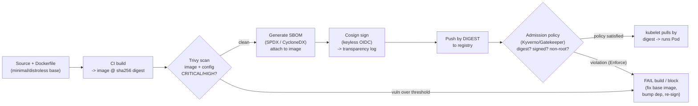

# 03 — Supply chain security

> Image provenance and the threat (typosquatting, base-image CVEs, build
> tampering); scanning (Trivy: image/fs/config/SBOM, severities, CI exit
> codes); SBOMs (SPDX/CycloneDX, syft); signing & verification (Cosign keyless,
> the transparency log — what a signature does and doesn't prove); admission
> enforcement (Kyverno vs Gatekeeper) and the Audit→Enforce lifecycle; minimal
> base images and digest pinning — applied by scanning the Bookstore image and
> adding a Kyverno policy in **Audit** mode (with the honest reason why).

**Estimated time:** ~30 min read · ~60 min hands-on
**Prerequisites:** [Part 05 ch.02](02-pod-security.md) — a hardened Pod can still run a malicious image · [Part 00 ch.02](../00-foundations/02-containers-and-images.md) — image tags, digests and registries · [Part 00 ch.04](../00-foundations/04-control-plane-deep-dive.md) — admission webhooks run before persistence
**You'll know after this:** • scan images and filesystems with Trivy and gate on CVE severity · • generate SBOMs (SPDX / CycloneDX) with syft and read their contents · • sign and verify images with Cosign keyless OIDC and the Rekor transparency log · • write a Kyverno policy that requires digest pins and run it Audit → Enforce · • choose minimal base images and pin by digest across the Bookstore

<!-- tags: security, supply-chain, ci-cd, day-2 -->

## Why this exists

[ch.01](01-authn-authz-rbac.md) secured *who calls the API*;
[ch.02](02-pod-security.md) secured *what a running container can do*. Both
assume the **image you ran is the image you meant to run**. That assumption is
exactly where most real-world cluster compromises enter: a mistyped public
image (`bookstore/catlog`), a base image with a critical CVE, a dependency
with a backdoor, or a compromised CI pipeline that pushed a tampered image to a
tag you trust. A perfectly RBAC'd, `restricted`-hardened Pod running a
malicious image is still a malicious Pod.

Supply-chain security is making the path *from source to a running container*
verifiable: know what's **in** the image (scan + SBOM), prove **who built it
and that it's unmodified** (sign + verify), and **refuse to run** anything that
fails those checks (admission policy). This is the [Image
Builder](#further-reading)/software-supply-chain concern, and it closes the
last gap before Part 06 turns to running the system in production.

## Mental model

A container image is **untrusted input until proven otherwise**, and trust is
built in four stages, each answering one question:

1. **What is in it?** — *Scan* the image and emit an **SBOM** (a bill of
   materials). Finds known-vulnerable packages and records exactly what
   shipped. (Trivy/Grype, syft.)
2. **Is it exactly what we built?** — *Pin by digest* (`name@sha256:…`) so the
   reference is immutable; a tag like `:dev`/`:latest` can be repointed at
   anything later.
3. **Who vouches for it?** — *Sign* it (Cosign) and record the signature in a
   public **transparency log**. A signature proves *this digest was signed by
   that identity* — it does **not** prove the image is bug-free or
   non-malicious; provenance ≠ safety.
4. **Will the cluster refuse the rest?** — *Admission policy* (Kyverno /
   Gatekeeper) at the validating-admission stage from
   [ch.01](01-authn-authz-rbac.md) rejects images that aren't digest-pinned /
   signed / non-root / from an allowed registry.

And the operational reality that governs all four: **roll policy out as
Audit → then Enforce.** Flip straight to Enforce and you block your own
deployments (often including the cluster's own components) — which is the
exact tension this chapter's hands-on confronts head-on.

## Diagrams

### Secure pipeline: build → scan → SBOM → sign → admit → run (Mermaid)



### The trust chain (ASCII)

```
 developer ─commit─▶ CI (trusted builder)
                         │  builds → IMAGE@sha256:DIGEST   (immutable ref)
                         │  Trivy scan  ── CVEs over threshold? ─▶ FAIL
                         │  syft        ── SBOM (what's inside)
                         │  cosign sign ── signature + cert ─▶ Rekor (public log)
                         ▼
                   registry: only DIGESTs (tags are mutable pointers)
                         ▼
   kube-apiserver  ── admission policy ──┐
                                         ├─ image is digest-pinned?      ┐
                                         ├─ signature verifies vs identity? ─ all ▶ ADMIT
                                         ├─ runAsNonRoot / not :latest ?  ┘  else ▶ DENY
                         ▼
                   kubelet pulls @DIGEST  (byte-identical to what was signed)

 A signature proves PROVENANCE (who built this digest), NOT that it is safe.
 Scanning proves KNOWN vulns absent at scan time, NOT that it is bug-free.
 Defense in depth: you need ALL of scan + SBOM + sign + admit, not one.
```

## Hands-on with the Bookstore

**Assumed working directory: the guide repo root (`full-guide/`).** Builds on
[ch.01](01-authn-authz-rbac.md)/[ch.02](02-pod-security.md). Uses **only public
images** for tooling (`aquasec/trivy`) and the **official Kyverno install
manifest**; the Bookstore images are the locally-built `bookstore/<SVC>:dev`.

### 1. Scan the Bookstore image with Trivy

Trivy needs the image present. Locally that's the host Docker daemon (where you
built it). To keep it in-cluster and distroless-safe, run Trivy as an
**ephemeral public-image Pod** scanning a public base first (always works),
then scan the built image on the host:

```sh
# A) In-cluster, against a PUBLIC image (always reproducible here). Run it in
#    the `default` namespace, NOT `bookstore`: `bookstore` enforces PSA
#    `restricted` (ch.02, 00-namespace.yaml), and the upstream aquasec/trivy
#    image is not restricted-shaped (runs as root, no securityContext) so PSA
#    would reject this ad-hoc Pod there. `default` has no such enforcement —
#    the right home for a throwaway scanner Pod. The image is PINNED (not
#    `:latest`): this very chapter bans mutable tags, so it must not use one.
kubectl run trivy -n default --image=aquasec/trivy:0.51.0 --restart=Never \
  -i --rm --command -- trivy image --quiet --severity HIGH,CRITICAL nginx:1.27-alpine
#   → table of HIGH/CRITICAL CVEs in that base (or "no vulnerabilities").

# B) On the host (where you built bookstore/catalog:dev), the real target:
trivy image --severity HIGH,CRITICAL bookstore/catalog:dev
trivy image --exit-code 1 --severity CRITICAL bookstore/catalog:dev   # CI gate
#   exit-code 1 = "fail the pipeline if any CRITICAL"; this is the CI contract.
trivy config examples/bookstore/raw-manifests/      # scan MANIFESTS for misconfig
trivy fs --scanners vuln examples/bookstore/app/catalog   # scan source/deps
```

`trivy image` finds vulnerable OS/language packages; `trivy config` lints the
Kubernetes/Dockerfile manifests themselves; `trivy fs` scans source
dependencies. `--severity` filters; `--exit-code 1` is what makes a finding
**fail a CI job** (the gate). The Go services are distroless/static, so the
attack surface is tiny by construction — that is itself a supply-chain control.

### 2. Generate an SBOM

```sh
# Trivy can emit an SBOM directly (CycloneDX or SPDX):
trivy image --format cyclonedx  --output catalog.cdx.json  bookstore/catalog:dev
trivy image --format spdx-json  --output catalog.spdx.json bookstore/catalog:dev
#   (syft is the other common generator: `syft bookstore/catalog:dev -o spdx-json`)
#   An SBOM is the audit/anchor for "which image had log4shell?" — store it as
#   a build artifact and ATTACH it to the image (cosign attach / attest).
```

### 3. A Kyverno policy — installed via the official Helm chart, in **Audit** mode

Install Kyverno from its **official Helm chart, pinned to a chart version** (a
CRD-bearing controller, like the snapshot/Gateway dependencies earlier in the
guide). Helm is the install path here for a concrete reason: the raw Kyverno
install bundle contains very large CRD schemas whose full body would exceed the
`kubectl.kubernetes.io/last-applied-configuration` annotation size limit that
`kubectl apply` writes; Helm (server-side, no client annotation) sidesteps that
— and never use a `releases/latest/download/<PINNED-FILE>.yaml` URL (it 404s
the moment a new release ships):

```sh
# Pin the chart version (look up the current one; pinning keeps installs
# reproducible — same convention the capstone uses for every operator).
KYVERNO_CHART_VERSION=3.2.6
helm repo add kyverno https://kyverno.github.io/kyverno
helm repo update
helm install kyverno kyverno/kyverno \
  --version "$KYVERNO_CHART_VERSION" \
  --namespace kyverno --create-namespace --wait
kubectl -n kyverno rollout status deploy/kyverno-admission-controller
```

New file
[`examples/bookstore/raw-manifests/70-kyverno-policy.yaml`](../examples/bookstore/raw-manifests/70-kyverno-policy.yaml)
— a `ClusterPolicy` that flags explicit `:latest` tags, non-digest images, and
non-root containers in the `bookstore` namespace:

```yaml
apiVersion: kyverno.io/v1
kind: ClusterPolicy
metadata: { name: bookstore-image-supply-chain }
spec:
  validationFailureAction: Audit          # <-- NOT Enforce. Deliberate.
  background: true
  rules:
    - name: disallow-latest-tag
      match: { any: [ { resources: { kinds: ["Pod"], namespaces: ["bookstore"] } } ] }
      validate:
        message: "Mutable image tag not allowed (pin a digest)."
        pattern: { spec: { containers: [ { image: "!*:latest" } ] } }
    - name: require-image-digest
      match: { any: [ { resources: { kinds: ["Pod"], namespaces: ["bookstore"] } } ] }
      validate:
        message: "Reference images by digest name@sha256:..."
        pattern: { spec: { containers: [ { image: "*@sha256:*" } ] } }
    - name: require-run-as-non-root
      match: { any: [ { resources: { kinds: ["Pod"], namespaces: ["bookstore"] } } ] }
      validate:
        message: "Containers must set runAsNonRoot: true (ch.02)."
        pattern: { spec: { =(securityContext): { =(runAsNonRoot): true } } }
```

Two correctness notes about these rules:

- **`!*:latest` only catches an *explicit* `:latest` tag.** It does **not**
  match a *bare/untagged* reference (`nginx`, which the runtime resolves to an
  implicit `:latest`) — that string has no `:latest` substring to negate. So
  `disallow-latest-tag` alone is not sufficient; the **`require-image-digest`**
  rule (`*@sha256:*`) is what actually covers bare/implicit-latest refs,
  because a digest is mandatory and unambiguous for *every* image. Pin by
  digest and the tag question disappears entirely.
- **`require-run-as-non-root` here checks the *pod-level* securityContext.**
  The Bookstore sets `runAsNonRoot` at the pod level on every workload (ch.02),
  so it passes. A production policy should also accept a **container-level**
  `runAsNonRoot` (a Pod can set it per-container instead) — e.g. an
  `any`/`anyPattern` that matches either location — otherwise it would
  false-flag a perfectly hardened Pod that sets it only on its containers.

```sh
# from the repo root (full-guide/) — Kyverno must be installed (above)
kubectl apply -f examples/bookstore/raw-manifests/70-kyverno-policy.yaml
kubectl get clusterpolicy bookstore-image-supply-chain
# See what Enforce WOULD have blocked, without blocking it:
kubectl get policyreport -n bookstore
#   → `require-image-digest` FAILs for every bookstore/<SVC>:dev Pod (no digest)
#     — this is also the rule that would catch a bare `nginx` (implicit :latest)
#   → `disallow-latest-tag` PASSes (we use :dev; note it only catches an
#     EXPLICIT :latest, not a bare/untagged ref — digest rule covers that)
#   → `require-run-as-non-root` PASSes (ch.02 set runAsNonRoot pod-level)
```

> **Why Audit, not Enforce — the central tension, stated plainly.** With
> `validationFailureAction: Enforce`, the `require-image-digest` rule (and a
> strict `disallow-latest`) would **reject the guide's own
> `bookstore/<SVC>:dev` Pods** — you'd hand the reader a policy that
> blackholes the very cluster they just built. So it ships as **Audit**: it
> *reports* (PolicyReport + logs) exactly what would be blocked, teaching the
> gap without breaking the lab. The **honest production path**: CI builds an
> immutable image, pushes it **by digest**, **signs** it with Cosign (recorded
> in the transparency log), and *then* you flip this policy to **Enforce** and
> add a real `verifyImages` rule (a commented placeholder is in the file). The
> Audit→Enforce lifecycle is not a shortcut — it's how you adopt any admission
> policy without an outage.

> **CRD dependency (documented, like `18-`/`51-`).** `ClusterPolicy` is a
> Kyverno CRD. Without Kyverno installed, a `kubectl apply`/dry-run of
> `70-kyverno-policy.yaml` fails with `no matches for kind "ClusterPolicy"` —
> **expected**; the file header and a whole-dir dry-run note say so. Every
> built-in Bookstore object still validates; only this file needs the CRD.

## How it works under the hood

- **Tags are mutable pointers; digests are content.** `bookstore/catalog:dev`
  is a *label* in the registry that can be moved to any image at any time
  (including by an attacker with push access). `…@sha256:<HASH>` **is** the
  content address — the registry/kubelet verifies the pulled bytes hash to
  exactly that. "Pin by digest" is the single highest-leverage supply-chain
  control because it makes "the image you ran" cryptographically defined.
  `imagePullPolicy: IfNotPresent` (used for the kind-loaded dev images) further
  means the node won't silently pull a different image for the same tag.
- **Scanners compare an inventory to a vuln database.** Trivy enumerates OS
  packages and language dependencies in the image layers, looks each up in
  vulnerability feeds (NVD, distro advisories, GitHub advisories), and reports
  matches by **severity**. It is a *point-in-time* statement ("no *known* CVEs
  *today*") — re-scan continuously, because new CVEs are disclosed against
  images that didn't change. `--exit-code` turns findings into a build gate.
- **SBOM = the durable inventory.** **SPDX** and **CycloneDX** are the two
  standard formats; **syft** (or Trivy) generates them. Stored/attached to the
  image, an SBOM answers "which of our running images contain package X at
  version Y?" *after* a new CVE drops — without re-deriving it. Signing/
  attesting the SBOM (`cosign attest`) ties it to the image identity.
- **Cosign signatures + the transparency log.** **Cosign** signs an image
  *digest*. **Keyless** signing uses short-lived certificates from Sigstore's
  **Fulcio** CA tied to an **OIDC identity** (e.g. the GitHub Actions workflow
  that built it), and records the signature in **Rekor**, an append-only public
  **transparency log**. Verification checks: signature valid, certificate
  identity == the expected builder (workflow/issuer), and the entry is in
  Rekor. What this **proves**: *this exact digest was signed by that identity*.
  What it **does not** prove: that the image is free of vulnerabilities or
  malicious code — provenance is necessary, not sufficient (hence you *also*
  scan).
- **Admission enforcement: Kyverno vs Gatekeeper/OPA.** Both are
  *validating-admission* policy engines at the [ch.01](01-authn-authz-rbac.md)
  stage. **Kyverno** is Kubernetes-native: policies are YAML CRDs
  (`ClusterPolicy`/`Policy`), with first-class `verifyImages`, `validate`
  (`pattern`/`deny`/CEL), `mutate`, and `generate`. **Gatekeeper** is OPA with
  constraints written in **Rego** (more general, steeper). The built-in
  **ValidatingAdmissionPolicy** (CEL, in-tree) covers many checks with no
  add-on. All can require digests, signatures, non-root, allowed registries —
  the choice is ergonomics, not capability. The Bookstore uses Kyverno for
  readable YAML and native image verification.
- **The Audit→Enforce lifecycle is structural.** Kyverno's
  `validationFailureAction` (and Gatekeeper's `enforcementAction`,
  ValidatingAdmissionPolicy's `validationActions`) has an **Audit**/`Warn`
  mode that *records/warns* and an **Enforce**/`Deny` mode that *blocks*. You
  always land a new policy in Audit, watch `PolicyReport`s for what it would
  break (especially platform components and your own pipeline output), fix
  those, and only then promote to Enforce — scoped exclusions
  (`exclude`/namespace selectors) for the unavoidable exceptions. A policy that
  rejects the cluster's own images on day one is the canonical anti-pattern
  this guide refuses to ship.
- **Registry & pull-secret hygiene.** Private registries are accessed via an
  `imagePullSecrets` `dockerconfigjson` Secret — itself credentials subject to
  the same RBAC/encryption discipline as any Secret
  ([Part 03 ch.02](../03-config-and-storage/02-secrets.md)). Prefer
  short-lived registry tokens / cloud IAM (IRSA/Workload Identity from
  [ch.01](01-authn-authz-rbac.md)) over a long-lived pull secret, and restrict
  which registries are allowed (an admission rule).

## Production notes

> **In production:** **pin every image by digest** (not a tag) in your
> deployed manifests, and have CI produce that digest. Enforce it with
> admission policy — but only **after** an Audit period and only once your
> pipeline emits digests, exactly as this chapter sequences it. Digest pinning
> is the highest-ROI control here.

> **In production:** **scan in CI and continuously.** Gate the build on
> `--exit-code 1 --severity CRITICAL` (tune the threshold to your risk
> appetite), and re-scan running images on a schedule — a clean image today is
> not clean when tomorrow's CVE drops. Track exposure via stored SBOMs.

> **In production:** **sign with Cosign keyless** in CI and **verify at
> admission** against the *specific* builder identity (workflow + issuer), not
> "any signature". Remember the limits: a signature proves provenance, so keep
> scanning and minimal base images — defense in depth, not a single gate.

> **In production:** minimal base images (**distroless/static**, scratch,
> Chainguard-style) shrink the CVE surface and the attack surface (no shell,
> no package manager) — the Bookstore Go services already do this; it makes
> `restricted` ([ch.02](02-pod-security.md)) and a clean scan almost free.

> **In production (managed — EKS/GKE/AKS):** use the provider's registry +
> scanning (ECR enhanced/Inspector, Artifact Registry / GCR vuln scanning, ACR
> + Defender) and bridge pull auth to cloud IAM (IRSA/Workload Identity) rather
> than static pull secrets. The admission policy and signing model are the same
> across clouds — the registry and identity plumbing differ.

## Quick Reference

```sh
trivy image --severity HIGH,CRITICAL <IMAGE>                 # vuln scan
trivy image --exit-code 1 --severity CRITICAL <IMAGE>        # CI gate
trivy config <MANIFEST-DIR>                                  # manifest misconfig
trivy fs --scanners vuln <SOURCE-DIR>                        # dependency scan
trivy image --format cyclonedx -o sbom.json <IMAGE>          # SBOM (or: syft <IMAGE>)
cosign sign --yes <IMAGE>@sha256:<DIGEST>                    # keyless sign
cosign verify --certificate-identity=<ID> \
  --certificate-oidc-issuer=<ISSUER> <IMAGE>@sha256:<DIGEST> # verify provenance
kubectl get clusterpolicy ; kubectl get policyreport -n <NS> # Kyverno: what fails
```

Minimal Kyverno image policy skeleton (start in Audit):

```yaml
apiVersion: kyverno.io/v1
kind: ClusterPolicy
metadata: { name: image-supply-chain }
spec:
  validationFailureAction: Audit            # Audit first; Enforce only after CI
  background: true
  rules:
    - name: require-digest
      match: { any: [ { resources: { kinds: ["Pod"], namespaces: ["<NS>"] } } ] }
      validate:
        message: "Use an image digest, not a tag."
        pattern: { spec: { containers: [ { image: "*@sha256:*" } ] } }
    # add verifyImages (Cosign keyless) once images are signed, then -> Enforce
```

Checklist:

- [ ] Images **pinned by digest** in deployed manifests (CI produces the digest)
- [ ] Trivy scan in CI with an `--exit-code` severity gate; re-scan continuously
- [ ] **SBOM** generated, stored as an artifact, attached/attested to the image
- [ ] Images **signed** (Cosign keyless); verified at admission vs builder identity
- [ ] Admission policy lands in **Audit**, promoted to **Enforce** post-validation
- [ ] Minimal/distroless base image; no shell/package manager in runtime image
- [ ] Private-registry pull auth via short-lived/cloud IAM, registries allow-listed

## Test your understanding

> Try each before opening the answer drawer. The act of trying is the exercise; the answer is the check.

1. **A Cosign-verified signature proves an image was signed by `ci@your-org`. Does that mean the image is safe to run? Explain in one or two sentences.**
   <details><summary>Show answer</summary>

   No — a signature proves **provenance** (this exact digest was signed by that identity), it does **not** prove the image is bug-free, vulnerability-free, or non-malicious. A compromised CI pipeline can legitimately sign a malicious image; **provenance ≠ safety**. You still need scanning (Trivy), SBOMs (syft), and the *combination* of signature-verification *plus* a scan gate is what builds trust. See §Mental model step 3.

   </details>

2. **You deploy a Kyverno `require-digest` ClusterPolicy in `Enforce` mode and the cluster's own kube-system add-ons (CNI, CoreDNS) start failing to schedule with admission errors. What did you do wrong, and what's the recovery?**
   <details><summary>Show answer</summary>

   You shipped policy straight to Enforce instead of running it in **Audit** first. Audit mode populates `PolicyReport` objects with every violation across the cluster without blocking — that's how you discover that kube-system, the CNI DaemonSet, and probably your monitoring stack still use tag-based images. Either exclude `kube-system` / trusted namespaces from the policy (`match.any.resources.namespaces.notIn`), or fix the violators first, *then* flip to Enforce. The Audit → Enforce lifecycle exists for exactly this reason.

   </details>

3. **Your CI pipeline pushes `bookstore/catalog:dev` after every commit. A new engineer asks: "Why are we replacing this with `bookstore/catalog@sha256:abc...` in manifests when the tag works fine?" Give the two-sentence answer.**
   <details><summary>Show answer</summary>

   `:dev` is a mutable pointer — anyone with push access can repoint it, the next `kubectl rollout restart` will pull whatever it now references, and you have no audit trail of *which* image actually ran. A digest is the content-addressable hash of the image bytes; the registry refuses to serve different bytes for the same digest, so deployments become reproducible and admission policy (require-digest) becomes meaningful.

   </details>

4. **Hands-on extension — break a scan gate honestly. Build a deliberately vulnerable image (`FROM debian:11-slim` with no updates), then run `trivy image --exit-code 1 --severity CRITICAL`. Now build the same app `FROM gcr.io/distroless/static-debian12:nonroot`. Re-run Trivy. Compare exit codes and CVE counts.**
   <details><summary>What you should see</summary>

   The Debian image will likely have dozens of CRITICAL/HIGH CVEs (mostly libc/openssl) and Trivy will exit 1, failing your hypothetical CI gate. The distroless image has near-zero CVEs (no shell, no package manager, no OS userland — there's almost nothing for Trivy to flag) and Trivy exits 0. This is why "minimal base image" is in the checklist: the smaller the surface, the fewer CVEs you carry, the more often your CI gate passes for the right reasons.

   </details>

## Further reading

- **Rosso et al., _Production Kubernetes_, ch.15 — "Software Supply Chain"** —
  building, scanning, signing, and admitting images as a production pipeline.
- **Ibryam & Huß, _Kubernetes Patterns_ 2e, ch.30 — _Image Builder_** — image
  construction and provenance as a pattern; minimal-base rationale.
- Official / project docs:
  <https://kubernetes.io/docs/concepts/containers/images/#image-pull-policy>,
  Kyverno <https://kyverno.io/policies/> and verify-images
  <https://kyverno.io/docs/writing-policies/verify-images/>, and Sigstore
  Cosign <https://docs.sigstore.dev/cosign/overview/>.
