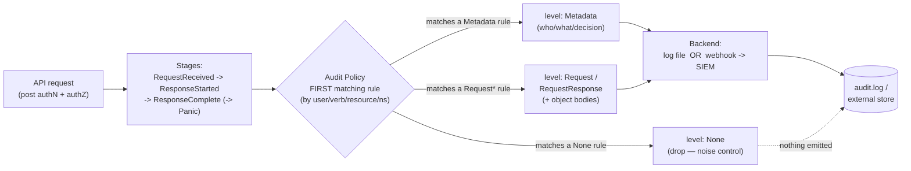

# 04 — Secrets and cluster hardening

> Encryption-at-rest in depth (`EncryptionConfiguration`: identity / aescbc /
> aesgcm / secretbox / KMS v2 envelope, key rotation & re-encrypt, where it's
> wired); **audit logging** (stages, levels, first-match rule ordering,
> backends, noise control); **CIS Benchmark / kube-bench**; apiserver/kubelet/
> etcd hardening flags — and a Bookstore **STRIDE-lite threat model** mapping
> every mitigation back to the chapter that delivered it.

**Estimated time:** ~30 min read · ~60 min hands-on
**Prerequisites:** [Part 03 ch.02](../03-config-and-storage/02-secrets.md) — Secret is base64, not encrypted · [Part 05 ch.01](01-authn-authz-rbac.md) — RBAC is what audit logs replay · [Part 00 ch.04](../00-foundations/04-control-plane-deep-dive.md) — etcd, the apiserver and the request pipeline
**You'll know after this:** • configure `EncryptionConfiguration` with KMS v2 envelope encryption and rotate keys · • turn on audit logging with the right stage, level and policy ordering · • run kube-bench against a cluster and read the CIS Benchmark findings · • harden apiserver, kubelet and etcd with the standard flag set · • map every Bookstore threat (STRIDE-lite) back to the control that mitigates it

<!-- tags: security, secrets, secrets-rotation, day-2 -->

## Why this exists

[Part 03 ch.02](../03-config-and-storage/02-secrets.md) established the Secret
object and proved the core danger: a Secret is **base64, not encrypted** —
anyone with etcd access or an etcd backup reads every credential. It explicitly
deferred *operationalizing* the protection to here. This chapter does that, and
widens the lens from "the Secret object" to **the cluster the Secret lives
in**: the API server, etcd, the kubelet, the audit trail, and benchmark-driven
hardening.

This is also the chapter that **ties Part 05 together**. Security is not one
control; it is layers, and a layer you can't *see being bypassed* is only half
a control. Encryption-at-rest protects the data; **audit logging** is the
flight recorder that tells you when RBAC ([ch.01](01-authn-authz-rbac.md)),
PSA ([ch.02](02-pod-security.md)), or image policy
([ch.03](03-supply-chain.md)) was exercised or attacked. The closing threat
model makes the defense-in-depth explicit. This deepens the [Secure
Configuration](#further-reading)/Admission concerns into cluster hardening.

## Mental model

Think in **layers around the data, plus a recorder watching all of them**:

- **Encryption at rest** — the API server encrypts Secrets *before* they hit
  etcd, so a stolen etcd file (or backup) is ciphertext. It is an
  **apiserver-level config** (`EncryptionConfiguration` + a flag), *not* a
  `kubectl apply` object, and it does **nothing** about an attacker with `get
  secrets` RBAC or `pods/exec` — those are [ch.01](01-authn-authz-rbac.md)
  controls. It specifically defeats the **etcd-at-rest / etcd-backup** threat.
- **Audit logging** — every request the API server processes can produce a
  structured record (who, verb, resource, decision, when). It is the only way
  to answer "*who* deleted prod / read that Secret / changed RBAC". Also
  apiserver-level config (a `Policy` file + a backend), tuned by **stage**,
  **level**, and **first-match rule order** to capture signal without drowning
  in noise.
- **Hardening the surfaces** — the API server, kubelet, and etcd each have
  flags that, set wrong, hand over the cluster (anonymous auth, read-only
  kubelet port, no etcd TLS). **CIS Benchmark / kube-bench** is the checklist
  that finds these.
- **Threat model** — enumerate how the Bookstore could be attacked and confirm
  each path has an owning mitigation in a specific chapter. No orphan threats.

## Diagrams

### Audit event flow: request → stages → policy → backend (Mermaid)



### Defense-in-depth layers (ASCII)

```
                Bookstore — concentric controls (outer = first to cross)
 ┌──────────────────────────────────────────────────────────────────────────┐
 │ Supply chain   scan + SBOM + sign + admission (Kyverno)        → ch.03   │
 │ ┌──────────────────────────────────────────────────────────────────────┐ │
 │ │ Identity/AuthZ  TLS + authN + RBAC least-priv + per-svc SA  → ch.01  │ │
 │ │ ┌──────────────────────────────────────────────────────────────────┐ │ │
 │ │ │ Network    default-deny NetworkPolicy, both-ends allow → Part 02 │ │ │
 │ │ │ ┌──────────────────────────────────────────────────────────────┐ │ │ │
 │ │ │ │ Pod      restricted PSA: non-root, drop ALL, seccomp → ch.02 │ │ │ │
 │ │ │ │ ┌──────────────────────────────────────────────────────────┐ │ │ │ │
 │ │ │ │ │ Data     Secret + ENCRYPTION AT REST (KMS) → Part03+here │ │ │ │ │
 │ │ │ │ │          etcd TLS + isolated; backups encrypted          │ │ │ │ │
 │ │ │ │ └──────────────────────────────────────────────────────────┘ │ │ │ │
 │ │ │ └──────────────────────────────────────────────────────────────┘ │ │ │
 │ │ └──────────────────────────────────────────────────────────────────┘ │ │
 │ └──────────────────────────────────────────────────────────────────────┘ │
 │  AUDIT LOG records every layer being exercised/attacked   → here         │
 └──────────────────────────────────────────────────────────────────────────┘
```

## Hands-on with the Bookstore

**Assumed working directory: the guide repo root (`full-guide/`).** Two of the
three artifacts here are **apiserver-level files**, *not* `kubectl apply`
objects — they are shown as concrete files under
[`examples/bookstore/cluster/`](../examples/bookstore/cluster/) with how they'd
be wired at cluster creation. The threat-model step is analysis over the
cumulative manifests.

### 1. `EncryptionConfiguration` — make etcd ciphertext (apiserver-level)

New file
[`examples/bookstore/cluster/encryption-config.yaml`](../examples/bookstore/cluster/encryption-config.yaml).
**This never goes through the API.** kube-apiserver consumes it via
`--encryption-provider-config=<FILE>`. Core shape:

```yaml
apiVersion: apiserver.config.k8s.io/v1
kind: EncryptionConfiguration
resources:
  - resources: ["secrets"]                 # encrypt Secret objects
    providers:
      - kms:                                # PREFERRED: envelope encryption
          apiVersion: v2
          name: bookstore-kms
          endpoint: unix:///var/run/kmsplugin/socket.sock
          timeout: 3s
      - aesgcm:                             # fallback: local AES-GCM key
          keys: [ { name: key1, secret: <BASE64-32-BYTE-KEY> } ]
      - identity: {}                        # MUST be last (reads legacy plaintext)
```

It is **not dry-run as a Kubernetes object** (it has no API kind); validate it
as YAML only:

```sh
# from the repo root (full-guide/)
ruby -ryaml -e 'YAML.load_file(ARGV[0]); puts "valid YAML"' \
  examples/bookstore/cluster/encryption-config.yaml
```

How it's wired (conceptual — you don't run this on the local lab): place the
file on every control-plane node (root-only, `0600`), add
`--encryption-provider-config=…` (+ `--encryption-provider-config-automatic-reload=true`)
to the kube-apiserver static Pod (kubeadm: edit
`/etc/kubernetes/manifests/kube-apiserver.yaml`; **kind**:
`kubeadmConfigPatches` + `extraMounts` in the cluster config). **Provider
order:** the *first* provider encrypts on write; *all* are tried on read;
`identity` is no-encryption and must stay **last** until every existing Secret
is re-encrypted. **Key rotation / first-time adoption** requires rewriting
existing Secrets so they pick up the new key/provider:

```sh
# After enabling encryption (or rotating the key): re-encrypt every Secret by
# reading and replacing it (the apiserver re-writes it through the new provider).
kubectl get secrets -A -o json | kubectl replace -f -
#   Until you do this, OLD Secrets remain in their old (or plaintext) form in
#   etcd — enabling encryption does NOT retroactively encrypt existing data.
```

**Threat model:** this protects **etcd at rest and etcd backups** only. KMS v2
**envelope** encryption is preferred (the data key is wrapped by a key in an
external KMS the apiserver never holds in clear); a local `aesgcm`/`secretbox`
key is better than nothing but sits on the control plane (useless if that node
is compromised). `aescbc` is legacy/weaker — prefer `aesgcm` or KMS.

### 2. `audit-policy.yaml` — the flight recorder (apiserver-level)

New file
[`examples/bookstore/cluster/audit-policy.yaml`](../examples/bookstore/cluster/audit-policy.yaml),
consumed via `--audit-policy-file=<FILE>` (+ a backend). Also **not** a
`kubectl` object. It is **first-match** — specific high-value/low-noise rules
first, a cheap catch-all last:

```yaml
apiVersion: audit.k8s.io/v1
kind: Policy
omitStages: ["RequestReceived"]            # halve volume; outcome is at Complete
rules:
  - level: Metadata                        # WHO touched Secrets — never the body
    resources: [ { group: "", resources: ["secrets","configmaps"] } ]
    namespaces: ["bookstore","kube-system"]
  - level: RequestResponse                 # full detail on RBAC changes
    resources: [ { group: "rbac.authorization.k8s.io",
                   resources: ["roles","clusterroles","rolebindings","clusterrolebindings"] } ]
  - level: Request                         # exec/attach/portforward = exfil path
    resources: [ { group: "", resources: ["pods/exec","pods/attach","pods/portforward"] } ]
  - level: None                            # noise control: drop chatter
    verbs: ["get","list","watch"]
    resources: [ { group: "", resources: ["events","endpoints"] } ]
  - level: Metadata                        # catch-all LAST (cheap, nothing invisible)
```

```sh
ruby -ryaml -e 'YAML.load_file(ARGV[0]); puts "valid YAML"' \
  examples/bookstore/cluster/audit-policy.yaml
```

**Stages**: `RequestReceived` (arrival) → `ResponseStarted` (long-running, e.g.
watch) → `ResponseComplete` (the one to keep) → `Panic`; drop noisy stages with
`omitStages`. **Levels**: `None` (skip) < `Metadata` (who/what/decision, no
bodies — the safe default; **never** higher for Secrets, or you'd log the
secret) < `Request` (+ request body) < `RequestResponse` (+ both bodies —
heaviest; reserve for RBAC-like high-value, low-volume events). **Backends**: a
**log** file (`--audit-log-path`, with `--audit-log-max{age,backup,size}`
rotation) or a **webhook** (`--audit-webhook-config-file`) shipping to a SIEM.
Wired the same way as the encryption config (kubeadm static-Pod flags +
hostPath; managed clusters expose it as EKS control-plane logs / GKE Cloud
Audit Logs / AKS diagnostic settings — see production notes).

### 3. CIS Benchmark with kube-bench

The **CIS Kubernetes Benchmark** is the community hardening standard;
**kube-bench** checks a cluster against it (apiserver/kubelet/etcd flags, file
perms, RBAC defaults). Run it as a Job from the official public image:

```sh
# Public image; runs the checks against THIS node's control-plane config.
kubectl apply -f https://raw.githubusercontent.com/aquasecurity/kube-bench/main/job.yaml
kubectl wait --for=condition=complete job/kube-bench --timeout=120s
kubectl logs job/kube-bench | sed -n '1,40p'
#   → [PASS]/[FAIL]/[WARN] per CIS control with remediation text. On kind many
#   controls are N/A or differ (it is not a hardened distro) — the VALUE is the
#   remediation guidance you apply on a real control plane, not the kind score.
kubectl delete job kube-bench
```

### 4. The Bookstore threat model (STRIDE-lite) — every mitigation has a home

Walk the **STRIDE** categories over the Bookstore and map each to the chapter
that delivered the control (no orphan threats):

```
 THREAT (STRIDE)                         MITIGATION                       WHERE
 ─────────────────────────────────────── ──────────────────────────────── ─────
 Spoofing — fake client / pod identity   TLS + authN; per-service SA;     ch.01
                                          bound/projected SA tokens
 Tampering — run a modified image         scan + SBOM + Cosign verify +   ch.03
                                          digest pin + Kyverno admission
 Tampering — modify a running container   readOnlyRootFS; drop ALL caps;  ch.02
                                          no-priv-escalation (restricted)
 Repudiation — "who did this?"            audit logging (RBAC=full body;  here
                                          exec/secrets recorded)
 Info disclosure — read DB creds          Secret (not CM) + ENCRYPTION-   Part03
   from etcd / a backup                    AT-REST (KMS); etcd TLS         + here
 Info disclosure — over-broad reader      least-priv RBAC; no get secrets; ch.01
                                          exec/attach locked with secrets
 Info disclosure — sniff pod traffic      default-deny NetworkPolicy;     Part02
                                          both-ends allow only            (+TLS)
 DoS — noisy neighbour exhausts node      requests/limits, QoS;           Part01
                                          ResourceQuota/LimitRange         ch.03
 DoS — workload starves critical tier     PriorityClass ladder;           Part04
                                          preemption order
 Elevation — container -> node/root       PSA restricted; seccomp         ch.02
                                          RuntimeDefault; no privileged
 Elevation — escalate via RBAC            no escalate/bind/impersonate;   ch.01
                                          RBAC-change auditing             + here
 Elevation — bypass it all via etcd       etcd peer/client TLS, isolated  here
                                          network, encryption at rest
```

Every row terminates in a chapter — that *is* defense in depth: no single
control is trusted, and there is no threat without an owner.

> **Lineage.** This closes Part 05. Encryption-at-rest finishes what
> [Part 03 ch.02](../03-config-and-storage/02-secrets.md) deliberately
> deferred; audit logging records the [ch.01](01-authn-authz-rbac.md) authZ
> decisions and [ch.02](02-pod-security.md) PSA outcomes; the threat model
> references [Part 02 ch.06](../02-networking/06-network-policies.md) and
> [Part 04 ch.03](../04-scheduling/03-priority-and-preemption.md). Backup/DR
> for etcd itself is [Part 08 ch.02](../08-day-2-operations/02-backup-and-dr.md).

## How it works under the hood

- **Where encryption sits in the write path.** A Secret write traverses authN
  → authZ → admission → *then*, just before the etcd `Put`, the API server runs
  the configured encryption provider over the serialized object. Reads run it
  in reverse. So it's transparent to clients (kubelet still gets plaintext,
  subject to RBAC) and **only** changes the bytes on disk in etcd. This is why
  it does nothing against `get secrets` or `pods/exec` — those go through the
  decrypting API server legitimately.
- **Provider semantics.** `identity` = passthrough (no crypto). `secretbox`
  (NaCl) and `aesgcm` are AEAD with a **local** key embedded in the config
  (32-byte, base64) — fast, but the key lives on the control plane.
  `aescbc` is **weaker (no AEAD/integrity protection); not recommended —
  prefer `aesgcm` or `secretbox`** (it is not formally deprecated, but there
  is no reason to choose it for new config). **`kms` v2** is **envelope
  encryption**: the API server encrypts
  with a per-write data-encryption key (DEK), the DEK is wrapped by a
  key-encryption key (KEK) held in an external KMS/HSM the API server never
  sees in clear; KEK rotation doesn't require rewriting data, and a compromised
  control-plane disk yields only wrapped DEKs. v2 also caches DEKs for
  performance and supports health/status checks. **Adoption is not
  retroactive** — existing Secrets stay in their old form until rewritten
  (`kubectl get secrets -A -o json | kubectl replace -f -`), which is the
  single most-missed step.
- **Audit pipeline internals.** The API server evaluates the **Policy** against
  each request and emits events at the configured **stages**; matching is
  **first rule wins**, so ordering *is* the policy. Events go to the backend
  **asynchronously** (a buffered, batched writer for the log/webhook) so
  auditing doesn't block request latency — but the buffer can drop under
  extreme load, which is itself why aggressive `level: None` noise rules
  matter (less volume = fewer drops + lower cost). Secrets/ConfigMaps must be
  `Metadata` (logging the body would write the cleartext into the audit log —
  a classic self-inflicted leak).
- **API server hardening flags (what to verify).**
  `--anonymous-auth=false` (no unauthenticated requests),
  `--authorization-mode=Node,RBAC` (never `AlwaysAllow`),
  `--profiling=false` (no pprof surface),
  `--audit-policy-file` + `--audit-log-*` (auditing on),
  `--encryption-provider-config` (Secrets encrypted),
  `--service-account-key-file`/`--service-account-signing-key-file` (proper SA
  token signing), strong TLS (`--tls-cipher-suites`, modern min version),
  `--request-timeout` and `--max-requests-inflight` (DoS resilience). kube-bench
  checks these against CIS.
- **kubelet hardening.** `--anonymous-auth=false` and
  `--authorization-mode=Webhook` (the kubelet API itself needs authN/authZ —
  an open kubelet is full node compromise), **`--read-only-port=0`** (the
  legacy unauthenticated read-only port leaks pod/node data — disable it),
  `--protect-kernel-defaults=true`, `--tls-cert-file`/rotation
  (`--rotate-certificates`, `--rotate-server-certificates`),
  `--make-iptables-util-chains=true`. The kubelet runs as root on the node, so
  its API is a prime target.
- **etcd security.** etcd **bypasses RBAC entirely** — raw etcd access is raw
  access to every object incl. Secrets ([Part 00 ch.04](../00-foundations/04-control-plane-deep-dive.md)).
  So: mutual **TLS** for client→etcd *and* peer→peer
  (`--cert-file`/`--key-file`/`--peer-*`/`--trusted-ca-file`), etcd reachable
  **only** from the API server on an isolated network/firewall, data dir
  perms locked, **encryption at rest** so even an etcd snapshot file is
  ciphertext, and snapshots stored encrypted off-cluster (restore-tested —
  [Part 08 ch.02](../08-day-2-operations/02-backup-and-dr.md)). External-etcd
  topology isolates this surface further
  ([Part 00 ch.04](../00-foundations/04-control-plane-deep-dive.md)).
- **CIS Benchmark / kube-bench.** The CIS benchmark codifies the above into
  numbered, remediable controls (control-plane configs, etcd, kubelet, policies
  like "minimize the admission of privileged containers" — which PSA ch.02
  satisfies). kube-bench runs the checks; the output's *remediation text* is
  the value (it tells you the exact flag/file to change). Treat a passing
  kube-bench as a baseline, not a finish line.

## Production notes

> **In production:** **enable Secret encryption at rest with KMS v2** and
> rotate the KEK on a schedule; remember to **re-encrypt existing Secrets**
> after enabling/rotating (`kubectl get secrets -A -o json | kubectl replace -f -`) or old data stays unprotected. Without this, etcd and *every etcd
> backup* hold credentials in reversible base64.

> **In production:** **turn on audit logging** with a policy like this one
> (Metadata for Secrets, full body for RBAC changes, exec/attach always),
> ship it to a SIEM via the webhook backend, and **alert** on RBAC mutations,
> `pods/exec`, and PSA `audit` violations. An attack you can't see in the
> audit log is an attack you only learn about from the breach report.

> **In production:** run **kube-bench (CIS)** in CI/periodically and drive the
> FAILs to zero (or documented exceptions): `--anonymous-auth=false`,
> `--authorization-mode=Node,RBAC`, kubelet `--read-only-port=0`,
> `--profiling=false`, etcd TLS + isolation, certificate rotation. These are
> the cheap, high-impact flags attackers look for first.

> **In production:** **isolate and TLS etcd** (client *and* peer), restrict it
> to the API server, and treat snapshots as crown-jewel data — encrypted, off
> cluster, restore-rehearsed. Raw etcd access bypasses RBAC, PSA, and admission
> *entirely*; it is the one place all of Part 05 can be skipped.

> **In production (managed — EKS/GKE/AKS):** you do **not** edit the API
> server. **EKS**: KMS envelope encryption for Secrets (opt-in) + control-plane
> audit logs to CloudWatch. **GKE**: Application-layer Secrets Encryption
> (Cloud KMS) + Cloud Audit Logs (Data Access logs are opt-in and the
> security-relevant ones). **AKS**: KMS etcd encryption + diagnostic settings
> to Log Analytics. All are off/limited by default — turning them on is your
> job; the provider hardens the rest of the control plane.

## Quick Reference

```sh
# Validate apiserver-level files as YAML (NOT k8s objects) — repo-root paths:
ruby -ryaml -e 'YAML.load_file(ARGV[0]); puts "valid"' \
  examples/bookstore/cluster/encryption-config.yaml
ruby -ryaml -e 'YAML.load_file(ARGV[0]); puts "valid"' \
  examples/bookstore/cluster/audit-policy.yaml
kubectl get secrets -A -o json | kubectl replace -f -      # re-encrypt after enable/rotate
kubectl get --raw=/livez?verbose                           # apiserver health (ch.04 P00)
# kube-bench (CIS) — public-image Job:
kubectl apply -f https://raw.githubusercontent.com/aquasecurity/kube-bench/main/job.yaml
kubectl logs job/kube-bench                                # PASS/FAIL + remediation
# apiserver/kubelet flags to verify on a real node (NOT on managed):
#   --anonymous-auth=false  --authorization-mode=Node,RBAC  --profiling=false
#   --encryption-provider-config=…  --audit-policy-file=…  kubelet --read-only-port=0
```

Minimal hardening shapes:

```yaml
# encryption (apiserver --encryption-provider-config) — KMS preferred
apiVersion: apiserver.config.k8s.io/v1
kind: EncryptionConfiguration
resources:
  - resources: ["secrets"]
    providers:
      - kms: { apiVersion: v2, name: k, endpoint: unix:///run/kms.sock }
      - identity: {}                 # last; remove after re-encrypting
---
# audit (apiserver --audit-policy-file) — first match wins
apiVersion: audit.k8s.io/v1
kind: Policy
omitStages: ["RequestReceived"]
rules:
  - level: Metadata
    resources: [ { group: "", resources: ["secrets"] } ]   # never a higher level
  - level: RequestResponse
    resources: [ { group: "rbac.authorization.k8s.io", resources: ["clusterrolebindings"] } ]
  - level: Metadata                  # catch-all last
```

Checklist:

- [ ] Secret **encryption at rest** enabled (KMS v2 preferred); existing Secrets re-encrypted
- [ ] Encryption key/KEK rotation procedure defined and rehearsed
- [ ] **Audit logging** on: Metadata for Secrets, full body for RBAC, exec/attach captured
- [ ] Audit shipped off-box (webhook→SIEM); alerts on RBAC change / exec / PSA audit
- [ ] kube-bench (CIS) run; FAILs remediated or explicitly accepted
- [ ] `--anonymous-auth=false`, `--authorization-mode=Node,RBAC`, `--profiling=false`
- [ ] kubelet `--read-only-port=0`, `--anonymous-auth=false`, cert rotation on
- [ ] etcd client+peer TLS, network-isolated, snapshots encrypted + restore-tested
- [ ] Threat model reviewed: every threat maps to an owning control/chapter

## Test your understanding

> Try each before opening the answer drawer. The act of trying is the exercise; the answer is the check.

1. **Encryption-at-rest is enabled with KMS v2. Does that mean a developer with `get secrets` RBAC sees ciphertext when they run `kubectl get secret db-credentials -o yaml`? Why or why not?**
   <details><summary>Show answer</summary>

   No — they see the **base64-decoded plaintext** as always. Encryption-at-rest only protects the data **on disk in etcd** (and in etcd backups): the apiserver encrypts on write and decrypts on read. The threat model defeated is "attacker steals an etcd snapshot or accesses the etcd disk"; RBAC is still what gates `get secrets` for live API calls. See §Mental model: "It does *nothing* about an attacker with `get secrets` RBAC."

   </details>

2. **You enable encryption-at-rest in `EncryptionConfiguration` with the new KMS provider listed *second* (identity first). You restart the apiserver and run `kubectl get secrets -A`. New Secrets are encrypted, but old ones aren't. Explain in one sentence why, and what one command re-encrypts everything.**
   <details><summary>Show answer</summary>

   The **first** provider listed is used for *writes*; further providers are tried on *reads* (decrypt). With `identity` listed first, new writes go to plaintext; only when KMS is first do new writes get encrypted, and you must rewrite each existing object to re-encrypt it: `kubectl get secrets -A -o json | kubectl replace -f -` reads each Secret and writes it back, which re-encrypts under the current first provider. Then `identity` can be removed.

   </details>

3. **Audit-log size is exploding (~5GB/day) because Level: RequestResponse is set on everything. The SRE wants to drop to Level: Metadata everywhere. What do you push back on, and what's the correct policy shape?**
   <details><summary>Show answer</summary>

   Blanket Metadata loses forensic value where it matters most. **First-match wins** — order rules so noisy resources (`events`, leader-election ConfigMaps, kubelet health) are `level: None` *early*, security-sensitive resources (`secrets`, `rbac/*`, `pods/exec`) keep `RequestResponse` (or `Request` for Secrets — never `RequestResponse` because the request body contains the secret value), and a catch-all `Metadata` lands at the end. Drop noise, keep the security forensics. See the audit-policy skeleton in §Quick Reference.

   </details>

4. **Hands-on extension — read your own audit. Run `kubectl edit clusterrolebinding cluster-admin` (just to open and quit), then `kubectl get pod -n kube-system`. With audit logging on Metadata + RBAC at RequestResponse, what would each event look like in the log, and which one should fire an alert?**
   <details><summary>What you should see</summary>

   The `get pod` event is one Metadata line: `user`, `verb: list`, `resource: pods`, `responseStatus.code: 200`. The `kubectl edit` opens a Metadata-only event for the GET *plus* — if you'd saved — a full RequestResponse event with the full ClusterRoleBinding body in `requestObject` and `responseObject`. The second category (any `update`/`patch`/`create` on `rbac.authorization.k8s.io`) is exactly what your SIEM should alert on: "RBAC changed at 02:14 by user X" is the answer to most "how did the cluster get compromised?" investigations.

   </details>

5. **A consultant runs kube-bench against your EKS cluster and reports 47 FAILs on "API server flags". Some are legitimate, but most look like control-plane checks. What do you actually need to act on, and what do you defer?**
   <details><summary>Show answer</summary>

   On managed EKS the control plane (apiserver, scheduler, controller-manager, etcd) is **owned by AWS** — you cannot set `--anonymous-auth=false` because you don't run the apiserver. Those FAILs are informational; act on **node-side** controls (kubelet `--read-only-port=0`, `--anonymous-auth=false`, kernel hardening) and **workload-side** controls (RBAC, PSA, NetworkPolicy, audit-log destination). Document the control-plane FAILs as "managed-cloud accepted, owner: AWS" rather than chasing them. kube-bench was designed for self-managed; map it carefully on managed platforms.

   </details>

## Further reading

- **Rosso et al., _Production Kubernetes_, ch.7 — "Secret Management"** (encryption
  at rest, KMS, rotation) **and ch.8 — "Admission Control"** (policy-driven
  hardening) — the production operationalization of this chapter.
- **Ibryam & Huß, _Kubernetes Patterns_ 2e, ch.25 — _Secure Configuration_**,
  read alongside the **CIS Kubernetes Benchmark** (the canonical hardening
  checklist kube-bench implements).
- Official:
  <https://kubernetes.io/docs/tasks/administer-cluster/encrypt-data/>,
  <https://kubernetes.io/docs/tasks/debug/debug-cluster/audit/>, and the
  security checklist
  <https://kubernetes.io/docs/concepts/security/security-checklist/>.
