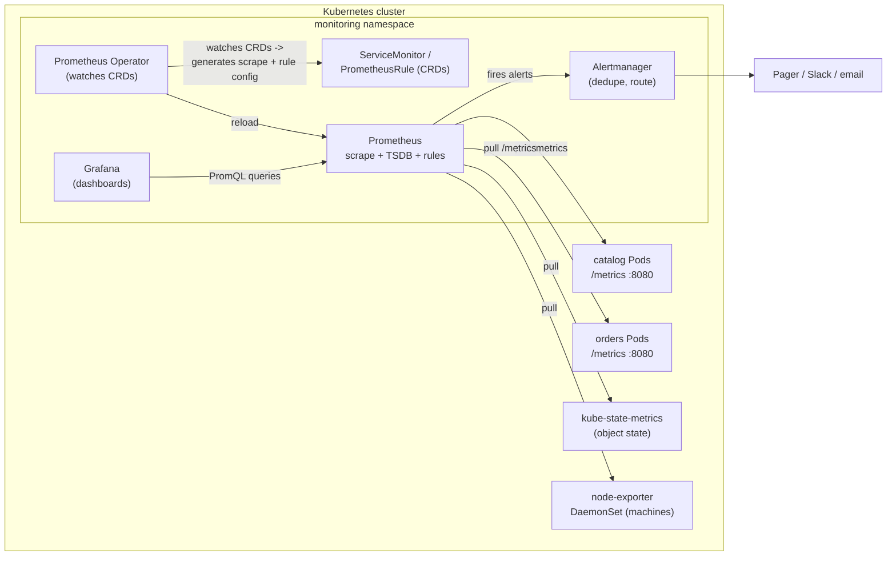

# 01 — Observability: metrics

> The two metrics planes — **metrics-server** (the resource-metrics API behind
> `kubectl top`/HPA) vs **Prometheus** (the monitoring TSDB) — Prometheus
> architecture (pull/scrape, service discovery, TSDB, PromQL, Alertmanager),
> kube-state-metrics vs node-exporter vs app metrics, the **Prometheus
> Operator** + ServiceMonitor/PrometheusRule, the exposition format and
> RED/USE/four-golden-signals — applied by scraping the Bookstore's existing
> `/metrics` and alerting on catalog's error rate.

**Estimated time:** ~30 min read · ~60 min hands-on
**Prerequisites:** [Part 04 ch.01](../04-scheduling/01-scheduler-and-nodes.md) — workloads are scheduled and running · [Part 05 ch.02](../05-security/02-pod-security.md) — hardened and running, but is it *healthy*? · [Part 01 ch.02](../01-core-workloads/02-health-and-lifecycle.md) — probes vs metrics: liveness ≠ p95 latency
**You'll know after this:** • distinguish metrics-server (resource metrics for HPA) from Prometheus (monitoring TSDB) · • read PromQL for RED, USE and the four golden signals · • deploy the Prometheus Operator and write ServiceMonitor + PrometheusRule resources · • interpret kube-state-metrics, node-exporter and application `/metrics` together · • alert on the Bookstore catalog's error rate via Alertmanager

<!-- tags: observability, prometheus, slo, day-2 -->

## Why this exists

The Bookstore now runs, is scheduled deliberately ([Part 04](../04-scheduling/01-scheduler-and-nodes.md))
and is hardened ([Part 05](../05-security/02-pod-security.md)). The next
question every operator asks is the one Kubernetes itself **cannot answer**:
*is it actually healthy, and how do I know before a user tells me?*
`kubectl get pods` shows `Running`; it does **not** show that catalog's p95
latency tripled, that the 5xx rate is climbing, or that a node is saturated.
A `Running` Pod serving 100% errors is still `Running`.

Kubernetes ships **no built-in monitoring database**. It exposes raw signals
(the kubelet's `/metrics/resource`, the API server's own `/metrics`, container
cgroup stats) but it does not store history, has no query language, and raises
no alerts. Observability is something you **add**. This chapter is the metrics
pillar of it (logs are [ch.02](02-logging.md), traces [ch.03](03-tracing.md));
together they are how you operate the system instead of guessing. This is the
[Observability](#further-reading) concern from *Production Kubernetes*.

## Mental model

There are **two distinct metrics planes**, and conflating them is the most
common beginner mistake:

- **The resource-metrics plane — `metrics-server`.** A single lightweight
  add-on that scrapes the kubelet Summary API on every node and serves
  *only* current CPU/memory per Pod/node through the aggregated
  **`metrics.k8s.io`** API. No history (the last data point only), no
  disk, no query language. It exists for exactly two consumers:
  `kubectl top` and the **HorizontalPodAutoscaler**
  ([ch.04](04-autoscaling.md)). It is *not* a monitoring system.
- **The monitoring plane — Prometheus.** A time-series database that
  **pulls** (`scrape`s) HTTP `/metrics` endpoints on an interval, stores the
  samples with their labels in a local TSDB, and lets you ask questions of
  the *history* with **PromQL**. It evaluates alerting rules and hands firing
  alerts to **Alertmanager** for routing. This is the system you graph,
  alert, and debug with.

You need both: metrics-server because the HPA's `Resource` metric is fed by
`metrics.k8s.io`, and Prometheus because that is where SLOs, dashboards and
alerts live. They scrape different things for different consumers and do not
replace each other.

Prometheus's data model: every sample is a `metric_name{label=value,...}` →
`float64` at a timestamp. The Bookstore's Go services already speak it — they
expose `http_requests_total{handler,code}` (a **counter**) and
`http_request_duration_seconds` (a **histogram**) on `/metrics`
(`app/catalog/main.go`). You instrument once in the app; Prometheus does the
rest by scraping.

Three metric *sources* you will always run, answering different questions:

| Source | What it knows | Example |
|---|---|---|
| **Application metrics** | what the app is doing | `http_requests_total`, `orders_placed_total` |
| **kube-state-metrics** | the desired/observed state of K8s *objects* | `kube_deployment_status_replicas_available` |
| **node-exporter** | the *machine* underneath | `node_cpu_seconds_total`, `node_filesystem_avail_bytes` |

## Diagrams

### Prometheus architecture: scrape → store → query → alert (Mermaid)



### metrics-server vs Prometheus, and RED/USE (ASCII)

```
 TWO METRICS PLANES ─────────────────────────────────────────────────────────
   metrics-server  : kubelet summary -> metrics.k8s.io : NOW only, no history
                      consumers: `kubectl top`, HPA Resource metric
   Prometheus       : scrape /metrics -> TSDB (history) -> PromQL/alerts
                      consumers: Grafana, Alertmanager, you (debugging)
   (they do NOT overlap; you run both)

 RED — for every REQUEST-serving service (catalog, orders, storefront)
   Rate      requests/sec        sum(rate(http_requests_total[5m]))
   Errors    failed/sec or ratio rate(...{code=~"5.."}) / rate(...)
   Duration  latency distribution histogram_quantile(0.95, ...bucket)

 USE — for every RESOURCE (node CPU, memory, disk, a queue)
   Utilization  % time busy / used      node_cpu busy ratio
   Saturation   queued / waiting work   runqueue, RabbitMQ queue depth
   Errors       error events            disk errors, OOM kills

 The four golden signals (SRE book) = Latency + Traffic + Errors + Saturation
   ≈ RED (latency/traffic/errors) + the S of USE (saturation).
```

## Hands-on with the Bookstore

**Assumed working directory: the guide repo root (`full-guide/`).**

We will: (1) install **metrics-server** and see `kubectl top`/HPA-grade
metrics; (2) install **kube-prometheus-stack** (Prometheus Operator +
Prometheus + Alertmanager + Grafana + node-exporter + kube-state-metrics) into
its own `monitoring` namespace; (3) point a **ServiceMonitor** at catalog's
existing `/metrics`; (4) query it with PromQL; (5) add a **PrometheusRule**.

### 0. Prerequisites (self-bootstrapping — re-run after any kind recreate)

```sh
# A cluster (single-node kind is fine for this chapter).
kind create cluster --name bookstore        # or: k3d cluster create bookstore

# Build + load the Bookstore images (full instructions in
# examples/bookstore/app/README.md):
cd examples/bookstore/app
docker build -t bookstore/catalog:dev         ./catalog
docker build -t bookstore/orders:dev          ./orders
docker build -t bookstore/payments-worker:dev ./payments-worker
docker build -t bookstore/storefront:dev      ./storefront
cd ../../..                                   # back to the guide repo root
for i in catalog orders payments-worker storefront; do
  kind load docker-image bookstore/$i:dev --name bookstore
done

# The cumulative Bookstore chain, in dependency order (PSA-restricted ns first,
# then SAs, config/secret, cluster-scoped, then workloads + Services):
kubectl apply -f examples/bookstore/raw-manifests/00-namespace.yaml
kubectl apply -f examples/bookstore/raw-manifests/05-serviceaccounts-rbac.yaml
kubectl apply -f examples/bookstore/raw-manifests/15-catalog-config.yaml
kubectl apply -f examples/bookstore/raw-manifests/16-db-credentials.yaml
kubectl apply -f examples/bookstore/raw-manifests/35-priorityclasses.yaml
kubectl apply -f examples/bookstore/raw-manifests/12-redis.yaml
kubectl apply -f examples/bookstore/raw-manifests/13-rabbitmq.yaml
kubectl apply -f examples/bookstore/raw-manifests/20-postgres-statefulset.yaml
kubectl rollout status statefulset/postgres -n bookstore
kubectl apply -f examples/bookstore/raw-manifests/10-catalog-deploy.yaml
kubectl apply -f examples/bookstore/raw-manifests/14-orders-deploy.yaml
kubectl apply -f examples/bookstore/raw-manifests/40-services.yaml
kubectl apply -f examples/bookstore/raw-manifests/21-db-migrate-job.yaml   # schema
# catalog/orders carry DB_DSN; their /readyz pings Postgres connectivity (not
# table existence), so gate on the schema Job BEFORE asserting readiness —
# else they CrashLoop/500 on /books and the rollout wait times out.
kubectl wait --for=condition=complete job/db-migrate -n bookstore --timeout=120s
kubectl rollout status deployment/catalog -n bookstore
```

### 1. metrics-server (the resource-metrics plane)

Install via Helm (same install method as every other add-on in this part; a
raw `releases/latest/download/components.yaml` URL is fragile — `latest/`
resolves to the newest tag but the filename is fixed, so it can 404 or skew —
and Helm lets the kind/k3d TLS flag be set declaratively at install time
instead of a post-install patch). The chart installs into `kube-system`:

```sh
helm repo add metrics-server https://kubernetes-sigs.github.io/metrics-server/
helm repo update
# --kubelet-insecure-tls: on kind/k3d the kubelet serving cert is self-signed
# so metrics-server's TLS verification fails without it (LOCAL ONLY — in
# production the kubelet cert is properly signed; never set this there).
helm install metrics-server metrics-server/metrics-server \
  --namespace kube-system \
  --set 'args={--kubelet-insecure-tls}' \
  --wait
kubectl -n kube-system rollout status deployment/metrics-server

# Now the metrics.k8s.io API is served — `kubectl top` works:
kubectl top nodes
kubectl top pods -n bookstore
```

`kubectl top` returns **current** usage only — there is no `--since`, no
history. That is the entire point of metrics-server: it is the live feed the
HPA samples ([ch.04](04-autoscaling.md)), not a monitoring store.

### 2. kube-prometheus-stack (the monitoring plane)

Install via Helm into a dedicated `monitoring` namespace. That namespace is
**not** the `bookstore` namespace and is **not** PSA-restricted — the stack's
node-exporter is a privileged host-level DaemonSet and belongs in its own
trusted namespace, exactly like the log agent in [ch.02](02-logging.md):

```sh
helm repo add prometheus-community https://prometheus-community.github.io/helm-charts
helm repo update
kubectl create namespace monitoring
# Release name MUST be kube-prometheus-stack — the ServiceMonitor/PrometheusRule
# `release:` label (80-/81-) must match Prometheus's selector (see below).
helm install kube-prometheus-stack \
  prometheus-community/kube-prometheus-stack \
  --namespace monitoring --wait
kubectl get pods -n monitoring
```

You now have Prometheus, Alertmanager, Grafana, node-exporter (a DaemonSet),
and kube-state-metrics — all scraped automatically. Open Prometheus and
Grafana via port-forward (local only):

```sh
kubectl -n monitoring port-forward svc/kube-prometheus-stack-prometheus 9090:9090 &
# Prometheus UI: http://localhost:9090  (Status -> Targets shows what it scrapes)
kubectl -n monitoring port-forward svc/kube-prometheus-stack-grafana 3000:80 &
# Grafana: http://localhost:3000 (admin / prom-operator by default — change it)
```

### 3. Scrape the Bookstore: a ServiceMonitor

Prometheus does not know about catalog yet. We do **not** edit
`prometheus.yml` — the Operator turns a `ServiceMonitor` custom resource into
scrape config. New file
[`examples/bookstore/raw-manifests/80-servicemonitor.yaml`](../examples/bookstore/raw-manifests/80-servicemonitor.yaml)
(catalog shown; the file also includes payments-worker):

```yaml
apiVersion: monitoring.coreos.com/v1
kind: ServiceMonitor
metadata:
  name: catalog
  namespace: bookstore
  labels:
    app: catalog
    release: kube-prometheus-stack   # MUST match Prometheus's serviceMonitorSelector
spec:
  selector:
    matchLabels: { app: catalog }    # selects the `catalog` Service (40-)
  namespaceSelector:
    matchNames: ["bookstore"]
  endpoints:
    - port: http                     # the catalog Service's named port (-> 8080)
      path: /metrics                 # promhttp.Handler() (app/catalog/main.go)
      interval: 15s
```

> **The `release:` label is load-bearing.** kube-prometheus-stack's Prometheus
> defaults to `serviceMonitorSelector: matchLabels: {release: kube-prometheus-stack}`.
> A ServiceMonitor *without* that label is a valid object that is **silently
> never scraped** — the single most common "my ServiceMonitor does nothing"
> cause. The file's header documents this.

> **CRD-backed object — expected dry-run note.** `ServiceMonitor` is a
> Prometheus Operator CRD, not a built-in kind. On a cluster *without* the
> Operator, `kubectl apply --dry-run=client -f 80-servicemonitor.yaml` prints
> `no matches for kind "ServiceMonitor" in version "monitoring.coreos.com/v1"`
> — **expected and not a defect**, exactly like the Gateway API
> ([Part 02 ch.05](../02-networking/05-gateway-api.md)), VolumeSnapshot
> ([Part 03 ch.05](../03-config-and-storage/05-stateful-data-patterns.md)) and
> Kyverno ([Part 05 ch.03](../05-security/03-supply-chain.md)) objects. After
> installing the stack the schema is valid and it applies. The same applies to
> `81-prometheusrule.yaml`.

```sh
kubectl apply -f examples/bookstore/raw-manifests/80-servicemonitor.yaml
# Prometheus UI -> Status -> Targets: bookstore/catalog should be UP within ~30s.
```

> **NetworkPolicy interaction.** Once a policy-enforcing CNI is in play (Part 02
> ch.06), default-deny ingress in `bookstore` blocks Prometheus's scrape and
> every target shows "context deadline exceeded". `60-networkpolicy.yaml` was
> extended this phase with rule 10 (`allow-monitoring-scrape`) admitting the
> `monitoring` namespace to catalog/orders/payments-worker on `:8080` — apply
> the updated `60-networkpolicy.yaml` if you are running with Calico/Cilium.
> Note this rule is **deliberately one-sided** — unlike the intra-`bookstore`
> backend edges (Part 02 ch.06), which need *both* a destination Ingress
> *and* a source Egress rule because *both* endpoints sit in the default-deny
> `bookstore` namespace. This scrape edge is **cross-namespace**: the source
> (Prometheus) lives in `monitoring`, which kube-prometheus-stack does **not**
> put under a default-deny policy, so Prometheus already has unrestricted
> egress and needs no egress rule. NetworkPolicy is per-namespace; only the
> locked-down side (`bookstore`) has a half to add, so the missing "other
> half" is correct by design, not an omission.

### 4. Query the Bookstore with PromQL

Generate some traffic, then query (Prometheus UI → Graph, or `/api/v1/query`).
catalog is distroless (no shell), so drive it from an **ephemeral
public-image** Pod, not `kubectl exec`:

```sh
# A restricted-compliant curl Pod in `bookstore` (PSA enforce:restricted),
# looping to create requests. --overrides supplies the restricted SC so PSA
# admits this ad-hoc Pod (curlimages/curl runs fine as non-root).
kubectl run loadgen -n bookstore --rm -it --restart=Never \
  --image=curlimages/curl:8.10.1 \
  --overrides='{"spec":{"securityContext":{"runAsNonRoot":true,"runAsUser":65534,"seccompProfile":{"type":"RuntimeDefault"}},"containers":[{"name":"loadgen","image":"curlimages/curl:8.10.1","command":["sh","-c","for i in $(seq 1 300); do curl -s -o /dev/null http://catalog.bookstore.svc.cluster.local/books; done; echo done"],"securityContext":{"allowPrivilegeEscalation":false,"capabilities":{"drop":["ALL"]},"readOnlyRootFilesystem":true}}]}}'
```

The RED queries (these work against the metrics catalog already exports):

```promql
# Rate — requests/sec to the books handler, per pod, last 5m
sum(rate(http_requests_total{handler="books"}[5m])) by (pod)

# Errors — 5xx ratio across catalog (the SLO-style symptom signal)
sum(rate(http_requests_total{handler!="metrics",code=~"5.."}[5m]))
  / sum(rate(http_requests_total{handler!="metrics"}[5m]))

# Duration — p95 latency from the histogram (the standard quantile pattern)
histogram_quantile(0.95,
  sum by (le) (rate(http_request_duration_seconds_bucket{handler="books"}[5m])))
```

In Grafana, the bundled "Kubernetes / Compute Resources" dashboards already
work (kube-state-metrics + node-exporter feed them); build a Bookstore RED
dashboard from the three queries above (one panel each).

### 5. Alert on catalog's error rate: a PrometheusRule

New file
[`examples/bookstore/raw-manifests/81-prometheusrule.yaml`](../examples/bookstore/raw-manifests/81-prometheusrule.yaml)
(one rule shown; the file has three — high error rate, high p95, absent):

```yaml
apiVersion: monitoring.coreos.com/v1
kind: PrometheusRule
metadata:
  name: bookstore-catalog-rules
  namespace: bookstore
  labels:
    app: catalog
    release: kube-prometheus-stack   # MUST match Prometheus's ruleSelector
spec:
  groups:
    - name: bookstore-catalog.rules
      rules:
        - alert: CatalogHighErrorRate
          expr: |
            (sum(rate(http_requests_total{handler!="metrics",code=~"5.."}[5m]))
             / sum(rate(http_requests_total{handler!="metrics"}[5m]))) > 0.05
          for: 10m
          labels: { severity: warning, service: catalog }
          annotations:
            summary: "catalog 5xx error ratio above 5%"
```

```sh
kubectl apply -f examples/bookstore/raw-manifests/81-prometheusrule.yaml
# Prometheus UI -> Alerts: the 3 rules appear (Inactive until the expr trips,
# then Pending for `for:` 10m, then Firing -> Alertmanager).
```

`for: 10m` means the condition must hold continuously for 10 minutes before
firing — this is what stops a momentary blip from paging anyone. The
thresholds here are illustrative; [ch.05](05-reliability-and-disruptions.md)
derives them from an actual SLO and error budget.

## How it works under the hood

- **Pull, not push.** Prometheus *scrapes*: it issues an HTTP `GET /metrics`
  to each target every `scrape_interval` and parses the text exposition
  format (`name{labels} value [timestamp]`, `# HELP`, `# TYPE`). Pull means
  Prometheus controls the load and target discovery, and a target being
  unreachable is itself a signal (`up == 0`). The Bookstore's
  `promhttp.Handler()` is the exposition endpoint; the client library tracks
  counters/histograms in memory and renders them on each scrape.
- **Service discovery, not a static list.** In Kubernetes, Prometheus uses
  the `kubernetes_sd` discovery role to enumerate Pods/Services/Endpoints
  from the API server and relabels them into targets. The **Prometheus
  Operator** sits on top: it watches `ServiceMonitor`/`PodMonitor`/
  `PrometheusRule` objects and **generates** the scrape and rule config, then
  triggers a Prometheus config reload. You manage Kubernetes objects; the
  Operator manages `prometheus.yml`. That is why adding a target is `kubectl
  apply` of a ServiceMonitor, never editing a config file.
- **The TSDB.** Samples append to a per-series in-memory head block, flushed
  to immutable on-disk blocks (default 2h) with a WAL for crash recovery;
  old blocks are compacted and expire at the retention horizon (default 15d
  — Prometheus is **not** long-term storage; that is Thanos/Cortex/Mimir).
  Each unique label-set is its own series.
- **PromQL evaluates over the series.** `rate()` needs a **counter** (the
  client library guarantees monotonicity; `rate` corrects for counter
  resets/restarts). A **histogram** is exposed as cumulative `_bucket{le=...}`
  series plus `_sum`/`_count`; `histogram_quantile(0.95, sum by (le) (rate(
  ..._bucket[5m])))` interpolates the p95 from the bucket rates. This is why
  the app exports a histogram, not a single latency gauge — quantiles must be
  computed from the distribution, and cannot be averaged across pods.
- **Rules and Alertmanager.** Prometheus evaluates each rule group on an
  interval. A *recording rule* precomputes an expensive expression into a new
  series; an *alerting rule* whose `expr` is non-empty for its `for:`
  duration becomes a firing alert sent to **Alertmanager**, which
  deduplicates, groups, silences, and routes (pager/Slack/email).
  Alertmanager does the routing; Prometheus only decides *what* is firing.
- **Cardinality is the failure mode.** Series count = product of every
  label's distinct values. A label with unbounded values (user ID, full
  URL, request UUID) multiplies series without limit and OOMs Prometheus.
  The Bookstore deliberately labels by **bounded** dimensions (`handler`,
  `code`) — never the book ID or a raw path. High cardinality is the number
  one way people take Prometheus down.

## Production notes

> **In production:** keep the two planes separate and do not skip either.
> `metrics-server` (or a cloud equivalent) is mandatory for `kubectl top` and
> any **HPA** Resource metric ([ch.04](04-autoscaling.md)); Prometheus (or a
> managed equivalent) is mandatory for SLOs and alerting. Removing
> metrics-server silently breaks autoscaling; relying on it for monitoring
> gives you no history at all.

> **In production:** instrument with **RED** for every request service and
> **USE** for every resource, and alert on **symptoms** (error ratio,
> latency, SLO burn) not **causes** (CPU high). A CPU alert pages you when
> nothing is wrong and stays silent when the app is broken but cheap. The
> Bookstore's `81-prometheusrule.yaml` alerts on error ratio and p95 — the
> things a user feels.

> **In production:** managed offerings change the *operator/scaler* you run,
> not the model. **EKS**: Amazon Managed Service for Prometheus + the
> CloudWatch agent / ADOT collector; **GKE**: Google Cloud Managed Service
> for Prometheus (drop-in, keeps PromQL + ServiceMonitor-style config);
> **AKS**: Azure Monitor managed Prometheus + Managed Grafana. They all
> ingest the same exposition format — your app instrumentation and PromQL are
> portable; only the install and long-term storage differ.

> **In production:** put **retention and long-term storage** in the design
> from day one. Local Prometheus retention is days; for months/years and HA,
> federate to Thanos/Cortex/Mimir (or the managed equivalents). Size
> Prometheus by **active series** and watch `prometheus_tsdb_head_series`;
> guard cardinality with `metric_relabel_configs` that drop dangerous labels.

> **In production:** scrape kube-state-metrics and node-exporter, not just
> apps. Most "why did the Pod restart / why was it evicted / is the node
> saturated" questions are answered by `kube_*` and `node_*` series, not
> application metrics — they are the USE half of the picture.

## Quick Reference

```sh
kubectl top nodes ; kubectl top pods -n bookstore        # metrics-server plane
kubectl get servicemonitor,prometheusrule -n bookstore   # Operator CRDs
kubectl -n monitoring port-forward svc/kube-prometheus-stack-prometheus 9090:9090
kubectl -n monitoring port-forward svc/kube-prometheus-stack-grafana   3000:80
# Prometheus UI: Status->Targets (is catalog UP?), Alerts (rule state)
```

```promql
sum(rate(http_requests_total{handler="books"}[5m]))                     # Rate
sum(rate(http_requests_total{code=~"5.."}[5m])) / sum(rate(http_requests_total[5m]))  # Errors
histogram_quantile(0.95, sum by (le) (rate(http_request_duration_seconds_bucket[5m]))) # Duration
up{job="catalog"}                                                       # is it scraped?
```

Minimal ServiceMonitor + alerting rule skeleton:

```yaml
apiVersion: monitoring.coreos.com/v1
kind: ServiceMonitor
metadata: { name: x, namespace: ns, labels: { release: kube-prometheus-stack } }
spec:
  selector: { matchLabels: { app: x } }
  endpoints: [{ port: http, path: /metrics, interval: 15s }]
---
apiVersion: monitoring.coreos.com/v1
kind: PrometheusRule
metadata: { name: x, namespace: ns, labels: { release: kube-prometheus-stack } }
spec:
  groups:
    - name: x.rules
      rules:
        - alert: XHighErrors
          expr: rate(http_requests_total{code=~"5.."}[5m]) > 0
          for: 10m
          labels: { severity: warning }
```

Checklist:

- [ ] metrics-server installed (`kubectl top` works) — HPA prerequisite
- [ ] Prometheus stack in its own (non-restricted) `monitoring` namespace
- [ ] App exposes `/metrics`; labels are **bounded** (no IDs/paths)
- [ ] ServiceMonitor carries the `release:` label Prometheus selects on
- [ ] Alerts are symptom-based (errors/latency/SLO), not CPU
- [ ] NetworkPolicy allows `monitoring` → app `:8080` (if a policy CNI runs)
- [ ] Retention/long-term storage and cardinality budget decided

## Test your understanding

> Try each before opening the answer drawer. The act of trying is the exercise; the answer is the check.

1. **`kubectl top pods` works and shows live CPU/memory. Does that mean Prometheus is also installed? Explain in one sentence.**
   <details><summary>Show answer</summary>

   No — `kubectl top` is served by **metrics-server** via the `metrics.k8s.io` aggregated API, which is a separate lightweight add-on for *current* CPU/memory only (no history, no alerts, no PromQL). Prometheus is a separate monitoring TSDB; you can have either, both, or — in production — both, because they answer different questions. See the table in §Mental model.

   </details>

2. **You write `up{job="catalog"} == 0` as an alerting rule and it never fires, even though you can `kubectl get pods` and see catalog pods crashing. Where would you look first?**
   <details><summary>Show answer</summary>

   `up` is the scrape result — if the *ServiceMonitor* doesn't select the pod's Service (label mismatch on `release:` or `app:`), Prometheus never tries to scrape it, so there's no `up{job="catalog"}` series at all (vs being 0). Check Prometheus UI → Status → Targets: if catalog isn't listed, it's a ServiceMonitor selector or `prometheus.spec.serviceMonitorSelector` mismatch. The trap is "no data" looks identical to "everything's healthy" — alert on **absence** with `absent(up{job="catalog"})`, not just `== 0`.

   </details>

3. **Your `http_requests_total` series has labels `{handler, code, customer_id}`. After a week Prometheus is OOMing and queries are slow. What's the root cause and the fix?**
   <details><summary>Show answer</summary>

   `customer_id` is unbounded — every customer creates a new time series, and Prometheus's memory cost is proportional to *active series count*, not request volume. This is **label cardinality explosion**, the #1 way to break a Prometheus. Fix: drop `customer_id` from the metric (it belongs in *logs* or *traces*, not metrics), keep labels to a low-cardinality set (`handler`, `code`, `method`) — usually under ~100 per metric.

   </details>

4. **Hands-on extension — break a histogram. Define an HPA that uses `http_request_duration_seconds` (a histogram) as a custom metric without first exposing `_bucket`, `_sum`, `_count`. Apply it. What does `kubectl describe hpa` show?**
   <details><summary>What you should see</summary>

   The HPA stays at `Unknown` for the metric value; `kubectl describe hpa` shows `FailedGetExternalMetric` / `unable to fetch metrics`. Histograms are aggregated via `histogram_quantile(0.95, sum by (le) (rate(..._bucket[5m])))` — you cannot point HPA at a raw histogram. Either expose a derived `_p95` gauge via a recording rule, or use the Prometheus Adapter to register the quantile as an external metric.

   </details>

5. **Why does the chapter insist that alerts be symptom-based (errors/latency/SLO) rather than CPU-based?**
   <details><summary>Show answer</summary>

   High CPU is not a symptom of user pain — a pod can run at 90% CPU and serve perfect p95 latency; a pod at 10% CPU can be erroring every request. CPU alerts produce paging noise (false positives) *and* miss real failures (false negatives). Alert on **what users feel** (error rate, latency, throughput drop) — the four golden signals / RED — and use CPU as a *diagnostic* once you're already paged on a symptom.

   </details>

## Further reading

- **Rosso et al., _Production Kubernetes_, ch.9 — Observability** (metrics
  pipeline, Prometheus, alerting, the RED/USE framing for a platform).
- **Ibryam & Huß, _Kubernetes Patterns_ 2e — *Predictable Demands* (ch.2)**
  for why measured resource behaviour (not guesses) underpins scaling and
  capacity ([ch.04](04-autoscaling.md), [ch.06](06-capacity-and-cost.md)).
- Official: <https://kubernetes.io/docs/tasks/debug/debug-cluster/resource-metrics-pipeline/>
  (metrics-server / `metrics.k8s.io`),
  <https://prometheus.io/docs/introduction/overview/> and the Prometheus
  Operator design: <https://prometheus-operator.dev/docs/getting-started/introduction/>.
