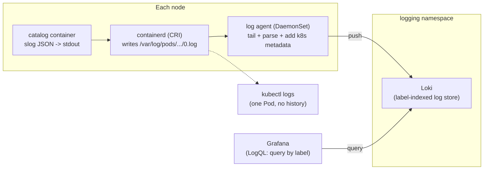

# 02 — Logging

> The Kubernetes logging architecture (stdout/stderr → CRI log files → node;
> **no built-in cluster logging**), the **node-level agent** pattern
> (DaemonSet: Fluent Bit/Vector/Alloy) → store (Loki/Elasticsearch/OpenSearch/
> cloud), the sidecar pattern and when *not* to use it, structured JSON
> logging, correlation/trace IDs, multiline handling, retention/cost/PII —
> applied by shipping the Bookstore's existing JSON logs into Loki and
> querying a single request.

**Estimated time:** ~15 min read · ~60 min hands-on
**Prerequisites:** [Part 06 ch.01](01-observability-metrics.md) — metrics show *that* it broke, logs show *why* · [Part 01 ch.06](../01-core-workloads/06-daemonsets.md) — the node-level agent pattern · [Part 01 ch.01](../01-core-workloads/01-pods.md) — stdout/stderr is the container log boundary
**You'll know after this:** • explain why Kubernetes has no built-in cluster logging and what fills the gap · • deploy a node-level log agent (Fluent Bit / Vector / Alloy) as a DaemonSet · • choose between the sidecar and DaemonSet patterns for shipping logs · • write structured JSON logs with trace IDs that correlate across services · • query the Bookstore's logs in Loki for a single user request

<!-- tags: observability, day-2, opentelemetry -->

## Why this exists

[ch.01](01-observability-metrics.md) tells you *that* catalog's error rate
rose. Logs tell you *why this specific request* failed — the stack trace, the
bad input, the DB timeout. Metrics are aggregates; logs are the event detail.

And here is the part newcomers are always surprised by: **Kubernetes has no
cluster logging system at all.** What it provides is deliberately minimal —
the container runtime captures a container's stdout/stderr to a file on the
node, and `kubectl logs` reads that file. That's it. There is no aggregation,
no search across Pods, no retention beyond the node, and **the logs are gone
when the Pod is deleted or the node is recycled** (rollout, scale-down,
eviction, autoscaler). Centralised logging is something you **add** with a
node agent that ships those files to a store. This is the logging half of the
[Observability](#further-reading) concern from *Production Kubernetes*.

## Mental model

Follow one log line:

1. The Bookstore Go service writes a **JSON line to stdout** (it already does
   — `slog.NewJSONHandler(os.Stdout, ...)` in `app/catalog/main.go`).
2. The **container runtime** (containerd via the CRI) captures stdout/stderr
   and writes it to a file on the node, conventionally
   `/var/log/pods/<NS>_<POD>_<UID>/<CONTAINER>/0.log`, in the CRI log format
   (`<RFC3339NANO_TIMESTAMP> <STREAM> <P|F> <MESSAGE>`).
3. `kubectl logs` just streams that file back. Useful for one Pod, now;
   useless for "show me every error across all catalog replicas yesterday".
4. To centralise, a **node-level logging agent** — one Pod per node, i.e. a
   **DaemonSet** ([Part 01 ch.06](../01-core-workloads/06-daemonsets.md)) —
   tails every `/var/log/pods/...` file, parses it, attaches Kubernetes
   metadata (namespace, pod, labels) from the API server, and pushes to a
   **log store** (Loki, Elasticsearch/OpenSearch, or a cloud service).
5. You query the *store* (LogQL/Lucene/cloud query), filtered by label and
   time, correlated with metrics and traces.

The application's only job is **log structured JSON to stdout** and never
manage log files itself. The platform's job is the agent + store. Keep those
two responsibilities separate and logging "just works" through every restart,
rollout, and node replacement.

Three architectures, and when each applies:

- **Node agent (DaemonSet) — the default.** One agent per node tails all
  containers' stdout. Zero per-app change, lowest overhead, the standard.
- **Sidecar.** An extra logging container in the Pod. Use **only** when the
  app *cannot* log to stdout (legacy app that only writes to a file inside
  the container, or you must split one stream into several). Cost: a sidecar
  per Pod (CPU/memory/complexity). Not the default — a last resort.
- **App ships directly.** The app library writes to the log backend over the
  network itself. Couples the app to the logging vendor and loses logs
  during app crashes/buffering — generally an anti-pattern.

## Diagrams

### A log line: container → stdout → CRI file → node agent → store (Mermaid)



### Logging architecture options (ASCII)

```
 OPTION A — NODE AGENT (DaemonSet)         <- default, use this
   app -> stdout -> CRI file -> [agent per node] -> store
   + no app change  + 1 agent/node  + survives Pod death
   - agent needs node-level read of /var/log (trusted system component)

 OPTION B — SIDECAR
   app -> file in Pod -> [sidecar in same Pod] -> store
   + works for apps that can't use stdout
   - +1 container PER POD (cost, complexity); only when A impossible

 OPTION C — APP SHIPS DIRECTLY
   app --(vendor SDK over network)--> store
   - couples app to backend; logs lost on crash/buffer; anti-pattern

 WHY NOT log to a file inside the container:
   ephemeral FS dies with the Pod; readOnlyRootFilesystem (Part 05 ch.02)
   forbids it anyway; nothing tails it. stdout is the contract.
```

## Hands-on with the Bookstore

**Assumed working directory: the guide repo root (`full-guide/`).**

We will: (1) confirm the Bookstore already logs structured JSON to stdout;
(2) install **Loki** + a **Grafana Alloy** (the current Grafana log agent;
Promtail's successor) DaemonSet into a `logging` namespace; (3) query a single
Bookstore request by label in Grafana.

### 0. Prerequisites (self-bootstrapping)

Bring up the cluster + the Bookstore exactly as in
[ch.01 step 0](01-observability-metrics.md) (namespace → SAs → config/secret →
priorityclasses → catalog/orders → Services; images built and `kind load`ed).
If you did ch.01, the cluster is ready and Grafana is already installed (we
reuse the ch.01 Grafana). If not, install just Grafana:

```sh
helm repo add grafana https://grafana.github.io/helm-charts && helm repo update
```

### 1. See what the app already emits

The Go services log JSON to stdout with `log/slog` (one line per event,
machine-parseable). No app change is needed — verify it:

```sh
# catalog is distroless (no shell) but `kubectl logs` reads the CRI file, not
# the container — it works regardless of the image having a shell.
kubectl logs -n bookstore deploy/catalog --tail=5
# e.g. {"time":"...","level":"INFO","msg":"catalog listening","addr":":8080"}
kubectl logs -n bookstore deploy/orders  --tail=5
# orders logs e.g. {"time":"...","level":"INFO","msg":"order placed",
#                    "order_id":..., "book_id":..., "qty":...}
```

Structured fields (`level`, `msg`, `order_id`, `book_id`) are what makes
centralised logs queryable — you filter on `level="ERROR"` or pivot on
`order_id`, not grep raw text.

### 2. Install Loki + an Alloy DaemonSet (own namespace)

The agent runs as a **trusted system DaemonSet** in its **own** namespace —
**not** in `bookstore`. This is the legitimate exception to Part 05's
hardening: to read every container's log file the agent needs
`hostPath: /var/log` and to run as a privileged-ish system component. That is
correct for a platform log collector and exactly why it must **not** live in
the PSA-`restricted` `bookstore` namespace (where hostPath is forbidden) — it
is infrastructure, like node-exporter in [ch.01](01-observability-metrics.md).

```sh
kubectl create namespace logging

# Loki (single-binary mode is fine for local) — the label-indexed log store.
helm install loki grafana/loki \
  --namespace logging \
  --set deploymentMode=SingleBinary \
  --set loki.auth_enabled=false \
  --set loki.storage.type=filesystem \
  --set singleBinary.replicas=1 --wait
  # (singleBinary.replicas=1 already governs the single-replica topology;
  #  loki.commonConfig.replication_factor is redundant in SingleBinary mode.)

# Grafana Alloy as a per-node DaemonSet that tails pod logs and pushes to Loki.
# (Promtail is deprecated in favour of Alloy; the pattern is identical.)
helm install alloy grafana/alloy \
  --namespace logging \
  --set controller.type=daemonset --wait

# Point Grafana (installed in ch.01's monitoring ns) at Loki as a datasource,
# or add it in the Grafana UI: Connections -> Data sources -> Loki ->
#   URL: http://loki.logging.svc.cluster.local:3100
```

> **Why hostPath here is acceptable.** The agent's job is to read
> `/var/log/pods` on the node — that *requires* a `hostPath` mount and node
> access. A log collector is a trusted, audited platform component running in
> its own namespace; it is the textbook case where the `restricted` standard
> is intentionally not applied. The rule from Part 05 still holds for *your*
> workloads: `bookstore` stays `enforce: restricted` and nothing app-side
> gets a hostPath. Never relax the app namespace to make logging work — run
> the agent beside it instead.

### 3. Query one Bookstore request by label

Generate traffic, then query Loki via Grafana (**Explore** → Loki). catalog is
distroless, so drive load from a restricted-compliant ephemeral Pod (same
pattern as [ch.01](01-observability-metrics.md)):

```sh
kubectl run loadgen -n bookstore --rm -it --restart=Never \
  --image=curlimages/curl:8.10.1 \
  --overrides='{"spec":{"securityContext":{"runAsNonRoot":true,"runAsUser":65534,"seccompProfile":{"type":"RuntimeDefault"}},"containers":[{"name":"loadgen","image":"curlimages/curl:8.10.1","command":["sh","-c","for i in $(seq 1 50); do curl -s -o /dev/null http://catalog.bookstore.svc.cluster.local/books; curl -s -o /dev/null -XPOST http://orders.bookstore.svc.cluster.local/orders -d \"{\\\"book_id\\\":1,\\\"qty\\\":2}\"; done; echo done"],"securityContext":{"allowPrivilegeEscalation":false,"capabilities":{"drop":["ALL"]},"readOnlyRootFilesystem":true}}]}}'
```

LogQL queries (Grafana → Explore → datasource Loki):

```logql
# All catalog logs (label selectors come from the agent's k8s metadata):
{namespace="bookstore", app="catalog"}

# Only errors, parsed as JSON, across the orders tier:
{namespace="bookstore", app="orders"} | json | level="ERROR"

# Follow one order end-to-end by its structured field:
{namespace="bookstore", app="orders"} | json | order_id=`1700000000000000000`
```

The `{namespace=..., app=...}` **labels are indexed** (cheap); the `| json`
parse and field filters operate on the line **content** (Loki's model: index
labels, not full text — which is why bounded labels matter here too, just like
metric cardinality in [ch.01](01-observability-metrics.md)).

## How it works under the hood

- **The runtime owns log capture.** The kubelet asks the CRI runtime
  (containerd) to run the container; containerd redirects the container's
  stdout/stderr through its logging driver to
  `/var/log/pods/<NS>_<POD>_<UID>/<CONTAINER>/<RESTART_COUNT>.log` in the CRI
  log format. The kubelet also rotates these files (`containerLogMaxSize`,
  `containerLogMaxFiles`). `kubectl logs` is an API call the kubelet serves
  by reading that file — there is no database behind it, which is why it has
  no cross-Pod search and no post-deletion history.
- **`kubectl logs --previous` reads the prior file.** On a container restart
  the runtime starts a new `N.log`; `--previous` serves `N-1.log`. After the
  *Pod* is deleted the directory is removed and even that is gone — the
  motivation for shipping logs off-node.
- **The agent does tail + enrich + push.** A node agent (Alloy/Fluent
  Bit/Vector) watches the `/var/log/pods` tree, tails new lines, parses
  (JSON/regex/CRI), and — crucially — joins each line to its Pod's metadata
  by calling the API server (namespace, pod, labels, node) so logs are
  queryable by the same labels you use elsewhere. It tracks a byte offset per
  file so a restart resumes without dup/loss, and buffers + retries so a
  brief store outage doesn't drop logs. One agent per node (DaemonSet) means
  cost scales with nodes, not Pods.
- **Loki indexes labels, not content.** Unlike Elasticsearch (full-text
  index of every line), Loki indexes only the **label set** per stream and
  stores compressed log chunks in object storage; queries are
  *label-selector then brute-scan over the matched chunks*. Far cheaper to
  run; the trade-off is that **labels must be low-cardinality** — a label per
  request ID would explode the index exactly like a high-cardinality
  Prometheus label ([ch.01](01-observability-metrics.md)).
- **Structured logs are the contract.** Because the agent can parse JSON into
  fields, `level=ERROR` / `order_id=...` become first-class filters. Plain
  unstructured text forces fragile regex at query time. `log/slog`'s JSON
  handler (already used) emits a stable schema; adding a request/trace ID
  field is what makes a single request greppable across services — the bridge
  to tracing ([ch.03](03-tracing.md)).
- **Multiline.** A stack trace is many stdout lines but one logical event.
  Agents reassemble them with a multiline rule (a "new event" start pattern,
  e.g. the timestamp/JSON-`{` prefix). Logging JSON sidesteps most of this:
  one event = one line by construction.

## Production notes

> **In production:** the app logs **structured JSON to stdout and nothing
> else** — no log files in the container, no log rotation logic in the app,
> no logging-vendor SDK in the request path. `readOnlyRootFilesystem: true`
> (Part 05 ch.02, already on every Bookstore Go service) actively enforces
> "no in-container log files". The node agent + store is the platform's
> responsibility, decoupled from the app.

> **In production:** run the agent as a **trusted DaemonSet in its own
> namespace** with the node access it needs — never relax the application
> namespace's Pod Security to accommodate logging. The Bookstore namespace
> stays `enforce: restricted`; the collector lives beside it, like
> node-exporter.

> **In production:** managed logging changes the *store/agent*, not the
> model. **EKS**: Fluent Bit DaemonSet → CloudWatch Logs (or OpenSearch);
> **GKE**: Cloud Logging is on by default (the node agent is managed for
> you); **AKS**: Azure Monitor / Container Insights. All consume
> stdout/stderr — your "log JSON to stdout" contract is portable; only the
> backend and query language change.

> **In production:** decide **retention, cost and PII** deliberately. Logs
> are usually the largest and most expensive telemetry stream; set
> per-tenant retention, sample or drop chatty debug lines at the agent, and
> **never log secrets/PII** (tokens, card numbers, personal data) — once in
> the store it is an exfiltration and compliance problem. Redact at the app
> or scrub at the agent.

> **In production:** put a **correlation/trace ID** on every log line and
> propagate it across services (W3C `traceparent`, [ch.03](03-tracing.md)).
> "Show me every log for the request that failed" is impossible without it
> and trivial with it — it is the join key between logs, traces and metrics.

## Quick Reference

```sh
kubectl logs -n <NS> deploy/<D> --tail=20 -f          # one workload, live
kubectl logs -n <NS> <POD> -c <CONTAINER> --previous  # crashed container's prior log
kubectl logs -n <NS> -l app=catalog --max-log-requests=10  # across replicas (best-effort)
kubectl get ds -n logging                              # the node agent DaemonSet
```

```logql
{namespace="bookstore", app="catalog"}                       # by label (indexed)
{namespace="bookstore", app="orders"} | json | level="ERROR" # parse + filter content
sum by (level) (count_over_time({app="catalog"} | json [5m])) # log-derived metric
```

Minimal logging-agent shape (the agent is a DaemonSet; the app needs nothing):

```yaml
# Pattern only — Helm installs the real thing. The agent is a DaemonSet in its
# OWN namespace with a hostPath read of the node log dir (trusted component):
kind: DaemonSet            # one agent Pod per node
spec:
  template:
    spec:
      containers:
        - name: agent       # fluent-bit / vector / grafana-alloy
          volumeMounts:
            - { name: varlog, mountPath: /var/log, readOnly: true }
      volumes:
        - name: varlog
          hostPath: { path: /var/log }   # node log files (NOT allowed in a
                                         # restricted app namespace — agent only)
```

Checklist:

- [ ] App logs **structured JSON to stdout** only (no in-container files)
- [ ] Node agent runs as a DaemonSet in its **own** (non-restricted) namespace
- [ ] App namespace stays `enforce: restricted` (no hostPath app-side)
- [ ] Store labels are low-cardinality (no per-request label)
- [ ] Retention + PII/secret redaction policy defined
- [ ] A correlation/trace ID is on every line and propagated across services

## Test your understanding

> Try each before opening the answer drawer. The act of trying is the exercise; the answer is the check.

1. **`kubectl logs <pod>` works perfectly. Why does the chapter still insist you need a logging stack?**
   <details><summary>Show answer</summary>

   `kubectl logs` reads the node-local CRI log file for one container; it has no aggregation across replicas, no search beyond text-grep, no retention beyond the node, and the logs **vanish when the Pod is deleted** (rollout, scale-down, eviction, node recycle). "Show me every error for catalog yesterday across 12 replicas" is impossible with `kubectl logs` and trivial with Loki/Elasticsearch. See §Why this exists.

   </details>

2. **A junior engineer adds `log.SetOutput(os.Open("/var/log/myapp.log"))` to the Go service "for cleaner output." What breaks, and what should they do instead?**
   <details><summary>Show answer</summary>

   The log file lives **inside the container's ephemeral writable layer** — it disappears on every restart, the DaemonSet log agent (which tails `/var/log/pods/...` from the *node*) never sees it, and `kubectl logs` is empty. The fix is to log **JSON to stdout** (which the container runtime captures to `/var/log/pods/...` automatically). The Twelve-Factor logging rule: the app is a stream; the platform handles storage.

   </details>

3. **You enable Loki and ship a label `customer_id` from every request. Two days later Loki is unresponsive. What happened?**
   <details><summary>Show answer</summary>

   Loki's storage cost is roughly proportional to **active label permutations** (called "streams"). Per-customer labels create unbounded cardinality — the same trap as Prometheus ([ch.01](01-observability-metrics.md)). High-cardinality identifiers belong in the **log line body** (where they're indexed by content via `| json`), not as **labels** (which build the storage index). Keep labels low-cardinality: `namespace`, `app`, `pod`, maybe `level`.

   </details>

4. **Hands-on extension — verify the ephemeral-log claim. `kubectl exec` into a pod, write to a log file (`/tmp/test.log`), then `kubectl delete pod`. Recreate the pod via the Deployment. Where did your log go?**
   <details><summary>What you should see</summary>

   Gone. The new Pod is a *new container instance* with a fresh filesystem — `/tmp/test.log` doesn't exist. Same Pod, same image, same Deployment, *zero* log carry-over. Now repeat the same experiment but write the line to stdout (`logger "hello"`/`echo hello`); after the recreate, `kubectl logs --previous` (within the brief window) and a node-level agent shipping to Loki will both still have it. That's the entire architectural argument for "JSON to stdout, store off-box".

   </details>

## Further reading

- **Rosso et al., _Production Kubernetes_, ch.9 — Observability** (the
  logging pipeline, node agents, store choices, retention/cost trade-offs as
  a platform concern).
- Official:
  <https://kubernetes.io/docs/concepts/cluster-administration/logging/>
  (cluster logging architecture, node-agent vs sidecar, why there is no
  built-in cluster logging) and
  <https://kubernetes.io/docs/concepts/cluster-administration/system-logs/>.
