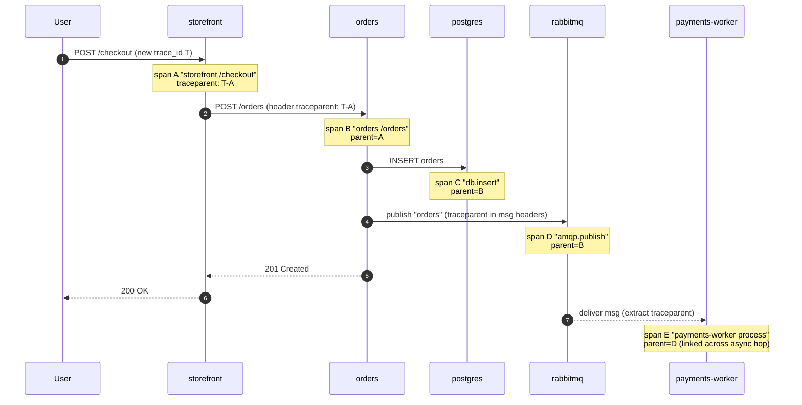

# 03 — Tracing

> Distributed tracing concepts (trace/span/context propagation, **W3C
> traceparent**, head vs tail sampling), **OpenTelemetry** (SDK, auto vs
> manual instrumentation, the **OTel Collector**: receivers/processors/
> exporters), backends (Jaeger/Tempo/Grafana), trace↔log↔metric correlation
> via exemplars, and sampling/overhead — applied by tracing a Bookstore
> checkout across storefront → orders → rabbitmq → payments-worker.

**Estimated time:** ~15 min read · ~60 min hands-on
**Prerequisites:** [Part 06 ch.01](01-observability-metrics.md) — metrics give p95, traces say *where* time went · [Part 06 ch.02](02-logging.md) — trace IDs are the join key to logs · [Part 02 ch.02](../02-networking/02-services.md) — the cross-service calls being traced
**You'll know after this:** • explain traces, spans and W3C `traceparent` context propagation · • choose head sampling vs tail sampling for a given traffic shape · • deploy the OpenTelemetry Collector with receivers, processors and exporters · • correlate trace → log → metric via exemplars in Grafana / Tempo · • follow one Bookstore checkout across four services in a flamegraph

<!-- tags: observability, opentelemetry, day-2 -->

## Why this exists

[Metrics](01-observability-metrics.md) say catalog's p95 is 800ms.
[Logs](02-logging.md) show one request erroring. Neither answers the question
that actually matters in a microservice system: **for this one slow checkout,
where did the time go — orders' Postgres write, the RabbitMQ publish, or the
payments-worker?** A latency histogram is an aggregate across all requests; a
log line is one event in one service. Only a **distributed trace** stitches
the *causal path of a single request across every service it touched* into one
timeline.

The Bookstore is now genuinely distributed: a checkout is
storefront → orders → (Postgres + RabbitMQ) → payments-worker. When it is
slow, "which hop?" is unanswerable from metrics/logs alone. Tracing is the
third observability pillar; with metrics and logs it completes the
[Observability](#further-reading) concern from *Production Kubernetes*.

## Mental model

- A **span** = one timed operation (an HTTP handler, a DB query, a queue
  publish) with a start/end, a name, attributes, and a status.
- A **trace** = a tree of spans sharing one `trace_id`; each span records its
  `parent_span_id`, so the spans reconstruct the call graph and timeline.
- **Context propagation** is the whole trick. Service A, handling a request,
  injects its trace context into the **outbound** call's headers; service B
  extracts it and makes its spans children of A's. The standard wire format
  is the **W3C `traceparent`** HTTP header
  (`traceparent: 00-<TRACE_ID>-<SPAN_ID>-<FLAGS>`). Without propagation you
  get disconnected single-service spans, not a trace. For async hops
  (orders → RabbitMQ → payments-worker) the context rides in the **message
  headers** instead of HTTP headers — same idea, different carrier.
- **Sampling** controls cost. **Head sampling**: decide at the trace's first
  span whether to record it (e.g. keep 10%) — cheap, but you may discard the
  rare slow/errored trace. **Tail sampling**: buffer all spans and decide
  *after* the trace completes (e.g. keep 100% of errors and slow traces, 1%
  of the rest) — far more useful, done in the **Collector**, costs memory.

**OpenTelemetry (OTel)** is the vendor-neutral standard tying this together:

- An **SDK** in each service creates/propagates spans. **Auto-instrumentation**
  wraps common libraries (HTTP server/client, DB driver, AMQP) so you get
  spans without touching business code; **manual** spans annotate
  domain-specific work.
- The **OTel Collector** is a separate Deployment/DaemonSet that **receives**
  telemetry (OTLP), **processes** it (batch, tail-sampling, attribute
  scrubbing), and **exports** it to one or more backends. The app talks OTLP
  to the Collector and stays ignorant of the backend.
- **Backends** store and visualise traces: **Jaeger**, **Grafana Tempo**
  (label-indexed, Loki-like, pairs with Grafana), or a cloud APM.

> **Honesty up front (as [ch.01](01-observability-metrics.md) was about
> illustrative ConfigMap keys).** The Bookstore demo binaries
> (`app/*/main.go`) are intentionally tiny: they export Prometheus metrics and
> JSON logs but are **not** wired with the OTel SDK, so they do not emit spans
> today. This chapter is therefore honest about what is *runnable* vs
> *illustrative*: you will run a real Collector + Tempo and see them healthy,
> and the **instrumentation approach + collector config + how the trace would
> look** are shown faithfully and accurately — but a fully populated checkout
> trace requires adding the OTel SDK to the services (sketched in step 3),
> which is beyond these deliberately minimal teaching binaries. Everything
> claimed to be runnable is; everything illustrative is labelled as such.

## Diagrams

### A Bookstore checkout as a span tree (Mermaid, sequence)



### The span tree + the OTel pipeline (ASCII)

```
 TRACE  trace_id = T  (one checkout)
   span A  storefront /checkout                 [###############]  120ms
     span B  orders /orders                       [#########]       70ms
       span C  postgres INSERT orders               [##]            12ms
       span D  rabbitmq publish "orders"             [#]             4ms
     (async, same trace via msg-header propagation)
   span E  payments-worker process payment          [####]         25ms  parent=D

 OTEL PIPELINE
   [app + OTel SDK] --OTLP--> [OTel Collector] --> [Tempo / Jaeger]
                               receivers: otlp
                               processors: batch, tail_sampling, attributes
                               exporters : otlp/tempo  (+ logging for debug)
   App knows ONLY the Collector endpoint (OTEL_EXPORTER_OTLP_ENDPOINT);
   swapping the backend is a Collector change, not an app change.
```

## Hands-on with the Bookstore

**Assumed working directory: the guide repo root (`full-guide/`).**

We will: (1) deploy **Tempo** + the **OpenTelemetry Collector** into their own
namespace; (2) see them healthy; (3) walk the exact instrumentation the Go
services would need (env-driven OTLP) and the Collector config — being explicit
about what is runnable vs illustrative.

### 0. Prerequisites (self-bootstrapping)

Bring up the cluster + Bookstore as in
[ch.01 step 0](01-observability-metrics.md) (namespace → SAs → config/secret →
priorityclasses → workloads → Services; images built and `kind load`ed). For
the async path also apply rabbitmq, the worker, and the network policy:

```sh
kubectl apply -f examples/bookstore/raw-manifests/13-rabbitmq.yaml
kubectl apply -f examples/bookstore/raw-manifests/19-payments-worker-deploy.yaml
kubectl apply -f examples/bookstore/raw-manifests/60-networkpolicy.yaml   # if a policy CNI runs
kubectl rollout status deployment/payments-worker -n bookstore
```

### 1. Deploy Tempo + the OTel Collector (own namespace)

These run in a `tracing` namespace — their own, **not** PSA-`restricted`
`bookstore` (same reasoning as the metrics/logging stacks: platform
telemetry infra lives beside the app, not in its hardened namespace):

```sh
helm repo add grafana https://grafana.github.io/helm-charts
helm repo add open-telemetry https://open-telemetry.github.io/opentelemetry-helm-charts
helm repo update
kubectl create namespace tracing

# Grafana Tempo (single-binary; filesystem storage is fine locally).
helm install tempo grafana/tempo --namespace tracing --wait

# OpenTelemetry Collector as a Deployment, OTLP in, Tempo out.
# NOTE: the chart MERGES `config.*` into its bundled default config (it does
# not replace it), and the nested `--set`/`--set-string` config paths are
# version-sensitive across chart majors. The ROBUST path is a values file
# (-f otel-values.yaml) carrying the full `config:` block — pin both the
# chart version and that file. The inline --set form below is shown for
# brevity; if the Collector Pod CrashLoops on a config key, switch to -f.
helm install otel-collector open-telemetry/opentelemetry-collector \
  --namespace tracing \
  --set mode=deployment \
  --set image.repository=otel/opentelemetry-collector-contrib \
  --set-string config.exporters.otlp.endpoint=tempo.tracing.svc.cluster.local:4317 \
  --set-string config.exporters.otlp.tls.insecure=true \
  --wait
  # or, robust:  -f otel-values.yaml   (full config: block; version-pinned)

kubectl get pods -n tracing
# Add Tempo as a Grafana datasource (ch.01's Grafana):
#   Connections -> Data sources -> Tempo -> URL
#   http://tempo.tracing.svc.cluster.local:3200
# RELIABLE end-to-end verification is the Grafana->Explore->Tempo datasource
# (Tempo returning a queried trace), NOT just "the Collector Pod is Running".
```

The Collector now listens for OTLP on `:4317` (gRPC) / `:4318` (HTTP) and
forwards spans to Tempo. This part is fully runnable — `kubectl get pods -n
tracing` shows both healthy.

### 2. The Collector pipeline (config as data)

The Collector's value is the **processors** — the app just emits OTLP; the
Collector does batching, tail-sampling and scrubbing centrally. A
representative pipeline (the Helm chart renders this; shown to make the model
concrete):

```yaml
receivers:
  otlp:
    protocols:
      grpc: { endpoint: 0.0.0.0:4317 }
      http: { endpoint: 0.0.0.0:4318 }
processors:
  batch: {}                                  # amortise export cost
  tail_sampling:                             # keep the traces that matter
    decision_wait: 10s
    policies:
      - name: errors
        type: status_code
        status_code: { status_codes: [ERROR] }   # keep 100% of errored traces
      - name: slow
        type: latency
        latency: { threshold_ms: 500 }            # keep slow traces
      - name: sample-rest
        type: probabilistic
        probabilistic: { sampling_percentage: 5 } # 5% of the boring ones
  attributes:
    actions:
      - { key: db.statement, action: delete }     # scrub: never store raw SQL/PII
exporters:
  otlp:
    endpoint: tempo.tracing.svc.cluster.local:4317
    tls: { insecure: true }
service:
  pipelines:
    traces:
      receivers:  [otlp]
      processors: [tail_sampling, attributes, batch]
      exporters:  [otlp]
```

Note the ordering rationale: `tail_sampling` must see the *whole* trace before
deciding, then `attributes` scrubs sensitive fields, then `batch` amortises
the export. Tail sampling lives here, **not** in the app — only the Collector
sees all spans of a trace.

### 3. How you would instrument the Go services (illustrative)

The demo binaries don't emit spans (stated above). The standard, minimal way
to add it — **OTel via environment, zero backend coupling**:

1. **Add the SDK + auto-instrumentation** to each service: the
   `go.opentelemetry.io/otel` SDK, `otelhttp` (wraps `net/http` server and
   client — covers storefront→orders and the HTTP handlers), and `otelsql` /
   the AMQP propagation helpers for the Postgres and RabbitMQ hops.
2. **Configure the exporter purely by env** (no code knows the backend) — the
   container env added to the Deployment, pointing at the Collector Service:

   ```yaml
   env:
     - name: OTEL_EXPORTER_OTLP_ENDPOINT
       value: "http://otel-collector-opentelemetry-collector.tracing.svc.cluster.local:4318"
     - name: OTEL_SERVICE_NAME
       value: "orders"                       # per service
     - name: OTEL_TRACES_SAMPLER
       value: "parentbased_always_on"        # let the Collector tail-sample
   ```

3. **Propagation is automatic with `otelhttp`**: the orders client injects
   `traceparent` into the POST to itself-from-storefront and into downstream
   calls; `otelhttp` on the server extracts it. For the async hop, orders
   injects the trace context into the **AMQP message headers** on publish and
   payments-worker extracts it on consume — turning span D and span E into one
   trace across the queue (the dashed link in the diagram).

With that, a checkout produces the span tree shown above; in Grafana →
Explore → Tempo you would search by trace ID (or by service/duration) and see
storefront→orders→postgres→rabbitmq→payments-worker on one timeline, each hop's
latency explicit. This subsection is the *approach*, faithfully accurate to how
OTel-Go works; wiring it into these deliberately tiny binaries is left as the
illustrative step (the guide keeps the demo apps minimal on purpose).

### 4. Correlating traces with logs and metrics

The payoff of one shared `trace_id`:

- **Trace → logs:** include `trace_id`/`span_id` as fields in the
  [structured logs](02-logging.md) (`slog` already emits JSON — add the IDs
  from the span context). In Grafana, "View logs for this span" pivots
  straight to the matching Loki lines.
- **Metrics → trace (exemplars):** Prometheus histograms can carry
  **exemplars** — a sampled `trace_id` attached to a bucket observation. On
  the [ch.01](01-observability-metrics.md) latency panel you click the dot at
  p99 and jump to *an actual slow trace*, not just the number. This is the
  metric↔trace bridge.

## How it works under the hood

- **IDs and the span model.** A trace gets a 16-byte `trace_id` at the first
  span; every span gets an 8-byte `span_id` and records its parent's. Spans
  are emitted **independently** as each operation ends (not as one document);
  the backend groups by `trace_id` and rebuilds the tree from parent links —
  which is why a dropped span shows as a gap, not a corrupt trace.
- **Propagation is just header inject/extract.** The SDK's *propagator*
  serialises `{trace_id, span_id, flags}` into `traceparent` (and optional
  `tracestate`) on egress and parses it on ingress. HTTP carries it in
  headers; messaging carries it in message metadata. Cross-process causality
  is *entirely* this header — no shared clock, no central coordinator.
- **Sampling is a flag in the context.** The `traceparent` `flags` "sampled"
  bit propagates, so a head-sampling decision is consistent across the whole
  trace (all-or-nothing). Tail sampling overrides this in the Collector: it
  buffers spans per `trace_id` until `decision_wait`, applies policies
  (keep-if-error/slow/probabilistic), then exports or drops the whole trace.
  That is why tail sampling *must* be central — one service cannot know if a
  later service errored.
- **The Collector is a pipeline.** `receivers` accept OTLP (and other
  formats), `processors` run in order on batches (batch, tail_sampling,
  attribute scrub/PII redaction, resource detection), `exporters` fan out to
  one or more backends. Decoupling here means: change sampling/redaction or
  swap Jaeger↔Tempo by editing Collector config — never redeploying apps.
- **OTLP and backend storage.** Apps speak **OTLP** (gRPC `:4317` / HTTP
  `:4318`) to the Collector. Tempo, like Loki for logs, indexes only trace
  IDs + a little metadata and stores span blocks in object storage (cheap;
  you find traces by ID/exemplar or a TraceQL search, not full-text). Jaeger
  can use Elasticsearch/Cassandra with richer search at higher cost.
- **Overhead is real but bounded.** Span creation is cheap (in-memory) but
  not free; the network/storage cost is dominated by *how many traces you
  keep*. This is why production runs always-on per-request spans with
  **tail-sampling in the Collector** (keep all errors/slow, sample the rest)
  rather than head-sampling away the interesting traces at the source.

## Production notes

> **In production:** standardise on **OpenTelemetry** and keep the backend
> behind the **Collector**. Apps emit OTLP to a Collector Service; the
> Collector owns sampling, PII scrubbing and export. You can change vendors,
> add a second backend, or tighten sampling with **zero app redeploys** — the
> same decoupling logging gets from the node agent ([ch.02](02-logging.md)).

> **In production:** use **tail-based sampling** (keep 100% of error/slow
> traces, a few % of the rest). Head sampling at, say, 1% throws away 99% of
> traces *including the one that explains the incident*. Tail sampling costs
> Collector memory (it buffers per trace) — size it deliberately and run the
> Collector as its own scalable Deployment.

> **In production:** **propagate context across async boundaries.** The
> orders → RabbitMQ → payments-worker hop only stays one trace if the trace
> context is injected into the message headers and extracted on consume. A
> missing async propagator is the most common "the trace stops at the queue"
> bug — and it is exactly the Bookstore's checkout path.

> **In production:** wire the **three pillars together** — `trace_id` on
> every log line ([ch.02](02-logging.md)) and **exemplars** on latency
> histograms ([ch.01](01-observability-metrics.md)). The operational win is
> "alert fires → click the exemplar → see the slow trace → jump to that
> request's logs" in seconds. Tracing without correlation is a curiosity;
> with it, it is the fastest path from symptom to root cause.

> **In production:** managed tracing changes the backend, not the model.
> **EKS**: ADOT (the AWS OTel distro) Collector → X-Ray or AMP-adjacent
> tooling; **GKE**: Cloud Trace via the OTel Collector; **AKS**: Azure
> Monitor / Application Insights via OTLP. All ingest OTLP — instrument once
> with OTel, point the Collector at the cloud exporter.

## Quick Reference

```sh
kubectl get pods -n tracing                                   # Collector + Tempo
kubectl logs -n tracing deploy/otel-collector-opentelemetry-collector  # pipeline health
kubectl -n tracing port-forward svc/tempo 3200:3200           # Tempo API (or via Grafana)
# Grafana -> Explore -> Tempo: search by trace_id / service / duration
```

W3C traceparent (the wire format that makes it all work):

```
traceparent: 00-4bf92f3577b34da6a3ce929d0e0e4736-00f067aa0ba902b7-01
             ^ver ^ trace-id (16 bytes)             ^ span-id (8B)  ^flags(sampled)
```

Minimal instrumentation contract (per service):

```yaml
env:
  - { name: OTEL_EXPORTER_OTLP_ENDPOINT, value: "http://<COLLECTOR>.tracing.svc:4318" }
  - { name: OTEL_SERVICE_NAME,           value: "<SERVICE>" }
  - { name: OTEL_TRACES_SAMPLER,         value: "parentbased_always_on" }  # tail-sample in Collector
# + the OTel SDK + otelhttp (HTTP) + AMQP propagator (async) in the app
```

Checklist:

- [ ] OTel SDK + auto-instrumentation in each service (HTTP **and** AMQP)
- [ ] Context propagated over HTTP **and** message headers (async hop)
- [ ] Backend endpoint via `OTEL_EXPORTER_OTLP_ENDPOINT` only (no coupling)
- [ ] Tail sampling in the Collector (keep errors/slow), not 1% head sampling
- [ ] `trace_id` on log lines + exemplars on latency histograms
- [ ] Collector runs in its own namespace; PII scrubbed in a processor

## Test your understanding

> Try each before opening the answer drawer. The act of trying is the exercise; the answer is the check.

1. **Metrics show catalog's p95 latency tripled to 800ms. Logs show the affected requests but no obvious cause. What does a trace tell you that those two cannot?**
   <details><summary>Show answer</summary>

   A trace shows the **single causal call graph for one slow request** — which span took the time: the orders Postgres write, the RabbitMQ publish, the payments-worker, the DNS lookup, the TLS handshake. Metrics are aggregates (every request mixed together), logs are one-event-at-a-time (no causal join across services). Tracing is the only pillar that answers "for *this* slow request, where did the time actually go?" See §Why this exists.

   </details>

2. **Service A calls Service B, but the trace in Jaeger shows two **disconnected** single-service traces instead of one. What's the most likely cause?**
   <details><summary>Show answer</summary>

   Context propagation is missing — A's HTTP client isn't injecting the `traceparent` header on the outbound call, so B sees no parent context and starts a fresh trace. The fix is to use OTel auto-instrumented HTTP clients (e.g. `otelhttp.NewTransport` in Go) on both sides; auto-instrumentation handles the inject/extract automatically. For async hops (RabbitMQ) the same rule applies but the context rides in **message headers**.

   </details>

3. **The team wants to keep tracing costs low and proposes head-sampling 1% of all traces. What's the operational problem and what's the better default?**
   <details><summary>Show answer</summary>

   Head sampling decides at the trace's **first** span — *before* it knows whether the trace will error or be slow. With 1% head sampling, you sample 99% of errored/slow traces *out*, exactly the ones you need for debugging. **Tail sampling** in the Collector buffers all spans, sees the final trace, and keeps 100% of errors + slow + 1% of the rest — the same ~1% volume but the *useful* 1%. Operationally pricier (Collector RAM), debuggingly invaluable.

   </details>

4. **Hands-on extension — break propagation visibly. With the OTel SDK installed in two services, deliberately remove `otelhttp.NewTransport` from the client. Make a request. What does the Tempo/Jaeger UI show, and what does each service's logs `trace_id` field show?**
   <details><summary>What you should see</summary>

   The UI shows **two separate single-span traces** with different `trace_id`s instead of one trace with two spans. The logs from service A and service B will carry different `trace_id` values, so you cannot join them in Grafana. Re-add the transport, redo the request: one trace, both services' logs share the `trace_id`. This is the visible test of "tracing without propagation is broken tracing."

   </details>

5. **You're considering writing your own custom HTTP header for trace propagation. Why is the W3C `traceparent` standard better?**
   <details><summary>Show answer</summary>

   `traceparent` is a vendor-neutral cross-language standard (W3C Trace Context recommendation), so a Go service, a Python service, a Java service, and any cloud-managed gateway/mesh on the path all inject and extract it correctly without custom code or vendor lock-in. A custom header works only inside your codebase — every external hop (CDN, API gateway, third-party SaaS) strips it. Trace propagation is exactly the place to lean on a standard, not invent.

   </details>

## Further reading

- **Rosso et al., _Production Kubernetes_, ch.9 — Observability** (tracing as
  the third pillar; correlating traces with metrics and logs as a platform
  capability).
- Official: <https://opentelemetry.io/docs/> (SDK, the Collector,
  receivers/processors/exporters), the W3C Trace Context spec
  <https://www.w3.org/TR/trace-context/>, and the Kubernetes tracing/
  instrumentation note
  <https://kubernetes.io/docs/concepts/cluster-administration/system-traces/>.
