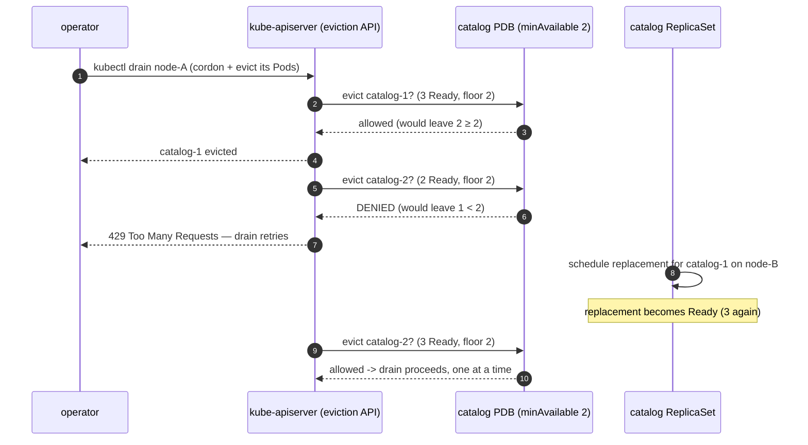

# 05 — Reliability and disruptions

> Voluntary vs involuntary disruptions, the **PodDisruptionBudget**
> (`policy/v1`, minAvailable/maxUnavailable, `disruptionsAllowed`, the
> eviction API vs deletion, `unhealthyPodEvictionPolicy`), multi-replica +
> anti-affinity/spread for HA (cross-ref Part 04), graceful shutdown +
> readiness gating (cross-ref Part 01), PodReadinessGates, and **SLI/SLO/error
> budgets** — applied by adding PDBs for storefront/catalog/orders and proving
> a node drain respects them.

**Estimated time:** ~15 min read · ~60 min hands-on
**Prerequisites:** [Part 04 ch.02](../04-scheduling/02-affinity-taints-topology.md) — anti-affinity / topology spread for HA · [Part 01 ch.02](../01-core-workloads/02-health-and-lifecycle.md) — readiness gating and graceful shutdown · [Part 06 ch.01](01-observability-metrics.md) — SLI/SLO measurement is what disruption budgets protect
**You'll know after this:** • distinguish voluntary from involuntary disruptions and what PDBs actually cover · • write `policy/v1` PodDisruptionBudgets with the right minAvailable / maxUnavailable · • explain how the eviction API differs from deletion and how `unhealthyPodEvictionPolicy` works · • define SLIs, SLOs and error budgets and tie them to alerting · • prove a `kubectl drain` of a Bookstore node respects the catalog PDB

<!-- tags: observability, slo, day-2, core-objects -->

## Why this exists

The Bookstore is observed ([ch.01–03](01-observability-metrics.md)) and
autoscaled ([ch.04](04-autoscaling.md)). But availability is not just "enough
replicas exist" — it is "enough replicas **stay Ready through the things that
take Pods away**". And Pods are taken away constantly in a healthy cluster:
every node OS patch, Kubernetes upgrade, autoscaler scale-down, and
`kubectl drain` evicts Pods **on purpose**. Without a guard, a routine
"upgrade the nodes one by one" can drain a node hosting *all three* catalog
replicas at once → catalog is briefly down during a **planned, routine**
operation. That is the most common self-inflicted outage in Kubernetes.

A **PodDisruptionBudget (PDB)** is the contract that says "you may take my
Pods, but never more than *this many* at once". It converts "all replicas
vanish during a node upgrade" into "rolling, one at a time, capacity
preserved". This chapter is the reliability half of *Production Kubernetes*'s
[Application Considerations](#further-reading), and the single-instance/HA
reasoning of the [Singleton Service](#further-reading) pattern.

## Mental model

Two kinds of disruption — the distinction drives everything:

- **Involuntary** — not initiated by anyone: node hardware/kernel crash, OOM
  kill, network partition, the node simply disappears. A PDB does **not**
  protect against these (nobody asked permission). Your defence is
  **replicas + spread/anti-affinity** (Part 04 ch.02 — already on catalog/
  storefront) so an involuntary loss removes *some* capacity, not all, plus
  good probes so traffic stops hitting the dead Pods.
- **Voluntary** — deliberately initiated through the API: `kubectl drain` for
  a node upgrade, cluster-autoscaler/Karpenter scale-down
  ([ch.04](04-autoscaling.md)), a `kubectl delete pod`, an eviction. These go
  through the **eviction API**, and **that** is what a PDB governs.

A PDB declares a floor (`minAvailable: N` or `minAvailable: 75%`) or a ceiling
(`maxUnavailable`) on **healthy Pods of a selector**. The **eviction API**
(used by `kubectl drain`) checks it: evicting a Pod is allowed only if the
workload would *stay at or above the floor*; otherwise the eviction is
**refused** and the drain **blocks and retries** until the controller has
rescheduled a replacement elsewhere and it is Ready. That backpressure is the
PDB working — it paces voluntary disruption to the rate the workload can
absorb without losing capacity.

Critically: a PDB does **not** move or recreate Pods. It only **gates
evictions**. The Deployment controller still does the rescheduling; the PDB
just refuses to let the drain get ahead of it.

Reliability is the **stack**, not one feature:

| Layer | Mechanism | Where |
|---|---|---|
| Don't lose all replicas at once (involuntary) | replicas + topology spread + anti-affinity | Part 04 ch.02 |
| Don't lose too many at once (voluntary) | **PodDisruptionBudget** | this chapter |
| Don't drop in-flight requests when a Pod goes | readiness gating + SIGTERM + preStop + grace | [Part 01 ch.02](../01-core-workloads/02-health-and-lifecycle.md) |
| Know if you're meeting the bar | SLI / SLO / error budget | this chapter + [ch.01](01-observability-metrics.md) |

## Diagrams

### `kubectl drain` blocked by a PDB (Mermaid, sequence)



### SLO / error budget (ASCII)

```
 SLI  = a measured ratio of good events     e.g. 1 - (5xx / total)   [ch.01 PromQL]
 SLO  = the target for that SLI             e.g. 99.9% over 30 days
 Error budget = 100% - SLO                  e.g. 0.1% = ~43m unavailable / 30d

 ┌──── 30-day error budget (0.1%) ────────────────────────────────┐
 │ spent ████████░░░░░░░░░░░░░░░░░░░░░░░░░░░░░░░░░░░░  remaining   │
 └────────────────────────────────────────────────────────────────┘
   budget left  -> you MAY take voluntary risk (drain, rollout, chaos)
   budget spent -> FREEZE risky changes, stabilise, raise reliability
   PDB minAvailable is sized so routine voluntary disruption fits the budget.
```

## Hands-on with the Bookstore

**Assumed working directory: the guide repo root (`full-guide/`).**

We will: (1) add PDBs for storefront/catalog/orders; (2) recreate a
**multi-node** kind cluster (so a drain has somewhere to reschedule); (3)
`kubectl drain` a node and watch the PDB pace it.

### 0. Prerequisites — a multi-node cluster (self-bootstrapping)

A single-node kind cluster cannot demonstrate a drain (no other node to
reschedule onto, and draining the only node evicts everything). Reuse the
**Part 04 ch.02** multi-node pattern. Save as `kind-multinode.yaml` (infra,
not a Bookstore manifest):

```yaml
# kind-multinode.yaml — 1 control-plane + 3 workers (same pattern as Part 04
# ch.02; the dedicated DB node/taint is omitted here — not needed for PDBs).
kind: Cluster
apiVersion: kind.x-k8s.io/v1alpha4
nodes:
  - role: control-plane
  - role: worker
  - role: worker
  - role: worker
```

```sh
kind delete cluster --name bookstore 2>/dev/null || true
kind create cluster --name bookstore --config kind-multinode.yaml
kubectl get nodes        # 1 control-plane + 3 workers

# Rebuild + load images, then the cumulative chain (ch.01 step 0 in full):
cd examples/bookstore/app
for s in catalog orders payments-worker storefront; do docker build -t bookstore/$s:dev ./$s; done
cd ../../..
for s in catalog orders payments-worker storefront; do kind load docker-image bookstore/$s:dev --name bookstore; done
kubectl apply -f examples/bookstore/raw-manifests/00-namespace.yaml
kubectl apply -f examples/bookstore/raw-manifests/05-serviceaccounts-rbac.yaml
kubectl apply -f examples/bookstore/raw-manifests/15-catalog-config.yaml
kubectl apply -f examples/bookstore/raw-manifests/16-db-credentials.yaml
kubectl apply -f examples/bookstore/raw-manifests/35-priorityclasses.yaml
kubectl apply -f examples/bookstore/raw-manifests/20-postgres-statefulset.yaml
kubectl rollout status statefulset/postgres -n bookstore
kubectl apply -f examples/bookstore/raw-manifests/10-catalog-deploy.yaml
kubectl apply -f examples/bookstore/raw-manifests/11-storefront-deploy.yaml
kubectl apply -f examples/bookstore/raw-manifests/14-orders-deploy.yaml
kubectl apply -f examples/bookstore/raw-manifests/40-services.yaml
kubectl apply -f examples/bookstore/raw-manifests/21-db-migrate-job.yaml   # schema
# catalog/orders carry DB_DSN; gate on the schema Job before asserting
# readiness (their /readyz pings Postgres but not table existence).
kubectl wait --for=condition=complete job/db-migrate -n bookstore --timeout=120s
kubectl rollout status deployment/catalog -n bookstore
```

(catalog's `topologySpreadConstraints` are `DoNotSchedule` — on this 3-worker
cluster the 3 replicas spread one-per-node, which is exactly what makes the
PDB demo meaningful: draining one node evicts exactly one catalog Pod.)

### 1. Add PodDisruptionBudgets

New file
[`examples/bookstore/raw-manifests/84-pdb.yaml`](../examples/bookstore/raw-manifests/84-pdb.yaml)
— **built-in** `policy/v1` (no CRD; dry-runs cleanly). One PDB per
front-line workload, `minAvailable` sized to the **real replica counts**:

```yaml
apiVersion: policy/v1
kind: PodDisruptionBudget
metadata: { name: catalog, namespace: bookstore }
spec:
  minAvailable: 2                    # of 3 catalog replicas (10-): ≤1 down at a time
  selector: { matchLabels: { app: catalog } }   # EXACT 10- pod-template label
  unhealthyPodEvictionPolicy: AlwaysAllow
---
apiVersion: policy/v1
kind: PodDisruptionBudget
metadata: { name: storefront, namespace: bookstore }
spec:
  minAvailable: 1                    # of 2 storefront replicas (11-): keep UI up
  selector: { matchLabels: { app: storefront } }
  unhealthyPodEvictionPolicy: AlwaysAllow
---
apiVersion: policy/v1
kind: PodDisruptionBudget
metadata: { name: orders, namespace: bookstore }
spec:
  minAvailable: 1                    # of 2 orders replicas (14-): ≤1 down
  selector: { matchLabels: { app: orders } }
  unhealthyPodEvictionPolicy: AlwaysAllow
```

> **Sizing & selector decisions (in the manifest header).** `minAvailable`
> matches each Deployment's replica count: catalog 3→2 (tolerate one node
> down), storefront 2→1, orders 2→1. The selectors are the **exact** pod
> labels of each Deployment's template (`app: catalog|storefront|orders`) — a
> PDB whose selector matches no Pods is silently useless; one matching
> *multiple* workloads is a classic mistake. **payments-worker gets no PDB on
> purpose**: it is KEDA-scaled and may legitimately be at **0** replicas
> ([ch.04](04-autoscaling.md)), so a `minAvailable` PDB would be meaningless
> and could even wedge a drain — autoscaled/scale-to-zero consumers are the
> documented exception. `unhealthyPodEvictionPolicy: AlwaysAllow` (Beta, k8s
> 1.27+; ignored, not rejected, on older clusters) lets the eviction API
> remove **not-Ready** Pods even at the budget floor — without it, a budget
> at its limit *plus* a crashed Pod can **deadlock** a drain forever (the
> broken Pod can't be evicted, so the node never drains).

```sh
kubectl apply -f examples/bookstore/raw-manifests/84-pdb.yaml
kubectl get pdb -n bookstore
# NAME        MIN AVAILABLE   ALLOWED DISRUPTIONS   AGE
# catalog     2               1                     ...
# orders      1               1                     ...
# storefront  1               1                     ...
```

`ALLOWED DISRUPTIONS` is `.status.disruptionsAllowed` — the **live headroom**:
with 3 Ready catalog Pods and floor 2, exactly **1** may be evicted right now.

### 2. Drain a node and watch the PDB pace it

Pick a worker that runs a catalog Pod, then drain it:

```sh
NODE=$(kubectl get pod -n bookstore -l app=catalog \
  -o jsonpath='{.items[0].spec.nodeName}')
echo "draining $NODE"

# --ignore-daemonsets: DaemonSet Pods aren't drained (they're per-node).
# --delete-emptydir-data: our Pods use emptyDir scratch (Part 05); acknowledge it.
#   This discards ONLY ephemeral emptyDir scratch — the Bookstore stateless
#   tiers (catalog/storefront/orders) keep nothing there. It does NOT touch
#   PVC-backed data: a StatefulSet's PersistentVolume (e.g. postgres,
#   Part 01 ch.05) is bound to its PVC and survives the drain untouched. Do
#   not cargo-cult this flag onto a stateful drain expecting it to be safe;
#   it's safe HERE precisely because these workers are stateless.
kubectl drain "$NODE" --ignore-daemonsets --delete-emptydir-data
```

Watch in another shell:

```sh
watch kubectl get pods -n bookstore -o wide
```

You will see the eviction API evict the catalog Pod on `$NODE`, the Deployment
immediately schedule a replacement on another worker, and — because
`minAvailable: 2` — the drain **wait** for that replacement to become Ready
before it would evict any further catalog Pod. catalog never drops below 2
Ready. If you drain a *second* node before the first replacement is Ready, the
drain **blocks** with a PDB message rather than violating the budget — that is
the guarantee. Uncordon when done:

```sh
kubectl uncordon "$NODE"
```

> **Eviction vs `kubectl delete pod`.** A PDB only constrains the **eviction
> API** (what `drain` uses). `kubectl delete pod` is a *direct delete* and is
> **not** PDB-checked — it will remove the Pod regardless. So a PDB protects
> you from *orderly* operations (drain/upgrade/scale-down), not from someone
> force-deleting Pods. Node upgrades on managed clusters use the eviction API,
> so the PDB does its job there.

### 3. Connection draining recap (why the PDB alone isn't enough)

A PDB keeps *enough Pods Ready*; it does not stop the *evicted* Pod from
dropping its in-flight requests. That is the Part 01 ch.02 contract, still in
force on every Bookstore workload: on SIGTERM the Pod is removed from Service
endpoints (readiness), the native `preStop.sleep: 5` lets in-flight requests
finish and propagation settle, the Go process does a graceful
`srv.Shutdown(...)` within `terminationGracePeriodSeconds: 30`. PDB +
graceful shutdown together = a node upgrade with **no capacity loss and no
dropped connections**. See
[Part 01 ch.02](../01-core-workloads/02-health-and-lifecycle.md).

> **PodReadinessGates** extend "Ready" beyond the container probes: a Pod is
> Ready only when its probes pass **and** every custom condition in
> `spec.readinessGates` is `True` (a controller — e.g. a cloud load-balancer
> — sets it once the Pod is registered in the external LB). This closes the
> race where Kubernetes considers a Pod Ready but the external LB has not yet
> added it; relevant on managed clusters with LB-backed Services/Ingress.

## How it works under the hood

- **The eviction API is a guarded delete.** `POST .../pods/<P>/eviction`
  (what `kubectl drain` calls per Pod) runs the **disruption controller's**
  admission check: for every PDB whose selector matches the Pod, is
  `currentHealthy - 1 ≥ desiredHealthy`? If any says no, the API returns
  **429** and the Pod is *not* deleted; `drain` backs off and retries. A
  plain `DELETE` of the Pod skips this entirely — that asymmetry is by
  design (break-glass must always work).
- **`disruptionsAllowed` is computed continuously.** The controller tracks
  `currentHealthy` (Ready Pods matching the selector) and `desiredHealthy`
  (from `minAvailable`, or `replicas − maxUnavailable`); `status.disruptionsAllowed
  = max(0, currentHealthy − desiredHealthy)`. It decrements as evictions are
  admitted and recovers as replacements go Ready — which is precisely why a
  drain *paces itself* to the reschedule rate instead of evicting in a burst.
- **`minAvailable` vs `maxUnavailable`.** `minAvailable` is an absolute/%
  floor of healthy Pods; `maxUnavailable` is the inverse ceiling. Percentages
  are computed against the workload's `.spec.replicas` and **rounded up** for
  `minAvailable` (conservative — it favours availability). The Bookstore uses
  `minAvailable` so the floor is explicit and obvious from the manifest.
- **The unhealthy-Pod deadlock.** Default eviction policy
  (`IfHealthyBudget`) only counts evicting a *Ready* Pod against the budget,
  but also won't evict an *unready* Pod once the budget is exhausted — so a
  crashing Pod on a node you must drain can never be evicted and the drain
  **hangs indefinitely**. `unhealthyPodEvictionPolicy: AlwaysAllow` (Beta
  1.27+) permits evicting not-Ready Pods regardless of the budget, breaking
  the deadlock; it is the recommended setting for almost all PDBs (and is on
  every Bookstore PDB).
- **PDBs don't reschedule; controllers do.** The PDB is purely an
  *admission gate on eviction*. Recreating the Pod is the Deployment/
  ReplicaSet's job; the scheduler places it
  ([Part 04 ch.01](../04-scheduling/01-scheduler-and-nodes.md)). A PDB on a
  bare Pod with no controller is a trap: nothing ever recreates it, so once
  it's at the floor the node can never be drained.
- **SLOs drive the disruption budget.** An SLI is a PromQL ratio of good
  events ([ch.01](01-observability-metrics.md)); the SLO is its target; the
  **error budget** = `1 − SLO` is how much unavailability you may *spend*.
  Voluntary disruption (drains, rollouts, chaos) spends budget; you size
  `minAvailable` and schedule node upgrades so routine churn fits within it,
  and **freeze** risky change when the budget is exhausted. This is how
  reliability becomes a *decision rule*, not a vibe.

## Production notes

> **In production:** put a PDB on **every** multi-replica workload, sized so a
> **one-node** voluntary disruption is always allowed (so rolling node
> upgrades never stall) but a mass eviction is refused. `minAvailable: replicas-1` (or a % that rounds to that) is a sane default for stateless
> tiers; stateful/quorum systems need budgets tied to their quorum math
> ([Part 01 ch.05](../01-core-workloads/05-statefulsets.md)).

> **In production:** a PDB **without** enough replicas, spread, *and*
> `unhealthyPodEvictionPolicy: AlwaysAllow` causes the very outage it was
> meant to prevent — a stuck node drain during an upgrade window. Test it:
> `kubectl drain` a node in staging and confirm it completes and capacity
> holds. An untested PDB is a latent incident.

> **In production:** managed node upgrades **use the eviction API**, so PDBs
> directly shape them. **EKS** managed node groups, **GKE** node auto-upgrade
> /surge, **AKS** node image upgrades all evict Pods respecting PDBs — a
> too-strict PDB (e.g. `minAvailable` = `replicas`, leaving
> `disruptionsAllowed: 0`) **deadlocks the upgrade forever**; a missing PDB
> lets the upgrade nuke all replicas at once. There is a correct middle and
> you must set it.

> **In production:** combine PDB with **PodReadinessGates** behind cloud
> LBs/Ingress so "Ready" means "actually receiving traffic from the external
> LB", and with graceful shutdown ([Part 01 ch.02](../01-core-workloads/02-health-and-lifecycle.md))
> so evicted Pods drain connections. PDB preserves *count*; readiness +
> SIGTERM/preStop preserve *individual requests*. You need both for
> zero-impact node operations.

> **In production:** drive disruption decisions with the **error budget**.
> Burning the budget fast → freeze rollouts/chaos, stabilise; budget healthy
> → you have room for aggressive delivery and chaos testing of the disruption
> path ([Part 07 ch.05](../07-delivery/05-progressive-delivery.md)). The PDB
> is the *mechanism*; the SLO/error budget is the *policy* that sets it.

## Quick Reference

```sh
kubectl get pdb -n <NS>                              # MIN AVAILABLE / ALLOWED DISRUPTIONS
kubectl describe pdb <P> -n <NS>                     # status.disruptionsAllowed + events
kubectl drain <NODE> --ignore-daemonsets --delete-emptydir-data   # respects PDBs
kubectl uncordon <NODE>                              # undo the cordon
kubectl get pod -n <NS> -o wide                      # watch reschedule across nodes
kubectl get pod <P> -o jsonpath='{.status.conditions}'   # readiness gates included
```

Minimal PDB skeleton:

```yaml
apiVersion: policy/v1
kind: PodDisruptionBudget
metadata: { name: <WORKLOAD>, namespace: <NS> }
spec:
  minAvailable: 2                       # or maxUnavailable: 1 / a percentage
  selector: { matchLabels: { app: <WORKLOAD> } }   # EXACT pod-template labels
  unhealthyPodEvictionPolicy: AlwaysAllow           # avoid the drain deadlock
```

Checklist:

- [ ] Every multi-replica workload has a PDB; selector matches its **real** pod labels
- [ ] `minAvailable` allows a one-node drain but refuses a mass eviction
- [ ] `unhealthyPodEvictionPolicy: AlwaysAllow` set (no drain deadlock)
- [ ] Replicas + spread/anti-affinity cover **involuntary** loss (Part 04 ch.02)
- [ ] Graceful shutdown + readiness gating cover dropped connections (Part 01 ch.02)
- [ ] No PDB on bare Pods / scale-to-zero workloads (drain trap)
- [ ] An SLO + error budget sizes the budget and gates risky change

## Test your understanding

> Try each before opening the answer drawer. The act of trying is the exercise; the answer is the check.

1. **A node hard-crashes and takes 3 of catalog's 4 replicas with it. The PDB says `minAvailable: 3`. Does the PDB block this loss? Explain.**
   <details><summary>Show answer</summary>

   No — a PDB only governs **voluntary** disruptions through the eviction API (drain, autoscaler scale-down, `kubectl delete pod`). A node crash is **involuntary**: nobody asked permission, Pods simply vanished. The defence against involuntary loss is `replicas + topology spread + anti-affinity` (Part 04 ch.02) so a single node never holds all replicas. PDBs are necessary but not sufficient — they protect routine ops, not crashes. See §Mental model.

   </details>

2. **You set `minAvailable: 100%` on catalog (replicas=3) thinking "always keep all 3 healthy". The next node upgrade hangs forever. Why?**
   <details><summary>Show answer</summary>

   `minAvailable: 100%` means "no eviction may reduce ready Pods below 3". To drain a node holding a catalog Pod, the eviction must succeed — but evicting reduces ready count to 2, which violates the PDB → the eviction is refused → drain blocks. You've made the workload **un-drainable**, which means no node upgrade, no autoscale-down, no chaos test. The right value is `minAvailable: N-1` (or a percentage that allows one Pod to roll), letting the Deployment controller replace evicted Pods before the next eviction.

   </details>

3. **`unhealthyPodEvictionPolicy: AlwaysAllow` — why is it almost always the right setting, and what's the failure mode of the default?**
   <details><summary>Show answer</summary>

   The default (`IfHealthyBudget`) counts unhealthy Pods *against* the budget — if 2 of 3 catalog replicas are CrashLoopBackOff and `minAvailable: 2`, the PDB has 0 disruptions allowed (1 ready ≤ 2 floor), so even a `kubectl drain` to evict a broken Pod is refused. This is the "drain deadlock": broken Pods cannot be drained for replacement because they're broken. `AlwaysAllow` says "evict unhealthy Pods freely; only count healthy ones against the budget", which is the operationally correct policy in almost every case.

   </details>

4. **Hands-on extension — prove the PDB. Apply a PDB with `minAvailable: 2` on catalog (replicas=3). Now run `kubectl drain <node>` for the node hosting two catalog Pods. What do you observe in the drain output and `kubectl describe pdb`?**
   <details><summary>What you should see</summary>

   The drain *blocks* on the second eviction with `Cannot evict pod as it would violate the pod's disruption budget`. `kubectl describe pdb catalog` shows `disruptionsAllowed: 0` after the first eviction succeeds; once the Deployment controller schedules a replacement elsewhere and it becomes Ready, `disruptionsAllowed` returns to 1 and the drain proceeds. That backpressure is the PDB working as designed — paced eviction, not blocked eviction.

   </details>

5. **What's the difference between an SLI, an SLO, and an error budget, and how do they relate to PDB sizing?**
   <details><summary>Show answer</summary>

   **SLI** = the measurement (e.g. `1 - rate(5xx)/rate(total)` = success rate). **SLO** = the target on the SLI (e.g. 99.9% success over 30 days). **Error budget** = `1 - SLO` translated into allowed downtime/errors (99.9% over 30d = ~43 min/month). PDBs *size* the disruption: a workload with a tight SLO needs a conservative PDB (`maxUnavailable: 1`, multi-replica + spread); a stateless service with a loose SLO can absorb broader voluntary disruption. The error budget burns rate is the *policy*; the PDB is the *mechanism*. See §In production.

   </details>

## Further reading

- **Rosso et al., _Production Kubernetes_, ch.14 — Application
  Considerations** (designing apps to survive disruption: PDBs, graceful
  termination, readiness, SLOs in a production platform).
- **Ibryam & Huß, _Kubernetes Patterns_ 2e — *Singleton Service* (ch.10)**
  for the single-instance vs HA reasoning behind disruption budgets and
  availability targets.
- Official:
  <https://kubernetes.io/docs/concepts/workloads/pods/disruptions/> and
  <https://kubernetes.io/docs/tasks/run-application/configure-pdb/> and the
  drain/eviction reference
  <https://kubernetes.io/docs/tasks/administer-cluster/safely-drain-node/>.
