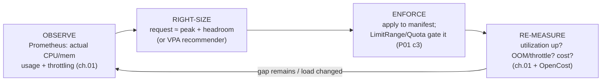

# 06 — Capacity and cost

> Turning observed usage into right-sized requests/limits (over-request →
> wasted spend vs under-request → eviction/OOM; the CPU-limit throttling
> debate revisited), the **VPA recommender** as a sizing tool,
> ResourceQuota/LimitRange as guardrails (cross-ref Part 01 ch.03),
> bin-packing/overcommit, the requests-vs-usage gap, cluster cost visibility
> (OpenCost/Kubecost), node/spot strategy, and the **FinOps loop** — applied
> by deriving right-sized catalog requests from the metrics gathered in
> [ch.01](01-observability-metrics.md).

**Estimated time:** ~15 min read · ~60 min hands-on
**Prerequisites:** [Part 01 ch.03](../01-core-workloads/03-resources-and-qos.md) — requests reserve, limits cap, QoS decides eviction · [Part 06 ch.01](01-observability-metrics.md) — usage data drives right-sizing · [Part 06 ch.04](04-autoscaling.md) — autoscalers act on requests, not usage
**You'll know after this:** • turn observed usage into right-sized requests/limits without over- or under-provisioning · • use the VPA recommender as a sizing tool without enabling auto-updates · • configure ResourceQuota and LimitRange as namespace guardrails · • read cluster cost with OpenCost / Kubecost and attribute spend per namespace · • run the FinOps loop on the Bookstore: measure → right-size → save → re-measure

<!-- tags: cost, finops, autoscaling, day-2 -->

## Why this exists

Every chapter so far set requests/limits by **reasoned guess** — catalog
`cpu: 50m / memory: 64Mi` requests because "a tiny Go API is light"
([Part 01 ch.03](../01-core-workloads/03-resources-and-qos.md)). Guesses are
where the money leaks. The scheduler reserves **requests**, not usage
([Part 01 ch.03](../01-core-workloads/03-resources-and-qos.md)), and on
EKS/GKE/AKS the cluster autoscaler provisions **nodes to satisfy requests**
([ch.04](04-autoscaling.md)). So:

- **Over-request** → the scheduler reserves capacity nothing uses → low real
  utilization → you pay for nodes running mostly air. This is the dominant
  Kubernetes cost failure in practice.
- **Under-request** → Pods packed too tight → CPU **throttling** and memory
  **OOMKills** under load → evictions, latency, incidents
  ([Part 01 ch.03](../01-core-workloads/03-resources-and-qos.md)).

Now that the Bookstore is **observed**, you can replace guesses with
*evidence*: measure actual usage in Prometheus ([ch.01](01-observability-metrics.md)),
set requests just above the real peak + headroom, and re-measure. That loop —
**observe → right-size → enforce → re-measure** — is FinOps for Kubernetes,
the cost lens on *Production Kubernetes*'s [Autoscaling](#further-reading) and
[Multitenancy](#further-reading) chapters.

## Mental model

Three numbers per container, often wildly misaligned:

- **request** — what the scheduler reserves and the bill is (indirectly)
  based on.
- **usage** — what the container actually consumes (from metrics-server /
  Prometheus, [ch.01](01-observability-metrics.md)).
- **limit** — the ceiling (CPU → throttle, memory → OOMKill;
  [Part 01 ch.03](../01-core-workloads/03-resources-and-qos.md)).

The **requests-vs-usage gap** is the waste (or the risk). Right-sizing closes
it deliberately:

- **Memory**: set `request` ≈ steady RSS + safety margin, and (for anything
  you can't tolerate OOMKilled) `limit == request` (Guaranteed-style — memory
  is incompressible). Too low → OOMKill; too high → reserved RAM nobody uses.
- **CPU**: set `request` ≈ a realistic busy-time average (the scheduling
  guarantee). The **CPU-limit debate** (revisited from
  [Part 01 ch.03](../01-core-workloads/03-resources-and-qos.md)): a tight CPU
  *limit* causes CFS throttling that shows up as mysterious p99 latency even
  at low average CPU. Common production stance: accurate CPU **requests**,
  memory `request==limit`, CPU **limit** generous or omitted — and *measure
  throttling before tightening*.

The data is already in Prometheus. **VPA in recommendation mode** automates
the same arithmetic (a percentile of historical usage → suggested requests),
and **ResourceQuota/LimitRange** ([Part 01 ch.03](../01-core-workloads/03-resources-and-qos.md),
already on the `bookstore` namespace) are the guardrails that stop a bad value
from being deployed at all.

A cluster-economics framing on top:

- **Bin-packing / overcommit**: the scheduler packs Pods by request; setting
  *limits > requests* deliberately oversubscribes nodes (Burstable —
  efficient if usage is spiky and uncorrelated; risky if everyone peaks
  together). Utilization = Σ usage ÷ node allocatable; the goal is "high
  utilization without saturation".
- **Cost visibility**: **OpenCost** (the CNCF standard; Kubecost is the
  commercial superset) joins node/cloud prices to per-namespace/workload
  *requests and usage* so "what does the orders tier cost, and how much of
  that is waste?" is answerable.
- **Node/spot strategy**: right requests + a node autoscaler + **spot/
  preemptible** nodes for fault-tolerant tiers is where the largest savings
  are — but it is downstream of getting requests right.

## Diagrams

### The right-size feedback loop (Mermaid)



### Utilization vs cost / requests-vs-usage (ASCII)

```
 ONE CONTAINER (catalog), CPU
   0 ─ usage(p95 busy) ─── request ──────────────── limit ─────►
        e.g. 35m            e.g. 50m  <-- 15m reserved-but-idle = waste
        (good: request just above p95 busy; small headroom; generous limit)

 NODE-LEVEL
   Allocatable │■ used ■│░ requested-not-used ░│   free   │
               └────────┴──────────────────────┴──────────┘
     waste = the ░ band  (you pay for the node; the scheduler reserved ░;
                           nothing runs there because requests > usage)
   too-low requests = ■ overflows the node -> throttle / OOM / eviction
   GOAL: shrink ░ without letting ■ hit the ceiling (utilization, not saturation)

 FinOps loop:  observe ──► right-size ──► enforce (Quota/LimitRange) ──► re-measure ─┐
                 ▲                                                                    │
                 └────────────────────────────────────────────────────────────────┘
```

## Hands-on with the Bookstore

**Assumed working directory: the guide repo root (`full-guide/`).**

We will: (1) measure catalog's **actual** CPU/memory in Prometheus under load;
(2) derive a right-sized requests/limits block; (3) present it as a documented
recommendation (and confirm the LimitRange/Quota would accept it); (4) install
the VPA recommender to cross-check; (5) note cluster cost visibility.

### 0. Prerequisites (self-bootstrapping)

Bring up the cluster + Bookstore **with metrics-server and
kube-prometheus-stack** exactly as in [ch.01](01-observability-metrics.md)
(steps 0–3, including the catalog `ServiceMonitor` so the series exist).
Right-sizing requires the [ch.01](01-observability-metrics.md) metrics plane —
it is the input to everything below.

### 1. Measure catalog's real usage

Generate sustained load (restricted-compliant public-image generator, same
pattern as [ch.04](04-autoscaling.md)):

```sh
kubectl run hey -n bookstore --rm -it --restart=Never \
  --image=ghcr.io/rakyll/hey:0.1.4 \
  --overrides='{"spec":{"securityContext":{"runAsNonRoot":true,"runAsUser":65532,"seccompProfile":{"type":"RuntimeDefault"}},"containers":[{"name":"hey","image":"ghcr.io/rakyll/hey:0.1.4","args":["-z","3m","-c","40","http://catalog.bookstore.svc.cluster.local/books"],"securityContext":{"allowPrivilegeEscalation":false,"capabilities":{"drop":["ALL"]},"readOnlyRootFilesystem":true}}]}}'
```

Then query the **actual** usage (Prometheus UI / Grafana — kube-state-metrics
and cAdvisor series ship with the [ch.01](01-observability-metrics.md) stack):

```promql
# Actual CPU per catalog pod (cores), p95 over the load window:
quantile_over_time(0.95,
  sum by (pod) (rate(container_cpu_usage_seconds_total{namespace="bookstore",pod=~"catalog-.*",container="catalog"}[2m]))[10m:])

# Actual working-set memory per catalog pod (bytes), max over the window:
max_over_time(
  sum by (pod) (container_memory_working_set_bytes{namespace="bookstore",pod=~"catalog-.*",container="catalog"})[10m:])

# CPU throttling — is the CURRENT cpu LIMIT (250m) already throttling it?
sum(rate(container_cpu_cfs_throttled_periods_total{namespace="bookstore",container="catalog"}[5m]))
  / sum(rate(container_cpu_cfs_periods_total{namespace="bookstore",container="catalog"}[5m]))

# Requests-vs-usage gap (the waste), CPU:
sum(kube_pod_container_resource_requests{namespace="bookstore",container="catalog",resource="cpu"})
  - sum(rate(container_cpu_usage_seconds_total{namespace="bookstore",container="catalog"}[5m]))
```

Suppose the load window shows catalog p95 CPU ≈ **35m**/pod, peak working-set
memory ≈ **40Mi**/pod, and the throttle ratio is **> 0** (the current `cpu:
250m` limit *is* clipping it under load). The current block is `requests {cpu:
50m, memory: 64Mi} / limits {cpu: 250m, memory: 128Mi}`
([`10-catalog-deploy.yaml`](../examples/bookstore/raw-manifests/10-catalog-deploy.yaml)):
CPU request is ~1.4× the real p95 (mild over-reservation across 3 replicas),
and the CPU *limit* is causing throttling — the
[Part 01 ch.03](../01-core-workloads/03-resources-and-qos.md) CPU-limit debate,
now with data.

### 2. The right-sized recommendation (before → after)

Derived from the measurements above:

```yaml
# CURRENT (10-catalog-deploy.yaml — a reasoned guess from Part 01 ch.03)
resources:
  requests: { cpu: 50m,  memory: 64Mi }
  limits:   { cpu: 250m, memory: 128Mi }

# RECOMMENDED (evidence-based, from §1):
resources:
  requests:
    cpu: 40m         # ≈ p95 busy (35m) + small headroom; was 50m -> tighter
    memory: 96Mi     # ≈ peak working set (40Mi) + generous safety margin
  limits:
    memory: 96Mi     # == request: memory is incompressible (no OOM surprise)
    # NOTE: CPU limit intentionally REMOVED. §1 showed the 250m limit throttles
    # catalog under load while average CPU is low — the classic CFS-throttling
    # p99 tax (Part 01 ch.03). Accurate CPU *request* (40m) keeps the
    # scheduling guarantee; dropping the CPU *limit* lets it burst on a quiet
    # node instead of being clipped. (HPA on CPU utilisation, ch.04, still
    # works — utilisation is vs the *request*, which remains set.)
```

> **Decision — documented recommendation, manifest unchanged.** I am
> presenting this as a **documented patch, not editing
> [`10-catalog-deploy.yaml`](../examples/bookstore/raw-manifests/10-catalog-deploy.yaml)**.
> Reason: the cumulative manifest carries a precisely-tuned restricted
> securityContext + scheduling layer + the byte-identical `DB_DSN` shared with
> [`14-orders-deploy.yaml`](../examples/bookstore/raw-manifests/14-orders-deploy.yaml);
> the *teaching point here is the method* (derive requests from measured
> usage), which a worked recommendation conveys without mutating a file other
> chapters depend on. To apply it for real you would patch only the
> `resources:` block — every other field stays exactly as
> [Part 05 ch.02](../05-security/02-pod-security.md) hardened it:
>
> ```sh
> # Illustrative — applies ONLY the resources block, nothing else changes:
> kubectl -n bookstore patch deployment catalog --type=json -p='[
>   {"op":"replace","path":"/spec/template/spec/containers/0/resources",
>    "value":{"requests":{"cpu":"40m","memory":"96Mi"},
>             "limits":{"memory":"96Mi"}}}]'
> ```

Confirm the namespace guardrails accept it (they must — this is what
ResourceQuota/LimitRange are *for*,
[Part 01 ch.03](../01-core-workloads/03-resources-and-qos.md)):
`00-namespace.yaml`'s LimitRange `min {cpu: 10m, memory: 16Mi}` / `max {cpu:
"2", memory: 1Gi}` → `40m`/`96Mi` is comfortably inside; the ResourceQuota
totals (`requests.cpu: 2`, `requests.memory: 2Gi`) only **shrink** with lower
requests. A right-size that *violated* the LimitRange would be rejected at
admission — the guardrail catching a bad value before it ships.

### 3. Cross-check with the VPA recommender

The VPA in **recommendation mode** computes the same thing automatically (a
percentile model over usage history) — the honest way to size at scale rather
than hand-running PromQL per workload:

Install the VPA via Helm into its own namespace (Helm, consistent with every
other Phase-6 add-on — no cloned repo left lying around; the upstream
`autoscaler` repo's `hack/vpa-up.sh` is the alternative "official script"
path, but if you use it, pin it: `git clone --depth=1 --branch
vertical-pod-autoscaler-1.2.1 https://github.com/kubernetes/autoscaler.git`):

```sh
helm repo add fairwinds-stable https://charts.fairwinds.com/stable
helm repo update
helm install vpa fairwinds-stable/vpa \
  --namespace vpa --create-namespace \
  --set recommender.enabled=true \
  --set updater.enabled=false \
  --set admissionController.enabled=false \
  --wait                       # recommender ONLY: no updater/admission =
                               # it can never evict/mutate Pods (safe w/ HPA)
```

A recommendation-only VPA for catalog (`updateMode: "Off"` → it **only
suggests**, never mutates Pods — safe alongside the
[ch.04](04-autoscaling.md) HPA, which is the **only** supported HPA+VPA
combination since both would otherwise fight CPU):

```yaml
apiVersion: autoscaling.k8s.io/v1
kind: VerticalPodAutoscaler
metadata: { name: catalog, namespace: bookstore }
spec:
  targetRef: { apiVersion: apps/v1, kind: Deployment, name: catalog }
  updatePolicy: { updateMode: "Off" }     # RECOMMEND ONLY — does not evict/resize
```

> **VPA is a CRD-backed add-on — the [ch.01](01-observability-metrics.md)/
> [ch.04](04-autoscaling.md) dry-run note applies.** `VerticalPodAutoscaler`
> (`autoscaling.k8s.io`) is **not** built-in; a client dry-run without the
> VPA installed prints `no matches for kind "VerticalPodAutoscaler"` —
> expected, exactly like the Gateway API / KEDA / Kyverno objects elsewhere.
> It is shown here as a sizing tool, not added to `raw-manifests/` (the
> Bookstore's autoscaling artifacts are the HPA `82-` and KEDA `83-`).

```sh
kubectl describe vpa catalog -n bookstore
# Recommendation -> Target: cpu/memory it suggests from observed history —
# compare to the §2 hand-derived values; they should be in the same ballpark.
```

`updateMode: "Off"` is the critical setting: it makes VPA a **report**, not an
actuator, so it never conflicts with the HPA ([ch.04](04-autoscaling.md)) and
never surprise-evicts catalog. Read it, decide, patch the manifest yourself.

### 4. Cluster cost visibility (conceptual)

Per-workload **cost** = price of the resources its requests reserve (+ a share
of usage). **OpenCost** (CNCF) installs in its own namespace and exposes this:

```sh
# Conceptual — OpenCost in its own namespace, joined to your cloud price list:
helm repo add opencost https://opencost.github.io/opencost-helm-chart
helm install opencost opencost/opencost --namespace opencost --create-namespace
# UI/allocation API then shows $ per namespace/workload + the "efficiency"
# (usage / request) — the requests-vs-usage gap from §1, priced.
```

On a local kind cluster the dollar figures are synthetic (no cloud bill), so
this step is conceptual; the **efficiency** ratio (usage ÷ request) it
surfaces is the exact waste signal you right-size against, and is real on a
managed cluster.

## How it works under the hood

- **Requests are the cost lever, not usage.** The scheduler's
  `NodeResourcesFit` admits a Pod only if `Σ requests ≤ node Allocatable`
  ([Part 01 ch.03](../01-core-workloads/03-resources-and-qos.md)) — it
  *never* looks at live usage. So a cluster's node count (hence cloud bill,
  via the autoscaler [ch.04](04-autoscaling.md)) is driven by the **sum of
  requests**. Over-requesting inflates the bill even at 0% CPU; this is why
  right-sizing requests is the single highest-leverage cost action.
- **The VPA recommender's model.** It ingests usage history (metrics-server
  +, optionally, a Prometheus backfill), maintains a decaying histogram per
  container, and emits `target` (≈ a high percentile of CPU/memory),
  `lowerBound`, `upperBound`. In `Off` it only writes these to the VPA
  status; in `Auto`/`Recreate` the updater evicts out-of-bounds Pods and the
  admission webhook rewrites requests on recreation (the classic VPA
  restart-to-resize; in-place Pod resize is maturing but not the default).
- **Why throttling appears at low average CPU.** A CPU *limit* is a CFS
  quota per ~100ms period; a bursty handler can exhaust the quota *within* a
  period and be descheduled until the next one — p99 latency spikes while the
  *average* over a minute looks idle
  ([Part 01 ch.03](../01-core-workloads/03-resources-and-qos.md)).
  `container_cpu_cfs_throttled_periods_total / ..._periods_total` is the
  ground truth; a non-zero ratio at low utilization is the canonical "remove/
  raise the CPU limit" signal — exactly what §1 found for catalog.
- **Quota & LimitRange are the enforcement points.** `LimitRange` is a
  *mutating + validating* admission step (injects defaults, rejects out of
  `min/max`); `ResourceQuota` is a *validating* step (rejects if namespace
  request/limit totals exceed `hard`) — both from
  [Part 01 ch.03](../01-core-workloads/03-resources-and-qos.md). They are
  why a right-sizing change is *safe to roll out*: a fat-fingered request is
  refused at the API server, not discovered when the node OOMs.
- **Bin-packing & overcommit economics.** Utilization = Σ usage ÷ Σ
  allocatable. Setting `limits > requests` (Burstable) overcommits a node on
  purpose — cheap when workloads' peaks are uncorrelated, dangerous when they
  align (correlated spikes → node saturation → eviction by QoS order,
  [Part 01 ch.03](../01-core-workloads/03-resources-and-qos.md)). The FinOps
  goal is the highest utilization that still leaves headroom for the
  *correlated* peak, then absorbing the rest with the
  HPA/KEDA + node autoscaler ([ch.04](04-autoscaling.md)).
- **OpenCost's allocation math.** It periodically reads each Pod's
  requests/usage (from the metrics pipeline) and node prices (cloud billing
  API, or a static price sheet), and allocates cost to namespace/workload/
  label by the resource it reserved — turning the abstract requests-vs-usage
  gap into a currency number a team owns. The model is provider-neutral; only
  the price source differs by cloud.

## Production notes

> **In production:** right-size from **measured data on every workload**, not
> guesses or copy-paste. Memory: `request` ≈ steady RSS + margin, and
> `limit == request` for anything that must not OOM. CPU: `request` ≈
> realistic busy average; treat CPU **limits** with suspicion (measure
> throttling first — [Part 01 ch.03](../01-core-workloads/03-resources-and-qos.md)).
> The Bookstore's catalog recommendation above is exactly this method
> applied to real numbers.

> **In production:** use **VPA recommendation mode** (or an equivalent
> right-sizing tool) as the steady input, and **never** run VPA in `Auto` on
> the same CPU/memory metric an HPA scales on — they oscillate
> ([ch.04](04-autoscaling.md)). VPA *recommends*, HPA *scales out*, you
> *decide*: that division is the only stable one by default.

> **In production:** put a **ResourceQuota + LimitRange on every tenant
> namespace** (the `bookstore` namespace already has them — Part 01 ch.03 /
> [Part 08 ch.04](../08-day-2-operations/04-multi-tenancy-and-namespaces.md)).
> They cap blast radius *and* cost: no team can over-request the cluster into
> a bigger autoscaler bill, and nothing ships as accidental BestEffort.

> **In production:** make cost **visible and owned**. **OpenCost**/Kubecost
> (or **EKS** split-cost allocation + Cost Explorer, **GKE** cost allocation
> / GKE usage metering, **AKS** Cost Analysis) attributes spend per
> namespace/team and surfaces the efficiency (usage ÷ request) gap. Cost you
> can't attribute is cost nobody reduces.

> **In production:** after requests are right, the big wins are **node
> strategy**: a node autoscaler (Cluster Autoscaler / Karpenter,
> [ch.04](04-autoscaling.md)) sized to real requests, **spot/preemptible**
> nodes for fault-tolerant tiers (protected by PDBs + spread —
> [ch.05](05-reliability-and-disruptions.md)), and right-sized instance
> types (Karpenter picks these JIT). Spot-izing the Bookstore's stateless
> tiers (catalog/storefront/orders) is safe with their existing PDBs/spread;
> the data tier ([Part 01 ch.05](../01-core-workloads/05-statefulsets.md)) is
> not. Sequence matters: fix requests *first*, then nodes — cheap nodes
> running over-requested Pods are still wasted.

> **In production:** run the **FinOps loop continuously**, not once.
> Usage drifts with releases and traffic; a right-size is valid until the
> next deploy. Wire the [ch.01](01-observability-metrics.md) efficiency
> queries / VPA recommendations into a recurring review and re-apply — cost
> optimisation is a loop (observe → right-size → enforce → re-measure), the
> same shape as every other control loop in this guide.

## Quick Reference

```sh
kubectl top pods -n <NS>                                   # quick usage vs intuition
kubectl describe resourcequota -n <NS>                     # Used vs Hard (Part 01 ch.03)
kubectl describe limitrange   -n <NS>                      # min/max/defaults guardrails
kubectl describe vpa <W> -n <NS>                           # Recommendation -> Target
kubectl -n <NS> patch deployment <D> --type=json \
  -p='[{"op":"replace","path":"/spec/template/spec/containers/0/resources","value":{...}}]'
```

```promql
# usage vs request (the priced waste, per workload):
sum(rate(container_cpu_usage_seconds_total{namespace="ns",container="c"}[5m]))
  / sum(kube_pod_container_resource_requests{namespace="ns",container="c",resource="cpu"})
# is a CPU LIMIT throttling it? (>0 at low util = remove/raise the limit)
sum(rate(container_cpu_cfs_throttled_periods_total{container="c"}[5m]))
  / sum(rate(container_cpu_cfs_periods_total{container="c"}[5m]))
```

Right-size recipe (per container):

```
1. OBSERVE   p95 busy CPU + peak working-set memory + CFS throttle ratio (ch.01)
2. SET       cpu.request ≈ p95 busy + headroom ; mem.request ≈ peak + margin
             mem.limit == mem.request ; cpu.limit generous/omitted (measure first)
3. ENFORCE   LimitRange/ResourceQuota admit it (Part 01 ch.03) -> apply
4. RE-MEASURE utilization up? OOM/throttle gone? cost down? -> loop
```

Checklist:

- [ ] Requests derived from **measured** p95/peak usage, not guessed
- [ ] Memory `request==limit` for must-not-OOM; CPU limit throttling measured
- [ ] VPA in **recommendation** mode used as input; never `Auto` with HPA on same metric
- [ ] Namespace has ResourceQuota + LimitRange (guardrails enforce the change)
- [ ] Cost attributed per namespace/workload (OpenCost/Kubecost/cloud)
- [ ] Node strategy (autoscaler + spot for stateless) applied **after** requests fixed
- [ ] Right-sizing run as a recurring loop, re-validated after releases

## Test your understanding

> Try each before opening the answer drawer. The act of trying is the exercise; the answer is the check.

1. **A team reports the bill is too high. They want to lower CPU `limits` to cut cost. Why won't that help, and what actually drives the bill?**
   <details><summary>Show answer</summary>

   The cluster autoscaler / Karpenter provisions nodes to satisfy **requests**, not limits. Lowering limits changes only the *ceiling* (throttling threshold) — it doesn't free a single CPU on a single node. The bill is driven by **requests** (or by usage × reserved capacity if you're on spot/right-sized fleets). Right-size **requests** to observed usage; that shrinks the bin-packing footprint and lets the autoscaler delete underused nodes. See §Mental model.

   </details>

2. **Catalog is right-sized to `cpu: 100m` request based on p95 usage. But at 14:00 every Tuesday, traffic doubles and p99 latency spikes — CFS throttle ratio shows 30%. What's wrong with the right-sizing and what would you change?**
   <details><summary>Show answer</summary>

   You sized for the **average busy period**, not the **peak**. CFS throttling at 30% means the container is hitting its CPU `limit` (or, less commonly, getting starved at request). Either raise the **limit** generously (CPU is compressible — throttle hurts latency more than over-allocation hurts cost), or — better — let HPA add replicas for the spike (`maxReplicas` headroom) so per-Pod CPU stays in its sized band. Sizing without measuring spike behaviour and CFS throttle is half-done.

   </details>

3. **Why does the chapter recommend `memory: request == limit` but is more relaxed about CPU?**
   <details><summary>Show answer</summary>

   Memory is **incompressible** — exceeding the limit triggers an OOMKill (process dies, BestEffort/Burstable evicted under pressure). Memory you need *must* be reserved. CPU is **compressible** — exceeding the limit throttles (slows the process); the process still runs. So memory needs request==limit for QoS Guaranteed (no eviction); CPU can have a higher limit than request (Burstable) to absorb spikes without paying for unused capacity. See §Mental model / Memory vs CPU.

   </details>

4. **Hands-on extension — see the gap. With `kubectl top pods -n bookstore` and the PromQL from §Quick Reference, compute `usage / request` for catalog over an hour. What does a value of 0.15 (15% utilization of requested CPU) mean operationally?**
   <details><summary>What you should see</summary>

   You're paying for 85% reserved-but-unused CPU on every catalog replica × every node × every hour. Multiplied by every workload in the cluster, that's the typical "Kubernetes is expensive" report — not because Kubernetes is expensive, but because requests were guesses. The right-size move: drop catalog's `cpu.request` to ~p95 busy + 20% headroom (probably 50-100m for the tiny Go service) and re-measure. Often this halves the node footprint without touching anything else.

   </details>

5. **A team adds VPA in `Auto` mode to every workload "to right-size automatically". A week later, an HPA on the same Deployments is broken. What's the rule, and what's the correct workflow?**
   <details><summary>Show answer</summary>

   Don't run VPA `Auto` and HPA on the **same** resource metric (the conflict from [ch.04](04-autoscaling.md)). Use VPA in **recommender mode** as a *sizing tool*: it emits `Recommendation.target` values into the status; humans review and apply them as PR-reviewed manifest changes. HPA continues to manage replicas on its chosen metric. The right-sizing loop is `observe → right-size (VPA recommend / manual) → enforce → re-measure` — VPA helps with step 2, never step 3 in production.

   </details>

## Further reading

- **Rosso et al., _Production Kubernetes_, ch.13 — Autoscaling** (right-
  sizing, the requests-vs-usage gap, VPA as a platform capability) **and
  ch.12 — Multitenancy** (quota/limits as the cost+isolation guardrail).
- **Ibryam & Huß, _Kubernetes Patterns_ 2e — *Predictable Demands* (ch.2)**
  — declaring accurate resource needs as the foundation of density, cost,
  and reliability (the through-line from [Part 01 ch.03](../01-core-workloads/03-resources-and-qos.md)).
- Official:
  <https://kubernetes.io/docs/concepts/configuration/manage-resources-containers/>,
  the VPA project
  <https://github.com/kubernetes/autoscaler/tree/master/vertical-pod-autoscaler>,
  and OpenCost <https://www.opencost.io/docs/>.
