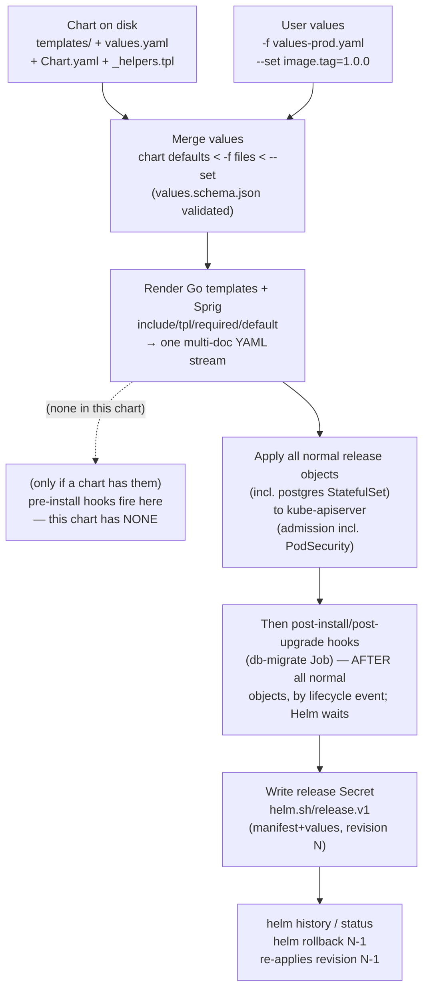

# 01 — Packaging with Helm

> Why a raw `kubectl apply -f` directory does not scale to multiple
> environments and release lifecycles; **Helm 3** architecture (no Tiller; the
> release stored in an in-cluster Secret; revisions/history/rollback); chart
> anatomy (`Chart.yaml`, `values.yaml`, `templates/`, `_helpers.tpl`,
> `NOTES.txt`, `charts/`, `crds/`); Go templating + Sprig +
> `include`/`tpl`/`required`/`default`/`toYaml`; values precedence &
> `values.schema.json`; hooks and the migration-Job-as-hook pattern; library
> vs application charts and dependency management — applied by packaging the
> **entire** cumulative Bookstore (Parts 00–06) as one real chart that stays
> byte-faithful to `raw-manifests/`, restricted-PSA and all.

**Estimated time:** ~30 min read · ~90 min hands-on
**Prerequisites:** [Part 00 ch.06](../00-foundations/06-declarative-api-model.md) — the declarative manifests Helm renders · [Part 03 ch.01](../03-config-and-storage/01-configmaps.md) — values as the input layer over manifests · [Part 05 ch.02](../05-security/02-pod-security.md) — `restricted` PSA invariants Helm must preserve
**You'll know after this:** • explain Helm 3 (no Tiller; releases stored as in-cluster Secrets) and revision/rollback semantics · • lay out a chart with `Chart.yaml`, `values.yaml`, `templates/`, `_helpers.tpl` and `NOTES.txt` · • write Go templating with Sprig, `include`, `tpl`, `required`, `default` and `toYaml` · • use Helm hooks for the migration-Job pattern and decide library vs application charts · • render the 49-object Bookstore as a byte-faithful Helm chart with values per environment

<!-- tags: helm, platform-engineering, gitops, ci-cd -->

## Why this exists

By the end of Part 06 the Bookstore is **~29 raw manifests** in
[`examples/bookstore/raw-manifests/`](../examples/bookstore/raw-manifests/),
applied with an ordered pile of `kubectl apply -f` commands. That worked while
we were *teaching* one primitive per chapter. It does not survive contact with
**delivery**, where four pressures appear at once:

1. **Many environments, one app.** dev wants 1 replica and debug logging;
   staging wants prod's shape at half scale; prod wants 4 replicas, real
   registry images, and the demo Secret *gone*. With raw YAML you either keep
   N copies of every file (they drift within a week) or hand-`sed` them (the
   "templating with `sed`" anti-pattern — quoting bugs, no validation, no
   record of what you actually applied).
2. **A release is a unit, not 29 files.** "Roll the whole app back to what we
   ran before the 14:00 deploy" has no answer when the truth is "whatever
   sequence of `kubectl apply` someone ran". You need an atomic, versioned,
   *named* release with history.
3. **Ordering and lifecycle.** The schema migration must run **after** Postgres
   exists, **every** deploy, idempotently. `kubectl apply -f .` has no
   "do this, wait, then that" — we faked it with manual `kubectl wait`.
4. **Discoverability.** "What can I tune without editing manifests?" has no
   answer in raw YAML. A consumer must read every file.

**Helm** is the package manager that addresses all four: a **chart** is a
parameterised, versioned bundle; `helm install` renders it with your
**values** and records the result as a **release** with **revisions** you can
`helm history`/`helm rollback`; **hooks** give lifecycle ordering; `values.yaml`
+ `values.schema.json` are the documented, validated tuning surface. This
chapter packages the *exact same Bookstore* — every restricted
`securityContext`, the Part 04 scheduling layer, the byte-identical
`catalog`/`orders` `DB_DSN`, the PSA-`restricted` namespace — as
[`examples/bookstore/helm/bookstore/`](../examples/bookstore/helm/bookstore/),
and proves the rendered output is logically equivalent to the raw manifests.
[ch.02](02-packaging-kustomize.md) does the same with Kustomize and contrasts
the two; [ch.04](04-gitops-argocd.md) has Argo CD render this chart from Git.

## Mental model

**Helm is a templating + release-management layer that sits *beside*
`kubectl`, not inside the cluster.**

- **Chart** = a directory of **templates** (Go-templated Kubernetes YAML) +
  **`values.yaml`** (the defaults) + **`Chart.yaml`** (metadata/version). It is
  inert text until rendered.
- **`helm install <NAME> <CHART> -f my-values.yaml`** = *render the templates
  with (chart defaults ← `-f` files ← `--set` flags), then `apply` the
  resulting objects to the API server, then store the rendered manifest +
  the values + a revision number as a **release**.*
- **The release lives in the cluster as a Secret** (type
  `helm.sh/release.v1`, base64+gzip), in the release's namespace. There is
  **no server-side component** — Helm 3 deleted Tiller (the Helm 2 in-cluster
  daemon that was a notorious cluster-admin backdoor). `helm` is a *client*;
  the cluster just sees normal `kubectl`-style API calls plus that one
  bookkeeping Secret.
- **Every `helm upgrade` makes a new revision.** `helm history` lists them;
  `helm rollback <NAME> <REV>` re-applies an old revision's manifest. This is
  the atomic "the whole app, as a unit" that raw `kubectl` lacked.
- **Templating is Go `text/template` + the Sprig function library**, with
  Helm's own helpers (`include`, `required`, `tpl`, `.Files`, `.Release`,
  `.Capabilities`). `_helpers.tpl` holds **named templates** so repeated YAML
  (labels, the restricted `securityContext`, the DSN) is written **once** and
  cannot drift — that is the single most important idea for keeping this chart
  faithful to `raw-manifests/`.

The trap to keep in view (covered in *When Helm hurts*): templating is just
string substitution, so a chart *can* become unreadable conditionals — "YAML
with extra steps". The discipline is: parameterise what genuinely varies,
keep the invariant security/scheduling model in helpers, and never let a value
toggle make the app *insecure by default*.

## Diagrams

### `helm install` flow: chart + values → render → release Secret → API → revision (Mermaid)

This chart's actual lifecycle: it has **no** pre-install hook (only the
`db-migrate` post-install/post-upgrade hook), so the flow is render → apply
the normal objects → run post-* hooks → write the release Secret. (If a chart
*did* declare a pre-install hook, Helm would apply it between render and the
normal objects, waiting for it first — the dashed node below shows where that
would slot in for a chart that has one; this chart skips it.)



### Chart directory tree (ASCII)

```
 examples/bookstore/helm/bookstore/
 ├── Chart.yaml              apiVersion v2, type application, version/appVersion,
 │                           kubeVersion ">=1.30.0-0" (no dependencies — see below)
 ├── values.yaml             ALL defaults; reproduces raw-manifests exactly
 ├── values.schema.json      JSON Schema: validates toggles + image blocks
 ├── values-dev.yaml         per-env overrides (1 replica, debug, no HPA/PDB)
 ├── values-staging.yaml     prod shape, half scale, SM/PR on
 ├── values-prod.yaml        4 replicas, registry images, demo Secret OFF
 ├── .helmignore             package-time excludes
 ├── README.md               values table + the CRD-toggle prereqs
 └── templates/
     ├── _helpers.tpl        named templates: labels, the restricted SC per
     │                       image, the SINGLE DB_DSN, ingress-XOR-gateway guard
     ├── 00-namespace.yaml   ns + PSA restricted labels + ResourceQuota/LimitRange
     ├── 05-serviceaccounts-rbac.yaml   8 SAs (automount:false) + catalog Role
     ├── 10..14, 19          catalog/storefront/redis/rabbitmq/orders/pay-worker
     ├── 20-postgres-statefulset.yaml   headless Svc + StatefulSet + VCT
     ├── 21-db-migrate-job.yaml         Job as a post-install/upgrade HOOK
     ├── 22-cleanup-cronjob.yaml        CronJob (normal release object)
     ├── 30-catalog-canary.yaml         toggle (XOR catalog)
     ├── 35-priorityclasses.yaml        cluster-scoped, resource-policy: keep
     ├── 40-services.yaml / 50-ingress.yaml / 51-gateway.yaml (ingress XOR gw)
     ├── 60-networkpolicy.yaml          all 10 policies
     ├── 70/80/81/83/18      CRD-backed: kyverno/SM/PR/KEDA/snapshot (toggles OFF)
     ├── 82-hpa-catalog.yaml / 84-pdb.yaml   built-in (toggles ON)
     └── NOTES.txt           post-install guidance + the demo-Secret warning
 (crds/ — Helm's special CRD dir — is intentionally NOT used here; see
  "How it works under the hood" for why the CRD objects are toggled instead.)
```

## Hands-on with the Bookstore

**Assumed working directory: the guide repo root (`full-guide/`).** All `helm`
and `kubectl` commands below are run from there; chart paths are relative to
it. This chapter does **not** modify `raw-manifests/` — it introduces the
parallel [`examples/bookstore/helm/bookstore/`](../examples/bookstore/helm/bookstore/)
chart and operates it.

We will: (0) install Helm + a clean kind cluster + the four images; (1) `helm
lint`/`template` and read the render; (2) `helm install` into a fresh
namespace the chart creates and PSA-labels; (3) inspect the release
(`list`/`status`/`get manifest`/`history`); (4) a values override + `helm
upgrade` + `helm rollback`; (5) prove restricted admission with a server
dry-run; (6) toggle a CRD-backed extra and see the honest "needs an operator"
behaviour.

### 0. Prerequisites — Helm, a fresh cluster, the images (self-bootstrapping)

`helm` is a single static binary; install it once
([helm.sh/docs/intro/install](https://helm.sh/docs/intro/install/)):

```sh
# pick one:
brew install helm
#  or: curl -fsSL https://raw.githubusercontent.com/helm/helm/main/scripts/get-helm-3 | bash
#  or: go install helm.sh/helm/v3/cmd/helm@latest
helm version        # this guide targets Helm 3 (v3.12+); these core commands are also v4-compatible
```

A clean local cluster + the four Bookstore images loaded (the same
self-bootstrap as every prior chapter; the chart pulls `postgres:16`,
`redis:7`, `rabbitmq:3.13-management` from the registry — only the four
`bookstore/*:dev` images are `kind load`ed):

```sh
kind delete cluster --name bookstore 2>/dev/null || true
kind create cluster --name bookstore
kubectl cluster-info

# Build + load the four app images (full instructions: examples/bookstore/app/README.md)
cd examples/bookstore/app
for s in catalog orders payments-worker storefront; do docker build -t bookstore/$s:dev ./$s; done
cd ../../..
for s in catalog orders payments-worker storefront; do kind load docker-image bookstore/$s:dev --name bookstore; done
```

> **Self-bootstrapping note.** After any `kind delete && kind create` you must
> re-`kind load` the four images and re-run the `helm install` below — a fresh
> cluster has neither. Unlike the raw-manifests chapters, there is **no
> `kubectl apply` chain to replay**: a single `helm install` creates the
> namespace (PSA-labelled), every object, and runs the migration hook. That
> consolidation is the point of this chapter.

### 1. Lint and render — read what Helm will apply

`helm lint` checks chart structure/templates without a cluster:

```sh
helm lint examples/bookstore/helm/bookstore
# ==> Linting examples/bookstore/helm/bookstore
# [INFO] Chart.yaml: icon is recommended
# 1 chart(s) linted, 0 chart(s) failed
```

`0 chart(s) failed`. The single `[INFO]` is cosmetic (a chart `icon:` URL is
recommended for chart-repo UIs; irrelevant for a guide chart) — INFO is not a
failure or even a warning.

`helm template` renders the chart locally (no cluster, no release) so you can
**read exactly what would be applied** — the habit that keeps templating
honest:

```sh
helm template bookstore examples/bookstore/helm/bookstore -n bookstore | less
```

Sanity-check it against the API server **without applying** (client dry-run):

```sh
helm template bookstore examples/bookstore/helm/bookstore -n bookstore \
  | kubectl apply --dry-run=client -f -
# ...every object: "<OBJ> created (dry run)"
# With DEFAULT values, ZERO "no matches for kind" — every object is built-in.
```

That zero is by design: every CRD-backed object (ServiceMonitor,
PrometheusRule, KEDA `ScaledObject`, Gateway, Kyverno `ClusterPolicy`,
VolumeSnapshot) is behind a value toggle that defaults **off** where the CRD
is not built into Kubernetes, so a plain render is 100% built-in API kinds.

### 2. Install the release

`--create-namespace` makes the bare namespace; the chart *also* templates the
`Namespace` object so the **PSA `restricted` labels + ResourceQuota +
LimitRange** travel with the release:

```sh
helm install bookstore examples/bookstore/helm/bookstore \
  -n bookstore --create-namespace --wait
```

`--wait` gates the command until the normal objects are Ready *and* the
post-install `db-migrate` hook Job has completed — so the inspections below
see a finished migration rather than one still running. (Drop `--wait` and the
command returns immediately; the hook Job may still be `Running` — just
re-check it in a moment.) Helm then prints `NOTES.txt` (rendered): what was
created, how to reach it, the CRD-toggle reminders, and the demo-Secret
warning. Watch it converge:

```sh
kubectl get pods -n bookstore -w
# postgres-0 Running; catalog/orders/storefront/payments-worker/redis/rabbitmq Ready
kubectl get job db-migrate -n bookstore         # the post-install HOOK Job (Completed)
kubectl logs job/db-migrate -n bookstore        # "migration complete"
```

Confirm the namespace really enforces `restricted` and the pods were admitted:

```sh
kubectl get ns bookstore -o jsonpath='{.metadata.labels}' | tr ',' '\n' | grep pod-security
# pod-security.kubernetes.io/enforce:restricted ... (audit + warn too)
kubectl get pods -n bookstore        # all Running — restricted did NOT reject our pods
```

### 3. Inspect the release (the thing raw `kubectl` never gave us)

```sh
helm list -n bookstore
# NAME       NAMESPACE  REVISION  STATUS    CHART            APP VERSION
# bookstore  bookstore  1         deployed  bookstore-0.1.0  dev

helm status bookstore -n bookstore                 # status + NOTES
helm get manifest bookstore -n bookstore | head    # the EXACT YAML applied
helm get values  bookstore -n bookstore            # user-supplied values (none yet)
helm history bookstore -n bookstore                # one revision so far
```

`helm get manifest` reads the release **Secret**, not the cluster — prove the
release is stored in-cluster (no Tiller, just a Secret):

```sh
kubectl get secret -n bookstore -l owner=helm
# NAME                                 TYPE                 ...
# sh.helm.release.v1.bookstore.v1      helm.sh/release.v1   ...
```

### 4. Override values, upgrade, roll back

The chart ships per-environment value files. Preview a `dev` override as a
diff against the live release using only built-in tooling:

```sh
helm get manifest bookstore -n bookstore > /tmp/cur.yaml
helm template bookstore examples/bookstore/helm/bookstore -n bookstore \
  -f examples/bookstore/helm/bookstore/values-dev.yaml > /tmp/new.yaml
diff /tmp/cur.yaml /tmp/new.yaml | head -40
#  catalog/storefront/orders replicas -> 1, LOG_LEVEL -> debug, no HPA/PDB
```

> **Expect order-only noise here.** `helm get manifest` returns objects in
> Helm's *apply order*; `helm template` emits them in *file-alphabetical*
> order — so a raw `diff` shows large blocks "moved" even when nothing
> changed. For a clean semantic diff use the **`helm-diff`** plugin
> (`helm plugin install https://github.com/databus23/helm-diff`), then:
>
> ```sh
> helm diff upgrade bookstore examples/bookstore/helm/bookstore -n bookstore -f …/values-dev.yaml
> ```
>
> This compares the *live release* to the *proposed* release and reports only real changes.

Apply it as **revision 2**, then change one value via `--set` as **revision
3** (precedence: `--set` beats `-f` beats chart defaults):

```sh
helm upgrade bookstore examples/bookstore/helm/bookstore -n bookstore \
  -f examples/bookstore/helm/bookstore/values-dev.yaml --wait
helm upgrade bookstore examples/bookstore/helm/bookstore -n bookstore \
  -f examples/bookstore/helm/bookstore/values-dev.yaml \
  --set catalog.image.tag=dev --set catalogConfig.data.LOG_LEVEL=warn --wait

helm history bookstore -n bookstore        # 3 revisions
kubectl get deploy catalog -n bookstore    # READY 1/1 (dev override took)
```

The migration Job re-runs on **every** upgrade (it is a
`post-install,post-upgrade` hook) and is idempotent (`CREATE TABLE IF NOT
EXISTS`) — confirm it cycled:

```sh
kubectl get job db-migrate -n bookstore    # AGE resets each upgrade; COMPLETIONS 1/1
```

Roll the **whole app** back to revision 1 (the original full-scale install) —
the atomic unit raw `kubectl` could not give us:

```sh
helm rollback bookstore 1 -n bookstore --wait
helm history bookstore -n bookstore        # revision 4 = "Rollback to 1"
kubectl get deploy catalog -n bookstore    # READY 3/3 again
```

### 5. Prove restricted admission with a server-side dry-run

A client dry-run does not run admission. A **server** dry-run does — including
**Pod Security Admission**. This is the same proof technique Part 05 ch.02 and
Part 06 used; here it certifies the *rendered chart*:

```sh
# Throwaway namespace that ENFORCES restricted (don't reuse the release's ns):
kubectl create namespace bs-verify
kubectl label namespace bs-verify \
  pod-security.kubernetes.io/enforce=restricted \
  pod-security.kubernetes.io/enforce-version=latest \
  pod-security.kubernetes.io/warn=restricted

# Render WITHOUT the chart's own Namespace (we want to test admission into the
# labelled throwaway ns), then server dry-run into it:
helm template bookstore examples/bookstore/helm/bookstore -n bs-verify \
  --set namespace.create=false --set namespace.name=bs-verify \
  | kubectl apply --dry-run=server -n bs-verify -f -
# every workload: "<OBJ> created (server dry run)" — ZERO PodSecurity violations

kubectl delete namespace bs-verify         # leave the cluster as you found it
```

Every Deployment/StatefulSet/Job/CronJob is admitted under `enforce:
restricted` with **no PodSecurity warnings** — because `_helpers.tpl` renders
the *exact* per-image restricted `securityContext` from Part 05 ch.02 (Go
services UID 65532 + read-only root FS; storefront UID 101; postgres/rabbitmq
UID 999 + `fsGroup`, no read-only root FS; redis UID 999 + read-only root FS).

### 6. Toggle a CRD-backed extra — and be honest about operators

The observability/scaling extras are CRD-backed, so they default **off**.
Turn the ServiceMonitor + KEDA on and render:

```sh
helm template bookstore examples/bookstore/helm/bookstore -n bookstore \
  --set serviceMonitor.enabled=true --set keda.enabled=true \
  | kubectl apply --dry-run=client -f - 2>&1 | grep -E 'ScaledObject|ServiceMonitor' | tail
```

If KEDA is **not** installed you will see:

```
... no matches for kind "ScaledObject" in version "keda.sh/v1alpha1"
... no matches for kind "TriggerAuthentication" in version "keda.sh/v1alpha1"
```

That is **expected and correct** — identical to the intrinsic behaviour the
raw manifests
([`83-keda-scaledobject.yaml`](../examples/bookstore/raw-manifests/83-keda-scaledobject.yaml),
`80-`, `51-`, `70-`, `18-`) already documented: the *templated object is
schema-correct*, but the **CRD must exist first**. Install the operator with
**Helm** (never a `releases/latest/download/<PINNED-FILE>.yaml` URL — it 404s
when a new release ships), then the same toggle applies cleanly:

```sh
helm repo add kedacore https://kedacore.github.io/charts && helm repo update
helm install keda kedacore/keda -n keda --create-namespace --wait
helm upgrade bookstore examples/bookstore/helm/bookstore -n bookstore \
  --set keda.enabled=true --wait
kubectl get scaledobject,hpa -n bookstore     # KEDA created the managed HPA
```

The same pattern holds for `serviceMonitor.enabled`/`prometheusRule.enabled`
(needs `kube-prometheus-stack` — and the `release` label must match its
selector, defaulted correctly), `gateway.enabled` (Gateway API CRDs + a
controller; mutually exclusive with `ingress.enabled` — the chart **fails the
render** if both are set), `kyverno.enabled` (Kyverno; the policy is
deliberately **Audit**, never Enforce — Enforce would reject the guide's own
`:dev` images), and `snapshot.enabled` (the external-snapshotter CRDs + a
snapshot-capable CSI driver). The chart README tabulates every toggle and its
prerequisite.

Clean up:

```sh
helm uninstall bookstore -n bookstore
# PriorityClasses + the (opt-in) StorageClass survive — annotated
# helm.sh/resource-policy: keep — so a parallel release/workload still
# referencing them is not broken.
#
# DESTRUCTIVE: because this chart TEMPLATES the Namespace
# (namespace.create=true by default), `helm uninstall` deletes the `bookstore`
# Namespace and EVERYTHING in it — including the postgres PVC
# `data-postgres-0` and all its data. After this command the namespace is
# GONE. If the namespace/data must outlive the release (the usual production
# stance), install with `namespace.create=false` and pre-create the namespace
# (or `kubectl create namespace` / `--create-namespace`); then `helm
# uninstall` leaves the namespace and its PVCs intact.
kind delete cluster --name bookstore
```

## How it works under the hood

**The render pipeline.** `helm install/upgrade/template` (1) loads the chart
and coalesces values (chart `values.yaml` is the base; each `-f` file is
deep-merged over it left-to-right; each `--set` is applied last — so
**`--set` > `-f` > chart defaults**); (2) validates the merged values against
`values.schema.json` if present (the install **aborts** on a schema violation
— a real guardrail, e.g. our schema rejects a bogus `image.pullPolicy`); (3)
executes every file in `templates/` as a Go `text/template` with the Sprig
function library and Helm's built-in objects (`.Values`, `.Release`,
`.Chart`, `.Capabilities`, `.Files`, `.Template`); (4) strips empties, sorts
objects into a **known apply order** (namespaces and CRDs first, then RBAC,
then the rest — so a single stream applies without "namespace not found"
races), and (5) for `install`/`upgrade` sends them to the API server, where
**normal admission still runs** — schema validation, and crucially **Pod
Security Admission**, which is why a restricted-noncompliant chart would be
rejected here exactly as a raw manifest would.

**Templating internals that matter for this chart.** Go templates are pure
string substitution, so structure is enforced by convention:

- **`include` vs `template`.** `template` is a statement (cannot be piped);
  `include "name" .` is a *function* whose output can be piped — the standard
  is `{{ include "bookstore.labels" (dict ...) | nindent 4 }}`. `nindent`
  newline-prefixes then indents, so a helper can emit a block at any depth.
  This chart's `_helpers.tpl` uses `include` everywhere for exactly this.
- **The "single source of truth" helpers.** `bookstore.dbDsn` renders the
  libpq DSN string **once**; both `catalog` and `orders` pull it via
  `bookstore.dbEnv`, so the rendered `DB_DSN` is **byte-identical** across the
  two (verified: same md5, and equal to the raw-manifests string). Likewise
  `bookstore.podSecurityContext`/`containerSecurityContext` `toYaml` the exact
  per-image restricted block from `values.securityProfiles`, so the chart's
  restricted posture *cannot* drift from Part 05 ch.02 — change it once,
  every workload changes. This is the mechanism that makes "the chart equals
  the app" true rather than aspirational.
- **`required` / `default` / `tpl`.** `required "msg" .Values.x` aborts the
  render if a value is missing (use it for values with no safe default);
  `default "v" .Values.x` supplies a fallback; `tpl "{{ .Values.y }}" .`
  renders a *string value* as a template (for user-supplied templated
  strings). `toYaml` serialises a value sub-tree (used for `resources`,
  `nodeSelector`, etc. so arbitrary overrides pass through).
- **`fail` for invariants.** `bookstore.validateEdge` calls `fail` if
  `ingress.enabled` **and** `gateway.enabled` are both true (they would bind
  the same host/paths via two data planes — the raw-manifests 50-/51- XOR), or
  if `catalog`+`canary` are both on (both define `app: catalog` Pods + a
  `catalog` Service). The render stops with a clear message *before* anything
  is applied — a values mistake becomes a fast, local error.

**The release object.** A release is a Secret named
`sh.helm.release.v1.<NAME>.v<REV>`, type `helm.sh/release.v1`, holding a
base64'd, gzip'd JSON blob: the rendered manifest, the user values, the chart
metadata, and status. `helm upgrade` writes a *new* Secret (revision N+1) and
computes a three-way strategic merge patch (old manifest, new manifest, live
state) so it only changes what differs and does not stomp controller-written
fields. `helm rollback N` re-applies revision N's stored manifest and records
it as a new revision (it never rewinds history). `helm uninstall` deletes the
release's objects and Secrets — except resources annotated
`helm.sh/resource-policy: keep` (the PriorityClasses and the opt-in
StorageClass here, because they are cluster-scoped and may be referenced by
another release/workload; deleting a referenced PriorityClass/StorageClass
would break future Pod admission or PVC binding). **A subtle, destructive
consequence: this chart templates the `Namespace`
(`namespace.create=true`).** That makes the Namespace a release-owned object,
so `helm uninstall` deletes it — and with it *every* object inside, including
the postgres PVC `data-postgres-0` and all its data, regardless of any
per-object retention. If the namespace and its persistent data must outlive
the release (the production norm), set `namespace.create=false` and provide
the namespace out of band (`--create-namespace` or a pre-created, pre-labelled
namespace); then `helm uninstall` leaves the namespace and its PVCs intact and
removes only the release's own objects.

**Hooks and the migration-Job-as-hook pattern.** A normal release object is
created/updated with the release. A **hook** is an object annotated
`helm.sh/hook: <EVENT>` that Helm applies at a lifecycle point, *outside* the
normal apply, waiting for it before continuing. The Bookstore's `db-migrate`
Job is `helm.sh/hook: post-install,post-upgrade` with
`helm.sh/hook-weight: "5"` and
`helm.sh/hook-delete-policy: before-hook-creation,hook-succeeded`. Mechanics:

- **What sequences the migration is the *event*, not the weight.** Helm
  applies *all* normal release objects (including the postgres StatefulSet),
  and only then runs `post-install`/`post-upgrade` hooks — that lifecycle
  ordering is automatic for any post-\* hook and is the ordering raw
  `kubectl apply -f .` could not express. **`hook-weight` does NOT order a
  hook against normal resources**; non-hook objects do not participate in
  hook-weight at all. `hook-weight` only orders hooks **relative to other
  hooks of the same event** (ascending). With a single post-\* hook here, the
  value `"5"` is behaviorally irrelevant — it is kept as a sane anchor so
  that, e.g., a future *pre-migration check* hook at weight `"1"` would run
  before this migration at weight `"5"`. (The Job *also* `pg_isready`-waits
  in-container: hooks guarantee hook *ordering*, not target *readiness*, so
  the app-level wait stays.)
- **`before-hook-creation`** deletes the previous run's Job immediately before
  recreating it. A Job's pod template is immutable; without this, the second
  `helm upgrade` would try to *patch* an existing `db-migrate` Job and fail.
  `hook-succeeded` then GCs a successful Job (a failed one is kept for
  debugging — pair with the Job's own `ttlSecondsAfterFinished`).
- Other hook events: `pre-install`, `pre-/post-upgrade`, `pre-/post-delete`,
  `post-rollback`, and `test` (run by `helm test`). `pre-install` suits "the
  DB must be migrated *before* the app starts" when the app cannot tolerate an
  old schema; this app's services degrade gracefully and the migration is
  idempotent, so `post-*` (after Postgres exists, no separate pre-DB needed)
  is the simpler correct choice and is what we use.

**Application vs library charts; dependencies.** `Chart.yaml`
`type: application` installs into a cluster; `type: library` ships only
`_*.tpl` helpers for *other* charts to `include` (no installable objects) —
the right tool if several first-party charts must share the exact restricted
`securityContext` helper. Subcharts are declared under `Chart.yaml`
`dependencies:` (name/version/repository, optional `condition:` to toggle and
`tags:` to group); `helm dependency update` vendors them into `charts/`, and
parent `values.yaml` keys named after a subchart override its values. A
"real" chart for stock Postgres/Redis/RabbitMQ would typically pull the
**Bitnami** subcharts. **This guide deliberately does not.** Bitnami's charts
are excellent but hide the StatefulSet, the per-image UID/`fsGroup`, and the
scheduling layer behind *their* values API — which would defeat the entire
point of Parts 04–05 (you would no longer see *why* postgres runs as UID 999
with `fsGroup` and no read-only root FS). So the chart ships **in-house
templates** for those three; subchart dependency mechanics are taught here
conceptually. Helm also has a special **`crds/`** directory (plain YAML,
installed once before templates, never upgraded/deleted by Helm). This chart
intentionally uses **value toggles** for CRD-backed *instances* instead,
because the CRDs belong to external operators (Prometheus Operator, KEDA,
Gateway API, Kyverno, external-snapshotter) installed via *their* charts — a
chart should not ship someone else's CRDs, and the toggles make a vanilla
install succeed while keeping each object schema-correct when enabled.

**Chart testing.** `helm lint` (structure, template parse, schema), `helm
template` (render + read), `kubectl apply --dry-run=client/server` (built-in
schema / full admission incl. PSA), and `helm test` (run `helm.sh/hook: test`
objects against a live release). For CI at scale: `ct` (chart-testing:
lint-and-install on a kind cluster), `helm-unittest` (assert rendered values),
and `helm-diff` (preview an upgrade's three-way diff before applying).

## Production notes

> **In production: version the chart with SemVer, separately from the app.**
> `Chart.yaml` `version` is the *packaging* version (bump on any
> template/values change); `appVersion` tracks the *application* image. CI
> should enforce `version` increments (chart-testing's
> `check-version-increment`). Consumers pin a chart version exactly as they
> pin an image tag.

> **In production: publish charts to an OCI registry, signed.** `helm package`
> then `helm push bookstore-0.1.0.tgz oci://<REGISTRY>/charts` (Helm 3 OCI
> support is GA); install with `helm install … oci://…/bookstore --version 0.1.0`.
> Sign with `helm package --sign` (a provenance `.prov` file) and
> verify with `helm verify`/`--verify`, or use Cosign on the OCI artifact
> (Part 05 ch.03's supply-chain story applies to charts, not just images). A
> classic HTTP `index.yaml` repo (GitHub Pages + `chart-releaser`) still
> works; OCI is the modern default.

> **In production: NEVER put real secrets in `values.yaml`.** The
> `db-credentials` Secret this chart renders is **demo-only** — a Secret is
> base64, not encryption (the same warning as Part 03 ch.02 / Part 05 ch.04).
> Set `dbCredentials.create=false` (as `values-prod.yaml` does) and have
> **External Secrets Operator / Sealed Secrets / Vault** provide a Secret of
> the same name out of band; enable encryption-at-rest on the apiserver. For
> values files that *do* contain sensitive config, use `helm secrets`
> (SOPS-backed) so the file is encrypted in Git and decrypted only at
> install. Secrets in `values.yaml` also leak into the release Secret and
> `helm get values` — another reason to keep them out.

> **In production: GitOps renders the chart; humans rarely run `helm install`.**
> Argo CD / Flux watch a Git repo, render this chart with
> environment value files, and reconcile — so the cluster state always equals
> Git, `helm rollback` becomes a Git revert, and drift is auto-corrected.
> That is [ch.04](04-gitops-argocd.md); the chart here is built to be rendered
> by a controller (no `--set` of secrets, deterministic output — verified: two
> renders are byte-identical, no `randAlphaNum`/`now` in templates, which is
> mandatory or every reconcile shows false drift).

> **In production: prefer `helm upgrade --install --atomic --wait --timeout`.**
> `--install` makes it idempotent (first run installs);
> `--atomic` auto-rolls-back on failure so a bad deploy never leaves a
> half-applied release; `--wait`/`--timeout` gate on readiness. Add
> `--cleanup-on-fail` to remove objects a failed install created. Preview with
> `helm diff upgrade` first.

> **In production: umbrella charts compose a system; libraries share
> invariants.** A parent ("umbrella") chart with this app + its operators as
> dependencies can stand up an environment in one release. A `type: library`
> chart holding the restricted-`securityContext` helper lets multiple
> first-party charts inherit the *exact* same hardened defaults — the scalable
> version of this chart's `_helpers.tpl` discipline.

> **In production: beware "template soup".** Every conditional is debugging
> surface and a place a value can make the app insecure by default. Keep the
> security/scheduling invariants in helpers (not per-call `--set`), give every
> value a safe default, validate with `values.schema.json`, and when a chart
> becomes mostly conditionals reach for **Kustomize overlays**
> ([ch.02](02-packaging-kustomize.md)) — patch-the-base, no templating
> language — which is often the better fit for "same app, few env deltas".

## Quick Reference

```sh
# Lint / render / dry-run (no cluster needed for the first two)
helm lint   examples/bookstore/helm/bookstore
helm template bookstore examples/bookstore/helm/bookstore -n bookstore | less
helm template bookstore examples/bookstore/helm/bookstore -n bookstore \
  | kubectl apply --dry-run=server -f -            # full admission incl. PSA

# Install / inspect / upgrade / roll back
helm install  bookstore examples/bookstore/helm/bookstore -n bookstore --create-namespace
helm list -n bookstore ; helm status bookstore -n bookstore
helm get manifest bookstore -n bookstore ; helm history bookstore -n bookstore
helm upgrade  bookstore examples/bookstore/helm/bookstore -n bookstore \
  -f examples/bookstore/helm/bookstore/values-prod.yaml --atomic --wait
helm rollback bookstore 1 -n bookstore --wait
helm uninstall bookstore -n bookstore

# Package / publish (OCI)
helm package examples/bookstore/helm/bookstore --version 0.1.0
helm push bookstore-0.1.0.tgz oci://<REGISTRY>/charts
```

Minimal `values.yaml` skeleton (the shape; full documented set in the chart):

```yaml
namespace: { create: true, name: bookstore, psa: { enforce: restricted } }
catalog:                              # one block per workload
  enabled: true
  replicaCount: 3
  image: { repository: bookstore/catalog, tag: dev, pullPolicy: IfNotPresent }
  resources: { requests: {cpu: 50m, memory: 64Mi}, limits: {cpu: 250m, memory: 128Mi} }
securityProfiles:                     # the restricted SC per image (helpers use this)
  goService: { pod: {runAsNonRoot: true, runAsUser: 65532, ...}, container: {...} }
dbCredentials: { create: true, secretName: db-credentials, ... }   # DEMO-ONLY
ingress:  { enabled: true,  className: nginx, host: bookstore.localdev.me }
gateway:  { enabled: false }          # XOR ingress (render fails if both on)
hpa: { enabled: true }                # built-in autoscaling/v2 → default ON
keda: { enabled: false }              # CRD → default OFF (needs the operator)
serviceMonitor: { enabled: false }    # CRD → default OFF
migrationJob: { enabled: true }       # DB schema as a post-install/upgrade HOOK
priorityClasses: { create: true }     # cluster-scoped, kept on uninstall
```

Checklist:

- [ ] `helm lint` clean; `helm template | kubectl apply --dry-run=server -f -`
      admitted (incl. **PodSecurity**) into a `restricted` namespace
- [ ] CRD-backed objects behind toggles defaulting **off**; vanilla
      `helm install` has **zero** `no matches for kind`
- [ ] Render is **deterministic** (no `now`/`randAlphaNum`) — required for GitOps
- [ ] Repeated YAML (labels, restricted SC, the DSN) lives in `_helpers.tpl`,
      not copy-pasted; mutually-exclusive toggles `fail` the render
- [ ] No secrets in `values.yaml`/release Secret in prod (External Secrets /
      SOPS); `dbCredentials.create=false`
- [ ] `Chart.yaml` SemVer bumped on chart changes; chart signed & pushed to
      OCI; consumers pin the version
- [ ] `helm upgrade --install --atomic --wait`; rollback path tested

## Test your understanding

> Try each before opening the answer drawer. The act of trying is the exercise; the answer is the check.

1. **A team migrating from Helm 2 to Helm 3 asks "where does Tiller run in Helm 3?" What's the one-sentence answer, and why was the change so important?**
   <details><summary>Show answer</summary>

   It doesn't — Helm 3 deleted Tiller. The Helm 2 model put a cluster-admin daemon (Tiller) in the cluster so the client could delegate apply rights to it; in Helm 3, `helm` is a *client only*, it talks to the API server with your own credentials, and the release is stored as an in-cluster Secret. This removed a notorious cluster-admin backdoor and made Helm RBAC-correct: you can only `helm install` what your own `kubectl` could.

   </details>

2. **You `helm upgrade` and the rollout fails. You run `helm history bookstore` and see revision 4 is `failed`, revision 3 is `deployed`. What does `helm rollback bookstore 3` actually do at the API level?**
   <details><summary>Show answer</summary>

   It reads the manifest stored in the **revision 3 Secret** (`helm.sh/release.v1` in the release's namespace) and re-applies those objects to the API server — same as if you had run `kubectl apply -f <revision-3-rendered>.yaml`. A new revision (5) is created that records the rollback. The cluster state is restored by *replaying* a stored manifest; nothing magical, just a saved YAML and apply.

   </details>

3. **A chart uses `{{ now }}` in a label. Argo CD reports `OutOfSync` every reconcile. Explain.**
   <details><summary>Show answer</summary>

   `now` is non-deterministic — every `helm template` call produces a different label value, so Argo's "desired vs live" diff always sees a difference and tries to sync. GitOps requires **deterministic rendering**: identical inputs → identical output, every time. Drop `now`, `randAlphaNum`, `uuidv4` from templates; rely on `.Release.Revision` for things you legitimately need to vary across upgrades.

   </details>

4. **Hands-on extension — see the release Secret. Install the Bookstore chart, then `kubectl get secret -n bookstore -l owner=helm`. Look at the type and decode one. What's in there?**
   <details><summary>What you should see</summary>

   One Secret of type `helm.sh/release.v1` per revision (`sh.helm.release.v1.bookstore.v1`, ...). `kubectl get secret sh.helm.release.v1.bookstore.v1 -o jsonpath='{.data.release}' | base64 -d | base64 -d | gunzip` reveals the full rendered manifest + values + chart files. That single base64+gzip blob is the entirety of Helm's "state" — no Tiller, no server-side controller, just one bookkeeping Secret per revision.

   </details>

5. **A reviewer says "this chart should be Kustomize instead — too many `{{ if }}` blocks." When is that the right call, and when isn't it?**
   <details><summary>Show answer</summary>

   When the deltas across environments are small and concrete (a replica count, an image tag, a host name) and the chart's templating is mostly "render the same YAML conditionally" — Kustomize's patch-the-base model is cleaner, more transparent, and GitOps-native. When the chart is **distributed** (consumed by other teams or sold/published), templating with a documented `values.schema.json` is the more discoverable interface. Many real systems use **both**: a Helm chart for the app, Kustomize post-render for the environment patch. See [ch.02](02-packaging-kustomize.md)'s Helm vs Kustomize closer.

   </details>

## Further reading

- **Rosso et al., _Production Kubernetes_, ch.11 — Building Platform
  Services** (packaging and exposing applications as consumable, versioned
  platform services; where Helm fits in an internal developer platform and
  its operational trade-offs).
- **Ibryam & Huß, _Kubernetes Patterns_ 2e — *Configuration Template* (ch.22)**
  (templating a manifest from parameters as a pattern — the conceptual core of
  what Helm automates; the rationale for parameterise-the-variant,
  fix-the-invariant).
- Official: Helm docs — <https://helm.sh/docs/> (charts:
  <https://helm.sh/docs/topics/charts/>; hooks:
  <https://helm.sh/docs/topics/charts_hooks/>; values/best practices:
  <https://helm.sh/docs/chart_best_practices/values/>), and the Kubernetes
  reference on the objects this chart renders:
  <https://kubernetes.io/docs/concepts/workloads/>.
