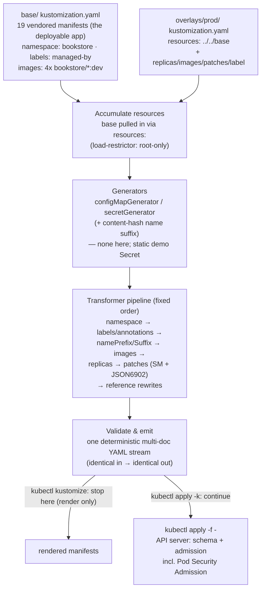

# 02 — Packaging with Kustomize

> Why the *other* answer to "same app, N environments" is **patch a base, no
> templating language**; the `kustomization.yaml` model (resources, namespace,
> namePrefix/Suffix, the `labels:`-vs-`commonLabels` immutability footgun,
> commonAnnotations, images, replicas, strategic-merge vs JSON6902 patches,
> configMapGenerator/secretGenerator + content-hash suffix, replacements,
> components, base/overlay composition); the build/transformer pipeline;
> `kubectl apply -k` vs `kubectl kustomize` vs standalone `kustomize build`;
> how Argo CD/Flux consume it — applied by packaging the **entire** cumulative
> Bookstore as a base + dev/staging/prod overlays that stay logically
> equivalent to [ch.01](01-packaging-helm.md)'s Helm chart and the raw
> manifests, restricted-PSA and all. Closes with a balanced **Helm vs
> Kustomize** (and *both*).

**Estimated time:** ~30 min read · ~90 min hands-on
**Prerequisites:** [Part 07 ch.01](01-packaging-helm.md) — same problem; different answer (templating vs patching) · [Part 00 ch.06](../00-foundations/06-declarative-api-model.md) — patches are still declarative manifests · [Part 03 ch.01](../03-config-and-storage/01-configmaps.md) — configMapGenerator and the content-hash suffix
**You'll know after this:** • build a base + overlays layout and explain when an overlay should patch vs replace · • use strategic-merge and JSON6902 patches without the `labels:` immutability footgun · • generate ConfigMaps and Secrets with content-hash suffixes for safe rollouts · • render dev/staging/prod overlays of the Bookstore (45 / 49 / 48 objects) · • articulate when to pick Helm, Kustomize or both (Helm + post-render Kustomize)

<!-- tags: kustomize, platform-engineering, gitops, ci-cd -->

## Why this exists

[ch.01](01-packaging-helm.md) opened with four pressures that break a raw
`kubectl apply -f` directory: many environments, the release-as-a-unit, lifecycle
ordering, and discoverability. **Helm** answered them with a templating +
release-management layer. Kustomize answers the *first* one — **same app, a few
per-environment deltas** — from the opposite direction, and it is worth
understanding *why a second tool exists* rather than treating it as a Helm
competitor.

Helm's mechanism is **string substitution before parse**: a template is text,
you interpolate values, then it becomes YAML. That is maximally flexible
(loops, conditionals, functions) and also its cost: a chart with many toggles
becomes "YAML with extra steps" — every `{{ if }}` is debugging surface and a
place a value can make the app insecure by default (ch.01's *template soup*
warning, and its closing pointer **here**).

**Kustomize never templates.** A `kustomization.yaml` declares a set of
**plain, valid Kubernetes manifests** (the *base*) and a list of **typed
transformations** (set the namespace, bump replicas, add labels, retag images,
apply a patch). An *overlay* is just another `kustomization.yaml` that includes
the base and layers a few more transformations. The base is **the deployable
app, runnable and lint-able with no tool** (`kubectl apply -f base/` works);
the overlay is a **small, declarative diff**. There is no templating language,
so there is nothing to learn beyond Kubernetes itself, the render is
transparent, and — because the inputs are real manifests in Git — it is the
native shape for GitOps ([ch.04](04-gitops-argocd.md)).

This chapter packages the *exact same Bookstore* as
[`examples/bookstore/kustomize/`](../examples/bookstore/kustomize/) — a `base`
that renders the **same 49-object set** as the Helm default and the raw
manifests (every restricted `securityContext`, the Part 04 scheduling layer,
the byte-identical `catalog`/`orders` `DB_DSN`, the PSA-`restricted`
namespace), plus **dev/staging/prod overlays** and opt-in **components** for
the CRD-backed extras — and proves the equivalence.
[ch.01](01-packaging-helm.md) already forward-referenced this chapter as the
better fit for "same app, few env deltas"; the closing *Helm vs Kustomize*
section squares the two honestly. [ch.04](04-gitops-argocd.md) has Argo CD
reconcile this very tree from Git.

## Mental model

**Kustomize is `kubectl`-side `git merge` for manifests: a base of real YAML +
a stack of typed, declarative patches, rendered by a fixed pipeline.**

- **Base** = a directory of ordinary manifests + a `kustomization.yaml` listing
  them under `resources:`. It is a complete, applyable app on its own.
- **Overlay** = a `kustomization.yaml` whose `resources:` is `[../../base]`
  plus a few transformations (`replicas:`, `images:`, `patches:`, an extra
  label). `kubectl kustomize overlays/prod` emits the base **transformed** —
  one multi-document YAML stream, identical inputs → identical output (no
  `now`/random, so it is safe for GitOps reconcilation).
- **`kubectl apply -k overlays/dev`** = *render that overlay, then apply the
  result* — Kustomize is **built into `kubectl`** (here: `kubectl` v1.35,
  embedded Kustomize v5.7). `kubectl kustomize <DIR>` renders only;
  `kustomize build <DIR>` is the standalone binary's equivalent (mind version
  skew — the embedded copy lags the standalone release).
- **Transformers, not text.** Each knob is a *typed operation on parsed
  objects*: `namespace:` stamps `.metadata.namespace` (and is smart enough to
  skip cluster-scoped kinds), `images:` rewrites image refs, `replicas:` sets
  counts, `labels:`/`commonAnnotations:` add metadata, `patches:`
  strategic-merge or JSON6902 a sub-tree. They run in a **fixed pipeline**
  (generators → transformers → validation), so the result is predictable.
- **The discipline that keeps "the base equals the app" true:** an overlay
  changes only **safe knobs** (replica count, resources, image tag, ingress
  host, env-specific config, toggling an optional component). It must **never**
  weaken a `securityContext`, drop the scheduling layer, or mutate a
  **selector** — and the single sharpest way to violate the last one by
  accident is `commonLabels` (see *the footgun*, below). Get that right and an
  overlay is a safe, reviewable diff; get it wrong and `kubectl apply` of an
  upgrade fails on an immutable field.

The trap to keep in view (covered in *Helm vs Kustomize*): with no
conditionals or loops, genuinely *divergent* environments turn into **patch
sprawl** — many overlays each patching many fields — which is its own kind of
unreadable. Kustomize is at its best when environments are *the same app with
a few deltas*; that is exactly the Bookstore here.

This is the **Configuration Template** pattern (Ibryam & Huß ch.22) approached
without a template engine: the invariant app is the base, the variant is a
declarative patch.

## Diagrams

### `kubectl kustomize` build pipeline: base + overlay → transformers → rendered manifests (Mermaid)

The Bookstore's actual render. The overlay's `resources: [../../base]` pulls
the base in; generators run first, then the transformer chain in pipeline
order, then validation — emitting one deterministic multi-doc stream.



### base / overlays / components directory tree (ASCII)

```
 examples/bookstore/kustomize/
 ├── base/
 │   ├── kustomization.yaml      resources(19) + namespace: bookstore
 │   │                           + labels:(managed-by, includeSelectors:false)
 │   │                           + images:(4x bookstore/*:dev)
 │   └── 00-…84-*.yaml           VENDORED byte-identical copies of the
 │                               in-scope raw-manifests (cmp-verified)
 ├── overlays/
 │   ├── dev/      1 replica, debug cfg, NO HPA/PDB ($patch:delete),
 │   │             host bookstore.dev.local                 → 45 objects
 │   ├── staging/  2 replicas, moderate resources, HPA/PDB on,
 │   │             host bookstore.staging.example.com       → 49 objects
 │   └── prod/     4/3/3 replicas, tuned, registry images,
 │                 demo Secret $patch:delete'd              → 48 objects
 └── components/                 kind: Component — opt-in via overlay components:
     ├── servicemonitor/  + ServiceMonitor×2 + PrometheusRule  (Prom Operator CRDs)
     ├── keda/            + ScaledObject + TriggerAuth + Secret (KEDA CRDs)
     ├── gateway/         SWAPS Ingress → Gateway/HTTPRoute     (Gateway API CRDs)
     ├── kyverno/         + ClusterPolicy (Audit, cluster-scoped)(Kyverno CRD)
     ├── snapshot/        + VolumeSnapshot(Class)               (snapshotter CRDs)
     └── canary/          SWAPS catalog → stable + canary        (no CRD)
 (base renders the SAME 49-object set as the Helm DEFAULT render & raw-manifests.)
```

## Hands-on with the Bookstore

**Assumed working directory: the guide repo root (`full-guide/`).** All
`kubectl`/`kubectl kustomize` commands are run from there; kustomize paths are
relative to it. This chapter does **not** modify `raw-manifests/` — it operates
the parallel [`examples/bookstore/kustomize/`](../examples/bookstore/kustomize/)
tree. `kustomize` is **built into `kubectl`** here, so there is nothing extra
to install.

We will: (0) a clean kind cluster + the four images; (1) `kubectl kustomize`
and read the render; (2) `kubectl apply -k overlays/dev`; (3) diff dev vs prod
and inspect the typed knobs (`images:`, `replicas:`, patches); (4) prove
restricted admission with a server dry-run; (5) enable an optional component
and see the honest "needs the CRD" behaviour.

### 0. Prerequisites — a fresh cluster, the images (self-bootstrapping)

Identical self-bootstrap to every prior chapter (the base pulls `postgres:16`,
`redis:7`, `rabbitmq:3.13-management` from the registry — only the four
`bookstore/*:dev` images are `kind load`ed):

```sh
kind delete cluster --name bookstore 2>/dev/null || true
kind create cluster --name bookstore
kubectl cluster-info

# Build + load the four app images (full instructions: examples/bookstore/app/README.md)
cd examples/bookstore/app
for s in catalog orders payments-worker storefront; do docker build -t bookstore/$s:dev ./$s; done
cd ../../..
for s in catalog orders payments-worker storefront; do kind load docker-image bookstore/$s:dev --name bookstore; done
```

> **Self-bootstrapping note.** After any `kind delete && kind create` you must
> re-`kind load` the four images and re-run the `kubectl apply -k` below — a
> fresh cluster has neither. Like the Helm chapter and unlike the raw-manifests
> chapters, there is **no multi-command apply chain to replay**: a single
> `kubectl apply -k overlays/<ENV>` creates the namespace (PSA-labelled),
> every object, and the migration Job. That consolidation is the point.

### 1. Render — read what Kustomize will apply

`kubectl kustomize` renders locally (no cluster, no state) so you **read
exactly what would be applied** — the habit that keeps overlays honest:

```sh
kubectl kustomize examples/bookstore/kustomize/base | less
```

Sanity-check it against the API server **without applying** (client dry-run):

```sh
kubectl kustomize examples/bookstore/kustomize/base | kubectl apply --dry-run=client -f -
# ...every object: "<OBJ> created (dry run)"
# With the BASE, ZERO "no matches for kind" — every object is a built-in kind.
```

That zero is by design: every CRD-backed object (ServiceMonitor,
PrometheusRule, KEDA `ScaledObject`, Gateway, Kyverno `ClusterPolicy`,
VolumeSnapshot) lives in a **component** that the base does not include — so a
plain base render is 100% built-in API kinds, exactly like the Helm chart's
defaults-off toggles. The base emits **49 objects** — the same
`(kind, name, namespace)` set as `helm template` with default values.

### 2. Apply the dev overlay

```sh
kubectl apply -k examples/bookstore/kustomize/overlays/dev
```

There is no `--create-namespace`: the base **includes** the `Namespace`
object, so the PSA `restricted` labels + ResourceQuota + LimitRange travel with
the apply. Kustomize emits an ordered stream (namespace and cluster-scoped
kinds first), so a single `apply` lands without "namespace not found" races.
Watch it converge:

```sh
kubectl get pods -n bookstore -w
# postgres-0 Running; catalog/orders/storefront/payments-worker/redis/rabbitmq Ready
kubectl get job db-migrate -n bookstore         # the schema migration Job (Completed)
kubectl logs job/db-migrate -n bookstore        # "migration complete"
```

Confirm the namespace really enforces `restricted` and the pods were admitted:

```sh
kubectl get ns bookstore -o jsonpath='{.metadata.labels}' | tr ',' '\n' | grep pod-security
# pod-security.kubernetes.io/enforce:restricted ... (audit + warn too)
kubectl get pods -n bookstore        # all Running — restricted did NOT reject our pods
```

The dev overlay rendered **45** objects: the base's 49 minus the HPA and the
three PDBs (dev turns them off — fewer moving parts while iterating, exactly
like Helm `values-dev.yaml`'s `hpa.enabled:false`/`pdb.enabled:false`).

### 3. Diff overlays, read the typed knobs

The whole value of overlays is that the env delta is a small, reviewable diff.
Compare what dev vs prod would apply, with only built-in tooling:

```sh
diff <(kubectl kustomize examples/bookstore/kustomize/overlays/dev) \
     <(kubectl kustomize examples/bookstore/kustomize/overlays/prod) | grep -E '^[<>]' | head -40
#  replicas 1 vs 4/3/3 ; image bookstore/catalog:dev vs
#  registry.example.com/bookstore/catalog:1.0.0 ; host bookstore.dev.local vs
#  bookstore.example.com ; prod has no demo Secret ; LOG_LEVEL debug vs (base) info
```

Each difference comes from a **typed transformer or patch**, never a
hand-edited manifest. From `overlays/prod/kustomization.yaml`:

```yaml
replicas:                              # the replicas: transformer, not edited YAML
  - name: catalog
    count: 4
images:                                # the images: transformer rewrites name+tag
  - name: bookstore/catalog
    newName: registry.example.com/bookstore/catalog
    newTag: "1.0.0"                     # in prod prefer name@sha256:<DIGEST>
patches:
  - target: { group: apps, version: v1, kind: Deployment, name: catalog }
    patch: |                            # strategic-merge: only resources change
      apiVersion: apps/v1
      kind: Deployment
      metadata: { name: catalog }
      spec: { template: { spec: { containers: [ { name: catalog,
        resources: { requests: {cpu: 100m, memory: 128Mi},
                     limits: {cpu: 500m, memory: 256Mi} } } ] } } }
  - target: { group: autoscaling, version: v2, kind: HorizontalPodAutoscaler, name: catalog }
    patch: |                            # JSON6902: surgically replace two fields
      - op: replace
        path: /spec/minReplicas
        value: 4
      - op: replace
        path: /spec/maxReplicas
        value: 12
```

Bump a tag without touching any Deployment — render and confirm:

```sh
kubectl kustomize examples/bookstore/kustomize/overlays/prod \
  | grep -m1 'image: .*catalog'
# image: registry.example.com/bookstore/catalog:1.0.0   ← from images:, not edited YAML
```

> **Strategic-merge vs JSON6902, and the legacy spelling.** A
> **strategic-merge** patch is a partial object merged by the field's patch
> strategy (lists keyed by `name` merge, not replace) — readable for "change
> these fields". A **JSON6902** patch (`op/path/value`) is a precise RFC-6902
> operation — the right tool for "replace exactly `/spec/minReplicas`" or
> editing one list element by index. Both go under the modern unified
> **`patches:`** (each entry has a `target:` selector). The older
> **`patchesStrategicMerge:`** / **`patchesJson6902:`** keys still work but are
> legacy — `patches:` supersedes both and is what this tree uses.

### 4. Prove restricted admission with a server-side dry-run

A client dry-run does not run admission. A **server** dry-run does — including
**Pod Security Admission**. Same proof technique as Part 05 ch.02 / Part 06 /
ch.01; here it certifies the *rendered overlay*:

```sh
# Throwaway namespace that ENFORCES restricted (don't reuse the app's ns):
kubectl create namespace bs-verify
kubectl label namespace bs-verify \
  pod-security.kubernetes.io/enforce=restricted \
  pod-security.kubernetes.io/enforce-version=latest \
  pod-security.kubernetes.io/warn=restricted

# Render prod, drop the Namespace + cluster-scoped kinds, and strip the
# hardcoded `namespace: bookstore` so the workloads admit into the labelled
# throwaway ns (the SAME technique ch.01 used with --set namespace.*):
kubectl kustomize examples/bookstore/kustomize/overlays/prod \
  | awk 'BEGIN{RS="\n---\n";ORS="\n---\n"} !/^kind: (Namespace|PriorityClass)/' \
  | sed '/^  namespace: bookstore$/d' \
  | kubectl apply --dry-run=server -n bs-verify -f -
# every workload: "<OBJ> created (server dry run)" — ZERO PodSecurity violations

# Negative control — the ns really enforces restricted:
kubectl run bad --image=busybox -n bs-verify --dry-run=server --restart=Never \
  --overrides='{"spec":{"containers":[{"name":"bad","image":"busybox","securityContext":{"privileged":true}}]}}'
# Error ... violates PodSecurity "restricted:latest": privileged ... (Forbidden)

kubectl delete namespace bs-verify         # leave the cluster as you found it
```

Every Deployment/StatefulSet/Job/CronJob is admitted under `enforce:
restricted` with **no PodSecurity warnings** — because the base manifests carry
the *exact* per-image restricted `securityContext` from Part 05 ch.02 (Go
services UID 65532 + read-only root FS; storefront UID 101; postgres/rabbitmq
UID 999 + `fsGroup`, no read-only root FS; redis UID 999 + read-only root FS)
and the Part 04 scheduling layer — and **no overlay weakens them**: an overlay
only patches replicas/resources/host/config, never `securityContext` or
`priorityClassName`/`topologySpreadConstraints`/`affinity`/`tolerations`. (The
rendered `.spec.selector` and pod-template SC/scheduling are byte-identical
base ↔ every overlay; that is the *commonLabels footgun* discipline, below,
made measurable.)

### 5. Enable an optional component — and be honest about CRDs

The observability/scaling/policy extras are CRD-backed, so the base does not
include them; each is a **component** an overlay opts into. Stack a couple onto
the dev overlay by adding a `components:` list (do this in a copy, or append to
`overlays/dev/kustomization.yaml`):

```yaml
# overlays/dev/kustomization.yaml — add:
components:
  - ../../components/servicemonitor
  - ../../components/keda
```

Render and dry-run:

```sh
kubectl kustomize examples/bookstore/kustomize/overlays/dev \
  | kubectl apply --dry-run=client -f - 2>&1 | grep -E 'ScaledObject|ServiceMonitor|no matches'
```

If KEDA is **not** installed you will see:

```
... no matches for kind "ScaledObject" in version "keda.sh/v1alpha1"
... no matches for kind "TriggerAuthentication" in version "keda.sh/v1alpha1"
```

That is **expected and correct** — identical to the intrinsic behaviour the
raw manifests
([`83-keda-scaledobject.yaml`](../examples/bookstore/raw-manifests/83-keda-scaledobject.yaml),
`80-`, `51-`, `70-`, `18-`) and ch.01's Helm toggles already documented: the
*component's objects are schema-correct*, but the **CRD must exist first**.
Every built-in object (the base 49) still validates; only the component's CRD
kinds report `no matches`. Install the operator with **Helm / the official
stable manifest** (never a `releases/latest/download/<PINNED-FILE>.yaml` URL —
it 404s when a new release ships), then the same component applies cleanly:

```sh
helm repo add kedacore https://kedacore.github.io/charts && helm repo update
helm install keda kedacore/keda -n keda --create-namespace --wait
kubectl apply -k examples/bookstore/kustomize/overlays/dev   # ScaledObject now applies
kubectl get scaledobject,hpa -n bookstore                    # KEDA created the managed HPA
```

The same pattern holds for every component (each documents its prerequisite in
[`examples/bookstore/kustomize/README.md`](../examples/bookstore/kustomize/README.md)
and its own `kustomization.yaml` header): `servicemonitor`/`prometheusRule`
need `kube-prometheus-stack`; `gateway` needs the Gateway API CRDs + a
controller and **swaps the Ingress out** (the structural analog of the chart's
mutually-exclusive `ingress`/`gateway` `fail` — there is never a double bind);
`kyverno` needs Kyverno (its `ClusterPolicy` is deliberately **Audit**, never
Enforce — Enforce would reject the guide's own `:dev` images); `snapshot`
needs the external-snapshotter CRDs + a snapshot-capable CSI driver. `canary`
needs **no** CRD — it swaps the single `catalog` Deployment for the
stable/canary pair (manual replica-ratio canary; the automated, metric-gated
form is [ch.05](05-progressive-delivery.md)). Because the canary component
deletes the `catalog` Deployment, it also `$patch: delete`s the base catalog
**HPA** (82-) in the same component — its `scaleTargetRef` would otherwise
point at a deleted Deployment and orphan the autoscaler; re-introduce
autoscaling against `catalog-stable` in the overlay if you want it.

Clean up:

```sh
kubectl delete -k examples/bookstore/kustomize/overlays/dev
# DESTRUCTIVE: the base includes the Namespace, so this deletes the
# `bookstore` namespace and EVERYTHING in it — including the postgres PVC
# `data-postgres-0` and its data. (Same caveat as ch.01's templated-Namespace
# `helm uninstall`.) To keep data, remove 00-namespace.yaml from base/, manage
# the namespace out of band, and delete only the workloads. PriorityClasses are
# cluster-scoped: `kubectl delete -k` removes them too — re-applied next time.
kind delete cluster --name bookstore
```

## How it works under the hood

**The build pipeline.** `kubectl kustomize <DIR>` (equivalently `kustomize
build`, or the render half of `kubectl apply -k`) runs a **fixed, ordered
pipeline** — there is no templating step anywhere in it:

1. **Load & accumulate `resources:`.** Each entry is read; a directory entry
   (e.g. an overlay's `../../base`) is recursively built first and its output
   accumulated. Two resources with the same Group/Version/Kind/namespace/name
   are an **error at this stage** (this is *why* the `canary` component cannot
   re-declare the base's `catalog` Service — the clash is detected before any
   patch could resolve it; the component instead reuses the base Service and
   only swaps the Deployment).
2. **Load restrictor.** By default Kustomize is `RootOnly`: a `resources:`
   path may **not** escape the kustomization root directory. This is *why this
   tree vendors byte-identical copies into `base/` instead of referencing
   `../../raw-manifests/<F>.yaml`* — `kubectl apply -k` does **not** expose
   `--load-restrictor LoadRestrictionsNone`, so a `../../raw-manifests`
   reference would make `kubectl apply -k` (and Argo CD / Flux, which also
   default to the restricted loader) fail. Vendoring keeps the tree
   self-contained and flag-free; the equivalence check (below) guarantees the
   copies have not drifted.
3. **Generators** run: `configMapGenerator` / `secretGenerator` synthesise a
   ConfigMap/Secret from literals/files/env and append a **content-hash suffix**
   to the name (`catalog-config-7h8f9…`), then **rewrite every reference** to
   it (`configMapKeyRef`, `envFrom`, volumes) to the hashed name. The point is
   **rollout-on-change**: edit the data, the name changes, the Deployment's pod
   template changes, a rollout happens automatically (raw ConfigMaps are the
   "env vars don't hot-reload" problem from Part 03 ch.01). `generatorOptions:
   { disableNameSuffixHash: true }` turns the suffix off — *do not* do that for
   config you want to trigger rollouts; it is for a fixed name another system
   references. This tree keeps `16-db-credentials` as a **static** manifest
   (not a `secretGenerator`) so its demo-only / base64-≠-encryption warning
   travels verbatim and the `DB_DSN` stays byte-identical; the generator
   mechanics are taught here, used in [ch.04](04-gitops-argocd.md)'s GitOps
   flow where rollout-on-config-change matters.
4. **Transformers** run in a **fixed order** (not file order): `namespace` →
   `labels`/`annotations` → `namePrefix`/`nameSuffix` → `images` → `replicas`
   → `patches` → reference rewrites. Each is a typed operation on the parsed
   objects. `namespace:` sets `.metadata.namespace` **and is built-in-aware**:
   it does **not** stamp a namespace onto cluster-scoped kinds — the
   Bookstore's three `PriorityClass` objects (and, in components, `GatewayClass`
   / `ClusterPolicy` / `VolumeSnapshotClass`) render **namespace-free**
   (verified). `namePrefix`/`nameSuffix` rename objects *and* fix references to
   them; `images:` rewrites `newName`/`newTag`/`newDigest`; `replicas:` sets
   counts on workloads by name.
5. **Validate & emit** one deterministic multi-document stream. `kubectl
   kustomize` stops here; `kubectl apply -k` pipes it to the API server, where
   **normal admission still runs** — schema validation and **Pod Security
   Admission** — which is why a restricted-noncompliant overlay would be
   rejected here exactly as a raw manifest would.

**The `labels:`-vs-`commonLabels` immutability footgun (teach this).**
`Deployment`/`StatefulSet` `.spec.selector.matchLabels` and a `Service`'s
`.spec.selector` are **immutable after creation** (the API server rejects a
change). The **legacy `commonLabels:`** transformer adds its labels to *every*
object's `metadata.labels` **and into those selector fields and the pod
template labels**. On a *first* apply that is fine. But add one label via
`commonLabels` in an overlay later, and the next `kubectl apply` tries to patch
an existing Deployment's `spec.selector.matchLabels` → the API server returns

```
Deployment.apps "catalog" is invalid: spec.selector:
  Invalid value: ...: field is immutable
```

and the upgrade is **stuck** until someone deletes and recreates the workload
(downtime). The Helm analog is *template soup mutating a selector*; the
Kustomize analog is `commonLabels`. The fix is the **modern `labels:`
transformer with `includeSelectors: false`** (and `includeTemplates: false`
unless you deliberately want pod-template labels changed). It adds metadata
labels but **leaves selectors and pod templates untouched**. This tree's
`base/kustomization.yaml`:

```yaml
labels:
  - pairs:
      app.kubernetes.io/managed-by: kustomize
    includeSelectors: false      # ← do NOT touch spec.selector (immutable)
    includeTemplates: false      # ← do NOT touch pod-template labels either
```

and each overlay adds `app.kubernetes.io/environment: <ENV>` the same way. The
measurable result, from the actual render — the catalog Deployment in **base**:

```yaml
metadata:
  labels:
    app: catalog
    app.kubernetes.io/managed-by: kustomize     # ← added by labels:
    app.kubernetes.io/part-of: bookstore
spec:
  selector:
    matchLabels:
      app: catalog                               # ← UNCHANGED (no env/managed-by)
```

and in **every overlay** that `spec.selector.matchLabels` is **byte-identical**
(`{app: catalog}`) even though `metadata.labels` also gains
`app.kubernetes.io/environment`. Because the selector never changes between
base and overlays — or between two overlays — `kubectl apply` of any
environment over any other never hits the immutable-field error. (Verify it:
diff the `.spec.selector` of each Deployment/StatefulSet from `kubectl
kustomize base` against each `overlays/<ENV>`; they are identical. And
`grep -rnE '^[[:space:]]*commonLabels[[:space:]]*:'` the tree returns nothing —
`commonLabels` is taught, never used.) `commonAnnotations:` has **no** such
hazard (annotations are not selectors) and is the right tool for
audit/owner/contact metadata.

**Patches change only safe knobs.** Every patch in the overlays targets
replica count, resources, image (via `images:`, never a hand-edited string),
ingress host, env-specific config, or *toggles an optional component* — never
`securityContext`, never the scheduling layer, never a selector. `replicas:`
(or a small strategic-merge patch) sets counts; `images:` sets tags. The
`$patch: delete` directive removes a base object from an overlay (dev drops the
HPA + 3 PDBs; prod drops the demo Secret). That last is the production secret
story: prod's `$patch: delete` of `db-credentials` means Git carries no
password — a Secret of the same name is supplied out of band by **External
Secrets Operator / Sealed Secrets / Vault**, and the workloads' unchanged
`secretKeyRef`/`envFrom` resolve it at runtime (the env-built `DB_DSN` is
identical; only the *source* of the values moves out of Git).

**Components vs overlays.** An **overlay** (`kind: Kustomization`) is a
*concrete environment* — it is built directly. A **component**
(`kind: Component`) is a *reusable, optional mix-in* — it is **not** built on
its own; an overlay pulls it in via `components:`, and it can itself add
`resources:` and `patches:`. Components are the exact Kustomize analog of
ch.01's Helm value toggles: the base stays vanilla-cluster-clean (zero `no
matches for kind`), and an environment opts into `servicemonitor` / `keda` /
`gateway` / `kyverno` / `snapshot` / `canary`. Components run **after** the
base's transformers in the overlay's pipeline, which is why a component can
`$patch: delete` a base object (the `gateway` component deletes the base
Ingress so only the Gateway-API stack remains — the structural form of the
chart's `ingress`-XOR-`gateway` invariant; the `canary` component deletes the
base `catalog` Deployment **and its HPA 82-** — both, in the one component, so
the stable/canary pair replaces the Deployment and no autoscaler is left
pointing at a resource that no longer exists; an overlay enabling `canary`
must not *also* delete the HPA itself, as kustomize errors on two patches
deleting the same resource id).

**`vars` → `replacements`.** Old Kustomize used `vars:` to substitute a value
from one object into another. It is **deprecated**; the modern, more
predictable mechanism is **`replacements:`** — declare a `source`
(object+fieldpath) and one or more `targets` (object+fieldpath, with
list/wildcard support). The Bookstore needs none (the `DB_DSN` is intentionally
a single literal in `catalog`/`orders`, kept byte-identical *without*
indirection so it cannot skew), but reach for `replacements:` — not `vars:`,
not a generator hack — when a value genuinely must flow between objects.

**OpenAPI & built-in transformers.** Kustomize knows the OpenAPI schema of
built-in kinds (so strategic-merge knows which lists are keyed). For a CRD's
custom fields you can supply `openapi:` (a schema) or use a JSON6902 patch
(which needs no schema) — this tree uses JSON6902 for the HPA field edits,
which is schema-free and exact. Every transformer above is a **built-in
plugin**; Kustomize also supports out-of-tree plugins, deliberately unused here
(an external plugin reintroduces the "needs a tool/lang to understand the
output" cost Kustomize exists to avoid).

**Equivalence (why "the base equals the app" is true, not aspirational).** The
base's 19 files are `cmp`-verified byte-identical copies of the in-scope
`raw-manifests/*.yaml`, and `kubectl kustomize base` emits the **same
`(kind, name, namespace)` set as `helm template` with default values — 49
objects**. `staging` renders that **identical 49-set**; `dev` is 45 (−HPA −3
PDB, the documented dev knobs); `prod` is 48 (−demo Secret, the documented prod
knob) with **nothing extra and nothing else missing**. The `catalog` and
`orders` rendered `DB_DSN` are **byte-identical to each other and to the raw
canonical string** (`host=postgres.bookstore.svc.cluster.local port=5432
user=$(POSTGRES_USER) password=$(POSTGRES_PASSWORD) dbname=$(POSTGRES_DB)
sslmode=disable`). The namespace carries
`pod-security.kubernetes.io/enforce: restricted` + `enforce-version`. The
PriorityClasses render namespace-free. This is the same standard ch.01 held the
chart to — the packaging changed; the deployed app did not.

## Production notes

> **In production: GitOps reconciles Kustomize; humans rarely run `kubectl apply -k`.**
> Argo CD natively renders a `kustomization` path
> (`spec.source.path` → it runs `kustomize build`); Flux's `Kustomization`
> controller does the same on an interval. The cluster state always equals Git,
> rollback is `git revert`, and drift is auto-corrected. That is
> [ch.04](04-gitops-argocd.md); this tree is built to be reconciled — it
> vendors its inputs (the default `RootOnly` load-restrictor that the GitOps
> controllers also enforce), and the render is **deterministic** (no `now`/
> random; two `kubectl kustomize` runs are byte-identical — mandatory, or every
> reconcile shows false drift).

> **In production: promote environments by overlay, not by editing.** dev →
> staging → prod is "the same base, three small overlays" — a promotion is a
> reviewed change to *one overlay file* (a tag in `images:`, a count in
> `replicas:`). The base is never edited per environment, so environments
> cannot silently diverge. Pin image **digests** (`newDigest:`), not tags, in
> the prod overlay (Part 05 ch.03's supply-chain story); the `images:`
> transformer takes a digest directly.

> **In production: the `commonLabels` immutability footgun is a real outage.**
> Adding an env/version label via `commonLabels` (or a `labels:` block without
> `includeSelectors: false`) mutates `spec.selector` — and the next `kubectl apply`/Argo sync
> fails on the immutable field, wedging the rollout until the
> workload is deleted and recreated (downtime). Standardise on `labels:` with
> `includeSelectors: false`; keep `app:`/selector labels stable and identical
> base↔overlays; put audit/owner metadata in `commonAnnotations:`. Make a CI
> check that `commonLabels:` never appears.

> **In production: a Secret generator is NOT encryption.** `secretGenerator`
> (and a static Secret) is base64, not encrypted — the same warning as Part 03
> ch.02 / Part 05 ch.04 / ch.01. The demo `db-credentials` here is **demo-only**;
> the prod overlay `$patch: delete`s it and a real Secret is provided by
> **External Secrets Operator / Sealed Secrets / Vault**. For secret *material*
> that must live in Git, encrypt it with **SOPS** — Flux integrates SOPS
> decryption natively, and **KSOPS** is the Kustomize exec-plugin that decrypts
> a SOPS-encrypted `secretGenerator` at build time. Enable
> encryption-at-rest on the apiserver regardless.

> **In production: structured edits beat patch sprawl.** Prefer the typed
> transformers (`images:`, `replicas:`, `namespace:`, `labels:`) over a pile of
> strategic-merge patches — they are intent-revealing and review cleanly. When
> an overlay accumulates many large patches, that is the signal the
> environments have genuinely *diverged* (not "same app, few deltas") — at that
> point reconsider the boundary (a real second app? a Helm chart with a
> conditional? a component?) rather than letting overlays become an ad-hoc
> template engine. Components factor a *recurring* optional concern out of
> overlay duplication.

> **In production: pin the Kustomize version; mind kubectl-embedded skew.**
> `kubectl`'s embedded Kustomize **lags** the standalone `kustomize` release,
> and behaviour (e.g. `labels:` semantics, plugin handling) has changed across
> v4→v5. Pin one Kustomize version in CI and have humans use the **same**
> version the GitOps controller uses (`kustomize version` /
> `kubectl version`), or a render mismatch between laptop, CI, and Argo CD will
> manifest as phantom drift. This guide targets the Kustomize embedded in
> `kubectl` v1.30+ (here v1.35 / Kustomize v5.7).

## Helm vs Kustomize (and both)

This is the section [ch.01](01-packaging-helm.md) and the *Mental model* above
point to. It is **not a verdict** — both tools are correct; they answer
different questions, and ch.01's closing note ("when a chart becomes mostly
conditionals reach for Kustomize overlays — patch-the-base, no templating
language — often the better fit for *same app, few env deltas*") is the same
framing from the other side. They are also **composable**.

| | **Helm** ([ch.01](01-packaging-helm.md)) | **Kustomize** (this chapter) |
|---|---|---|
| Core mechanism | **Templating** — Go `text/template`+Sprig render text → YAML | **Overlay/patch** — typed transforms on real manifests; no template language |
| Inputs in Git | Templates with `{{ … }}` (not directly applyable) | Plain manifests (`kubectl apply -f base/` works tool-free) |
| Conditionals / loops | Yes (`if`/`range`/`fail`) — express genuinely *divergent* shapes | **No** — only declarative patches; divergence → patch sprawl |
| Lifecycle / ordering | **Hooks** (the migration-Job-as-`post-install` pattern) | None — emits one ordered stream; ordering is by kind, not lifecycle |
| Release management | **Yes** — named release, revisions, `helm rollback`, history Secret | None of its own — the *renderer*; rollback = `git revert` (via GitOps) |
| Discoverable tuning surface | `values.yaml` + `values.schema.json` (validated) | The overlay/`kustomization.yaml` files themselves (no schema) |
| Render transparency | Indirect (must `helm template` to see output) | Direct (`kubectl kustomize` is the output; trivial to diff) |
| GitOps fit | Good (Argo/Flux render charts) — but values≠final until rendered | **Native** (inputs are manifests; deterministic; the default loader matches the controllers') |
| Built into `kubectl` | No (separate `helm` binary) | **Yes** (`kubectl -k` / `kubectl kustomize`) |
| Secrets | `values` leak into the release Secret; needs External Secrets/SOPS | Static/`secretGenerator` is still base64; needs External Secrets/SOPS+KSOPS |
| Sweet spot | One app, **many environments with structural variation**, redistributable packages (OCI), lifecycle ordering | One app, **same shape, a few per-env deltas**; GitOps; no DSL to learn |
| Hurts when | "Template soup" — every toggle is debugging surface / an insecure-by-default risk | "Patch sprawl" — many overlays each patching many fields; no loops |

For the **Bookstore specifically**, both are deliberately equivalent: the Helm
default render and `kubectl kustomize base` produce the **same 49-object set**,
restricted-PSA and scheduling intact, the `catalog`/`orders` `DB_DSN`
byte-identical. The env deltas here (replica counts, resources, image
registry/tag, ingress host, optional components, demo-Secret off in prod) are
exactly "same app, a few knobs" — Kustomize's sweet spot — which is why this
guide ships *both* and treats them as peers, not rivals.

### Using both: Kustomize-renders-Helm, or Helm-then-Kustomize

The two are not mutually exclusive — there are two well-defined ways to chain
them, and they differ in *who is the outer tool*:

- **Kustomize renders the chart (`helmCharts:` + `--enable-helm`).** A
  `kustomization.yaml` declares a chart under `helmCharts:`; `kubectl
  kustomize --enable-helm <DIR>` (or `kustomize build --enable-helm`) runs
  `helm template` for you and then applies the normal Kustomize transformer
  pipeline (namespace, `labels:` with `includeSelectors:false`, `images:`,
  patches) over the chart's output. Kustomize is the **outer** tool; good when
  you consume a third-party chart but want your org's overlay/label/patch
  conventions on top without forking it:

  ```yaml
  # kustomization.yaml (rendered with: kubectl kustomize --enable-helm .)
  apiVersion: kustomize.config.k8s.io/v1beta1
  kind: Kustomization
  helmCharts:
    - name: bookstore
      repo: oci://registry.example.com/charts   # or a classic repo URL
      version: 0.1.0
      releaseName: bookstore
      namespace: bookstore
      valuesFile: values-prod.yaml
  patches:
    - target: { kind: Deployment, name: catalog }
      patch: |
        - { op: replace, path: /spec/replicas, value: 4 }
  ```

  (`--enable-helm` is required — it is off by default because it shells out to
  `helm`; the deterministic-render and version-pin notes still apply, now to
  *both* tools.)

- **Helm renders, then a post-renderer (`helm install --post-renderer`).**
  Helm is the **outer** tool (you keep `helm install`/`upgrade`, releases,
  rollback, hooks); `--post-renderer` pipes Helm's rendered manifests through
  an external command **before** they are applied — and that command is
  commonly `kustomize build` of a tiny overlay (or `kubectl kustomize`)
  reading Helm's output on stdin. Good when you must run a chart you do not
  own *and* keep Helm's release lifecycle, but need a last-mile patch the
  chart's `values` cannot express:

  ```sh
  # post-renderer.sh — Helm pipes the rendered manifest to this on stdin
  #!/usr/bin/env sh
  cat > /tmp/all.yaml
  exec kustomize build /path/to/last-mile-overlay   # overlay resources: [all.yaml]
  helm install bookstore ./chart --post-renderer ./post-renderer.sh
  ```

Rule of thumb: **`helmCharts:` when Kustomize/GitOps owns delivery and you
just consume a chart; `--post-renderer` when Helm owns the release lifecycle
and you need a final patch.** Either way the same disciplines hold — pin both
tool versions, keep the render deterministic, and never let the chaining
mutate a selector (the `commonLabels` footgun) or weaken the restricted
`securityContext`.

## Quick Reference

```sh
# Render / dry-run (no cluster needed for the first; built into kubectl)
kubectl kustomize examples/bookstore/kustomize/base | less
kubectl kustomize examples/bookstore/kustomize/overlays/prod \
  | kubectl apply --dry-run=server -f -            # full admission incl. PSA
  # ^ pipes the Namespace + cluster-scoped + ns:bookstore objects: on a FRESH
  #   cluster the bookstore ns must exist first, OR use the throwaway-ns
  #   technique from the Hands-on PSA step (§4 "Prove restricted admission").
kustomize build examples/bookstore/kustomize/overlays/dev   # standalone binary (mind skew)

# Apply / diff / delete
kubectl apply -k examples/bookstore/kustomize/overlays/dev
kubectl diff  -k examples/bookstore/kustomize/overlays/prod  # live vs would-apply
diff <(kubectl kustomize .../overlays/dev) <(kubectl kustomize .../overlays/prod)
kubectl delete -k examples/bookstore/kustomize/overlays/dev

# Inspect transformers without a cluster
kubectl kustomize .../overlays/prod | grep -m1 'image: .*catalog'   # images:
kubectl kustomize .../overlays/prod | grep -A2 'kind: HorizontalPodAutoscaler'  # replicas/patch
grep -rnE '^[[:space:]]*commonLabels[[:space:]]*:' examples/bookstore/kustomize/  # must be empty
```

Minimal overlay `kustomization.yaml` skeleton (the shape; full set in the tree):

```yaml
apiVersion: kustomize.config.k8s.io/v1beta1
kind: Kustomization
resources:
  - ../../base                       # the deployable app (base)
labels:
  - pairs: { app.kubernetes.io/environment: prod }
    includeSelectors: false          # ← NEVER mutate selectors (immutable)
    includeTemplates: false
namespace: bookstore                 # base-level; kept across envs (DNS coherence)
replicas:
  - { name: catalog, count: 4 }      # counts via transformer, not edited YAML
images:
  - { name: bookstore/catalog, newName: registry.example.com/bookstore/catalog, newTag: "1.0.0" }
patches:
  - target: { kind: HorizontalPodAutoscaler, name: catalog }
    patch: |                          # JSON6902: surgical field edits
      - { op: replace, path: /spec/maxReplicas, value: 12 }
components:
  - ../../components/servicemonitor   # opt-in CRD-backed extra (analog of a Helm toggle)
```

Checklist:

- [ ] `kubectl kustomize base | kubectl apply --dry-run=server -f -` admitted
      (incl. **PodSecurity**) into a `restricted` namespace; **zero** `no
      matches for kind` (CRD extras live in components, not base)
- [ ] **`commonLabels` never used** — additive labels via `labels:` with
      `includeSelectors: false`; `.spec.selector` byte-identical base↔overlays
- [ ] Overlays change only safe knobs (replicas/resources/image/host/config/
      component toggle) — `securityContext` & scheduling layer **unweakened**
- [ ] Render is **deterministic** (no `now`/random) — required for GitOps;
      base ≡ Helm-default 49-set; `catalog`/`orders` `DB_DSN` byte-identical
- [ ] Cluster-scoped kinds (PriorityClass/…) render **namespace-free**;
      namespace kept across envs OR cross-refs (DSN/AMQP/NetPol) fully rewritten
- [ ] Secrets: static demo Secret warned & `$patch: delete`'d in prod
      (External Secrets / SOPS+KSOPS in real life — generators are not encryption)
- [ ] `kubectl` embedded-Kustomize version pinned == the GitOps controller's

## Test your understanding

> Try each before opening the answer drawer. The act of trying is the exercise; the answer is the check.

1. **In one sentence, explain why a Kustomize overlay can be applied by hand (`kubectl apply -f base/`) but a Helm chart cannot.**
   <details><summary>Show answer</summary>

   A Kustomize base is **plain, valid Kubernetes YAML** — `kubectl apply -f` works directly; the kustomization file is opt-in syntactic sugar. A Helm chart is **Go template text** (`{{ ... }}`) which is not valid YAML until rendered with values. That's the central architectural difference: Helm renders text then parses YAML; Kustomize parses YAML then transforms objects. See §Mental model.

   </details>

2. **You add `commonLabels: { app: catalog }` to an overlay because a teammate said "labels should be everywhere". Three days later a rolling deployment hangs and the new ReplicaSet shows 0 ready replicas. What did `commonLabels` do?**
   <details><summary>Show answer</summary>

   `commonLabels` writes into `.spec.selector.matchLabels` *and* `.spec.template.metadata.labels` — and Deployment selectors are **immutable** after creation. The first apply of the overlay added the label to the new ReplicaSet template, but the existing Deployment's selector now requires the label too; the rolling update created Pods that *do* have it (good) but tried to update a selector field that K8s refuses to mutate (bad). The fix is `labels:` with `includeSelectors: false` (additive labels, no selector mutation), which is exactly what the checklist forbids `commonLabels` for. See §Quick Reference / commonLabels footgun.

   </details>

3. **Your `kustomize build overlays/dev` renders fine. Argo CD reports `OutOfSync` even with auto-sync on. You diff desired vs live and see `metadata.annotations.kubectl.kubernetes.io/last-applied-configuration` flicking. Explain.**
   <details><summary>Show answer</summary>

   That annotation is written by `kubectl apply` itself; if your CI also runs `kubectl apply` *outside* the GitOps loop, both sides keep rewriting it. The Argo CD-recommended sync option is **`ServerSideApply=true`** (which doesn't use that annotation) and remove any imperative apply path. The render is fine; the *applier mode* is fighting itself.

   </details>

4. **Hands-on extension — render and count. Run `kubectl kustomize examples/bookstore/kustomize/overlays/dev | grep -c '^kind:'`. Repeat for `overlays/staging` and `overlays/prod`. What do the three numbers tell you, and why are they different?**
   <details><summary>What you should see</summary>

   45 / 49 / 48 (the invariant from the spec). Each overlay toggles **components** on/off (ServiceMonitor, KEDA ScaledObject) and patches/removes specific resources (dev removes one Job; prod removes the demo Secret) — the count delta is the whole point of overlays: a small, declarative, *visible* diff from the base. Helm achieves the same via `if` blocks in templates; Kustomize achieves it via included/excluded components.

   </details>

5. **`configMapGenerator` produces ConfigMaps with a content-hash suffix (`catalog-config-7gktc28h2k`). Why? What happens during a rolling deploy if you turn the suffix off (`disableNameSuffixHash: true`)?**
   <details><summary>Show answer</summary>

   The suffix turns each content version into a **new object name** — the Deployment's `volumes:` reference changes, which triggers a rollout. With the suffix off, an updated ConfigMap is the *same* name, the Deployment's pod template is unchanged, the rollout doesn't trigger, and Pods continue running with the old config until they restart for some other reason. The hash suffix is what makes "edit the ConfigMap → automatic rolling restart" actually work. See §Quick Reference / generators.

   </details>

## Further reading

- **Rosso et al., _Production Kubernetes_, ch.11 — Building Platform
  Services** (delivering an application as a consumable, versioned,
  environment-promotable artifact; where templating vs overlay packaging fits
  in an internal developer platform and the operational trade-offs of each).
- **Ibryam & Huß, _Kubernetes Patterns_ 2e — *Configuration Template*
  (ch.22)** (parameterising the variant while fixing the invariant as a
  pattern — Kustomize realises it *without* a template engine: the base is the
  invariant app, the overlay is the declarative variant; contrast ch.01, where
  Helm realises the same pattern *with* a template engine).
- Official: Kustomize docs — <https://kubectl.docs.kubernetes.io/references/kustomize/>
  (the `kustomization.yaml` field reference and the
  [glossary](https://kubectl.docs.kubernetes.io/references/kustomize/glossary/)),
  the Kubernetes task
  <https://kubernetes.io/docs/tasks/manage-kubernetes-objects/kustomization/>,
  and <https://kustomize.io>.
