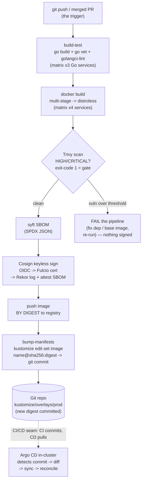

# 03 — CI/CD pipeline

> The **CI vs CD split** (CI proves an artifact good; CD makes the cluster
> match Git); the pipeline stages — build → unit-test → `go vet`/lint → image
> build (the existing multi-stage distroless Dockerfiles) → scan (Trivy, fail
> on HIGH/CRITICAL) → SBOM (syft) → sign (Cosign keyless OIDC + Rekor) → push
> **by digest** → **bump the deployment source** (the GitOps image-pin); image
> **tags vs immutable digests** and why CD pins digests (the Part 05 ch.03
> Kyverno `require-digest`/`verifyImages` becomes *enforceable* once CI does
> this); promotion dev→staging→prod; SLSA provenance/attestations; secrets in
> CI (keyless OIDC > long-lived keys); caching/matrix — applied by a complete
> **GitHub Actions** workflow for the Bookstore that ends by committing the
> built digests into the kustomize overlay so Argo CD ([ch.04](04-gitops-argocd.md))
> deploys them. "**CI builds, CD deploys, Git is the trigger.**"

**Estimated time:** ~30 min read · ~90 min hands-on
**Prerequisites:** [Part 05 ch.03](../05-security/03-supply-chain.md) — scan, sign, verify; CI is where these get enforced · [Part 07 ch.02](02-packaging-kustomize.md) — the overlays CI bumps digests in · [Part 00 ch.02](../00-foundations/02-containers-and-images.md) — tags vs immutable digests
**You'll know after this:** • split CI (proves the artifact good) from CD (makes the cluster match Git) · • chain build → test → image → scan → SBOM → sign → push-by-digest · • configure Cosign keyless OIDC and Rekor for short-lived, no-long-key signing · • bump kustomize overlay image digests from a workflow and trigger Argo CD · • promote a Bookstore release dev → staging → prod with SLSA provenance

<!-- tags: ci-cd, gitops, supply-chain, platform-engineering -->

## Why this exists

[ch.01](01-packaging-helm.md) and [ch.02](02-packaging-kustomize.md) made the
Bookstore **packageable** — one Helm chart, one Kustomize base+overlays, each
rendering the same 49-object app. [Part 05 ch.03](../05-security/03-supply-chain.md)
made an image **trustworthy** — Trivy scan, syft SBOM, Cosign keyless
signature, and a Kyverno policy that *would* require a digest and a verified
signature… shipped in **Audit** because the guide's own `bookstore/<SVC>:dev`
images are tag-based and unsigned, so Enforce would blackhole the cluster.

Two gaps remain, and they are the whole subject of this chapter:

1. **Who actually runs build → scan → sign → push, reproducibly, on every
   change?** Doing it by hand on a laptop is the "works on my machine" the
   guide has avoided since Part 00 — unpinned tools, no record, secrets in
   shell history. That is **CI** (Continuous Integration): an automated,
   audited pipeline that takes source and **proves an artifact is good** (it
   compiles, vets, has no HIGH/CRITICAL CVEs, is signed, is addressable by an
   immutable digest).
2. **How does a good artifact become a running Pod, without a human typing
   `kubectl apply`?** The Helm/Kustomize Production notes already gave the
   answer's *shape* ("GitOps reconciles; humans rarely run `helm install` /
   `kubectl apply -k`"). That is **CD** (Continuous Delivery): the cluster is
   continuously made to match Git. This chapter builds the **seam** between CI
   and CD — CI's last act is not a deploy, it is a **commit that bumps the
   deployment source** (the kustomize `images:` digest); [ch.04](04-gitops-argocd.md)'s
   Argo CD reconciles that commit.

This split is the load-bearing idea: **CI builds and proves; CD (GitOps)
deploys; Git is the trigger between them.** It is also exactly how Part 05's
Audit policy graduates to **Enforce** — once CI pushes by digest and signs
keyless, a cluster can *require* a digest and *verify* the signature against
the pipeline's identity. Audit → Enforce is a pipeline milestone, not a YAML
flip. This is the example-app delivery shape from *Bootstrapping
Microservices*.

## Mental model

**CI and CD are two machines joined by Git, not one script.**

- **CI = "is this artifact good?"** Triggered by a push/PR. Inputs: source.
  Outputs: an **immutable, signed image referenced by digest** plus evidence
  (test results, scan report, SBOM, signature in Rekor). CI **never touches
  the cluster** — it has no kubeconfig, no cluster credentials. Its final
  successful step writes the new digest into the **deployment source in Git**.
- **CD = "does the cluster match Git?"** A controller *in the cluster*
  ([ch.04](04-gitops-argocd.md)'s Argo CD) watches the Git repo/path, renders
  the Kustomize overlay, diffs desired-vs-live, and reconciles. The deploy is
  triggered by **the commit CI made**, not by CI reaching into the cluster.
- **The artifact is pinned by content, not by name.** `bookstore/catalog:dev`
  is a *mutable pointer* — anyone with push access can move `:dev` to a
  different image. `…@sha256:<HASH>` **is** the content (the registry/kubelet
  verifies the bytes hash to exactly that). CI signs the *digest*; CD deploys
  the *digest*. This is the single highest-leverage control and the reason
  Part 05's Kyverno `require-image-digest` exists.
- **The pipeline is a DAG of gates.** build-test → build-scan-sign-push →
  bump-manifests. Each gate must pass before the next runs; a HIGH/CRITICAL
  CVE or a failed `go vet` stops the line *before* anything is signed or
  deployed. Matrix legs (the four services) run in parallel; caches make
  re-runs fast.
- **Secrets: prefer no long-lived secret at all.** Cosign **keyless** uses a
  short-lived OIDC token the CI platform mints for the workflow run (exchanged
  at Sigstore Fulcio for a 10-minute cert) — there is no signing key to leak.
  The registry push uses the run's auto-injected, short-lived token, not a
  static PAT. Never `echo` a secret; never sign on a fork PR (no trusted
  identity, unreviewed code).

The trap to keep in view: a pipeline that *deploys by reaching into the
cluster* (a `kubectl apply` step with a long-lived kubeconfig secret) couples
CI to CD, makes the cluster's state un-auditable ("what did that job apply?"),
and hands every CI job cluster-admin-shaped credentials. The discipline is
**push-to-Git, let the cluster pull** — which is [ch.04](04-gitops-argocd.md).

## Diagrams

### Pipeline DAG: build → test → scan → sign → push → bump → (Argo syncs) (Mermaid)

The Bookstore's actual workflow
([`examples/bookstore/ci/github-actions.yml`](../examples/bookstore/ci/github-actions.yml)).
The dashed boundary is the CI/CD seam: CI ends at a **commit**; the cluster's
Argo CD ([ch.04](04-gitops-argocd.md)) pulls from there.



### Tag-vs-digest and env promotion (ASCII)

```
 TAG vs DIGEST ──────────────────────────────────────────────────────────────
   bookstore/catalog:dev         a NAME in the registry; can be re-pointed at
                                 ANY image later (incl. by an attacker)  → CI
   …catalog@sha256:9f3c…1a       the CONTENT itself; bytes are verified to
                                 hash to exactly this                    → CD
   CI signs the DIGEST. CD deploys the DIGEST. Part-05 Kyverno
   require-image-digest + verifyImages can only be ENFORCED once this is true.

 ENVIRONMENT PROMOTION (folder/overlay strategy — this guide) ────────────────
   build once  ──►  ONE signed digest  ──►  promoted, never rebuilt
        │
        ├─ overlays/dev      :dev / latest main digest   (auto-sync, ch.04)
        ├─ overlays/staging  same digest, prod shape ½ scale
        └─ overlays/prod     SAME digest, pinned by `kustomize edit set image`
                             (CI writes it here → Argo prod App syncs)
   Promotion = a reviewed COMMIT moving a digest between overlays — NOT a
   rebuild (a rebuild is a different artifact; you'd be shipping untested bits).
   Alt strategy: branch/folder per env (a config repo with env branches);
   same principle — the artifact is immutable, only the pointer moves.
```

## Hands-on with the Bookstore

**Assumed working directory: the guide repo root (`full-guide/`).** This
chapter adds **no Kubernetes objects** — it adds the pipeline that *produces*
what [ch.04](04-gitops-argocd.md) deploys. The workflow file is
[`examples/bookstore/ci/github-actions.yml`](../examples/bookstore/ci/github-actions.yml).

> **Honesty note (same precedent as Part 05 ch.03's Cosign/Trivy notes).** The
> push, keyless-sign, and manifest-bump steps need a **container registry the
> runner can push to** and **OIDC configured** — infrastructure *you* supply.
> The workflow is therefore **illustrative end-to-end**: every step you can run
> locally without those is shown runnable below; the rest is explained
> job-by-job and is real, valid GitHub Actions YAML (validated in this phase),
> not pseudo-code. `ghcr.io/your-org/...` and `your-org/bookstore` are **clearly
> labelled generic placeholders** — replace `your-org`.

### 0. What you can run locally right now (no registry, no OIDC)

Everything CI does *before* push is reproducible on your machine with the same
tools Part 05 ch.03 introduced. From the repo root:

```sh
# 1) The build-test gate (the Bookstore Go services ship NO _test.go — tiny by
#    design — so the gate is build + vet; `go test ./...` becomes the gate the
#    moment a real codebase has tests).
for s in catalog orders payments-worker; do
  ( cd examples/bookstore/app/$s && go build ./... && go vet ./... )
done
# storefront is static nginx — no Go; it is exercised by `docker build` next.

# 2) The image build — the EXISTING multi-stage distroless Dockerfile
#    (Part 00 ch.02; gcr.io/distroless/static:nonroot, USER 65532; storefront
#    is nginx UID 101). CI builds these byte-for-byte the same way.
for s in catalog orders payments-worker storefront; do
  docker build -t bookstore/$s:dev examples/bookstore/app/$s
done

# 3) The scan GATE (Part 05 ch.03's CI contract, run locally):
trivy image --severity HIGH,CRITICAL bookstore/catalog:dev
trivy image --exit-code 1 --severity HIGH,CRITICAL bookstore/catalog:dev
#   exit-code 1 ⇒ "fail the pipeline on any HIGH/CRITICAL". The distroless Go
#   images carry almost no packages, so this is typically clean by
#   construction — that minimal base IS a supply-chain control.

# 4) The SBOM (syft; Trivy can also emit one — Part 05 ch.03):
syft bookstore/catalog:dev -o spdx-json > catalog.spdx.json
#   or: trivy image --format spdx-json -o catalog.spdx.json bookstore/catalog:dev

# 5) Cosign — show the keyless flow without authenticating (honest, like
#    Part 05 ch.03's `cosign --help` note): signing a real image needs a
#    registry + an OIDC identity, which CI provides via `id-token: write`.
cosign version
cosign sign --help    # keyless: no private key; OIDC token -> Fulcio -> Rekor
```

These five are exactly job 1 and the first half of job 2 — provably runnable.
The rest (push by digest, keyless sign against the workflow's OIDC identity,
commit the digest into the overlay) is what the runner does with credentials
you supply; it is read, not run, here.

### 1. The workflow, job by job

Open [`examples/bookstore/ci/github-actions.yml`](../examples/bookstore/ci/github-actions.yml).
It physically lives under `examples/bookstore/` (this guide keeps every
Bookstore artifact there); GitHub only executes a workflow at
`.github/workflows/<NAME>.yml`, so a real Bookstore repo copies/symlinks it
there — the file header says this. Three jobs, wired as a DAG by `needs:`:

**Job `build-test`** — `runs-on: ubuntu-latest`, a `matrix` over the three Go
services with `fail-fast: false` (one service failing still reports the
others). Per service: `actions/setup-go` with **module/build caching keyed by
that service's `go.sum`** (a cache hit skips re-downloading deps — the
caching/matrix point), then `go build ./... && go vet ./...`, then
`golangci-lint`. `go test ./...` is shown commented because there are no tests
yet; it *becomes* the gate when a codebase has them. This job has **no
registry and no cluster access** — it only proves the code.

**Job `build-scan-sign-push`** — `needs: build-test`, and `if: github.event_name
== 'push'` so it runs only on a merged PR to `main`, **never on a fork PR**
(no OIDC/secrets there, and unreviewed code must not be signed/published). It
declares the minimal extra permissions: `packages: write` (push to GHCR) and
`id-token: write` (the OIDC token for **keyless** Cosign). Matrix over **all
four** services. Per service:

1. `docker/build-push-action` builds the **existing distroless Dockerfile**
   and pushes; the registry returns the **manifest digest** as
   `steps.build.outputs.digest`. `provenance: true` attaches a **SLSA
   provenance attestation** (who/what/how built it) to the image.
2. `trivy-action` scans `…@<DIGEST>` with `exit-code: "1"` and
   `severity: HIGH,CRITICAL` — **the gate**. A finding fails the job *before*
   anything is signed (Part 05 ch.03's `--exit-code 1` contract, in CI).
3. `anchore/sbom-action` (**syft**) emits an SPDX-JSON SBOM.
4. `cosign sign --yes "<IMAGE>@<DIGEST>"` then `cosign attest … --type
   spdxjson` — **keyless**: no private key; the `id-token` is exchanged at
   Fulcio for a short-lived cert bound to *this workflow's identity*, the
   signature goes to the **Rekor** transparency log, and the SBOM is bound to
   the image (Part 05 ch.03's signing model, automated). Signing a *tag* would
   be meaningless — tags move; the digest is signed.
5. The per-service **digest is written to a file and uploaded as a
   per-service artifact** (`digest-<SERVICE>`). This is deliberately **not** a
   matrix job `outputs:` — a matrix job's outputs are not per-leg; they
   collapse to whatever the *last-finishing* leg wrote, so three of the four
   digests would arrive **empty** in the next job (a silent
   `…/bookstore-orders@`-with-no-digest → a broken kustomization). An
   artifact-per-leg is the correct cross-matrix fan-in.

**Job `bump-manifests`** — `needs: build-scan-sign-push`, `contents: write`.
**This is the CI/CD seam.** It does **not** `kubectl apply`. It
`download-artifact`s every `digest-*` (`merge-multiple: true`) so it has all
four real digests, installs a **pinned** kustomize release binary (never the
mutable `master` `install_kustomize.sh` — the same anti-pattern this guide
bans elsewhere), then loops the four services running
`kustomize edit set image bookstore/<SVC>=<REG>/bookstore-<SVC>@<DIGEST>`
(the `images:` transformer from [ch.02](02-packaging-kustomize.md) — **no
Deployment YAML is hand-edited**; it fails loudly if any digest is
missing/empty rather than writing a broken ref), writing the freshly built,
**signed digests** into
[`examples/bookstore/kustomize/overlays/prod/kustomization.yaml`](../examples/bookstore/kustomize/overlays/prod/kustomization.yaml),
then `git commit` + `git push origin HEAD:main`. **That commit is the deploy
trigger**: [ch.04](04-gitops-argocd.md)'s in-cluster Argo CD detects the new
commit on its tracked path and reconciles the prod Application. (A safer
real-world variant opens a PR to a release branch / separate config repo so a
human approves prod — see Production notes; the principle is identical.)

### 2. Trace the seam yourself (local approximation)

You can run *exactly* what `bump-manifests` does, against a placeholder
digest, to see the GitOps source change without any registry:

```sh
cd examples/bookstore/kustomize/overlays/prod
# Same command CI runs (kustomize is built into recent kubectl; or the
# standalone binary). A digest is content-addressable & immutable:
kustomize edit set image \
  bookstore/catalog=ghcr.io/your-org/bookstore-catalog@sha256:0000000000000000000000000000000000000000000000000000000000000000
grep -A2 '^images:' kustomization.yaml      # the pinned digest is now in Git-tracked YAML
git diff kustomization.yaml                  # THIS diff is what Argo CD would sync
git checkout -- kustomization.yaml           # revert the demo edit
cd ../../../../..                            # back to the guide repo root
```

That one-line edit + a commit is the entire "deploy" in a GitOps world — no
cluster credentials in CI, the change is reviewable, and the cluster pulls it
([ch.04](04-gitops-argocd.md)). Promotion dev→staging→prod is the *same* move
applied to a different overlay (the env-promotion ASCII above): build the
artifact **once**, move its **immutable digest** between overlays by a
reviewed commit — never rebuild (a rebuild is a *different* artifact, i.e.
shipping bits you never tested).

## How it works under the hood

- **CI's job is evidence, not deployment.** Each stage emits a verifiable
  fact: exit codes (build/vet/lint pass), a Trivy report (no HIGH/CRITICAL),
  an SBOM artifact, a **Rekor** entry (the signature is in an append-only
  public log), and a **SLSA provenance** attestation (the build's
  who/what/how). Together these let a *consumer* (the admission policy)
  decide trust independently — the pipeline doesn't ask to be trusted, it
  produces proof. The cluster never sees CI; it sees the registry + Git.
- **The image digest is computed by the registry, not chosen.** `docker
  build` + push uploads layers and a manifest; the registry returns
  `sha256:<hash over the manifest>`. That hash changes iff the bytes change,
  so it is the only reference that means "exactly these bytes". `cosign sign`
  signs *that string*; `kubelet` pulling `name@sha256:…` re-verifies the
  pulled bytes hash to it. A tag is just a mutable label row pointing at a
  digest — which is why Part 05 ch.03's policy requires the digest form and
  why CD pins it.
- **Push-before-scan and `ignore-unfixed` are taught tradeoffs, not the only
  way** (consistent with Part 05 ch.03's honesty about sequencing). This
  workflow does `push: true` *then* scans the **pushed digest**: the scan and
  the Cosign signature therefore bind to the *exact registry manifest* (no
  "scanned a local image, pushed a different one" skew) — but a CVE-failing
  run leaves a pullable vulnerable image until it is overwritten/cleaned (and
  it is undeployable anyway once `verifyImages` Enforce is on — Part 05 ch.03's
  untrusted-until-admitted). The alternative is `push: false`, scan the
  *local* image, push only if clean — no vulnerable image ever reaches the
  registry, at the cost of digest fidelity. Likewise `ignore-unfixed: true`
  drops CVEs with no upstream fix: a rebuild can't remediate them, so gating
  on them is a *false gate* — the mitigation is **continuous re-scanning of
  published images** (Part 05 ch.03), which catches an unfixed→fixed
  transition even though the image never changed. Both knobs are defensible;
  the workflow comments state the choice so a reader tunes it to their risk
  posture rather than inheriting it blindly.
- **Keyless signing has no key.** Sigstore: the CI platform mints a
  short-lived **OIDC** token describing the workflow identity (repo,
  workflow, ref, issuer). Cosign sends it to **Fulcio**, which issues a
  ~10-minute X.509 cert binding a freshly generated key to that identity;
  Cosign signs the digest and uploads the signature + cert to **Rekor**
  (transparency log). Verification later checks: signature valid **and** cert
  identity == the *specific* expected workflow/issuer **and** the entry is in
  Rekor. There is no long-lived secret to steal — the entire reason CI uses
  `id-token: write` instead of a stored key. (A fork PR can't get a usable
  token for the upstream identity — hence the `if: push`/no-fork-sign rule.)
- **Matrix + cache = fast and parallel.** The four services build
  independently (separate Go modules, separate Dockerfiles), so a `matrix`
  fans them out across runners. `actions/setup-go` caching keyed by `go.sum`
  and Buildx `cache-from/to: type=gha` make re-runs reuse module downloads
  and image layers — the difference between a 90-second and a 10-minute
  pipeline, and why the gates can run on *every* push without pain.
- **The CI/CD decoupling is a security property, not just hygiene.** If CI
  deployed directly it would need a long-lived, broadly-scoped kubeconfig in
  a secret — a credential as dangerous as Helm 2's Tiller
  ([ch.01](01-packaging-helm.md)). Push-to-Git/pull-by-controller means CI
  holds **no cluster credential at all**; the only thing it can do to
  production is *propose a commit*. The cluster's agent ([ch.04](04-gitops-argocd.md))
  is the only thing with apply rights, scoped by an `AppProject`.
- **In-cluster builds exist but are out of scope here.** Kaniko / BuildKit /
  Buildpacks build images *inside* the cluster (no Docker daemon on the
  runner) — the *Image Builder* pattern. The trade-offs (build isolation,
  cache, credential surface) are real but orthogonal to the CI→CD seam this
  chapter teaches; the Bookstore uses runner-side `docker build` for
  clarity. Mentioned for completeness, deliberately not built.

## Production notes

> **In production: CI must never hold cluster credentials.** The single most
> common anti-pattern is a `kubectl apply` / `helm upgrade` step with a
> long-lived kubeconfig secret. It couples CI to CD, makes cluster state
> un-auditable, and gives every pipeline run apply rights. CI's last step is a
> **commit**; a pull-based controller ([ch.04](04-gitops-argocd.md)) is the
> only thing with apply rights. If you must push (no GitOps yet), use a
> short-lived, namespace-scoped, OIDC-federated credential — never a static
> admin kubeconfig.

> **In production: pin digests, sign keyless, then flip Part 05's policy to
> Enforce.** This pipeline makes the Part 05 ch.03 Kyverno
> `require-image-digest` + a real `verifyImages` (Cosign keyless, matched to
> *this workflow's* identity + issuer) **safe to Enforce** — because the
> deployed manifests now carry digests and the digests are signed. Sequence it
> exactly so: Audit while only some images comply → Enforce once CI is the only
> path to prod. Re-scan published images continuously (a clean image today is
> not clean at tomorrow's CVE).

> **In production: promote the artifact, never rebuild it.** dev→staging→prod
> is one immutable digest moving between overlays (or env branches/folders) by
> reviewed commits. Rebuilding per environment ships *different bits* than you
> tested. Gate prod promotion behind a PR/approval (and, for regulated
> environments, a separate config repo the app repo cannot push to directly).

> **In production: keyless > keys; least-privilege the workflow.** Use the CI
> platform's OIDC (`id-token: write`) for Cosign and for cloud/registry auth;
> avoid long-lived PATs/keys in secrets entirely. Scope each job's
> `permissions:` to the minimum, never run the publish path on fork PRs, and
> never `echo`/log a secret. Protect `main`/release branches and require the
> pipeline as a merge check.

> **In production: the supply chain is a graph of attestations.** Beyond the
> signature, attach **SLSA provenance** and the **SBOM** as signed
> attestations (`cosign attest`) so a consumer can verify *how* an image was
> built and *what* is in it — and admission can require provenance from a
> trusted builder, not just any signature (Part 05 ch.03's
> "provenance ≠ safety": you still scan).

> **In production (managed — EKS/GKE/AKS):** the model is identical; only the
> registry and OIDC plumbing change — push to ECR/Artifact Registry/ACR via
> the cloud's workload-identity federation (no static keys), use the provider's
> image scanning *in addition to* Trivy, and let Argo CD/Flux do the deploy.
> GitHub Actions ↔ GitLab CI ↔ cloud-build differ in syntax, not in the
> build-prove-commit-then-GitOps-pulls shape.

## Quick Reference

```sh
# The locally-runnable half of the pipeline (no registry / OIDC needed):
( cd examples/bookstore/app/catalog && go build ./... && go vet ./... )      # build-test
docker build -t bookstore/catalog:dev examples/bookstore/app/catalog          # image build
trivy image --exit-code 1 --severity HIGH,CRITICAL bookstore/catalog:dev      # scan GATE
syft bookstore/catalog:dev -o spdx-json > catalog.spdx.json                   # SBOM
cosign sign --help                                                            # keyless (needs registry+OIDC)

# The CI -> GitOps seam (what `bump-manifests` does — runnable locally):
cd examples/bookstore/kustomize/overlays/prod
kustomize edit set image bookstore/catalog=ghcr.io/your-org/bookstore-catalog@sha256:<DIGEST>
git add kustomization.yaml && git commit -m "ci: bump catalog digest"   # Argo CD (ch.04) syncs this
```

Minimal pipeline skeleton (the shape; full workflow in `examples/bookstore/ci/`):

```yaml
name: ci
on: { push: { branches: [main] }, pull_request: { branches: [main] } }
permissions: { contents: read }
jobs:
  build-test:                       # compile + vet + lint (matrix x services)
    strategy: { matrix: { service: [catalog, orders, payments-worker] } }
    steps: [ {uses: actions/checkout@v4}, {run: "go build ./... && go vet ./..."} ]
  build-scan-sign-push:             # build->scan(gate)->SBOM->keyless sign->push BY DIGEST
    needs: build-test
    if: github.event_name == 'push'                 # never on fork PRs
    permissions: { contents: read, packages: write, id-token: write }   # id-token = keyless
    strategy: { matrix: { service: [catalog, orders, payments-worker, storefront] } }
    # NO job-level outputs: (matrix outputs collapse to one leg). Each leg
    # docker build -> trivy(exit-code 1) -> syft -> cosign sign @<DIGEST>
    # -> upload-artifact digest-<SERVICE> (the per-leg fan-in)
  bump-manifests:                   # THE SEAM: write digest to kustomize, commit (NOT kubectl apply)
    needs: build-scan-sign-push
    permissions: { contents: write }
    # download-artifact pattern: digest-* (merge-multiple) -> PINNED kustomize
    # -> per-svc: kustomize edit set image <NAME>@sha256:<DIGEST> -> git commit/push -> Argo syncs
```

Checklist:

- [ ] CI gates in order: build → vet/lint → image build → **Trivy (exit-code
      1 on HIGH/CRITICAL)** → SBOM → **Cosign keyless** → push **by digest**
- [ ] CI holds **no cluster credential**; its final step is a **commit** that
      bumps the kustomize `images:` digest (not `kubectl apply`)
- [ ] Images **pinned by digest** in the deployed overlay → Part 05 ch.03
      Kyverno `require-digest`/`verifyImages` becomes **Enforce**-able
- [ ] Keyless OIDC (`id-token: write`), no long-lived keys; publish path
      **skipped on fork PRs**; no secret ever echoed
- [ ] Matrix over the four services + module/layer caching (fast, parallel)
- [ ] Promotion = the **same digest** moved overlay→overlay by reviewed
      commit; **never a rebuild**; prod behind a PR/approval
- [ ] SLSA provenance + SBOM attached as attestations (`cosign attest`)

## Test your understanding

> Try each before opening the answer drawer. The act of trying is the exercise; the answer is the check.

1. **The chapter insists "CI builds, CD deploys, Git is the trigger." Restate that as three concrete actions the CI pipeline does and three actions it does *not* do.**
   <details><summary>Show answer</summary>

   **CI does**: (1) build + test the source, (2) build/scan/sign/push the image *by digest*, (3) commit the new digest into the GitOps source (e.g. `kustomize edit set image`). **CI does not**: (1) hold a kubeconfig or cluster credentials, (2) run `kubectl apply` or `helm upgrade` against any cluster, (3) decide when to deploy — that's CD's job, triggered by the commit. The whole trust boundary moves from "every CI job has prod's keys" to "CI holds a Git PAT; CD runs in-cluster." See §Mental model.

   </details>

2. **A PR comes in to "deploy a hotfix straight from CI by running `kubectl apply`". What three things break, and what's the right path for an emergency fix?**
   <details><summary>Show answer</summary>

   Breaks: (1) CI now needs a long-lived kubeconfig — the credential leak surface (2) the cluster's "truth" is no longer Git, drift returns (3) rollback is back to improvised re-apply history. The right emergency path is the *same* path: open a PR that bumps the digest (or a config), get it reviewed and merged; Argo CD reconciles in under a minute. If you can't afford a minute, your incident-response SLO needs a faster CD loop, not a credentialed CI.

   </details>

3. **CI uses Cosign with keyless OIDC. A junior engineer asks "where's the private key?" Give the one-sentence answer that explains why this is more secure than a long-lived key.**
   <details><summary>Show answer</summary>

   There **is** no long-lived private key — Cosign keyless uses Sigstore's Fulcio CA to mint a short-lived (~10 min) signing certificate bound to the GitHub Actions OIDC identity (`https://token.actions.githubusercontent.com`), signs the digest, records the signature + cert + identity in the Rekor transparency log, and the cert expires. There's nothing to leak, rotate, or revoke; the identity is auditable in Rekor forever.

   </details>

4. **Hands-on extension — see the digest discipline. Run `docker pull bookstore/catalog:dev` (a tag), then `docker pull bookstore/catalog@sha256:<DIGEST>` (the digest the CI commit references). Now `docker images --digests` and observe. What's the operational difference?**
   <details><summary>What you should see</summary>

   Both pull the same bytes today, but the **tag could be repointed** at any time by anyone with push access (or by a registry compromise) — your next deploy by tag would pull *different* bytes. A digest is content-addressable: the registry will refuse to serve different bytes for the same `@sha256:`. This is the whole reason Part 05 ch.03's Kyverno `require-digest` policy was written in Audit waiting for CI to commit digest references — once CI pushes by digest, the policy becomes Enforce-able and tag-based deploys are forbidden.

   </details>

5. **Promotion from staging to prod is described as "moving the same digest between overlays, never a rebuild." Why is rebuilding for prod a bad pattern?**
   <details><summary>Show answer</summary>

   A rebuild produces a *different* image (different layers' timestamps, dependency hashes if your build isn't perfectly reproducible) — staging's tests ran against image A, prod runs image B. You no longer have evidence that the bits in prod passed your scan/sign/test gates. The right model is **build once, scan once, sign once, promote the artefact**; prod's PR is a single line `images: [{ newDigest: <SAME-AS-STAGING> }]`. Promote bits, not source.

   </details>

## Further reading

- **Davis, _Bootstrapping Microservices with Docker, Kubernetes, and
  Terraform_ (Manning, 2021), ch.7–8 — automated testing & the continuous
  delivery pipeline** (building a real example-app CI/CD pipeline:
  build→test→package→publish→deploy and the rationale for automating the path
  from commit to running service — the narrative this chapter's pipeline
  follows).
- **Rosso et al., _Production Kubernetes_, ch.15 — Software Supply Chain**
  (build/scan/sign/admit as a production pipeline; how the CI artifact and the
  admission policy meet — the Audit→Enforce graduation this chapter completes).
- Official / project docs: GitHub Actions
  <https://docs.github.com/en/actions>, Sigstore Cosign keyless
  <https://docs.sigstore.dev/cosign/signing/overview/>, SLSA provenance
  <https://slsa.dev/spec/v1.0/provenance>, and the Kubernetes image
  reference (digests vs tags, pull policy)
  <https://kubernetes.io/docs/concepts/containers/images/>.
