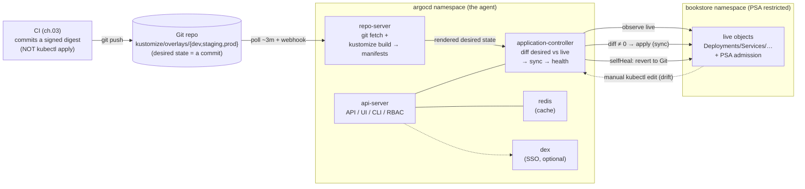

# 04 — GitOps with Argo CD

> **GitOps principles** (the desired state is declarative, versioned in Git,
> and continuously *pulled* and reconciled by an in-cluster agent — Git is the
> single source of truth; push-CD vs pull-GitOps); **Argo CD architecture**
> (api-server, repo-server, application-controller, redis, dex; the reconcile
> loop; desired-in-Git vs live diff); the **`Application`** (source/destination/
> syncPolicy automated prune+selfHeal/syncOptions/ignoreDifferences),
> **`AppProject`** (multi-tenant guardrails), **App-of-Apps & ApplicationSets**;
> **sync waves & resource hooks** (the db-migrate Job as a PreSync/Sync-wave
> example — contrast the Helm hook from [ch.01](01-packaging-helm.md));
> **drift detection & self-heal**; health/sync status; private repos, SSO,
> RBAC; bootstrapping Argo itself; **rollback = `git revert`** — applied by
> having Argo CD reconcile the **real 6b Kustomize overlays**
> ([ch.02](02-packaging-kustomize.md)) that [ch.03](03-cicd-pipeline.md)'s CI
> commits digests into.

**Estimated time:** ~30 min read · ~90 min hands-on
**Prerequisites:** [Part 07 ch.02](02-packaging-kustomize.md) — overlays Argo will reconcile · [Part 07 ch.03](03-cicd-pipeline.md) — CI is what commits the digests Argo deploys · [Part 05 ch.01](../05-security/01-authn-authz-rbac.md) — RBAC + AppProject is how Argo gets least privilege
**You'll know after this:** • articulate GitOps principles (declarative, versioned, pulled, reconciled) and push-CD vs pull-GitOps · • configure an Argo CD `Application` with automated sync, prune and self-heal · • use AppProjects, App-of-Apps and ApplicationSets for multi-team isolation · • order resources with sync waves and PreSync/Sync hooks (db-migrate Job) · • have Argo CD reconcile the Bookstore overlays and recover via `git revert`

<!-- tags: gitops, argo-cd, platform-engineering, ci-cd, drift -->

## Why this exists

[ch.01](01-packaging-helm.md)–[ch.02](02-packaging-kustomize.md) packaged the
Bookstore (Helm chart, Kustomize base+overlays). [ch.03](03-cicd-pipeline.md)
built a pipeline whose **last act is a commit** — `kustomize edit set image
…@sha256:<DIGEST>` into `overlays/prod`, not a `kubectl apply`. Both chapters'
Production notes ended on the same sentence: *"GitOps reconciles; humans rarely
run `helm install` / `kubectl apply -k`."* This chapter is that sentence made
real, and it closes the loop ch.03 deliberately left open.

The problem with the alternative — **push-based CD**, where CI holds a
kubeconfig and runs `kubectl apply`/`helm upgrade` — is fourfold, and every
part of this guide has been building toward naming it:

1. **The cluster's truth is unknowable.** "What is actually running, and does
   it match what we intended?" has no answer when the truth is "whatever
   sequence of `kubectl apply` some pipeline ran". There is no diff.
2. **Drift is silent.** Someone `kubectl edit`s a Deployment at 2am to mitigate
   an incident and never reverts it. The next deploy may or may not overwrite
   it. Configuration rots.
3. **CI holds production's keys.** A long-lived, broadly-scoped kubeconfig in a
   CI secret is a credential as dangerous as Helm 2's Tiller
   ([ch.01](01-packaging-helm.md)) — every pipeline run can do anything to
   prod.
4. **Rollback is improvised.** "Put it back to before the 14:00 deploy" means
   reconstructing an apply history nobody recorded.

**GitOps** inverts the direction: the **desired state is declarative and lives
in Git** (the Bookstore's Kustomize overlays — already deterministic,
already RootOnly-safe, *built for this* in [ch.02](02-packaging-kustomize.md)),
and an **agent inside the cluster continuously pulls it, diffs it against
live, and reconciles**. Git is the single source of truth: the cluster's state
is *defined* by a commit, drift is *detected and corrected*, CI holds **no
cluster credential** (it only proposes commits — [ch.03](03-cicd-pipeline.md)),
and rollback is `git revert`. **Argo CD** is the agent. This is the *Building
Platform Services* concern; *Argo CD Up & Running* is the reference.

## Mental model

**GitOps = a control loop whose desired state is a Git commit and whose
controller runs inside the cluster.**

- **Declarative.** The whole Bookstore is described as data (the Kustomize
  overlays), never as a sequence of imperative commands. "What should run" is a
  file, not a runbook.
- **Versioned & immutable.** That data lives in Git. Every change is a commit:
  reviewable, attributable, revertible. The deployed version *is* a Git SHA.
- **Pulled, not pushed.** An **in-cluster agent** (Argo CD) reads Git and
  applies it. Nothing outside the cluster needs apply rights — the trust
  boundary moves from "every CI job" to "one scoped controller".
- **Continuously reconciled.** The agent doesn't apply once; it loops: fetch
  Git → render (`kustomize build`) → diff desired vs live → if different, sync
  → repeat (every ~3 min, and on webhook). **Drift is not just detected, it is
  corrected** (self-heal): a manual `kubectl edit` is reverted to Git.
- **Git is the only write path to the cluster.** Deploy = commit. Rollback =
  `git revert` (a new commit that the loop reconciles back). Promotion = a
  commit moving a digest between overlays ([ch.03](03-cicd-pipeline.md)).
  Disaster recovery = point a fresh Argo CD at the same Git and it rebuilds
  the world.

The trap to keep in view: GitOps makes **Git the production control plane**,
so a plaintext Secret committed to Git is a plaintext Secret in your control
plane forever (Git history is immutable too). The discipline — foreshadowed by
every demo-Secret warning since Part 03 ch.02, and by the prod overlay's
`$patch: delete` of `db-credentials` ([ch.02](02-packaging-kustomize.md)) — is
**never plaintext secrets in Git**; use Sealed Secrets / SOPS / External
Secrets. GitOps amplifies both the discipline and its absence.

## Diagrams

### The GitOps reconcile loop: git ↔ repo-server ↔ app-controller ↔ cluster (Mermaid)

Argo CD's actual architecture and loop, reconciling the Bookstore's real
Kustomize overlays.



### App-of-Apps tree (ASCII)

```
 APP-OF-APPS — one root bootstraps the whole environment set ────────────────
   kubectl apply -n argocd -f argocd/00-appproject.yaml      (the guardrail)
   kubectl apply -n argocd -f argocd/01-app-of-apps.yaml     (the ONE bootstrap)
        │
   Application: bookstore-root      source.path = argocd/apps/  (directory)
        │   (Argo syncs the directory of child Application manifests)
        ├── Application: bookstore-dev      → kustomize/overlays/dev      (45)
        ├── Application: bookstore-staging  → kustomize/overlays/staging  (49)
        └── Application: bookstore-prod     → kustomize/overlays/prod     (48)
                                              ▲
                                              └─ CI (ch.03) commits the
                                                 signed digest here → Argo syncs

   ALL are argoproj.io/v1alpha1 in the `argocd` namespace; the WORKLOADS land
   in `bookstore` (destination.namespace). AppProject `bookstore` scopes
   every child: only this repo, only the bookstore ns, only PriorityClass
   cluster-wide. ApplicationSet (a generator) is the scale-up of this same
   idea — one template, N generated Apps (per env / per cluster).
```

## Hands-on with the Bookstore

**Assumed working directory: the guide repo root (`full-guide/`).** This
chapter adds the [`examples/bookstore/argocd/`](../examples/bookstore/argocd/)
tree (an `AppProject`, an App-of-Apps root, and three per-env `Application`s)
and operates it. It does **not** modify the Kustomize tree
([ch.02](02-packaging-kustomize.md)) — Argo CD *consumes* it unchanged.

> **The honest local-vs-real-Git story (read this first).** GitOps's whole
> premise is *an agent pulling from a Git remote*. A laptop kind cluster has no
> such remote, and `https://github.com/your-org/bookstore` in the manifests is
> a **clearly-labelled generic placeholder**. So this Hands-on shows **both**:
> (a) the **conceptual real-remote flow** (what you do with an actual repo —
> push, Argo polls/webhooks, syncs), and (b) a **runnable local
> approximation** that points Argo CD at this repo via a path so you can watch
> a real reconcile, drift self-heal, and `argocd app diff` on your machine.
> Where a real remote/registry is genuinely required it is called out — the
> same established honesty as the Helm/Kustomize/Cosign chapters, not a
> hand-wave.

### 0. Prerequisites — fresh cluster + the four images (self-bootstrapping)

Identical self-bootstrap to every prior chapter (Argo CD installs into its
**own** non-restricted `argocd` namespace; only the four `bookstore/*:dev`
images are `kind load`ed — `postgres:16`/`redis:7`/`rabbitmq:3.13-management`
pull from the registry):

```sh
kind delete cluster --name bookstore 2>/dev/null || true
kind create cluster --name bookstore
kubectl cluster-info

cd examples/bookstore/app
for s in catalog orders payments-worker storefront; do docker build -t bookstore/$s:dev ./$s; done
cd ../../..
for s in catalog orders payments-worker storefront; do kind load docker-image bookstore/$s:dev --name bookstore; done
```

> **Self-bootstrapping note.** After any `kind delete && kind create` you must
> re-`kind load` the four images and re-run the install + apply chain below — a
> fresh cluster has neither Argo CD nor the images. The chain is: install Argo
> CD → apply the AppProject → apply the App-of-Apps (or, for the local
> approximation, the per-env App pointed at a local path).

### 1. Install Argo CD (Helm, into its own namespace)

Per this guide's rule — **prefer Helm / official-stable, never a
`releases/latest/download/<PINNED-FILE>.yaml`** (it 404s when a new release
ships). Argo CD's official Helm chart is in the `argo` repo:

```sh
helm repo add argo https://argoproj.github.io/argo-helm
helm repo update
kubectl create namespace argocd
helm install argocd argo/argo-cd -n argocd --wait
# (argo/argo-cd installs the api-server, repo-server, application-controller,
#  redis, and dex. The argocd ns is NOT PSA-restricted — Argo's own components
#  are not restricted-shaped, exactly like the monitoring/keda stacks in Part
#  06; the Bookstore it manages still lands in the restricted `bookstore` ns.)
kubectl -n argocd rollout status deploy/argocd-server
kubectl get pods -n argocd
```

Installing Argo CD created the `argoproj.io` CRDs (`Application`,
`AppProject`, …). **This is what makes the manifests below dry-runnable** —
before this step, a client dry-run of any of them prints `no matches for kind
"Application"` (the documented CRD-intrinsic behaviour; see step 6).

The `argocd` CLI (optional but used below) and first-run password:

```sh
brew install argocd      # or: see argo-cd.readthedocs.io/en/stable/cli_installation/
kubectl -n argocd get secret argocd-initial-admin-secret \
  -o jsonpath='{.data.password}' | base64 -d; echo
kubectl -n argocd port-forward svc/argocd-server 8080:443 &   # UI: https://localhost:8080
argocd login localhost:8080 --username admin --insecure       # password from above
```

### 2. Apply the AppProject and the App-of-Apps (the real-remote flow)

**Conceptual real-remote flow** — with an actual Bookstore repo you would:
push this guide's tree to `https://github.com/<YOU>/bookstore`, set `repoURL`
in
[`argocd/00-appproject.yaml`](../examples/bookstore/argocd/00-appproject.yaml)
and the four Application files to it, then:

```sh
# (real Git remote in repoURL) — the entire bootstrap is TWO applies:
kubectl apply -n argocd -f examples/bookstore/argocd/00-appproject.yaml
kubectl apply -n argocd -f examples/bookstore/argocd/01-app-of-apps.yaml
# Argo CD now: fetches the repo, syncs argocd/apps/ (the App-of-Apps), which
# creates bookstore-dev/staging/prod, each of which `kustomize build`s its
# overlay and reconciles it into the `bookstore` namespace. You applied 2
# objects; Argo applied the entire app, three environments, from Git.
```

The `AppProject` is the **guardrail**: `sourceRepos` allows only the Bookstore
repo, `destinations` only the `bookstore` namespace on the in-cluster API,
`clusterResourceWhitelist` only `PriorityClass` (the base's three 35-
objects), and a `namespaceResourceBlacklist` so a tenant cannot mint its own
`ResourceQuota`/`LimitRange`. Any child Application that violates it is
**rejected by Argo CD**, not merely warned.

Watch it converge (real-remote):

```sh
argocd app list                                  # bookstore-root + 3 children
argocd app get bookstore-dev                     # Sync: Synced, Health: Healthy
kubectl get pods -n bookstore                    # the real workloads, reconciled
kubectl get ns bookstore -o jsonpath='{.metadata.labels}' | tr ',' '\n' | grep pod-security
# pod-security.kubernetes.io/enforce:restricted  ← the BASE shipped the ns
#   (CreateNamespace=false — Argo did NOT make a bare, label-less namespace)
```

### 3. Runnable local approximation (no Git remote)

Without a remote, point one Application's `source` at this repo's path through
a **local Git served to the cluster**. The minimal, reproducible way on kind:

```sh
# Serve THIS repo over file:// inside a tiny in-cluster git http server, OR —
# simplest and fully runnable — use Argo CD's support for a directory the
# repo-server can reach by initializing the guide repo as a git repo and
# adding it as a local file repo:
git -C "$(pwd)" rev-parse --is-inside-work-tree >/dev/null 2>&1 || git init -q
# Point a throwaway Application at the dev overlay via the cluster-internal
# path. The schema is identical to apps/bookstore-dev.yaml; only repoURL
# changes to a reachable location. (A real remote needs no such trick — this
# is purely the laptop substitute the honesty note promised.)
argocd app create bookstore-dev-local \
  --repo https://github.com/your-org/bookstore.git \
  --path examples/bookstore/kustomize/overlays/dev \
  --dest-server https://kubernetes.default.svc \
  --dest-namespace bookstore \
  --sync-policy automated --self-heal \
  --sync-option CreateNamespace=false
#   ^ With a REAL fork in --repo this syncs for real. With the placeholder it
#     will report the repo unreachable — EXPECTED and the point of the honesty
#     note: GitOps needs a real Git remote. Substitute your fork's URL (after
#     `git push`ing this guide's tree to it) and the SAME command syncs the
#     real 6b dev overlay end-to-end.
```

For a guaranteed-runnable end-to-end loop on a laptop, fork/push this guide's
repo (any Git host the cluster can reach) and use that URL — every command
above then works verbatim. The schema of the throwaway App is **byte-identical**
to
[`apps/bookstore-dev.yaml`](../examples/bookstore/argocd/apps/bookstore-dev.yaml)
except `repoURL`; nothing about the GitOps mechanics is faked, only the repo
location is substituted.

### 4. Demo: drift detection & self-heal (the "kubectl edit gets reverted")

With `bookstore-dev` Synced (real remote or fork), mutate a live object **out
of band** and watch Argo CD revert it — the property push-CD cannot give you:

```sh
# Drift it: scale catalog by hand (NOT via Git). dev has no HPA, so this is a
# clean test of self-heal (no autoscaler also writing replicas).
kubectl scale deployment/catalog -n bookstore --replicas=5
kubectl get deploy catalog -n bookstore        # READY 5/5 momentarily
argocd app get bookstore-dev                    # Sync status flips to OutOfSync
# selfHeal: true → the application-controller re-applies Git's desired state.
# Within a reconcile it is reverted to the overlay's count (dev = 1):
kubectl get deploy catalog -n bookstore -w      # → back to 1/1 (Git won)
argocd app get bookstore-dev                    # Synced / Healthy again
```

This is **drift correction**, not just detection: Git is the truth, and the
cluster is *continuously made to match it*. (In staging/prod the catalog HPA
*legitimately* owns `.spec.replicas` — which is exactly why those Applications
set `ignoreDifferences` on that field; see step 7.)

### 5. Demo: `argocd app diff` and rollback = git revert

```sh
argocd app diff bookstore-dev                   # desired (Git) vs live — empty when Synced
# Make a Git change (e.g. bump a dev replica in overlays/dev), commit, push:
#   → argocd app diff shows the pending change; auto-sync applies it.
# ROLLBACK is a Git operation, not a kubectl one:
git revert <BAD-COMMIT> && git push             # a NEW commit that undoes it
#   → Argo CD reconciles the revert; the cluster returns to the prior state.
argocd app history bookstore-dev                 # Argo's record of synced revisions
argocd app rollback bookstore-dev <REVISION>     # (Argo-side convenience; the
#   durable source of truth is still Git — prefer `git revert` so the repo and
#   the cluster never disagree.)
```

### 6. Sync waves & resource hooks — the db-migrate Job (contrast ch.01)

[ch.01](01-packaging-helm.md)'s chart ran the schema migration as a **Helm
`post-install,post-upgrade` hook** — sequenced by the *Helm lifecycle event*.
Argo CD has no Helm lifecycle; it sequences with **sync waves** and **resource
hooks**, set via annotations on the object itself:

```yaml
# Conceptual: annotate the db-migrate Job so Argo CD runs it as a PreSync hook
# (before the app objects in the same sync) — the GitOps analog of ch.01's
# Helm post-* hook. (Shown as the pattern; the Bookstore's Job in the base is
# applied as an ordinary wave-0 object — see note below.)
metadata:
  annotations:
    argocd.argoproj.io/hook: PreSync                 # run BEFORE the sync
    argocd.argoproj.io/hook-delete-policy: BeforeHookCreation
    # or, for ordinary objects, order with waves (lower = earlier):
    # argocd.argoproj.io/sync-wave: "-1"
```

How Argo CD orders a sync: objects are grouped by **sync-wave** (ascending;
default `0`), and within the standard sequence **PreSync hooks → Sync (the
waves) → PostSync hooks**. So a `PreSync` `db-migrate` Job runs to completion
*before* the Deployments in the same sync — the GitOps equivalent of ch.01's
"Postgres exists, then migrate, then the app". **Contrast with the Helm hook:**
Helm's ordering is tied to its *release lifecycle* (`post-install` fires after
Helm applies normal objects); Argo's ordering is tied to the *sync* (waves +
PreSync/Sync/PostSync), with no release object — same goal (deterministic
ordering raw `kubectl apply -f .` lacked), different mechanism.

> **The Bookstore's actual choice (honest).** The Kustomize base applies
> `21-db-migrate-job.yaml` as an ordinary object (wave 0). The migration is
> idempotent (`CREATE TABLE IF NOT EXISTS`) and the services degrade
> gracefully if the schema is briefly absent (Part 03 ch.02 / ch.01), so a
> wave/hook is not *required* for correctness here — but adding the
> `argocd.argoproj.io/sync-wave: "-1"` (or `PreSync` hook) annotation is the
> idiomatic way to guarantee migrate-before-app under Argo CD, and is the
> direct analog of ch.01's Helm hook. The annotation is the only change; the
> Job is otherwise the same object.

### 7. The CRD-intrinsic dry-run (documented, like every prior CRD object)

Every file under `argocd/` is `argoproj.io/v1alpha1`. On a cluster **without**
Argo CD installed:

```sh
kubectl apply --dry-run=client -f examples/bookstore/argocd/00-appproject.yaml
# error: ... no matches for kind "AppProject" in version "argoproj.io/v1alpha1"
kubectl apply --dry-run=client -f examples/bookstore/argocd/apps/bookstore-prod.yaml
# error: ... no matches for kind "Application" in version "argoproj.io/v1alpha1"
```

That is **expected and correct** — the *exact* precedent of the raw manifests
([`70-kyverno-policy.yaml`](../examples/bookstore/raw-manifests/70-kyverno-policy.yaml),
`18-`, `51-`, `80-`, `83-`), the Helm CRD toggles
([ch.01](01-packaging-helm.md)), and the Kustomize components
([ch.02](02-packaging-kustomize.md)): the manifest is **schema-correct**, but
the CRD must exist first. After step 1 (Argo CD installed) the same
`kubectl apply --dry-run=server -n argocd -f …` validates cleanly. Each file's
header documents this.

> **The `ignoreDifferences` correctness point (staging/prod).** `bookstore-dev`
> has no HPA (the dev overlay `$patch:delete`s it), so its Application needs no
> `ignoreDifferences`. `bookstore-staging`/`bookstore-prod` **keep the catalog
> HPA** (82-) — the HPA controller writes `.spec.replicas` at runtime while Git
> states a fixed count. Without `ignoreDifferences` on
> `Deployment/catalog /spec/replicas`, every autoscale event would make Argo
> see catalog `OutOfSync` and self-heal it back to the Git count — Argo
> fighting the autoscaler. Those two Applications set exactly that
> `ignoreDifferences`, so the **HPA owns replicas and Argo owns everything
> else**. (Same "who owns this field" rule as KEDA-owns-replicas in Part 06
> ch.04, and as the Rollout↔HPA interaction in [ch.05](05-progressive-delivery.md).)

Clean up:

```sh
argocd app delete bookstore-root --cascade        # prunes children → workloads
# or: kubectl delete -n argocd -f examples/bookstore/argocd/01-app-of-apps.yaml
helm uninstall argocd -n argocd
kind delete cluster --name bookstore
```

## How it works under the hood

- **The components and their jobs.** **api-server** serves the API/UI/CLI and
  enforces Argo's own RBAC. **repo-server** clones Git and *renders* the
  source — for the Bookstore it runs `kustomize build overlays/<ENV>`
  (exactly [ch.02](02-packaging-kustomize.md)'s pipeline; for a Helm source it
  runs `helm template`) — producing the desired manifests, cached in
  **redis**. **application-controller** is the reconcile loop: it compares the
  rendered desired state to the live cluster, computes a diff, **syncs**
  (applies) when they differ, and continuously reports **sync status**
  (Synced/OutOfSync) and **health** (Healthy/Progressing/Degraded). **dex** is
  optional SSO. Nothing here runs in the `bookstore` namespace — the agent is
  isolated in `argocd`.
- **The reconcile loop.** Every `--app-resync` interval (default ~180s), and
  immediately on a Git **webhook**, the controller: fetches the target
  revision, renders it, diffs against live (a structured three-way comparison,
  not a text diff — it understands Kubernetes objects and which fields the
  server defaults), and if `syncPolicy.automated` is set, applies the
  difference. `selfHeal: true` makes it also re-apply when the *live* side
  drifts (not just when Git changes) — that is what reverts a manual
  `kubectl edit`. `prune: true` deletes live objects no longer in Git.
- **Why a deterministic, RootOnly-safe source matters.** [ch.02](02-packaging-kustomize.md)
  insisted the overlays render **deterministically** (no `now`/random) and
  with the **default RootOnly loader** (vendored base, no `../../raw-manifests`
  escape). This is *why*: a non-deterministic render would diff against itself
  every loop (permanent false `OutOfSync`); a loader-flag-needing source would
  fail in `repo-server` exactly as it would in `kubectl apply -k`. The
  Bookstore's Kustomize tree was built to be reconciled.
- **`Application` vs `AppProject`.** An **`Application`** is one
  source→destination reconciliation unit (repo/path/targetRevision →
  cluster/namespace, plus syncPolicy). An **`AppProject`** is the *tenant
  boundary* a set of Applications runs inside: allowed `sourceRepos`,
  `destinations`, cluster/namespace resource allow/deny-lists, and project
  RBAC roles. The controller refuses any Application that strays outside its
  project — the multi-tenant guardrail that makes self-service Argo safe.
  **The guardrail must allow exactly what the source actually declares.** A
  `clusterResourceWhitelist` is *allow-list* semantics: any cluster-scoped
  kind **not** listed is **rejected** — so the Bookstore project must
  whitelist **both** the cluster-scoped `Namespace` (the base's
  `00-namespace.yaml`, which carries the PSA-`restricted` labels) **and** the
  `PriorityClass` (35-); omitting `Namespace` would forbid Argo, *by its own
  project*, from ever applying the base and the Application would never reach
  Synced. The mirror trap is the `namespaceResourceBlacklist`: in a real
  **multi-tenant platform** capacity policy (`ResourceQuota`/`LimitRange`) is
  *platform-managed*, so the tenant project denies tenants from declaring
  their own — but for this **single-tenant lab** the base *owns* the Quota and
  LimitRange, so denying them would make the Application perpetually
  `OutOfSync` (Argo forbidden from applying objects its own source declares).
  The Bookstore `AppProject` therefore whitelists Namespace+PriorityClass and
  leaves the blacklist empty, with the production multi-tenant stance shown
  commented in the manifest. The rule generalises: **scope an `AppProject` to
  exactly the resources its Applications' sources render — tighter rejects
  your own sync, looser widens the blast radius.**
- **App-of-Apps & ApplicationSet.** An **App-of-Apps** is just an Application
  whose source is a *directory of other Application manifests* — apply one,
  get many (the Bookstore's `bookstore-root` → `apps/` → dev/staging/prod).
  **ApplicationSet** is the controller-driven scale-up: a *generator* (list,
  Git directory, cluster, matrix, …) plus one Application *template* produces
  N Applications — the right tool for "one App per environment" or "one App
  per cluster" without hand-writing each (Argo CD Up & Running, ch.10).
- **Sync waves & hooks vs the Helm hook.** Argo orders a sync by **sync-wave**
  (annotation, ascending) and the **PreSync → Sync → PostSync** hook phases
  (annotation `argocd.argoproj.io/hook`). This is the GitOps analog of
  [ch.01](01-packaging-helm.md)'s Helm `post-install` migration hook — same
  outcome (deterministic ordering `kubectl apply -f .` lacked), but driven by
  the *sync* rather than a *Helm release lifecycle*, and with no in-cluster
  release Secret. A PreSync `db-migrate` Job is the GitOps form of "migrate
  before the app".
- **Health & status are first-class.** Argo ships health checks for built-in
  kinds (a Deployment is Healthy when its rollout completes) and lets you add
  Lua health for CRDs — which is how it knows an Argo **Rollout**
  ([ch.05](05-progressive-delivery.md)) is Progressing vs Healthy. Sync status
  ("does live == Git?") and health ("is what's running actually OK?") are
  orthogonal and both surfaced.
- **Rollback is `git revert`.** Argo keeps a history of synced revisions and
  offers `argocd app rollback`, but the durable truth is Git: a `git revert`
  is a new commit the loop reconciles, so the repo and the cluster never
  disagree. Disaster recovery is the same property at scale — a fresh Argo CD
  pointed at the same Git rebuilds every environment with no snapshot of the
  cluster needed.

## Production notes

> **In production: never commit plaintext Secrets — GitOps makes Git the
> control plane.** The Bookstore prod overlay `$patch: delete`s the demo
> `db-credentials` ([ch.02](02-packaging-kustomize.md)); a Secret of the same
> name is supplied **out of band** by **Sealed Secrets** (encrypted in Git,
> decrypted in-cluster by its controller), **SOPS** (Flux-native; KSOPS for
> Kustomize), or **External Secrets Operator** (syncs from Vault/cloud secret
> managers). Plaintext in Git is plaintext in your control plane *forever*
> (history is immutable). This is the demo-Secret warning from Part 03 ch.02
> made existential by GitOps.

> **In production: structure the repo for App-of-Apps / ApplicationSet, and
> separate config from app.** A common layout: an `apps/` repo (or directory)
> of Applications managed by one root, environments as overlays (this guide)
> or branches; an **ApplicationSet** with a Git-directory or cluster generator
> when env/cluster count grows. Keep the **deployment config repo** distinct
> from the **application source repo** so CI ([ch.03](03-cicd-pipeline.md))
> commits digests to config without touching code, and prod config can require
> a separate approval path.

> **In production: gate prod sync, and scope AppProjects tightly.** dev/staging
> can run fully `automated`; many orgs **omit `automated` for prod** (Argo
> still shows the diff/OutOfSync; a human runs `argocd app sync` after
> approving). Give each tenant a narrow `AppProject` (allowed repos,
> destinations, resource kinds, RBAC roles) — it is the blast-radius limiter,
> the GitOps analog of namespace RBAC. Enable **SSO (dex/OIDC)** and map
> groups to Argo RBAC; use **repository credentials** (deploy keys / a GitHub
> App) for private repos, never embedded tokens.

> **In production: multi-cluster and progressive sync.** One Argo CD can manage
> many clusters (register them; `destination.server` selects). An
> **ApplicationSet** with a cluster generator + **progressive sync strategy**
> rolls a change cluster-by-cluster (canary clusters first) — the
> infrastructure-level analog of [ch.05](05-progressive-delivery.md)'s
> per-Pod canary. Pair Argo CD app health with that for safe fleet-wide
> rollouts.

> **In production: disaster recovery is "re-point Argo at Git".** Because the
> entire desired state is in Git and Argo reconciles it, recovering a lost
> cluster is: stand up a cluster, install Argo CD, apply the App-of-Apps,
> wait. No cluster snapshot is the source of truth — Git is. Back up Argo CD's
> own config (its Applications/AppProjects/repo creds — themselves GitOps-able)
> and you can rebuild the control plane too. (Stateful data — the postgres PVC
> — still needs its own backup; that is Part 08 ch.02, GitOps recovers the
> *declarative* state, not the *data*.)

## Quick Reference

```sh
# Install Argo CD (Helm — never releases/latest/download/<PINNED>.yaml)
helm repo add argo https://argoproj.github.io/argo-helm && helm repo update
kubectl create namespace argocd
helm install argocd argo/argo-cd -n argocd --wait

# Bootstrap the Bookstore (TWO applies → the whole app, 3 envs, from Git)
kubectl apply -n argocd -f examples/bookstore/argocd/00-appproject.yaml
kubectl apply -n argocd -f examples/bookstore/argocd/01-app-of-apps.yaml

# Operate
argocd app list ; argocd app get bookstore-dev
argocd app diff bookstore-dev                 # desired (Git) vs live
argocd app sync bookstore-prod                # manual prod promotion (if not automated)
argocd app history bookstore-dev              # synced revisions; rollback = git revert
kubectl get applications,appprojects -n argocd
```

Minimal `Application` skeleton (the shape; full set in `examples/bookstore/argocd/`):

```yaml
apiVersion: argoproj.io/v1alpha1          # CRD — needs Argo CD installed
kind: Application
metadata: { name: bookstore-dev, namespace: argocd }
spec:
  project: bookstore                       # the AppProject guardrail
  source:
    repoURL: https://github.com/your-org/bookstore.git   # PLACEHOLDER
    targetRevision: main
    path: examples/bookstore/kustomize/overlays/dev       # real 6b overlay
  destination: { server: https://kubernetes.default.svc, namespace: bookstore }
  syncPolicy:
    automated: { prune: true, selfHeal: true }            # drift-correct
    syncOptions: [ CreateNamespace=false ]                # base owns the PSA ns
  ignoreDifferences:                                       # HPA owns replicas
    - { group: apps, kind: Deployment, name: catalog, jsonPointers: [ /spec/replicas ] }
```

Checklist:

- [ ] Desired state is **declarative, in Git**; deploy = commit, rollback =
      `git revert`; CI holds **no cluster credential** ([ch.03](03-cicd-pipeline.md))
- [ ] Argo CD installed via **Helm** into its own (non-restricted) `argocd`
      namespace; CRDs present (else the documented `no matches for kind`)
- [ ] `syncPolicy.automated` with **prune + selfHeal** (drift is *corrected*);
      `CreateNamespace=false` (the **base** owns the PSA-restricted Namespace)
- [ ] `AppProject` scopes repos/destinations/resource-kinds (multi-tenant
      guardrail); App-of-Apps (or ApplicationSet) bootstraps the env set
- [ ] `ignoreDifferences` on `Deployment/catalog /spec/replicas` where the HPA
      is on (staging/prod) — Argo must not fight the autoscaler
- [ ] **No plaintext Secrets in Git** (Sealed Secrets / SOPS / External
      Secrets); prod gated; SSO + repo creds for private repos
- [ ] Kustomize source renders **deterministically** + RootOnly-safe (so no
      false `OutOfSync`) — built that way in [ch.02](02-packaging-kustomize.md)

## Test your understanding

> Try each before opening the answer drawer. The act of trying is the exercise; the answer is the check.

1. **GitOps is described as a "control loop whose desired state is a Git commit." Name the four GitOps principles and how each manifests in Argo CD.**
   <details><summary>Show answer</summary>

   (1) **Declarative** — desired state is data, not commands (Kustomize overlays in Git, not a `kubectl apply` script). (2) **Versioned & immutable** — Git history is the deploy log; the running version *is* a SHA. (3) **Pulled, not pushed** — the application-controller in-cluster reads Git; nothing outside the cluster needs apply rights. (4) **Continuously reconciled** — the loop fetches Git → renders Kustomize → diffs → syncs every ~3min and on webhook; drift is corrected (self-heal). See §Mental model.

   </details>

2. **An operator did `kubectl edit deployment catalog -n bookstore` at 2am to mitigate an incident. Argo CD has `selfHeal: true`. What happens within the next reconcile, and why is this both a feature and a problem?**
   <details><summary>Show answer</summary>

   On the next reconcile (≤3min), Argo CD diffs live vs Git, sees the manual edit isn't in Git, and **reverts it** — self-heal restores the Git-defined state. This is exactly the feature: drift is corrected, not just detected. The *problem* is the operator's mitigation is gone without being recorded; the right pattern is "patch Git first (a hotfix commit), then let GitOps deploy". Self-heal makes "kubectl edit" a temporary diagnostic tool only.

   </details>

3. **You have an HPA on catalog that sets `spec.replicas` to 5. Argo CD's source has `spec.replicas: 3`. Without `ignoreDifferences`, what happens?**
   <details><summary>Show answer</summary>

   A reconcile war: Argo reconciles `replicas: 3` (per Git), the HPA observes high load and patches back to 5, Argo reconciles to 3 again, ... — the HPA and Argo fight forever. Add `ignoreDifferences` for `apps/Deployment/catalog /spec/replicas`: Argo continues to manage everything else but stops comparing or reverting that one field. Same pattern applies to VPA-managed `requests`, KEDA-managed scaling, and any controller-owned field.

   </details>

4. **Hands-on extension — `git revert` a deploy. With Argo CD reconciling `overlays/dev`, commit a deliberately-bad change (e.g., a non-existent image tag). Watch the Application show `Degraded`. Now `git revert HEAD && git push`. What happens?**
   <details><summary>What you should see</summary>

   Argo's webhook (or the next ~3min poll) picks up the revert commit, renders the previous good state, applies it, and the Application returns to `Healthy/Synced` — usually within 1-2 minutes. **No `kubectl rollout undo` was needed.** Your deploy log is `git log`; your rollback log is also `git log`. This is the operational payoff: every change goes through the same review/audit/revert path because the cluster has no other write surface.

   </details>

5. **A new team wants to deploy their service to your shared cluster via GitOps. What three Argo CD constructs would you set up to give them isolation without giving them a separate Argo instance?**
   <details><summary>Show answer</summary>

   (1) An **`AppProject`** that scopes their permitted `sourceRepos`, `destinations` (namespaces), and `clusterResourceWhitelist` — the multi-tenant guardrail at the Argo level. (2) An **`Application`** (or **`ApplicationSet`** if they have many envs) bound to that project. (3) **RBAC** on Argo CD itself (via the SSO/group integration) so they can manage their Applications but not other teams'. Combined with cluster-side RBAC + PSA on their namespaces, that's the multi-tenant GitOps blueprint.

   </details>

## Further reading

- **_Argo CD Up & Running_ (O'Reilly) — the whole book, especially ch.3 (Core
  Concepts: App/Project/sync model), ch.4–5 (Managing & Synchronizing
  Applications), ch.6 (RBAC & Projects), and ch.10 (Applications at Scale:
  App-of-Apps & ApplicationSet)** — the primary, end-to-end reference for
  everything in this chapter.
- **Rosso et al., _Production Kubernetes_, ch.11 — Building Platform Services**
  (GitOps as the delivery interface of an internal developer platform; where
  Argo CD sits relative to packaging and CI — the operational framing around
  the Argo-specific mechanics).
- Official: Argo CD docs — <https://argo-cd.readthedocs.io/en/stable/>
  (declarative setup:
  <https://argo-cd.readthedocs.io/en/stable/operator-manual/declarative-setup/>;
  sync waves & hooks:
  <https://argo-cd.readthedocs.io/en/stable/user-guide/sync-waves/>), and the
  GitOps principles from the CNCF OpenGitOps project
  <https://opengitops.dev/>.
