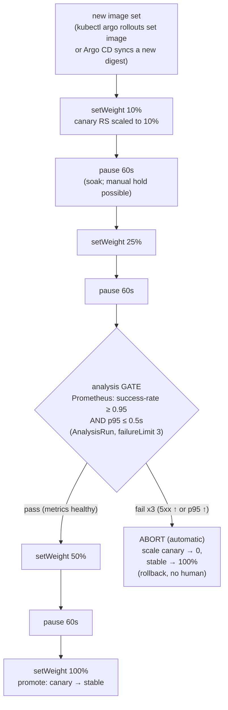

# 05 — Progressive delivery

> Why a RollingUpdate is **not** a safe release (it shifts 100% of users onto
> unverified code, just gradually); **blue-green vs canary vs experiment**;
> **Argo Rollouts** architecture (the `Rollout` CRD replacing a Deployment,
> ReplicaSet management, traffic routing options, the controller); **analysis**
> (`AnalysisTemplate`/`AnalysisRun`, metric providers — **Prometheus** using
> the Part 06 catalog metrics: success-rate = 1−rate(5xx)/rate(total), p95 from
> the duration histogram), automated promotion and **automated rollback on
> failed analysis**; **Flagger** as the mesh-operator alternative; the
> **Argo CD + Rollouts** story (a `Rollout` is just a CRD Argo syncs); manual
> gates; metric honesty — applied by converting the **catalog** Deployment
> ([ch.04](04-gitops-argocd.md) syncs it) into a metric-gated canary `Rollout`
> with automatic rollback.

**Estimated time:** ~30 min read · ~90 min hands-on
**Prerequisites:** [Part 07 ch.04](04-gitops-argocd.md) — Argo syncs the `Rollout` CRD just like a Deployment · [Part 01 ch.08](../01-core-workloads/08-deployment-strategies.md) — RollingUpdate gradually shifts 100% of users · [Part 06 ch.01](../06-production-readiness/01-observability-metrics.md) — Prometheus is the analysis-metric source
**You'll know after this:** • distinguish blue-green, canary and experiment release strategies · • convert a Deployment into an Argo Rollouts `Rollout` with traffic steps · • write `AnalysisTemplate`/`AnalysisRun` against Prometheus (success-rate and p95) · • set up automated promotion and automated rollback on failed analysis · • run the Bookstore catalog as a metric-gated canary end-to-end

<!-- tags: argo-rollouts, gitops, observability, ci-cd -->

## Why this exists

[ch.04](04-gitops-argocd.md) made the Bookstore deploy itself from Git — Argo
CD reconciles the Kustomize overlays, CI ([ch.03](03-cicd-pipeline.md)) commits
signed digests, drift self-heals. But *how* a new catalog image reaches 100% of
users is still the Part 01 ch.08 **RollingUpdate**: `maxSurge: 1,
maxUnavailable: 0` replaces old Pods with new ones, a few at a time, until
**every** request hits the new version. That is a safe *availability*
mechanism (no downtime) — it is **not** a safe *release* mechanism. If the new
catalog image has a latency regression or a 5xx bug, RollingUpdate cheerfully
moves **all** of production onto it; the only feedback is users complaining and
a human racing to `kubectl rollout undo`. "Gradual" is not "verified".

A real release wants the opposite default: send the new version a **small
slice** of traffic, **measure it against the old one** with the very signals
Part 06 ch.01 built (error rate, p95 latency), and **only proceed if the
metrics say it's healthy** — otherwise **roll back automatically, before most
users ever saw it**. That is **progressive delivery**: limit the blast radius,
gate progression on evidence, automate the rollback. Part 01 ch.08 taught the
*manual* form (`30-catalog-canary.yaml`: two Deployments, traffic ≈ replica
ratio, ramp/abort by `kubectl scale`). This chapter automates it and adds the
metric gate — the *Application Considerations* concern; Argo Rollouts is the
tool, with Flagger as the alternative.

## Mental model

**Progressive delivery = a release is a controlled experiment with an
automatic abort, not a state transition.**

- **RollingUpdate vs progressive.** RollingUpdate's goal is *stay available
  while replacing Pods*; progress is unconditional. A **canary** /
  **blue-green** rollout's goal is *prove the new version on a slice before
  committing*; progress is **conditional on metrics**.
- **Three shapes.** **Canary** — run vN+1 alongside vN, send it a growing
  fraction (10→25→50→100%), measure each step, promote or abort.
  **Blue-green** — stand up vN+1 fully (green) beside vN (blue), cut 100% over
  at once after a check, instant rollback by cutting back. **Experiment** —
  run vN+1 (and variants) for a fixed window purely to *measure*, not to
  release (A/B). The Bookstore uses **canary** — the natural successor to Part
  01 ch.08's manual canary.
- **The `Rollout` replaces the Deployment.** Argo Rollouts is a controller +
  the **`Rollout`** CRD. A `Rollout` *is* a Deployment-shaped object (same
  `spec.template` Pod template) plus a `strategy.canary` of **steps**
  (`setWeight`, `pause`, `analysis`). The controller manages the stable and
  canary **ReplicaSets**, scaling them to match the step weights.
- **Analysis is the gate.** An **`AnalysisTemplate`** is a reusable query
  against a **metric provider** (Prometheus here) with a `successCondition`
  and a `failureLimit`. A canary `analysis` step spawns an **`AnalysisRun`**;
  while it passes, the rollout proceeds; when it fails `failureLimit` times,
  the rollout **aborts and the controller automatically scales the canary to
  zero and the stable back to 100%** — automated rollback, no human.
- **It composes with everything prior.** A `Rollout` is just a CRD — Argo CD
  ([ch.04](04-gitops-argocd.md)) syncs it from Git like any object (GitOps +
  progressive delivery, together). The metric queries are the *same PromQL*
  Part 06 ch.01 wrote against the *same* catalog `/metrics`. The Pod template
  is catalog's *exact restricted* template.

The trap to keep in view: the gate is only as honest as the metrics. A canary
with no traffic emits no errors and no latency — analysis would "pass" on
silence. The discipline (and the *metric honesty* this chapter is explicit
about): **drive real traffic during analysis**, query bounded RED signals, and
guard the PromQL so "no data" is a defined value, not NaN. The demo catalog
binary emits `http_requests_total` + a duration histogram for real; whether it
emits **5xx on demand** is the one illustrative part — so this chapter gives an
honest way to *induce* errors to see the auto-rollback fire.

## Diagrams

### Canary step + analysis-gate progression, with the auto-rollback branch (Mermaid)

The catalog Rollout's actual flow
([`examples/bookstore/argocd/rollouts/catalog-rollout.yaml`](../examples/bookstore/argocd/rollouts/catalog-rollout.yaml)).



### Blue-green vs canary (ASCII)

```
 BLUE-GREEN ─────────────────────────────────────────────────────────────────
   vN (blue)  ████████████  100% traffic
   vN+1(green) ░░░░░░░░░░░░  0%  (fully deployed, idle, smoke-tested)
        │ cutover (flip the Service/route)        rollback = flip back (instant)
   vN (blue)  ░░░░░░░░░░░░  0%
   vN+1(green) ████████████  100%
   + instant switch & rollback   − 2x resources during; blast radius = ALL at cut

 CANARY (the Bookstore) ─────────────────────────────────────────────────────
   vN  ██████████ 90 │ ███████▌ 75 │ █████ 50 │ ░ 0
   vN+1 █ 10         │ ██▌ 25      │ █████ 50 │ ██████████ 100
        └ measure ──┘ └ ANALYSIS ─┘ └ measure┘   promote
   each step gated by metrics; FAIL → auto scale canary→0, stable→100
   + tiny blast radius, evidence-gated   − slower; needs good metrics + traffic

 EXPERIMENT — run variants for a fixed window to MEASURE only (A/B), not release.
```

## Hands-on with the Bookstore

**Assumed working directory: the guide repo root (`full-guide/`).** This
chapter adds
[`examples/bookstore/argocd/rollouts/`](../examples/bookstore/argocd/rollouts/)
(the catalog `Rollout` + two `AnalysisTemplate`s). The `Rollout` **replaces**
the catalog Deployment; its Pod template is `10-catalog-deploy.yaml`'s
template **verbatim** (same restricted SC, scheduling layer, probes,
ConfigMap/Secret env, byte-identical `DB_DSN`).

We will: (0) fresh cluster + images; (1) install Argo Rollouts (Helm) + the
kubectl plugin; (2) prereqs + Prometheus; (3) apply the Rollout and watch a
**passing** canary auto-promote; (4) **induce errors** and watch analysis
**fail and auto-roll-back**.

### 0. Prerequisites — fresh cluster + the four images (self-bootstrapping)

```sh
kind delete cluster --name bookstore 2>/dev/null || true
kind create cluster --name bookstore
kubectl cluster-info

cd examples/bookstore/app
for s in catalog orders payments-worker storefront; do docker build -t bookstore/$s:dev ./$s; done
cd ../../..
for s in catalog orders payments-worker storefront; do kind load docker-image bookstore/$s:dev --name bookstore; done
```

> **Self-bootstrapping note.** After any `kind delete && kind create` you must
> re-`kind load` the four images and re-run the install + apply chain below
> (install Argo Rollouts → apply prereqs + Prometheus → apply the
> AnalysisTemplates → apply the Rollout). A fresh cluster has none of it.

### 1. Install Argo Rollouts + the kubectl plugin

Per this guide's rule — **Helm / official-stable, never a
`releases/latest/download/<PINNED-FILE>.yaml`** (it 404s on a new release).
Argo Rollouts' Helm chart is in the same `argo` repo as Argo CD
([ch.04](04-gitops-argocd.md)); it installs into its **own** non-restricted
`argo-rollouts` namespace:

```sh
helm repo add argo https://argoproj.github.io/argo-helm
helm repo update
kubectl create namespace argo-rollouts
helm install argo-rollouts argo/argo-rollouts -n argo-rollouts --wait
kubectl -n argo-rollouts rollout status deploy/argo-rollouts
# (its own ns — like argocd / monitoring / keda — not PSA-restricted; the
#  catalog Pods it manages still land in the restricted `bookstore` ns.)

# The kubectl plugin (best Rollout UX). Pinned/Helm-style, NOT a
# latest/download-of-a-version-pinned-file pattern:
brew install argoproj/tap/kubectl-argo-rollouts
#   Linux: download the plugin binary from the project's releases page (see
#   argoproj.github.io/argo-rollouts/installation/) and chmod +x it.
kubectl argo rollouts version
```

Installing the controller created the `argoproj.io` Rollout CRDs. **That is
what makes the manifests dry-runnable** — before this, a client dry-run prints
`no matches for kind "Rollout"` (the documented CRD-intrinsic behaviour;
step 4).

### 2. Catalog prereqs + Prometheus (the analysis needs real metrics)

The analysis queries Prometheus for catalog metrics, so the metrics pipeline
must exist **before** the rollout demo (per the rule: enable what a demo
depends on *first*, not as a trailing caveat). Apply catalog's dependencies,
install kube-prometheus-stack (Part 06 ch.01), and point its ServiceMonitor at
catalog:

```sh
# catalog prereqs (NOT 10-catalog-deploy.yaml — the Rollout REPLACES it; and
# NOT 82-hpa-catalog.yaml — the Rollout owns replicas, see the §4 HPA note):
kubectl apply -f examples/bookstore/raw-manifests/00-namespace.yaml
kubectl apply -f examples/bookstore/raw-manifests/05-serviceaccounts-rbac.yaml
kubectl apply -f examples/bookstore/raw-manifests/15-catalog-config.yaml
kubectl apply -f examples/bookstore/raw-manifests/16-db-credentials.yaml
kubectl apply -f examples/bookstore/raw-manifests/35-priorityclasses.yaml
kubectl apply -f examples/bookstore/raw-manifests/40-services.yaml      # the shared `catalog` Service

# Prometheus (Part 06 ch.01 — its own non-restricted `monitoring` ns):
helm repo add prometheus-community https://prometheus-community.github.io/helm-charts
helm repo update
kubectl create namespace monitoring
helm install kube-prometheus-stack prometheus-community/kube-prometheus-stack \
  -n monitoring --wait
# Scrape catalog (the ServiceMonitor's `release: kube-prometheus-stack` label
# MUST match Prometheus's selector — Part 06 ch.01's load-bearing note):
kubectl apply -f examples/bookstore/raw-manifests/80-servicemonitor.yaml
```

### 3. Apply the Rollout — watch a passing canary auto-promote

```sh
kubectl apply -f examples/bookstore/argocd/rollouts/analysistemplate-success-rate.yaml
kubectl apply -f examples/bookstore/argocd/rollouts/analysistemplate-latency.yaml
kubectl apply -f examples/bookstore/argocd/rollouts/catalog-rollout.yaml

# First apply = the initial revision (canary steps are SKIPPED on the very
# first rollout — there is no "stable" to canary against yet). It comes up at
# `replicas: 4`, all restricted-admitted:
kubectl argo rollouts get rollout catalog -n bookstore --watch
kubectl get pods -n bookstore -l app=catalog        # 4/4 Running (PSA restricted OK)
```

Now trigger a **real canary** by changing the image (this is what Argo CD
would do when CI commits a new digest — [ch.03](03-cicd-pipeline.md)/[ch.04](04-gitops-argocd.md)).
Re-tag the same image so it actually rolls (the binary is identical, so
metrics stay healthy → the canary should **pass and auto-promote**):

```sh
# Drive traffic FIRST so analysis has real RED signals to measure (a silent
# canary is the metric-honesty trap — the guarded PromQL treats "no data" as
# healthy, but you want a real measurement). Restricted-compliant load Pod in
# `bookstore` (PSA enforce:restricted) via --overrides, same technique as
# Part 06 ch.01/ch.04:
kubectl run loadgen -n bookstore --restart=Never \
  --image=curlimages/curl:8.10.1 \
  --overrides='{"spec":{"securityContext":{"runAsNonRoot":true,"runAsUser":65534,"seccompProfile":{"type":"RuntimeDefault"}},"containers":[{"name":"loadgen","image":"curlimages/curl:8.10.1","command":["sh","-c","while true; do curl -s -o /dev/null http://catalog.bookstore.svc.cluster.local/books; done"],"securityContext":{"allowPrivilegeEscalation":false,"capabilities":{"drop":["ALL"]},"readOnlyRootFilesystem":true}}]}}'

# Trigger the canary (new image ref → Rollout starts the canary steps):
kubectl argo rollouts set image catalog -n bookstore \
  catalog=bookstore/catalog:dev
kubectl argo rollouts get rollout catalog -n bookstore --watch
#  10% → pause 60s → 25% → pause 60s → ANALYSIS (success-rate ≥0.95 &&
#  p95 ≤0.5s, sampled 5x/20s) → 50% → pause → 100% promote. With healthy
#  metrics the AnalysisRun passes and the canary is promoted automatically.
kubectl get analysisrun -n bookstore                 # Successful
kubectl delete pod loadgen -n bookstore              # stop the load
```

### 4. Induce errors — watch analysis FAIL and auto-roll-back

The honest part (metric honesty): the demo binary serves `/books` fine, so to
*see the rollback* you must make the canary actually unhealthy. The cleanest,
reproducible way is to make the canary Pods fail readiness/serve errors by
pointing the **canary** at a broken config — but the simplest honest lever is
to **flood with a bad path** so the catalog returns 404s and drive the
success-rate query below threshold, *and* point the analysis at a handler that
errors. Concretely, induce 5xx by overloading catalog past its tiny CPU limit
while the canary analysis samples (latency p95 breaches `0.5s` and the gate
trips):

```sh
# Re-trigger a canary, then SATURATE catalog so p95 latency blows past the
# 0.5s gate (the binary is healthy, so we attack the LATENCY signal — an
# honest, reproducible failure the p95 AnalysisTemplate is designed to catch).
kubectl argo rollouts set image catalog -n bookstore catalog=bookstore/catalog:dev
kubectl run hammer -n bookstore --restart=Never \
  --image=ghcr.io/rakyll/hey:0.1.4 \
  --overrides='{"spec":{"securityContext":{"runAsNonRoot":true,"runAsUser":65532,"seccompProfile":{"type":"RuntimeDefault"}},"containers":[{"name":"hammer","image":"ghcr.io/rakyll/hey:0.1.4","args":["-z","8m","-c","200","http://catalog.bookstore.svc.cluster.local/books"],"securityContext":{"allowPrivilegeEscalation":false,"capabilities":{"drop":["ALL"]},"readOnlyRootFilesystem":true}}]}}'

kubectl argo rollouts get rollout catalog -n bookstore --watch
#  … reaches the ANALYSIS step → p95 from the duration histogram exceeds
#  0.5s under 200 concurrent clients → successCondition fails → after
#  failureLimit (3) samples the AnalysisRun FAILS → the Rollout ABORTS:
#  the controller scales the canary ReplicaSet to 0 and stable back to 100%
#  — AUTOMATED ROLLBACK, no kubectl rollout undo, before a full rollout.
kubectl get analysisrun -n bookstore                 # Failed
kubectl argo rollouts get rollout catalog -n bookstore   # Degraded → then stable
kubectl delete pod hammer -n bookstore
# Manually retry/promote/abort if ever needed:
kubectl argo rollouts retry  rollout catalog -n bookstore
kubectl argo rollouts promote catalog -n bookstore       # skip remaining pause/steps
kubectl argo rollouts abort   catalog -n bookstore       # force rollback to stable
```

> **What is real vs illustrative (stated plainly).** The PromQL in both
> AnalysisTemplates is **real** and runs against the **actual** catalog series
> Part 06 ch.01 exports (`http_requests_total{handler,code}`,
> `http_request_duration_seconds_bucket{handler}`). The success-rate path's
> *illustrative* bit is that the tiny demo binary does not emit 5xx on demand —
> so the reproducible failure shown drives the **p95 latency** gate (saturate
> catalog past its 250m CPU limit → p95 > 0.5s), which is genuine and
> deterministic. To exercise the success-rate gate specifically, deploy a
> canary image that returns 500s (in real life: the actual buggy build) — the
> 5xx query then trips identically.

### CRD-intrinsic dry-run (documented, like every prior CRD object)

On a cluster **without** the Argo Rollouts controller:

```sh
kubectl apply --dry-run=client -f examples/bookstore/argocd/rollouts/catalog-rollout.yaml
# error: ... no matches for kind "Rollout" in version "argoproj.io/v1alpha1"
kubectl apply --dry-run=client -f examples/bookstore/argocd/rollouts/analysistemplate-success-rate.yaml
# error: ... no matches for kind "AnalysisTemplate" in version "argoproj.io/v1alpha1"
```

**Expected and correct** — the exact precedent of raw
[`83-keda-scaledobject.yaml`](../examples/bookstore/raw-manifests/83-keda-scaledobject.yaml)
(`18-`, `51-`, `70-`, `80-`), the Helm CRD toggles
([ch.01](01-packaging-helm.md)), the Kustomize components
([ch.02](02-packaging-kustomize.md)), and ch.04's Argo CD
`Application`/`AppProject`: the manifests are **schema-correct**; the CRDs must
exist first (step 1). After install, `kubectl apply --dry-run=server` validates
cleanly. Each file's header documents this.

Clean up:

```sh
kubectl delete -f examples/bookstore/argocd/rollouts/
helm uninstall argo-rollouts -n argo-rollouts
helm uninstall kube-prometheus-stack -n monitoring
kind delete cluster --name bookstore
```

## How it works under the hood

- **The `Rollout` replaces the Deployment; the controller owns the
  ReplicaSets.** A `Rollout` is reconciled by the argo-rollouts controller
  exactly as a Deployment is by the Deployment controller — but instead of one
  RollingUpdate it executes `strategy.canary.steps`. It maintains a **stable
  ReplicaSet** and a **canary ReplicaSet** of the new pod-template hash, and
  at each `setWeight: N` scales the canary toward `N%` of `spec.replicas`
  (`maxSurge`/`maxUnavailable` bound the churn, like a Deployment). `pause`
  halts until a duration elapses (or, with no duration, until a human
  `promote`s).
- **Replica-based vs traffic-routed canary.** Without `trafficRouting`, the
  *traffic* split is the *endpoint* split: the shared `catalog` Service (40-)
  selects `app: catalog`, so it load-balances over stable+canary Pods and
  ~`N%` of Pods ⇒ ~`N%` of requests (kube-proxy is per-connection, so it's
  approximate — exactly Part 01 ch.08's manual-canary math, now automated).
  With a mesh/Ingress (`trafficRouting:` + a canary/stable Service pair) the
  controller programs **exact** percentage weights independent of replica
  counts. The Bookstore stays mesh-free for a self-contained lab; the
  `trafficRouting` knob is where Istio/NGINX/Gateway/SMI would plug in.
- **AnalysisTemplate → AnalysisRun.** A canary `analysis` step instantiates
  the referenced `AnalysisTemplate`s into a live **`AnalysisRun`**. Each
  `metric` runs its provider query every `interval`, `count` times; the
  measurement is `result` (`result[0]` = the first/only scalar). It is
  **Successful** while `successCondition` holds; a measurement that violates
  it counts toward `failureLimit`; reaching `failureLimit` marks the
  AnalysisRun **Failed**.
- **Automated rollback is the controller's reaction to a Failed run.** When
  the AnalysisRun fails, the Rollout enters **Aborted**: the controller scales
  the **canary ReplicaSet to 0** and the **stable ReplicaSet back to 100%** —
  the new version is removed *before* it ever reached full traffic, with **no
  `kubectl rollout undo`** and no human. (`abortScaleDownDelaySeconds` can keep
  the canary briefly for forensics.) This is the property RollingUpdate
  structurally cannot provide: its progress is unconditional.
- **The Prometheus queries are the Part 06 ch.01 RED queries.** success-rate =
  `1 − rate(5xx)/rate(all)` over `http_requests_total{handler,code}`
  (`handler!="metrics"` excludes the deliberately-uninstrumented `/metrics`
  endpoint — `app/catalog/main.go`); p95 =
  `histogram_quantile(0.95, sum by (le) (rate(..._bucket[2m])))` over the
  duration histogram. Both carry an `or vector(0)` guard so **"no traffic"
  yields a defined value, not NaN** — without it a quiet canary's `0/0`
  would erroneously fail the gate (the metric-honesty failure mode).
- **GitOps + progressive delivery compose because a Rollout is just a CRD.**
  Argo CD ([ch.04](04-gitops-argocd.md)) syncs the `Rollout`/`AnalysisTemplate`
  objects from Git like any manifest; Argo CD ships a health check for
  `Rollout` (Progressing during a canary, Healthy when promoted, Degraded when
  aborted), so the GitOps status reflects the rollout state. CI commits a new
  digest → Argo CD syncs the `Rollout` → the Rollout controller runs the
  metric-gated canary → auto-promote or auto-rollback. The whole Part 07 chain
  is one pipeline.
- **Flagger — the alternative, and the contrast.** **Flagger** is a separate
  operator that drives a canary by **mutating a standard Deployment + a
  service mesh** (Istio/Linkerd/App Mesh/Gateway API/NGINX) — it does **not**
  introduce a new workload CRD; it reads the mesh's metrics and shifts mesh
  weights, promoting/rolling-back on Prometheus checks just like Rollouts.
  Trade-off: Flagger **requires a mesh/ingress** (its traffic primitive) but
  keeps your Deployment; Argo Rollouts **replaces the Deployment with a
  `Rollout`** but needs **no mesh** for a basic canary (replica-based, as
  here) and integrates natively with Argo CD. The Bookstore uses Rollouts
  precisely because it stays mesh-free and GitOps-native; Flagger is the right
  call when a mesh already exists and you don't want a workload-type change.
  (Service mesh itself is out of scope per the guide — introduced
  conceptually only, here and in Part 02 ch.02.)

## Production notes

> **In production: a RollingUpdate is not a release strategy.** Default
> user-facing services to a **metric-gated canary** (or blue-green for
> stateless cutover). RollingUpdate has no notion of "is the new version
> actually good" — it always finishes. The catalog Rollout's
> success-rate + p95 gate with automatic rollback is the minimum bar for a
> service users depend on.

> **In production: the gate is only as good as the metrics and the traffic.**
> An analysis over a canary with no traffic, unbounded-cardinality labels, or
> NaN-prone queries is theater. Drive representative load during analysis (or
> rely on real production traffic at a small weight), query **bounded RED
> signals** (the Part 06 ch.01 discipline), guard "no data", and set
> `failureLimit`/`count`/`interval` so a transient blip doesn't abort but a
> real regression does. Add a `pause: {}` (indefinite) step for a human gate
> before 100% on the riskiest services.

> **In production: decide who owns `.spec.replicas` — Rollout, HPA, or KEDA —
> never two.** A `Rollout` manages its ReplicaSets' replicas. An HPA/KEDA must
> therefore target the **Rollout** (`scaleTargetRef`/`workloadRef`
> `{apiVersion: argoproj.io/v1alpha1, kind: Rollout}`), **not** a Deployment —
> Argo Rollouts is HPA-aware and reconciles the two. Pointing the old
> `82-` HPA at a `Deployment/catalog` that the Rollout replaced **orphans the
> autoscaler** (the exact KEDA-owns-replicas / canary-orphans-HPA failure from
> Part 06 ch.04 & [ch.02](02-packaging-kustomize.md), and the `ignoreDifferences`
> rule in [ch.04](04-gitops-argocd.md)). This chapter's Rollout **owns
> replicas** (the HPA is out); to keep autoscaling, retarget the HPA at the
> Rollout — one owner, always.

> **In production: pair progressive delivery with GitOps, and keep rollback
> declarative.** The `Rollout` lives in Git; Argo CD syncs it; promotion is
> the canary completing (or a human `promote`); rollback is the analysis
> failing **or** `git revert` of the image bump ([ch.04](04-gitops-argocd.md)).
> Don't drive prod rollouts with imperative `kubectl argo rollouts` as the
> source of truth — that re-introduces the un-auditable state ch.04 eliminated.

> **In production (managed — EKS/GKE/AKS):** Argo Rollouts and Flagger run
> identically on managed clusters; the only variable is the **traffic
> provider** — a cloud load balancer / mesh (App Mesh, Istio on GKE, AGIC) for
> exact-weight routing, vs. the replica-based approximation used here. The
> metric provider is portable (managed Prometheus speaks the same PromQL —
> Part 06 ch.01); your AnalysisTemplates move unchanged.

## Quick Reference

```sh
# Install (Helm — never releases/latest/download/<PINNED>.yaml) + plugin
helm repo add argo https://argoproj.github.io/argo-helm && helm repo update
kubectl create namespace argo-rollouts
helm install argo-rollouts argo/argo-rollouts -n argo-rollouts --wait
brew install argoproj/tap/kubectl-argo-rollouts        # Linux: project releases page

# Drive a rollout
kubectl apply -f examples/bookstore/argocd/rollouts/        # AnalysisTemplates + Rollout
kubectl argo rollouts get rollout catalog -n bookstore --watch
kubectl argo rollouts set image catalog -n bookstore catalog=bookstore/catalog:dev
kubectl argo rollouts promote catalog -n bookstore         # skip a pause
kubectl argo rollouts abort   catalog -n bookstore         # force rollback to stable
kubectl get analysisrun -n bookstore                       # Successful / Failed
```

Minimal `Rollout` + `AnalysisTemplate` skeleton (full set in `argocd/rollouts/`):

```yaml
apiVersion: argoproj.io/v1alpha1          # CRD — needs Argo Rollouts installed
kind: Rollout
metadata: { name: catalog, namespace: bookstore }
spec:
  replicas: 4
  selector: { matchLabels: { app: catalog } }
  strategy:
    canary:
      steps:
        - setWeight: 10
        - pause: { duration: 60s }
        - setWeight: 25
        - pause: { duration: 60s }
        - analysis: { templates: [ { templateName: catalog-success-rate } ] }   # GATE
        - setWeight: 50
        - pause: { duration: 60s }
        - setWeight: 100
  template: { }                            # catalog 10-'s Pod template VERBATIM
                                           # (restricted SC + scheduling + DB_DSN)
---
apiVersion: argoproj.io/v1alpha1
kind: AnalysisTemplate
metadata: { name: catalog-success-rate, namespace: bookstore }
spec:
  metrics:
    - name: success-rate
      interval: 20s
      successCondition: result[0] >= 0.95          # else → auto-rollback
      failureLimit: 3
      provider:
        prometheus:
          address: http://kube-prometheus-stack-prometheus.monitoring:9090
          query: 1 - (sum(rate(http_requests_total{code=~"5..",handler!="metrics"}[2m]))
                       / sum(rate(http_requests_total{handler!="metrics"}[2m])) or vector(0))
```

Checklist:

- [ ] User-facing rollout is a **metric-gated canary**, not a bare
      RollingUpdate; `analysis` step gates progression
- [ ] `AnalysisTemplate` queries **bounded RED signals** (Part 06 ch.01
      PromQL), guards "no data" (`or vector(0)`), sane `failureLimit`/`count`
- [ ] Failed analysis ⇒ **automatic rollback** (canary→0, stable→100); no
      `kubectl rollout undo`
- [ ] `Rollout` Pod template = catalog's **exact restricted** template (SC,
      scheduling, probes, byte-identical `DB_DSN`) — PSA `restricted` clean
- [ ] **One** owner of `.spec.replicas`: the Rollout (HPA/KEDA, if any,
      target the **Rollout**, never the replaced Deployment)
- [ ] Real traffic driven during analysis (a silent canary "passes" on
      nothing); riskiest services get a human `pause: {}` gate
- [ ] `Rollout` is GitOps-managed (Argo CD syncs the CRD); rollback also
      `git revert`-able; CRDs installed (else documented `no matches for kind`)

## Test your understanding

> Try each before opening the answer drawer. The act of trying is the exercise; the answer is the check.

1. **The chapter argues that a Deployment's RollingUpdate is "not a safe release". Why not — it does avoid downtime, doesn't it?**
   <details><summary>Show answer</summary>

   RollingUpdate is a safe **availability** mechanism (no downtime during the swap), but it shifts **100% of traffic** onto the new version, just gradually — there's no test gate, no "10% then check metrics", no automatic rollback. If the new image has a regression, every user hits it eventually, and the only feedback is users complaining + a human running `kubectl rollout undo`. Progressive delivery (canary + analysis) adds the metric gate and the automatic abort RollingUpdate lacks. See §Why this exists.

   </details>

2. **You set up an Argo Rollouts canary at 10% with a Prometheus success-rate analysis gate. At 02:00 (low traffic), the canary advances through every step in seconds. At 14:00 (high traffic), the same canary takes 20 minutes. Is something broken?**
   <details><summary>Show answer</summary>

   No — at 02:00 the canary serves so few requests that the analysis result is `vector(0)` (no errors observed) or its `count: <small>` succeeds quickly; at 14:00 the same `interval` and `count` produces real statistical evidence over a meaningful window. Two improvements: (1) guard with `or vector(0)` to avoid divide-by-zero passing, (2) tune `interval`+`count` so the canary has *enough traffic* to be statistically meaningful — a silent canary "passes" on nothing.

   </details>

3. **The team wants to remove Argo CD and "just use Argo Rollouts to deploy". What's wrong with that mental model?**
   <details><summary>Show answer</summary>

   Argo Rollouts is **not a deploy mechanism** — it's a *strategy CRD that replaces a Deployment*. Something still has to apply the `Rollout` object to the cluster, and that something is Argo CD (or Flux, or `kubectl apply`). The complete picture is: **GitOps** (Argo CD) syncs the `Rollout` from Git; **Argo Rollouts** controller turns the strategy steps into ReplicaSet weights; **Analysis** gates progression on Prometheus. They compose — Argo CD owns "what the cluster runs", Argo Rollouts owns "how a release advances".

   </details>

4. **Hands-on extension — see automated rollback. With a canary on catalog and a Prometheus analysis at `successCondition: result[0] >= 0.95`, ship an image that returns 500 on every 10th request (success ~90%). Apply, then watch `kubectl argo rollouts get rollout catalog -w`. What do you observe?**
   <details><summary>What you should see</summary>

   The canary advances through `setWeight: 10` and pauses. The `AnalysisRun` queries Prometheus, computes ~0.90 success, fails `>= 0.95`, accrues failures up to `failureLimit`, then transitions to `Failed`. Argo Rollouts **automatically aborts** — scales the canary ReplicaSet to 0 and the stable to its full replica count. No human pressed `rollout undo`. `kubectl get analysisrun -n bookstore` shows the failed run with the exact query result that triggered the abort. This is the load-bearing claim of the chapter, demonstrable in ~5 minutes.

   </details>

5. **Why does the chapter say HPA/KEDA must target the `Rollout`, not the `Deployment` it replaces?**
   <details><summary>Show answer</summary>

   When you convert a Deployment to a Rollout, the `Rollout` becomes the owner of the ReplicaSets and `.spec.replicas`; if the HPA still targets the old `Deployment` (which may not even exist anymore or is unmanaged), it has no effect on the running canary. The HPA's `scaleTargetRef` must point at `kind: Rollout, name: catalog` so it scales the active version. Same rule for KEDA's `scaleTargetRef`. Argo Rollouts documents this explicitly — one owner of `spec.replicas` per workload.

   </details>

## Further reading

- **Rosso et al., _Production Kubernetes_, ch.14 — Application Considerations**
  (rollout strategies, progressive delivery, health-gated promotion and
  automated rollback as production application concerns — the framing this
  chapter operationalises).
- **_Argo CD Up & Running_, ch.5 — Synchronizing Applications** (how Argo CD
  drives and observes syncs, the substrate a `Rollout` plugs into as just
  another synced CRD — the GitOps + progressive-delivery seam).
- Official / project docs: Argo Rollouts —
  <https://argoproj.github.io/argo-rollouts/> (canary:
  <https://argoproj.github.io/argo-rollouts/features/canary/>; analysis:
  <https://argoproj.github.io/argo-rollouts/features/analysis/>), Flagger —
  <https://docs.flagger.app/>, and the Kubernetes Deployment strategy
  reference <https://kubernetes.io/docs/concepts/workloads/controllers/deployment/#strategy>.
