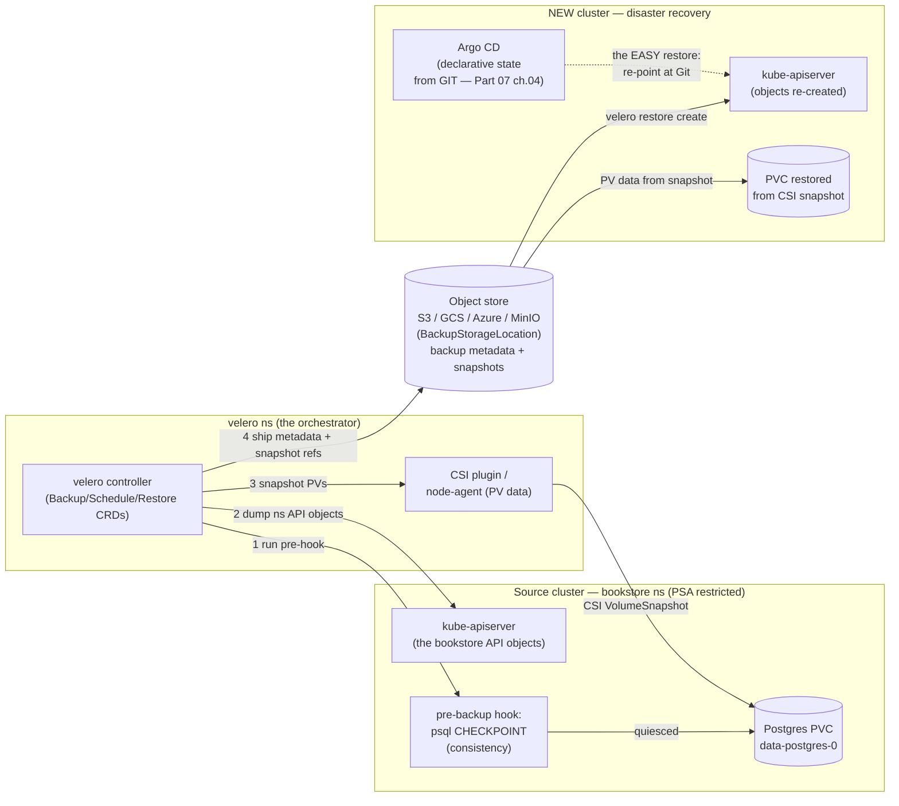

# 02 — Backup and disaster recovery

> The three things you actually back up and why they differ: **etcd** (cluster
> state — `etcdctl snapshot save/restore`, where the certs/endpoints live on a
> kubeadm node, the stop-apiserver→restore→repoint-data-dir sequence; managed =
> the provider's, you *can't* `etcdctl` it); **PV data** (app state — the
> Postgres PVC, via CSI VolumeSnapshot, ties to [Part 03
> ch.05](../03-config-and-storage/05-stateful-data-patterns.md)); **Git**
> (desired state — the *easiest* restore, [Part 07
> ch.04](../07-delivery/04-gitops-argocd.md)). **Velero**'s architecture
> (controller + object store + the CSI-snapshot / node-agent path;
> Backup/Restore/Schedule/BackupStorageLocation CRDs), a namespaced backup of
> `bookstore` **including the PV** with a Postgres pre-backup **consistency
> hook**, **RPO/RTO**, the **GitOps-DR insight**, and a concrete, ordered
> **Bookstore DR runbook** for the three real loss scenarios.

**Estimated time:** ~30 min read · ~90 min hands-on
**Prerequisites:** [Part 03 ch.05](../03-config-and-storage/05-stateful-data-patterns.md) — storage durability ≠ data safety · [Part 03 ch.04](../03-config-and-storage/04-persistent-storage.md) — CSI VolumeSnapshot is the PV backup primitive · [Part 07 ch.04](../07-delivery/04-gitops-argocd.md) — Git holds the desired state Velero doesn't need to re-back-up
**You'll know after this:** • distinguish the three things to back up: etcd, PV data and Git · • run `etcdctl snapshot save / restore` and the stop-apiserver → repoint sequence on kubeadm · • configure Velero with object storage and the CSI-snapshot or node-agent path · • use Postgres pre-backup consistency hooks and reason about RPO/RTO · • execute the Bookstore DR runbook for namespace, cluster and region loss

<!-- tags: day-2, backup, dr, velero, stateful -->

## Why this exists

[Part 03 ch.05](../03-config-and-storage/05-stateful-data-patterns.md) made one
thing brutally clear: *storage durability is not data safety*. A bound PV
survives a Pod reschedule; it does **not** survive a deleted PVC, a failed
disk, a `DROP TABLE`, or a lost cluster — and a snapshot of corruption is just
durable corruption. [Part 07 ch.04](../07-delivery/04-gitops-argocd.md) ended
on the other half: a fresh Argo CD pointed at Git rebuilds every environment —
*"GitOps recovers the **declarative** state, not the **data**; that is Part 08
ch.02."* This is that chapter, and it is where the guide stops assuming the
cluster and its data simply persist.

Disaster recovery fails in production in two specific, avoidable ways:

1. **You backed up the wrong layer.** Teams snapshot etcd and feel safe — but
   etcd holds *cluster state* (objects, RBAC, Secrets-as-objects), **not the
   bytes inside the Postgres PVC**. Restore etcd and you get the PVC *object*
   pointing at a volume whose data is gone. The layers — cluster state, PV
   data, desired state — need **separate** backups with **separate**
   mechanisms.
2. **The backup was never restore-tested.** A backup you have never restored is
   a hypothesis, not a backup. The classic outage is discovering at 3am that
   the nightly job has been writing 0-byte snapshots, or that nobody knows the
   restore order, or that the snapshot is crash-consistent mid-transaction.

This chapter separates the layers, gives each its real mechanism (etcd
snapshot, Velero + CSI for PV data, Git for desired state), and ends with an
**ordered, runnable runbook** so recovery is a procedure, not an improvisation.
The reference is *Production Kubernetes* (Container Storage); etcd backup and
Velero are cited from their own docs.

## Mental model

**Three independent state layers, three independent backups, restored in
order: cluster → declarative → data (and Git makes the middle one free).**

- **Layer 1 — cluster state lives in etcd.** Every object (Deployments, RBAC,
  Secrets, the PVC *object*) is a key in etcd
  ([Part 00 ch.04](../00-foundations/04-control-plane-deep-dive.md)). Back it up
  with `etcdctl snapshot save`. Restoring etcd resurrects *the API objects* —
  **not** the contents of any external disk those objects reference.
- **Layer 2 — desired state lives in Git.** With GitOps, the declarative truth
  isn't *in* the cluster at all — it's a commit. "Restoring" Layer 1's objects
  is then almost free: install Argo CD, point it at Git, it reconciles the
  whole app back. **This is the cheapest, most reliable recovery in the guide**
  and it needs *no cluster snapshot*.
- **Layer 3 — application data lives in the PV.** The bytes in Postgres's
  `data-postgres-0` PVC are **not** in etcd and **not** in Git. They need a
  *data* backup: a CSI **VolumeSnapshot** (crash-consistent point copy — [Part
  03 ch.05](../03-config-and-storage/05-stateful-data-patterns.md)) and/or a
  logical dump, orchestrated and shipped off-cluster by **Velero**.
- **Velero is the orchestrator for Layers 1+3 of an *app*.** It backs up a
  *namespace's* API objects **and** triggers CSI VolumeSnapshots (or its
  node-agent file backup) for that namespace's PVs, stores backup metadata in
  an **object store** (S3/GCS/Azure/MinIO), and can restore the lot into the
  same or a new cluster. Hooks let it **quiesce the database** first so the
  snapshot is consistent, not mid-write.
- **RPO and RTO are the two numbers that define "recovered".** **RPO** = how
  much data you can afford to lose = roughly your *backup interval*. **RTO** =
  how long recovery may take = your *restore + readiness* time. A snapshot
  every 24h is a 24h RPO; sub-snapshot RPO needs WAL/PITR, which is the
  operator/managed-DB story ([ch.05](05-operators-and-crds.md)).

The trap: **a crash-consistent snapshot faithfully preserves whatever was
there — including a `DROP TABLE` that already ran.** Snapshots protect against
*losing the disk*; they do not protect against *logical corruption you
replicated into the snapshot*. That gap is exactly why production layers
snapshots **plus** logical/PITR backups, and why the runbook validates *data
integrity*, not just *pod readiness*.

## Diagrams

### Diagram A — Velero backup & restore flow (Mermaid)

The real Velero architecture: controller in its own namespace, API objects +
CSI snapshots out to an object store, restored into a new cluster.



### Diagram B — RPO / RTO time axis (ASCII)

```
 RPO vs RTO — two different numbers, two different controls ─────────────────

   RPO = how much DATA you can lose   (set by BACKUP interval)
   RTO = how long RECOVERY may take   (set by RESTORE + readiness speed)

   time ───────────────────────────────────────────────────────────────────▶
        backup        backup        backup            X  failure
        02:00         08:00         14:00              | (data after 14:00
          |             |             |                |  backup is LOST)
          ▼             ▼             ▼                 ▼
   ===[ B ]=========[ B ]=========[ B ]===============[!!]......restore......[ready]
                                    └─────── RPO ───────┘   └──── RTO ────┘
                                    (up to one backup       (Velero restore
                                     interval of data        + Postgres ready
                                     lost: tighten the       + app available:
                                     Schedule to shrink)     pre-stage to shrink)

   Lab defaults (Schedule "0 2 * * *"): RPO ≤ 24h, RTO ≈ minutes (small DB).
   Tighten RPO  → more frequent Velero Schedule (e.g. "0 */6 * * *" → 6h),
                  or WAL/PITR via an operator/managed DB (ch.05) → seconds.
   Tighten RTO  → pre-staged cluster/images, GitOps for declarative (≈instant),
                  rehearsed runbook (DR-RUNBOOK.md).

   The three layers, restored in this ORDER:
     1. cluster (etcd snapshot)  — self-managed only; managed = provider's
     2. declarative (Git → Argo) — the cheap one; needs NO cluster snapshot
     3. data (Velero + CSI snap) — the only layer that TRULY needs a backup
```

## Hands-on with the Bookstore

**Assumed working directory: the guide repo root (`full-guide/`).** This
chapter adds [`examples/bookstore/operators/velero-backup.yaml`](../examples/bookstore/operators/velero-backup.yaml),
[`velero-schedule.yaml`](../examples/bookstore/operators/velero-schedule.yaml),
and [`DR-RUNBOOK.md`](../examples/bookstore/operators/DR-RUNBOOK.md). It does
**not** modify the canonical app — Velero backs the live `bookstore` namespace
*up*; recovery uses GitOps + restore, never an edit of `raw-manifests/*`.

> **The honest local-object-store story (read this first).** Velero's premise
> is *backups shipped to durable storage that outlives the cluster* — an S3/
> GCS/Azure bucket. A laptop kind cluster has no cloud bucket, and kind's
> default `local-path` provisioner is **not snapshot-capable**. So this
> Hands-on is honest in two halves: (a) the **conceptual production flow** (real
> object store + snapshot-capable CSI — narrated, the commands are real), and
> (b) a **runnable local approximation** — a local **MinIO** as the
> `BackupStorageLocation` plus Velero's **node-agent filesystem backup** (no
> CSI snapshot needed) so the *backup→restore loop is real on kind*. Where a
> real object store / snapshot CSI is genuinely required it is called out —
> the same established honesty as the GitOps local-remote and (next chapter)
> CNPG local notes. The CRD-intrinsic dry-run behaviour of the Velero
> manifests is documented exactly like every prior CRD object.

### 0. Prerequisites — fresh cluster + the four images + the app (self-bootstrapping)

```sh
kind delete cluster --name bookstore 2>/dev/null || true
kind create cluster --name bookstore
kubectl cluster-info

cd examples/bookstore/app
for s in catalog orders payments-worker storefront; do docker build -t bookstore/$s:dev ./$s; done
cd ../../..
for s in catalog orders payments-worker storefront; do kind load docker-image bookstore/$s:dev --name bookstore; done

# the standard prereq → workload chain (same as ch.01 step 1):
kubectl apply -f examples/bookstore/raw-manifests/00-namespace.yaml
kubectl apply -f examples/bookstore/raw-manifests/05-serviceaccounts-rbac.yaml
kubectl apply -f examples/bookstore/raw-manifests/15-catalog-config.yaml
kubectl apply -f examples/bookstore/raw-manifests/16-db-credentials.yaml
kubectl apply -f examples/bookstore/raw-manifests/35-priorityclasses.yaml
kubectl apply -f examples/bookstore/raw-manifests/12-redis.yaml
kubectl apply -f examples/bookstore/raw-manifests/13-rabbitmq.yaml
kubectl apply -f examples/bookstore/raw-manifests/20-postgres-statefulset.yaml
kubectl apply -f examples/bookstore/raw-manifests/40-services.yaml
kubectl apply -f examples/bookstore/raw-manifests/10-catalog-deploy.yaml
kubectl apply -f examples/bookstore/raw-manifests/11-storefront-deploy.yaml
kubectl apply -f examples/bookstore/raw-manifests/14-orders-deploy.yaml
kubectl apply -f examples/bookstore/raw-manifests/19-payments-worker-deploy.yaml
kubectl apply -f examples/bookstore/raw-manifests/21-db-migrate-job.yaml
# the migration Job must COMPLETE (creates the `books` schema) before
# catalog/orders can become Ready — wait for it BEFORE the deploy wait:
kubectl wait --for=condition=complete job/db-migrate -n bookstore --timeout=120s
kubectl wait --for=condition=available deploy --all -n bookstore --timeout=180s

# seed a row so "data loss" is observable later:
kubectl exec -n bookstore postgres-0 -- psql -U bookstore -d bookstore -c \
  "CREATE TABLE IF NOT EXISTS dr_demo(note text); INSERT INTO dr_demo VALUES ('before-backup');"
```

> **Self-bootstrapping note.** After any `kind delete && kind create`:
> re-`kind load` the four images, re-run the chain above, then re-install Velero (step
> 2) — a fresh cluster has none of it.

### 1. Layer 1 — the etcd snapshot (conceptual on kind; runnable on kubeadm)

On a **self-managed kubeadm** control-plane node, etcd runs as a static Pod and
its client certs are on disk. The snapshot is one command:

```sh
# ON the control-plane node (etcdctl talks to the local etcd over mTLS):
ETCDCTL_API=3 etcdctl \
  --endpoints=https://127.0.0.1:2379 \
  --cacert=/etc/kubernetes/pki/etcd/ca.crt \
  --cert=/etc/kubernetes/pki/etcd/server.crt \
  --key=/etc/kubernetes/pki/etcd/server.key \
  snapshot save /var/backups/etcd-$(date +%F).db
ETCDCTL_API=3 etcdctl --write-out=table snapshot status /var/backups/etcd-*.db

# RESTORE (control-plane outage) — the exact ordered sequence:
#   1. STOP the apiserver + etcd static Pods (move their manifests out of
#      /etc/kubernetes/manifests/ so the kubelet stops them).
#   2. etcdctl snapshot restore /var/backups/etcd-<DATE>.db \
#        --data-dir /var/lib/etcd-restored
#   3. repoint etcd's static-Pod manifest at the NEW data-dir
#      (/var/lib/etcd-restored), move the manifests back → kubelet restarts
#      etcd from the restored data, then the apiserver comes up on it.
```

> **Why this is narrated, not run on kind.** kind runs etcd inside the
> control-plane *container*; you do not have a kubeadm node with
> `/etc/kubernetes/pki/etcd/` and a static-Pod manifest to move. The sequence
> above is the real one on a self-managed cluster and is shown so the order
> (stop apiserver+etcd → restore → repoint data-dir) is concrete. **On managed
> EKS/GKE/AKS you cannot do *any* of this** — etcd is the provider's, there is
> no etcd endpoint or cert for you, and the provider snapshots/restores it
> behind their SLA. For the Bookstore the practical Layer-1 recovery is **not**
> etcd at all — it is Git (step 4 / Scenario 3): GitOps makes the etcd snapshot
> *optional* for a declaratively-managed app.

### 2. Install Velero (Helm, pinned) + a local MinIO (runnable approximation)

Per this guide's rule — **prefer Helm / a pinned CLI; never
`releases/latest/download/<PINNED-FILE>.yaml`**. Velero's official Helm chart
is `vmware-tanzu/velero`. Pin the chart version (the `TRIVY_VERSION` /
`KUSTOMIZE_VERSION` precedent):

```sh
# Pin these (check the chart repo / Velero releases for the current pair):
VELERO_CHART_VERSION=8.0.0           # vmware-tanzu/velero chart version (pin)
VELERO_AWS_PLUGIN=v1.11.0            # velero-plugin-for-aws image tag (pin)

# A local MinIO = the S3-compatible object store the cluster CAN reach
# (the laptop substitute for a real bucket; the API is identical S3):
kubectl create namespace velero
helm repo add minio https://charts.min.io/ && helm repo update
helm install minio minio/minio -n velero \
  --set rootUser=minio,rootPassword=minio12345 \
  --set 'buckets[0].name=velero,buckets[0].policy=none' \
  --set resources.requests.memory=512Mi --set replicas=1 --set mode=standalone --wait

# Velero, via Helm, pointed at that MinIO; node-agent filesystem backup ON
# (kind's local-path is NOT snapshot-capable — fs-backup is the runnable path):
cat > /tmp/velero-s3-creds <<'EOF'
[default]
aws_access_key_id=minio
aws_secret_access_key=minio12345
EOF
kubectl create secret generic velero-cloud-credentials -n velero \
  --from-file=cloud=/tmp/velero-s3-creds

helm repo add vmware-tanzu https://vmware-tanzu.github.io/helm-charts && helm repo update
helm install velero vmware-tanzu/velero -n velero \
  --version "$VELERO_CHART_VERSION" \
  --set "initContainers[0].name=velero-plugin-for-aws" \
  --set "initContainers[0].image=velero/velero-plugin-for-aws:${VELERO_AWS_PLUGIN}" \
  --set "initContainers[0].volumeMounts[0].mountPath=/target" \
  --set "initContainers[0].volumeMounts[0].name=plugins" \
  --set configuration.backupStorageLocation[0].name=default \
  --set configuration.backupStorageLocation[0].provider=aws \
  --set configuration.backupStorageLocation[0].bucket=velero \
  --set configuration.backupStorageLocation[0].config.region=minio \
  --set configuration.backupStorageLocation[0].config.s3ForcePathStyle=true \
  --set configuration.backupStorageLocation[0].config.s3Url=http://minio.velero.svc:9000 \
  --set credentials.existingSecret=velero-cloud-credentials \
  --set deployNodeAgent=true \
  --set snapshotsEnabled=false \
  --wait
kubectl -n velero rollout status deploy/velero
kubectl -n velero get pods                       # velero + node-agent + minio
```

Installing Velero created the `velero.io` CRDs (`Backup`, `Restore`,
`Schedule`, `BackupStorageLocation`). **This is what makes the manifests below
dry-runnable** — before this step a client dry-run prints `no matches for kind
"Backup"` (the documented CRD-intrinsic behaviour; step 6).

### 3. Back up the Bookstore namespace (with the consistency hook)

The on-demand backup is the saved manifest — namespaced to `bookstore`, with
the **pre-backup Postgres CHECKPOINT hook** so the data is captured clean:

```sh
kubectl apply -f examples/bookstore/operators/velero-backup.yaml
# (this is `Backup/bookstore-now`; on the fs-backup path Velero annotates the
#  postgres pod's data volume for the node-agent. The pre-hook runs `psql
#  CHECKPOINT` INSIDE the postgres container — valid: the official postgres
#  image has a shell, unlike distroless catalog/orders, ch.03.)
velero backup describe bookstore-now --details
velero backup logs bookstore-now                 # hook executed; ns objects + PV
kubectl get backup bookstore-now -n velero -o jsonpath='{.status.phase}{"\n"}'
#   → Completed

# the recurring posture (this is what you actually run in prod — gives an RPO):
kubectl apply -f examples/bookstore/operators/velero-schedule.yaml
velero schedule describe bookstore-daily
```

### 4. Simulate the disaster + restore (the runnable DR drill)

Lose the data, then recover it — declarative via GitOps, data via Velero. This
is **Scenario 2** of [`DR-RUNBOOK.md`](../examples/bookstore/operators/DR-RUNBOOK.md):

```sh
# --- DISASTER: writers down, then destroy the data (NOT a manifest edit) ---
kubectl scale deploy/catalog deploy/orders deploy/payments-worker -n bookstore --replicas=0
kubectl exec -n bookstore postgres-0 -- psql -U bookstore -d bookstore -c 'DROP TABLE dr_demo;'
kubectl exec -n bookstore postgres-0 -- psql -U bookstore -d bookstore -c '\dt' | grep dr_demo || echo "dr_demo GONE (data lost)"

# --- STOP postgres so the PVC is UNMOUNTED before the restore (RWO conflict) ---
# data-postgres-0 is ReadWriteOnce: while postgres-0 mounts it, the node-agent
# restore pod cannot mount it (it would race / fail). Scale the StatefulSet to
# 0 and wait for the pod to actually be gone.
kubectl scale statefulset/postgres -n bookstore --replicas=0
kubectl rollout status statefulset/postgres -n bookstore --timeout=120s
kubectl wait --for=delete pod/postgres-0 -n bookstore --timeout=120s

# --- RESTORE the data from the Velero backup (recreates the PV contents) ---
# NOTE: do NOT `--selector app=postgres` here. The StatefulSet controller does
# NOT copy the pod-template labels onto the PVC it generates from
# volumeClaimTemplates, so data-postgres-0 has NO `app=postgres` label — a
# label-selected restore would SILENTLY SKIP the PVC and "succeed" while
# recovering nothing. Scope by namespace + resource kind instead (the PVC IS
# in the ns-scoped backup, just not label-matchable):
velero restore create bookstore-pgrestore --from-backup bookstore-now \
  --include-namespaces bookstore \
  --include-resources persistentvolumeclaims,persistentvolumes
velero restore describe bookstore-pgrestore --details      # Phase: Completed

# --- BRING POSTGRES BACK on the restored PVC ---
kubectl scale statefulset/postgres -n bookstore --replicas=1
kubectl rollout status statefulset/postgres -n bookstore --timeout=120s

# --- VALIDATE: the row is back AS OF the backup (the CHECKPOINT-clean point) ---
kubectl exec -n bookstore postgres-0 -- psql -U bookstore -d bookstore -c 'SELECT * FROM dr_demo;'
#   → before-backup     (data recovered)

# --- bring writers back (declaratively; or `argocd app sync` under GitOps) ---
kubectl scale deploy/catalog deploy/orders deploy/payments-worker -n bookstore --replicas=2
kubectl wait --for=condition=available deploy --all -n bookstore --timeout=180s
```

> **Honest scope of the local drill.** On kind this restores via Velero's
> **node-agent filesystem backup** (the fs-backup path), which *is* a real
> Velero restore loop. A production restore uses **CSI VolumeSnapshots** (set
> `snapshotsEnabled=true` + a snapshot-capable CSI driver +
> `snapshotVolumes: true` in the Backup — the saved manifest's default,
> matching [Part 03 ch.05](../03-config-and-storage/05-stateful-data-patterns.md)'s
> `18-postgres-snapshot.yaml`) and a real object store; the *commands and CRDs
> are identical*, only the storage backend is substituted. **Total-cluster
> loss (Scenario 3)** additionally needs the backups to physically outlive the
> cluster — which is *why* they live in an object store, not on a PVC inside
> the cluster you just lost.

### 5. The GitOps-DR insight (why Layer 2 is nearly free)

Steps 1–4 recovered *data*. The *declarative* state — Deployments, Services,
the PSA-labelled Namespace, NetworkPolicies — is recovered with **no Velero
restore and no etcd snapshot** because it is in Git
([Part 07 ch.04](../07-delivery/04-gitops-argocd.md)):

```sh
# Total-loss recovery of the DECLARATIVE state is two applies (Scenario 3):
#   kubectl apply -n argocd -f examples/bookstore/argocd/00-appproject.yaml
#   kubectl apply -n argocd -f examples/bookstore/argocd/01-app-of-apps.yaml
#   → a fresh Argo CD rebuilds the entire app from Git. Only the DATA (the
#     Postgres PVC) then needs a Velero restore (step 4). GitOps collapses
#     Layer-1+2 recovery into "re-point at Git"; Velero handles Layer 3.
```

This is the chapter's core operational claim: **separate the layers and the
hard part shrinks to just the data.** The full ordered procedure for all three
scenarios is [`DR-RUNBOOK.md`](../examples/bookstore/operators/DR-RUNBOOK.md).

### 6. The CRD-intrinsic dry-run (documented, like every prior CRD object)

`Backup`/`Schedule` are `velero.io/v1`. On a cluster **without** Velero:

```sh
kubectl apply --dry-run=client -f examples/bookstore/operators/velero-backup.yaml
# error: ... no matches for kind "Backup" in version "velero.io/v1"
kubectl apply --dry-run=client -f examples/bookstore/operators/velero-schedule.yaml
# error: ... no matches for kind "Schedule" in version "velero.io/v1"
```

That is **expected and correct** — the *exact* precedent of
[`18-postgres-snapshot.yaml`](../examples/bookstore/raw-manifests/18-postgres-snapshot.yaml),
`51-gateway.yaml`, `70-kyverno-policy.yaml`, `80-servicemonitor.yaml`,
`83-keda-scaledobject.yaml`, and the `argocd/` tree. The manifests are
**schema-correct** (verified against the Velero API reference); the CRDs must
exist first. After step 2, `kubectl apply --dry-run=server -n velero -f …`
validates cleanly. Each file's header documents this. Clean up:

```sh
kubectl delete -f examples/bookstore/operators/velero-schedule.yaml --ignore-not-found
kubectl delete -f examples/bookstore/operators/velero-backup.yaml --ignore-not-found
helm uninstall velero minio -n velero
kind delete cluster --name bookstore
```

## How it works under the hood

- **etcd snapshot = a consistent copy of the whole key space.** `etcdctl
  snapshot save` asks the etcd leader for a point-in-time, internally
  consistent dump of the entire MVCC keyspace (every Kubernetes object lives
  there as a protobuf value under a registry key —
  [Part 00 ch.04](../00-foundations/04-control-plane-deep-dive.md)). Restore
  rebuilds an etcd data-dir from that file; you then **must** stop the old
  apiserver + etcd, restore into a *new* data-dir, and repoint etcd at it —
  restoring "live" under a running apiserver corrupts state. It captures
  *objects*, never the contents of any external PV those objects reference —
  which is the entire reason Layer 3 (Velero/CSI) exists separately.
- **Why managed clusters can't be `etcdctl`'d.** On EKS/GKE/AKS the control
  plane (etcd included) is the provider's; there is no etcd endpoint, no
  `/etc/kubernetes/pki/etcd/`, no static-Pod manifest you can move. The
  provider snapshots/restores etcd under their SLA. Your DR for a managed
  cluster is therefore **Git (declarative) + Velero (data)** — which is exactly
  the posture that also works for self-managed, so the Bookstore standardises
  on it.
- **Velero's anatomy.** A controller in the `velero` namespace watches its CRDs.
  On a `Backup` it: (1) runs any **pre hooks** (`exec` into a pod — the
  Bookstore's `psql CHECKPOINT`) to quiesce; (2) lists and serialises the
  target namespace's API objects; (3) for each PVC, triggers a **CSI
  VolumeSnapshot** (via the CSI plugin) *or* a **node-agent filesystem backup**
  (Restic/Kopia copying the volume's files) when no snapshot-capable driver
  exists; (4) writes the object manifests + snapshot references to the
  **BackupStorageLocation** (object store). A `Restore` reverses it: recreate
  objects, then provision PVCs from the snapshot/backup. A `Schedule` is a cron
  whose `template` *is* a Backup spec — which is why the Bookstore's
  `velero-schedule.yaml` template is byte-aligned with `velero-backup.yaml`.
- **The consistency hook is why the snapshot isn't garbage.** A raw CSI
  snapshot is crash-consistent: correct for Postgres (it replays WAL on
  restore) but a `CHECKPOINT` first flushes dirty buffers so the snapshot is a
  maximally-recovered point; a `pg_dump`-to-mounted-volume pre-hook would give
  a *logical* backup; `fsfreeze` quiesces the filesystem. All three are the
  same `hooks.resources[].pre[].exec` shape — the manifest demonstrates the
  mechanism the production choice plugs into. The hook runs *in the postgres
  container*, which has a shell; the distroless app containers do **not** (you
  would never hook into them — ch.03).
- **Crash-consistent ≠ PITR — the hard limit.** A VolumeSnapshot restores
  *exactly the snapshot instant*, including a `DROP TABLE` that already
  committed. Point-in-time recovery (replay WAL to "30 seconds before the bad
  migration") is **not** a snapshot capability — it is continuous WAL
  archiving, which a bare StatefulSet does not do and an **operator**
  (CloudNativePG — [ch.05](05-operators-and-crds.md)) or **managed DB** does.
  This is the precise boundary [Part 03
  ch.05](../03-config-and-storage/05-stateful-data-patterns.md) drew, now
  operationalised: snapshots bound your RPO at the snapshot interval; WAL/PITR
  bounds it at seconds.
- **GitOps changes the math.** Because the declarative state is a Git commit,
  Layer-1+2 recovery doesn't need an etcd snapshot at all: a fresh Argo CD
  reconciles the world from Git ([Part 07
  ch.04](../07-delivery/04-gitops-argocd.md)). DR collapses to: provision a
  cluster, install Argo CD + Velero, `git`-bootstrap (declarative back), Velero
  restore (data back). The only irreplaceable artifact is the **data backup in
  the object store** — everything else is regenerable from Git.

## Production notes

> **In production: back up all three layers, with the right tool for each.**
> etcd snapshots (self-managed; managed = the provider's) for cluster state;
> **Git** for desired state (the cheapest, most reliable recovery — [Part 07
> ch.04](../07-delivery/04-gitops-argocd.md)); **Velero + CSI VolumeSnapshots**
> (or node-agent fs-backup) for PV data, shipped to an **object store that
> physically outlives the cluster** (an in-cluster PVC is *not* a backup of
> that cluster). For the database specifically, layer **logical/PITR backups**
> (`pg_dump` + WAL archiving, or an operator/managed DB) on *top* of snapshots
> — snapshots don't protect against logical corruption you replicated.

> **In production: an untested backup is not a backup — drill the restore on a
> schedule.** The only proof a backup works is a completed restore. Run a
> recurring restore drill (Velero restore into a throwaway namespace/cluster,
> then *validate data integrity* — row counts / app smoke test, not just pod
> readiness). Track **actual RPO/RTO achieved vs target** every drill; a
> backup job that has been silently failing is the canonical 3am outage. The
> Bookstore's [`DR-RUNBOOK.md`](../examples/bookstore/operators/DR-RUNBOOK.md)
> is the rehearsable procedure.

> **In production: managed DBs and managed clusters move the backup boundary.**
> RDS/Cloud SQL/Azure Database give you **automated backups + PITR + snapshots
> as a provider SLA** — the app becomes a Deployment talking to an endpoint and
> the *data* backup is largely the provider's job (you still test restore and
> own retention/region policy). Managed *clusters* own etcd backup. What stays
> **yours** regardless: the **declarative state** (Git) and any **in-cluster
> PV** you still run (Velero). Prefer pushing stateful data to a managed
> service or an operator so DR is mostly "re-point Argo at Git".

> **In production: protect and scope the backups themselves.** The object store
> holding backups is now a high-value target and a single point of failure:
> enable **bucket versioning + object-lock/immutability** (ransomware can't
> delete or overwrite an immutable backup), **cross-region replication** (a
> regional outage must not take the backups with it), and **encryption at
> rest**. Restrict who can create `Restore` objects (a malicious restore is a
> data-tamper vector) and treat Velero's cloud credentials as
> production-critical Secrets ([Part 05
> ch.04](../05-security/04-secrets-and-cluster-hardening.md)).

## Quick Reference

```sh
# Layer 1 — etcd (self-managed control-plane node only; managed = provider's)
ETCDCTL_API=3 etcdctl --endpoints=https://127.0.0.1:2379 \
  --cacert=/etc/kubernetes/pki/etcd/ca.crt \
  --cert=/etc/kubernetes/pki/etcd/server.crt \
  --key=/etc/kubernetes/pki/etcd/server.key snapshot save snap.db
etcdctl snapshot status snap.db ; etcdctl snapshot restore snap.db --data-dir <NEW>

# Layer 3 — Velero (Helm/pinned; never releases/latest/download/<PINNED>.yaml)
helm install velero vmware-tanzu/velero -n velero --version <PINNED> ...
kubectl apply -f examples/bookstore/operators/velero-backup.yaml      # on-demand
kubectl apply -f examples/bookstore/operators/velero-schedule.yaml    # recurring
velero backup describe bookstore-now --details ; velero backup logs bookstore-now
# scope by ns+resource, NOT --selector: a StatefulSet's volumeClaimTemplate PVC
# has no pod labels, so a label-selected restore silently skips the data.
velero restore create r1 --from-backup bookstore-now \
  --include-namespaces bookstore --include-resources persistentvolumeclaims,persistentvolumes

# Layer 2 — declarative (the cheap one): re-point Argo CD at Git
kubectl apply -n argocd -f examples/bookstore/argocd/01-app-of-apps.yaml
```

Minimal `Backup` skeleton (the shape; full set in `examples/bookstore/operators/`):

```yaml
apiVersion: velero.io/v1                 # CRD — needs Velero installed
kind: Backup
metadata: { name: bookstore-now, namespace: velero }
spec:
  includedNamespaces: [ bookstore ]      # namespaced app backup (not whole-cluster)
  snapshotVolumes: true                  # PV data via CSI VolumeSnapshot
  ttl: 168h0m0s
  hooks:
    resources:
      - name: postgres-consistency
        labelSelector: { matchLabels: { app: postgres } }
        pre:
          - exec: { container: postgres, command: ["/bin/sh","-c","psql -c 'CHECKPOINT;'"], onError: Fail }
```

Checklist:

- [ ] **Three layers backed up:** etcd (self-managed) / **Git** (declarative,
      the easy restore) / **Velero+CSI** (PV data) — right tool per layer
- [ ] Backups in an **object store that outlives the cluster** (not an
      in-cluster PVC); versioned + object-locked + cross-region + encrypted
- [ ] DB backup has a **consistency hook** (CHECKPOINT/`pg_dump`/`fsfreeze`);
      snapshots are **crash-consistent, not PITR** — layer WAL/PITR for that
- [ ] **RPO** = backup interval (Velero `Schedule` cadence — tighten for
      smaller RPO); **RTO** = restore + readiness (pre-stage + GitOps to shrink)
- [ ] **Restore drilled on a schedule**, validating *data integrity* (not just
      pod readiness); actual RPO/RTO vs target recorded —
      [`DR-RUNBOOK.md`](../examples/bookstore/operators/DR-RUNBOOK.md) rehearsed
- [ ] Velero/Backup objects carry the documented **CRD-intrinsic dry-run**
      note; restore-test pods are **PSA-`restricted`-compliant**
- [ ] Managed DB / managed cluster: know which layer the **provider** owns vs
      **you** (declarative is always yours)

## Test your understanding

> Try each before opening the answer drawer. The act of trying is the exercise; the answer is the check.

1. **An ops engineer says "we back up etcd nightly, so we're safe." Why are they wrong, and what are the three things you actually need to back up?**
   <details><summary>Show answer</summary>

   etcd holds **cluster state** (Deployments, RBAC, Secrets *as API objects*, the PVC *object*) — it does **not** hold the bytes inside any PV. Restoring etcd resurrects the API objects pointing at a volume whose contents are gone. The three layers are: (1) **etcd** = cluster state, (2) **PV data** = application data (Postgres bytes), backed via CSI VolumeSnapshot / Velero, (3) **Git** = declarative state (the cheapest restore — install Argo, point at Git, rebuild). Each layer needs its own mechanism. See §Mental model.

   </details>

2. **You run a Velero backup with `--selector app=postgres` and the StatefulSet's PV data is not included. Why?**
   <details><summary>Show answer</summary>

   StatefulSet volumes are created from a `volumeClaimTemplate` — the generated PVCs (`data-postgres-0`, `data-postgres-1`) **don't inherit the pod's labels**, they only have the StatefulSet's templated labels. A `--selector app=postgres` matches the Pods but skips the PVCs (and therefore their PV data). The fix is scoping by **namespace + resource** (`--include-namespaces bookstore --include-resources persistentvolumeclaims,persistentvolumes`), not by selector. The chapter's Quick Reference explicitly warns about this.

   </details>

3. **A `pg_dump` "backup" of Postgres is running. What's the difference between that and a `VolumeSnapshot`, and which one is consistent during a transaction?**
   <details><summary>Show answer</summary>

   `pg_dump` is a **logical** dump — it queries Postgres for a consistent view of every table via a long-running read transaction (or replication snapshot). A `VolumeSnapshot` is a **block-level** copy of the volume bytes, taken in milliseconds — it captures whatever happens to be on disk at that instant, including in-flight writes (**crash-consistent**, not transaction-consistent). For Postgres safety: use a pre-backup hook to `CHECKPOINT` (flush dirty buffers) and snapshot; for PITR, you need WAL archiving on top of either. The hook + snapshot is the standard CNPG/Velero pattern.

   </details>

4. **Hands-on extension — restore-test the cheap layer. Spin up a fresh kind cluster, install Argo CD, and apply only `examples/bookstore/argocd/01-app-of-apps.yaml`. Time how long until the Bookstore namespace, all Deployments, and all Services are reconciled. Now imagine you'd had to apply 29 raw manifests in order by hand.**
   <details><summary>What you should see</summary>

   Within 2-5 minutes: namespace, RBAC, NetworkPolicies, ConfigMaps, Deployments, Services, PVCs — all reconciled from Git via Argo CD. The only thing missing is the **data** in the Postgres PV (Layer 3). That's the GitOps-DR insight: Layer 2 (declarative state) is *almost free* to restore because Git is the source of truth, and the value of GitOps is exactly this drill. The PV data restore is a separate Velero step; the *cluster + app shape* is one `kubectl apply` of an Application.

   </details>

5. **Define RPO and RTO in one sentence each, and explain how they drive your Velero `Schedule` cadence.**
   <details><summary>Show answer</summary>

   **RPO** (Recovery Point Objective) = how much data loss you can tolerate (e.g., "no more than 1 hour of writes lost"). **RTO** (Recovery Time Objective) = how long the recovery may take (e.g., "back online within 30 min"). RPO drives the **backup interval**: if RPO is 1h, run a Velero `Schedule` at least hourly; if RPO is 5min, use database-level WAL-archive-PITR (not just snapshots). RTO drives the **restore procedure**: pre-stage Argo CD's recovery cluster, automate the Velero restore, and rehearse — RTO is the metric measured during the restore drill on the DR-RUNBOOK.

   </details>

## Further reading

- **Rosso et al., _Production Kubernetes_, ch.4 — Container Storage** (stateful
  data, snapshots, and the backup/restore posture for PVs in production) and
  **ch.2 — Deployment Models** (the cluster-lifecycle/etcd backup framing
  around recovery of the cluster itself).
- **Lukša, _Kubernetes in Action_ 2e, ch.8** (PersistentVolumes — the storage
  layer a CSI VolumeSnapshot copies, the basis for *why* PV data is a separate
  backup from etcd).
- Official: etcd backup/restore for a Kubernetes cluster
  <https://kubernetes.io/docs/tasks/administer-cluster/configure-upgrade-etcd/#backing-up-an-etcd-cluster>,
  the Velero docs <https://velero.io/docs/> (backup hooks
  <https://velero.io/docs/main/backup-hooks/>; CSI snapshots
  <https://velero.io/docs/main/csi/>), and VolumeSnapshots
  <https://kubernetes.io/docs/concepts/storage/volume-snapshots/>.
