# 03 — Troubleshooting playbook

> A **systematic method** (observe → isolate → hypothesize → test → fix;
> `describe` → events → logs → `kubectl debug`) and a **decision tree per
> symptom**: `Pending`, `ImagePullBackOff`, `CrashLoopBackOff`, `OOMKilled`,
> `Evicted`, `CreateContainerConfigError`, readiness-fail / no Endpoints, DNS
> failures, NetworkPolicy block, PSA rejection. The centerpiece — **debugging
> the Bookstore's distroless containers**: `kubectl debug` ephemeral containers
> and pod copies with `--profile=restricted` (PSA-`restricted`-compatible),
> explicitly contrasted with why `kubectl exec catalog -- sh` *cannot* work
> (distroless: no shell). Applied by deliberately inducing four failures in the
> live Bookstore **without editing any canonical manifest**, diagnosing each
> with the method, and **reverting each** so the cluster returns to known-good.

**Estimated time:** ~30 min read · ~90 min hands-on
**Prerequisites:** [Part 01 ch.02](../01-core-workloads/02-health-and-lifecycle.md) — probes and lifecycle as the failure signal · [Part 06 ch.01](../06-production-readiness/01-observability-metrics.md) — alerts are the trigger; this chapter is the response · [Part 02 ch.06](../02-networking/06-network-policies.md) — NetworkPolicy is one symptom in the decision tree
**You'll know after this:** • run the observe → isolate → hypothesize → test → fix loop on a live failure · • read events, logs and `describe` output to diagnose Pending / ImagePullBackOff / CrashLoopBackOff / OOMKilled · • use `kubectl debug` ephemeral containers and `--profile=restricted` against distroless images · • diagnose readiness-fail, NetworkPolicy block, PSA rejection and DNS failure separately · • induce four Bookstore failures, fix each with the method, and revert to known-good

<!-- tags: day-2, troubleshooting, postmortem, observability -->

## Why this exists

Every prior part *built* the Bookstore correctly. Production is mostly the
opposite activity: something that *was* working isn't, an alert fired
([Part 06 ch.01](../06-production-readiness/01-observability-metrics.md)), and
you have minutes to find out why across Pods, Services, config, network policy,
and admission. The reflex — "tail the logs", "`kubectl exec` in and poke" —
fails in exactly this codebase: **`catalog`, `orders`, and `payments-worker`
are distroless `gcr.io/distroless/static:nonroot` images
([Part 00 ch.02](../00-foundations/02-containers-and-images.md)) with no shell,
no `ps`, no `curl`** — `kubectl exec catalog -- sh` returns
`exec: "sh": executable file not found`. The correct tool is `kubectl debug`,
and the `bookstore` namespace's PSA-`restricted` enforcement constrains *that*
too.

Two failure modes make this its own chapter:

1. **No method → flailing.** Without a fixed sequence (events before logs,
   `describe` before guesses, isolate before fix) an incident becomes random
   `kubectl` commands. A **decision tree per symptom** turns "it's broken" into
   a short, deterministic path to the cause.
2. **The wrong debug tool for the workload.** `kubectl exec … sh` is muscle
   memory and it *fails on the Bookstore's own services*. The right answer —
   `kubectl debug` with an **ephemeral container** sharing the target's
   process/network namespace, on the **`--profile=restricted`** profile so PSA
   admits it — is a distinct skill this chapter teaches against the real app.

This is the operator's playbook: a method, a per-symptom tree, the *correct*
distroless debugging, and a hands-on that breaks the live app safely and puts
it back. The references are *Production Kubernetes* (Observability) and Lukša's
debugging material; `kubectl debug` is cited from the official docs.

## Mental model

**Triage is a fixed pipeline; the symptom selects the branch; `kubectl debug`
is how you get a shell when the container has none.**

- **One method, always the same order.** **Observe** (what is the symptom —
  `kubectl get` phase/status) → **isolate** (which object/layer —
  Pod? Service? config? network? admission?) → **hypothesize** (what would
  produce *this* symptom) → **test** (one cheap check that confirms/refutes) →
  **fix** (smallest change) → **verify** (the symptom is gone, nothing else
  broke). Skipping "isolate" is how you spend an hour on the wrong layer.
- **`describe` → events → logs → debug, in that order.** `kubectl describe`
  (and its **Events**) explains *scheduling/lifecycle* failures (Pending,
  ImagePull, config errors) before any log exists. `kubectl logs
  --previous` explains *in-container* failures (CrashLoop, bad config the app
  rejected). `kubectl debug` is the **last** resort, for when you need a shell,
  tools, or the process/network view the container itself can't give you.
- **The symptom is the index into the tree.** `Pending` ≠ `CrashLoopBackOff` ≠
  `ImagePullBackOff` — each has a *small, specific* set of causes and a
  *deterministic* check order. You don't "debug Kubernetes"; you follow the
  branch the Pod's status names.
- **Distroless changes the debug primitive, not the method.** `catalog` has no
  shell, so step "get a shell to look around" becomes **`kubectl debug -it
  <POD> --image=<TOOLING> --target=<CTR>`** — an *ephemeral container* injected
  into the running Pod, sharing its process and network namespaces, with tools
  the distroless image lacks. The method is unchanged; only the tool that
  realises "look inside" differs.
- **PSA-`restricted` constrains the debugger too.** An ephemeral container
  joins the *target Pod's* namespace, so in `bookstore` it must itself satisfy
  `restricted` ([Part 05 ch.02](../05-security/02-pod-security.md)). `kubectl
  debug --profile=restricted` (GA 1.30) shapes the debug/ephemeral container
  (runAsNonRoot, drop ALL, seccomp RuntimeDefault) so admission accepts it —
  using a bare `--image=busybox` *without* that profile is rejected by PSA.

The trap to internalise: **`kubectl exec catalog -- sh` is the wrong reflex in
this codebase and it will waste your first two minutes.** The Bookstore's Go
services are distroless on purpose (tiny attack surface, fewer CVEs — [Part 00
ch.02](../00-foundations/02-containers-and-images.md)); the cost is paid back
*here*, in knowing the debug primitive that actually works on them.

## Diagrams

### Diagram A — the master troubleshooting decision tree (Mermaid)

Symptom → check → cause → fix. Every branch is exercised in the Hands-on.

```mermaid
flowchart TD
    start["Alert / 'it's broken'<br/>kubectl get pods -n bookstore"]
    start --> phase{"Pod status?"}

    phase -->|Pending| pend["kubectl describe pod → Events"]
    pend --> pendc{"Why unschedulable?"}
    pendc -->|Insufficient cpu/mem| f1["raise limits / scale node /<br/>check ResourceQuota (Part 04/05)"]
    pendc -->|no node matches<br/>affinity/taint| f2["fix nodeSelector/affinity/<br/>toleration (Part 04)"]
    pendc -->|PVC unbound /<br/>WaitForFirstConsumer| f3["check PVC/StorageClass<br/>(Part 03 ch.04)"]
    pendc -->|"violates PodSecurity restricted"| f4["fix securityContext<br/>(Part 05 ch.02)"]

    phase -->|ImagePullBackOff| ipb["describe → Events: image ref"]
    ipb --> ipbc{"Cause?"}
    ipbc -->|typo / wrong tag| f5["fix image: ; kubectl set image"]
    ipbc -->|"not kind-loaded"| f6["kind load docker-image"]
    ipbc -->|private registry| f7["imagePullSecrets / IRSA"]

    phase -->|CrashLoopBackOff| clb["kubectl logs --previous"]
    clb --> clbc{"Why exiting?"}
    clbc -->|bad/missing config| f8["fix ConfigMap/Secret/env"]
    clbc -->|dependency down| f9["check the dep (DB/redis/mq)"]
    clbc -->|OOM exit 137| f10["→ OOMKilled branch"]

    phase -->|"Running, not Ready"| nr["describe → readiness probe<br/>+ kubectl get endpoints"]
    nr --> nrc{"Cause?"}
    nrc -->|probe path/port wrong| f11["fix readinessProbe"]
    nrc -->|"Endpoints empty:<br/>selector ≠ labels"| f12["align Service selector /<br/>pod labels (Part 02 ch.02)"]
    nrc -->|NetworkPolicy blocks probe/dep| f13["add the allow<br/>(Part 02 ch.06)"]

    phase -->|"OOMKilled / Evicted /<br/>CreateContainerConfigError"| other["describe → Reason"]
    other --> otherc{"Which?"}
    otherc -->|OOMKilled 137| f14["limit < working set:<br/>raise mem limit (Part 01 ch.03)"]
    otherc -->|Evicted| f15["node pressure: capacity /<br/>requests (Part 06 ch.06)"]
    otherc -->|"CreateContainerConfigError"| f16["missing ConfigMap/Secret KEY"]

    note["Need a shell/tools/process view?<br/>distroless catalog/orders → NOT exec sh<br/>kubectl debug --profile=restricted"]
    clb -.-> note
    nr -.-> note
```



### Diagram B — per-symptom quick table (ASCII)

```
 SYMPTOM → FIRST CHECK → LIKELY CAUSE → FIX  (xref = where it's taught) ──────

 STATUS / Reason            FIRST COMMAND                 LIKELY CAUSE → FIX
 ───────────────────────────────────────────────────────────────────────────
 Pending                    describe pod → Events         no fit: resources/
                                                          quota/affinity/taint/
                                                          PVC/PSA → fix that
                                                          (Part 04/05/03)
 ImagePullBackOff /          describe → Events (image)     bad tag | not
   ErrImagePull                                            kind-loaded | private
                                                          → fix ref / kind load
 CrashLoopBackOff            logs --previous               bad config | dep down
                                                          | OOM → fix cause
 OOMKilled (exit 137)        describe → Last State         limit < working set
                                                          → raise mem limit
                                                          (Part 01 ch.03)
 Evicted                     describe node → Conditions    node mem/disk
                                                          pressure → capacity/
                                                          requests (P06 ch.06)
 CreateContainerConfigError  describe → Events             missing ConfigMap/
                                                          Secret KEY → add key
 Running, 0/1 READY          describe → Readiness +        probe wrong | no
                             get endpoints <SVC>           Endpoints (selector
                                                          ≠ labels) → align
                                                          (Part 02 ch.02)
 No Endpoints                get endpoints; get pods       Service selector ≠
                             --show-labels                 pod labels → fix
 DNS failure (name lookup)   debug → nslookup; check       CoreDNS down |
                             ndots/resolv.conf             egress-DNS denied
                                                          (Part 02 ch.03/06)
 Conn refused/timeout to dep debug → nc; get netpol        NetworkPolicy missing
                                                          an allow (BOTH ends)
                                                          (Part 02 ch.06)
 "violates PodSecurity        the apply/admission error    securityContext not
   restricted"                itself                       restricted → fix
                                                          (Part 05 ch.02)

 NEED A SHELL on catalog/orders/payments-worker (DISTROLESS — no shell)?
   ✗ kubectl exec catalog -- sh        → "sh: not found"  (WRONG reflex)
   ✓ kubectl debug -it <POD> --image=nicolaka/netshoot \
       --target=<CTR> --profile=restricted        (ephemeral container)
   ✓ kubectl debug <POD> --copy-to=<DBG> \
       --set-image=<CTR>=busybox --profile=restricted    (debug a COPY)
   ✓ kubectl debug node/<NODE> -it --profile=sysadmin    (node-level)
```

## Hands-on with the Bookstore

**Assumed working directory: the guide repo root (`full-guide/`).** This
chapter adds **no** manifests. It induces failures in the **live** Bookstore
using `kubectl set image` / `kubectl patch` / `kubectl set env` / a **throwaway
copied manifest** — **never** by editing `raw-manifests/*` (those stay the
known-good source of truth) — diagnoses each with the method, and **reverts
each** so the cluster is returned to known-good.

> **Discipline note (read this first).** Every induced failure below is applied
> with an *imperative* command or a *throwaway copy*, and every one shows its
> **exact revert**. No file under `examples/bookstore/` is modified. After the
> chapter the Bookstore is byte-for-byte the canonical app — verified by a
> final `kubectl rollout status` on every workload.

### 0. Prerequisites — fresh cluster + images + the known-good app

```sh
kind delete cluster --name bookstore 2>/dev/null || true
kind create cluster --name bookstore
cd examples/bookstore/app
for s in catalog orders payments-worker storefront; do docker build -t bookstore/$s:dev ./$s; done
cd ../../..
for s in catalog orders payments-worker storefront; do kind load docker-image bookstore/$s:dev --name bookstore; done

kubectl apply -f examples/bookstore/raw-manifests/00-namespace.yaml
kubectl apply -f examples/bookstore/raw-manifests/05-serviceaccounts-rbac.yaml
kubectl apply -f examples/bookstore/raw-manifests/15-catalog-config.yaml
kubectl apply -f examples/bookstore/raw-manifests/16-db-credentials.yaml
kubectl apply -f examples/bookstore/raw-manifests/35-priorityclasses.yaml
kubectl apply -f examples/bookstore/raw-manifests/12-redis.yaml
kubectl apply -f examples/bookstore/raw-manifests/13-rabbitmq.yaml
kubectl apply -f examples/bookstore/raw-manifests/20-postgres-statefulset.yaml
kubectl apply -f examples/bookstore/raw-manifests/40-services.yaml
kubectl apply -f examples/bookstore/raw-manifests/10-catalog-deploy.yaml
kubectl apply -f examples/bookstore/raw-manifests/11-storefront-deploy.yaml
kubectl apply -f examples/bookstore/raw-manifests/14-orders-deploy.yaml
kubectl apply -f examples/bookstore/raw-manifests/19-payments-worker-deploy.yaml
kubectl apply -f examples/bookstore/raw-manifests/21-db-migrate-job.yaml
# the migration Job must COMPLETE (creates the `books` schema) before
# catalog/orders can become Ready — wait for it BEFORE the deploy wait:
kubectl wait --for=condition=complete job/db-migrate -n bookstore --timeout=120s
kubectl wait --for=condition=available deploy --all -n bookstore --timeout=180s
kubectl get pods -n bookstore                 # ALL Running/Ready — the baseline
```

> **Self-bootstrapping note.** After any `kind delete && kind create`
> re-`kind load` the four images and re-run this chain — the failures below assume this
> exact known-good baseline so each revert provably returns to it.

### 1. The distroless reality check (do this once — it reframes everything)

Before inducing anything, prove *why* the rest of the chapter uses `kubectl
debug`:

```sh
kubectl exec -n bookstore deploy/catalog -- sh
# error: ... exec: "sh": executable file not found in $PATH
# catalog is distroless (gcr.io/distroless/static:nonroot, Part 00 ch.02):
# NO shell, NO coreutils, NO package manager. `exec ... sh` CANNOT work here.
kubectl exec -n bookstore statefulset/postgres -- sh -c 'echo postgres HAS a shell'
# postgres HAS a shell  ← the official postgres image is NOT distroless; exec
#   sh works there (and for redis/rabbitmq). The Bookstore is mixed: know which.
#   (postgres is a StatefulSet, not a Deployment — use `statefulset/postgres`
#    or the pod `postgres-0`; `deploy/postgres` would error: not found.)
```

The correct primitive for the distroless services — an **ephemeral container**,
PSA-`restricted`-shaped:

```sh
kubectl debug -it -n bookstore deploy/catalog \
  --image=nicolaka/netshoot --target=catalog --profile=restricted -- /bin/bash
#  • --target=catalog → share catalog's PROCESS namespace (see its PID, /proc,
#    its env via /proc/1/environ) and NETWORK namespace (curl ITS localhost).
#  • --profile=restricted (GA 1.30) → the ephemeral container is shaped
#    runAsNonRoot + drop ALL + seccomp RuntimeDefault, so the bookstore ns's
#    PSA `restricted` ADMITS it. Without the profile, PSA rejects it:
#      Error ... violates PodSecurity "restricted:latest"
#  Inside: `curl -s localhost:8080/healthz`, `nslookup postgres`,
#          `nc -vz postgres 5432`, `ps aux` (sees catalog's PID 1). Exit; the
#  ephemeral container is gone, the Pod is otherwise untouched.
```

> **Why not just `kubectl debug … --image=busybox`?** busybox does not run as
> non-root by default, so PSA `restricted` rejects it in `bookstore`. Either
> use `--profile=restricted` (shapes it to comply — preferred) **or** debug a
> **copy in the `default` namespace** (no PSA):
>
> ```sh
> kubectl debug -n bookstore catalog-xxxx --copy-to=dbg --namespace=default --set-image=catalog=busybox
> ```
>
> The profile is the clean answer; the copy-to-`default` is the fallback when
> you need a tool image that can't be made restricted-compliant.

### 2. Induced failure A — ImagePullBackOff (and its revert)

```sh
# INDUCE (imperative — canonical 10- untouched): point catalog at a bad tag.
kubectl set image deploy/catalog catalog=bookstore/catalog:nonexistent -n bookstore

# DIAGNOSE (method: observe → describe → Events; NO logs needed — never ran):
kubectl get pods -n bookstore -l app=catalog        # STATUS ImagePullBackOff
kubectl describe pod -n bookstore -l app=catalog | sed -n '/Events:/,$p'
#   Failed to pull image "bookstore/catalog:nonexistent": ... not found
#   → cause: image ref the node has no image for (here: never built/kind-loaded;
#     in real life a typo or missing imagePullSecret). describe+Events, not logs,
#     because the container never started — there is no log to read.

# REVERT (back to the canonical image/tag → known-good):
kubectl set image deploy/catalog catalog=bookstore/catalog:dev -n bookstore
kubectl rollout status deploy/catalog -n bookstore   # Available again
```

### 3. Induced failure B — CrashLoopBackOff via broken config (and its revert)

```sh
# INDUCE (imperative env override; canonical 10-/15-/16- untouched): point
# catalog's DB_DSN at a host that does not resolve so it fails to start cleanly.
kubectl set env deploy/catalog -n bookstore \
  DB_DSN="host=nope.invalid port=5432 user=bookstore password=devpassword dbname=bookstore sslmode=disable"

# DIAGNOSE (method: status → PREVIOUS logs, because it crashed):
kubectl get pods -n bookstore -l app=catalog        # CrashLoopBackOff / Error
kubectl logs -n bookstore deploy/catalog --previous | tail -20
#   dial error / cannot connect to host=nope.invalid  → cause: bad config the
#   app rejected at startup. `--previous` = the LAST crashed container's logs
#   (the current one may be in backoff with no logs yet). For a distroless app
#   with no startup log, `kubectl debug --target=catalog` to read
#   /proc/1/environ confirms the bad env without a shell in the image.

# REVERT — remove the override so the manifest's real DB_DSN is restored:
kubectl set env deploy/catalog -n bookstore DB_DSN-
#   trailing `-` DELETES the imperative env var → the Deployment's own DB_DSN
#   (built from db-credentials, 16-) is back, byte-identical to canonical.
kubectl rollout status deploy/catalog -n bookstore
```

### 4. Induced failure C — OOMKilled via a throwaway low-limit copy (and its revert)

Never edit the canonical limit — apply a **named copy** and delete it:

```sh
# INDUCE: a THROWAWAY Deployment that is the catalog with an absurd 8Mi memory
# limit (a copy — raw-manifests/10- is NOT touched). The Go binary's working
# set exceeds 8Mi → the kernel OOM-kills it; the container restarts → loop.
kubectl create deployment catalog-oom -n bookstore --image=bookstore/catalog:dev --dry-run=client -o yaml \
  | kubectl patch --local -f - -o yaml --type=json -p='[
      {"op":"add","path":"/spec/template/spec/securityContext","value":{"runAsNonRoot":true,"runAsUser":65532,"seccompProfile":{"type":"RuntimeDefault"}}},
      {"op":"add","path":"/spec/template/spec/containers/0/securityContext","value":{"allowPrivilegeEscalation":false,"runAsNonRoot":true,"runAsUser":65532,"capabilities":{"drop":["ALL"]},"seccompProfile":{"type":"RuntimeDefault"}}},
      {"op":"add","path":"/spec/template/spec/containers/0/resources","value":{"requests":{"cpu":"50m","memory":"8Mi"},"limits":{"cpu":"100m","memory":"8Mi"}}}
    ]' | kubectl apply -f -
#   ^ the copy is restricted-compliant (bookstore enforces PSA restricted even
#     for a throwaway). Only the memory LIMIT is pathological.

# DIAGNOSE (method: status → describe → Last State Reason):
kubectl get pods -n bookstore -l app=catalog-oom        # CrashLoopBackOff
kubectl describe pod -n bookstore -l app=catalog-oom | grep -A3 'Last State'
#   Last State: Terminated   Reason: OOMKilled   Exit Code: 137
#   → cause: limit (8Mi) < container working set. exit 137 = 128+SIGKILL(9) =
#     the OOM killer. Fix in reality = raise the memory limit to the real need
#     (Part 01 ch.03 — the canonical catalog limit is 128Mi, which is fine).

# REVERT — delete the throwaway entirely (canonical catalog never involved):
kubectl delete deployment catalog-oom -n bookstore
```

### 5. Induced failure D — readiness fails / no Endpoints via a bad probe (and its revert)

```sh
# INDUCE (JSON-patch the LIVE Deployment's readiness probe to a wrong path;
# canonical 10- untouched — this patch is reverted in the same step):
kubectl patch deploy/catalog -n bookstore --type=json -p='[
  {"op":"replace","path":"/spec/template/spec/containers/0/readinessProbe/httpGet/path","value":"/wrong"}]'

# DIAGNOSE (method: Running-but-not-Ready → describe probe → Endpoints):
kubectl get pods -n bookstore -l app=catalog            # 0/1 READY (Running)
kubectl describe pod -n bookstore -l app=catalog | grep -A2 Readiness
#   Readiness probe failed: HTTP 404  (path /wrong doesn't exist)
kubectl get endpoints catalog -n bookstore
#   ENDPOINTS <none>  → KEY INSIGHT: a not-Ready Pod is REMOVED from the
#   Service Endpoints (Part 02 ch.02), so `catalog` Service has no backends and
#   storefront's calls fail — the symptom often shows up one hop away. (The
#   "no Endpoints" cause can also be Service.selector ≠ pod labels — check
#   `kubectl get pods --show-labels` vs the Service selector; here it's the
#   probe.)

# REVERT — restore the canonical readiness path (/readyz):
kubectl patch deploy/catalog -n bookstore --type=json -p='[
  {"op":"replace","path":"/spec/template/spec/containers/0/readinessProbe/httpGet/path","value":"/readyz"}]'
kubectl rollout status deploy/catalog -n bookstore       # 1/1 READY; Endpoints back
```

> **Bonus branch — NetworkPolicy block (xref [Part 02
> ch.06](../02-networking/06-network-policies.md)).** With `60-networkpolicy.yaml`
> applied, *omitting* the DNS-egress allow (or a both-ends app allow) presents
> as "name resolution failed" / "connection timed out" with **healthy Pods and
> correct Endpoints** — the tell that it's the network layer, not the app.
> Diagnose from an ephemeral debug container:
>
> ```sh
> kubectl debug -it -n bookstore deploy/catalog --image=nicolaka/netshoot --target=catalog --profile=restricted -- nslookup postgres
> ```
>
> (Fails → DNS egress denied.) vs `nc -vz postgres 5432` (fails but DNS ok → the postgres ingress/own egress
> allow is missing — NetworkPolicy needs the allow on **both** ends). Revert =
> re-apply the full `60-networkpolicy.yaml` (it is whitelist-correct as
> shipped). On kind's default CNI NetworkPolicy is a silent no-op (ch.06) —
> this branch is fully visible only on a policy-enforcing CNI.

### 6. Verify the cluster is back to known-good (the discipline check)

```sh
kubectl rollout status deploy/catalog deploy/storefront deploy/orders deploy/payments-worker -n bookstore
kubectl rollout status statefulset/postgres -n bookstore
kubectl get pods -n bookstore                 # ALL Running/Ready, == step 0 baseline
kubectl get deploy catalog -n bookstore -o jsonpath='{.spec.template.spec.containers[0].image}{"\n"}'
#   bookstore/catalog:dev   ← reverted; NO canonical manifest was ever edited
git -C "$(pwd)" status --porcelain examples/bookstore/ 2>/dev/null || \
  echo "examples/bookstore/ unchanged (induced failures were imperative/throwaway only)"
kind delete cluster --name bookstore
```

## How it works under the hood

- **Why `describe`/Events before logs.** Pod lifecycle failures (Pending,
  ImagePull, CreateContainerConfigError) happen **before the container's
  process ever runs**, so there is no log — the explanation is in the
  kubelet/scheduler **Events** on the Pod object (the API server records them;
  `describe` surfaces them). Logs only exist once the container started; for
  CrashLoop you want `--previous` because the *current* container is in backoff
  (often no fresh log) while the *crashed* one's stderr holds the cause.
- **What each status actually means.** `Pending` = the **scheduler** found no
  node (resources/affinity/taint/unbound-PVC) *or* **admission** rejected it
  (PSA) — it never bound to a node. `ImagePullBackOff` = the **kubelet** can't
  pull the image (bad ref / auth / not present) and is backing off.
  `CrashLoopBackOff` = the container **starts then exits**, repeatedly, with
  exponential backoff. `OOMKilled` (exit **137** = 128+SIGKILL) = the cgroup
  memory **limit** was exceeded and the kernel OOM-killer reaped it
  ([Part 01 ch.03](../01-core-workloads/03-resources-and-qos.md)). `Evicted` =
  the **kubelet** reclaimed the Pod under **node pressure** (mem/disk). `Create
  ContainerConfigError` = a referenced **ConfigMap/Secret key is missing** so
  the container spec can't be materialised.
- **No Endpoints is a labels/readiness fact, not a mystery.** A Service's
  Endpoints/EndpointSlice is the set of Pods that **match its selector** *and*
  are **Ready**. So "Service works but returns nothing" is exactly one of: (a)
  `Service.spec.selector` ≠ Pod labels (the selector indexes nothing —
  [Part 02 ch.02](../02-networking/02-services.md)), or (b) the Pods are
  **not Ready** (failing readiness → pulled from Endpoints —
  [Part 01 ch.02](../01-core-workloads/02-health-and-lifecycle.md)). `kubectl
  get endpoints <SVC>` + `kubectl get pods --show-labels` disambiguates in two
  commands.
- **`kubectl debug` ephemeral containers — the real mechanism.** An *ephemeral
  container* is added to a **running** Pod via the Pod's `ephemeralcontainers`
  subresource — no restart, no spec mutation of the workload. With `--target`
  it joins the target container's **PID namespace** (you see its process tree,
  `/proc/1/environ`, open FDs) and shares the Pod's **network namespace** (its
  localhost, its DNS resolv.conf, its NetworkPolicy view) — which is precisely
  why it works for a *distroless* container that has none of those tools
  itself: you bring the tools in a sidecar that can *see* the target's
  namespaces. `--copy-to` instead creates a **copy** of the Pod you can mutate
  freely (swap the image, add a command) without touching the live one — the
  right tool when you need to change the entrypoint, not just observe.
- **Why PSA gates the debugger, and what the profiles do.** Admission
  ([Part 05 ch.02](../05-security/02-pod-security.md)) evaluates the **whole
  Pod including ephemeral containers**; in `bookstore` (`enforce: restricted`)
  an ephemeral container that runs as root / keeps capabilities / lacks seccomp
  is **rejected** just like any container. `kubectl debug --profile`
  (GA 1.30) sets the security shape: `restricted` → runAsNonRoot + drop ALL +
  seccomp RuntimeDefault (admits in a `restricted` ns — **use this for
  bookstore**); `general` → minimal (fine in non-PSA namespaces);
  `sysadmin`/`netadmin` → privileged/NET_ADMIN for **node** debugging
  (`kubectl debug node/<N>`), which is a *node*, not the restricted app ns.
- **`kubectl debug node/<NODE>` is a different thing.** It schedules a debug
  Pod onto the node with the **host filesystem at `/host`** and (with
  `--profile=sysadmin`) host namespaces — for node-level problems (kubelet,
  containerd, disk pressure, CNI). On managed clusters node access is the
  constraint: the node Pod still works, but SSH/host-level fixes may be
  provider-mediated (you debug, the provider remediates the node).

## Production notes

> **In production: the alert must link to the runbook branch.** An alert that
> just says "catalog down" restarts the flailing this chapter eliminates. Wire
> each alert ([Part 06 ch.01](../06-production-readiness/01-observability-metrics.md))
> to the **specific decision-tree branch** and the relevant
> `kubectl describe`/`logs --previous`/`kubectl debug` commands (and, for data
> loss, to [`DR-RUNBOOK.md`](../examples/bookstore/operators/DR-RUNBOOK.md)).
> The method is only fast if it's *attached to the page*, not in someone's
> head.

> **In production: `kubectl debug` is a privilege — RBAC + PSA gate it
> deliberately.** Creating ephemeral containers needs
> `pods/ephemeralcontainers` (and `pods/exec` for exec) — many orgs scope this
> to on-call/SRE only ([Part 05 ch.01](../05-security/01-authn-authz-rbac.md)),
> because an ephemeral container with the right image is a powerful in-cluster
> foothold. In a `restricted` namespace insist on **`--profile=restricted`**;
> for tooling that genuinely needs more, debug a **copy in a non-PSA
> namespace** rather than weakening the app namespace. **Audit ephemeral
> containers** (they appear in the audit log and `kubectl get pod -o yaml`
> under `ephemeralContainers`) — a debug session in prod is a security event,
> not a free action.

> **In production: distroless means `kubectl debug` is the *only* in-Pod
> option — design for it.** You cannot `exec sh` into `catalog`/`orders`/
> `payments-worker` *by design* (smaller attack surface — [Part 00
> ch.02](../00-foundations/02-containers-and-images.md)). Standardise a vetted,
> non-root debug image (e.g. a pinned `nicolaka/netshoot`) allowed by policy,
> and make sure **process-namespace sharing** is acceptable in your threat
> model (the debug container can read the target's memory/env via `/proc`).
> Prefer fixing forward via the **declarative source** (Git — re-sync, [Part 07
> ch.04](../07-delivery/04-gitops-argocd.md)) over live `kubectl edit`; a live
> edit is exactly the drift GitOps self-heals away.

> **In production: node-level and managed-cluster debugging is constrained.**
> `kubectl debug node/<N> --profile=sysadmin` is your node window when SSH is
> closed, but on EKS/GKE/AKS the node is the provider's: you can *observe*
> (host `/host`, processes, kubelet logs) yet *remediation* (replace the node,
> drain & recycle) is often the right move over in-place host fixes. Pair
> node debugging with the cordon/drain discipline from
> [ch.01](01-cluster-lifecycle.md) — a sick node is usually replaced, not
> nursed.

## Quick Reference

```sh
# THE METHOD: observe → describe(+Events) → logs(--previous) → debug → fix → verify
kubectl get pods -n bookstore                          # 1. observe (status)
kubectl describe pod -n bookstore <POD>                # 2. Events (pre-run fails)
kubectl logs -n bookstore <POD> --previous             # 3. crashed-container log
kubectl get endpoints <SVC> -n bookstore               #    no-Endpoints check
kubectl get pods -n bookstore --show-labels            #    selector vs labels

# DISTROLESS debug (catalog/orders/payments-worker — NEVER `exec ... sh`):
kubectl debug -it -n bookstore deploy/catalog \
  --image=nicolaka/netshoot --target=catalog --profile=restricted -- /bin/bash
kubectl debug -n bookstore <POD> --copy-to=dbg \
  --set-image=catalog=busybox --profile=restricted     # debug a COPY
kubectl debug node/<NODE> -it --profile=sysadmin       # node-level (/host)

# REVERT primitives used above (no canonical manifest is ever edited):
kubectl set image deploy/<D> <C>=<GOOD-IMAGE> -n bookstore
kubectl set env  deploy/<D> -n bookstore VAR-           # delete imperative env
kubectl patch deploy/<D> -n bookstore --type=json -p='[…restore…]'
kubectl delete deployment <THROWAWAY> -n bookstore
```

Minimal debug-invocation skeleton (the shapes that PSA-`restricted` accepts):

```sh
# ephemeral container into a distroless pod, restricted-compliant:
kubectl debug -it <POD> -n bookstore \
  --image=<non-root tool image> --target=<CONTAINER> --profile=restricted

# a freely-mutable COPY (change entrypoint/image without touching the live pod):
kubectl debug <POD> -n bookstore \
  --copy-to=<DBG> --set-image=<CONTAINER>=<IMAGE> --profile=restricted
```

Checklist:

- [ ] Followed the **method** (observe → isolate → hypothesize → test → fix →
      verify); used `describe`/**Events** for pre-run failures, `logs
      --previous` for crashes — not random commands
- [ ] Used the **per-symptom branch** (Pending/ImagePull/CrashLoop/OOM/Evicted/
      ConfigError/no-Endpoints/DNS/NetPol/PSA) for a deterministic path
- [ ] For **distroless** `catalog`/`orders`/`payments-worker`: **`kubectl
      debug` with `--profile=restricted`** (or a copy in `default`) — never
      `exec sh`; verified the shell-less reality once
- [ ] Any pod landing in `bookstore` (debug/ephemeral/throwaway/restore) is
      **PSA-`restricted`-compliant** (profile or restricted overrides)
- [ ] Induced failures were **imperative / throwaway copies** with an explicit
      **revert each**; **no `raw-manifests/*` edited**; cluster verified back to
      known-good
- [ ] Fix forward via the **declarative source** (GitOps re-sync) over live
      `kubectl edit`; `kubectl debug` RBAC scoped + ephemeral containers audited

## Test your understanding

> Try each before opening the answer drawer. The act of trying is the exercise; the answer is the check.

1. **A pod shows `Pending` for ten minutes. Without doing anything else, list the four most likely categories of root cause and the *one* `kubectl` command that distinguishes between them.**
   <details><summary>Show answer</summary>

   The four categories: (1) **No node fits** (insufficient CPU/memory, no node matches affinity/tolerations), (2) **PVC unbound** (the requested StorageClass has no provisioner / volume), (3) **Admission rejection** (PSA, ResourceQuota, webhook), (4) **Image still pulling** (which would be `ContainerCreating`, not Pending — but worth checking). One command: `kubectl describe pod <POD>` — the `Events:` section names exactly which of these is blocking, with the specific reason. **Always `describe` first**; logs don't exist for a pod that hasn't started.

   </details>

2. **You run `kubectl exec -it catalog-xyz -- sh` to debug; it returns `exec: "sh": executable file not found in $PATH`. What changed about the Bookstore that made this fail, and what's the correct command?**
   <details><summary>Show answer</summary>

   catalog/orders/payments-worker run on **distroless** images (`gcr.io/distroless/static:nonroot`) — by design they have no shell, no `ps`, no `curl`, nothing but the Go binary. That's a security feature ([Part 05 ch.03](../05-security/03-supply-chain.md)), not a bug. The correct command is `kubectl debug -it -n bookstore deploy/catalog --image=nicolaka/netshoot --target=catalog --profile=restricted -- /bin/bash` — an **ephemeral container** sharing the pod's process/network namespaces, with debug tools the distroless image lacks, and `--profile=restricted` so PSA admits it.

   </details>

3. **A teammate runs `kubectl edit deployment catalog` at 2am to mitigate an outage by raising CPU limit. Why is this almost always the wrong action, even when it "fixes" the symptom?**
   <details><summary>Show answer</summary>

   Three reasons: (1) **Drift** — the change isn't in Git, so the next Argo CD reconcile (or any future apply from Helm/Kustomize) erases it; with `selfHeal: true` the mitigation is gone within 3 minutes. (2) **No audit trail** — nobody else knows it happened; the postmortem will be confused. (3) **Inhibits root cause** — the symptom is silenced without finding the bug. The right path is to *both* triage (perhaps a temporary HPA bump or replica scale via the proper API) **and** open a PR with the durable fix; let GitOps deploy it. Fix forward via the declarative source.

   </details>

4. **Hands-on extension — induce a fail and revert. Run `kubectl set image deploy/catalog catalog=bookstore/catalog:nonexistent -n bookstore`. Wait. Observe `kubectl get pods` and `kubectl describe pod`. Then revert. What does each phase look like?**
   <details><summary>What you should see</summary>

   The new ReplicaSet creates pods that go to `ImagePullBackOff` / `ErrImagePull`. `kubectl describe pod` shows: `Failed to pull image "bookstore/catalog:nonexistent": ... not found`. The rolling deployment paces itself — old replicas stay healthy (rolling update keeps available count), so the *service* keeps serving from old pods, but no new pods come up. Revert: `kubectl set image deploy/catalog catalog=bookstore/catalog:dev -n bookstore`. The new ReplicaSet pulls successfully, scales up, the broken one scales down. Cluster is back to known-good with no manifest edited.

   </details>

5. **The method is "observe → isolate → hypothesize → test → fix → verify". Which step do most engineers skip under incident pressure, and what's the consequence?**
   <details><summary>Show answer</summary>

   **Isolate** — they jump from "observe a 500" straight to "hypothesize the database is down" (or whatever they fixed *last* time). The consequence is spending 30 minutes chasing the wrong layer while the real failure is, say, a NetworkPolicy block or a PSA rejection on a sidecar. The decision tree per symptom exists exactly because isolation should be cheap and deterministic: `kubectl get endpoints svc/catalog` (Service or pods?) takes 5 seconds and rules out half the tree. The method is the discipline that prevents the most expensive failure mode of debugging: working on the wrong thing.

   </details>

## Further reading

- **Rosso et al., _Production Kubernetes_, ch.9 — Observability** (turning
  signals into a diagnosis: the operational debugging posture, alert→runbook
  linkage, and how production teams isolate failures across layers).
- **Lukša, _Kubernetes in Action_ 2e** — the **debugging material across the
  Pod-lifecycle and Services chapters (ch.5/6 and ch.11)**: reading Pod
  status/Events, probes and Endpoints, and why a not-Ready Pod leaves a
  Service.
- Official: debug running Pods (ephemeral containers & `kubectl debug`)
  <https://kubernetes.io/docs/tasks/debug/debug-application/debug-running-pod/>,
  the debug-Pods task
  <https://kubernetes.io/docs/tasks/debug/debug-application/>, and
  troubleshooting Services
  <https://kubernetes.io/docs/tasks/debug/debug-application/debug-service/>.
