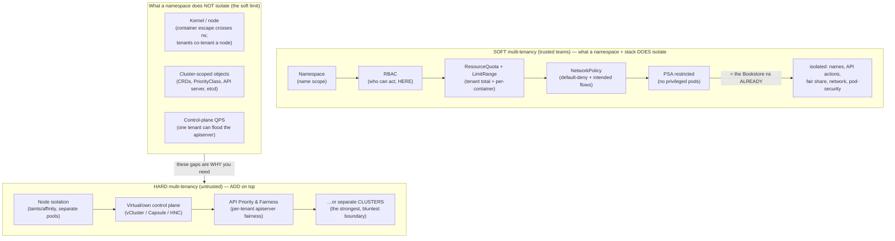

# 04 — Multi-tenancy and namespaces

> The namespace as the **primary tenancy boundary** — and the precise list of
> what it does **not** isolate (nodes, the kernel, cluster-scoped objects, the
> API server itself). **Soft multi-tenancy** (trusted teams: namespace + RBAC +
> ResourceQuota + LimitRange + NetworkPolicy + PSA — the Bookstore namespace
> *already* demonstrates every one of these; this chapter ties them together
> and extends to a *second* tenant) vs **hard multi-tenancy** (hostile tenants:
> + node isolation, separate control planes, vCluster/Capsule/HNC, or just
> separate clusters); the **namespace-as-env vs namespace-as-tenant**
> distinction (this guide uses Kustomize overlays for *envs* in one
> `bookstore` ns — envs ≠ tenants — and how you'd extend to per-team
> namespaces under an AppProject-per-team); fairness (Quota/LimitRange/
> PriorityClass/preemption — [Part 04](../04-scheduling/03-priority-and-preemption.md)),
> noisy-neighbour, cost attribution ([Part 06
> ch.06](../06-production-readiness/06-capacity-and-cost.md)); and the
> HNC/vCluster/Capsule landscape at the right depth — applied with a worked
> `tenant-acme` namespace carrying its own full guardrail stack.

**Estimated time:** ~30 min read · ~60 min hands-on
**Prerequisites:** [Part 05 ch.01](../05-security/01-authn-authz-rbac.md) — RBAC at the namespace boundary · [Part 06 ch.06](../06-production-readiness/06-capacity-and-cost.md) — ResourceQuota & cost attribution per tenant · [Part 02 ch.06](../02-networking/06-network-policies.md) — NetworkPolicy is the only network tenancy primitive
**You'll know after this:** • articulate exactly what a namespace does and does *not* isolate · • build a soft-multi-tenant stack with namespace + RBAC + Quota + LimitRange + NetworkPolicy + PSA · • choose between soft tenancy, hard tenancy and separate clusters by trust model · • distinguish namespace-as-env from namespace-as-tenant cleanly · • add a second tenant to the cluster with full guardrails alongside the Bookstore

<!-- tags: multi-tenancy, security, platform-engineering, day-2 -->

## Why this exists

The Bookstore has, since Part 01, lived in **one namespace** with a
**ResourceQuota + LimitRange** ([Part 01
ch.03](../01-core-workloads/03-resources-and-qos.md)), **RBAC + ServiceAccounts**
([Part 05 ch.01](../05-security/01-authn-authz-rbac.md)), **NetworkPolicies**
([Part 02 ch.06](../02-networking/06-network-policies.md)), and **PSA
`restricted`** ([Part 05 ch.02](../05-security/02-pod-security.md)). Each was
introduced for its own reason. **Together they are exactly the soft-multi-tenancy
control set** — the guide built a tenant-isolation stack without ever calling
it that. This chapter names it, and answers the question every multi-team
cluster eventually forces: *can two teams safely share this cluster, and how
hard is "safely"?*

Two misconceptions make this a required chapter, not an optional one:

1. **"A namespace isolates tenants."** A namespace scopes *names*, *RBAC*,
   *quota*, and (with NetworkPolicy/PSA) *network and pod-security* — it does
   **not** isolate the **kernel** (a container escape on a shared node crosses
   namespaces), the **nodes** (two tenants' Pods can co-tenant a node),
   **cluster-scoped objects** (CRDs, PriorityClasses, the API server, etcd), or
   **the control plane's QPS**. Soft multi-tenancy is "trusted teams, strong
   guardrails"; hostile tenants need *more* than a namespace.
2. **"Environments are tenants."** This guide deploys dev/staging/prod as
   **Kustomize overlays into one `bookstore` namespace** ([Part 07
   ch.02](../07-delivery/02-packaging-kustomize.md)) — that is **environment**
   separation of **one** app, not **tenant** separation of **many**. Conflating
   them produces either over-isolated envs or dangerously under-isolated
   tenants. The distinction is structural and this chapter draws it.

The reference is *Production Kubernetes* (Multitenancy); the access-control
lens is *Kubernetes Patterns* ch.26.

## Mental model

**A namespace is a soft boundary made real only by the guardrail stack you
attach to it; "how hostile are the tenants?" decides whether soft is enough.**

- **The namespace isolates *names and policy attachment points*, nothing
  physical.** It gives you a scope for RBAC, a target for ResourceQuota/
  LimitRange, a selector for NetworkPolicy, and a label set for PSA. It does
  **not** give you a kernel boundary, a node boundary, or a control-plane
  boundary. Isolation is the *sum of the policies you attach*, not a property
  of the namespace itself.
- **Soft multi-tenancy = trusted teams + the full guardrail stack.** Per-tenant
  **namespace** (the scope) + **RBAC** (who can do what, *here*) +
  **ResourceQuota** (the tenant's total) + **LimitRange** (per-container
  bounds) + **NetworkPolicy** (default-deny + only-intended flows) + **PSA**
  (no privileged pods). The Bookstore namespace already runs **all six** — it
  is a *one-tenant* instance of exactly this pattern.
- **Hard multi-tenancy = you don't trust the tenants, so the namespace isn't
  enough.** Add **node isolation** (taints/affinity or separate node pools so
  tenants don't share a kernel), and/or **separate control planes** (vCluster —
  a virtual control plane per tenant; Capsule — a tenant operator;
  HNC — hierarchical namespaces), and/or the bluntest, strongest answer:
  **separate clusters**. The stronger the distrust, the further from "just a
  namespace" you go — up to "not even the same cluster".
- **Env ≠ tenant.** *Environments* (dev/staging/prod of the **same** app) are
  the **same owner**, isolated for *lifecycle/blast-radius* — Kustomize overlays
  ([Part 07 ch.02](../07-delivery/02-packaging-kustomize.md)) into one ns is
  fine. *Tenants* (different **owners**) are isolated for *security and
  fairness* — they need **separate namespaces**, each with its **own** full
  guardrail stack, scoped by **an AppProject per team** ([Part 07
  ch.04](../07-delivery/04-gitops-argocd.md)).
- **Fairness is multi-layer.** Inside a namespace: **ResourceQuota** caps the
  total, **LimitRange** bounds each container, **PriorityClass/preemption**
  ([Part 04 ch.03](../04-scheduling/03-priority-and-preemption.md)) decide who
  wins under contention. *Above* the namespace: **API Priority & Fairness**
  protects the **apiserver/etcd** from one tenant's request flood — a noisy
  neighbour at the *control-plane* layer that quotas don't touch.

The trap to hold: **the namespace is a *trust* boundary, not a *security*
boundary in the kernel sense.** It is strong enough for teams in the same org
(soft); it is *not* a sandbox for code you don't trust. Knowing which regime
you're in is the entire decision — and it dictates everything from node pools
to whether you should be running one cluster at all.

## Diagrams

### Diagram A — soft vs hard tenancy: what each layer isolates (Mermaid)



### Diagram B — namespace-per-team layout with the guardrail stack (ASCII)

```
 ENV vs TENANT — and the per-tenant guardrail stack ────────────────────────

  THIS GUIDE (env separation of ONE app — same owner):
    cluster
      └── ns: bookstore   ◄── dev/staging/prod = KUSTOMIZE OVERLAYS (P07 ch.02)
            stack: [Quota][LimitRange][RBAC][NetworkPolicy][PSA restricted]
          (envs are NOT tenants — same team, isolated for lifecycle only)

  REAL MULTI-TENANT (tenant separation of MANY owners — extend to this):
    cluster
      ├── ns: tenant-acme     team=acme    AppProject: acme   (P07 ch.04)
      │     [Quota acme][LimitRange][RBAC→acme-team][NetPol deny+dns][PSA]
      ├── ns: tenant-globex   team=globex  AppProject: globex
      │     [Quota globex][LimitRange][RBAC→globex-team][NetPol deny+dns][PSA]
      └── ns: tenant-…        …            …
            ▲ EACH tenant: its OWN full guardrail set + its OWN AppProject
            ▲ cross-tenant traffic: default-DENY (NetworkPolicy)
            ▲ cross-tenant API: scoped by per-team RBAC + AppProject
            ▲ STILL shared (the soft limit): nodes/kernel, etcd, the apiserver
              → if tenants are HOSTILE: + node pools / vCluster / SEPARATE
                clusters (the further right, the stronger the distrust)
```

## Hands-on with the Bookstore

**Assumed working directory: the guide repo root (`full-guide/`).** This
chapter adds [`examples/bookstore/operators/second-tenant.yaml`](../examples/bookstore/operators/second-tenant.yaml)
(a pod-free `tenant-acme` namespace + its full guardrail stack). It does
**not** modify the `bookstore` namespace or any canonical manifest — the
existing stack is *demonstrated*, the second tenant is purely additive.

### 0. Prerequisites — fresh cluster + images + the Bookstore (self-bootstrapping)

```sh
kind delete cluster --name bookstore 2>/dev/null || true
kind create cluster --name bookstore
cd examples/bookstore/app
for s in catalog orders payments-worker storefront; do docker build -t bookstore/$s:dev ./$s; done
cd ../../..
for s in catalog orders payments-worker storefront; do kind load docker-image bookstore/$s:dev --name bookstore; done

kubectl apply -f examples/bookstore/raw-manifests/00-namespace.yaml
kubectl apply -f examples/bookstore/raw-manifests/05-serviceaccounts-rbac.yaml
kubectl apply -f examples/bookstore/raw-manifests/15-catalog-config.yaml
kubectl apply -f examples/bookstore/raw-manifests/16-db-credentials.yaml
kubectl apply -f examples/bookstore/raw-manifests/35-priorityclasses.yaml
kubectl apply -f examples/bookstore/raw-manifests/12-redis.yaml
kubectl apply -f examples/bookstore/raw-manifests/13-rabbitmq.yaml
kubectl apply -f examples/bookstore/raw-manifests/20-postgres-statefulset.yaml
kubectl apply -f examples/bookstore/raw-manifests/40-services.yaml
kubectl apply -f examples/bookstore/raw-manifests/10-catalog-deploy.yaml
kubectl apply -f examples/bookstore/raw-manifests/11-storefront-deploy.yaml
kubectl apply -f examples/bookstore/raw-manifests/14-orders-deploy.yaml
kubectl apply -f examples/bookstore/raw-manifests/19-payments-worker-deploy.yaml
kubectl apply -f examples/bookstore/raw-manifests/21-db-migrate-job.yaml
kubectl apply -f examples/bookstore/raw-manifests/60-networkpolicy.yaml
# the migration Job must COMPLETE (creates the `books` schema) before catalog/
# orders become Ready — otherwise they CrashLoop and the wait below times out:
kubectl wait --for=condition=complete job/db-migrate -n bookstore --timeout=120s
kubectl wait --for=condition=available deploy --all -n bookstore --timeout=180s
```

> **Self-bootstrapping note.** After any `kind delete && kind create`
> re-`kind load` the four images and re-run this chain.

### 1. The Bookstore namespace IS a soft-multi-tenancy instance — see the stack

Every guardrail is already there; multi-tenancy is just *recognising the
pattern* and *replicating it per tenant*:

```sh
# Fairness — the tenant's total + per-container bounds (Part 01 ch.03):
kubectl describe resourcequota,limitrange -n bookstore
#   bookstore-quota: requests.cpu 2 / memory 2Gi / pods 30 …  (the ns CAP)
#   bookstore-limits: per-Container default/min/max            (per-workload)

# Identity & authorization — scoped to THIS namespace (Part 05 ch.01):
kubectl get serviceaccounts -n bookstore               # 8 dedicated SAs
kubectl auth can-i --list \
  --as=system:serviceaccount:bookstore:catalog-sa -n bookstore | head
#   catalog-sa is bound narrowly; it has NO power in any other namespace.

# Network — default-deny + only intended flows (Part 02 ch.06):
kubectl get networkpolicy -n bookstore                 # default-deny + allows
kubectl get networkpolicy default-deny-all -n bookstore -o jsonpath='{.spec.policyTypes}'; echo

# Pod-security — the hard gate (Part 05 ch.02):
kubectl get ns bookstore -o jsonpath='{.metadata.labels}' | tr ',' '\n' | grep pod-security
#   pod-security.kubernetes.io/enforce:restricted  ← privileged pods REJECTED
```

That is the **complete soft-multi-tenancy control set**, already running for
one tenant. Multi-tenancy is making it *per tenant*.

### 2. Add a second tenant (the worked example — its own full stack)

`second-tenant.yaml` is `tenant-acme` with **its own** Quota, LimitRange,
RBAC, NetworkPolicies, and PSA labels — independent of `bookstore`:

```sh
# It's pod-free (ns/quota/limitrange/rbac/netpol only) → dry-run is CLEAN
# (no CRDs, no PSA admission — there are no pods to admit):
kubectl apply --dry-run=client -f examples/bookstore/operators/second-tenant.yaml
#   namespace/tenant-acme created (dry run)        ← clean, NO "no matches"
#   resourcequota/tenant-acme-quota created (dry run) … etc.

kubectl apply -f examples/bookstore/operators/second-tenant.yaml
kubectl get ns tenant-acme -o jsonpath='{.metadata.labels}' | tr ',' '\n' | grep -E 'tenant|pod-security'
kubectl describe resourcequota,limitrange -n tenant-acme    # acme's OWN caps
```

### 3. Prove the isolation the stack actually gives (and its limits)

```sh
# (a) RBAC isolation — acme's identity is powerless in bookstore (and vice
#     versa): the Role is NAMESPACED, so it does not cross.
kubectl auth can-i create deployments \
  --as=system:serviceaccount:tenant-acme:acme-deployer -n tenant-acme    # yes
kubectl auth can-i create deployments \
  --as=system:serviceaccount:tenant-acme:acme-deployer -n bookstore      # no
kubectl auth can-i create resourcequota \
  --as=system:serviceaccount:tenant-acme:acme-deployer -n tenant-acme    # no
#   ^ tenants CANNOT mint their own quota — capacity is platform-managed
#     (the same stance as the Bookstore AppProject's blacklist, Part 07 ch.04).

# (b) Quota isolation — acme's total is independent; acme exhausting its quota
#     cannot starve bookstore (namespace-level noisy-neighbour control):
kubectl get resourcequota -A | grep -E 'bookstore-quota|tenant-acme-quota'

# (c) Network isolation — cross-tenant traffic is default-DENIED both ways
#     (visible only on a policy-enforcing CNI; kind's default CNI is a no-op
#      for NetworkPolicy — Part 02 ch.06).
kubectl get networkpolicy -n tenant-acme    # default-deny + dns + same-ns-only

# (d) THE SOFT LIMIT — what the namespace does NOT isolate:
kubectl get nodes
#   Both bookstore and tenant-acme Pods can schedule onto the SAME node →
#   they SHARE a kernel and node resources. CRDs/PriorityClasses/the apiserver
#   are cluster-scoped and SHARED. For HOSTILE tenants this is insufficient:
#   add node isolation (taints/pools, Part 04 ch.02), a virtual control plane
#   (vCluster), or SEPARATE CLUSTERS — see Production notes.
```

### 4. How envs differ from tenants (the structural point, made concrete)

```sh
# This guide's dev/staging/prod are OVERLAYS of ONE app into ONE ns — SAME
# owner, isolated only for lifecycle (Part 07 ch.02):
kubectl kustomize examples/bookstore/kustomize/overlays/dev   | grep -m1 'namespace:'
kubectl kustomize examples/bookstore/kustomize/overlays/prod  | grep -m1 'namespace:'
#   both → namespace: bookstore  (envs are NOT separate tenants)
#
# A real TENANT (tenant-acme) is a SEPARATE namespace with its OWN guardrail
# stack and (in production) its OWN AppProject scoping its repo/destinations
# (Part 07 ch.04). Extending the Bookstore to multi-tenant = repeat
# second-tenant.yaml per team + one AppProject per team — NOT more overlays.
```

Clean up:

```sh
kubectl delete -f examples/bookstore/operators/second-tenant.yaml --ignore-not-found
kind delete cluster --name bookstore
```

## How it works under the hood

- **What a namespace actually is.** A namespace is a cluster-scoped object that
  creates a *scope* for **namespaced** resource names and a *target* for
  policy. The API server enforces that namespaced objects live in exactly one
  namespace; RBAC `Role`/`RoleBinding`, `ResourceQuota`, `LimitRange`, and
  `NetworkPolicy` are themselves namespaced and apply *only within* it; PSA
  reads the namespace's **labels** at admission. It is an *organisational and
  policy* construct — there is **no namespace boundary in the Linux kernel, the
  scheduler, or etcd**. That single fact is the whole soft/hard distinction.
- **The six guardrails and the layer each closes.** **RBAC** — *who* may act,
  scoped here (a namespaced Role cannot grant cross-namespace power — proven in
  step 3). **ResourceQuota** — admission rejects an object that would push the
  namespace's *aggregate* requests/limits/object-counts over the cap (one
  tenant can't consume the cluster). **LimitRange** — admission injects
  defaults and rejects per-container values outside [min,max] (one Pod can't
  request the whole quota). **NetworkPolicy** — the CNI drops traffic not
  explicitly allowed once any policy selects a Pod (default-deny → only
  intended flows; *both ends* needed under default-deny egress — [Part 02
  ch.06](../02-networking/06-network-policies.md)). **PSA** — admission rejects
  Pods (and ephemeral containers) that violate the namespace's Pod Security
  Standard (no privileged escape surface — [Part 05
  ch.02](../05-security/02-pod-security.md)). Together: name + authz + fairness
  + network + pod-security — the soft-tenancy set, all admission/CNI-enforced.
- **What the namespace does *not* isolate (the hard-tenancy gap, precisely).**
  (1) **Kernel/node** — Pods of different namespaces can be scheduled onto the
  same node and share one kernel; a container escape is **not** namespace-bound
  (mitigations: gVisor/Kata sandboxes, node pools per tenant). (2)
  **Cluster-scoped objects** — CRDs, `PriorityClass` (the Bookstore's `35-`),
  `ClusterRole`, `StorageClass`, the API server, **etcd** — all shared; a
  tenant with cluster-scoped RBAC affects everyone. (3) **Control-plane QPS** —
  one tenant hammering the API server degrades it for all; that is the job of
  **API Priority & Fairness** (`FlowSchema`/`PriorityLevelConfiguration`), not
  ResourceQuota. Soft tenancy accepts these shared surfaces because tenants are
  *trusted*; hard tenancy must close them.
- **vCluster / Capsule / HNC — what they actually do.** **vCluster** runs a
  *virtual* Kubernetes API server (+ its own etcd/k3s) for the tenant inside a
  host namespace: the tenant gets what looks like a whole cluster (their own
  CRDs, cluster-scoped objects, even namespaces) while the host schedules the
  real Pods — far stronger control-plane isolation than a namespace, short of a
  real cluster. **Capsule** is an operator that turns "a `Tenant` CR" into the
  enforced guardrail set (quota/RBAC/network/PSA) across a group of namespaces
  — automating exactly what `second-tenant.yaml` does by hand, at fleet scale.
  **HNC** (Hierarchical Namespace Controller) gives parent/child namespaces
  with **policy inheritance** (a team's RBAC/quota cascades to its sub-teams'
  namespaces) — structure for many related namespaces. None give a kernel
  boundary; for that you still need node isolation or separate clusters.
- **Env vs tenant is an ownership fact, not a size fact.** dev/staging/prod are
  the **same** owner's lifecycle stages — Kustomize overlays
  ([Part 07 ch.02](../07-delivery/02-packaging-kustomize.md)) into one ns,
  isolated for *blast radius*. Tenants are **different** owners — separate
  namespaces, separate guardrail stacks, separate **AppProjects** ([Part 07
  ch.04](../07-delivery/04-gitops-argocd.md)) scoping each team's repos and
  destinations. The Bookstore is *single-tenant, multi-env*; the multi-tenant
  extension is *more tenants*, not *more overlays* — a structural difference
  that drives RBAC, NetworkPolicy, and GitOps layout.

## Production notes

> **In production: soft multi-tenancy is the default for trusted teams — and
> it's the stack you already run.** Per-team **namespace + RBAC +
> ResourceQuota + LimitRange + NetworkPolicy (default-deny) + PSA** is
> sufficient when tenants are teams in one org. Make it self-service and
> *consistent*: a **Capsule `Tenant`** (or an HNC hierarchy, or a templated
> `second-tenant.yaml` applied by GitOps) so every tenant gets the *identical*
> guardrail set with no per-tenant drift, plus **one AppProject per team**
> ([Part 07 ch.04](../07-delivery/04-gitops-argocd.md)) so a tenant can only
> deploy its own repo into its own namespace.

> **In production: if tenants are not trusted, a namespace is not a sandbox.**
> A namespace shares the **kernel, nodes, and control plane**. For hostile or
> regulatory-isolated tenants add, in increasing strength: **node isolation**
> (taints/affinity or dedicated node pools so tenants don't share a kernel —
> [Part 04 ch.02](../04-scheduling/02-affinity-taints-topology.md)), **sandboxed
> runtimes** (gVisor/Kata), a **virtual control plane** (**vCluster** —
> per-tenant API server + CRDs), and ultimately **separate clusters** (the
> only complete boundary; the cost is fleet management — [ch.01](01-cluster-lifecycle.md)).
> Choose by threat model, not by Pod count.

> **In production: protect the control plane from noisy tenants, not just the
> nodes.** ResourceQuota/LimitRange/PriorityClass bound *compute*; they do
> nothing for a tenant flooding the **API server**. **API Priority & Fairness**
> (`FlowSchema` + `PriorityLevelConfiguration`) classifies and fair-queues
> apiserver requests so one tenant's controller storm can't starve others
> (a real multi-tenant incident — etcd/apiserver are the shared bottleneck).
> Pair it with per-tenant apiserver/etcd request-rate dashboards
> ([Part 06 ch.01](../06-production-readiness/01-observability-metrics.md)).

> **In production: attribute cost per tenant or the model fails financially.**
> Multi-tenancy without **cost attribution** is a subsidy and an argument
> waiting to happen. Label every namespace with the tenant
> (`second-tenant.yaml` sets `tenant: acme`) and run **OpenCost/Kubecost**
> ([Part 06 ch.06](../06-production-readiness/06-capacity-and-cost.md)) to
> split shared-cluster cost by namespace/label, so quotas map to **budgets** and
> the chargeback/showback conversation is data, not opinion.

## Quick Reference

```sh
# Inspect a namespace's tenancy guardrail stack (the soft-tenancy control set)
kubectl describe resourcequota,limitrange -n <NS>             # fairness
kubectl get serviceaccounts,role,rolebinding -n <NS>          # authz scope
kubectl auth can-i --list --as=system:serviceaccount:<NS>:<SA> -n <NS>
kubectl get networkpolicy -n <NS>                             # default-deny?
kubectl get ns <NS> -o jsonpath='{.metadata.labels}'          # PSA labels

# Add a tenant (its OWN full stack; pod-free → dry-run is CLEAN, no CRDs/PSA)
kubectl apply --dry-run=client -f examples/bookstore/operators/second-tenant.yaml
kubectl apply -f examples/bookstore/operators/second-tenant.yaml

# Prove isolation (and its limit)
kubectl auth can-i create deployments \
  --as=system:serviceaccount:tenant-acme:acme-deployer -n bookstore   # no
kubectl get nodes      # SHARED kernel/nodes — the soft limit (hostile→more)
```

Minimal per-tenant skeleton (the shape; full stack in `second-tenant.yaml`):

```yaml
apiVersion: v1
kind: Namespace
metadata:
  name: tenant-<X>
  labels:
    tenant: <X>
    pod-security.kubernetes.io/enforce: restricted   # PSA per tenant
---
apiVersion: v1
kind: ResourceQuota                                   # the tenant's TOTAL
metadata: { name: tenant-<X>-quota, namespace: tenant-<X> }
spec: { hard: { requests.cpu: "1", requests.memory: 1Gi, pods: "15" } }
---
apiVersion: rbac.authorization.k8s.io/v1
kind: Role                                            # NAMESPACED → scoped here
metadata: { name: <X>-admin, namespace: tenant-<X> }
rules: [ { apiGroups: ["apps",""], resources: ["deployments","pods","services"], verbs: ["*"] } ]
---
apiVersion: networking.k8s.io/v1
kind: NetworkPolicy                                   # default-deny baseline
metadata: { name: default-deny-all, namespace: tenant-<X> }
spec: { podSelector: {}, policyTypes: ["Ingress","Egress"] }
# + allow-dns-egress + same-namespace-only + (prod) one AppProject per tenant
```

Checklist:

- [ ] Recognise the namespace as a **soft** boundary: it isolates names/RBAC/
      quota/network/pod-security, **not** kernel/nodes/cluster-scoped/apiserver
- [ ] Every tenant gets the **full stack** (ns + RBAC + ResourceQuota +
      LimitRange + NetworkPolicy default-deny + PSA) — *consistently*
      (Capsule/HNC/GitO- templated, not hand-rolled per tenant)
- [ ] **Envs ≠ tenants**: dev/staging/prod = overlays of one app (same owner);
      tenants = separate namespaces + **one AppProject per team**
- [ ] Tenants **cannot mint their own quota/limitrange** (capacity is
      platform-managed); RBAC is **namespaced**, not ClusterRole
- [ ] Hostile tenants → add **node isolation / sandboxed runtime / vCluster /
      separate clusters**; protect the apiserver with **API Priority & Fairness**
- [ ] **Cost attributed per tenant** (namespace label + OpenCost/Kubecost) so
      quota maps to budget — [Part 06 ch.06](../06-production-readiness/06-capacity-and-cost.md)
- [ ] `second-tenant.yaml` (pod-free) **dry-runs clean** with no CRD caveat and
      is **purely additive** (the `bookstore` ns is untouched)

## Test your understanding

> Try each before opening the answer drawer. The act of trying is the exercise; the answer is the check.

1. **The slogan "a namespace isolates tenants" is wrong in important ways. List four things a namespace does NOT isolate.**
   <details><summary>Show answer</summary>

   (1) The **kernel** — a container escape on a shared node crosses namespace boundaries. (2) The **nodes** — two tenants' Pods can co-tenant a node and compete for CPU/IO. (3) **Cluster-scoped objects** — CRDs, PriorityClasses, ClusterRoles, the API server itself. (4) **API server QPS / control-plane resources** — a noisy tenant can saturate the apiserver. A namespace isolates *names*, *RBAC*, *quota*, and *policy attachment points*; nothing physical. Soft tenancy is "trusted teams + guardrails"; for hostile tenants you need more. See §Mental model.

   </details>

2. **A team says "we're already multi-tenant — we have dev, staging, and prod namespaces." Explain why that's confusing two different things.**
   <details><summary>Show answer</summary>

   dev/staging/prod are **environments of one app** (same owner, same code, different config) — they belong to **one tenant** and are correctly handled by Kustomize overlays of one base or Helm `values-<env>.yaml`. **Tenants** are *different owners* — team-A's payments vs team-B's catalog — needing separate RBAC, quotas, NetworkPolicies, AppProjects, and cost attribution. Conflating them produces either over-isolated envs (slow promotion) or dangerously under-isolated tenants (one team's bug evicts another's pods). The structural difference is "who owns this", not "what stage is this in".

   </details>

3. **You're told "make team Acme a tenant in our shared cluster." Walk through the six-element guardrail stack you'd apply.**
   <details><summary>Show answer</summary>

   (1) **Namespace** `tenant-acme` (the scope). (2) **RBAC** — namespaced `Role` + `RoleBinding` for Acme's group, no ClusterRoles. (3) **ResourceQuota** — Acme's *total* CPU/memory/pod budget. (4) **LimitRange** — per-container default/min/max so a bad pod can't claim the whole quota. (5) **NetworkPolicy default-deny** + only-intended Ingress/Egress rules. (6) **PSA `enforce: restricted`** on the namespace. Plus, in production, one **Argo AppProject per tenant** and a cost label (`tenant: acme`) so OpenCost can chargeback. The Bookstore namespace runs all six already — it's a one-tenant instance of this pattern.

   </details>

4. **Hands-on extension — verify cross-tenant isolation. Apply `second-tenant.yaml`. Then try `kubectl auth can-i create deployments --as=system:serviceaccount:tenant-acme:acme-deployer -n bookstore`. What does it return, and what command verifies the limit?**
   <details><summary>What you should see</summary>

   `no` — `acme-deployer` is bound only to a `Role` in `tenant-acme`, and Roles are namespaced; no permissions leak to `bookstore`. Now verify the *limit* of namespace tenancy: `kubectl get nodes --as=system:serviceaccount:tenant-acme:acme-deployer` — this *also* returns `no` (good), but the truth is that Acme's Pods still run on the **same nodes** as Bookstore's. The namespace stops API access; only **node isolation** (taints/affinity or separate pools) stops co-tenancy. That's the soft → hard tenancy line.

   </details>

5. **A tenant escalates: "we don't trust the other teams — they could break out of containers and access our data." When do you move from soft to hard multi-tenancy, and what does that actually look like?**
   <details><summary>Show answer</summary>

   When you can't trust tenants not to attempt container escape, the soft stack isn't enough. Hard tenancy adds **node isolation** (per-tenant node pools via taints + tolerations or labels), and/or a **sandboxed runtime** (gVisor, Kata Containers — user-mode kernel between container and host), and/or a **virtual control plane per tenant** (vCluster — each tenant gets a real-ish apiserver), and/or — bluntest, safest — **separate clusters per tenant**. The trade is operational cost ↔ blast-radius. Most production "hostile" cases end up at separate clusters because vCluster/Kata add complexity that outweighs the savings vs running multiple clusters.

   </details>

## Further reading

- **Rosso et al., _Production Kubernetes_, ch.12 — Multitenancy** (the
  primary reference: soft vs hard tenancy, the guardrail stack, where
  namespaces stop and node/control-plane isolation begins, and the operational
  trade-offs of shared clusters).
- **Ibryam & Huß, _Kubernetes Patterns_ 2e — *Access Control* (ch.26)** for the
  RBAC/identity lens underpinning per-tenant authorization (the "who can do
  what, where" half of tenant isolation).
- Official: namespaces
  <https://kubernetes.io/docs/concepts/overview/working-with-objects/namespaces/>,
  the multi-tenancy concept
  <https://kubernetes.io/docs/concepts/security/multi-tenancy/>, and resource
  quotas
  <https://kubernetes.io/docs/concepts/policy/resource-quotas/>.
