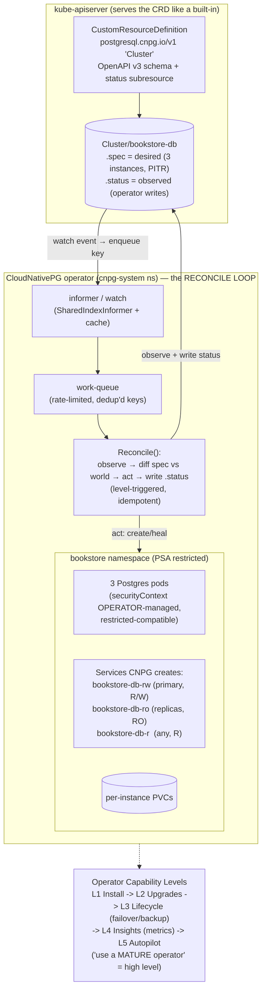

# 05 — Operators and CRDs

> Extending the API: **CustomResourceDefinitions** (OpenAPI v3 schema/
> validation, versions/conversion, the status subresource — the apiserver
> serves them like built-ins); the **controller pattern** (the reconcile loop:
> observe → diff → act, level-triggered, idempotent — the [Part 00
> declarative model](../00-foundations/06-declarative-api-model.md) made
> programmable); what an **Operator** *is* (CRD + controller encoding
> operational knowledge: provisioning, failover, backup, upgrade); the
> **Operator Capability Levels**, **OLM/OperatorHub**, the **build-vs-buy**
> decision (the Bookstore Postgres is the case study), and a conceptually
> accurate tour of a controller's internals (informers / work-queue /
> SharedIndexInformer). Then the **Bookstore re-platform**: the DIY Postgres
> StatefulSet → a **CloudNativePG `Cluster`** (an *additive alternative*, not a
> deletion — analogous to Gateway-vs-Ingress) with the **`DB_DSN` rewire** to
> the operator-created `-rw` Service shown reversibly.

**Estimated time:** ~30 min read · ~90 min hands-on
**Prerequisites:** [Part 00 ch.06](../00-foundations/06-declarative-api-model.md) — the declarative model an operator extends · [Part 01 ch.05](../01-core-workloads/05-statefulsets.md) — the DIY Postgres StatefulSet a CNPG Cluster replaces · [Part 03 ch.05](../03-config-and-storage/05-stateful-data-patterns.md) — operator-managed stateful patterns
**You'll know after this:** • write a CRD with OpenAPI v3 schema, versions and the status subresource · • explain the controller reconcile loop (observe → diff → act; level-triggered, idempotent) · • read the build-vs-buy framework via the Operator Capability Levels · • re-platform Postgres from a StatefulSet to a CNPG `Cluster` reversibly · • rewire the Bookstore `DB_DSN` to the operator-managed `-rw` Service

<!-- tags: core-objects, platform-engineering, stateful, day-2, cnpg -->

## Why this exists

The guide has now used a dozen CRD-backed APIs — `VolumeSnapshot`
([Part 03 ch.05](../03-config-and-storage/05-stateful-data-patterns.md)),
`HTTPRoute` ([Part 02 ch.05](../02-networking/05-gateway-api.md)), Kyverno
`ClusterPolicy`, Prometheus `ServiceMonitor`, KEDA `ScaledObject`, Argo CD
`Application` ([Part 07 ch.04](../07-delivery/04-gitops-argocd.md)), Velero
`Backup` ([ch.02](02-backup-and-dr.md)) — each carrying the same intrinsic
"`no matches for kind` until the operator is installed" note. Every one is the
**same pattern**: someone taught the Kubernetes API a new noun (a CRD) and ran
a controller that makes that noun *mean something*. This chapter is that
pattern, named and understood — and it answers the question
[Part 03 ch.05](../03-config-and-storage/05-stateful-data-patterns.md)
explicitly deferred: *the Bookstore's teaching Postgres StatefulSet is wrong
for production — what is the operator that replaces it, and how does the
swap actually work?*

Two reasons this is the part's penultimate chapter, not a footnote:

1. **Operators are how Kubernetes is actually extended in production.** The
   declarative model ([Part 00
   ch.06](../00-foundations/06-declarative-api-model.md)) isn't only for
   built-in objects — it's a *framework*: CRD + controller lets you manage
   *anything* (a Postgres cluster, a Kafka, a certificate, a cloud bucket) with
   the same `kubectl apply` + reconcile semantics. Not understanding this
   leaves every CRD in the guide as magic.
2. **"Should you run a database on Kubernetes?" has had a deferred answer since
   Part 03.** [Part 01 ch.05](../01-core-workloads/05-statefulsets.md) and
   [Part 03 ch.05](../03-config-and-storage/05-stateful-data-patterns.md) both
   ended on: the DIY StatefulSet is correct for *learning* and a SPOF with no
   failover/PITR/managed upgrades for *production* — use a **managed DB** or a
   **mature operator (CloudNativePG)**. This chapter is where that operator
   becomes concrete, presented (like Gateway-vs-Ingress) as an **additive
   alternative**, not a rewrite of the canonical app.

The reference is *Kubernetes Patterns* ch.27 (Controller) + ch.28 (Operator),
with *Production Kubernetes* for the operational framing.

## Mental model

**CRD = a new noun the apiserver serves; controller = a loop that makes the
noun true; Operator = a controller that encodes an expert's operational
playbook for a stateful thing.**

- **A CRD adds a first-class API type.** Register a `CustomResourceDefinition`
  and the apiserver serves `kubectl get cluster`, validates it against your
  **OpenAPI v3 schema**, version-converts it, stores it in etcd, and runs RBAC
  on it — **exactly like a built-in**. The only difference from `Deployment` is
  that *you* shipped the type. (This is *why* every CRD object in the guide
  prints `no matches for kind` until its CRD is installed — the noun literally
  doesn't exist yet.)
- **A controller is a reconcile loop.** It **watches** objects of some kind,
  compares **desired** (`.spec`) to **observed** (the real world), and **acts**
  to close the gap, then writes **observed back** (`.status`). It is
  **level-triggered** (it reconciles to the *current* desired state, not a
  *stream of edits* — it self-corrects after a missed event) and **idempotent**
  (reconciling an already-correct object is a no-op). This *is* the [Part 00
  declarative model](../00-foundations/06-declarative-api-model.md) — built-in
  controllers (Deployment→ReplicaSet→Pods) work this exact way; an operator is
  the same machinery for *your* CRD.
- **An Operator = CRD + controller that encodes operational knowledge.** A bare
  StatefulSet gives identity+storage and **stops there** — *you* are the DBA
  (backups, failover, PITR, version upgrades are manual runbooks). An
  **operator** *is* that DBA as software: its controller watches a
  `postgresql.cnpg.io/v1 Cluster` and continuously *does* the DBA job —
  provision replicas, stream replication, **fail over** the primary on loss,
  archive WAL for **PITR**, perform **rolling minor upgrades**.
- **Operator Capability Levels** grade how much of that playbook is encoded:
  L1 Basic Install → L2 Seamless Upgrades → L3 Full Lifecycle (backup/
  failover) → L4 Deep Insights (metrics/alerts) → L5 Autopilot (auto-tuning/
  remediation). "Use a mature operator" means **high level**, not "any
  operator".
- **Build vs buy is the real decision.** A Helm chart/StatefulSet suffices when
  the operational logic is trivial (stateless app, or a DB you'll let a
  *managed service* run). You need (or buy) an **operator** when the
  operational logic is hard and stateful — *exactly* the Bookstore Postgres:
  failover + PITR + upgrades are too much to encode in a StatefulSet, so you
  **buy** CloudNativePG rather than **build** that controller yourself.

The trap to keep in view: **an operator is not free magic — it is software you
now run and must trust.** It has a controller Pod, RBAC (often broad — it
manages Pods/PVCs/Secrets), CRD versioning, and its own upgrade story. "Buy a
mature operator" is right *because writing the failover controller yourself is
harder and riskier* — not because operators have no cost.

## Diagrams

### Diagram A — CRD + controller reconcile loop / operator capability levels (Mermaid)



### Diagram B — StatefulSet vs Operator decision (ASCII)

```
 RUN POSTGRES ON KUBERNETES — StatefulSet vs Operator vs Managed ───────────

  Q1: Is it customer/production data?
        NO  (a lab, ephemeral, learning the primitives)
             → DIY StatefulSet is FINE  ◄── the Bookstore's canonical
               (20-postgres-statefulset.yaml — identity/PVC/ordering/snapshot;
                ONE replica, NO failover/PITR/managed upgrade — and that's OK
                for teaching)
        YES → Q2
  Q2: Can you use a MANAGED database (RDS / Cloud SQL / Azure DB)?
        YES → MANAGED  (provider's operator + SLA: backups, HA, PITR, patching;
                         app becomes a Deployment + ExternalName Service.
                         LEAST operational burden — prefer this.)
        NO  (must run in-cluster: data residency, cost, air-gapped) → Q3
  Q3: In-cluster → use a MATURE OPERATOR, not a bigger StatefulSet
        → CloudNativePG `Cluster`  ◄── cnpg-cluster.yaml (THIS chapter)
          encodes as software: streaming replication, AUTOMATED failover,
          WAL archiving + PITR, rolling minor upgrades, metrics
          (L3-L4 capability). DO NOT hand-build this controller.

  StatefulSet  ─────────────────────────────────────────────▶  Operator
   you ARE the DBA (manual runbooks)        the operator IS the DBA (software)
   identity + storage, then STOPS           + failover + PITR + upgrades
   1 replica = SPOF                         primary + replicas + auto-failover
   crash-consistent snapshot only           continuous WAL → PITR (seconds RPO)

  ON DISK: cnpg-cluster.yaml is ADDITIVE — 20-postgres-statefulset.yaml is
  KEPT unchanged (alternative, like 51-gateway vs 50-ingress). Mutually
  exclusive at RUNTIME; never a deletion of the canonical app.
```

## Hands-on with the Bookstore

**Assumed working directory: the guide repo root (`full-guide/`).** This
chapter adds [`examples/bookstore/operators/cnpg-cluster.yaml`](../examples/bookstore/operators/cnpg-cluster.yaml).
It does **not** modify `20-postgres-statefulset.yaml` or any canonical
manifest — CloudNativePG is presented as an *alternative* data tier (the
Gateway-vs-Ingress precedent), and the `DB_DSN` rewire is shown **reversibly**
via `kubectl set env`, never by editing `10-`/`14-`/`16-`.

> **The honest local story (read this first).** CloudNativePG's production
> value is **failover + WAL-archived PITR to an object store**. On a laptop
> kind cluster there is no real bucket and (with `local-path`) limited storage;
> this Hands-on installs the operator and runs a real multi-instance `Cluster`
> with a **real automated failover demo**, and is explicit that **PITR/backup
> needs a real object store** (the `barmanObjectStore` in the manifest is a
> labelled placeholder — same established honesty as the Velero local-object-
> store and GitOps local-remote notes). The CRD-intrinsic dry-run behaviour is
> documented exactly like every prior CRD object.

### 0. Prerequisites — fresh cluster + images + the Bookstore namespace

```sh
kind delete cluster --name bookstore 2>/dev/null || true
kind create cluster --name bookstore
cd examples/bookstore/app
for s in catalog orders payments-worker storefront; do docker build -t bookstore/$s:dev ./$s; done
cd ../../..
for s in catalog orders payments-worker storefront; do kind load docker-image bookstore/$s:dev --name bookstore; done

# We need the bookstore ns + config/secret + the app's stateless tier; the
# CANONICAL postgres StatefulSet (20-) is intentionally NOT applied here —
# this chapter stands up the OPERATOR-managed Postgres as the alternative.
kubectl apply -f examples/bookstore/raw-manifests/00-namespace.yaml
kubectl apply -f examples/bookstore/raw-manifests/05-serviceaccounts-rbac.yaml
kubectl apply -f examples/bookstore/raw-manifests/15-catalog-config.yaml
kubectl apply -f examples/bookstore/raw-manifests/16-db-credentials.yaml
kubectl apply -f examples/bookstore/raw-manifests/35-priorityclasses.yaml
```

> **Self-bootstrapping note.** After any `kind delete && kind create`
> re-`kind load` the four images, re-run the chain above, and re-install the operator
> (step 1) — a fresh cluster has neither the images nor CNPG.

### 1. Install the CloudNativePG operator (Helm, pinned, own namespace)

Per this guide's rule — **prefer Helm; never
`releases/latest/download/<PINNED-FILE>.yaml`** (it 404s on new releases).
CNPG's official chart is `cnpg/cloudnative-pg`. Pin the chart version (the
`TRIVY_VERSION`/`KUSTOMIZE_VERSION`/`VELERO_CHART_VERSION` precedent):

```sh
CNPG_CHART_VERSION=0.22.1            # cnpg/cloudnative-pg chart version (pin)

helm repo add cnpg https://cloudnative-pg.github.io/charts
helm repo update
helm upgrade --install cnpg cnpg/cloudnative-pg \
  --version "$CNPG_CHART_VERSION" \
  --namespace cnpg-system --create-namespace --wait
# (the operator runs in its OWN cnpg-system ns — NOT PSA-restricted, exactly
#  like the Velero/Argo/monitoring controllers. The Postgres pods it manages
#  land in `bookstore` and ARE restricted-compatible — CNPG officially
#  supports the restricted Pod Security Standard.)
kubectl -n cnpg-system rollout status deploy/cnpg-cloudnative-pg
kubectl get crd | grep cnpg.io       # clusters.postgresql.cnpg.io now EXISTS
```

Installing CNPG created the `postgresql.cnpg.io` CRDs. **This is what makes the
manifest below dry-runnable** — before this step a client dry-run prints `no
matches for kind "Cluster"` (the documented CRD-intrinsic behaviour; step 5).

### 2. Apply the `Cluster` — the operator provisions Postgres

```sh
kubectl apply -f examples/bookstore/operators/cnpg-cluster.yaml
#   creates: the ADDITIVE cnpg-app-credentials basic-auth Secret (NOT a
#   mutation of 16-db-credentials) + Cluster/bookstore-db. The operator now
#   reconciles it: 3 instances, streaming replication, the Services.
kubectl get cluster -n bookstore -w
#   bookstore-db   ...   Cluster in healthy state   3/3 instances
kubectl get pods -n bookstore -l cnpg.io/cluster=bookstore-db
#   bookstore-db-1 (primary)  bookstore-db-2  bookstore-db-3 (replicas)
kubectl get svc -n bookstore -l cnpg.io/cluster=bookstore-db
#   bookstore-db-rw  → the PRIMARY (read/write)   ← the app connects HERE
#   bookstore-db-ro  → replicas (read-only)
#   bookstore-db-r   → any instance (read)
```

The operator wrote the **securityContext on those pods itself** (non-root,
drop ALL, seccomp RuntimeDefault) — which is *why* they admit into the
PSA-`restricted` `bookstore` namespace without you hand-writing it (contrast
the DIY StatefulSet, where you wrote that block by hand — [Part 05
ch.02](../05-security/02-pod-security.md)). Encoding that is part of what you
*buy*.

### 3. The `DB_DSN` rewire — point the app at `-rw` (reversible; no canonical edit)

The canonical `DB_DSN` is `host=postgres.bookstore.svc...` (byte-identical
catalog==orders, the source of truth on disk — **not edited**). CNPG's primary
Service is `bookstore-db-rw`. Rewire the *running* Deployments imperatively:

```sh
# deploy catalog/orders so there is something to rewire (they expect a DB).
# NOTE: this chapter did NOT apply the DIY 20-postgres StatefulSet (step 0) —
# there is no `postgres` Service — so catalog/orders are NOT Ready yet with
# their canonical host=postgres… DSN. That is expected: we rewire them at the
# CNPG DB next, THEN run the schema migration against it, THEN they go Ready.
kubectl apply -f examples/bookstore/raw-manifests/12-redis.yaml
kubectl apply -f examples/bookstore/raw-manifests/13-rabbitmq.yaml
kubectl apply -f examples/bookstore/raw-manifests/40-services.yaml
kubectl apply -f examples/bookstore/raw-manifests/10-catalog-deploy.yaml
kubectl apply -f examples/bookstore/raw-manifests/14-orders-deploy.yaml

# REWIRE (imperative — 10-/14-/16- on disk are NOT touched): point DB_DSN at
# the CNPG primary Service. user/password unchanged (cnpg-app-credentials
# holds the SAME bookstore/devpassword), only the HOST changes.
NEWDSN='host=bookstore-db-rw.bookstore.svc.cluster.local port=5432 user=bookstore password=devpassword dbname=bookstore sslmode=disable'
kubectl set env deploy/catalog deploy/orders -n bookstore DB_DSN="$NEWDSN"

# The CNPG-created `bookstore` DB is EMPTY (initdb created the db+owner, not
# the app schema). The canonical 21-db-migrate-job.yaml hardcodes
# PGHOST=postgres.bookstore.svc… (the DIY Service, which this chapter did NOT
# create) so it CANNOT be reused as-is here — and editing it is forbidden
# (canonical regression invariant). Apply the SAME idempotent schema with a
# throwaway, restricted-compliant one-off pod pointed at the CNPG `-rw`
# Service instead (the migrate Job's exact SQL; reuses cnpg-app-credentials):
kubectl run db-migrate-cnpg -n bookstore --rm -i --restart=Never \
  --image=postgres:16 \
  --overrides='{"spec":{"securityContext":{"runAsNonRoot":true,"runAsUser":999,"seccompProfile":{"type":"RuntimeDefault"}},"containers":[{"name":"db-migrate-cnpg","image":"postgres:16","stdin":true,"env":[{"name":"PGHOST","value":"bookstore-db-rw.bookstore.svc.cluster.local"},{"name":"PGUSER","value":"bookstore"},{"name":"PGPASSWORD","value":"devpassword"},{"name":"PGDATABASE","value":"bookstore"}],"command":["/bin/sh","-c","until pg_isready -q; do sleep 2; done; psql -v ON_ERROR_STOP=1 -c \"CREATE TABLE IF NOT EXISTS books (id SERIAL PRIMARY KEY, title TEXT, author TEXT, price NUMERIC); CREATE TABLE IF NOT EXISTS orders (id SERIAL PRIMARY KEY, book_id INT, qty INT, created_at TIMESTAMPTZ);\"; echo migration complete"],"securityContext":{"allowPrivilegeEscalation":false,"runAsNonRoot":true,"runAsUser":999,"capabilities":{"drop":["ALL"]},"seccompProfile":{"type":"RuntimeDefault"}}}]}}'
#   ^ restricted-compliant overrides (bookstore enforces PSA restricted even
#     for a throwaway run pod); UID 999 = the postgres-image non-root user.
#     This is the migrate Job's IDENTICAL SQL, just targeting the CNPG DB —
#     the canonical Job/manifests on disk are untouched.
kubectl rollout status deploy/catalog -n bookstore
kubectl rollout status deploy/orders  -n bookstore
kubectl wait --for=condition=available deploy/catalog deploy/orders -n bookstore --timeout=120s
# catalog/orders now talk to the OPERATOR-managed Postgres. Verify:
kubectl exec -n bookstore deploy/catalog -- /bin/true 2>/dev/null; \
  kubectl logs -n bookstore deploy/catalog --tail=5    # connected, serving

# REVERT — drop the imperative override; the Deployment's OWN DB_DSN (built
# from db-credentials, host=postgres…, the canonical source of truth) returns:
kubectl set env deploy/catalog deploy/orders -n bookstore DB_DSN-
#   (with the DIY StatefulSet running this points back at `postgres`; the
#    canonical manifests on disk were never modified — the rewire was purely
#    operational, exactly like a Kustomize overlay patch would be.)
```

> **In a real migration** the rewire is a **Kustomize overlay patch** (or a
> Helm value) flipping the `DB_DSN` host to `bookstore-db-rw`, reviewed and
> rolled out via GitOps ([Part 07 ch.04](../07-delivery/04-gitops-argocd.md)) —
> *not* a hand `kubectl set env`. It is shown imperatively here purely so the
> change is reversible in one command and **no canonical manifest is mutated**.

### 4. Failover demo — the operator IS the DBA (the StatefulSet can't do this)

Delete the primary Pod and watch the operator promote a replica automatically
— the operational logic a bare StatefulSet structurally lacks:

```sh
# plugin-free status (the kubectl-cnpg krew plugin is NOT installed — the Helm
# chart installs only the operator; the CR's .status carries the same facts):
kubectl get cluster bookstore-db -n bookstore -o wide
#   …   INSTANCES 3   READY 3   PRIMARY bookstore-db-1
kubectl get pods -n bookstore -l cnpg.io/cluster=bookstore-db
PRIMARY=$(kubectl get cluster bookstore-db -n bookstore -o jsonpath='{.status.currentPrimary}')
kubectl delete pod "$PRIMARY" -n bookstore           # simulate primary loss
kubectl get cluster bookstore-db -n bookstore -w
#   the operator detects the loss, PROMOTES a healthy replica to primary, and
#   re-points the bookstore-db-rw Service at the NEW primary — automatically,
#   no human runbook. The app (DB_DSN → bookstore-db-rw) follows the Service.
kubectl get cluster bookstore-db -n bookstore -o wide   # a NEW primary; HA held
#   (the kubectl-cnpg krew plugin gives a richer `kubectl cnpg status` view —
#    optional; install it via krew if you want it, the plugin-free path above
#    is sufficient and needs no extra tooling.)
```

> **Backup/PITR is the other bought capability — honest scope.** The
> manifest's `backup.barmanObjectStore` enables continuous WAL archiving →
> **point-in-time recovery** (restore to "30s before the bad migration" — the
> exact thing a crash-consistent VolumeSnapshot **cannot** do, [Part 03
> ch.05](../03-config-and-storage/05-stateful-data-patterns.md) /
> [ch.02](02-backup-and-dr.md)). It needs a **real object store** + credentials
> Secret (the `s3://bookstore-pg-backups/` path is a labelled placeholder).
> The *mechanism* is real and operator-managed; the bucket is the same
> substitution as Velero's local approximation — called out, not faked.

### 5. The CRD-intrinsic dry-run (documented, like every prior CRD object)

`Cluster` is `postgresql.cnpg.io/v1`. On a cluster **without** CNPG:

```sh
kubectl apply --dry-run=client -f examples/bookstore/operators/cnpg-cluster.yaml
# Secret/cnpg-app-credentials created (dry run)        ← built-in: clean
# error: ... no matches for kind "Cluster" in version "postgresql.cnpg.io/v1"
```

That is **expected and correct** — the *exact* precedent of
[`18-postgres-snapshot.yaml`](../examples/bookstore/raw-manifests/18-postgres-snapshot.yaml),
`51-gateway.yaml`, `70-kyverno-policy.yaml`, the `argocd/` tree, and
[`velero-backup.yaml`](../examples/bookstore/operators/velero-backup.yaml). The
manifest is **schema-correct** (verified against the CloudNativePG API
reference); the CRD must exist first. After step 1, `kubectl apply
--dry-run=server -f …` validates cleanly. Each file's header documents this.
Clean up:

```sh
kubectl delete -f examples/bookstore/operators/cnpg-cluster.yaml --ignore-not-found
helm uninstall cnpg -n cnpg-system
kind delete cluster --name bookstore
```

## How it works under the hood

- **A CRD is a real API type, served by the apiserver.** Applying a
  `CustomResourceDefinition` makes the apiserver dynamically serve a new
  REST path; requests are **validated against the CRD's OpenAPI v3 schema**
  (the same structural-schema machinery that validates built-ins), persisted in
  **etcd** like any object, **version-converted** on read (a `v1beta1`→`v1`
  conversion webhook, mirroring the built-in API lifecycle of
  [ch.01](01-cluster-lifecycle.md)), and subject to **RBAC** and **admission**.
  A `status` **subresource** splits writes so a controller updating `.status`
  doesn't fight a user editing `.spec`. The CR is inert data until a controller
  acts on it — which is precisely *why* every CRD object in this guide
  dry-runs as `no matches for kind` until its operator is installed: without
  the CRD the *type does not exist*; with the CRD but no controller the object
  exists but *nothing makes it true*.
- **A controller is `for { reconcile() }`.** It establishes a **watch** on its
  kind, maintained by an **informer**: a `SharedIndexInformer` does one watch,
  keeps a local **cache (store/indexer)**, and on every add/update/delete
  enqueues the object's **key** (`namespace/name`) onto a **rate-limited,
  de-duplicating work-queue**. Workers pop a key and call **`Reconcile(key)`**,
  which reads *current* desired+observed state and drives the world toward
  desired — then writes `.status`. It is **level-triggered** (it always
  reconciles to the *latest* desired state from the cache, so a missed/duplicate
  event is harmless — contrast edge-triggered, which would lose a missed edit)
  and **idempotent** (an already-correct object reconciles to a no-op). This is
  the **identical machinery** as the built-in Deployment→ReplicaSet→Pod
  controllers — the operator pattern is "this loop, for *your* CRD" and is the
  [Part 00 declarative model](../00-foundations/06-declarative-api-model.md)
  made programmable.
- **An operator encodes a human runbook as that loop.** CloudNativePG's
  `Reconcile` for a `Cluster` *is* a DBA: ensure N instances exist, configure
  streaming replication, **on primary loss promote the healthiest replica and
  repoint the `-rw` Service**, archive WAL continuously for **PITR**, and
  perform **rolling minor upgrades** (drain a replica, upgrade, rejoin,
  finally switch the primary per `primaryUpdateStrategy`). A StatefulSet's
  controller reconciles *only* "N pods with stable identity + PVCs" and
  **stops** — every DBA action above is *your* manual runbook. The operator is
  that runbook, level-triggered and always-on. It also writes the pods'
  `securityContext` itself (restricted-compatible) — operational correctness
  encoded, not hand-maintained.
- **Capability Levels are a maturity contract.** L1 install only → L2 seamless
  upgrades → L3 full lifecycle (backup/restore/failover) → L4 deep insights
  (metrics/alerts) → L5 autopilot (auto-tune/auto-remediate). CloudNativePG
  sits at L3–L4 for Postgres (failover + PITR + a `PodMonitor`). "Use a
  *mature* operator" ([Part 03
  ch.05](../03-config-and-storage/05-stateful-data-patterns.md)) means **pick a
  high level**, because a low-level operator hands the hard parts (failover)
  back to you while still adding a controller to operate.
- **OLM & OperatorHub.** Hand-installing operators (CRDs + RBAC + the
  controller Deployment, here via Helm) is fine at small scale. **Operator
  Lifecycle Manager** manages *operators themselves* — discovery
  (**OperatorHub**), versioned channels, dependency resolution, and **operator
  upgrades** — the "operator for your operators". Relevant at fleet scale; the
  Helm install is the right depth for one cluster.
- **Why CNPG is *additive*, not a replacement (the on-disk discipline).**
  `cnpg-cluster.yaml` is a **new file**; `20-postgres-statefulset.yaml` is
  **kept unchanged** — the *exact* relationship `51-gateway.yaml` has to
  `50-ingress.yaml` ([Part 02 ch.05](../02-networking/05-gateway-api.md)): two
  ways to provide the same capability, the modern one shipped alongside the
  teaching one, neither deleting the other. They are mutually exclusive *at
  runtime* (don't run both as the Bookstore's Postgres) but purely additive *on
  disk*. The credentials needed an **additive** `cnpg-app-credentials`
  basic-auth Secret (CNPG's `initdb.secret` requires `username`/`password`
  keys; the canonical `db-credentials` uses `POSTGRES_*` and is **not
  mutated**), and the `DB_DSN` rewire (`postgres` → `bookstore-db-rw`) is an
  **operational/overlay** change shown reversibly — the canonical app on disk
  is byte-for-byte unchanged, satisfying the rule that Part 08 must not modify
  it.

## Production notes

> **In production: prefer managed > mature operator > DIY StatefulSet for
> stateful data.** The Bookstore's `20-postgres-statefulset.yaml` is correct
> for *learning the primitives* and a SPOF with no failover/PITR/managed
> upgrades for *production* ([Part 01
> ch.05](../01-core-workloads/05-statefulsets.md), [Part 03
> ch.05](../03-config-and-storage/05-stateful-data-patterns.md)). Reach for a
> **managed DB** (RDS/Cloud SQL/Azure DB — the provider's operator + SLA) when
> you can; if you must run in-cluster, a **mature, high-capability operator**
> (CloudNativePG/Zalando/Crunchy; Strimzi for Kafka) — never a *bigger*
> StatefulSet. The decision (Diagram B) constrains your cluster and DR for
> years; make it deliberately.

> **In production: an operator is software you run — scope and upgrade it
> deliberately.** It is a Deployment with **broad RBAC** (it manages Pods,
> PVCs, Secrets, sometimes cluster-scoped objects — a real privilege and
> blast-radius surface; review it like any high-privilege workload — [Part 05
> ch.01](../05-security/01-authn-authz-rbac.md)), a CRD with a **version/
> conversion** story, and **its own upgrade** (operator upgrade ≠ database
> upgrade — sequence and test both; use **OLM** at fleet scale). Run it in its
> **own namespace**, pin its chart version ([ch.01](01-cluster-lifecycle.md)
> deprecation discipline), and monitor the operator itself, not only the DB.

> **In production: the DB_DSN rewire is a GitOps change, and it's a real
> migration, not a flag flip.** Repointing `DB_DSN` from `postgres` to
> `bookstore-db-rw` is a **Kustomize overlay/Helm-value change reviewed and
> rolled out via Argo CD** ([Part 07
> ch.04](../07-delivery/04-gitops-argocd.md)), *not* a hand `kubectl set env`
> (that is drift GitOps self-heals away). And moving the *data* from the old
> StatefulSet to the CNPG cluster is a genuine **data migration** (logical
> dump/restore or `pg_basebackup`/replication cutover, with a backup and a
> tested rollback — [ch.02](02-backup-and-dr.md)), planned with an RPO/RTO and
> a maintenance window — not just changing a hostname.

> **In production: build a CRD/operator only when buying genuinely doesn't fit.**
> The pattern (CRD + controller-runtime reconcile loop) is also how *you*
> encode *your* org's operational knowledge (a "TenantEnvironment" CRD, a
> certificate workflow). But **build-vs-buy strongly favours buy**: a mature
> operator is years of encoded failure-handling. Build when no operator covers
> your domain — and then treat your controller as production software (leader
> election for HA, bounded reconcile, tested idempotency, RBAC least-privilege,
> the same rigor as any service).

## Quick Reference

```sh
# CRDs the cluster serves (each = a new API noun a controller makes true)
kubectl get crd
kubectl explain cluster.spec --api-version=postgresql.cnpg.io/v1   # CRD schema

# Install an operator (Helm/pinned; never releases/latest/download/<PINNED>)
helm repo add cnpg https://cloudnative-pg.github.io/charts && helm repo update
helm upgrade --install cnpg cnpg/cloudnative-pg \
  --version <PINNED> -n cnpg-system --create-namespace --wait

# The Bookstore re-platform (ADDITIVE — 20-statefulset.yaml unchanged on disk)
kubectl apply -f examples/bookstore/operators/cnpg-cluster.yaml
kubectl get cluster -n bookstore -o wide                       # INSTANCES/READY/PRIMARY
kubectl get svc -n bookstore -l cnpg.io/cluster=bookstore-db   # -rw/-ro/-r
kubectl get pods -n bookstore -l cnpg.io/cluster=bookstore-db  # HA view (plugin-free)

# DB_DSN rewire to the operator primary (reversible; no canonical edit)
kubectl set env deploy/catalog deploy/orders -n bookstore \
  DB_DSN='host=bookstore-db-rw.bookstore.svc.cluster.local port=5432 user=bookstore password=devpassword dbname=bookstore sslmode=disable'
kubectl set env deploy/catalog deploy/orders -n bookstore DB_DSN-   # REVERT
```

Minimal CRD + `Cluster` skeleton (the shapes; full file in `operators/`):

```yaml
# A CRD: teach the apiserver a new noun (served like a built-in)
apiVersion: apiextensions.k8s.io/v1
kind: CustomResourceDefinition
spec:
  group: example.com
  scope: Namespaced
  names: { kind: Widget, plural: widgets }
  versions:
    - name: v1
      served: true
      storage: true
      schema: { openAPIV3Schema: { type: object } }   # validation
      subresources: { status: {} }                     # status subresource
---
# A CR of an OPERATOR's CRD (needs the operator installed — else no matches)
apiVersion: postgresql.cnpg.io/v1
kind: Cluster
metadata: { name: bookstore-db, namespace: bookstore }
spec:
  instances: 3                                          # operator: HA+failover
  storage: { size: 1Gi }
  bootstrap:
    initdb: { database: bookstore, owner: bookstore,
              secret: { name: cnpg-app-credentials } }   # basic-auth (additive)
  backup: { barmanObjectStore: { destinationPath: s3://… } }   # WAL → PITR
# → CNPG creates bookstore-db-rw / -ro / -r Services; DB_DSN host → -rw
```

Checklist:

- [ ] Understand CRD (= a new apiserver-served type, OpenAPI-validated, in
      etcd) + controller (= level-triggered, idempotent reconcile loop) =
      Operator (= that loop encoding an operational runbook)
- [ ] **Build vs buy:** stateless/managed → StatefulSet/managed-DB; hard
      stateful in-cluster → a **mature (high-capability) operator**, not a
      bigger StatefulSet
- [ ] The operator runs in its **own namespace**, chart **pinned**, RBAC
      reviewed (broad), operator-upgrade ≠ DB-upgrade — both tested
- [ ] CNPG is **additive** (`cnpg-cluster.yaml` new; `20-postgres-statefulset.yaml`
      unchanged on disk — Gateway-vs-Ingress precedent); creds via an
      **additive** basic-auth Secret (canonical `db-credentials` not mutated)
- [ ] `DB_DSN` rewire (`postgres` → `bookstore-db-rw`) is a **GitOps overlay
      change** in production, shown **reversibly** here; data move is a planned
      **migration** (backup + tested rollback — [ch.02](02-backup-and-dr.md))
- [ ] CNPG-managed pods are **PSA-`restricted`-compatible** (securityContext is
      operator-managed); the `Cluster` carries the documented **CRD-intrinsic
      dry-run** note
- [ ] PITR/backup needs a **real object store** (placeholder called out, not
      faked — the established local-approximation honesty)

## Test your understanding

> Try each before opening the answer drawer. The act of trying is the exercise; the answer is the check.

1. **In one sentence each, define CRD, Controller, and Operator, and explain how they compose.**
   <details><summary>Show answer</summary>

   **CRD** = a `CustomResourceDefinition` registered with the apiserver — teaches the API a new noun (e.g., `kind: Cluster`) with OpenAPI v3 validation, served like a built-in. **Controller** = a reconcile loop (observe → diff → act, level-triggered + idempotent) watching some object kind and making the world match `.spec`. **Operator** = a CRD + controller pair encoding an expert's operational knowledge for a stateful thing (Postgres failover, certificate renewal, backup orchestration). Operator = CRD + Controller + Domain Expertise. See §Mental model.

   </details>

2. **Why does the chapter say a controller is "level-triggered, not edge-triggered", and why does that matter?**
   <details><summary>Show answer</summary>

   Level-triggered = the controller reconciles to the **current** state of `.spec`, regardless of how many edits happened or in what order; if it misses an event it self-corrects on the next poll. Edge-triggered = it reacts to *each delta* in sequence; one missed event leaves it desynced forever. Kubernetes is level-triggered because controllers crash, get rate-limited, or lag — and the cluster must still converge. This is why `kubectl apply` is idempotent and why "reconcile every 30s" is correct (boring is good): the controller catches up on its own. The whole declarative model rests on this property.

   </details>

3. **A team wants to "just write our own Postgres controller" because they have specific HA needs. What's the build-vs-buy framework, and what do you tell them?**
   <details><summary>Show answer</summary>

   The Operator Capability Levels (1=install, 2=upgrade, 3=lifecycle, 4=insights, 5=autopilot) give you a target. **Buy** (CloudNativePG, Zalando Postgres Operator, Stackgres) when a mature L4-L5 operator covers your domain — you get years of failure-handling for free. **Build** only when no operator covers your *unique* requirements (a domain-specific CRD like "TenantEnvironment", an internal-only workflow). And then treat your controller as production software (leader election for HA, bounded reconcile, tested idempotency, RBAC). The reality is that 99% of Postgres needs are met by CNPG; build is almost always wrong for general-purpose stateful systems.

   </details>

4. **Hands-on extension — see the additive swap. With the Bookstore deployed, apply `cnpg-cluster.yaml` (CNPG installed). Now run `kubectl get pods -n bookstore -l cnpg.io/cluster=bookstore-db` and `kubectl get svc -n bookstore -l cnpg.io/cluster=bookstore-db`. What does the operator create that you didn't write?**
   <details><summary>What you should see</summary>

   3 pods (`bookstore-db-1`, `-2`, `-3`) — one primary, two replicas with streaming replication. Three Services: `bookstore-db-rw` (writes go to primary), `bookstore-db-ro` (reads load-balanced across replicas), `bookstore-db-r` (any healthy instance). The operator handled: HA topology, replica seeding, failover logic, role tracking, Service selectors. You wrote ~15 lines of YAML; CNPG handled hundreds of lines of operational logic that a hand-rolled StatefulSet would have to encode. That's the value proposition of buying an operator over building a StatefulSet.

   </details>

5. **A teammate sees `apiVersion: postgresql.cnpg.io/v1` in a YAML file and asks "is this a real Kubernetes type?" What's the precise answer, and why does it print `no matches for kind` until CNPG is installed?**
   <details><summary>Show answer</summary>

   It's a **real Kubernetes type** in every sense — the apiserver serves it, RBAC applies to it, kubectl handles it, etcd stores it — **once the CNPG CRD is registered**. CRDs add API types **dynamically**; before the CNPG operator is installed, that `Cluster` kind literally doesn't exist in the apiserver, so `kubectl apply` returns `no matches for kind: "Cluster"`. After the CRD is registered (via the operator's Helm install), it's indistinguishable from a built-in type. This is why every CRD-backed object in the guide carries an explicit "needs the operator installed" note — the cluster's API surface is *programmable*.

   </details>

## Further reading

- **Ibryam & Huß, _Kubernetes Patterns_ 2e — *Controller* (ch.27) and
  *Operator* (ch.28)**: the primary reference for the reconcile loop
  (level-triggered, idempotent) and for CRD + controller = operational
  knowledge as software — the conceptual backbone of this chapter.
- **Rosso et al., _Production Kubernetes_, ch.11 — Building Platform Services**
  (operators as the building blocks of an internal platform; the build-vs-buy
  and operate-the-operator framing around the pattern mechanics).
- Official: CustomResourceDefinitions
  <https://kubernetes.io/docs/concepts/extend-kubernetes/api-extension/custom-resources/>
  and the operator pattern
  <https://kubernetes.io/docs/concepts/extend-kubernetes/operator/>, plus the
  CloudNativePG documentation <https://cloudnative-pg.io/documentation/> (the
  operator that re-platforms the Bookstore Postgres).
