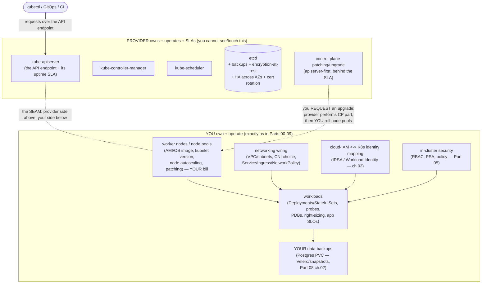

# 01 — The managed Kubernetes model

> What you actually buy with **EKS / GKE / AKS**: the **shared-responsibility
> split** (the provider owns, runs, scales, backs up, and *SLAs* the control
> plane + etcd; **you** own nodes, workloads, networking wiring, cloud-IAM
> mapping, in-cluster security, and the app SLOs), how managed
> control-plane **versioning / auto-upgrade / skew** differs from the
> self-managed flow of [Part 08 ch.01](../08-day-2-operations/01-cluster-lifecycle.md),
> the **managed-vs-self-managed** (kubeadm / Cluster API) decision,
> **regions/AZs** and zonal-vs-regional control planes + node spread, and the
> **cost shape** (a flat control-plane fee vs the node bill) — applied by
> placing each Bookstore tier on a managed cluster and naming which failures
> the provider absorbs versus which stay yours.

**Estimated time:** ~45 min read · ~60 min hands-on
**Prerequisites:** [Part 08 ch.01](../08-day-2-operations/01-cluster-lifecycle.md) — cluster lifecycle baseline this chapter contrasts with · [Part 00 ch.04](../00-foundations/04-control-plane-deep-dive.md) — control-plane components the provider now hides
**You'll know after this:** • articulate the EKS/GKE/AKS shared-responsibility split in concrete terms · • compare managed control-plane upgrade flow against the self-managed kubeadm flow · • choose between managed and self-managed (kubeadm / Cluster API) for a given workload · • size a zonal vs regional control plane against an AZ-failure scenario · • read a cloud bill and separate control-plane fee from node spend

<!-- tags: cloud, eks, gke, aks, foundations, day-2 -->

## Why this exists

Every chapter so far ran on **kind** — one machine, one container "cluster",
*you* are the entire control plane and the entire data plane. [Part 08
ch.01](../08-day-2-operations/01-cluster-lifecycle.md) already drew the line:
provisioning is a spectrum of *"who runs the control plane"*, and at the far
end the **managed** providers hide it entirely. This Part is where the guide
crosses that line and goes deep on the real thing: the Bookstore on a cloud
cluster.

The first thing that breaks when you move off kind is not a manifest — it is
an **assumption about ownership**. On kind you patch the apiserver, you snapshot
etcd ([Part 08 ch.02](../08-day-2-operations/02-backup-and-dr.md)), you choose
the CNI. On EKS/GKE/AKS you do *none* of that — and trying to is the first
mistake (there is no apiserver Pod to `kubectl get`, no etcd endpoint, no
`/etc/kubernetes/pki`). But the inverse mistake is worse: assuming "managed"
means "the provider handles reliability". It does not. The provider SLAs the
**control plane's availability**; the moment a Bookstore Pod is `CrashLooping`,
a NetworkPolicy is silently a no-op, a zonal disk pins `postgres-0` to a dead
AZ, or you over-provisioned nodes into a five-figure bill — that is **entirely
yours**, and no SLA covers it.

So this chapter exists to draw the **shared-responsibility boundary** precisely,
before any provisioning ([ch.02](02-provisioning-and-iac.md)), identity
([ch.03](03-cloud-identity.md)), networking ([ch.04](04-cloud-networking-and-load-balancing.md)),
storage ([ch.05](05-cloud-storage-and-data.md)), or cost/autoscaling
([ch.06](06-node-autoscaling-cost-multicloud.md)) work — because every one of
those chapters is an instance of "this side of the line is the provider's,
that side is yours, and confusing them is the production incident". The
reference is *Production Kubernetes* (Deployment Models / A Path to
Production).

> **This whole Part needs a real cloud account.** Unlike Parts 00–09, the
> managed-cluster hands-on **cannot run on kind** — there is no AWS/GCP/Azure
> control plane in a laptop container. The honesty pattern, stated once here
> and re-stated per chapter: each cloud hands-on is **illustrative**, the
> provider commands shown are the **exact correct ones**, and *wherever a
> piece can still be shown locally* (the boundary reasoning, the Bookstore
> manifests that are unchanged on cloud, a client dry-run) it is — with an
> explicit *"on a real EKS/GKE/AKS this is …"* bridge. No output is ever faked.

## Mental model

**A managed Kubernetes cluster is a cleaved machine: the provider operates the
half above the API, you operate the half below it, and the API server is the
seam.**

- **The provider owns and *SLAs* the control plane.** kube-apiserver,
  kube-controller-manager, kube-scheduler, **etcd** (+ its backups,
  encryption-at-rest, HA topology, patching, certificate rotation) run in the
  provider's account, invisible to you. You get an **API endpoint** and an
  uptime SLA (commonly **99.95%** for the *control plane reachability* — read
  the exact SLA: it covers the API endpoint, **not** your workloads). You
  cannot SSH the control plane, cannot `etcdctl` it, cannot change apiserver
  flags except through the provider's narrow knobs.
- **You own everything that runs your app.** Worker **nodes** (their OS image/
  AMI, kubelet version, autoscaling, patching cadence — even "managed node
  groups" are *your* EC2/Compute instances on *your* bill), every **workload**,
  the **networking wiring** (VPC/subnets, the CNI choice where offered,
  Services/Ingress/NetworkPolicy), the **cloud-IAM ↔ Kubernetes-identity**
  mapping ([ch.03](03-cloud-identity.md)), **in-cluster security** (RBAC, PSA,
  policy — Part 05 is unchanged on cloud), and the **application SLOs**.
- **Versioning becomes a negotiation, not a command.** [Part 08
  ch.01](../08-day-2-operations/01-cluster-lifecycle.md)'s rule still holds —
  apiserver first, never skip a minor, kubelet within n-3, the deprecated-API
  audit is *still yours*. What changes: you no longer run `kubeadm upgrade
  apply`; you **request** a control-plane upgrade (the provider performs the
  apiserver→cm/sched→etcd dance behind its SLA) and then **you** roll the node
  pools. The provider also imposes a **supported-version window** (a minor
  leaves support in ~12–14 months) and **maintenance windows** — drift onto an
  end-of-support minor and you get a *forced* upgrade.
- **Region / AZ topology is now a first-class design input.** A cloud region
  is several **Availability Zones** (independent failure domains). The control
  plane can be **zonal** (cheaper, one AZ — an AZ outage can take the API
  with it) or **regional/multi-AZ** (the production default — the provider
  spreads etcd/apiserver across AZs). **Your nodes** must *also* be spread
  across AZs (a node pool per AZ, or a multi-AZ pool) or a single-AZ failure
  takes the Bookstore down regardless of how HA the control plane is.
- **The cost shape inverts.** kind is free. A managed cluster is **a flat
  control-plane fee** (roughly **$0.10/hour ≈ ~$73/month per cluster** on
  EKS/AKS standard tier and GKE standard's per-cluster fee; GKE Autopilot
  prices differently — per Pod resource) **plus the node bill** (the large,
  variable part) **plus** data egress, load balancers ([ch.04](04-cloud-networking-and-load-balancing.md)),
  and disks ([ch.05](05-cloud-storage-and-data.md)). The control-plane fee is
  the *small, predictable* number; **nodes are where the money is and where
  [ch.06](06-node-autoscaling-cost-multicloud.md)/[Part 06
  ch.06](../06-production-readiness/06-capacity-and-cost.md) FinOps applies**.

The trap to hold onto: **"managed" removes the *control-plane* toil, not the
*operational* responsibility.** Every Part 00–09 discipline (probes, PDBs,
NetworkPolicy, RBAC, right-sizing, backups of *your data*) is exactly as much
your job on EKS as on kind — the provider just stopped you from also having to
babysit etcd.

## Diagrams

### Diagram A — the shared-responsibility boundary (Mermaid)

The seam is the API server. Everything in the provider box you cannot see or
touch and it is SLA'd; everything in your box is your job exactly as in Parts
00–09.



### Diagram B — managed vs self-managed decision matrix (ASCII)

```
 WHO RUNS THE CONTROL PLANE? — pick by who must own etcd/upgrades ───────────

  dimension              MANAGED (EKS/GKE/AKS)     SELF-MANAGED (kubeadm /
                                                    Cluster API)
  ─────────────────────────────────────────────────────────────────────────
  control plane + etcd   provider's job + SLA       YOURS (run, patch, back
                         (you can't etcdctl it)      up, HA, cert-rotate it)
  control-plane upgrade  request it; provider does  YOU: kubeadm upgrade
                         apiserver->cm/sched->etcd   apply (Part 08 ch.01)
  node pools/upgrades    yours (surge/rolling)      yours (drain/uncordon)
  deprecated-API audit   YOURS (always)             YOURS (always)
  CNI / dataplane        provider default OR your   fully your choice
                         choice (ch.04)
  cost                   flat CP fee + nodes        nodes only (no CP fee)
                                                     — but you pay in OPS toil
  version freedom        provider-supported window  any version you can run
                         (~12-14 mo/minor; forced   (you own EOL risk)
                         upgrade if you drift)
  air-gapped / on-prem   no (cloud only)*           yes (kubeadm/CAPI on prem)
  team to run it         small (no CP on-call)      a real cluster-ops team

  CHOOSE MANAGED when: you run on a cloud, want etcd/CP off your on-call,
    and accept the version window + CP fee. (The default for ~all cloud
    Kubernetes — Bookstore targets this.)
  CHOOSE SELF-MANAGED when: on-prem/air-gapped, need a version/flag the
    provider won't allow, or fleet-of-clusters via Cluster API (ch.02).
  * provider "on-prem" editions (EKS Anywhere / GKE on-prem(Anthos) / AKS
    Arc/hybrid) blur this — out of scope here; the model still applies.
```

## Hands-on with the Bookstore

**Assumed working directory: the guide repo root (`full-guide/`).** This
chapter adds **no manifests** — it is the conceptual map for the Part. The
Bookstore manifests do **not change** to run on a managed cluster (that is the
point of standardising on portable Kubernetes APIs); what changes is *which
side of the boundary* each operational concern lives on. This Hands-on is
**illustrative** (a managed cluster needs a cloud account — provisioning is
[ch.02](02-provisioning-and-iac.md)); the parts that *are* runnable locally
are marked.

### 1. Where each Bookstore tier lands on a managed cluster (runnable: the reasoning)

The Bookstore's seven tiers map onto the boundary like this. Nothing here is a
manifest edit — it is the placement decision you make per tier:

```
 TIER (Bookstore)        WHERE IT RUNS          PROVIDER ABSORBS    YOU OWN
 ─────────────────────────────────────────────────────────────────────────────
 storefront (web)        your node pool         CP reachability     pods, HPA,
 catalog   (Go API)      (stateless, spot-OK    (apiserver up so     PDB, the
 orders    (Go API)       — ch.06); spread      kubectl/controllers  Ingress/LB
 payments-worker          across AZs            keep working)        wiring,
                                                                     app SLOs
 ─────────────────────────────────────────────────────────────────────────────
 postgres (StatefulSet)  your node pool +       CP reachability     the DATA
                         a CLOUD block disk      ONLY. NOT your      backup
                         (EBS/PD/AzDisk, ch.05)  Postgres data,      (Velero/
                         — ZONAL: pins the Pod   NOT the PVC bytes,  snapshot,
                         to one AZ               NOT a DROP TABLE    Part 08
                                                                     ch.02)
 redis / rabbitmq        your node pool         CP reachability     these are
 (in-cluster here)        (or a managed         (if in-cluster)      yours; a
                          service in prod —                          managed
                          ch.05 prod note)                           svc moves
                                                                     the line
 ─────────────────────────────────────────────────────────────────────────────
 etcd / apiserver /      PROVIDER's account     ALL of it (run,     nothing —
 scheduler / cm           (you never see it)     patch, HA, back     you can't
                                                  up, SLA)            even see it
```

The decisive subtlety: **`postgres-0`'s data is your responsibility even
though the cluster is "managed".** A managed control plane means a provider
restores *etcd* after a control-plane failure — it does **not** mean your
Bookstore catalogue rows come back. [Part 08
ch.02](../08-day-2-operations/02-backup-and-dr.md) already proved this with the
three-layers model; on a managed cluster Layer 1 (etcd) becomes the provider's
and Layers 2 (Git) + 3 (the Postgres PVC, via Velero/CSI snapshot) stay
**yours** — which is *exactly* the DR posture the Bookstore standardised on.

### 2. Which failures the provider absorbs vs which are yours (the table that matters)

```
 FAILURE                                   WHO HANDLES IT
 ─────────────────────────────────────────────────────────────────────────────
 an etcd member dies                       PROVIDER (you never know)
 apiserver instance crashes                PROVIDER (LB'd; SLA covers it)
 control-plane minor upgrade               PROVIDER performs it — but YOU
                                            choose WHEN + roll the node pools
 a worker node dies                        YOU (cluster autoscaler / the
                                            scheduler reschedule — ch.06; the
                                            provider only supplies the VM)
 a Bookstore Pod CrashLoops                YOU (probes/rollback — Part 01)
 a NetworkPolicy is a silent no-op         YOU (CNI must enforce — ch.04 /
                                            Part 02 ch.06)
 zonal disk pins postgres-0 to a dead AZ   YOU (topology + restore — ch.05 /
                                            Part 08 ch.02)
 a DROP TABLE / logical data corruption    YOU (Velero/PITR — Part 08 ch.02;
                                            the SLA never covers your data)
 you over-provisioned nodes -> huge bill   YOU (right-sizing/FinOps — ch.06 /
                                            Part 06 ch.06)
 the whole REGION goes down                shared: provider runs the CP
                                            multi-AZ, but a multi-REGION app
                                            is YOUR architecture (ch.06)
```

> **Honest cloud-account note.** Standing up the managed cluster these tiers
> run on is [ch.02](02-provisioning-and-iac.md) (`eksctl`/`gcloud`/`az`/
> Terraform/Cluster API) and requires a real account; deploying the Bookstore
> onto it is shown there with the established registry-image caveat. What is
> **runnable now, on kind**: every Bookstore manifest is *unchanged* for
> managed clusters (only GA APIs — proven by the [Part 08
> ch.01](../08-day-2-operations/01-cluster-lifecycle.md) deprecated-API audit),
> so `kubectl apply -k examples/bookstore/kustomize/overlays/dev` on kind is a
> faithful rehearsal of the *workload* half of the boundary; only the
> *provider* half (etcd, the CP upgrade, the cloud LB/disk) is what a cloud
> account adds.

## How it works under the hood

- **The three managed offerings, structurally.** **Amazon EKS** runs the
  control plane in an AWS-owned account, multi-AZ by default, exposed as an
  API endpoint (public, private, or both); nodes are EC2 via *self-managed*,
  *managed node groups*, or *Fargate* (serverless Pods). **Google GKE** has
  two modes: **Standard** (you manage node pools; per-cluster management fee)
  and **Autopilot** (Google manages nodes too — you only declare Pods, billed
  per Pod resource; the boundary shifts further toward the provider but the
  *app SLO is still yours*). **Azure AKS** runs a managed control plane (free
  tier or an SLA-backed paid tier); nodes are VM Scale Sets. In all three the
  **control plane is the provider's and the API server is the seam** — the
  differences (node modes, fee model, default CNI) are *below* the seam and
  are the subject of [ch.02](02-provisioning-and-iac.md)–[ch.06](06-node-autoscaling-cost-multicloud.md).
- **Why you cannot `etcdctl` a managed cluster.** etcd lives in the provider's
  account with no client endpoint or cert exposed to you — exactly as [Part 08
  ch.02](../08-day-2-operations/02-backup-and-dr.md) stated. The provider
  snapshots/restores etcd under its SLA. The consequence is *not* a limitation
  to work around — it is *why* the Bookstore's DR is Git (declarative) +
  Velero (data): that posture is identical on self-managed and managed, so the
  app does not care who runs etcd.
- **Managed control-plane versioning and the skew policy.** The [Part 08
  ch.01](../08-day-2-operations/01-cluster-lifecycle.md) version-skew rules are
  *upstream policy* and apply unchanged: the apiserver is the reference,
  controller-manager/scheduler within n-1, **kubelet within n-3 and never
  ahead**, kubectl ±1. The mechanical difference on managed: the provider
  upgrades the control plane (apiserver→cm/sched→etcd) as one SLA'd operation
  you *trigger* (a console click / `eksctl upgrade cluster` / `gcloud
  container clusters upgrade` / `az aks upgrade`), then **you** upgrade each
  **node pool** — a *surge or rolling* replacement (new-version nodes added,
  old ones cordoned/drained honoring **PDBs** — [Part 06
  ch.05](../06-production-readiness/05-reliability-and-disruptions.md) — then
  deleted). GKE **release channels** (rapid/regular/stable) and EKS/AKS
  auto-upgrade can do the control plane *and* nodes automatically within the
  channel — opt in deliberately, and keep manifests on **GA APIs** so an
  auto-upgrade is a non-event (the property the Bookstore already has).
- **The supported-version window is a hard constraint, not advice.** Each
  provider patches a minor for ~12–14 months, then **force-upgrades** you
  (with notice) to keep the fleet supportable. A cluster you "never touch"
  therefore *still* moves — which is why the [Part 08
  ch.01](../08-day-2-operations/01-cluster-lifecycle.md) deprecated-API audit
  (`pluto`/`kubent`, `apiserver_requested_deprecated_apis`) is *more*
  important on managed, not less: the upgrade can arrive on the provider's
  schedule. The Bookstore is deliberately clean here (only `apps/v1`,
  `batch/v1`, `networking.k8s.io/v1`, `policy/v1`, `autoscaling/v2`,
  `scheduling.k8s.io/v1` + documented CRD groups), so a forced minor bump is a
  non-event.
- **Zonal vs regional control plane, and node spread, are *separate*
  decisions.** A regional/multi-AZ control plane (the production default —
  EKS is multi-AZ always; GKE *regional* clusters; AKS *availability zones*)
  survives a single-AZ outage *for the API*. It does **nothing** for your
  workloads unless your **node pools are also AZ-spread** and your stateful
  Pods tolerate the zonal-disk pin ([ch.05](05-cloud-storage-and-data.md)).
  The Bookstore's existing `topologySpreadConstraints` and
  `podAntiAffinity` ([Part 04 ch.02](../04-scheduling/02-affinity-taints-topology.md))
  are exactly the workload-side mechanism that makes multi-AZ *nodes*
  actually deliver HA — they were written for kind's single node "preferred",
  and on a real multi-AZ cluster a `topologyKey:
  topology.kubernetes.io/zone` constraint makes them bite (the existing
  manifests already carry the hostname-spread; zone-spread is the cloud
  refinement).
- **The cost shape, mechanically.** Control-plane fee = a flat hourly charge
  per cluster (≈$0.10/h on EKS/AKS-Standard-tier and GKE Standard's per-cluster
  fee; the **AKS Free tier** waives the fee but **without the 99.95%
  Standard-tier uptime SLA** — the Free tier still has a 99.5% API-server
  *availability target*, just no financially-backed SLA; GKE Autopilot does
  not charge a CP fee but bills Pod resource). **Nodes** = standard
  VM pricing × node count × time — the dominant, variable cost, and the one
  the cluster autoscaler/Karpenter and right-sizing
  ([ch.06](06-node-autoscaling-cost-multicloud.md), [Part 06
  ch.06](../06-production-readiness/06-capacity-and-cost.md)) actually move.
  Plus **data egress** (cross-AZ and internet traffic — a real, often
  surprising line item), **load balancers** ([ch.04](04-cloud-networking-and-load-balancing.md)),
  and **EBS/PD/Azure-Disk volumes** ([ch.05](05-cloud-storage-and-data.md)).
  The lesson: optimising the CP fee is pointless; optimising nodes is where
  FinOps lives.

## Production notes

> **In production: read the SLA — it covers the API endpoint, not your app.**
> The provider's 99.95% (or similar) is **control-plane reachability**: that
> `kubectl`/controllers can talk to the API. Your *application* availability is
> the sum of *your* probes, PDBs, replica counts, AZ spread, and the data
> tier's resilience — entirely your SLO to define and meet. Treat the managed
> SLA as "etcd and the apiserver are someone else's pager", not "my service is
> now reliable".

> **In production: a managed control plane is not a managed *application*.**
> Every Part 00–09 discipline still applies, unchanged: probes
> ([Part 01 ch.02](../01-core-workloads/02-health-and-lifecycle.md)), PDBs
> ([Part 06 ch.05](../06-production-readiness/05-reliability-and-disruptions.md)),
> NetworkPolicy with an enforcing CNI ([Part 02 ch.06](../02-networking/06-network-policies.md)),
> least-privilege RBAC + PSA (Part 05), right-sized requests
> ([Part 06 ch.06](../06-production-readiness/06-capacity-and-cost.md)), and
> backups of *your* data ([Part 08 ch.02](../08-day-2-operations/02-backup-and-dr.md)).
> "We're on EKS" is not a reliability strategy.

> **In production: plan the upgrade cadence — the version window is shorter
> than you think.** A minor leaves provider support in ~12–14 months and you
> *will* be force-upgraded if you drift. Run the
> [Part 08 ch.01](../08-day-2-operations/01-cluster-lifecycle.md) deprecated-API
> audit on a schedule, keep manifests/charts/GitOps on GA APIs (the Bookstore
> does), stagger control-plane then node-pool upgrades within a maintenance
> window, and adopt a release channel deliberately rather than discovering an
> auto-upgrade in production.

> **In production: design for AZ failure explicitly — regional CP is not
> enough.** Use a **regional/multi-AZ control plane** *and* spread node pools
> across AZs *and* give stateful Pods (Bookstore Postgres) a topology that
> survives one AZ dying ([ch.05](05-cloud-storage-and-data.md): a zonal disk
> pins the Pod to its AZ; reschedule blocks until that AZ recovers or you
> restore elsewhere). The Bookstore's
> `topologySpreadConstraints`/`podAntiAffinity`
> ([Part 04 ch.02](../04-scheduling/02-affinity-taints-topology.md)) are the
> workload half of this — refine the topology key to
> `topology.kubernetes.io/zone` on a real multi-AZ cluster.

> **In production: the node bill, not the cluster fee, is the cost lever.**
> The control-plane fee is a small fixed line; nodes (× count × time), egress,
> LBs, and disks are the variable spend. Apply
> [Part 06 ch.06](../06-production-readiness/06-capacity-and-cost.md)
> right-sizing and [ch.06](06-node-autoscaling-cost-multicloud.md)
> node-autoscaler + spot strategy there. Cost-allocate per namespace/workload
> (OpenCost / the providers' cost tooling) so the Bookstore's spend is owned,
> not discovered.

> **In production: avoid lock-in where it is free, accept it where it pays.**
> The portable layer (Kubernetes API, Helm/Kustomize, GitOps, the Bookstore
> manifests) costs nothing to keep portable — and does not change between
> clouds. The *non-portable* layer (cloud LB annotations, IAM mapping, CSI
> driver, CNI specifics — [ch.03](03-cloud-identity.md)–[ch.06](06-node-autoscaling-cost-multicloud.md))
> is where you deliberately spend lock-in for managed value. Know which is
> which ([ch.06](06-node-autoscaling-cost-multicloud.md) tabulates it).

## Quick Reference

```sh
# What am I connected to? (works on ANY cluster incl. managed)
kubectl cluster-info                               # the API endpoint
kubectl version                                    # Server = the managed apiserver minor
kubectl get nodes -o wide                          # YOUR nodes (kubelet ver, AZ via label)
kubectl get nodes -L topology.kubernetes.io/zone   # node AZ spread (yours to ensure)

# Provider control-plane ops you TRIGGER (provider performs CP; you roll nodes):
eksctl upgrade cluster --name $CLUSTER_NAME --version 1.31     # AWS EKS
gcloud container clusters upgrade $CLUSTER_NAME --master       # Google GKE (control plane)
az aks upgrade -g $RG -n $CLUSTER_NAME --kubernetes-version 1.31  # Azure AKS
# then upgrade each NODE POOL (surge/rolling, honors PDBs) — provider-specific (ch.02)

# The audit that is STILL yours on managed (Part 08 ch.01):
kubectl api-versions | sort
# pluto detect-files -d examples/bookstore/ ; kubent     # before any (forced) upgrade
```

There is **no manifest skeleton** for this chapter — the deliverable is the
boundary, not an object. The minimal artifact is the responsibility split
itself:

```
PROVIDER (SLA'd):  apiserver · controller-manager · scheduler · etcd (+backup,
                   HA, encryption, cert-rotation, CP patch/upgrade execution)
YOU (Parts 00-09): nodes · workloads · networking wiring · cloud-IAM mapping ·
                   in-cluster security · app SLOs · YOUR data backups · cost
SEAM:              the API server. Confusing the two sides = the incident.
```

Checklist:

- [ ] Know **exactly** what the provider SLA covers (API endpoint uptime) vs
      not (your workloads, your data, your SLOs)
- [ ] Control plane is **regional/multi-AZ**; node pools **AZ-spread**;
      stateful Pods have an AZ-survivable topology ([ch.05](05-cloud-storage-and-data.md))
- [ ] Upgrade cadence planned within the **supported-version window**;
      deprecated-API audit on a schedule ([Part 08 ch.01](../08-day-2-operations/01-cluster-lifecycle.md));
      release channel chosen deliberately
- [ ] Every Part 00–09 discipline still applied (probes/PDB/NetworkPolicy/
      RBAC/PSA/right-sizing/**your-data backups**) — "managed" did not remove them
- [ ] DR is **Git (declarative) + Velero (data)** — etcd is the provider's
      ([Part 08 ch.02](../08-day-2-operations/02-backup-and-dr.md))
- [ ] Cost owned at the **node** layer (not the CP fee); spend allocated per
      workload ([ch.06](06-node-autoscaling-cost-multicloud.md))
- [ ] Lock-in is deliberate: portable layer kept portable, non-portable layer
      a conscious trade ([ch.06](06-node-autoscaling-cost-multicloud.md))

## Test your understanding

> Try each before opening the answer drawer. The act of trying is the exercise; the answer is the check.

1. **Your EKS control plane is "regional" — what failure modes does that absorb vs leave to you?**
   <details><summary>Show answer</summary>

   AWS runs the apiserver/scheduler/controller-manager/etcd across ≥3 AZs and SLAs the API endpoint's uptime; an AZ outage will not take the control plane down. What stays yours: nodes pinned to a single AZ (workloads die when that AZ dies), zonal EBS volumes that pin a StatefulSet Pod to its AZ, and the application SLOs. The provider absorbs control-plane HA; you still own node and data AZ-spread.

   </details>

2. **The provider just auto-upgraded the control plane from 1.30 to 1.31 overnight. Your nodes are still on 1.30, and one of your Deployments uses `autoscaling/v2beta2`. What do you check and in what order?**
   <details><summary>Show answer</summary>

   First, `kubectl version` to confirm the skew (server 1.31, nodes 1.30 is supported — kubelet may lag the apiserver by up to 3 minors, but not lead). Second, run `pluto detect-files` or `kubent` against your manifests/cluster — `autoscaling/v2beta2` was removed in 1.26 and would silently disappear from the server, leaving the resource unreachable. Third, plan a node-pool surge upgrade to align kubelet with the new minor before the skew widens further. The control plane upgrade is the provider's; the deprecated-API audit and node roll are yours.

   </details>

3. **Hands-on: provision an EKS cluster with a zonal control plane (one AZ) and a regional control plane (3 AZs), then `kubectl get nodes -L topology.kubernetes.io/zone`. Drop one AZ in each (simulate by tainting/cordoning all nodes in that AZ). What is the difference in observed behavior?**
   <details><summary>What you should see</summary>

   On the regional CP, the apiserver stays reachable and only the Pods that landed on the failed-AZ nodes are rescheduled (if they have no zonal volume claims pinning them). On the zonal CP, you lose the apiserver itself when its AZ goes — `kubectl` calls hang/error and nothing reschedules until the AZ recovers. The regional control plane costs more per hour, and that delta is what you are buying.

   </details>

4. **A teammate says "we're on managed EKS, so we don't need Velero." How do you respond?**
   <details><summary>Show answer</summary>

   The provider backs up etcd (the cluster's control state) and restores it under their SLA, but they do not back up your PersistentVolumes, your secrets that live in cloud Secrets Manager, or your application data inside Postgres/MySQL. Velero covers the data side: PVCs, snapshots, and namespace-scoped resources. Managed-EKS + Velero is the actual DR posture — managed alone gives you the control plane back with empty disks. See [Part 08 ch.02](../08-day-2-operations/02-backup-and-dr.md).

   </details>

5. **You inherit a managed cluster and the cloud bill shows $0.10/hour for the CP and $4,800/month in node costs. The CTO asks "why is the cloud bill so high — isn't managed Kubernetes supposed to be cheap?" Frame the answer.**
   <details><summary>Show answer</summary>

   The control-plane fee is the small, flat, predictable line item — typically $73/month for EKS or zero on GKE Autopilot. The node bill is the real spend and lives entirely on the customer's side of the seam: instance types chosen, count, AZ-spread, on-demand vs spot, idle capacity from over-sized requests, and headroom for HPA bursts. Managed kubernetes did not change node economics — it only removed the operational burden of running the control plane. [ch.06](06-node-autoscaling-cost-multicloud.md) drills into the node-tier cost levers.

   </details>

## Further reading

- **Rosso et al., _Production Kubernetes_, ch.2 — Deployment Models**
  (managed vs self-managed, who operates the control plane, the operational
  posture of a production cluster) and **ch.1 — A Path to Production** (the
  maturity framing for which responsibilities you are actually taking on).
- **Lukša, _Kubernetes in Action_ 2e, ch.3** (how the control plane is
  composed — the structural basis for *why* the API server is the seam and
  what the provider is actually running for you).
- Official: Amazon EKS overview
  <https://docs.aws.amazon.com/eks/latest/userguide/what-is-eks.html>, GKE
  overview <https://cloud.google.com/kubernetes-engine/docs/concepts/kubernetes-engine-overview>,
  AKS overview <https://learn.microsoft.com/en-us/azure/aks/what-is-aks>, and
  the upstream version-skew policy
  <https://kubernetes.io/releases/version-skew-policy/>.
