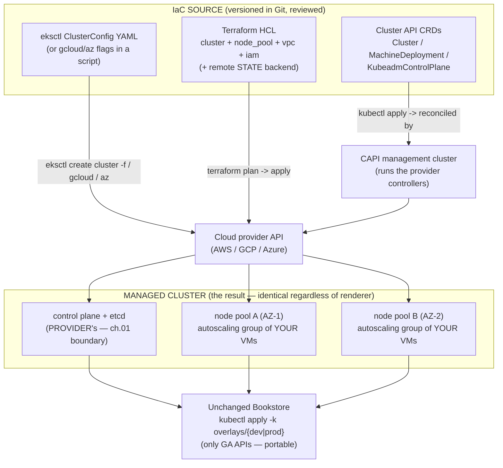

# 02 — Provisioning and infrastructure-as-code

> Standing the *same* managed cluster up three ways and choosing between them:
> the provider CLIs (**`eksctl`** cluster+managed-nodegroup YAML,
> **`gcloud container clusters create`**, **`az aks create`**), **Terraform**
> (cluster + node pool as declarative HCL, **remote state**, modules,
> plan/apply, destroy), and **Cluster API** (clusters *as Kubernetes objects*:
> a **management** cluster reconciling **workload** clusters via
> infrastructure providers, `clusterctl`); managed **node groups/pools** and
> their autoscaling-group wiring, **surge/rolling node upgrades**, reproducible
> **cluster IaC + GitOps-for-clusters**, and **teardown / cost hygiene** — then
> deploying the unchanged Bookstore onto the cluster you provisioned.

**Estimated time:** ~45 min read · ~120 min hands-on
**Prerequisites:** [Part 10 ch.01](01-managed-kubernetes-model.md) — managed-cluster model this chapter provisions · [Part 07 ch.04](../07-delivery/04-gitops-argocd.md) — GitOps pattern extended here to clusters themselves
**You'll know after this:** • choose between provider CLIs, Terraform, and Cluster API for a given scenario · • author a Terraform module that creates an EKS/GKE/AKS cluster + node pool with remote state · • configure managed node-group surge/rolling upgrades safely · • model "clusters as Kubernetes objects" via Cluster API + clusterctl · • tear down a cloud cluster cleanly and confirm zero residual cost

<!-- tags: cloud, terraform, gitops, day-2, eks, aks -->

## Why this exists

[ch.01](01-managed-kubernetes-model.md) drew the boundary: the provider runs
the control plane, **you own the cluster's existence and its nodes**. "Owning
its existence" raises the question every prior chapter dodged by saying *"a
cluster exists"* — **where did it come from, and can you make an identical one
on demand?** On kind that was `kind create cluster`. On a cloud it is an
infrastructure decision with real failure modes:

1. **The click-ops cluster.** Someone created the prod cluster in the console,
   by hand, eighteen months ago. Nobody can reproduce it; the staging cluster
   drifted from it within a week; "rebuild it in another region for DR" has no
   answer. A cluster you cannot recreate from source is the same anti-pattern
   as the [Part 07 ch.01](../07-delivery/01-packaging-helm.md) "templating with
   `sed`" pile — unversioned, undocumented, un-reviewable infrastructure.
2. **The orphaned bill.** A test cluster, its three node groups, two load
   balancers, and a fistful of EBS volumes outlive the experiment because
   teardown was manual and partial. Cloud Kubernetes makes *creating* spend
   one command and *finding* the spend you forgot a forensic exercise.

The fix is the same idea Parts 06–07 applied to workloads, applied one layer
down to the **cluster itself**: describe it as **code**, version it, review
it, apply it reproducibly, and tear it down by the same code path. This
chapter shows the three mainstream ways to do that for the *same* cluster, the
trade-offs, and how the **unchanged Bookstore** then deploys onto it. The
reference is *Production Kubernetes* (Deployment Models).

> **This chapter needs a real cloud account.** Provisioning a managed cluster
> *is* a cloud operation — it cannot run on kind. Per the
> [ch.01](01-managed-kubernetes-model.md) honesty pattern: the provider/IaC
> commands shown are the **exact correct ones** (run them with your account +
> region + a unique cluster name), no output is faked, and the parts that
> *are* locally verifiable (the Bookstore manifests are unchanged and
> dry-runnable; the IaC files are plain HCL/YAML you can `validate`) are
> marked. Generic placeholders only — `$CLUSTER_NAME`, `your-org`,
> `123456789012`, `us-east-1`, `registry.example.com`.

## Mental model

**Provisioning is "render an infrastructure spec into a cloud control-plane +
node pools", and you choose the renderer on the same axes you chose Helm vs
Kustomize: speed, reproducibility, multi-cloud, and day-2.**

- **Provider CLI (`eksctl` / `gcloud` / `az`)** — the *imperative-with-a-config-file*
  option. Fastest to a cluster, provider-native, a single tool. `eksctl`
  uniquely takes a **declarative cluster YAML** (`ClusterConfig`) so it is
  semi-IaC; `gcloud`/`az` are flag-driven commands (wrap them in scripts for
  repeatability). Best for: a quick cluster, a single cloud, learning.
- **Terraform** — the *declarative, multi-cloud, stateful* option. HCL
  describes the cluster + node pool(s) + VPC + IAM as resources; `terraform
  plan` diffs desired-vs-real; `apply` converges; **state** (in a remote
  backend — S3+DynamoDB / GCS / Azure Blob) is the source of truth; `destroy`
  is exact teardown. **Modules** package a cluster definition for reuse across
  envs/regions. Best for: production, fleets, the same workflow across clouds.
- **Cluster API (CAPI)** — the *Kubernetes-native, reflexive* option. A
  **management cluster** runs controllers that reconcile `Cluster` /
  `MachineDeployment` / `KubeadmControlPlane`-style CRDs into real **workload
  clusters** on an **infrastructure provider** (CAPA for AWS, CAPG for GCP,
  CAPZ for Azure). A cluster becomes *a declarative object you `kubectl
  apply`* — and an upgrade is a field change (the
  [Part 08 ch.01](../08-day-2-operations/01-cluster-lifecycle.md) idea, made
  literal). Best for: many clusters managed *as Kubernetes*, GitOps-for-clusters.

The unifying picture: an **IaC source** (CLI config / HCL / CAPI CRDs) →
**applied by a tool** → the **cloud provider API** creates a **managed control
plane + node pool(s)** → you point `kubectl` at it → the **portable Bookstore**
deploys on top, *unchanged*. The renderer differs; the cluster, and the app on
it, do not.

The trap: **a node pool is an autoscaling group of *your* VMs.** "Managed node
group" still means EC2/Compute/VMSS instances on your bill, in an
autoscaling group the **cluster autoscaler** ([ch.06](06-node-autoscaling-cost-multicloud.md))
can grow/shrink — provisioning it correctly (size, AZ spread, surge settings)
is your job, not the provider's.

## Diagrams

### Diagram A — IaC source → tool → provider API → cluster + node pools (Mermaid)

Three renderers, one outcome. The provider always builds the control plane;
the node pools are the autoscaling-group VMs you own.



### Diagram B — provisioning-tool trade-off (ASCII)

```
 SAME CLUSTER, THREE RENDERERS — pick on speed/repro/multi-cloud/day-2 ──────

  axis              eksctl/gcloud/az      Terraform            Cluster API
  ─────────────────────────────────────────────────────────────────────────
  speed to a        fastest (1 cmd /      medium (write HCL,   slowest (stand
   cluster           1 config file)        plan, apply)         up a mgmt cl.)
  reproducibility   eksctl: good (YAML);  excellent (HCL +     excellent (CRDs
                     gcloud/az: only as    state + plan diff)    in Git, recon-
                     good as your script                         ciled)
  multi-cloud       no (one provider      yes (one workflow,   yes (one API,
   (one workflow)    per tool)             per-cloud provider)   per-cloud infra
                                                                  provider)
  day-2 (upgrade,   provider-native, ok;  declarative, drift   declarative; an
   drift, scale)     state lives in the    detected via plan;    upgrade = edit
                     cloud, not tracked    explicit destroy      a CRD field
  fleet of many     painful (loop the     ok (modules + work-  excellent (it's
   clusters          CLI per cluster)      spaces per cluster)   literally for
                                                                  this)
  who runs it       anyone (a dev)        infra/platform team  a platform team
                                                                  with a mgmt cl.
  teardown          eksctl delete /       terraform destroy    kubectl delete
                     gcloud/az delete      (exact, from state)   cluster <NAME>
  ─────────────────────────────────────────────────────────────────────────
  PICK eksctl/CLI: a quick/learning cluster, one cloud.
  PICK Terraform : production, the same workflow across clouds, a few clusters.
  PICK CAPI      : a FLEET managed as Kubernetes / GitOps-for-clusters.
  ALL THREE produce the same cluster; the UNCHANGED Bookstore runs on any.
```

## Hands-on with the Bookstore

**Assumed working directory: the guide repo root (`full-guide/`).** This
chapter adds **no manifests** — the Bookstore is *unchanged* on a managed
cluster (the entire point of standardising on portable Kubernetes APIs).
Provisioning needs a cloud account, so the cluster-creation steps are
**illustrative with exact commands**; the final Bookstore deploy is the
established repo command with the documented registry-image caveat, and is
fully runnable as a rehearsal on kind.

> **Honest cloud-account note (read first).** Every `eksctl`/`gcloud`/`az`/
> `terraform`/`clusterctl` command below is the **real, correct** one — run it
> with *your* account, region, and a **unique** cluster name (`$CLUSTER_NAME`).
> Cluster creation takes ~10–20 min and **costs money from the first minute**
> (control-plane fee + node VMs + LBs). Do step 5 (teardown) when done. What
> is runnable *now* on kind: the Bookstore overlays are unchanged and
> dry-runnable (step 4's caveat), so the *workload* half is a faithful local
> rehearsal; only the *cluster* half needs the account.

### 1. Provision the same cluster via the provider CLI

**AWS — `eksctl` with a declarative `ClusterConfig`** (this is semi-IaC: a
versionable YAML, not a pile of flags). Save as `cluster-eks.yaml`:

```yaml
# illustrative — apply with: eksctl create cluster -f cluster-eks.yaml
apiVersion: eksctl.io/v1alpha5
kind: ClusterConfig
metadata:
  name: bookstore                 # $CLUSTER_NAME
  region: us-east-1
  version: "1.31"                 # a provider-supported minor (ch.01 window)
availabilityZones: [us-east-1a, us-east-1b, us-east-1c]   # multi-AZ (ch.01)
iam:
  withOIDC: true                  # REQUIRED for IRSA (ch.03) — set at create
managedNodeGroups:
  - name: ng-stateless
    instanceType: m6i.large
    minSize: 2
    maxSize: 6                    # the autoscaling-group bounds (ch.06)
    desiredCapacity: 3
    availabilityZones: [us-east-1a, us-east-1b, us-east-1c]   # spread the VMs
    volumeSize: 50
    updateConfig:
      maxUnavailablePercentage: 33   # at most 33% of nodes unavailable at once
                                     #   during a nodegroup upgrade (honors PDBs)
```

```sh
eksctl create cluster -f cluster-eks.yaml      # ~15 min; CP + the node group
aws eks update-kubeconfig --name $CLUSTER_NAME --region us-east-1
kubectl get nodes -L topology.kubernetes.io/zone   # 3 nodes, AZ-spread
```

**Google — `gcloud` (flag-driven; wrap in a script for repeatability):**

```sh
gcloud container clusters create $CLUSTER_NAME \
  --region us-central1 \
  --release-channel regular \
  --num-nodes 1 \
  `# --num-nodes is PER ZONE: a REGIONAL cluster (3 zones) => 3 nodes total,` \
  `# not 1. (--min/--max-nodes below are also per-zone-per-nodepool.)` \
  --machine-type e2-standard-4 \
  --enable-autoscaling --min-nodes 1 --max-nodes 3 \
  --workload-pool=$(gcloud config get-value project).svc.id.goog   # Workload Identity (ch.03)
gcloud container clusters get-credentials $CLUSTER_NAME --region us-central1
```

**Azure — `az aks create`:**

```sh
az group create -n $RG -l eastus
az aks create -g $RG -n $CLUSTER_NAME \
  --kubernetes-version 1.31 \
  --node-count 3 --node-vm-size Standard_D4s_v5 \
  --enable-cluster-autoscaler --min-count 2 --max-count 6 \
  --zones 1 2 3 \
  --enable-oidc-issuer --enable-workload-identity   # Workload Identity (ch.03)
az aks get-credentials -g $RG -n $CLUSTER_NAME
```

### 2. The same cluster as Terraform (declarative, stateful, multi-cloud workflow)

Terraform makes the cluster a reviewable diff with exact teardown. Sketch
(AWS — uses the community `eks` module; equivalent `google`/`azurerm`
providers do GKE/AKS the same way):

```hcl
# illustrative cluster.tf — terraform init && terraform plan && terraform apply
terraform {
  required_version = ">= 1.6"
  backend "s3" {                       # REMOTE STATE — never local for a team
    bucket         = "your-org-tf-state"
    key            = "bookstore/eks.tfstate"
    region         = "us-east-1"
    dynamodb_table = "your-org-tf-locks"   # state locking (no concurrent apply)
  }
  required_providers { aws = { source = "hashicorp/aws", version = "~> 5.0" } }
}

module "eks" {
  source          = "terraform-aws-modules/eks/aws"   # pin the version in real use
  version         = "~> 20.0"
  cluster_name    = var.cluster_name
  cluster_version = "1.31"
  vpc_id          = var.vpc_id
  subnet_ids      = var.private_subnet_ids            # multi-AZ subnets
  enable_irsa     = true                              # OIDC provider for ch.03
  eks_managed_node_groups = {
    stateless = {
      instance_types = ["m6i.large"]
      min_size       = 2
      max_size       = 6                              # autoscaling-group bounds
      desired_size   = 3
    }
  }
}
```

```sh
terraform init                 # downloads providers, configures the S3 backend
terraform validate             # RUNNABLE WITHOUT AN ACCOUNT — pure HCL check
terraform plan -out tf.plan    # the reviewable diff (desired vs real)
terraform apply tf.plan        # converge (creates CP + node group); ~15 min
# kubeconfig: terraform output, or `aws eks update-kubeconfig --name ...`
```

`terraform plan` is the cluster-level analogue of `helm diff` / `kubectl
--dry-run`: **review the infrastructure change before it happens**. `terraform
validate` needs no cloud account, so the HCL is checkable in CI.

### 3. The same cluster as a Cluster API object (clusters as Kubernetes)

CAPI inverts it: a **management cluster** (often a small kind/managed cluster)
runs controllers; a **workload cluster** is a `kubectl apply`. The
[Part 08 ch.01](../08-day-2-operations/01-cluster-lifecycle.md) "an upgrade is
a declarative version bump" becomes literal here.

```sh
# On the MANAGEMENT cluster — initialise CAPI + the AWS infra provider (CAPA):
clusterctl init --infrastructure aws       # installs Cluster/MD/KCP CRDs + ctrls

# Generate a WORKLOAD cluster manifest and apply it like any object:
clusterctl generate cluster bookstore \
  --kubernetes-version v1.31.0 \
  --control-plane-machine-count 3 \
  --worker-machine-count 3 > workload-cluster.yaml
kubectl apply -f workload-cluster.yaml      # controllers reconcile -> a real cluster
clusterctl describe cluster bookstore       # watch it converge
clusterctl get kubeconfig bookstore > bookstore.kubeconfig
```

A `Cluster` + `MachineDeployment` + a control-plane object are now Kubernetes
resources; **GitOps-for-clusters** is then Argo CD/Flux
([Part 07 ch.04](../07-delivery/04-gitops-argocd.md)) watching a repo of these
CRDs — the cluster fleet reconciled exactly as the Bookstore is.

### 4. Deploy the unchanged Bookstore onto the provisioned cluster

The point of the whole guide: **the app does not change.** Once `kubectl`
targets the managed cluster (any of the three paths above), the Bookstore
deploys with the *same* manifests Parts 00–09 built:

```sh
# kubectl context now points at the MANAGED cluster (step 1/2/3).
# The prod overlay pins registry images that are unpullable until you push
# the Bookstore images to YOUR registry — same established caveat as Part 07:
#   docker build/tag/push examples/bookstore/app/* -> registry.example.com/...
#   then: kubectl kustomize examples/bookstore/kustomize/overlays/prod \
#           edit set image (per the kustomize README) to your registry,
#   OR rehearse with the dev overlay (built locally, kind-loaded):
kubectl apply -k examples/bookstore/kustomize/overlays/dev
kubectl get pods -n bookstore -w
# On a real cluster you ALSO need: a cloud StorageClass for postgres (ch.05),
# a cloud LB/Ingress for storefront (ch.04), and cloud IAM if a tier needs a
# bucket (ch.03) — those are the NEXT chapters. The workload itself is byte
# -identical to what you ran on kind; only the surrounding cloud wiring is new.
```

> **Honest scope.** The `kubectl apply -k …/overlays/dev` line is **runnable
> verbatim on kind today** (a faithful rehearsal of the workload half) and is
> *identical* on the managed cluster — that invariance is the deliverable. The
> prod overlay pins `registry.example.com` images that need pushing to your
> registry first (the established Part 07 caveat); use
> `kustomize edit set image …=bookstore/<SVC>:dev` or the dev overlay for a local run. The cloud
> StorageClass/LB/IAM the app then needs on a *real* cluster are
> [ch.03](03-cloud-identity.md)–[ch.05](05-cloud-storage-and-data.md).

### 5. Teardown and cost hygiene (the step people skip — and regret)

A cloud cluster bills from minute one. Tear it down by the **same code path**
that created it:

```sh
# eksctl: deletes the cluster, node groups, AND the CFN-managed VPC/IAM:
eksctl delete cluster --name $CLUSTER_NAME --region us-east-1
# gcloud / az equivalents:
gcloud container clusters delete $CLUSTER_NAME --region us-central1
az aks delete -g $RG -n $CLUSTER_NAME --yes ; az group delete -n $RG --yes
# Terraform: exact, state-driven teardown (removes EXACTLY what it created):
terraform destroy
# Cluster API: the cluster is an object — deleting it deletes the infra:
kubectl delete cluster bookstore        # CAPI controllers tear down the cloud infra

# THEN sweep the orphans IaC/CLI may NOT remove (the bill that outlives you):
#  • LoadBalancer Services -> cloud LBs (ch.04): `kubectl delete svc` BEFORE
#    deleting the cluster, or the LB + its EIP leak.
#  • Retain-policy PVs -> EBS/PD/Azure disks (ch.05) survive on purpose.
#  • Snapshots, NAT gateways, unattached EIPs. Confirm in the cloud console /
#    `aws elbv2 describe-load-balancers` / cost explorer.
```

## How it works under the hood

- **`eksctl` is a CloudFormation front-end (and friends are similar).**
  `eksctl create cluster -f` translates the `ClusterConfig` into
  CloudFormation stacks (VPC/subnets, the EKS control plane, each managed node
  group's autoscaling group + launch template, IAM roles, the OIDC provider if
  `withOIDC`). `gcloud`/`az` call the GKE/AKS APIs directly with Deployment
  Manager/ARM underneath. The control plane is created in the provider's
  account ([ch.01](01-managed-kubernetes-model.md)); what `eksctl` *manages
  for you* is the **node-group autoscaling group + IAM + VPC** — i.e. the
  "your side of the boundary" plumbing.
- **A managed node group *is* an autoscaling group.** Provider-side, a managed
  node group = an ASG/MIG/VMSS with a launch template (AMI/image, instance
  type, user-data that joins the kubelet to the cluster) and min/max/desired.
  The **cluster autoscaler** ([ch.06](06-node-autoscaling-cost-multicloud.md))
  changes *desired* within min/max when Pods are unschedulable; the provider
  health-replaces failed instances. "Managed" means the provider keeps the
  kubelet/bootstrap correct and offers a one-click AMI/version bump — **the
  VMs and their cost are still yours** ([ch.01](01-managed-kubernetes-model.md)
  boundary).
- **Surge / rolling node upgrades.** Bumping a node group's version does **not**
  mutate running nodes — it does a **replacement**: new-version nodes are added
  (the *surge*, bounded by `maxUnavailable`/`maxSurge`), old nodes are
  **cordoned and drained** (the eviction API → **PDBs honored**, [Part 06
  ch.05](../06-production-readiness/05-reliability-and-disruptions.md)), then
  terminated. This is the [Part 08
  ch.01](../08-day-2-operations/01-cluster-lifecycle.md) "drain → upgrade
  kubelet → uncordon" loop, automated by the provider — which is why the
  Bookstore's `84-pdb.yaml` is what keeps it available *through* a cluster
  upgrade on cloud, not just on paper.
- **Terraform state is the source of truth, and it must be remote + locked.**
  `terraform apply` reconciles real infra to the HCL and records the result in
  **state**. Local state on a laptop is unshareable and a lost-state =
  lost-cluster-tracking incident; production uses a **remote backend**
  (S3+DynamoDB lock / GCS / Azure Blob) so the team shares one state and
  concurrent applies are serialised. `plan` is the diff (desired vs state vs
  real); `destroy` removes exactly what state records — *exact* teardown,
  unlike a manual click-sweep. **Modules** are parameterised cluster
  definitions (the IaC analogue of a Helm chart / Kustomize base) so dev/
  staging/prod/region clusters are one definition with different variables.
- **Cluster API: the controller pattern applied to clusters.** CAPI is the
  [Part 08 ch.05](../08-day-2-operations/05-operators-and-crds.md) operator
  idea pointed at infrastructure. A **management cluster** runs the **core**
  controllers (`Cluster`, `Machine`, `MachineDeployment`, `MachineSet`), a
  **bootstrap** provider (Kubeadm — generates node bootstrap data), a
  **control-plane** provider (`KubeadmControlPlane` — manages the CP machines),
  and an **infrastructure** provider (CAPA/CAPG/CAPZ — creates the cloud VMs/
  network). You `kubectl apply` a `Cluster` + `MachineDeployment`; the
  controllers reconcile it into a real **workload cluster**. An upgrade is a
  declarative field change (`version:` on the control-plane object, then the
  `MachineDeployment`) and the controllers perform the rolling
  control-plane-then-nodes replacement — the [Part 08
  ch.01](../08-day-2-operations/01-cluster-lifecycle.md) sequence, expressed as
  the [Part 00 ch.06](../00-foundations/06-declarative-api-model.md) declarative
  model. Note: CAPI manages *self-managed-style* clusters (it runs the
  Kubeadm control plane on your VMs) — distinct from a *provider-managed*
  control plane (EKS/GKE/AKS); some infra providers also have a
  managed-control-plane mode (e.g. CAPA's `AWSManagedControlPlane` for EKS).
- **GitOps-for-clusters.** Because a CAPI cluster (or a Terraform plan, or an
  `eksctl` config) is *just versioned text*, the [Part 07
  ch.04](../07-delivery/04-gitops-argocd.md) reconcile loop applies one level
  down: Argo CD/Flux (or Terraform Cloud / Atlantis for HCL) watches a repo of
  cluster definitions and reconciles the **fleet** — clusters created,
  upgraded, and torn down by Git history, exactly as the Bookstore is. This is
  the cluster-level form of the guide's recurring control-loop theme.

## Production notes

> **In production: never click-ops a production cluster — it must be
> reproducible from versioned source.** Use `eksctl` *config files* (not bare
> flags), Terraform HCL, or CAPI CRDs, all in Git and code-reviewed like any
> change. The test is brutal and concrete: *"recreate this exact cluster in
> another region for DR"* must be a command, not an archaeology project — the
> same standard [Part 08 ch.02](../08-day-2-operations/02-backup-and-dr.md)
> sets for the app.

> **In production: Terraform state is production-critical infrastructure.**
> Use a **remote, locked, versioned, encrypted** backend (S3+DynamoDB / GCS /
> Azure Blob); never local state for a team; restrict who can `apply`; gate
> `apply` behind a reviewed `plan` (Atlantis / Terraform Cloud / a CI plan
> comment). A corrupted or lost state file detaches Terraform from reality —
> treat it with the same care as etcd ([Part 08 ch.02](../08-day-2-operations/02-backup-and-dr.md)).

> **In production: size node groups for AZ failure and surge upgrades.** Spread
> node pools across AZs ([ch.01](01-managed-kubernetes-model.md)); set
> `maxUnavailable`/`maxSurge` so a version bump is a *rolling, always-available*
> replacement that respects the Bookstore's `84-pdb.yaml`
> ([Part 06 ch.05](../06-production-readiness/05-reliability-and-disruptions.md));
> separate pools by workload class (stateless/spot vs the data tier) — the
> sizing/spot detail is [ch.06](06-node-autoscaling-cost-multicloud.md).

> **In production: pin every version — tool, provider, module, and Kubernetes.**
> Pin the Terraform/`eksctl`/`clusterctl` binary, the provider/module versions
> (a floating `terraform-aws-modules/eks` can change cluster shape on the next
> `apply`), and the cluster's Kubernetes minor within the
> [ch.01](01-managed-kubernetes-model.md) supported window. Unpinned IaC is the
> infra-layer version of the `:latest` image anti-pattern (Part 05 ch.03).

> **In production: teardown is part of the lifecycle — automate cost hygiene.**
> Tear down by the same code path (`terraform destroy` / `eksctl delete` /
> `kubectl delete cluster`), then **sweep the orphans IaC does not own**:
> `LoadBalancer` Services leak cloud LBs+IPs if the cluster is deleted before
> the Service ([ch.04](04-cloud-networking-and-load-balancing.md)),
> `Retain`-policy PVs leave disks ([ch.05](05-cloud-storage-and-data.md)),
> plus snapshots/NAT/EIPs. Tag everything with an owner/TTL and run a
> cost-anomaly alert ([ch.06](06-node-autoscaling-cost-multicloud.md) / [Part 06
> ch.06](../06-production-readiness/06-capacity-and-cost.md)) — an orphaned
> cluster is a silent recurring bill.

> **In production: GitOps the clusters, not just the apps.** Manage the cluster
> fleet (CAPI CRDs / Terraform) through the same reconcile loop as the
> Bookstore ([Part 07 ch.04](../07-delivery/04-gitops-argocd.md)) so cluster
> creation/upgrade/teardown is auditable Git history with review and rollback —
> the cluster-level form of the guide's control-loop theme.

## Quick Reference

```sh
# Provider CLI (fastest; eksctl config = semi-IaC)
eksctl create cluster -f cluster-eks.yaml          # AWS (declarative YAML)
gcloud container clusters create $CLUSTER_NAME --region <R> --release-channel regular
az aks create -g $RG -n $CLUSTER_NAME --zones 1 2 3 --enable-cluster-autoscaler

# Terraform (declarative, stateful, multi-cloud workflow)
terraform init && terraform validate               # validate needs NO account
terraform plan -out tf.plan && terraform apply tf.plan
terraform destroy                                  # exact, state-driven teardown

# Cluster API (clusters AS Kubernetes objects)
clusterctl init --infrastructure aws|gcp|azure
clusterctl generate cluster $CLUSTER_NAME --kubernetes-version v1.31.0 | kubectl apply -f -
clusterctl describe cluster $CLUSTER_NAME ; kubectl delete cluster $CLUSTER_NAME

# Deploy the UNCHANGED Bookstore (identical on any of the above)
kubectl apply -k examples/bookstore/kustomize/overlays/dev
```

Minimal IaC skeletons (the shape — pin versions in real use):

```yaml
# eksctl ClusterConfig (versionable)
apiVersion: eksctl.io/v1alpha5
kind: ClusterConfig
metadata: { name: bookstore, region: us-east-1, version: "1.31" }
iam: { withOIDC: true }                 # REQUIRED for IRSA (ch.03)
managedNodeGroups:
  - { name: ng1, instanceType: m6i.large, minSize: 2, maxSize: 6, desiredCapacity: 3 }
```

```hcl
# Terraform (remote state is mandatory for a team)
terraform { backend "s3" { bucket = "your-org-tf-state"
  key = "bookstore/eks.tfstate" region = "us-east-1" dynamodb_table = "tf-locks" } }
module "eks" { source = "terraform-aws-modules/eks/aws" version = "~> 20.0"
  cluster_name = var.cluster_name  cluster_version = "1.31"  enable_irsa = true
  eks_managed_node_groups = { stateless = { min_size = 2, max_size = 6, desired_size = 3 } } }
```

Checklist:

- [ ] Cluster defined as **versioned, reviewed code** (eksctl config / HCL /
      CAPI CRDs) — **no click-ops** for anything that matters
- [ ] Terraform **state remote + locked + encrypted**; `apply` gated behind a
      reviewed `plan`
- [ ] Tool, provider/module, and **Kubernetes minor** all **pinned** (within
      the [ch.01](01-managed-kubernetes-model.md) supported window)
- [ ] Node pools **AZ-spread**, surge/`maxUnavailable` set so an upgrade
      honors **PDBs** ([Part 06 ch.05](../06-production-readiness/05-reliability-and-disruptions.md))
- [ ] OIDC enabled at create time (`withOIDC` / `--workload-pool` /
      `--enable-oidc-issuer`) so [ch.03](03-cloud-identity.md) identity works
- [ ] **Teardown by the same code path** + an orphan sweep (LBs/disks/
      snapshots/EIPs); resources tagged owner/TTL; cost-anomaly alert on
- [ ] The **Bookstore manifests are unchanged** on the provisioned cluster
      (only GA APIs — [Part 08 ch.01](../08-day-2-operations/01-cluster-lifecycle.md))

## Test your understanding

> Try each before opening the answer drawer. The act of trying is the exercise; the answer is the check.

1. **When would you choose Cluster API over Terraform for cluster provisioning?**
   <details><summary>Show answer</summary>

   When the number of clusters you operate makes a "cluster as a Kubernetes object reconciled by a controller" model cheaper than running `terraform apply` per cluster. CAPI shines for fleet scenarios — a management cluster that reconciles N workload clusters across providers, GitOps-driven cluster lifecycles, ephemeral CI clusters — because creating a new cluster is just creating a `Cluster` resource. Terraform shines for low-cluster-count, day-1 provisioning where you also need to manage the surrounding VPC/IAM/DNS in the same plan. See [Part 11 ch.06](../11-advanced-production-patterns/06-multi-cluster-and-fleet.md) for the fleet case.

   </details>

2. **`terraform apply` succeeded, but a teammate created a node group via the console afterwards. Now `terraform plan` shows that node group as "to be deleted." What happened and what do you do?**
   <details><summary>Show answer</summary>

   Drift — the console change is real on the cloud side but absent from Terraform state, so the next plan reconciles toward the desired state declared in HCL by deleting the un-declared node group. Options: (a) `terraform import` the node group into state, then add the matching `resource` block in HCL; (b) delete the console-created node group and recreate it via HCL; (c) treat the console action as the incident — write it up, lock the cloud account to "Terraform only" with an IAM policy, and add a drift-detection job. (a) preserves the workloads, (c) prevents the next incident.

   </details>

3. **Hands-on: provision an EKS cluster with `eksctl` (one command), then re-provision the *same* cluster shape with Terraform. Time both end-to-end and compare. Now do `terraform destroy` and `eksctl delete cluster`. Which one leaves orphaned resources?**
   <details><summary>What you should see</summary>

   `eksctl create` is faster to first node-Ready (one CloudFormation stack, opinionated defaults). Terraform forces you to declare every resource (VPC subnets, NAT, route tables, OIDC provider) so it is slower but more explicit. Both `destroy` paths usually leave at least one orphan: an unattached LB created by an in-cluster controller (AWS Load Balancer Controller making an NLB), an unattached EBS volume from a `Retain` reclaim-policy PV, a Route53 record from ExternalDNS, or an EFS access point. The orphan sweep is the production-readiness gate, not the destroy command.

   </details>

4. **A node-pool surge upgrade with `maxSurge: 1, maxUnavailable: 0` is stuck — the new node never goes Ready and the old one cannot be drained. What three things do you check?**
   <details><summary>Show answer</summary>

   First, the new node's bootstrap logs — `aws ec2 get-console-output` or the equivalent — is the image pulling, is the kubelet starting, is the node joining? Second, a PDB on the old node's Pods that is blocking drain (catalog has `minAvailable: 1` and only one replica left). Third, a stuck PreStop or terminationGracePeriodSeconds set too high causing eviction timeouts. The pattern is "new node won't come up" XOR "old node won't go down" — instrument both sides.

   </details>

## Further reading

- **Rosso et al., _Production Kubernetes_, ch.2 — Deployment Models**
  (provisioning a production cluster, the operational trade-offs of CLI vs IaC
  vs Cluster API, and reproducibility as a production requirement).
- **Lukša, _Kubernetes in Action_ 2e, ch.3** (how a cluster is composed — the
  structural basis for what these tools are actually creating).
- Official: `eksctl` <https://eksctl.io/>, GKE cluster creation
  <https://cloud.google.com/kubernetes-engine/docs/how-to/creating-a-zonal-cluster>,
  AKS cluster creation
  <https://learn.microsoft.com/en-us/azure/aks/learn/quick-kubernetes-deploy-cli>,
  Terraform on Kubernetes/EKS
  <https://registry.terraform.io/modules/terraform-aws-modules/eks/aws/latest>,
  and the Cluster API book <https://cluster-api.sigs.k8s.io/>.
