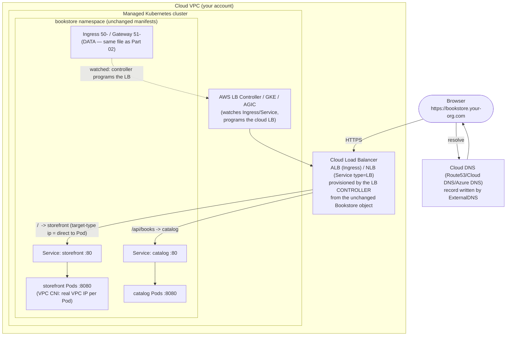

# 04 — Cloud networking and load balancing

> What changes about [Part 02](../02-networking/01-networking-model.md) on a
> real cloud: the **cloud CNI landscape** (AWS **VPC CNI** = a real VPC IP per
> Pod, **ENI/IP density limits** and **prefix delegation**; GKE/AKS CNIs;
> **Cilium** as a cloud CNI — the eBPF depth), Pod/Service **CIDRs and IP
> exhaustion**, **private clusters / egress** (NAT, private endpoints); cloud
> **L4/L7 load balancing** — the **AWS Load Balancer Controller**
> (`Service type=LoadBalancer`→NLB, Ingress→ALB, `IngressClass`/annotations),
> GKE **GCLB / container-native (NEG)**, AKS **LB / AGIC**;
> `Service` annotations vs **Gateway API** on cloud; **ExternalDNS**; and
> **which managed CNIs actually enforce NetworkPolicy** — applied by exposing
> the Bookstore `storefront` through a cloud LB + an ExternalDNS hostname,
> conceptually mapped onto the existing
> [`50-ingress.yaml`](../examples/bookstore/raw-manifests/50-ingress.yaml) /
> [`51-gateway.yaml`](../examples/bookstore/raw-manifests/51-gateway.yaml).

**Estimated time:** ~60 min read · ~90 min hands-on
**Prerequisites:** [Part 02 ch.01](../02-networking/01-networking-model.md) — networking model this chapter maps onto cloud CNIs · [Part 02 ch.05](../02-networking/05-gateway-api.md) — Gateway API contrasted with cloud LB annotations
**You'll know after this:** • compare AWS VPC CNI / Cilium / GKE / AKS CNIs and their NetworkPolicy support · • diagnose Pod-IP exhaustion and apply prefix delegation as the fix · • wire AWS Load Balancer Controller for NLB (L4) and ALB (L7) traffic · • configure ExternalDNS to keep DNS records in sync with Service/Ingress changes · • choose between cloud-LB annotations and Gateway API for a given exposure

<!-- tags: cloud, networking, cilium, vpc-cni, eks, aks -->

## Why this exists

[Part 02](../02-networking/01-networking-model.md) built the Bookstore's whole
network on kind: a flat Pod LAN, ClusterIP Services, an ingress-nginx
controller behind `kind`'s port-map, NetworkPolicy enforced by Calico. Every
one of those pieces *changes shape* on EKS/GKE/AKS — and the changes are
exactly where cloud networking incidents come from:

1. **`type: LoadBalancer` does nothing on kind — and the wrong thing on a
   misconfigured cloud.** [Part 02 ch.02](../02-networking/02-services.md)
   noted a `LoadBalancer` Service stays `<pending>` with no cloud. On a cloud
   it provisions a *real, billed* load balancer — and one per Service unless
   you front them with an Ingress/Gateway ([Part 02 ch.04](../02-networking/04-ingress.md)).
   Getting the *type* and the *annotations* right is the difference between an
   internet-facing NLB and an accidental public database.
2. **Pod IPs come from the VPC now, and you can run out.** kind's Pod CIDR is
   imaginary. AWS's **VPC CNI** gives every Pod a **real routable VPC IP** out
   of your subnets — so subnet sizing, ENI limits, and **IP exhaustion** are
   suddenly a hard scaling ceiling the Bookstore never hit on kind.
3. **NetworkPolicy can be a silent no-op — again, but for cloud reasons.**
   [Part 02 ch.06](../02-networking/06-network-policies.md) hammered "the CNI
   must enforce policy or it does nothing". On managed clusters the *default*
   CNI may not enforce — `60-networkpolicy.yaml` would apply and protect
   nothing unless you enabled the right dataplane.

This chapter is the cloud refraction of Part 02: the same Services/Ingress/
Gateway/NetworkPolicy objects (**unchanged** — that is the point), wired into
the cloud's VPC, CNI, and load balancers. The reference is *Production
Kubernetes* (Pod Networking / Service Routing).

> **This chapter needs a real cloud account.** Cloud LBs, the VPC CNI, and
> ExternalDNS act on real cloud APIs — not reproducible on kind. Per the
> [ch.01](01-managed-kubernetes-model.md) honesty pattern: every provider
> command/annotation is **exact and correct**; the **Bookstore Service/Ingress/
> Gateway objects are unchanged and dry-runnable on kind** (proven below) and
> byte-identical on cloud — only the *cloud LB/DNS/CNI behaviour* needs the
> account. No output faked; placeholders only.

## Mental model

**On a cloud the Kubernetes network objects don't change — they become
*instructions to a controller that programs cloud infrastructure*. The CNI
puts Pods in your VPC; a load-balancer controller turns Service/Ingress into a
real cloud LB; ExternalDNS turns the LB's address into a DNS name.**

- **The CNI is now a VPC integration, not an overlay.** kind's kindnet is a
  toy. On EKS the **Amazon VPC CNI** assigns each Pod a **real secondary IP on
  an ENI** in your subnet — Pods are first-class VPC citizens (great for
  security-group/routing integration, but **Pod density per node is bounded by
  ENI×IP limits**, and **subnet IPs are a finite, shareable pool**). GKE/AKS
  default CNIs are VPC-native too (alias IP ranges / Azure CNI). **Cilium**
  (eBPF) is the high-performance, policy-rich choice across all three —
  kube-proxy-free, identity-aware, with FQDN policy.
- **A Service/Ingress is a *request for cloud infrastructure*.** `Service
  type=LoadBalancer` → the cloud LB controller provisions an **L4 LB** (AWS
  **NLB**, GCP/Azure L4 LB) pointing at the Service. An **Ingress** ([Part 02
  ch.04](../02-networking/04-ingress.md)) → an **L7 LB** (AWS **ALB**, GCP
  **GCLB**, Azure **App Gateway via AGIC**) — *or* an in-cluster controller
  (ingress-nginx) fronted by an L4 LB. The object is desired state; the
  **controller reconciles real cloud LBs** — the [Part 02
  ch.04](../02-networking/04-ingress.md) reconcile loop, with the cloud as the
  dataplane.
- **Annotations are the cloud-specific tuning surface (and the lock-in).**
  Internal-vs-internet, TLS cert (ACM/Google-managed/Key Vault), health-check
  path, target-type (instance vs **IP/`ip-target`** = direct-to-Pod), idle
  timeout — all **provider-specific annotations** on the Service/Ingress. This
  is exactly the [Part 02 ch.04](../02-networking/04-ingress.md)→[ch.05](../02-networking/05-gateway-api.md)
  portability problem; **Gateway API** ([Part 02 ch.05](../02-networking/05-gateway-api.md))
  is the typed, portable alternative, with managed implementations (GKE
  Gateway, AWS Gateway API / VPC Lattice).
- **ExternalDNS closes the last gap.** A cloud LB gets a generated address
  (`a1b2…elb.amazonaws.com`). **ExternalDNS** watches Services/Ingresses and
  writes the **DNS records** (Route 53 / Cloud DNS / Azure DNS) so
  `bookstore.your-org.com` resolves to the LB — declaratively, no manual DNS.
- **Private clusters and egress are a deliberate posture.** Production
  clusters often have **private nodes/endpoint** (no public node IPs); Pods
  reach the internet via a **NAT gateway**, and the apiserver via a **private
  endpoint**. Egress is then a designed path (NAT + tight NetworkPolicy
  `ipBlock` — [Part 02 ch.06](../02-networking/06-network-policies.md)), not an
  open default.

The trap to hold onto: **the Bookstore's `40-services.yaml`/`50-ingress.yaml`/
`51-gateway.yaml`/`60-networkpolicy.yaml` do not change** — what changes is the
*controller* that interprets them and the *cloud infra* it builds. Confusing
"the object" with "the cloud thing the controller built from it" is the source
of most cloud-networking confusion (and orphaned-LB bills).

## Diagrams

### Diagram A — internet → cloud LB → controller → Service → Pod (Mermaid)

The north-south path on a managed cluster. The Bookstore objects are
unchanged; the cloud LB + DNS are what the controllers add.



### Diagram B — LB type → annotation/controller table (ASCII)

```
 WHAT KUBERNETES OBJECT -> WHAT CLOUD LB -> VIA WHICH CONTROLLER ────────────

  K8s object             AWS                 GCP (GKE)          Azure (AKS)
  ─────────────────────────────────────────────────────────────────────────
  Service type=          NLB (L4)            L4 LB              L4 LB (Standard
   LoadBalancer           via AWS LB Ctrl     (built-in)         LB) (built-in)
  Ingress (L7)           ALB                 GCLB (External/    App Gateway via
                          via AWS LB Ctrl     Internal Ingress)  AGIC, OR
                          (IngressClass=alb)  (built-in Ingress) ingress-nginx+LB
  in-cluster nginx       ingress-nginx       ingress-nginx      ingress-nginx
   (Part 02 ch.04)        + an NLB in front   + an L4 LB         + an L4 LB
  Gateway API            AWS Gateway API     GKE Gateway        Istio/Envoy/
   (Part 02 ch.05)        (VPC Lattice) /     (GCLB, native)     Cilium Gateway
                          Envoy/Cilium GW
  ─────────────────────────────────────────────────────────────────────────
  KEY ANNOTATIONS (provider-specific = lock-in; Gateway API = portable):
   internal-only :  service.beta.kubernetes.io/aws-load-balancer-internal:"true"
                    networking.gke.io/load-balancer-type:"Internal"
                    service.beta.kubernetes.io/azure-load-balancer-internal:"true"
   direct-to-Pod :  AWS  alb/nlb-target-type: ip  | GKE: NEG (container-native,
                    default for many)             | AKS: similar via annotations
   TLS cert      :  AWS ACM ARN | GKE ManagedCertificate | AKS Key Vault/AGIC
   DNS name      :  external-dns.alpha.kubernetes.io/hostname (ExternalDNS, all)

  RULE: type=LoadBalancer = ONE cloud LB + bill PER Service. Front many
        Services with ONE Ingress/Gateway (Part 02 ch.04/05) to share an LB,
        TLS, and a hostname — exactly why the Bookstore uses 50-/51-.
```

## Hands-on with the Bookstore

**Assumed working directory: the guide repo root (`full-guide/`).** This
chapter adds **no manifests** and **does not edit**
[`40-services.yaml`](../examples/bookstore/raw-manifests/40-services.yaml),
[`50-ingress.yaml`](../examples/bookstore/raw-manifests/50-ingress.yaml),
[`51-gateway.yaml`](../examples/bookstore/raw-manifests/51-gateway.yaml), or
[`60-networkpolicy.yaml`](../examples/bookstore/raw-manifests/60-networkpolicy.yaml).
It shows how those *unchanged* objects expose `storefront` on a cloud LB with
a real hostname. **Illustrative** (cloud account needed); the dry-run that
proves the objects are unchanged is **runnable on kind now**.

### 1. Install the cloud LB controller + ExternalDNS (Helm, pinned)

Per the guide's hard rule — **add-ons via Helm with a pinned chart version,
never `kubectl apply -f .../releases/latest/download/<PINNED-FILE>.yaml`**
(that 404s the moment a newer release ships; the same rule Part 06/07/08 used
for KEDA, kube-prometheus-stack, Velero):

```sh
# AWS Load Balancer Controller (lead path). It needs an IRSA role (ch.03) so
# the controller Pod can call ELB APIs with NO static key:
helm repo add eks https://aws.github.io/eks-charts && helm repo update
helm install aws-load-balancer-controller eks/aws-load-balancer-controller \
  -n kube-system --version 1.9.2 \
  --set clusterName=$CLUSTER_NAME \
  --set serviceAccount.create=true \
  --set serviceAccount.annotations."eks\.amazonaws\.com/role-arn"=arn:aws:iam::123456789012:role/aws-lb-controller
# (the role's policy is AWS's published least-priv LB-controller policy; the
#  SA→role trust is IRSA from ch.03 — zero static keys, same pattern.)

# ExternalDNS (writes Route53 records from Ingress/Service hosts), also IRSA:
helm repo add external-dns https://kubernetes-sigs.github.io/external-dns/ && helm repo update
helm install external-dns external-dns/external-dns -n kube-system --version 1.15.0 \
  --set provider=aws \
  --set "domainFilters[0]=your-org.com" \
  --set policy=sync \
  --set "txtOwnerId=$CLUSTER_NAME" \
  `# txtOwnerId tags a TXT "registry" record so THIS ExternalDNS only manages` \
  `# records it created — mandatory when >1 ExternalDNS / cluster shares a` \
  `# zone, and what makes policy=sync safely DELETE stale records (not others')` \
  --set serviceAccount.annotations."eks\.amazonaws\.com/role-arn"=arn:aws:iam::123456789012:role/external-dns
```

GKE/AKS equivalents: GKE's Ingress/Gateway controllers are built in (no
controller to install — annotate the object); AKS uses **AGIC**
(`az aks enable-addons --addons ingress-appgw`) or ingress-nginx; ExternalDNS
installs the same way with `provider=google`/`azure`.

### 2. The unchanged Bookstore objects + cloud annotations (as an overlay)

The Bookstore's edge is already
[`50-ingress.yaml`](../examples/bookstore/raw-manifests/50-ingress.yaml) (or
[`51-gateway.yaml`](../examples/bookstore/raw-manifests/51-gateway.yaml)) from
[Part 02 ch.04](../02-networking/04-ingress.md)/[ch.05](../02-networking/05-gateway-api.md).
On cloud it needs **only added annotations + a cloud `IngressClass`** — shown
as an *illustrative overlay*, **canonical files unedited** (this is what a
prod Kustomize overlay patch or a Helm value would inject):

```yaml
# illustrative — what the EXISTING Ingress needs on AWS (overlay/patch only;
# 50-ingress.yaml itself is NOT modified — Part 02 ch.04 owns it):
apiVersion: networking.k8s.io/v1
kind: Ingress
metadata:
  name: bookstore                       # the SAME object as 50-ingress.yaml
  namespace: bookstore
  annotations:
    alb.ingress.kubernetes.io/scheme: internet-facing
    alb.ingress.kubernetes.io/target-type: ip            # direct to Pod (VPC CNI)
    alb.ingress.kubernetes.io/certificate-arn: arn:aws:acm:us-east-1:123456789012:certificate/abcd
    alb.ingress.kubernetes.io/listen-ports: '[{"HTTPS":443}]'
    external-dns.alpha.kubernetes.io/hostname: bookstore.your-org.com   # ExternalDNS
spec:
  ingressClassName: alb                  # the cloud controller (NOT nginx) owns it
  # rules: IDENTICAL host/path → storefront/catalog/orders as 50-ingress.yaml
```

For a pure L4 exposure of just `storefront` (no L7 routing), the
`type: LoadBalancer` form — *one cloud LB, billed*, which is exactly why the
Bookstore prefers the shared Ingress above:

```yaml
# illustrative — Service type=LoadBalancer for storefront (one NLB, one bill).
# These `service.beta.kubernetes.io/aws-load-balancer-*` annotations are the
# AWS LOAD BALANCER CONTROLLER v2 NLB style (type=external + nlb-target-type=ip
# = a direct-to-Pod NLB). This is a DIFFERENT system from BOTH:
#   • the `alb.ingress.kubernetes.io/*` Ingress→ALB style in step 2 (L7,
#     IngressClass=alb), and
#   • the legacy in-tree cloud-provider Classic-ELB (no LB Controller; old
#     `service.beta.kubernetes.io/aws-load-balancer-*` semantics differ).
# Do NOT mix the three on one object. This snippet is illustrative of the
# one-cloud-LB-PER-Service pattern the guide advises AGAINST — the Bookstore
# uses the single shared Ingress (50-) / Gateway (51-) above instead; it is
# shown only so the type=LoadBalancer path is concrete.
apiVersion: v1
kind: Service
metadata:
  name: storefront-lb
  namespace: bookstore
  annotations:
    service.beta.kubernetes.io/aws-load-balancer-type: external          # AWS LB Controller v2 (NOT in-tree ELB)
    service.beta.kubernetes.io/aws-load-balancer-nlb-target-type: ip      # direct-to-Pod NLB
    service.beta.kubernetes.io/aws-load-balancer-scheme: internet-facing
    external-dns.alpha.kubernetes.io/hostname: shop.your-org.com
spec:
  type: LoadBalancer
  selector: { app: storefront }          # same selector as 40-services.yaml's storefront
  ports: [ { port: 443, targetPort: 8080 } ]
```

```sh
# On the cloud cluster, applying the Ingress overlay makes the controller
# provision an ALB and ExternalDNS write bookstore.your-org.com -> the ALB:
kubectl get ingress bookstore -n bookstore     # ADDRESS = the ALB DNS name
kubectl describe ingress bookstore -n bookstore  # events: ALB provisioned/programmed
# ExternalDNS log shows the Route53 upsert; then:
curl -k https://bookstore.your-org.com/api/books   # internet -> ALB -> catalog
```

### 3. Prove the Bookstore objects are unchanged (RUNNABLE on kind now)

The deliverable of the whole guide — the network objects are portable; only
the cloud wiring is added. Verify the canonical files are pure GA Kubernetes
that dry-run cleanly with no cloud:

```sh
# from the repo root (full-guide/) — RUNNABLE on kind, no cloud account:
kubectl apply --dry-run=client -f examples/bookstore/raw-manifests/40-services.yaml
kubectl apply --dry-run=client -f examples/bookstore/raw-manifests/50-ingress.yaml
kubectl apply --dry-run=client -f examples/bookstore/raw-manifests/60-networkpolicy.yaml
#   all: "<OBJ> created (dry run)" — built-in kinds, ZERO cloud-specific fields
#   in the canonical files. The cloud annotations/IngressClass in step 2 are an
#   OVERLAY (a prod Kustomize patch / Helm value), never baked into the base.
# (51-gateway.yaml is CRD-backed — `no matches for kind "Gateway"` until the
#  Gateway API CRDs are installed: the intrinsic behaviour Part 02 ch.05
#  already documents; the schema is correct.)
```

> **Lineage / honest scope.** `storefront` is exposed via the **existing**
> [`50-ingress.yaml`](../examples/bookstore/raw-manifests/50-ingress.yaml) (or
> the Gateway-API [`51-gateway.yaml`](../examples/bookstore/raw-manifests/51-gateway.yaml))
> — *no app change, no Service-type change, no edit to those files*; cloud
> behaviour is added via annotations in a prod overlay. The ALB/Route53
> provisioning needs a cloud account (illustrative); the proof that the
> objects are unchanged is the kind dry-run above (runnable). On a real
> cluster, also keep [Part 02 ch.06](../02-networking/06-network-policies.md)'s
> `60-networkpolicy.yaml` in force — but first ensure the cloud CNI *enforces*
> it (step below).

## How it works under the hood

- **The Amazon VPC CNI: a real VPC IP per Pod, with a hard density ceiling.**
  The VPC CNI attaches **Elastic Network Interfaces (ENIs)** to the node and
  assigns each Pod a **secondary private IP from your subnet**. Pods are
  routable VPC endpoints (security groups, VPC flow logs, direct routing all
  "just work") — but **max Pods per node = (ENIs × IPs-per-ENI) − overhead**,
  an instance-type-bound limit, and **every Pod consumes a real subnet IP**.
  Two scaling failures follow: a node hits its ENI/IP cap (Pods `Pending` for
  *no schedulable IP*, not no CPU) and the **subnet runs out of IPs**
  cluster-wide. **Prefix delegation** (assign /28 prefixes to ENIs instead of
  single IPs) raises per-node density dramatically and is the standard fix;
  large or secondary CIDRs address subnet exhaustion. None of this exists on
  kind — it is a genuinely new cloud scaling dimension. GKE (alias IP ranges)
  and Azure CNI are VPC-native with analogous CIDR-planning concerns; GKE
  Dataplane V2 / Azure CNI Powered by Cilium use eBPF.
- **Cilium as a cloud CNI (the eBPF depth).** Cilium replaces iptables-based
  Pod networking and (optionally) **kube-proxy** ([Part 02
  ch.02](../02-networking/02-services.md)) with **eBPF** programs in the
  kernel datapath: Service load-balancing, NetworkPolicy, and observability
  (Hubble) without per-Service iptables chains — lower latency at scale and
  **identity-aware** enforcement (policy by Kubernetes identity, plus
  **L7/FQDN** policy beyond NetworkPolicy's L3/L4, the limit [Part 02
  ch.06](../02-networking/06-network-policies.md) called out). It runs on
  EKS/GKE/AKS (and is the engine under GKE Dataplane V2 / Azure CNI Powered by
  Cilium). It is the high-performance, policy-rich option when the default CNI
  is insufficient — pinned-Helm-installed like any add-on.
- **The AWS Load Balancer Controller, mechanically.** It watches **Ingress**
  (and `Service type=LoadBalancer`) objects and reconciles real AWS LBs:
  Ingress (`ingressClassName: alb`) → an **ALB** (L7: host/path → target
  groups), `Service type=LoadBalancer` → an **NLB** (L4). **`target-type:
  ip`** registers **Pod IPs directly** in the target group (possible
  *because* the VPC CNI gives Pods VPC IPs) — bypassing the node/NodePort hop,
  so the LB load-balances straight to Pods (the cloud analogue of
  ingress-nginx proxying to endpoints, [Part 02 ch.04](../02-networking/04-ingress.md)).
  `target-type: instance` uses NodePorts instead. Health checks, TLS (an
  **ACM** cert ARN — no in-cluster TLS Secret needed), scheme
  (internet-facing/internal), and timeouts are all **annotations** on the
  object — the [Part 02 ch.04](../02-networking/04-ingress.md) "annotation
  string-soup, controller-specific" problem, at cloud scale, and the strongest
  argument for **Gateway API** ([Part 02 ch.05](../02-networking/05-gateway-api.md)).
- **GKE container-native LB (NEG) and AKS AGIC.** GKE's built-in Ingress
  programs **Google Cloud Load Balancing**; **container-native load
  balancing** via **Network Endpoint Groups (NEGs)** registers **Pod
  endpoints directly** in the LB backend (GKE's equivalent of `target-type:
  ip` — better health-checking and traffic distribution than the old
  NodePort path, and the default for many GKE setups). AKS uses the **App
  Gateway Ingress Controller (AGIC)** to drive an Azure Application Gateway
  from Ingress objects, or ingress-nginx behind an Azure L4 LB. Same pattern
  everywhere: a controller turns the **unchanged** Ingress object into the
  cloud's L7 LB; only the `IngressClass`/annotations differ.
- **`Service` annotations vs Gateway API on cloud.** Every cloud LB knob is a
  provider-specific annotation — non-portable, unvalidated strings ([Part 02
  ch.04](../02-networking/04-ingress.md)). **Gateway API** ([Part 02
  ch.05](../02-networking/05-gateway-api.md)) expresses the same routing as
  typed, validated, portable spec fields, with managed implementations: **GKE
  Gateway** (GCLB), **AWS Gateway API controller** (VPC Lattice), and
  Envoy/Cilium/Istio Gateways. The Bookstore ships both
  [`50-ingress.yaml`](../examples/bookstore/raw-manifests/50-ingress.yaml) and
  [`51-gateway.yaml`](../examples/bookstore/raw-manifests/51-gateway.yaml)
  precisely so the cloud edge can be the portable one — the app-facing
  Gateway/HTTPRoute objects don't change between clouds; only the
  `GatewayClass`/`controllerName` does.
- **ExternalDNS, mechanically.** A controller that watches Ingresses/Services
  carrying a hostname (the `external-dns.alpha.kubernetes.io/hostname`
  annotation, or the Ingress `host`) and reconciles **DNS records** in the
  cloud DNS provider (Route 53 / Cloud DNS / Azure DNS) to point at the LB's
  address — the [Part 00 ch.06](../00-foundations/06-declarative-api-model.md)
  reconcile loop applied to DNS. It uses **IRSA/Workload Identity**
  ([ch.03](03-cloud-identity.md)) for DNS-write permission — **no static
  cloud key**, same federation as everything else in this Part. Ownership is
  tracked via a **TXT "registry" record** keyed by **`--txt-owner-id`**: each
  managed A/CNAME gets a companion TXT record stamped with that owner id, so
  an ExternalDNS instance only mutates/deletes records *it* created — which is
  what makes `policy=sync` (prune stale records) safe and multi-instance /
  multi-cluster sharing a zone correct (omit it and instances fight or delete
  each other's records).
- **Private clusters and the egress path.** A *private* cluster has nodes with
  **no public IPs** and a **private API endpoint**. Pod→internet egress goes
  through a **NAT gateway** (a billed, throughput-bounded resource); the
  apiserver is reached over the private endpoint or a bastion. This makes
  egress a **designed, least-privilege path**: a default-deny egress
  NetworkPolicy ([Part 02 ch.06](../02-networking/06-network-policies.md)) plus
  tight `ipBlock` allows (and DNS egress, the Part 02 ch.06 gotcha) — and it
  is where the [ch.03](03-cloud-identity.md) "block the node metadata
  endpoint" rule and FQDN-aware Cilium policy pay off.

## Production notes

> **In production: `type: LoadBalancer` is one billed cloud LB per Service —
> front many Services with one Ingress/Gateway.** A `LoadBalancer` Service per
> microservice is N cloud LBs, N IPs, N bills, no shared TLS or hostname
> routing — exactly why the Bookstore uses a single
> [`50-ingress.yaml`](../examples/bookstore/raw-manifests/50-ingress.yaml)/
> [`51-gateway.yaml`](../examples/bookstore/raw-manifests/51-gateway.yaml)
> edge ([Part 02 ch.04](../02-networking/04-ingress.md)). Reserve
> `type: LoadBalancer` for a deliberate single L4 entrypoint; delete the
> Service **before** the cluster or the LB+IP **orphans and keeps billing**
> ([ch.02](02-provisioning-and-iac.md) teardown).

> **In production: plan VPC CIDRs and Pod density before you scale.** With the
> AWS VPC CNI, **every Pod is a subnet IP** and **Pods/node is ENI-bounded** —
> subnet exhaustion and per-node IP caps are hard scaling ceilings that show
> up as `Pending` Pods with *no IP* (not no CPU). Enable **prefix
> delegation**, size subnets generously, and account for the Bookstore's
> autoscaled/Karpenter-provisioned Pods
> ([ch.06](06-node-autoscaling-cost-multicloud.md)) in the IP plan. GKE/AKS:
> size alias-IP/CNI ranges the same way.

> **In production: verify the managed CNI actually ENFORCES NetworkPolicy.**
> [Part 02 ch.06](../02-networking/06-network-policies.md)'s caveat is a cloud
> caveat too. **EKS**: the VPC CNI needs the **network policy agent enabled**
> (or run Calico/Cilium). **GKE**: enable **Dataplane V2** (Cilium) or Network
> Policy. **AKS**: choose **Azure/Calico/Cilium** policy *at cluster
> creation*. Otherwise the Bookstore's `60-networkpolicy.yaml` applies and
> protects nothing — a cluster that *looks* segmented but isn't is worse than
> a known-open one. Add a CI test that a forbidden connection is actually
> refused.

> **In production: prefer direct-to-Pod LB targeting (IP target-type / NEG).**
> `target-type: ip` (AWS) and container-native LB / **NEGs** (GKE) register
> Pod IPs directly in the cloud LB — better health-checking, even traffic
> distribution, and one fewer hop than NodePort `instance` targeting. It is
> available *because* cloud CNIs give Pods routable VPC IPs; use it for the
> Bookstore edge, and pair with PDBs ([Part 06 ch.05](../06-production-readiness/05-reliability-and-disruptions.md))
> so LB target draining is graceful during rollouts/upgrades.

> **In production: standardise the edge on Gateway API to escape annotation
> lock-in.** Cloud LB behaviour via provider annotations is non-portable,
> unvalidated string-soup ([Part 02 ch.04](../02-networking/04-ingress.md)).
> **Gateway API** ([Part 02 ch.05](../02-networking/05-gateway-api.md)) with a
> managed implementation (GKE Gateway, AWS Gateway API, Envoy/Cilium) makes
> the app-facing routing portable across clouds and gates on `Programmed`/
> `ResolvedRefs` conditions — the Bookstore already ships
> [`51-gateway.yaml`](../examples/bookstore/raw-manifests/51-gateway.yaml) for
> exactly this.

> **In production: use ExternalDNS and cloud-managed certs, not manual DNS/
> TLS.** Manual DNS records and hand-cut certs ([Part 02
> ch.04](../02-networking/04-ingress.md): "don't `openssl` by hand") are
> outage generators. ExternalDNS reconciles DNS from the Ingress/Service;
> ACM/Google-managed-cert/Key-Vault provide auto-renewing TLS at the cloud LB.
> Both use **workload identity** ([ch.03](03-cloud-identity.md)) — no static
> cloud key for DNS/cert permissions.

> **In production: make egress a designed path on private clusters.** Private
> nodes + a NAT gateway + a default-deny egress NetworkPolicy with tight
> `ipBlock`/FQDN allows (and the mandatory DNS-egress allow — [Part 02
> ch.06](../02-networking/06-network-policies.md)) turns egress from an open
> default into a least-privilege, exfiltration-resistant boundary. Combine
> with the [ch.03](03-cloud-identity.md) metadata-endpoint block.

## Quick Reference

```sh
# Add-ons via Helm, PINNED (never releases/latest/download/<PINNED>.yaml):
helm install aws-load-balancer-controller eks/aws-load-balancer-controller \
  -n kube-system --version 1.9.2 --set clusterName=$CLUSTER_NAME ...   # IRSA SA (ch.03)
helm install external-dns external-dns/external-dns -n kube-system --version 1.15.0 \
  --set provider=aws --set domainFilters[0]=your-org.com ...

# Inspect the cloud edge (managed cluster):
kubectl get ingress -n <NS>                 # ADDRESS = the cloud LB DNS name
kubectl describe ingress <ING> -n <NS>      # events: LB provisioned/programmed
kubectl get svc -n <NS> -o wide             # type=LoadBalancer EXTERNAL-IP = LB
kubectl get nodes -L topology.kubernetes.io/zone   # LB targets AZ-spread?

# Does the CNI ENFORCE policy? (Part 02 ch.06 caveat, cloud edition)
kubectl get pods -n kube-system | grep -Ei 'aws-node|calico|cilium|azure-cni'

# Prove the Bookstore network objects are UNCHANGED (RUNNABLE on kind):
kubectl apply --dry-run=client -f examples/bookstore/raw-manifests/50-ingress.yaml
```

Minimal cloud-edge overlay skeleton (annotations on the **unchanged** object):

```yaml
apiVersion: networking.k8s.io/v1
kind: Ingress
metadata:
  name: <APP>                              # the SAME Ingress as Part 02 ch.04
  namespace: <NS>
  annotations:
    alb.ingress.kubernetes.io/scheme: internet-facing       # AWS (GKE/AKS differ)
    alb.ingress.kubernetes.io/target-type: ip               # direct-to-Pod
    alb.ingress.kubernetes.io/certificate-arn: <ACM-ARN>    # cloud-managed TLS
    external-dns.alpha.kubernetes.io/hostname: <HOST>       # ExternalDNS
spec:
  ingressClassName: alb                    # the CLOUD controller (not nginx)
  # rules: IDENTICAL to the base Ingress — routing does not change on cloud
```

Checklist:

- [ ] Edge is a **shared Ingress/Gateway**, not N `type: LoadBalancer`
      Services; the LB is **deleted before the cluster** (no orphan bill)
- [ ] LB controller + ExternalDNS installed via **pinned Helm**, using
      **workload identity** ([ch.03](03-cloud-identity.md)) — no static key
- [ ] **VPC CIDRs / Pod density planned** (prefix delegation; subnet sizing) —
      no `Pending`-for-no-IP at scale
- [ ] Managed CNI **actually enforces** `60-networkpolicy.yaml` (VPC-CNI agent
      / Dataplane V2 / Azure-Calico-Cilium) — CI-tested ([Part 02 ch.06](../02-networking/06-network-policies.md))
- [ ] **Direct-to-Pod** LB targeting (IP target-type / NEG) + PDBs for graceful
      target draining ([Part 06 ch.05](../06-production-readiness/05-reliability-and-disruptions.md))
- [ ] Edge standardised on **Gateway API** for portability where possible
      ([Part 02 ch.05](../02-networking/05-gateway-api.md)); cloud-managed TLS
- [ ] Private cluster: NAT egress + **default-deny egress + tight ipBlock/FQDN**
      + DNS-egress allow + metadata-endpoint block ([ch.03](03-cloud-identity.md))
- [ ] Bookstore `40-/50-/51-/60-` files **unchanged** (cloud config is an
      overlay) — verified by the kind dry-run

## Test your understanding

> Try each before opening the answer drawer. The act of trying is the exercise; the answer is the check.

1. **Why does AWS VPC CNI assign one VPC IP per Pod, and what's the operational consequence?**
   <details><summary>Show answer</summary>

   Each Pod gets a real, routable VPC IP allocated from the ENI/secondary-IP pool attached to its node. The benefit is native VPC routing — no overlay, no encapsulation, security groups can match Pods directly. The consequence is **IP exhaustion**: m5.large nodes only support a fixed number of secondary IPs per ENI, so a node has a hard Pod-IP cap regardless of CPU/memory. The fix is **prefix delegation** — IPv4 /28 blocks per ENI instead of single IPs — which raises the Pod density ceiling by ~16x.

   </details>

2. **Your `Service type=LoadBalancer` provisioned an ELB Classic, but you wanted an NLB with Pod-IP targets (not node-IP). What changes?**
   <details><summary>Show answer</summary>

   You need (a) the AWS Load Balancer Controller installed (the in-tree cloud-provider creates Classic ELBs by default), (b) annotations `service.beta.kubernetes.io/aws-load-balancer-type: external` and `aws-load-balancer-nlb-target-type: ip`, and (c) `aws-load-balancer-scheme` to be `internet-facing` or `internal`. The `ip` target type means the NLB targets Pod IPs via VPC CNI directly, skipping kube-proxy and the node-port hop — that's the L4 path you actually want for low-latency workloads.

   </details>

3. **You apply `NetworkPolicy` to deny ingress to `catalog`, but traffic from `storefront` still works on GKE. What is happening?**
   <details><summary>Show answer</summary>

   The cluster's CNI does not enforce NetworkPolicy by default. GKE standard clusters with kubenet, or AKS with kubenet, will accept the resource but never enforce it. The fix is to enable dataplane v2 (Cilium-based) on GKE, Azure CNI Powered by Cilium on AKS, or install Calico/Cilium as the enforcer. The lesson: NetworkPolicy is an API; the enforcer is the CNI, and `kubectl apply` succeeding tells you nothing about whether the policy is actually enforced.

   </details>

4. **Hands-on: install ExternalDNS in dry-run mode against your hosted zone, deploy a `Service type=LoadBalancer` with an `external-dns.alpha.kubernetes.io/hostname` annotation, and watch the controller logs. Now delete the Service. What DNS record state do you see?**
   <details><summary>What you should see</summary>

   ExternalDNS reconciles a Route53 A/ALIAS record pointing at the LB's DNS name when the Service is created. When the Service is deleted, ExternalDNS removes the record (assuming `--policy=sync`, the default). If you set `--policy=upsert-only`, the record will be orphaned and you'll need a manual cleanup. The pattern matters because orphaned DNS records pointing at recycled LBs is a classic phishing/hijack vector — make sure your DNS lifecycle matches your Service lifecycle.

   </details>

5. **When would you choose Gateway API over the AWS Load Balancer Controller's `Ingress` annotations?**
   <details><summary>Show answer</summary>

   Gateway API gives you a portable, cloud-neutral abstraction for north-south traffic (works on EKS, GKE, AKS, on-prem with NGINX/Envoy/Istio) and separates concerns: cluster operator owns `GatewayClass`/`Gateway`, app team owns `HTTPRoute`. The ALB annotation soup is AWS-specific and bleeds infrastructure concerns into app YAML. Choose Gateway API when portability or role separation matters; stick with annotations when you need an ALB-specific feature (e.g. WAF integration, Cognito auth) that Gateway API does not yet abstract. See [Part 02 ch.05](../02-networking/05-gateway-api.md).

   </details>

## Further reading

- **Rosso et al., _Production Kubernetes_, ch.5 — Pod Networking** (the CNI,
  IPAM, and policy enforcement in production) and **ch.6 — Service Routing**
  (edge routing, cloud LB integration, ingress controllers at production
  scale).
- **Lukša, _Kubernetes in Action_ 2e, ch.11–12** (Services and Ingress — the
  portable objects the cloud controllers reconcile into real LBs).
- Official: AWS Load Balancer Controller
  <https://kubernetes-sigs.github.io/aws-load-balancer-controller/latest/>,
  Amazon VPC CNI
  <https://docs.aws.amazon.com/eks/latest/userguide/managing-vpc-cni.html>,
  GKE container-native load balancing
  <https://cloud.google.com/kubernetes-engine/docs/concepts/container-native-load-balancing>,
  AKS networking
  <https://learn.microsoft.com/en-us/azure/aks/concepts-network>, ExternalDNS
  <https://kubernetes-sigs.github.io/external-dns/>, and Cilium
  <https://docs.cilium.io/>.
