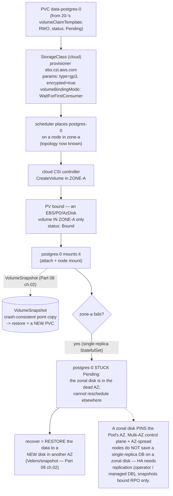

# 05 — Cloud storage and data

> What [Part 03 ch.04](../03-config-and-storage/04-persistent-storage.md)'s
> PV/PVC/StorageClass/CSI machinery becomes on a real cloud: the **cloud CSI
> drivers** (EBS / GCE PD / Azure Disk = **block, RWO**; EFS / Filestore /
> Azure Files = **file, RWX**), **installing the CSI driver** (managed add-on /
> pinned Helm), **StorageClass `parameters`** (type/IOPS/throughput/
> encryption), why **`volumeBindingMode: WaitForFirstConsumer`** is mandatory
> for **zonal** disks, **online expansion**, **VolumeSnapshot on cloud**, the
> **cross-AZ / regional reality** (a zonal disk *pins* a Pod's AZ — the
> consequence for the Bookstore Postgres StatefulSet), and how this ties to
> the [Part 08 ch.02](../08-day-2-operations/02-backup-and-dr.md) backup story
> — applied by running the Bookstore Postgres on a cloud StorageClass with a
> cloud snapshot, **without editing** the canonical
> [`20-postgres-statefulset.yaml`](../examples/bookstore/raw-manifests/20-postgres-statefulset.yaml).

**Estimated time:** ~45 min read · ~90 min hands-on
**Prerequisites:** [Part 03 ch.04](../03-config-and-storage/04-persistent-storage.md) — PV/PVC/StorageClass/CSI baseline this chapter specialises to cloud · [Part 08 ch.02](../08-day-2-operations/02-backup-and-dr.md) — backup story this chapter's snapshots plug into
**You'll know after this:** • choose between EBS/GCE-PD/Azure-Disk vs EFS/Filestore/Azure-Files for RWO/RWX workloads · • configure StorageClass parameters (type, IOPS, throughput, encryption) per workload · • justify `volumeBindingMode: WaitForFirstConsumer` for zonal disks · • take a VolumeSnapshot of a cloud-backed PVC and restore from it · • plan the AZ-pinning consequences of zonal disks for a stateful workload

<!-- tags: cloud, storage, stateful, ebs-csi, eks, day-2 -->

## Why this exists

[Part 03 ch.04](../03-config-and-storage/04-persistent-storage.md) taught the
entire storage model — PVC↔PV binding, StorageClass dynamic provisioning, CSI
architecture, `WaitForFirstConsumer`, reclaim policy, expansion,
VolumeSnapshot — but ran it on kind's `rancher.io/local-path`, which it was
careful to flag is a **legacy node-local provisioner, not a CSI driver, not
HA, never for prod data**. It also warned, in a production note: *"block PVs
(EBS/PD/Azure Disk) are zonal and ReadWriteOnce; a zonal disk pins its Pod to
one AZ"*. This chapter is where that note becomes the operational reality for
the Bookstore Postgres.

The failure modes that make this its own cloud chapter:

1. **The zonal-disk AZ pin.** An EBS/PD/Azure-Disk volume lives in **one
   Availability Zone**. The PVC binds a PV in zone-a; from then on
   **`postgres-0` can only ever schedule in zone-a**. If zone-a fails, the Pod
   cannot reschedule elsewhere — the disk (and its data) is stuck in the dead
   zone. A multi-AZ control plane ([ch.01](01-managed-kubernetes-model.md))
   and AZ-spread nodes ([ch.02](02-provisioning-and-iac.md)) do **not** save a
   single-replica StatefulSet on a zonal disk. This is the single most
   important cloud-storage fact for the Bookstore.
2. **Wrong binding mode = stranded volume.** `Immediate` binding provisions
   the zonal disk *before* the scheduler picks a node, so the disk can land in
   a zone with no schedulable node — deadlock, or every future Pod force-pinned
   to that zone. [Part 03 ch.04](../03-config-and-storage/04-persistent-storage.md)
   introduced `WaitForFirstConsumer`; on cloud it is **not optional**.
3. **A snapshot of corruption is durable corruption.** [Part 08
   ch.02](../08-day-2-operations/02-backup-and-dr.md) already drew this line:
   a CSI VolumeSnapshot is crash-consistent and protects against *losing the
   disk*, not against a `DROP TABLE`. Cloud snapshots are real and easy — and
   exactly as insufficient alone as the Part 08 ch.02 chapter said.

This chapter maps Part 03 ch.04's machinery onto real cloud CSI drivers,
makes the zonal-disk consequence concrete for the Bookstore Postgres, and
hands the backup half back to [Part 08 ch.02](../08-day-2-operations/02-backup-and-dr.md).
The reference is *Production Kubernetes* (Container Storage).

> **This chapter needs a real cloud account.** Cloud CSI drivers and snapshots
> act on real cloud disk APIs — kind's `local-path` has no zones, no
> snapshots, no CSI ([Part 03 ch.04](../03-config-and-storage/04-persistent-storage.md)
> said exactly this). Per the [ch.01](01-managed-kubernetes-model.md) honesty
> pattern: every StorageClass/driver command is **exact and correct**; the
> **Bookstore Postgres StatefulSet is unchanged and dry-runnable on kind**
> (only the *StorageClass* it references differs — that is a one-line overlay,
> not an app edit); only cloud-disk/snapshot behaviour needs the account. No
> output faked.

## Mental model

**Cloud storage is Part 03 ch.04's exact model with the provisioner swapped
for a real cloud CSI driver — and one new, dominating constraint: a block disk
is *zonal*, so the PVC's binding mode and the Pod's topology decide whether the
data survives an AZ failure.**

- **Two storage shapes, the [Part 03 ch.04](../03-config-and-storage/04-persistent-storage.md)
  access-mode matrix made cloud-concrete.** **Block** (EBS / GCE PD / Azure
  Disk) is **`ReadWriteOnce`** and **zonal** — one node mounts it r/w, it
  lives in one AZ. This is what databases use (Bookstore Postgres). **File**
  (EFS / Filestore / Azure Files) is **`ReadWriteMany`** and typically
  **regional** — many nodes/Pods mount it, no AZ pin, but it is a network
  filesystem (slower, different consistency; for shared assets, not a Postgres
  data dir).
- **The StorageClass names a cloud CSI driver + cloud `parameters`.** Same
  object as [Part 03 ch.04](../03-config-and-storage/04-persistent-storage.md);
  `provisioner` is now `ebs.csi.aws.com` / `pd.csi.storage.gke.io` /
  `disk.csi.azure.com`, and `parameters` are cloud knobs: disk **type**
  (gp3/io2, pd-ssd, Premium_LRS), **IOPS/throughput**,
  **`encrypted: "true"`**. `volumeBindingMode`, `reclaimPolicy`,
  `allowVolumeExpansion` mean exactly what Part 03 ch.04 taught.
- **`WaitForFirstConsumer` is mandatory for block, not advice.** Because the
  disk is zonal, the volume **must be created in the zone the Pod scheduled
  into** — so binding/provisioning must wait until a Pod using the PVC is
  scheduled. `Immediate` strands the disk in a possibly-wrong zone. Cloud
  default StorageClasses use `WaitForFirstConsumer` for this reason.
- **A zonal disk *pins* its Pod's AZ — forever, for that PVC.** Once
  `data-postgres-0` binds a PV in zone-a, the StatefulSet can only ever place
  `postgres-0` in zone-a (the scheduler must put the Pod where its disk is).
  AZ-a failure → `postgres-0` is `Pending` until the AZ returns **or** you
  restore the data to a new disk in another AZ ([Part 08
  ch.02](../08-day-2-operations/02-backup-and-dr.md)). HA for the data tier
  therefore needs **replication** (a multi-replica DB / an operator / a
  managed DB), not just a snapshot.
- **VolumeSnapshot is real on cloud — and still not a backup by itself.**
  Cloud CSI drivers support `VolumeSnapshot`/`VolumeSnapshotClass` (the [Part
  03 ch.04](../03-config-and-storage/04-persistent-storage.md) /
  [`18-postgres-snapshot.yaml`](../examples/bookstore/raw-manifests/18-postgres-snapshot.yaml)
  CRDs). A snapshot is crash-consistent, protects against disk loss, and is
  the input to PVC restore/clone — but it faithfully preserves a `DROP TABLE`
  too. Layer logical/PITR backups on top ([Part 08
  ch.02](../08-day-2-operations/02-backup-and-dr.md)).

The trap to hold onto: **the Bookstore Postgres StatefulSet does not change —
only the StorageClass it (implicitly) uses does, and the AZ-pin is a property
of the *disk*, not the manifest.** Confusing "I have a cloud snapshot" with "my
DB is highly available across AZs" is the cloud-storage incident.

## Diagrams

### Diagram A — PVC → cloud CSI → cloud volume (+ snapshot, + AZ pin) (Mermaid)

The [Part 03 ch.04](../03-config-and-storage/04-persistent-storage.md)
provisioning flow with a real cloud driver — and the AZ pin that constrains
the Pod forever.



### Diagram B — block vs file / RWX / zonal vs regional matrix (ASCII)

```
 CLOUD STORAGE SHAPES — pick by access mode AND failure domain ─────────────

  shape   AWS        GCP          Azure        access  domain   Bookstore use
  ─────────────────────────────────────────────────────────────────────────
  BLOCK   EBS        GCE PD       Azure Disk   RWO     ZONAL    postgres data
   (disk)  (gp3/io2)  (pd-ssd)     (Premium)    (1 node  (pins   (20-'s PVC) —
           ebs.csi.   pd.csi.      disk.csi.    r/w)     Pod AZ)  THE default
           aws.com    storage.     azure.com
                      gke.io
  FILE    EFS        Filestore    Azure Files  RWX     REGIONAL shared assets
   (NFS)   efs.csi.   filestore.   file.csi.    (many    (no AZ   (book-cover
           aws.com    csi.storage  azure.com    nodes    pin)     uploads) —
                      .gke.io                    r/w)             NOT a DB dir
  ─────────────────────────────────────────────────────────────────────────
  RULE (from Part 03 ch.04, cloud-concrete):
   • RWX on a BLOCK disk -> PVC stays Pending (block is RWO-only). Need FILE.
   • BLOCK is ZONAL -> volumeBindingMode: WaitForFirstConsumer is MANDATORY
     (else the disk strands in the wrong zone / deadlocks).
   • A zonal disk PINS its Pod's AZ -> single-replica DB is NOT AZ-HA.
     AZ-HA for data = replication (operator/managed DB) + snapshots for RPO.
   • reclaimPolicy: Retain for the DB disk (a deleted PVC must NOT destroy it).
   • allowVolumeExpansion: true + the CSI driver does ONLINE resize -> grow,
     never migrate (most cloud block CSI: online; Part 03 ch.04).
```

## Hands-on with the Bookstore

**Assumed working directory: the guide repo root (`full-guide/`).** This
chapter adds **no manifests** and **does not edit**
[`20-postgres-statefulset.yaml`](../examples/bookstore/raw-manifests/20-postgres-statefulset.yaml)
or [`17-storageclass.yaml`](../examples/bookstore/raw-manifests/17-storageclass.yaml)
or [`18-postgres-snapshot.yaml`](../examples/bookstore/raw-manifests/18-postgres-snapshot.yaml).
It shows the cloud StorageClass/snapshot the existing Postgres uses on a real
cluster as an **illustrative overlay**. The dry-run proving the StatefulSet is
unchanged is **runnable on kind now**.

### 1. Install the cloud CSI driver (managed add-on / pinned Helm)

A cloud CSI driver is the on-cluster component that talks the cloud disk API.
Install it as a **managed add-on** (preferred — provider-lifecycled) or
**pinned Helm** (the guide's rule — never
`releases/latest/download/<PINNED-FILE>.yaml`):

```sh
# AWS — EBS CSI as a managed EKS add-on (preferred). It needs IRSA (ch.03) so
# the driver can call EC2 EBS APIs with NO static key:
eksctl create iamserviceaccount --cluster $CLUSTER_NAME \
  --namespace kube-system --name ebs-csi-controller-sa \
  --attach-policy-arn arn:aws:iam::aws:policy/service-role/AmazonEBSCSIDriverPolicy \
  --role-only --role-name eks-ebs-csi
eksctl create addon --cluster $CLUSTER_NAME --name aws-ebs-csi-driver \
  --service-account-role-arn arn:aws:iam::123456789012:role/eks-ebs-csi
# (pinned-Helm alternative: helm install aws-ebs-csi-driver
#  aws-ebs-csi-driver/aws-ebs-csi-driver -n kube-system --version <PIN>)

# GKE: the GCE PD CSI driver is built in and on by default (and Filestore CSI
#   via an add-on). AKS: Azure Disk/Files CSI drivers are built-in/managed.
kubectl get csidrivers          # ebs.csi.aws.com / pd.csi.storage.gke.io / disk.csi.azure.com
```

### 2. A cloud StorageClass for Postgres (the [Part 03 ch.04](../03-config-and-storage/04-persistent-storage.md) object, cloud `parameters`)

A `StorageClass` is **built-in Kubernetes** (no CRD — it dry-runs cleanly
everywhere, unlike the CSI driver behind it). This is the cloud analogue of
the Bookstore's opt-in
[`17-storageclass.yaml`](../examples/bookstore/raw-manifests/17-storageclass.yaml),
shown as an *illustrative overlay* — the canonical file is **not edited**:

```yaml
# illustrative cloud StorageClass for the Bookstore Postgres (AWS shown;
# GKE/AKS differ only in provisioner+parameters). NOT applied to the canonical
# tree — a prod overlay/Helm value sets storageClassName on the StatefulSet.
apiVersion: storage.k8s.io/v1
kind: StorageClass
metadata:
  name: bookstore-cloud
  labels: { app.kubernetes.io/part-of: bookstore }
provisioner: ebs.csi.aws.com               # the CLOUD CSI driver (was rancher.io/local-path)
parameters:
  type: gp3                                # disk type (io2 for high-IOPS DBs)
  iops: "3000"                             # provisioned IOPS (cloud knob)
  throughput: "125"                        # MB/s (cloud knob)
  encrypted: "true"                        # encryption at rest ON the volume
volumeBindingMode: WaitForFirstConsumer    # MANDATORY for zonal disks (Part 03 ch.04)
reclaimPolicy: Retain                      # a deleted PVC must NOT destroy DB data
allowVolumeExpansion: true                 # grow, don't migrate (online on EBS)
```

The Bookstore Postgres uses it with **one line** — the StatefulSet's
`volumeClaimTemplates` gains `storageClassName: bookstore-cloud` (today it
omits it and binds the default class — [Part 03
ch.04](../03-config-and-storage/04-persistent-storage.md)). That one line is a
**prod overlay/Helm value**, *not* an edit to
[`20-postgres-statefulset.yaml`](../examples/bookstore/raw-manifests/20-postgres-statefulset.yaml):

```yaml
# illustrative overlay patch — the ONLY change to run Postgres on cloud disk:
# spec.volumeClaimTemplates[0].spec.storageClassName: bookstore-cloud
# Everything else in 20- (the restricted securityContext, the headless Service,
# probes, the PVC size) is BYTE-IDENTICAL on cloud. The app does not change.
```

### 3. The zonal-disk reality for the Bookstore Postgres (the consequence)

This is the chapter's core operational point, made concrete:

```sh
# On the cloud cluster, after postgres-0 binds its PV:
kubectl get pv -o custom-columns=\
'NAME:.metadata.name,ZONE:.spec.nodeAffinity.required.nodeSelectorTerms[*].matchExpressions[*].values,CLAIM:.spec.claimRef.name'
#   the PV carries nodeAffinity PINNING it to ONE zone (e.g. us-east-1a).
kubectl get pod postgres-0 -n bookstore -o jsonpath='{.spec.nodeName}{"\n"}'
kubectl get node <THAT-NODE> -L topology.kubernetes.io/zone   # = the PV's zone
# CONSEQUENCE: postgres-0 can ONLY ever schedule in that zone. Simulate AZ
# loss (cordon every node in that zone) and postgres-0 goes Pending — the
# zonal disk is in the (now unreachable) AZ; it CANNOT reschedule elsewhere.
# Recovery is NOT "reschedule" — it is RESTORE the data to a new disk in
# another AZ (Velero/snapshot — Part 08 ch.02). A single-replica StatefulSet
# on a zonal disk is durable, NOT AZ-highly-available.
```

The Bookstore's existing `topologySpreadConstraints`/`podAntiAffinity` on the
*stateless* tiers ([Part 04 ch.02](../04-scheduling/02-affinity-taints-topology.md))
spread them across AZs and they reschedule freely. The **data tier cannot** —
which is exactly why [Part 03 ch.05](../03-config-and-storage/05-stateful-data-patterns.md)
and [Part 08 ch.02](../08-day-2-operations/02-backup-and-dr.md) push toward an
**operator (CloudNativePG) or a managed DB** for production data: those
replicate across AZs so a zone loss is a failover, not a restore.

### 4. A cloud VolumeSnapshot of the Postgres disk (ties to [Part 08 ch.02](../08-day-2-operations/02-backup-and-dr.md))

[`18-postgres-snapshot.yaml`](../examples/bookstore/raw-manifests/18-postgres-snapshot.yaml)
already exists ([Part 03 ch.04](../03-config-and-storage/04-persistent-storage.md))
with a placeholder `driver:` and the documented CRD-intrinsic note. On a
cloud cluster you set its `VolumeSnapshotClass` `driver:` to the cloud CSI
driver and install the snapshot CRDs/controller — **without editing the
canonical file** (it already documents this exact substitution):

```sh
# Snapshot CRDs + controller via the documented path (pinned, not latest/):
#   the external-snapshotter (Part 03 ch.04 / 18-'s header names it)
# Then 18-'s VolumeSnapshotClass driver -> ebs.csi.aws.com (overlay/value),
# and snapshot data-postgres-0:
kubectl apply -f examples/bookstore/raw-manifests/18-postgres-snapshot.yaml   # on a snapshot-capable cloud cluster
kubectl get volumesnapshot postgres-snap-0 -n bookstore \
  -o jsonpath='{.status.readyToUse}{"\n"}'    # true once the cloud snapshot completes
# RESTORE = a NEW PVC with dataSource: that snapshot, then point a fresh
# postgres at it (the Part 03 ch.05 / Part 08 ch.02 drill). On cloud the
# restored disk can be created in ANOTHER AZ — which is how a snapshot
# participates in AZ recovery (the restore in step 3).
```

> **Lineage / honest scope.** The Postgres StatefulSet
> ([`20-postgres-statefulset.yaml`](../examples/bookstore/raw-manifests/20-postgres-statefulset.yaml),
> [Part 01 ch.05](../01-core-workloads/05-statefulsets.md)) is **unchanged** —
> only its `storageClassName` (a one-line overlay) differs on cloud. The
> StorageClass is built-in and dry-runs cleanly anywhere;
> [`18-postgres-snapshot.yaml`](../examples/bookstore/raw-manifests/18-postgres-snapshot.yaml)
> is CRD-backed and carries the documented `no matches for kind "VolumeSnapshot"` intrinsic note
> ([Part 03 ch.04](../03-config-and-storage/04-persistent-storage.md))
> until the snapshot CRDs are installed — schema-correct, verified by reading
> + the API reference. **Backup orchestration (Velero + the consistency hook)
> and the full DR runbook are [Part 08 ch.02](../08-day-2-operations/02-backup-and-dr.md)**;
> the "run a DB on Kubernetes vs managed?" decision is [Part 03
> ch.05](../03-config-and-storage/05-stateful-data-patterns.md). This chapter
> is the cloud-CSI layer underneath both.

### 5. Prove the StatefulSet is unchanged (RUNNABLE on kind now)

```sh
# from the repo root (full-guide/) — RUNNABLE on kind, no cloud account:
kubectl apply --dry-run=client -f examples/bookstore/raw-manifests/20-postgres-statefulset.yaml
#   "statefulset.apps/postgres created (dry run)" — built-in, no cloud fields.
kubectl apply --dry-run=client -f examples/bookstore/raw-manifests/17-storageclass.yaml
#   "storageclass.storage.k8s.io/bookstore-local created (dry run)" — built-in.
#   (A cloud StorageClass is ALSO built-in and dry-runs cleanly — only the
#    PROVISIONER string + parameters differ; no CRD.)
kubectl apply --dry-run=client -f examples/bookstore/raw-manifests/18-postgres-snapshot.yaml
#   error: ... no matches for kind "VolumeSnapshot" in version
#   "snapshot.storage.k8s.io/v1"  — EXPECTED & documented in 18-'s header
#   (CRD-backed; identical to Part 03 ch.04 / Part 08 ch.02 precedent).
```

## How it works under the hood

- **A cloud CSI driver is the [Part 03 ch.04](../03-config-and-storage/04-persistent-storage.md)
  CSI architecture with a real backend.** Same components: a **controller**
  Deployment (external-provisioner `CreateVolume` → a real EBS/PD/Azure disk;
  external-attacher `ControllerPublishVolume` → attaches it to the node's VM;
  external-snapshotter `CreateSnapshot`; external-resizer
  `ControllerExpandVolume`) and a per-node **DaemonSet** node plugin
  (`NodeStageVolume`/`NodePublishVolume` — formats + mounts the attached disk).
  The difference from kind's `local-path`: it implements the **full CSI RPC
  set** (attach, snapshot, resize, topology) against the cloud disk API — the
  capabilities [Part 03 ch.04](../03-config-and-storage/04-persistent-storage.md)
  said `local-path` lacks. The driver authenticates to the cloud API via
  **IRSA/Workload Identity** ([ch.03](03-cloud-identity.md)) — no static key.
- **Zonal disks and `WaitForFirstConsumer` — the mechanism.** EBS/PD/Azure
  Disk are created **in a single AZ**. With **`Immediate`** binding the PV is
  provisioned the moment the PVC exists — before the scheduler knows which
  node/zone the Pod will use — so it can land in a zone with no schedulable
  node (deadlock) or force every future Pod into that zone. **`WaitForFirstConsumer`**
  delays `CreateVolume` until the Pod is **scheduled**, so the CSI driver
  creates the disk **in the Pod's zone**, and the PV gets **`nodeAffinity`
  pinning it to that zone**. From then on the scheduler must place that Pod
  where its disk is — the **AZ pin**. This is precisely the [Part 03
  ch.04](../03-config-and-storage/04-persistent-storage.md) `volumeBindingMode`
  internal, with the cloud consequence: get it wrong and the Bookstore
  Postgres either won't schedule or is locked to a bad zone.
- **Why a single-replica StatefulSet on a zonal disk is not AZ-HA.** The
  StatefulSet's `volumeClaimTemplates` makes **one PVC per ordinal** bound to
  **one zonal PV** ([Part 03 ch.04](../03-config-and-storage/04-persistent-storage.md)).
  `postgres-0`'s data is on one disk in one AZ. If that AZ fails, the disk is
  unreachable and `postgres-0` is `Pending` until the AZ recovers — the
  control plane being multi-AZ ([ch.01](01-managed-kubernetes-model.md)) and
  nodes being AZ-spread ([ch.02](02-provisioning-and-iac.md)) change nothing,
  because the *data* is single-zone. AZ-HA for data requires the data to exist
  in more than one AZ: a **replicated** topology (a multi-replica DB with
  per-replica zonal disks across AZs, an **operator** like CloudNativePG that
  manages replication + failover — [Part 03
  ch.05](../03-config-and-storage/05-stateful-data-patterns.md) / [Part 08
  ch.05](../08-day-2-operations/05-operators-and-crds.md), or a **managed DB**
  whose AZ-replication is the provider's job). Snapshots bound *RPO* (how much
  you lose), not *availability* — the [Part 08
  ch.02](../08-day-2-operations/02-backup-and-dr.md) RPO/RTO distinction,
  storage-side.
- **StorageClass `parameters` are the cloud disk's QoS + security knobs.**
  `type` (gp3/io2 vs pd-ssd vs Premium_LRS — IOPS/latency profile and price),
  explicit `iops`/`throughput` (provisioned performance, billed), and
  **`encrypted: "true"`** (encryption at rest on the volume itself — pair with
  encrypted Secrets, [Part 03 ch.02](../03-config-and-storage/02-secrets.md) /
  [Part 05 ch.04](../05-security/04-secrets-and-cluster-hardening.md)). These
  are the vendor-specific `parameters` slot [Part 03
  ch.04](../03-config-and-storage/04-persistent-storage.md) described — now
  with real cloud values. The `StorageClass` object is **built-in Kubernetes**
  (no CRD), so it dry-runs cleanly everywhere; only the CSI *driver* it names
  must exist for actual provisioning.
- **Online expansion on cloud.** Most cloud block CSI drivers advertise the
  **ONLINE node-expansion** capability ([Part 03
  ch.04](../03-config-and-storage/04-persistent-storage.md)): with
  `allowVolumeExpansion: true`, editing the PVC's
  `spec.resources.requests.storage` upward grows the cloud disk **and** the
  filesystem **with Postgres running** — no restart, no detach. This is why
  the Part 03 ch.04 rule "size for expansion, not migration" is practical on
  cloud: a full Bookstore Postgres volume is a one-line PVC patch, not an
  outage-laden data migration.
- **VolumeSnapshot on cloud is real, crash-consistent, and bounded.** The
  cloud CSI driver implements `CreateSnapshot` against the provider's
  point-in-time disk-snapshot service; `VolumeSnapshot`/`VolumeSnapshotClass`
  (the [Part 03 ch.04](../03-config-and-storage/04-persistent-storage.md) /
  [`18-postgres-snapshot.yaml`](../examples/bookstore/raw-manifests/18-postgres-snapshot.yaml)
  CRDs from the external-snapshotter) drive it. A restore provisions a **new
  PVC `dataSource: <SNAPSHOT>`** — and on cloud that new disk **can be in
  another AZ**, which is *how a snapshot participates in AZ recovery* (step 3).
  But it is **crash-consistent, not PITR**: it preserves a committed `DROP
  TABLE` ([Part 08 ch.02](../08-day-2-operations/02-backup-and-dr.md)). The
  Bookstore therefore layers Velero + a Postgres consistency hook on top
  ([Part 08 ch.02](../08-day-2-operations/02-backup-and-dr.md)) and, for
  seconds-RPO, an operator/managed DB with WAL/PITR ([Part 03
  ch.05](../03-config-and-storage/05-stateful-data-patterns.md)).
- **File storage (RWX) is a regional network filesystem, not a DB disk.**
  EFS/Filestore/Azure Files implement `ReadWriteMany` over NFS — multi-node,
  multi-AZ, no zonal pin ([Part 03
  ch.04](../03-config-and-storage/04-persistent-storage.md) access-mode
  matrix, cloud-concrete). Correct for *shared assets* (e.g. user-uploaded
  book covers many `storefront`/`catalog` Pods read) — **wrong** for a
  Postgres data directory (NFS semantics + latency are unsuitable for a
  RDBMS). The Bookstore Postgres stays on **block RWO**; RWX is the tool only
  if a shared-file need appears.

## Production notes

> **In production: a zonal block disk pins the Pod's AZ — design the data tier
> for that.** A single-replica Bookstore Postgres on EBS/PD/Azure Disk is
> **durable but not AZ-highly-available**: AZ loss = `Pending` until the AZ
> returns or you restore elsewhere ([Part 08
> ch.02](../08-day-2-operations/02-backup-and-dr.md)). For real HA use a
> **replicated topology** (an operator like CloudNativePG, or a **managed DB**
> — RDS/Cloud SQL/Azure Database — whose multi-AZ replication is the
> provider's job: [Part 03 ch.05](../03-config-and-storage/05-stateful-data-patterns.md)).
> A multi-AZ control plane ([ch.01](01-managed-kubernetes-model.md)) does
> nothing for single-zone data.

> **In production: `volumeBindingMode: WaitForFirstConsumer` is mandatory for
> cloud block storage.** `Immediate` strands the zonal disk in a possibly
> wrong/empty zone and force-pins all future Pods there. Use
> `WaitForFirstConsumer` (cloud default classes do) so the disk is created in
> the scheduled Pod's zone — the [Part 03
> ch.04](../03-config-and-storage/04-persistent-storage.md) rule, now a hard
> cloud requirement, and pair it with AZ-aware scheduling ([Part 04
> ch.02](../04-scheduling/02-affinity-taints-topology.md)).

> **In production: `reclaimPolicy: Retain` + encryption for the DB disk.** A
> deleted PVC (a fat-fingered `kubectl delete`, a GitOps prune) with
> `Delete` **destroys the cloud disk** ([Part 03
> ch.04](../03-config-and-storage/04-persistent-storage.md)). Use `Retain`
> for the Bookstore Postgres volume, set `encrypted: "true"` in the
> StorageClass `parameters`, and make disk deletion a runbooked operation
> ([Part 08 ch.02](../08-day-2-operations/02-backup-and-dr.md)). A reclaim
> policy is not a backup — snapshots/`pg_dump` are still required.

> **In production: size for online expansion, not migration; monitor PV
> usage.** Set `allowVolumeExpansion: true` and confirm the cloud CSI driver
> does **online** resize (EBS/PD/Azure-Disk CSI do) — growing the Bookstore
> Postgres volume is then a one-line PVC patch with no downtime. Alert on PV
> capacity **before** full ([Part 06
> ch.01](../06-production-readiness/01-observability-metrics.md)) — a full DB
> volume is an outage, and a migration between volumes is far worse than a
> resize ([Part 03 ch.04](../03-config-and-storage/04-persistent-storage.md)).

> **In production: snapshots bound RPO; layer logical/PITR backups for
> corruption.** Cloud `VolumeSnapshot` is crash-consistent and protects
> against disk loss, but a committed `DROP TABLE` is in the snapshot too
> ([Part 08 ch.02](../08-day-2-operations/02-backup-and-dr.md)). Layer
> Velero + a Postgres `CHECKPOINT`/`pg_dump` consistency hook and, for
> seconds-RPO, WAL/PITR via an operator or managed DB ([Part 03
> ch.05](../03-config-and-storage/05-stateful-data-patterns.md)). Drill the
> restore — into another AZ — on a schedule ([Part 08
> ch.02](../08-day-2-operations/02-backup-and-dr.md)).

> **In production: RWX needs file storage; never put a DB on NFS.** If a
> shared-file need appears (uploaded assets), use EFS/Filestore/Azure Files
> (regional, RWX, no AZ pin). Keep the Bookstore Postgres on **block RWO** —
> NFS consistency/latency is unsuitable for a RDBMS data directory ([Part 03
> ch.04](../03-config-and-storage/04-persistent-storage.md) access-mode
> matrix).

> **In production: prefer a managed database where you can — it moves the
> hardest storage problem off the cluster.** RDS/Cloud SQL/Azure Database give
> multi-AZ replication, automated backups + PITR, and the zonal-disk problem
> becomes the provider's ([Part 03 ch.05](../03-config-and-storage/05-stateful-data-patterns.md)
> / [Part 08 ch.02](../08-day-2-operations/02-backup-and-dr.md)). The Bookstore
> Postgres-on-a-StatefulSet is the *teaching* path; the production stance is
> often a Deployment talking to a managed endpoint, with the DB's DR mostly
> the provider's job.

## Quick Reference

```sh
# Install the cloud CSI driver (managed add-on preferred; pinned Helm else)
eksctl create addon --cluster $CLUSTER_NAME --name aws-ebs-csi-driver \
  --service-account-role-arn arn:aws:iam::<ACCT>:role/eks-ebs-csi   # IRSA, no key (ch.03)
kubectl get csidrivers ; kubectl get storageclass                   # driver + classes

# Inspect the zonal pin (the cloud-storage fact that matters)
kubectl get pv -o custom-columns=NAME:.metadata.name,\
ZONE:'.spec.nodeAffinity.required.nodeSelectorTerms[*].matchExpressions[*].values'
kubectl get pod postgres-0 -n bookstore -o jsonpath='{.spec.nodeName}{"\n"}'

# Grow a PVC online (class must allowVolumeExpansion; cloud block = online)
kubectl patch pvc data-postgres-0 -n bookstore \
  -p '{"spec":{"resources":{"requests":{"storage":"20Gi"}}}}'

# Prove the StatefulSet is UNCHANGED on cloud (RUNNABLE on kind):
kubectl apply --dry-run=client -f examples/bookstore/raw-manifests/20-postgres-statefulset.yaml
```

Minimal cloud StorageClass + the one-line StatefulSet change:

```yaml
apiVersion: storage.k8s.io/v1
kind: StorageClass
metadata: { name: bookstore-cloud }
provisioner: ebs.csi.aws.com               # pd.csi.storage.gke.io / disk.csi.azure.com
parameters: { type: gp3, encrypted: "true" }   # + iops/throughput as needed
volumeBindingMode: WaitForFirstConsumer    # MANDATORY for zonal block disks
reclaimPolicy: Retain                      # data-of-record must survive PVC delete
allowVolumeExpansion: true                 # grow online, never migrate
---
# the ONLY change to 20-postgres-statefulset.yaml (as an overlay/Helm value):
#   spec.volumeClaimTemplates[0].spec.storageClassName: bookstore-cloud
```

Checklist:

- [ ] Cloud CSI driver installed (**managed add-on** / pinned Helm) using
      **workload identity** ([ch.03](03-cloud-identity.md)) — no static key
- [ ] StorageClass: `WaitForFirstConsumer` (zonal — **mandatory**), `Retain`
      for the DB disk, `encrypted: "true"`, `allowVolumeExpansion: true`
- [ ] The **zonal-disk AZ pin is designed for**: single-replica Postgres is
      durable, **not AZ-HA** → operator/managed DB for real HA ([Part 03 ch.05](../03-config-and-storage/05-stateful-data-patterns.md))
- [ ] Online expansion confirmed on the driver; PV capacity alerted before
      full ([Part 06 ch.01](../06-production-readiness/01-observability-metrics.md))
- [ ] Cloud `VolumeSnapshot` works; restore drilled **into another AZ**;
      Velero + consistency hook + PITR layered ([Part 08 ch.02](../08-day-2-operations/02-backup-and-dr.md))
- [ ] RWX (if needed) on **file** storage (EFS/Filestore/Files); the DB stays
      on **block RWO** — never a DB on NFS
- [ ] `20-postgres-statefulset.yaml` **unchanged** (only `storageClassName` via
      overlay) — verified by the kind dry-run

## Test your understanding

> Try each before opening the answer drawer. The act of trying is the exercise; the answer is the check.

1. **Why is `volumeBindingMode: WaitForFirstConsumer` mandatory for zonal disks like EBS gp3?**
   <details><summary>Show answer</summary>

   A zonal disk lives in exactly one AZ. With the default `Immediate` binding, the provisioner creates the disk before the scheduler picks a node, so the disk lands in a random AZ — and if the Pod's scheduling constraints (anti-affinity, taints) force it to a *different* AZ, the Pod is unschedulable forever. `WaitForFirstConsumer` defers provisioning until the scheduler has chosen a node, then provisions the disk in that node's AZ. Same outcome — Pod + disk in the same AZ — but reached deterministically.

   </details>

2. **Your Postgres StatefulSet Pod-0 was running on a node in `us-east-1a`. The node died and the Pod is now Pending with a "node affinity / volume affinity" error. What happened and what are your options?**
   <details><summary>Show answer</summary>

   The Pod's PVC is bound to an EBS volume in `us-east-1a`. The Pod can only be scheduled to a node in `us-east-1a`, and right now there is no such node (the autoscaler hasn't replaced it yet, or the AZ has zero healthy nodes). Options: (a) wait — Cluster Autoscaler/Karpenter spins up a new node in `us-east-1a` and the Pod reschedules; (b) if the AZ is actually down, you must restore from a snapshot into a different AZ — the original disk is unreachable; (c) longer-term, use a regional persistent disk on GKE or a RWX file system if the workload tolerates it, or run an operator (CloudNativePG) that handles failover by promoting a replica in a healthy AZ.

   </details>

3. **You request 1000 IOPS on an EBS gp3 StorageClass and the workload still throttles at ~3000 IOPS. Why?**
   <details><summary>Show answer</summary>

   gp3 has a baseline of 3000 IOPS that you cannot go below — the `iops` parameter on the StorageClass is the *provisioned* additional IOPS, not the absolute limit. If you wrote `iops: "1000"` you got 3000 IOPS (the baseline), not 1000 IOPS. Conversely if you wrote `iops: "16000"` you got 16000 IOPS provisioned. The throttle at 3000 IOPS is the baseline — to go higher you need a larger `iops` parameter, and to go lower you cannot. Also check whether the volume is bottlenecked on throughput (`throughput` parameter, MiB/s) rather than IOPS.

   </details>

4. **Hands-on: take a `VolumeSnapshot` of a Bookstore Postgres PVC, then provision a new PVC from that snapshot in a *different* AZ. Read the data back. What restriction did you have to plan around?**
   <details><summary>What you should see</summary>

   EBS snapshots are *regional* (the snapshot lives in S3, region-scoped), so you can restore them into any AZ in the same region. That is the property that makes AZ-failure recovery work: you take a snapshot in `us-east-1a`, the AZ fails, you restore into `us-east-1b`, the new PVC's underlying volume is in `us-east-1b`, and the Pod schedules there. The pattern is the foundation for the [Part 08 ch.02](../08-day-2-operations/02-backup-and-dr.md) DR drill.

   </details>

## Further reading

- **Rosso et al., _Production Kubernetes_, ch.4 — Container Storage** (CSI in
  production, provisioning at scale, cloud disk operational concerns, and the
  storage side of the backup posture).
- **Lukša, _Kubernetes in Action_ 2e, ch.8 — Persisting data in
  PersistentVolumes** (PV/PVC, StorageClasses, dynamic provisioning, access
  modes — the model the cloud CSI driver implements).
- Official: Amazon EBS CSI driver
  <https://docs.aws.amazon.com/eks/latest/userguide/ebs-csi.html>, GKE
  persistent volumes / PD CSI
  <https://cloud.google.com/kubernetes-engine/docs/concepts/persistent-volumes>,
  Azure Disk/Files CSI
  <https://learn.microsoft.com/en-us/azure/aks/csi-storage-drivers>, and the
  Kubernetes VolumeSnapshot docs
  <https://kubernetes.io/docs/concepts/storage/volume-snapshots/>.
