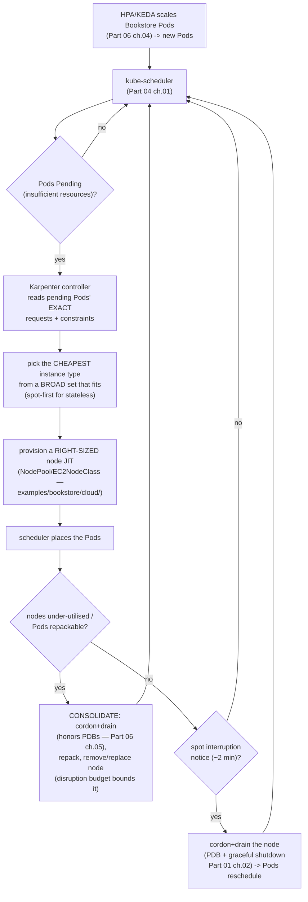

# 06 — Node autoscaling, cost & multi-cloud

> The node tier under the Pod tier, on a real cloud, plus what it costs and
> what is portable: **Cluster Autoscaler** (ASG/MIG-bound, scale-from-
> unschedulable, scale-down on utilisation) vs **Karpenter** (NodePool/
> EC2NodeClass, just-in-time *right-sized* nodes, consolidation, spot,
> disruption budgets) vs **GKE node auto-provisioning / Autopilot** vs **AKS**;
> **spot/preemptible** strategy and interruption handling (taints, the [Part 06
> ch.05](../06-production-readiness/05-reliability-and-disruptions.md) PDBs,
> checkpointing); **cloud cost & FinOps** (cost-allocation tags, dashboards,
> Reserved/Savings/committed-use, requests-rightsizing tied to [Part 06
> ch.06](../06-production-readiness/06-capacity-and-cost.md), scale-to-zero);
> **multi-cloud / hybrid portability** (what is portable: the K8s API/Helm/
> Kustomize/GitOps; what is not: LB/IAM/CSI/CNI); and a **cloud
> production-readiness checklist** mapping each cloud concern to its Part-10
> chapter — applied with a Bookstore Karpenter `NodePool`/`EC2NodeClass` and
> the spot+PDB story for the stateless tiers.

**Estimated time:** ~60 min read · ~120 min hands-on
**Prerequisites:** [Part 06 ch.04](../06-production-readiness/04-autoscaling.md) — Pod-tier autoscaling the node tier serves · [Part 06 ch.05](../06-production-readiness/05-reliability-and-disruptions.md) — PDBs that gate spot interruption handling · [Part 06 ch.06](../06-production-readiness/06-capacity-and-cost.md) — cost/requests-rightsizing framing
**You'll know after this:** • compare Cluster Autoscaler vs Karpenter vs GKE auto-provisioning vs AKS for a workload · • author a Karpenter NodePool/EC2NodeClass for right-sized, just-in-time nodes · • design a spot/preemptible strategy with PDBs + checkpointing + interruption handlers · • identify what is portable (K8s API, Helm, Kustomize, GitOps) and what is not (LB/IAM/CSI/CNI) · • run a cloud production-readiness check across the Part 10 concerns

<!-- tags: cloud, autoscaling, karpenter, cost, finops, day-2 -->

## Why this exists

[Part 06 ch.04](../06-production-readiness/04-autoscaling.md) introduced the
node tier as a callout: HPA/KEDA create Pods, and *"if no node has room they
stay `Pending`"* — Cluster Autoscaler or Karpenter then add nodes;
[Part 06 ch.06](../06-production-readiness/06-capacity-and-cost.md) added the
FinOps loop and named spot/preemptible as the largest saving *after* requests
are right. Both deferred the depth to "the cloud chapter". This is that
chapter — and on a real cloud the node tier is no longer a callout, it is
**the cost centre** ([ch.01](01-managed-kubernetes-model.md): the
control-plane fee is small; nodes are the bill).

The failure modes that make this its own chapter:

1. **The Pending Pod with nowhere to go.** The Bookstore catalog HPA
   ([Part 06 ch.04](../06-production-readiness/04-autoscaling.md)) scales out
   under a sale; on kind there were "fixed nodes" so this was conceptual. On a
   cloud, with no node autoscaler, the new Pods sit `Pending` forever and the
   sale fails — the HPA scaled, nothing caught the overflow.
2. **The fleet of air.** [Part 06 ch.06](../06-production-readiness/06-capacity-and-cost.md)'s
   "fleet of air": over-provisioned nodes running over-requested Pods, billed
   24/7. A node autoscaler sized to *wrong* requests is still wasteful — and
   the wrong autoscaler (fixed groups vs right-sized JIT) leaves money on the
   table even with right requests.
3. **The accidental lock-in (and the accidental rewrite).** Believing
   everything is portable, then discovering the LB annotations, IAM mapping,
   CSI driver, and CNI are all cloud-specific ([ch.03](03-cloud-identity.md)–
   [ch.05](05-cloud-storage-and-data.md)) — *or* the opposite: rewriting the
   portable layer (the Bookstore manifests/Helm/Kustomize/GitOps) "for the
   cloud" when it never needed to change.

This chapter closes Part 10: the node-scaling depth Parts 06 deferred, the
cloud cost levers, the honest portability boundary, and a checklist that maps
every cloud concern back to its Part-10 chapter. The reference is *Production
Kubernetes* (Autoscaling / Multitenancy) and the Karpenter docs.

> **This chapter needs a real cloud account.** Node autoscaling and spot act
> on real cloud VM APIs — kind has fixed "nodes" ([Part 06
> ch.04](../06-production-readiness/04-autoscaling.md) said exactly this). Per
> the [ch.01](01-managed-kubernetes-model.md) honesty pattern: every command/
> object is **exact and correct**; the **Bookstore Karpenter file is
> dry-runnable on kind** (it prints the documented CRD `no matches for kind`
> until Karpenter is installed — schema-correct), and the Bookstore manifests/
> PDBs are unchanged; only cloud node behaviour needs the account. No output
> faked.

## Mental model

**The node tier reacts to the scheduler's verdict: Pods don't fit → add
nodes; nodes underused → remove them. Cluster Autoscaler does this by
resizing *fixed groups*; Karpenter does it by provisioning *right-sized nodes
just-in-time* and consolidating. Cost = which nodes × how many × how long ×
the pricing model; portability = the K8s API is, the cloud plumbing isn't.**

- **Cluster Autoscaler (CA)** — scales **pre-defined node groups** (ASG/MIG/
  VMSS, [ch.02](02-provisioning-and-iac.md)). When Pods are `Pending` for
  *insufficient resources*, CA increases a group's desired count within
  min/max; when a node sits below the **scale-down utilisation threshold
  (default ~50% of allocatable requested, configurable via
  `--scale-down-utilization-threshold`)** and its Pods can move (honoring
  **PDBs** — [Part 06 ch.05](../06-production-readiness/05-reliability-and-disruptions.md)),
  it removes the node. Simple, mature, but **node *shape* is fixed by the
  group** — you pick instance types up front; CA only changes *count*.
- **Karpenter (AWS/EKS)** — scales by **provisioning individual right-sized
  nodes** from a broad instance-type set, JIT, to fit the *exact* pending
  Pods' requests/constraints; then **consolidates** (replaces/removes
  under-used nodes, repacking Pods) and handles **spot** + **disruption
  budgets**. No pre-defined groups — node *shape* is chosen per need, so less
  waste and faster scale. Configured by `NodePool` + `EC2NodeClass` CRDs.
- **GKE node auto-provisioning / Autopilot; AKS** — GKE NAP creates/sizes node
  pools automatically (CA-plus-shape); **GKE Autopilot** removes node
  management entirely (you declare Pods, Google sizes/bills the nodes —
  [ch.01](01-managed-kubernetes-model.md) boundary shifts further to the
  provider). AKS uses the cluster autoscaler (Karpenter-for-Azure exists in
  preview). Same idea, provider-shaped.
- **Spot/preemptible is the big lever — for the *right* tier.** Spot VMs are
  60–90% cheaper but can be **reclaimed with ~2 min notice**. Correct for the
  **fault-tolerant stateless** Bookstore tiers (storefront/catalog/orders/
  payments-worker) **protected by PDBs + spread** ([Part 06
  ch.05](../06-production-readiness/05-reliability-and-disruptions.md) / [Part
  04 ch.02](../04-scheduling/02-affinity-taints-topology.md)) and graceful
  shutdown ([Part 01 ch.02](../01-core-workloads/02-health-and-lifecycle.md)).
  **Wrong** for the data tier ([Part 03
  ch.05](../03-config-and-storage/05-stateful-data-patterns.md)) — a reclaimed
  Postgres node is an outage. Taints/`capacity-type` keep the DB off spot.
- **Cost = requests × node price × time, and the FinOps loop still rules.**
  [Part 06 ch.06](../06-production-readiness/06-capacity-and-cost.md): the
  scheduler reserves *requests*, the autoscaler buys *nodes for requests* —
  so **right-sizing requests first** is the highest-leverage action; *then*
  node strategy (autoscaler + spot + committed-use discounts) multiplies it.
  Cost-allocation tags + OpenCost/cloud tooling make the Bookstore's spend
  owned, not discovered. Scale-to-zero (KEDA, [Part 06
  ch.04](../06-production-readiness/04-autoscaling.md)) + node consolidation
  removes idle cost entirely.
- **Portability is a real, knowable line.** **Portable** (zero change between
  clouds): the Kubernetes API, the Bookstore manifests, Helm, Kustomize
  overlays, GitOps ([Part 07](../07-delivery/01-packaging-helm.md)). **Not
  portable** (deliberate per-cloud config): LB annotations
  ([ch.04](04-cloud-networking-and-load-balancing.md)), IAM mapping
  ([ch.03](03-cloud-identity.md)), CSI driver/StorageClass
  ([ch.05](05-cloud-storage-and-data.md)), CNI specifics, and the node
  autoscaler (Karpenter is AWS-only). Multi-cloud = keep the portable layer
  pristine and isolate the non-portable layer in overlays/values.

The trap to hold onto: **a node autoscaler does not fix bad requests, and
spot does not fix the data tier.** Sequence: right-size requests ([Part 06
ch.06](../06-production-readiness/06-capacity-and-cost.md)) → pick the right
node autoscaler → spot the stateless tiers (PDB-protected) → apply
committed-use discounts. Out of order, you optimise air.

## Diagrams

### Diagram A — the Karpenter loop: pending Pod → right-sized node → consolidate (Mermaid)

Karpenter's reconcile loop. It reacts to the scheduler's `Pending` verdict
with a *right-sized* node, then continuously consolidates to shrink the bill.



### Diagram B — Cluster Autoscaler vs Karpenter + cost-lever table (ASCII)

```
 NODE AUTOSCALERS + THE COST LEVERS ────────────────────────────────────────

  aspect            Cluster Autoscaler    Karpenter (AWS)    GKE NAP/Autopilot
  ─────────────────────────────────────────────────────────────────────────
  scales            fixed node GROUPS     individual nodes,  node pools auto
                     (ASG/MIG/VMSS)        JIT right-sized     (NAP); Autopilot
                                                                = no nodes at all
  node SHAPE        fixed by the group    chosen per pending  auto-chosen
                     (you pick up front)   Pod (broad set)
  trigger           Pending Pods ->        Pending Pods ->    Pending Pods ->
                     resize group           new right-sized    new/sized pool
                                            node
  scale-DOWN        underused node ->      consolidation      underused ->
                     remove (PDB-honored)   (repack+replace,    remove (PDB)
                                            PDB+budget-honored)
  spot              via spot node groups   first-class        via spot pools /
                                            (capacity-type)     Autopilot Spot
  portability       all clouds (the CA     AWS/EKS ONLY       GCP ONLY
                     project; per-cloud     (Azure preview)
                     provider)
  best for          fixed, predictable     variable/spiky,    GCP-native;
                     fleets; multi-cloud    spot-heavy, cost-   hands-off (Auto-
                     consistency           sensitive (Book-    pilot)
                                            store stateless)

 COST LEVERS (apply IN THIS ORDER — Part 06 ch.06):
  1. RIGHT-SIZE requests (Part 06 ch.06) ........ biggest single win
  2. NODE AUTOSCALER sized to real requests ..... no fleet of air
  3. SPOT for stateless (PDB+spread protected) .. 60-90% off those nodes
  4. CONSOLIDATION / scale-to-zero (KEDA) ....... remove idle cost
  5. COMMITTED-USE discounts (Reserved/Savings/   10-60% off the steady
     CUD) for the steady baseline ..............   baseline
  6. COST-ALLOCATE per ns/workload (OpenCost/     spend owned, not
     cloud tooling) ............................   discovered
  WRONG ORDER = optimising air (cheap nodes running over-requested Pods).
```

## Hands-on with the Bookstore

**Assumed working directory: the guide repo root (`full-guide/`).** This
chapter adds **one new file** —
[`examples/bookstore/cloud/karpenter-nodepool.yaml`](../examples/bookstore/cloud/karpenter-nodepool.yaml)
— and edits **nothing** canonical. **Illustrative** (Karpenter needs an EKS
cluster); the dry-run showing the documented CRD-intrinsic behaviour is
**runnable on kind now**.

### 1. The problem made concrete: the catalog HPA needs somewhere to scale

[Part 06 ch.04](../06-production-readiness/04-autoscaling.md) added the
catalog HPA ([`82-hpa-catalog.yaml`](../examples/bookstore/raw-manifests/82-hpa-catalog.yaml),
`maxReplicas: 6`) and the KEDA-scaled `payments-worker`
([`83-keda-scaledobject.yaml`](../examples/bookstore/raw-manifests/83-keda-scaledobject.yaml),
`maxReplicaCount: 10`). On a cloud cluster with no node autoscaler, a sale
drives the HPA to 6 catalog Pods, the cluster has room for 3, and **3 Pods sit
`Pending`** — the HPA worked, nothing caught the overflow. The node tier is
what makes the [Part 06 ch.04](../06-production-readiness/04-autoscaling.md)
Pod autoscaling actually deliver capacity.

### 2. Install Karpenter (pinned Helm) — the lead path on EKS

Per the guide's hard rule — **pinned Helm, never
`releases/latest/download/<PINNED-FILE>.yaml`** (the same rule Parts 06/07/08
used for KEDA/kube-prometheus-stack/Velero):

```sh
# Karpenter via its OCI Helm chart, PINNED. The controller needs IRSA/Pod
# Identity (ch.03) to call EC2 with NO static key; the node IAM role and the
# karpenter.sh/discovery subnet/SG tags must pre-exist (ch.02 cluster IaC).
helm registry login public.ecr.aws
helm upgrade --install karpenter oci://public.ecr.aws/karpenter/karpenter \
  --version 1.0.6 -n karpenter --create-namespace \
  --set "settings.clusterName=$CLUSTER_NAME" \
  --set "serviceAccount.annotations.eks\.amazonaws\.com/role-arn=arn:aws:iam::123456789012:role/KarpenterController" \
  --wait
kubectl -n karpenter rollout status deploy/karpenter
kubectl get crd | grep karpenter        # nodepools, ec2nodeclasses now registered
```

### 3. Apply the Bookstore NodePool/EC2NodeClass (the new file)

[`examples/bookstore/cloud/karpenter-nodepool.yaml`](../examples/bookstore/cloud/karpenter-nodepool.yaml)
is sized for the Bookstore's stateless tiers: a **broad instance set**
(c/m/r families, no nano/micro), **spot-first** `capacity-type`, a
**consolidation** policy + **disruption budget** that works *with* the
Bookstore's `84-pdb.yaml` ([Part 06
ch.05](../06-production-readiness/05-reliability-and-disruptions.md)), a
**`limits`** block capping spend (the cost guardrail — mirrors the namespace
ResourceQuota bounding the HPA in [Part 06
ch.04](../06-production-readiness/04-autoscaling.md)), and an `EC2NodeClass`
with a **minimal node role** + **IMDSv2 hop-limit 1** so Bookstore Pods cannot
steal the node identity ([ch.03](03-cloud-identity.md)). Core shape:

```yaml
apiVersion: karpenter.sh/v1
kind: NodePool
metadata: { name: bookstore-stateless }
spec:
  template:
    spec:
      requirements:
        - { key: karpenter.sh/capacity-type, operator: In, values: ["spot","on-demand"] }
        - { key: karpenter.k8s.aws/instance-category, operator: In, values: ["c","m","r"] }
      nodeClassRef: { group: karpenter.k8s.aws, kind: EC2NodeClass, name: bookstore-default }
  disruption:
    consolidationPolicy: WhenEmptyOrUnderutilized
    budgets: [ { nodes: "10%" } ]          # works WITH 84-pdb.yaml (Part 06 ch.05)
  limits: { cpu: "200", memory: 200Gi }    # the spend ceiling (cost guardrail)
```

```sh
kubectl apply -f examples/bookstore/cloud/karpenter-nodepool.yaml   # Karpenter-EKS only
kubectl get nodepool,ec2nodeclass
# Now drive the catalog HPA (the Part 06 ch.04 load test) so Pods go Pending;
# watch Karpenter provision a RIGHT-SIZED node JIT, place them, then
# consolidate when load drops:
kubectl get nodeclaims -w        # Karpenter creating/removing nodes
kubectl get nodes -L karpenter.sh/capacity-type -L topology.kubernetes.io/zone
#   stateless Pods land on SPOT nodes, AZ-spread; postgres does NOT (it has no
#   spot toleration and its zonal disk pins it — ch.05).
```

### 4. The spot + PDB story for the stateless tiers (no app change)

The Bookstore is **already built for spot** — no manifest change needed:

- `storefront`/`catalog`/`orders`/`payments-worker` are **stateless** and
  fault-tolerant; a reclaimed node reschedules them.
- [`84-pdb.yaml`](../examples/bookstore/raw-manifests/84-pdb.yaml) ([Part 06
  ch.05](../06-production-readiness/05-reliability-and-disruptions.md)) bounds
  how many go down at once — Karpenter's drain on spot-interruption/
  consolidation **honors it** (the same eviction-API contract as a node
  drain, [Part 08 ch.01](../08-day-2-operations/01-cluster-lifecycle.md)).
- `topologySpreadConstraints`/`podAntiAffinity` ([Part 04
  ch.02](../04-scheduling/02-affinity-taints-topology.md)) keep replicas off
  one node/AZ so a single spot reclamation can't take the tier.
- Native `preStop` sleep + `terminationGracePeriodSeconds`
  ([Part 01 ch.02](../01-core-workloads/02-health-and-lifecycle.md)) make the
  ~2-min spot drain graceful — in-flight requests finish, the worker drains
  its RabbitMQ message ([Part 06 ch.04](../06-production-readiness/04-autoscaling.md)).

The **data tier stays off spot**: `postgres` has no spot toleration, its
zonal disk pins it ([ch.05](05-cloud-storage-and-data.md)), and a reclaimed
Postgres node is an outage ([Part 03
ch.05](../03-config-and-storage/05-stateful-data-patterns.md)). This is the
[Part 06 ch.06](../06-production-readiness/06-capacity-and-cost.md) rule —
spot the stateless, never the data — realised by Karpenter config, not app
edits.

### 5. Cost & FinOps on the Bookstore (the loop, cloud-priced)

[Part 06 ch.06](../06-production-readiness/06-capacity-and-cost.md)'s loop is
*observe → right-size → enforce → re-measure*; on cloud it gains real dollars:

```sh
# 1. RIGHT-SIZE requests FIRST (Part 06 ch.06) — the catalog recommendation
#    there (cpu 40m, mem 96Mi==limit) shrinks what the autoscaler must buy.
# 2. NODE autoscaler sized to real requests (steps 2-3) — no fleet of air.
# 3. SPOT the stateless tiers (step 4) — 60-90% off those nodes.
# 4. SCALE-TO-ZERO: payments-worker via KEDA (Part 06 ch.04) + Karpenter
#    consolidation removes the idle node entirely at 3am.
# 5. COMMITTED-USE: cover the steady baseline (postgres + min HPA replicas)
#    with Savings Plans / Reserved / CUD (10-60% off the always-on part).
# 6. COST-ALLOCATE: tag nodes/resources by owner; OpenCost (Part 06 ch.06) or
#    the cloud's split-cost/cost-allocation tooling attributes $ per
#    namespace/workload -> the Bookstore's spend is OWNED, not discovered.
kubectl get nodes -L karpenter.sh/capacity-type    # spot vs on-demand mix (priced)
```

On kind the dollars are synthetic ([Part 06
ch.06](../06-production-readiness/06-capacity-and-cost.md) said this); the
*efficiency ratio* (usage ÷ request) and the spot/consolidation behaviour are
real on the managed cluster.

### 6. The CRD-intrinsic dry-run (documented, like every prior CRD object)

```sh
# from the repo root (full-guide/) — RUNNABLE on kind, no cloud:
kubectl apply --dry-run=client -f examples/bookstore/cloud/karpenter-nodepool.yaml
# error: ... no matches for kind "NodePool" in version "karpenter.sh/v1"
# error: ... no matches for kind "EC2NodeClass" in version "karpenter.k8s.aws/v1"
```

That is **expected and correct** — the *exact* precedent of
[`51-gateway.yaml`](../examples/bookstore/raw-manifests/51-gateway.yaml),
[`83-keda-scaledobject.yaml`](../examples/bookstore/raw-manifests/83-keda-scaledobject.yaml),
[`70-kyverno-policy.yaml`](../examples/bookstore/raw-manifests/70-kyverno-policy.yaml),
[`18-postgres-snapshot.yaml`](../examples/bookstore/raw-manifests/18-postgres-snapshot.yaml),
the `argocd/` tree, and
[`operators/velero-backup.yaml`](../examples/bookstore/operators/velero-backup.yaml).
The file is **schema-correct** (verified against the Karpenter API reference);
the CRDs must exist first (step 2). Its header documents this exactly.

> **Lineage note.** This is the node tier the [Part 06
> ch.04](../06-production-readiness/04-autoscaling.md) HPA/KEDA callouts and
> the [Part 06 ch.06](../06-production-readiness/06-capacity-and-cost.md)
> FinOps loop pointed at — *"a node autoscaler (Cluster Autoscaler/Karpenter)
> for the Pod growth"* and *"spot for fault-tolerant tiers, protected by PDBs
> + spread"*. It deepens, never contradicts, those callouts. The Bookstore
> manifests, `84-pdb.yaml`, and the scheduling layer are **unchanged** — spot
> is a Karpenter-config decision, not an app edit.

## How it works under the hood

- **Cluster Autoscaler: count, not shape.** CA watches for Pods unschedulable
  due to insufficient resources and, per node group, **increases the cloud
  ASG/MIG/VMSS desired count** within min/max ([ch.02](02-provisioning-and-iac.md));
  when a node's requested utilisation stays below
  `--scale-down-utilization-threshold` (**default ~50%** of allocatable) for
  `--scale-down-unneeded-time` and its Pods can be evicted (eviction API →
  **PDBs honored**, [Part 06
  ch.05](../06-production-readiness/05-reliability-and-disruptions.md)), it
  scales the group down. It reacts to the **scheduler's** verdict ([Part 04
  ch.01](../04-scheduling/01-scheduler-and-nodes.md)) — it never re-shapes
  nodes, only counts, so node *type* is a pre-commitment ([Part 06
  ch.04](../06-production-readiness/04-autoscaling.md)'s description, deepened).
- **Karpenter: shape *and* count, from the pending Pods backward.** Karpenter
  watches **`Pending` Pods directly**, computes a node that satisfies their
  *exact* aggregate requests + affinities/taints/topology, and **launches that
  instance** from a broad type set (the `NodePool.requirements` /
  `EC2NodeClass`) — choosing the cheapest fitting type, spot-first if allowed.
  It then runs **consolidation**: if Pods can be repacked onto fewer/cheaper
  nodes, it cordons+drains the loser (eviction API → **PDBs + disruption
  budgets** honored) and removes/replaces it. The result is closer-to-optimal
  bin-packing with far less pre-planning than fixed groups — the [Part 06
  ch.04](../06-production-readiness/04-autoscaling.md) Karpenter callout,
  mechanised. `consolidationPolicy`/`budgets`/`expireAfter` (in the Bookstore
  file) bound how aggressive and how disruptive it is.
- **Why spot needs PDBs + spread + graceful shutdown — and the data tier
  doesn't get spot.** Spot reclamation is an involuntary disruption with ~2
  min notice. The Bookstore survives it on the stateless tiers because
  **`84-pdb.yaml`** ([Part 06
  ch.05](../06-production-readiness/05-reliability-and-disruptions.md)) caps
  concurrent loss, **spread** ([Part 04
  ch.02](../04-scheduling/02-affinity-taints-topology.md)) means no single
  node/AZ hosts a whole tier, and **`preStop` + grace**
  ([Part 01 ch.02](../01-core-workloads/02-health-and-lifecycle.md)) lets
  in-flight work finish in the 2-min window. The data tier has **none of
  these guarantees against node loss** — Postgres is a singleton on a zonal
  disk ([ch.05](05-cloud-storage-and-data.md)); a reclaimed Postgres node is
  an outage and a restore ([Part 08
  ch.02](../08-day-2-operations/02-backup-and-dr.md)), so it must run
  on-demand (no spot toleration / a separate on-demand pool). This is exactly
  the [Part 06 ch.06](../06-production-readiness/06-capacity-and-cost.md)
  "spot-ize the stateless, not the data" rule, made mechanical.
- **The cost equation, and why request-rightsizing comes first.** The cloud
  bill for compute ≈ Σ(node price × time), and the **node count is driven by
  Σ requests** ([Part 06 ch.06](../06-production-readiness/06-capacity-and-cost.md):
  the scheduler reserves requests; the autoscaler buys nodes for requests).
  So over-requested Pods inflate the node count *regardless* of the
  autoscaler — which is why the [Part 06
  ch.06](../06-production-readiness/06-capacity-and-cost.md) sequence is
  immutable: **right-size requests, then** add a node autoscaler, then spot,
  then consolidation/scale-to-zero, then committed-use discounts on the steady
  baseline. Cost-allocation tags + OpenCost/cloud tooling ([Part 06
  ch.06](../06-production-readiness/06-capacity-and-cost.md)) turn the
  Bookstore's requests-vs-usage gap into a per-workload dollar number an owner
  reduces. Committed-use (Reserved Instances / Savings Plans / CUDs) discounts
  the *predictable baseline* (Postgres + the HPA `minReplicas`); spot
  discounts the *elastic, fault-tolerant* part — they are complementary, not
  alternatives.
- **GKE Autopilot / NAP and AKS — the boundary shifts, the SLO doesn't.** GKE
  **NAP** is CA that also *creates and sizes* node pools (shape + count);
  **Autopilot** removes node management and bills per Pod resource — the
  [ch.01](01-managed-kubernetes-model.md) responsibility boundary moves
  further to Google, but **the app SLO, PDBs, requests, and the FinOps loop
  stay yours**. AKS uses the cluster autoscaler; Karpenter-for-Azure is in
  preview. The Pod-tier autoscaling (HPA/KEDA/VPA, [Part 06
  ch.04](../06-production-readiness/04-autoscaling.md)) is fully portable; the
  **node tier is provider-specific** — which is the headline of the
  portability section.
- **Portability — the precise line.** What is **byte-identical across
  EKS/GKE/AKS and kind**: the Kubernetes API objects (the Bookstore
  `raw-manifests/`), Helm charts, Kustomize overlays, GitOps repos ([Part
  07](../07-delivery/01-packaging-helm.md)) — proven by the [Part 08
  ch.01](../08-day-2-operations/01-cluster-lifecycle.md) deprecated-API audit
  (only GA APIs). What is **deliberately per-cloud**: the LB controller +
  annotations ([ch.04](04-cloud-networking-and-load-balancing.md)), the
  identity mapping ([ch.03](03-cloud-identity.md)), the CSI driver +
  StorageClass `parameters` ([ch.05](05-cloud-storage-and-data.md)), the CNI
  specifics ([ch.04](04-cloud-networking-and-load-balancing.md)), and the node
  autoscaler (Karpenter = AWS only). Multi-cloud/hybrid strategy = keep the
  portable layer untouched and confine the non-portable layer to overlays/
  values/per-cluster add-ons — exactly the Kustomize/Helm structure Part 07
  already gave the Bookstore. "Portable Kubernetes" is true *for the workload*
  and false *for the cloud plumbing*; conflating the two causes both the
  accidental-lock-in and the accidental-rewrite failures.

## Production notes

> **In production: every cluster needs a node autoscaler — HPA/KEDA without
> one strands Pods.** The Bookstore catalog HPA / payments-worker KEDA ([Part
> 06 ch.04](../06-production-readiness/04-autoscaling.md)) only deliver
> capacity if `Pending` Pods trigger nodes. Use **Karpenter** on EKS
> (right-sized JIT + consolidation + spot — the Bookstore file), **NAP/
> Autopilot** on GKE, the **cluster autoscaler** on AKS. Bound it (`limits` /
> ASG max / namespace ResourceQuota — [Part 06
> ch.04](../06-production-readiness/04-autoscaling.md)) so scaling can't
> exhaust the bill.

> **In production: spot the fault-tolerant tiers (PDB + spread + graceful),
> never the data tier.** Spot is 60–90% off and safe for the Bookstore
> stateless tiers *because* of `84-pdb.yaml`, topology spread, and `preStop`
> grace ([Part 06 ch.05](../06-production-readiness/05-reliability-and-disruptions.md)
> / [Part 04 ch.02](../04-scheduling/02-affinity-taints-topology.md) / [Part
> 01 ch.02](../01-core-workloads/02-health-and-lifecycle.md)). Keep Postgres
> on-demand — a reclaimed DB node on a zonal disk
> ([ch.05](05-cloud-storage-and-data.md)) is an outage + restore ([Part 08
> ch.02](../08-day-2-operations/02-backup-and-dr.md)). Handle interruption
> with a node-termination handler / Karpenter's native draining.

> **In production: requests first, then nodes, then spot, then commitments —
> in that order.** Cheap nodes running over-requested Pods are still wasted
> ([Part 06 ch.06](../06-production-readiness/06-capacity-and-cost.md)).
> Right-size from measured usage ([Part 06
> ch.06](../06-production-readiness/06-capacity-and-cost.md)), size the
> autoscaler to that, spot the stateless, consolidate + scale-to-zero (KEDA,
> [Part 06 ch.04](../06-production-readiness/04-autoscaling.md)), then cover
> the steady baseline with Reserved/Savings/CUD. Reversing the order optimises
> air.

> **In production: make cloud cost visible and owned per workload.** Tag
> nodes/resources by owner/team; use OpenCost ([Part 06
> ch.06](../06-production-readiness/06-capacity-and-cost.md)) or the cloud's
> split-cost/cost-allocation tooling so the Bookstore's spend (and its
> efficiency = usage ÷ request) is a number a team reduces, not a surprise on
> the invoice. Run the FinOps loop continuously — usage drifts every release.

> **In production: know exactly what is portable and isolate what is not.**
> The Bookstore manifests/Helm/Kustomize/GitOps are byte-identical across
> clouds ([Part 08 ch.01](../08-day-2-operations/01-cluster-lifecycle.md)) —
> never rewrite them "for the cloud". The LB/IAM/CSI/CNI/node-autoscaler layer
> *is* per-cloud ([ch.03](03-cloud-identity.md)–[ch.05](05-cloud-storage-and-data.md))
> — confine it to overlays/values/per-cluster add-ons (the Part 07 structure).
> Multi-cloud is "one portable app, N thin cloud adapters", not "N forks".

> **In production: Autopilot/serverless-nodes trade control for less toil —
> the SLO stays yours.** GKE Autopilot / EKS Fargate remove node management
> and shift the [ch.01](01-managed-kubernetes-model.md) boundary further to
> the provider, but PDBs, requests, the app SLO, and the FinOps discipline are
> still yours. Choose it deliberately for hands-off operation; do not assume
> it makes reliability or cost someone else's problem.

## Quick Reference

```sh
# Install Karpenter (pinned Helm; never releases/latest/download/<PINNED>.yaml)
helm upgrade --install karpenter oci://public.ecr.aws/karpenter/karpenter \
  --version 1.0.6 -n karpenter --create-namespace \
  --set settings.clusterName=$CLUSTER_NAME ...           # IRSA SA (ch.03), no key
kubectl apply -f examples/bookstore/cloud/karpenter-nodepool.yaml   # Karpenter-EKS only

# Watch the node tier react to the Part 06 ch.04 HPA/KEDA Pod growth
kubectl get nodeclaims -w                                  # Karpenter add/remove
kubectl get nodes -L karpenter.sh/capacity-type -L topology.kubernetes.io/zone
kubectl get pdb -n bookstore                               # 84-pdb.yaml bounds drains

# Cost levers (Part 06 ch.06 order): right-size -> autoscaler -> spot ->
#   consolidate/scale-to-zero -> committed-use -> allocate (OpenCost/cloud)

# CRD-intrinsic dry-run (RUNNABLE on kind; documented in the file's header):
kubectl apply --dry-run=client -f examples/bookstore/cloud/karpenter-nodepool.yaml
# -> no matches for kind "NodePool"/"EC2NodeClass" until Karpenter is installed
```

Minimal Karpenter `NodePool` + `EC2NodeClass` skeleton (full, documented set
in [`examples/bookstore/cloud/karpenter-nodepool.yaml`](../examples/bookstore/cloud/karpenter-nodepool.yaml)):

```yaml
apiVersion: karpenter.sh/v1                # CRD — needs Karpenter installed
kind: NodePool
spec:
  template:
    spec:
      requirements:
        - { key: karpenter.sh/capacity-type, operator: In, values: ["spot","on-demand"] }
      nodeClassRef: { group: karpenter.k8s.aws, kind: EC2NodeClass, name: default }
  disruption: { consolidationPolicy: WhenEmptyOrUnderutilized, budgets: [ { nodes: "10%" } ] }
  limits: { cpu: "200", memory: 200Gi }    # the spend ceiling (cost guardrail)
---
apiVersion: karpenter.k8s.aws/v1           # CRD
kind: EC2NodeClass
spec:
  amiFamily: AL2023
  role: "KarpenterNodeRole-<CLUSTER>"      # MINIMAL node role (ch.03)
  metadataOptions: { httpTokens: required, httpPutResponseHopLimit: 1 }  # ch.03
```

Cloud production-readiness checklist (each concern → its Part-10 chapter):

- [ ] Provider SLA vs your responsibility understood; control plane
      regional/multi-AZ ([ch.01](01-managed-kubernetes-model.md))
- [ ] Cluster from **versioned IaC**; teardown + orphan sweep; OIDC at create
      ([ch.02](02-provisioning-and-iac.md))
- [ ] **No static cloud key** — workload identity, scoped per-SA, metadata
      endpoint blocked ([ch.03](03-cloud-identity.md))
- [ ] Shared Ingress/Gateway (not N LBs); CNI **enforces** NetworkPolicy; VPC
      CIDRs planned ([ch.04](04-cloud-networking-and-load-balancing.md))
- [ ] Block SC `WaitForFirstConsumer`+`Retain`+encrypted; zonal-disk AZ-pin
      designed for; snapshot+Velero ([ch.05](05-cloud-storage-and-data.md) /
      [Part 08 ch.02](../08-day-2-operations/02-backup-and-dr.md))
- [ ] **Node autoscaler** (Karpenter/NAP/CA) bounded; **spot** the stateless
      (PDB+spread); **right-size first**, then commitments; cost allocated
      ([ch.06](06-node-autoscaling-cost-multicloud.md) / [Part 06
      ch.06](../06-production-readiness/06-capacity-and-cost.md))
- [ ] Portable layer (manifests/Helm/Kustomize/GitOps) **unchanged**;
      non-portable layer isolated in overlays/values ([ch.06](06-node-autoscaling-cost-multicloud.md))

## Test your understanding

> Try each before opening the answer drawer. The act of trying is the exercise; the answer is the check.

1. **In one sentence each, distinguish Cluster Autoscaler from Karpenter.**
   <details><summary>Show answer</summary>

   Cluster Autoscaler scales pre-defined ASGs up or down based on unschedulable Pods and node utilization — it picks from the node shapes you declared. Karpenter dynamically provisions just-in-time, right-sized nodes by reading the requirements of unschedulable Pods (CPU, memory, GPU, arch, capacity-type) and choosing the cheapest EC2 instance type that fits, then consolidates underutilized nodes. CA is "bounded by your ASG choices"; Karpenter is "bounded by your NodePool requirements."

   </details>

2. **Karpenter is provisioning spot nodes for the stateless tier, but AWS just reclaimed a spot node mid-checkout. Your storefront PDB is `minAvailable: 2` and you have 3 storefront replicas. What happens, and what would have happened with a 2-second-handler?**
   <details><summary>Show answer</summary>

   AWS sends a 2-minute spot interruption notice; Karpenter taints the node, marking it for graceful shutdown. Pods are drained respecting the PDB — if draining would violate `minAvailable: 2`, Karpenter waits. Within the 2-minute window, the checkout in-flight finishes (preStop honors the timeout), the Pod terminates, and a new node + Pod come up elsewhere. With a 2-second SIGTERM handler that ignores the grace period, the in-flight checkout would be dropped, the customer sees an error, and you have an apology to write. The right pattern is: PDB + spot interruption handler + preStop hook + idempotent client retries.

   </details>

3. **You're spending $14,000/month on GPU nodes that show ~12% utilization. Walk through the cost-attack order before touching commitments (RIs/SP).**
   <details><summary>Show answer</summary>

   First, right-size requests: VPA-recommend the actual GPU memory and CPU each workload uses, drop oversized requests. Second, enable MIG or time-slicing where workloads are GPU-fractional. Third, move dev/notebook GPU work to spot with checkpointing. Fourth, scale-to-zero serving when idle (KServe Knative — see [Part 12 ch.06](../12-kubernetes-for-machine-learning/06-model-serving-and-inference.md)). Fifth, consolidation: Karpenter `consolidation: WhenUnderutilized` packs Pods onto fewer nodes. Only *then*, with the utilization curve in hand, commit to Savings Plans for the steady baseline (typically the bottom 30-50% of the curve). Committing before right-sizing locks in waste.

   </details>

4. **What is portable across EKS/GKE/AKS, and what is not?**
   <details><summary>Show answer</summary>

   Portable: the Kubernetes API itself (Deployments, Services, StatefulSets, PVCs by abstract StorageClass), Helm/Kustomize/GitOps tooling, RBAC, NetworkPolicy resources, Prometheus metrics names, Istio/Linkerd manifests, application code. Not portable: load-balancer Service annotations (ALB/NLB/GCLB/AGIC), CSI driver names (`ebs.csi.aws.com` vs `pd.csi.storage.gke.io`), CNI specifics (VPC CNI vs Calico vs Cilium), cloud IAM bindings (IRSA vs Workload Identity vs Federated Credential), node autoscaler (Karpenter is AWS-only today). The discipline: keep the portable layer in `base/`, isolate non-portable in `overlays/aws/` and `overlays/gcp/`.

   </details>

5. **Hands-on: write a Karpenter `NodePool` that prefers spot instances of arch `amd64` with 4-16 vCPU, falls back to on-demand if no spot is available, and uses consolidation. Then `kubectl apply` and watch a 10-replica Deployment scale up. What instance types did Karpenter pick?**
   <details><summary>What you should see</summary>

   Karpenter consults the EC2 pricing model and selects the cheapest instance type per AZ that satisfies the workload's CPU/memory requests — typically a mix of `m5.large`/`m6i.large`/`c6i.large` spot instances. After scale-down, Karpenter `consolidation: WhenUnderutilized` collapses to a smaller node count by replanning the schedule. You'll see different instance shapes coming and going — that's the point: instead of one fixed shape, Karpenter optimizes per-workload across the EC2 catalog.

   </details>

## Further reading

- **Rosso et al., _Production Kubernetes_, ch.13 — Autoscaling** (the node
  tier in a production platform, autoscaler trade-offs, the requests-vs-usage
  cost gap) and **ch.12 — Multitenancy** (quota/limits as the cost +
  isolation guardrail, the basis for the spend ceiling).
- **Ibryam & Huß, _Kubernetes Patterns_ 2e, ch.29 — Elastic Scale** (Pod and
  cluster autoscaling as one elasticity pattern — the node tier under the Pod
  tier).
- Official: Karpenter <https://karpenter.sh/docs/>, the Kubernetes Cluster
  Autoscaler
  <https://github.com/kubernetes/autoscaler/tree/master/cluster-autoscaler>,
  GKE node auto-provisioning
  <https://cloud.google.com/kubernetes-engine/docs/how-to/node-auto-provisioning>,
  AKS cluster autoscaler
  <https://learn.microsoft.com/en-us/azure/aks/cluster-autoscaler>, and AWS
  cost-optimisation for Kubernetes
  <https://aws.amazon.com/blogs/containers/cost-optimization-for-kubernetes-on-aws/>.
